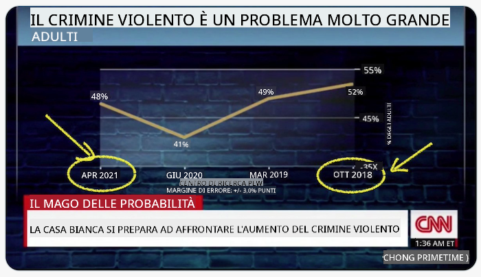
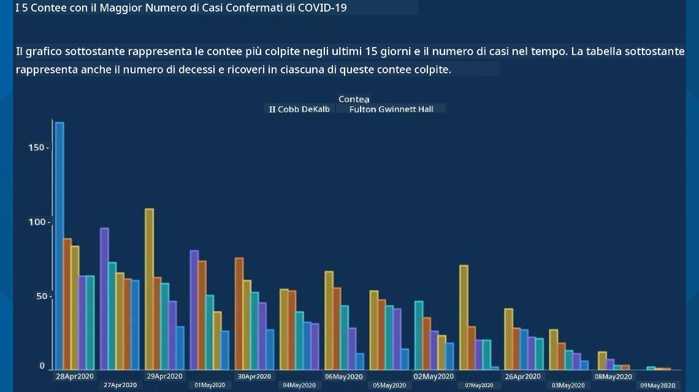
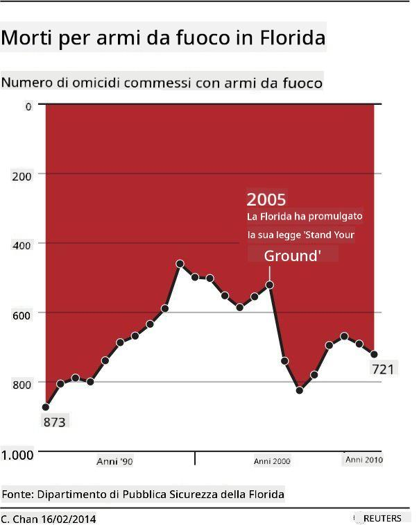
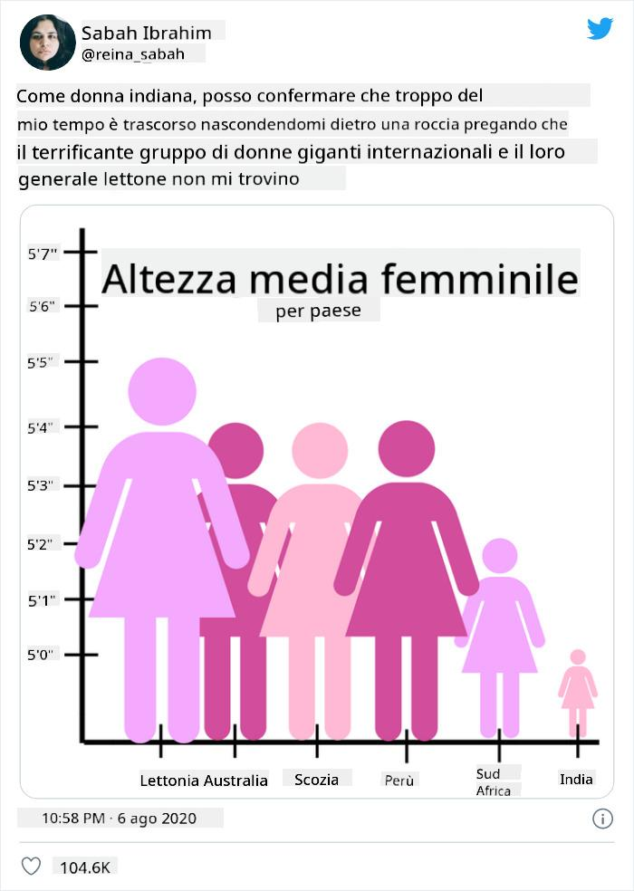
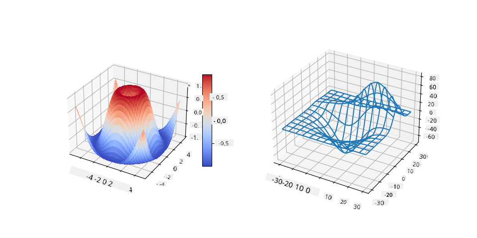
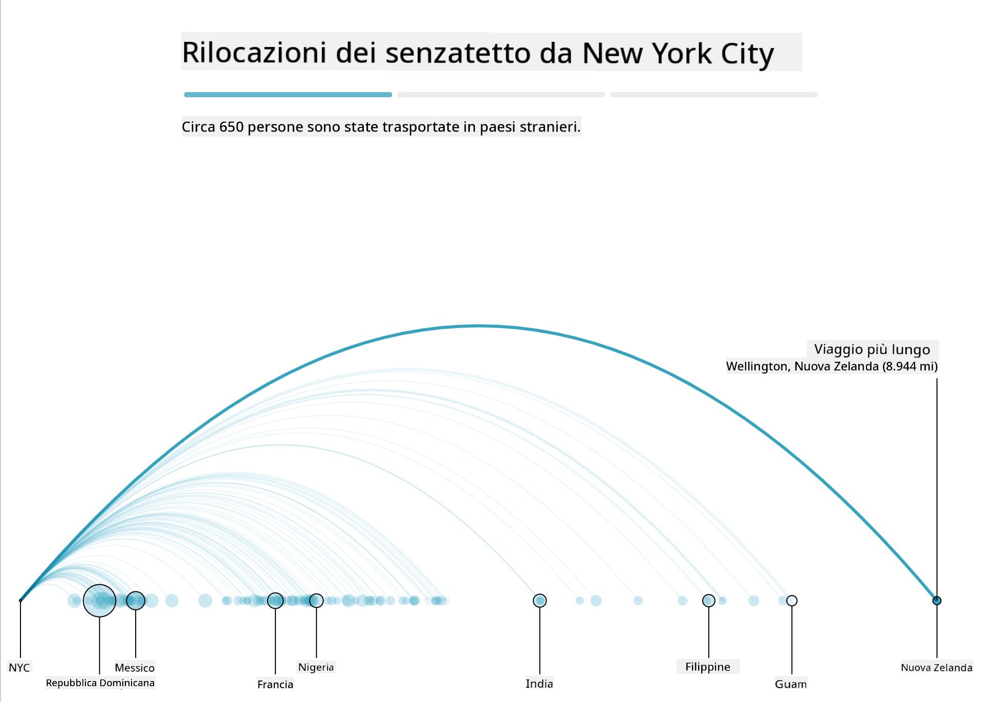
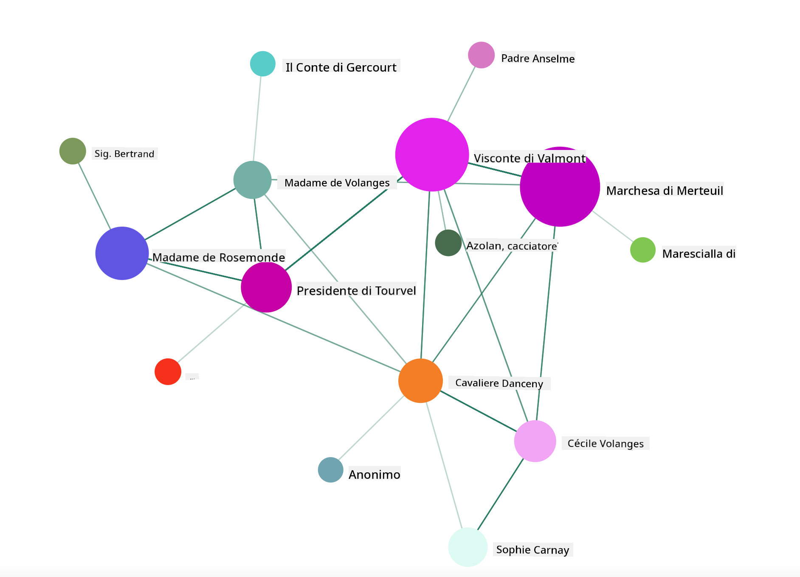

<!--
CO_OP_TRANSLATOR_METADATA:
{
  "original_hash": "0b380bb6d34102bb061eb41de23d9834",
  "translation_date": "2025-09-04T18:00:39+00:00",
  "source_file": "3-Data-Visualization/13-meaningful-visualizations/README.md",
  "language_code": "it"
}
-->
# Creare Visualizzazioni Significative

| ](../../sketchnotes/13-MeaningfulViz.png)|
|:---:|
| Visualizzazioni Significative - _Sketchnote di [@nitya](https://twitter.com/nitya)_ |

> "Se torturi i dati abbastanza a lungo, confesseranno qualsiasi cosa" -- [Ronald Coase](https://en.wikiquote.org/wiki/Ronald_Coase)

Una delle competenze fondamentali di un data scientist è la capacità di creare una visualizzazione dei dati significativa che aiuti a rispondere alle domande che si potrebbero avere. Prima di visualizzare i dati, è necessario assicurarsi che siano stati puliti e preparati, come fatto nelle lezioni precedenti. Dopo di ciò, si può iniziare a decidere come presentare al meglio i dati.

In questa lezione, esaminerai:

1. Come scegliere il tipo di grafico giusto
2. Come evitare grafici ingannevoli
3. Come lavorare con i colori
4. Come stilizzare i grafici per migliorarne la leggibilità
5. Come creare soluzioni di grafici animati o in 3D
6. Come costruire una visualizzazione creativa

## [Quiz Pre-Lezione](https://purple-hill-04aebfb03.1.azurestaticapps.net/quiz/24)

## Scegliere il tipo di grafico giusto

Nelle lezioni precedenti, hai sperimentato la creazione di vari tipi di visualizzazioni dei dati utilizzando Matplotlib e Seaborn. In generale, puoi selezionare il [tipo di grafico giusto](https://chartio.com/learn/charts/how-to-select-a-data-vizualization/) per la domanda che stai ponendo utilizzando questa tabella:

| Necessità:                 | Dovresti usare:                 |
| -------------------------- | ------------------------------- |
| Mostrare tendenze nel tempo | Linea                          |
| Confrontare categorie       | Barre, Torta                   |
| Confrontare totali          | Torta, Barre impilate          |
| Mostrare relazioni          | Dispersione, Linea, Facet, Linea doppia |
| Mostrare distribuzioni      | Dispersione, Istogramma, Box   |
| Mostrare proporzioni        | Torta, Donut, Waffle           |

> ✅ A seconda della composizione dei tuoi dati, potrebbe essere necessario convertirli da testo a numerico per supportare un determinato tipo di grafico.

## Evitare inganni

Anche se un data scientist sceglie con attenzione il grafico giusto per i dati giusti, ci sono molti modi in cui i dati possono essere visualizzati per dimostrare un punto, spesso a scapito della veridicità dei dati stessi. Esistono molti esempi di grafici e infografiche ingannevoli!

[](https://www.youtube.com/watch?v=oX74Nge8Wkw "How charts lie")

> 🎥 Clicca sull'immagine sopra per una conferenza sui grafici ingannevoli

Questo grafico inverte l'asse X per mostrare l'opposto della verità, basandosi sulla data:



[Questo grafico](https://media.firstcoastnews.com/assets/WTLV/images/170ae16f-4643-438f-b689-50d66ca6a8d8/170ae16f-4643-438f-b689-50d66ca6a8d8_1140x641.jpg) è ancora più ingannevole, poiché l'occhio è attirato verso destra per concludere che, nel tempo, i casi di COVID sono diminuiti nelle varie contee. In realtà, se guardi attentamente le date, scopri che sono state riorganizzate per creare questa falsa tendenza al ribasso.



Questo esempio noto utilizza il colore E un asse Y invertito per ingannare: invece di concludere che le morti per armi da fuoco sono aumentate dopo l'approvazione di una legislazione favorevole alle armi, l'occhio è ingannato a pensare che sia vero il contrario:



Questo strano grafico mostra come le proporzioni possano essere manipolate, con effetti esilaranti:



Confrontare l'incomparabile è un altro trucco discutibile. Esiste un [sito web meraviglioso](https://tylervigen.com/spurious-correlations) dedicato alle 'correlazioni spurie' che mostra 'fatti' correlando cose come il tasso di divorzi nel Maine e il consumo di margarina. Un gruppo su Reddit raccoglie anche gli [usi brutti](https://www.reddit.com/r/dataisugly/top/?t=all) dei dati.

È importante capire quanto facilmente l'occhio possa essere ingannato da grafici ingannevoli. Anche se l'intenzione del data scientist è buona, la scelta di un tipo di grafico sbagliato, come un grafico a torta con troppe categorie, può risultare ingannevole.

## Colore

Hai visto nel grafico sulla 'violenza con armi da fuoco in Florida' come il colore possa fornire un ulteriore livello di significato ai grafici, specialmente quelli non progettati utilizzando librerie come Matplotlib e Seaborn che offrono varie librerie e palette di colori verificate. Se stai creando un grafico manualmente, studia un po' la [teoria del colore](https://colormatters.com/color-and-design/basic-color-theory).

> ✅ Quando progetti grafici, tieni presente che l'accessibilità è un aspetto importante della visualizzazione. Alcuni utenti potrebbero essere daltonici - il tuo grafico è leggibile per utenti con disabilità visive?

Fai attenzione quando scegli i colori per il tuo grafico, poiché il colore può trasmettere significati che potresti non intendere. Le 'signore in rosa' nel grafico sull'altezza sopra trasmettono un significato distintamente 'femminile' che aggiunge alla stranezza del grafico stesso.

Sebbene il [significato del colore](https://colormatters.com/color-symbolism/the-meanings-of-colors) possa variare in diverse parti del mondo e tendere a cambiare in base alla tonalità, generalmente i significati dei colori includono:

| Colore  | Significato         |
| ------- | ------------------- |
| rosso   | potere              |
| blu     | fiducia, lealtà     |
| giallo  | felicità, cautela   |
| verde   | ecologia, fortuna, invidia |
| viola   | felicità            |
| arancione| vivacità           |

Se ti viene chiesto di creare un grafico con colori personalizzati, assicurati che i tuoi grafici siano accessibili e che il colore scelto coincida con il significato che stai cercando di trasmettere.

## Stilizzare i grafici per la leggibilità

I grafici non sono significativi se non sono leggibili! Prenditi un momento per considerare lo stile della larghezza e altezza del tuo grafico per adattarlo bene ai tuoi dati. Se una variabile (come tutti i 50 stati) deve essere visualizzata, mostrala verticalmente sull'asse Y se possibile, per evitare un grafico con scorrimento orizzontale.

Etichetta gli assi, fornisci una legenda se necessario e offri tooltip per una migliore comprensione dei dati.

Se i tuoi dati sono testuali e verbosi sull'asse X, puoi angolare il testo per migliorarne la leggibilità. [Matplotlib](https://matplotlib.org/stable/tutorials/toolkits/mplot3d.html) offre la possibilità di creare grafici in 3D, se i tuoi dati lo supportano. Visualizzazioni sofisticate possono essere prodotte utilizzando `mpl_toolkits.mplot3d`.



## Animazione e visualizzazione di grafici in 3D

Alcune delle migliori visualizzazioni dei dati oggi sono animate. Shirley Wu ha creato visualizzazioni straordinarie con D3, come '[film flowers](http://bl.ocks.org/sxywu/raw/d612c6c653fb8b4d7ff3d422be164a5d/)', dove ogni fiore è una visualizzazione di un film. Un altro esempio per il Guardian è 'bussed out', un'esperienza interattiva che combina visualizzazioni con Greensock e D3, oltre a un formato di articolo scrollytelling per mostrare come NYC gestisce il problema dei senzatetto bussando le persone fuori dalla città.



> "Bussed Out: How America Moves its Homeless" dal [Guardian](https://www.theguardian.com/us-news/ng-interactive/2017/dec/20/bussed-out-america-moves-homeless-people-country-study). Visualizzazioni di Nadieh Bremer & Shirley Wu

Sebbene questa lezione non sia sufficiente per approfondire l'insegnamento di queste potenti librerie di visualizzazione, prova a utilizzare D3 in un'app Vue.js utilizzando una libreria per visualizzare il libro "Le relazioni pericolose" come una rete sociale animata.

> "Le relazioni pericolose" è un romanzo epistolare, ovvero un romanzo presentato come una serie di lettere. Scritto nel 1782 da Choderlos de Laclos, racconta la storia delle manovre sociali spietate e moralmente corrotte di due protagonisti in duello dell'aristocrazia francese del tardo XVIII secolo, il Visconte di Valmont e la Marchesa di Merteuil. Entrambi incontrano la loro fine, ma non senza infliggere un grande danno sociale. Il romanzo si sviluppa come una serie di lettere scritte a varie persone nei loro circoli, tramando vendette o semplicemente per creare problemi. Crea una visualizzazione di queste lettere per scoprire i principali protagonisti della narrazione, visivamente.

Completerai un'app web che visualizzerà una vista animata di questa rete sociale. Utilizza una libreria costruita per creare una [visualizzazione di una rete](https://github.com/emiliorizzo/vue-d3-network) utilizzando Vue.js e D3. Quando l'app è in esecuzione, puoi spostare i nodi sullo schermo per riorganizzare i dati.



## Progetto: Crea un grafico per mostrare una rete usando D3.js

> Questa cartella della lezione include una cartella `solution` dove puoi trovare il progetto completato, per riferimento.

1. Segui le istruzioni nel file README.md nella cartella radice dello starter. Assicurati di avere NPM e Node.js in esecuzione sulla tua macchina prima di installare le dipendenze del progetto.

2. Apri la cartella `starter/src`. Troverai una cartella `assets` dove puoi trovare un file .json con tutte le lettere del romanzo, numerate, con annotazioni 'to' e 'from'.

3. Completa il codice in `components/Nodes.vue` per abilitare la visualizzazione. Cerca il metodo chiamato `createLinks()` e aggiungi il seguente ciclo annidato.

Cicla attraverso l'oggetto .json per catturare i dati 'to' e 'from' delle lettere e costruire l'oggetto `links` in modo che la libreria di visualizzazione possa utilizzarlo:

```javascript
//loop through letters
      let f = 0;
      let t = 0;
      for (var i = 0; i < letters.length; i++) {
          for (var j = 0; j < characters.length; j++) {
              
            if (characters[j] == letters[i].from) {
              f = j;
            }
            if (characters[j] == letters[i].to) {
              t = j;
            }
        }
        this.links.push({ sid: f, tid: t });
      }
  ```

Esegui la tua app dal terminale (npm run serve) e goditi la visualizzazione!

## 🚀 Sfida

Fai un giro su internet per scoprire visualizzazioni ingannevoli. Come l'autore inganna l'utente, e lo fa intenzionalmente? Prova a correggere le visualizzazioni per mostrare come dovrebbero apparire.

## [Quiz Post-Lezione](https://ff-quizzes.netlify.app/en/ds/)

## Revisione & Studio Autonomo

Ecco alcuni articoli da leggere sulle visualizzazioni dei dati ingannevoli:

https://gizmodo.com/how-to-lie-with-data-visualization-1563576606

http://ixd.prattsi.org/2017/12/visual-lies-usability-in-deceptive-data-visualizations/

Dai un'occhiata a queste interessanti visualizzazioni di beni e artefatti storici:

https://handbook.pubpub.org/

Leggi questo articolo su come l'animazione può migliorare le tue visualizzazioni:

https://medium.com/@EvanSinar/use-animation-to-supercharge-data-visualization-cd905a882ad4

## Compito

[Crea la tua visualizzazione personalizzata](assignment.md)

---

**Disclaimer**:  
Questo documento è stato tradotto utilizzando il servizio di traduzione automatica [Co-op Translator](https://github.com/Azure/co-op-translator). Sebbene ci impegniamo per garantire l'accuratezza, si prega di notare che le traduzioni automatiche possono contenere errori o imprecisioni. Il documento originale nella sua lingua nativa dovrebbe essere considerato la fonte autorevole. Per informazioni critiche, si raccomanda una traduzione professionale effettuata da un traduttore umano. Non siamo responsabili per eventuali incomprensioni o interpretazioni errate derivanti dall'uso di questa traduzione.