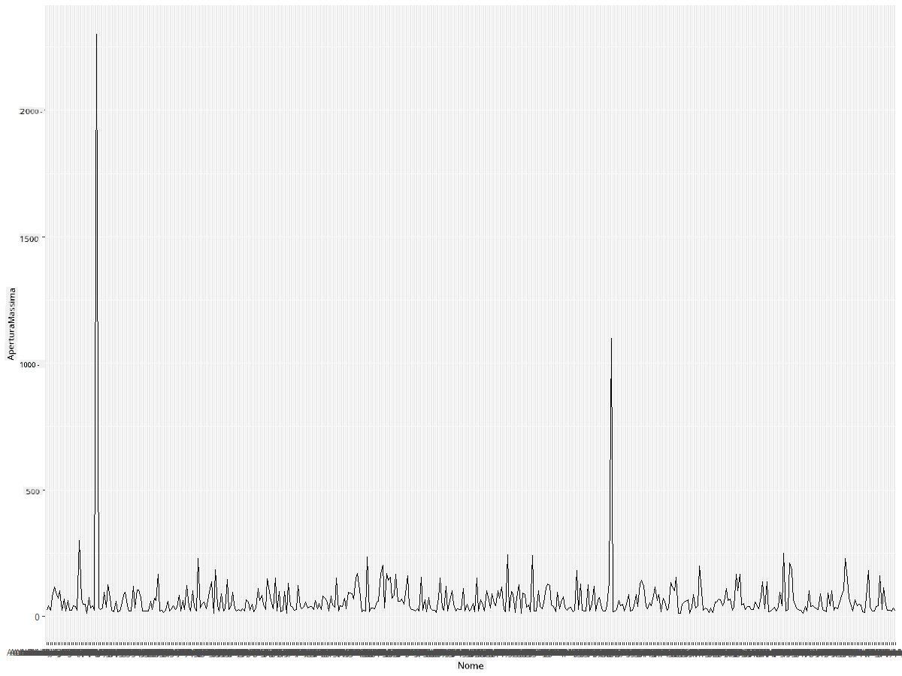
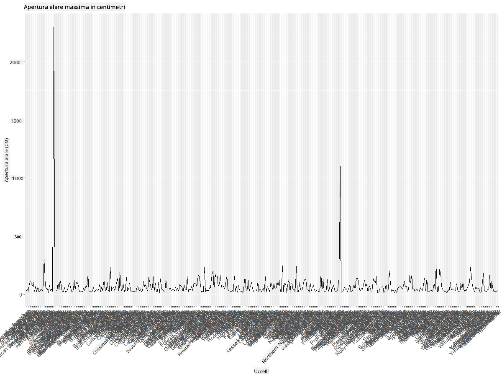
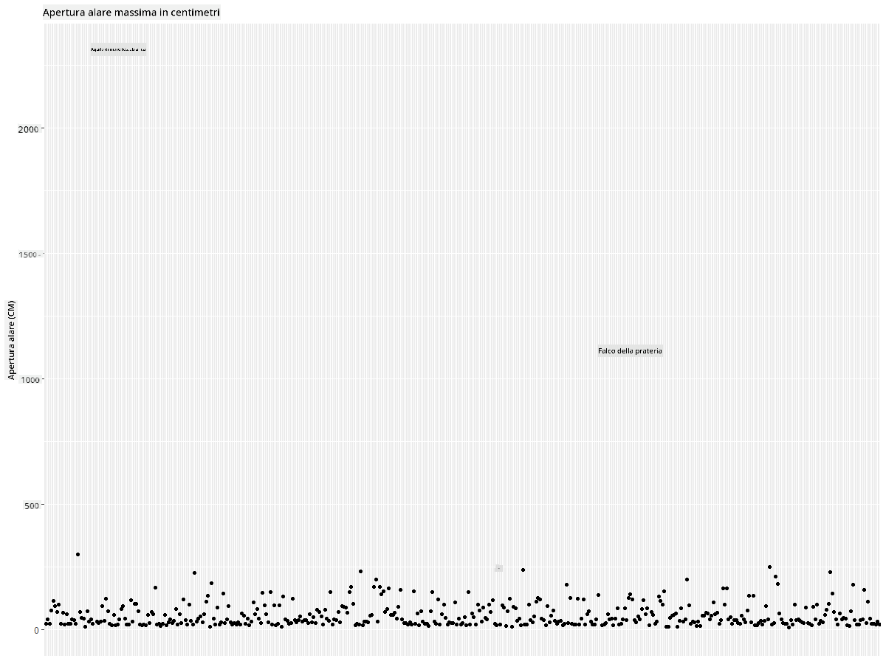
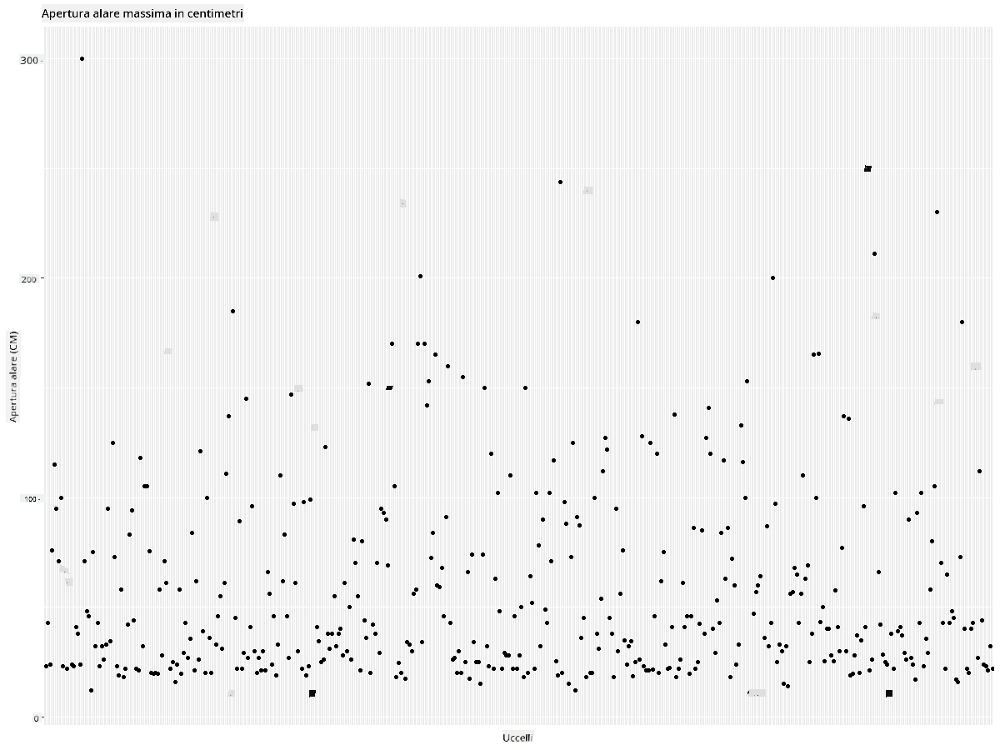
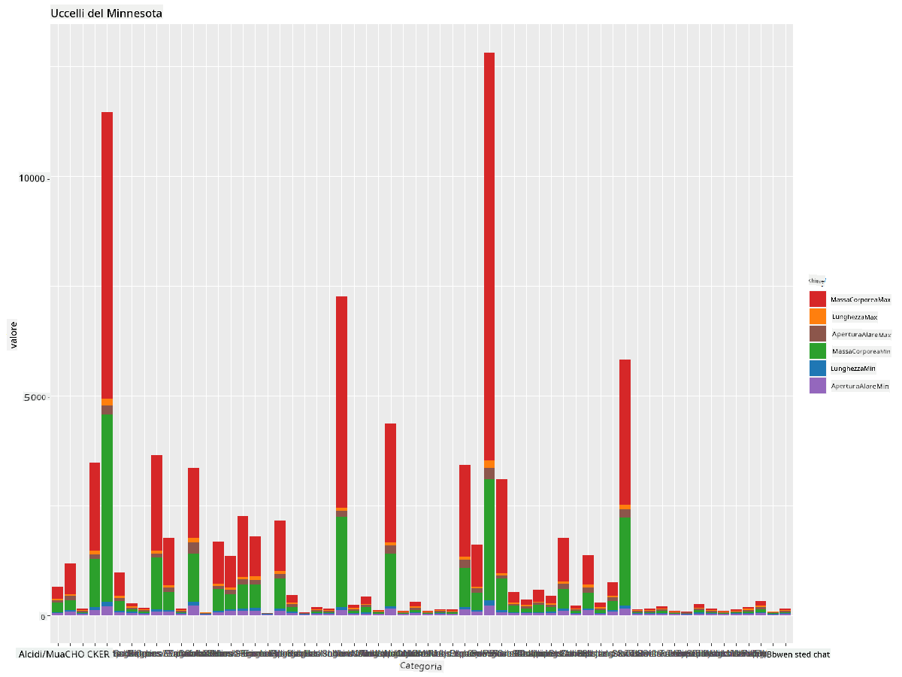
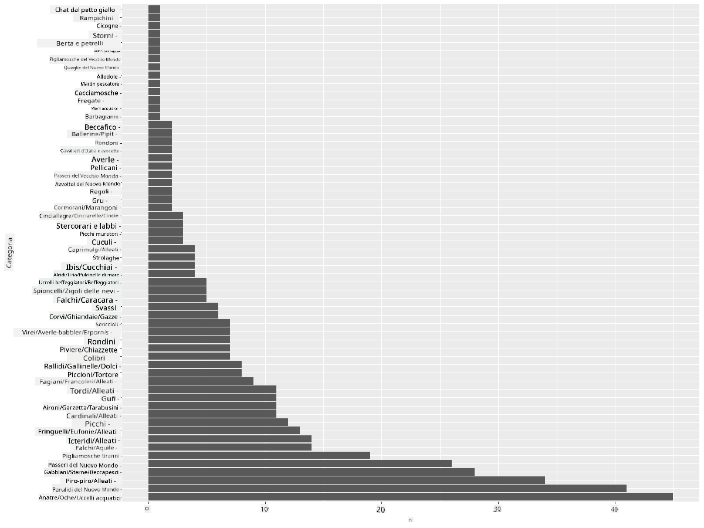
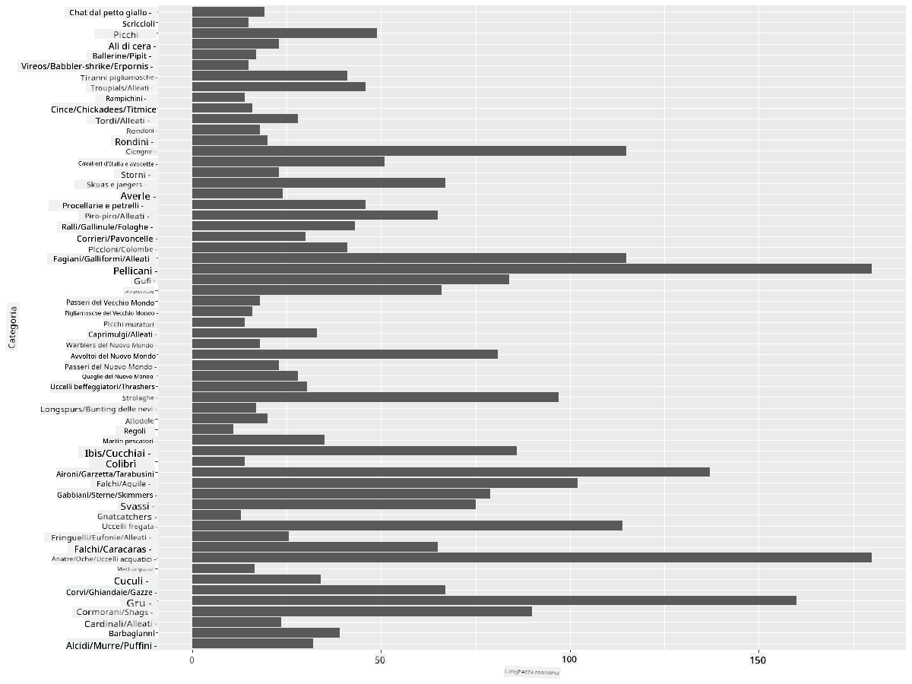
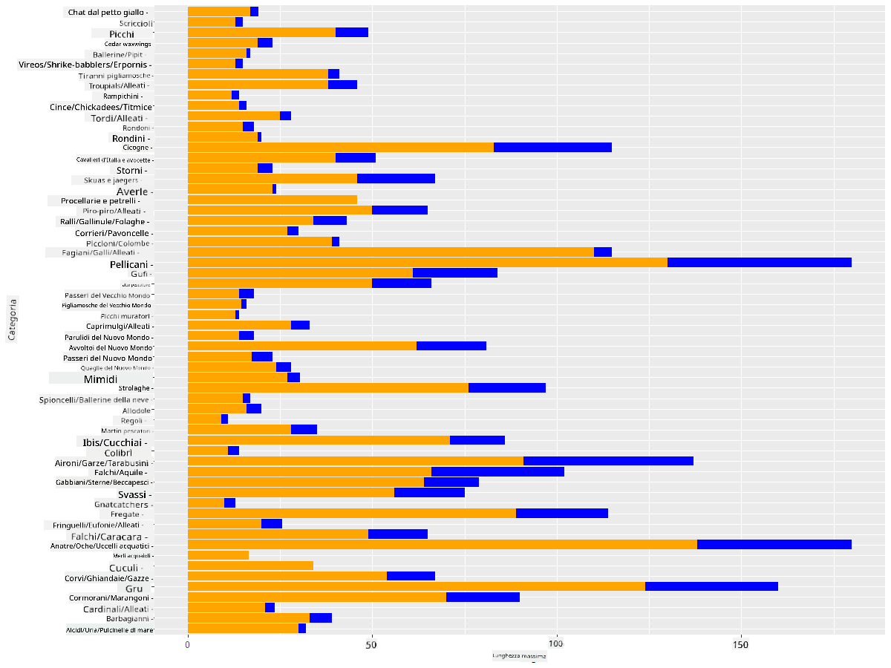

<!--
CO_OP_TRANSLATOR_METADATA:
{
  "original_hash": "22acf28f518a4769ea14fa42f4734b9f",
  "translation_date": "2025-08-28T11:04:42+00:00",
  "source_file": "3-Data-Visualization/R/09-visualization-quantities/README.md",
  "language_code": "it"
}
-->
# Visualizzare le Quantità
| ](https://github.com/microsoft/Data-Science-For-Beginners/blob/main/sketchnotes/09-Visualizing-Quantities.png)|
|:---:|
| Visualizzare le Quantità - _Sketchnote di [@nitya](https://twitter.com/nitya)_ |

In questa lezione esplorerai come utilizzare alcune delle numerose librerie disponibili nei pacchetti R per imparare a creare visualizzazioni interessanti attorno al concetto di quantità. Utilizzando un dataset pulito sugli uccelli del Minnesota, potrai scoprire molti fatti interessanti sulla fauna locale.  
## [Quiz pre-lezione](https://purple-hill-04aebfb03.1.azurestaticapps.net/quiz/16)

## Osservare l'apertura alare con ggplot2
Una libreria eccellente per creare grafici e diagrammi, sia semplici che sofisticati, è [ggplot2](https://cran.r-project.org/web/packages/ggplot2/index.html). In termini generali, il processo di creazione di grafici utilizzando queste librerie include l'identificazione delle parti del dataframe da analizzare, l'esecuzione di eventuali trasformazioni necessarie sui dati, l'assegnazione dei valori degli assi x e y, la scelta del tipo di grafico da mostrare e infine la visualizzazione del grafico.

`ggplot2` è un sistema per creare grafici in modo dichiarativo, basato sulla "Grammatica dei Grafici". La [Grammatica dei Grafici](https://en.wikipedia.org/wiki/Ggplot2) è uno schema generale per la visualizzazione dei dati che suddivide i grafici in componenti semantiche come scale e livelli. In altre parole, la facilità con cui è possibile creare grafici per dati univariati o multivariati con poco codice rende `ggplot2` il pacchetto più popolare per le visualizzazioni in R. L'utente indica a `ggplot2` come mappare le variabili agli aspetti estetici, quali primitive grafiche utilizzare, e `ggplot2` si occupa del resto.

> ✅ Grafico = Dati + Aspetti Estetici + Geometria  
> - I dati si riferiscono al dataset  
> - Gli aspetti estetici indicano le variabili da analizzare (variabili x e y)  
> - La geometria si riferisce al tipo di grafico (grafico a linee, a barre, ecc.)

Scegli la geometria (tipo di grafico) più adatta in base ai tuoi dati e alla storia che vuoi raccontare attraverso il grafico.

> - Per analizzare tendenze: linee, colonne  
> - Per confrontare valori: barre, colonne, torta, scatterplot  
> - Per mostrare come le parti si relazionano al tutto: torta  
> - Per mostrare la distribuzione dei dati: scatterplot, barre  
> - Per mostrare relazioni tra valori: linee, scatterplot, bolle  

✅ Puoi anche consultare questo utile [cheatsheet](https://nyu-cdsc.github.io/learningr/assets/data-visualization-2.1.pdf) per ggplot2.

## Creare un grafico a linee sui valori dell'apertura alare degli uccelli

Apri la console R e importa il dataset.  
> Nota: Il dataset è memorizzato nella radice di questo repository nella cartella `/data`.

Importiamo il dataset e osserviamo le prime righe (top 5) dei dati.

```r
birds <- read.csv("../../data/birds.csv",fileEncoding="UTF-8-BOM")
head(birds)
```  
L'intestazione dei dati contiene un mix di testo e numeri:

|      | Nome                         | NomeScientifico        | Categoria             | Ordine       | Famiglia | Genere      | StatoConservazione  | LungMin | LungMax | MassaCorpMin | MassaCorpMax | AperturaMin | AperturaMax |
| ---: | :--------------------------- | :--------------------- | :-------------------- | :----------- | :------- | :---------- | :------------------ | -------:| -------:| ------------:| ------------:| -----------:| -----------:|
|    0 | Anatra fischiante ventre nero | Dendrocygna autumnalis | Anatre/Oche/UccelliAcquatici | Anseriformes | Anatidae | Dendrocygna | LC                 |        47 |        56 |         652 |        1020 |          76 |          94 |
|    1 | Anatra fischiante fulva       | Dendrocygna bicolor    | Anatre/Oche/UccelliAcquatici | Anseriformes | Anatidae | Dendrocygna | LC                 |        45 |        53 |         712 |        1050 |          85 |          93 |
|    2 | Oca delle nevi                | Anser caerulescens     | Anatre/Oche/UccelliAcquatici | Anseriformes | Anatidae | Anser       | LC                 |        64 |        79 |        2050 |        4050 |         135 |         165 |
|    3 | Oca di Ross                   | Anser rossii           | Anatre/Oche/UccelliAcquatici | Anseriformes | Anatidae | Anser       | LC                 |      57.3 |        64 |        1066 |        1567 |         113 |         116 |
|    4 | Oca fronte bianca maggiore    | Anser albifrons        | Anatre/Oche/UccelliAcquatici | Anseriformes | Anatidae | Anser       | LC                 |        64 |        81 |        1930 |        3310 |         130 |         165 |

Iniziamo a tracciare alcuni dati numerici utilizzando un semplice grafico a linee. Supponiamo di voler visualizzare l'apertura alare massima di questi interessanti uccelli.

```r
install.packages("ggplot2")
library("ggplot2")
ggplot(data=birds, aes(x=Name, y=MaxWingspan,group=1)) +
  geom_line() 
```  
Qui, installi il pacchetto `ggplot2` e lo importi nello spazio di lavoro utilizzando il comando `library("ggplot2")`. Per tracciare un grafico in ggplot, si utilizza la funzione `ggplot()` specificando il dataset e le variabili x e y come attributi. In questo caso, utilizziamo la funzione `geom_line()` poiché vogliamo creare un grafico a linee.



Cosa noti immediatamente? Sembra esserci almeno un valore anomalo: che apertura alare! Un'apertura alare di oltre 2000 centimetri equivale a più di 20 metri: ci sono Pterodattili che volano in Minnesota? Indaghiamo.

Anche se potresti fare un rapido ordinamento in Excel per trovare questi valori anomali, che probabilmente sono errori di battitura, continua il processo di visualizzazione lavorando direttamente dal grafico.

Aggiungi etichette all'asse x per mostrare di quali uccelli si tratta:

```r
ggplot(data=birds, aes(x=Name, y=MaxWingspan,group=1)) +
  geom_line() +
  theme(axis.text.x = element_text(angle = 45, hjust=1))+
  xlab("Birds") +
  ylab("Wingspan (CM)") +
  ggtitle("Max Wingspan in Centimeters")
```  
Specifichiamo l'angolo nel `theme` e indichiamo le etichette degli assi x e y con `xlab()` e `ylab()` rispettivamente. La funzione `ggtitle()` assegna un titolo al grafico.



Anche con la rotazione delle etichette impostata a 45 gradi, ce ne sono troppe per essere leggibili. Proviamo una strategia diversa: etichettiamo solo i valori anomali e posizioniamo le etichette all'interno del grafico. Puoi utilizzare un grafico a dispersione per avere più spazio per le etichette:

```r
ggplot(data=birds, aes(x=Name, y=MaxWingspan,group=1)) +
  geom_point() +
  geom_text(aes(label=ifelse(MaxWingspan>500,as.character(Name),'')),hjust=0,vjust=0) + 
  theme(axis.title.x=element_blank(), axis.text.x=element_blank(), axis.ticks.x=element_blank())
  ylab("Wingspan (CM)") +
  ggtitle("Max Wingspan in Centimeters") + 
```  
Cosa succede qui? Hai utilizzato la funzione `geom_point()` per tracciare punti di dispersione. Con questo, hai aggiunto etichette per gli uccelli con `MaxWingspan > 500` e hai anche nascosto le etichette sull'asse x per ridurre il disordine nel grafico.

Cosa scopri?



## Filtrare i dati

Sia l'Aquila Calva che il Falco delle Praterie, pur essendo probabilmente uccelli molto grandi, sembrano essere etichettati in modo errato, con uno zero in più aggiunto alla loro apertura alare massima. È improbabile che tu incontri un'Aquila Calva con un'apertura alare di 25 metri, ma se succede, faccelo sapere! Creiamo un nuovo dataframe senza quei due valori anomali:

```r
birds_filtered <- subset(birds, MaxWingspan < 500)

ggplot(data=birds_filtered, aes(x=Name, y=MaxWingspan,group=1)) +
  geom_point() +
  ylab("Wingspan (CM)") +
  xlab("Birds") +
  ggtitle("Max Wingspan in Centimeters") + 
  geom_text(aes(label=ifelse(MaxWingspan>500,as.character(Name),'')),hjust=0,vjust=0) +
  theme(axis.text.x=element_blank(), axis.ticks.x=element_blank())
```  
Abbiamo creato un nuovo dataframe `birds_filtered` e poi tracciato un grafico a dispersione. Filtrando i valori anomali, i tuoi dati ora sono più coerenti e comprensibili.



Ora che abbiamo un dataset più pulito almeno in termini di apertura alare, scopriamo di più su questi uccelli.

Mentre i grafici a linee e a dispersione possono mostrare informazioni sui valori dei dati e le loro distribuzioni, vogliamo riflettere sui valori intrinseci di questo dataset. Potresti creare visualizzazioni per rispondere alle seguenti domande sulle quantità:

> Quante categorie di uccelli ci sono e quali sono i loro numeri?  
> Quanti uccelli sono estinti, in pericolo, rari o comuni?  
> Quanti ce ne sono dei vari generi e ordini nella terminologia di Linneo?  

## Esplorare i grafici a barre

I grafici a barre sono pratici quando devi mostrare raggruppamenti di dati. Esploriamo le categorie di uccelli presenti in questo dataset per vedere quale è la più comune per numero.  
Creiamo un grafico a barre sui dati filtrati.

```r
install.packages("dplyr")
install.packages("tidyverse")

library(lubridate)
library(scales)
library(dplyr)
library(ggplot2)
library(tidyverse)

birds_filtered %>% group_by(Category) %>%
  summarise(n=n(),
  MinLength = mean(MinLength),
  MaxLength = mean(MaxLength),
  MinBodyMass = mean(MinBodyMass),
  MaxBodyMass = mean(MaxBodyMass),
  MinWingspan=mean(MinWingspan),
  MaxWingspan=mean(MaxWingspan)) %>% 
  gather("key", "value", - c(Category, n)) %>%
  ggplot(aes(x = Category, y = value, group = key, fill = key)) +
  geom_bar(stat = "identity") +
  scale_fill_manual(values = c("#D62728", "#FF7F0E", "#8C564B","#2CA02C", "#1F77B4", "#9467BD")) +                   
  xlab("Category")+ggtitle("Birds of Minnesota")

```  
Nel seguente snippet, installiamo i pacchetti [dplyr](https://www.rdocumentation.org/packages/dplyr/versions/0.7.8) e [lubridate](https://www.rdocumentation.org/packages/lubridate/versions/1.8.0) per aiutare a manipolare e raggruppare i dati al fine di tracciare un grafico a barre impilate. Prima, raggruppi i dati per la `Categoria` degli uccelli e poi riassumi le colonne `MinLength`, `MaxLength`, `MinBodyMass`, `MaxBodyMass`, `MinWingspan`, `MaxWingspan`. Poi, tracci il grafico a barre utilizzando il pacchetto `ggplot2` specificando i colori per le diverse categorie e le etichette.



Questo grafico a barre, tuttavia, è illeggibile perché ci sono troppi dati non raggruppati. Devi selezionare solo i dati che vuoi tracciare, quindi osserviamo la lunghezza degli uccelli in base alla loro categoria.

Filtra i tuoi dati per includere solo la categoria degli uccelli.

Poiché ci sono molte categorie, puoi visualizzare questo grafico verticalmente e regolare la sua altezza per includere tutti i dati:

```r
birds_count<-dplyr::count(birds_filtered, Category, sort = TRUE)
birds_count$Category <- factor(birds_count$Category, levels = birds_count$Category)
ggplot(birds_count,aes(Category,n))+geom_bar(stat="identity")+coord_flip()
```  
Prima conti i valori unici nella colonna `Categoria` e poi li ordini in un nuovo dataframe `birds_count`. Questi dati ordinati vengono poi fattorizzati allo stesso livello in modo che vengano tracciati in ordine. Utilizzando `ggplot2`, tracci i dati in un grafico a barre. La funzione `coord_flip()` traccia barre orizzontali.



Questo grafico a barre mostra una buona panoramica del numero di uccelli in ogni categoria. A colpo d'occhio, vedi che il maggior numero di uccelli in questa regione appartiene alla categoria Anatre/Oche/UccelliAcquatici. Il Minnesota è la "terra dei 10.000 laghi", quindi non è sorprendente!

✅ Prova a fare altri conteggi su questo dataset. C'è qualcosa che ti sorprende?

## Confrontare i dati

Puoi provare diversi confronti di dati raggruppati creando nuovi assi. Prova un confronto della lunghezza massima di un uccello, basato sulla sua categoria:

```r
birds_grouped <- birds_filtered %>%
  group_by(Category) %>%
  summarise(
  MaxLength = max(MaxLength, na.rm = T),
  MinLength = max(MinLength, na.rm = T)
           ) %>%
  arrange(Category)
  
ggplot(birds_grouped,aes(Category,MaxLength))+geom_bar(stat="identity")+coord_flip()
```  
Raggruppiamo i dati `birds_filtered` per `Categoria` e poi tracciamo un grafico a barre.



Nulla di sorprendente qui: i colibrì hanno la lunghezza massima più bassa rispetto ai Pellicani o alle Oche. È positivo quando i dati hanno senso logico!

Puoi creare visualizzazioni più interessanti di grafici a barre sovrapponendo i dati. Sovrapponiamo la Lunghezza Minima e Massima su una determinata categoria di uccelli:

```r
ggplot(data=birds_grouped, aes(x=Category)) +
  geom_bar(aes(y=MaxLength), stat="identity", position ="identity",  fill='blue') +
  geom_bar(aes(y=MinLength), stat="identity", position="identity", fill='orange')+
  coord_flip()
```  


## 🚀 Sfida

Questo dataset sugli uccelli offre una ricchezza di informazioni su diversi tipi di uccelli all'interno di un particolare ecosistema. Cerca su internet e vedi se riesci a trovare altri dataset sugli uccelli. Esercitati a costruire grafici e diagrammi su questi uccelli per scoprire fatti che non conoscevi.  
## [Quiz post-lezione](https://purple-hill-04aebfb03.1.azurestaticapps.net/quiz/17)

## Revisione e Studio Autonomo

Questa prima lezione ti ha fornito alcune informazioni su come utilizzare `ggplot2` per visualizzare quantità. Fai delle ricerche su altri modi per lavorare con i dataset per la visualizzazione. Cerca e scopri dataset che potresti visualizzare utilizzando altri pacchetti come [Lattice](https://stat.ethz.ch/R-manual/R-devel/library/lattice/html/Lattice.html) e [Plotly](https://github.com/plotly/plotly.R#readme).

## Compito
[Linee, Dispersioni e Barre](assignment.md)

---

**Disclaimer**:  
Questo documento è stato tradotto utilizzando il servizio di traduzione automatica [Co-op Translator](https://github.com/Azure/co-op-translator). Sebbene ci impegniamo per garantire l'accuratezza, si prega di notare che le traduzioni automatiche potrebbero contenere errori o imprecisioni. Il documento originale nella sua lingua nativa dovrebbe essere considerato la fonte autorevole. Per informazioni critiche, si consiglia una traduzione professionale eseguita da un traduttore umano. Non siamo responsabili per eventuali fraintendimenti o interpretazioni errate derivanti dall'uso di questa traduzione.