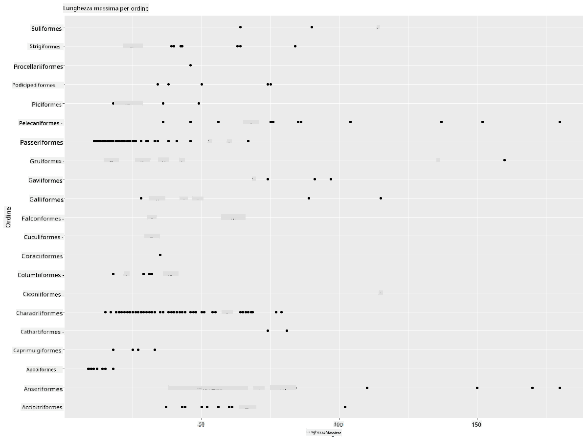
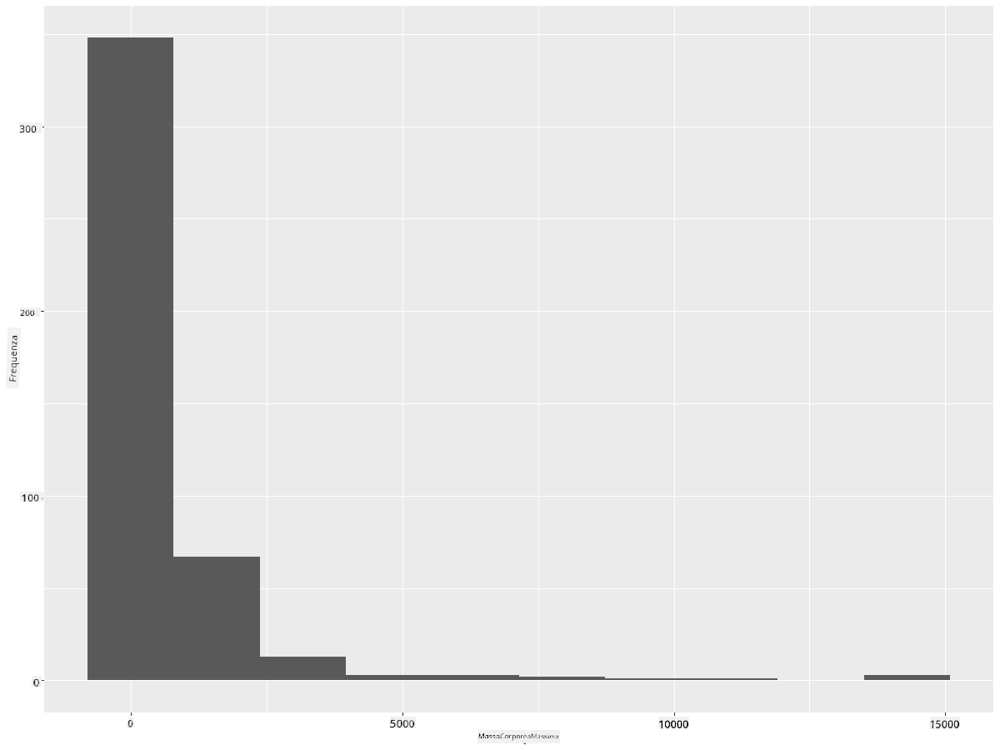
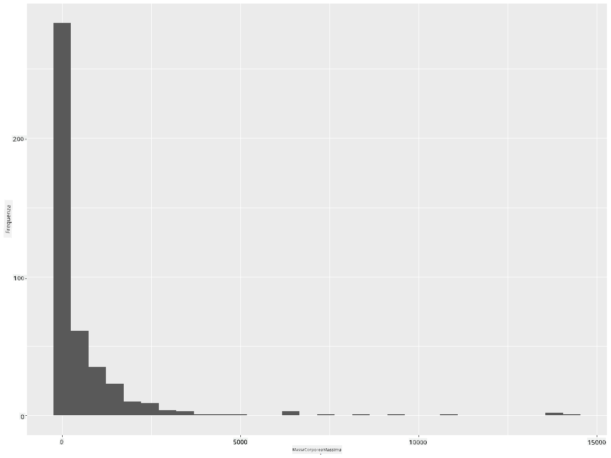
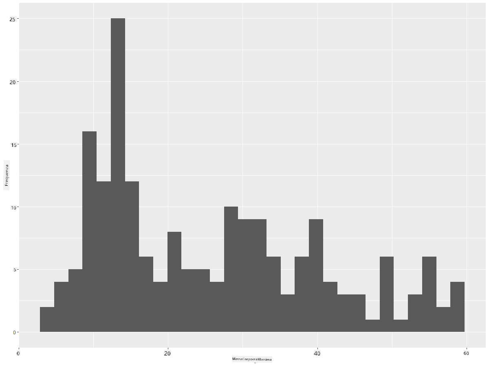
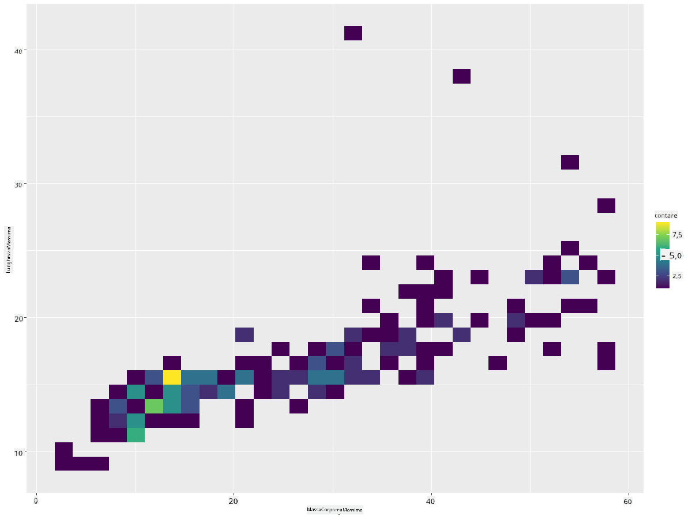
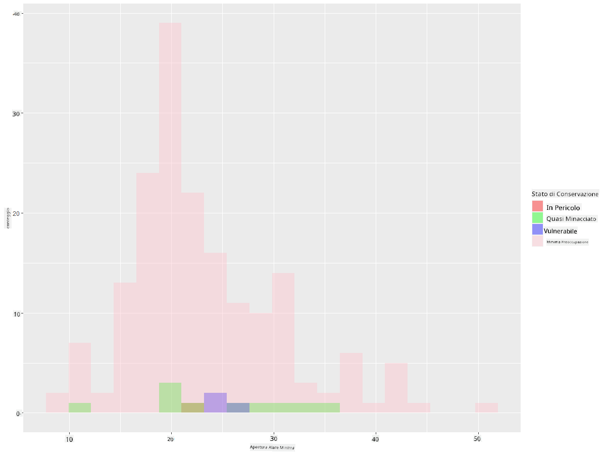
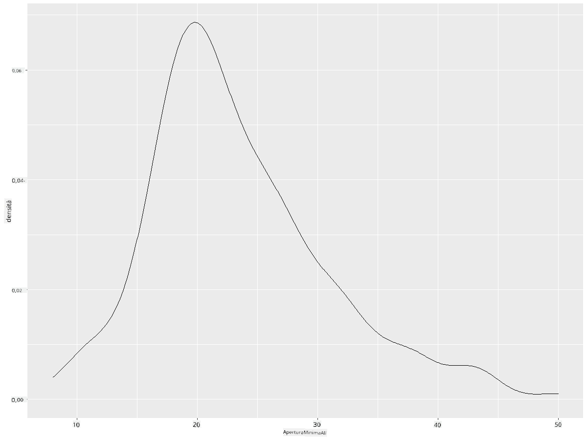
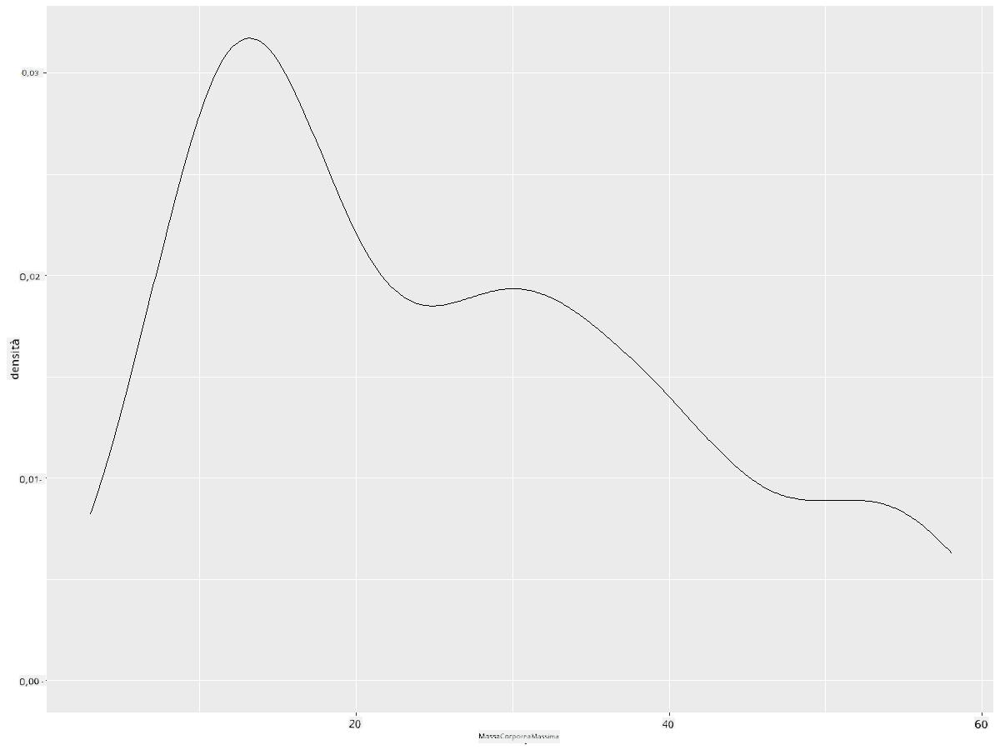
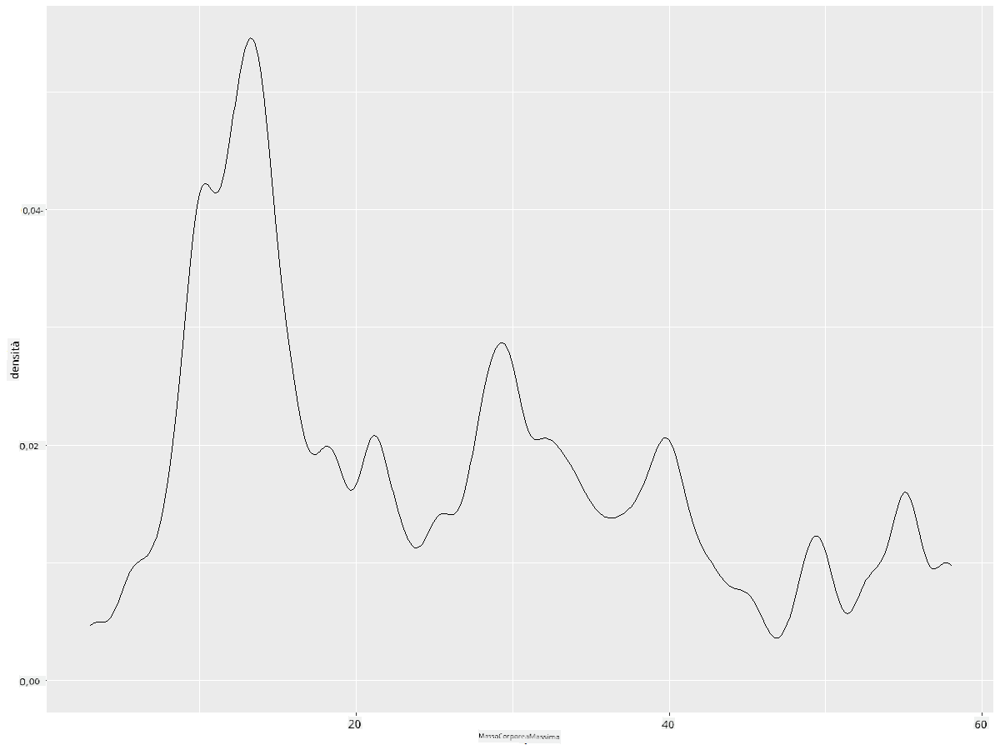
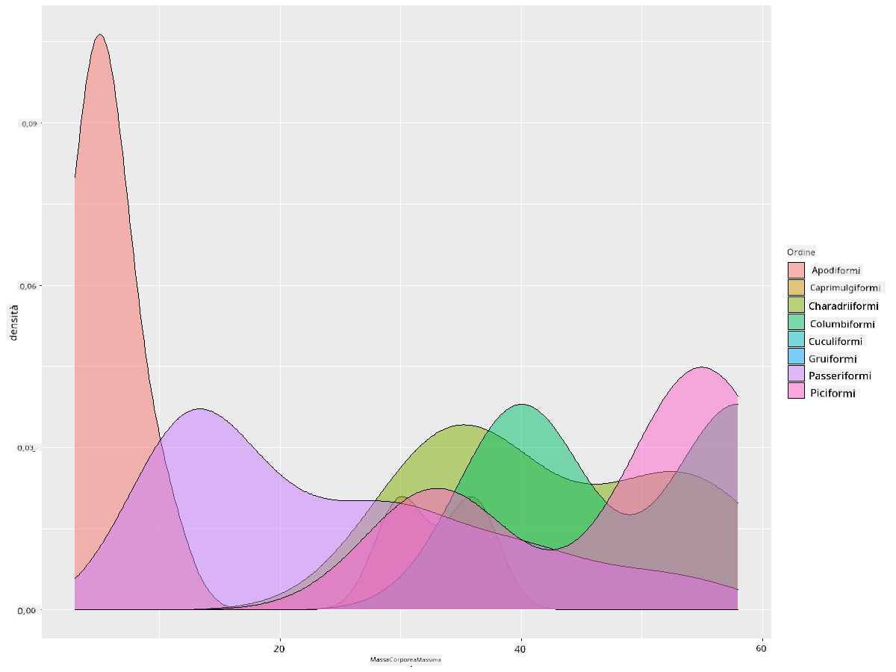

<!--
CO_OP_TRANSLATOR_METADATA:
{
  "original_hash": "ea67c0c40808fd723594de6896c37ccf",
  "translation_date": "2025-08-28T11:07:56+00:00",
  "source_file": "3-Data-Visualization/R/10-visualization-distributions/README.md",
  "language_code": "it"
}
-->
# Visualizzare le distribuzioni

| ](https://github.com/microsoft/Data-Science-For-Beginners/blob/main/sketchnotes/10-Visualizing-Distributions.png)|
|:---:|
| Visualizzare le distribuzioni - _Sketchnote di [@nitya](https://twitter.com/nitya)_ |

Nella lezione precedente, hai imparato alcuni fatti interessanti su un dataset riguardante gli uccelli del Minnesota. Hai individuato alcuni dati errati visualizzando i valori anomali e hai osservato le differenze tra le categorie di uccelli in base alla loro lunghezza massima.

## [Quiz pre-lezione](https://purple-hill-04aebfb03.1.azurestaticapps.net/quiz/18)
## Esplora il dataset sugli uccelli

Un altro modo per analizzare i dati è osservare la loro distribuzione, ovvero come i dati sono organizzati lungo un asse. Forse, ad esempio, vorresti sapere di più sulla distribuzione generale, per questo dataset, dell'apertura alare massima o della massa corporea massima degli uccelli del Minnesota.

Scopriamo alcuni fatti sulle distribuzioni dei dati in questo dataset. Nel tuo console R, importa `ggplot2` e il database. Rimuovi i valori anomali dal database come fatto nell'argomento precedente.

```r
library(ggplot2)

birds <- read.csv("../../data/birds.csv",fileEncoding="UTF-8-BOM")

birds_filtered <- subset(birds, MaxWingspan < 500)
head(birds_filtered)
```
|      | Nome                         | NomeScientifico        | Categoria             | Ordine       | Famiglia | Genere      | StatoConservazione  | MinLunghezza | MaxLunghezza | MinMassaCorporea | MaxMassaCorporea | MinAperturaAlare | MaxAperturaAlare |
| ---: | :--------------------------- | :--------------------- | :-------------------- | :----------- | :------- | :---------- | :----------------- | ------------: | ------------: | ----------------: | ----------------: | ----------------: | ----------------: |
|    0 | Anatra fischiante ventre nero | Dendrocygna autumnalis | Anatre/Oche/Uccelli acquatici | Anseriformes | Anatidae | Dendrocygna | LC                 |            47 |            56 |               652 |              1020 |                76 |                94 |
|    1 | Anatra fischiante fulva       | Dendrocygna bicolor    | Anatre/Oche/Uccelli acquatici | Anseriformes | Anatidae | Dendrocygna | LC                 |            45 |            53 |               712 |              1050 |                85 |                93 |
|    2 | Oca delle nevi                | Anser caerulescens     | Anatre/Oche/Uccelli acquatici | Anseriformes | Anatidae | Anser       | LC                 |            64 |            79 |              2050 |              4050 |               135 |               165 |
|    3 | Oca di Ross                   | Anser rossii           | Anatre/Oche/Uccelli acquatici | Anseriformes | Anatidae | Anser       | LC                 |          57.3 |            64 |              1066 |              1567 |               113 |               116 |
|    4 | Oca fronte bianca maggiore    | Anser albifrons        | Anatre/Oche/Uccelli acquatici | Anseriformes | Anatidae | Anser       | LC                 |            64 |            81 |              1930 |              3310 |               130 |               165 |

In generale, puoi osservare rapidamente come i dati sono distribuiti utilizzando un grafico a dispersione, come fatto nella lezione precedente:

```r
ggplot(data=birds_filtered, aes(x=Order, y=MaxLength,group=1)) +
  geom_point() +
  ggtitle("Max Length per order") + coord_flip()
```


Questo fornisce una panoramica della distribuzione generale della lunghezza corporea per Ordine di uccelli, ma non è il modo ottimale per mostrare le vere distribuzioni. Questo compito è solitamente gestito creando un Istogramma.

## Lavorare con gli istogrammi

`ggplot2` offre ottimi strumenti per visualizzare la distribuzione dei dati utilizzando gli Istogrammi. Questo tipo di grafico è simile a un grafico a barre, dove la distribuzione può essere osservata attraverso l'aumento e la diminuzione delle barre. Per costruire un istogramma, hai bisogno di dati numerici. Per costruire un Istogramma, puoi tracciare un grafico definendo il tipo come 'hist' per Istogramma. Questo grafico mostra la distribuzione della MaxMassaCorporea per l'intero intervallo di dati numerici del dataset. Dividendo l'array di dati in intervalli più piccoli, può mostrare la distribuzione dei valori dei dati:

```r
ggplot(data = birds_filtered, aes(x = MaxBodyMass)) + 
  geom_histogram(bins=10)+ylab('Frequency')
```


Come puoi vedere, la maggior parte dei 400+ uccelli in questo dataset rientra nella fascia sotto i 2000 per la loro Massa Corporea Massima. Ottieni maggiori informazioni sui dati modificando il parametro `bins` a un numero più alto, ad esempio 30:

```r
ggplot(data = birds_filtered, aes(x = MaxBodyMass)) + geom_histogram(bins=30)+ylab('Frequency')
```



Questo grafico mostra la distribuzione in modo un po' più dettagliato. Un grafico meno sbilanciato a sinistra potrebbe essere creato assicurandoti di selezionare solo i dati entro un determinato intervallo:

Filtra i tuoi dati per ottenere solo gli uccelli la cui massa corporea è inferiore a 60 e mostra 30 `bins`:

```r
birds_filtered_1 <- subset(birds_filtered, MaxBodyMass > 1 & MaxBodyMass < 60)
ggplot(data = birds_filtered_1, aes(x = MaxBodyMass)) + 
  geom_histogram(bins=30)+ylab('Frequency')
```



✅ Prova altri filtri e punti dati. Per vedere la distribuzione completa dei dati, rimuovi il filtro `['MaxBodyMass']` per mostrare distribuzioni etichettate.

L'istogramma offre anche alcune belle opzioni di colore e miglioramenti di etichettatura da provare:

Crea un istogramma 2D per confrontare la relazione tra due distribuzioni. Confrontiamo `MaxBodyMass` vs. `MaxLength`. `ggplot2` offre un modo integrato per mostrare la convergenza utilizzando colori più luminosi:

```r
ggplot(data=birds_filtered_1, aes(x=MaxBodyMass, y=MaxLength) ) +
  geom_bin2d() +scale_fill_continuous(type = "viridis")
```
Sembra esserci una correlazione prevista tra questi due elementi lungo un asse previsto, con un punto particolarmente forte di convergenza:



Gli istogrammi funzionano bene di default per i dati numerici. E se avessi bisogno di vedere le distribuzioni in base ai dati testuali? 
## Esplora il dataset per distribuzioni utilizzando dati testuali 

Questo dataset include anche buone informazioni sulla categoria degli uccelli e sul loro genere, specie e famiglia, così come sul loro stato di conservazione. Esploriamo queste informazioni di conservazione. Qual è la distribuzione degli uccelli in base al loro stato di conservazione?

> ✅ Nel dataset, vengono utilizzati diversi acronimi per descrivere lo stato di conservazione. Questi acronimi provengono dalle [Categorie della Lista Rossa IUCN](https://www.iucnredlist.org/), un'organizzazione che cataloga lo stato delle specie.
> 
> - CR: In pericolo critico
> - EN: In pericolo
> - EX: Estinto
> - LC: Minima preoccupazione
> - NT: Quasi minacciato
> - VU: Vulnerabile

Questi sono valori testuali, quindi sarà necessario effettuare una trasformazione per creare un istogramma. Utilizzando il dataframe filteredBirds, mostra il suo stato di conservazione insieme alla sua Apertura Alare Minima. Cosa osservi?

```r
birds_filtered_1$ConservationStatus[birds_filtered_1$ConservationStatus == 'EX'] <- 'x1' 
birds_filtered_1$ConservationStatus[birds_filtered_1$ConservationStatus == 'CR'] <- 'x2'
birds_filtered_1$ConservationStatus[birds_filtered_1$ConservationStatus == 'EN'] <- 'x3'
birds_filtered_1$ConservationStatus[birds_filtered_1$ConservationStatus == 'NT'] <- 'x4'
birds_filtered_1$ConservationStatus[birds_filtered_1$ConservationStatus == 'VU'] <- 'x5'
birds_filtered_1$ConservationStatus[birds_filtered_1$ConservationStatus == 'LC'] <- 'x6'

ggplot(data=birds_filtered_1, aes(x = MinWingspan, fill = ConservationStatus)) +
  geom_histogram(position = "identity", alpha = 0.4, bins = 20) +
  scale_fill_manual(name="Conservation Status",values=c("red","green","blue","pink"),labels=c("Endangered","Near Threathened","Vulnerable","Least Concern"))
```



Non sembra esserci una buona correlazione tra apertura alare minima e stato di conservazione. Testa altri elementi del dataset utilizzando questo metodo. Puoi provare diversi filtri. Trovi qualche correlazione?

## Grafici di densità

Potresti aver notato che gli istogrammi che abbiamo osservato finora sono 'a gradini' e non fluiscono in modo uniforme in un arco. Per mostrare un grafico di densità più fluido, puoi provare un grafico di densità.

Lavoriamo ora con i grafici di densità!

```r
ggplot(data = birds_filtered_1, aes(x = MinWingspan)) + 
  geom_density()
```


Puoi vedere come il grafico rispecchia quello precedente per i dati di Apertura Alare Minima; è solo un po' più fluido. Se volessi rivedere quella linea frastagliata della MaxMassaCorporea nel secondo grafico che hai costruito, potresti renderla molto più fluida ricreandola utilizzando questo metodo:

```r
ggplot(data = birds_filtered_1, aes(x = MaxBodyMass)) + 
  geom_density()
```


Se volessi una linea fluida, ma non troppo fluida, modifica il parametro `adjust`: 

```r
ggplot(data = birds_filtered_1, aes(x = MaxBodyMass)) + 
  geom_density(adjust = 1/5)
```


✅ Leggi i parametri disponibili per questo tipo di grafico e sperimenta!

Questo tipo di grafico offre visualizzazioni esplicative molto belle. Con poche righe di codice, ad esempio, puoi mostrare la densità della massa corporea massima per Ordine di uccelli:

```r
ggplot(data=birds_filtered_1,aes(x = MaxBodyMass, fill = Order)) +
  geom_density(alpha=0.5)
```


## 🚀 Sfida

Gli istogrammi sono un tipo di grafico più sofisticato rispetto ai grafici a dispersione, a barre o a linee. Cerca su internet buoni esempi dell'uso degli istogrammi. Come vengono utilizzati, cosa dimostrano e in quali campi o aree di indagine tendono ad essere utilizzati?

## [Quiz post-lezione](https://purple-hill-04aebfb03.1.azurestaticapps.net/quiz/19)

## Revisione e studio autonomo

In questa lezione, hai utilizzato `ggplot2` e hai iniziato a lavorare per mostrare grafici più sofisticati. Fai una ricerca su `geom_density_2d()`, una "curva di densità di probabilità continua in una o più dimensioni". Leggi la [documentazione](https://ggplot2.tidyverse.org/reference/geom_density_2d.html) per capire come funziona.

## Compito

[Applica le tue competenze](assignment.md)

---

**Disclaimer**:  
Questo documento è stato tradotto utilizzando il servizio di traduzione automatica [Co-op Translator](https://github.com/Azure/co-op-translator). Sebbene ci impegniamo per garantire l'accuratezza, si prega di notare che le traduzioni automatiche potrebbero contenere errori o imprecisioni. Il documento originale nella sua lingua nativa dovrebbe essere considerato la fonte autorevole. Per informazioni critiche, si consiglia una traduzione professionale eseguita da un traduttore umano. Non siamo responsabili per eventuali fraintendimenti o interpretazioni errate derivanti dall'uso di questa traduzione.