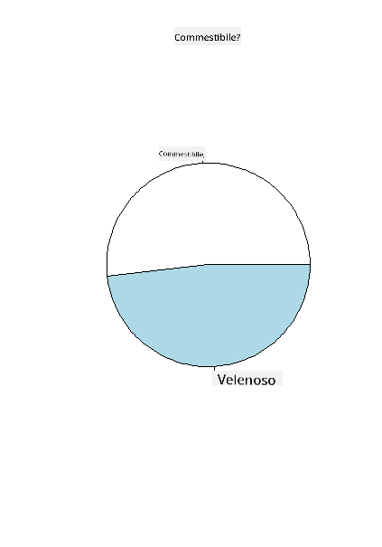
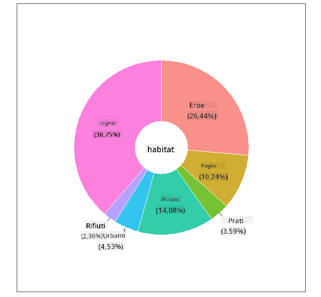
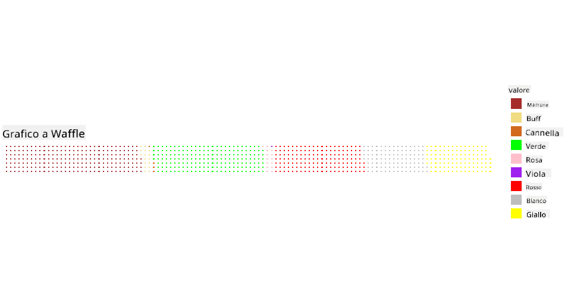

<!--
CO_OP_TRANSLATOR_METADATA:
{
  "original_hash": "47028abaaafa2bcb1079702d20569066",
  "translation_date": "2025-08-28T11:03:18+00:00",
  "source_file": "3-Data-Visualization/R/11-visualization-proportions/README.md",
  "language_code": "it"
}
-->
# Visualizzare le Proporzioni

| ](../../../sketchnotes/11-Visualizing-Proportions.png)|
|:---:|
|Visualizzare le Proporzioni - _Sketchnote di [@nitya](https://twitter.com/nitya)_ |

In questa lezione, utilizzerai un dataset incentrato sulla natura per visualizzare le proporzioni, come il numero di diversi tipi di funghi presenti in un dataset sui funghi. Esploriamo questi affascinanti funghi utilizzando un dataset proveniente da Audubon che elenca dettagli su 23 specie di funghi con lamelle delle famiglie Agaricus e Lepiota. Sperimenterai con visualizzazioni appetitose come:

- Grafici a torta 🥧
- Grafici a ciambella 🍩
- Grafici a waffle 🧇

> 💡 Un progetto molto interessante chiamato [Charticulator](https://charticulator.com) di Microsoft Research offre un'interfaccia gratuita drag and drop per le visualizzazioni di dati. In uno dei loro tutorial utilizzano anche questo dataset sui funghi! Puoi quindi esplorare i dati e imparare a usare la libreria contemporaneamente: [Tutorial Charticulator](https://charticulator.com/tutorials/tutorial4.html).

## [Quiz pre-lezione](https://purple-hill-04aebfb03.1.azurestaticapps.net/quiz/20)

## Conosci i tuoi funghi 🍄

I funghi sono molto interessanti. Importiamo un dataset per studiarli:

```r
mushrooms = read.csv('../../data/mushrooms.csv')
head(mushrooms)
```
Viene stampata una tabella con alcuni ottimi dati per l'analisi:


| classe     | forma-cappello | superficie-cappello | colore-cappello | lividi | odore    | attacco-lamelle | spaziatura-lamelle | dimensione-lamelle | colore-lamelle | forma-gambo | radice-gambo | superficie-gambo-sopra-anello | superficie-gambo-sotto-anello | colore-gambo-sopra-anello | colore-gambo-sotto-anello | tipo-velo | colore-velo | numero-anelli | tipo-anello | colore-spore | popolazione | habitat |
| --------- | --------- | ----------- | --------- | ------- | ------- | --------------- | ------------ | --------- | ---------- | ----------- | ---------- | ------------------------ | ------------------------ | ---------------------- | ---------------------- | --------- | ---------- | ----------- | --------- | ----------------- | ---------- | ------- |
| Velenoso | Convesso    | Liscio      | Marrone     | Lividi | Pungente | Libero            | Vicino        | Stretto    | Nero      | Allargato   | Uguale      | Liscio                   | Liscio                   | Bianco                  | Bianco                  | Parziale   | Bianco      | Uno         | Pendente   | Nero             | Sparso  | Urbano   |
| Commestibile    | Convesso    | Liscio      | Giallo    | Lividi | Mandorla  | Libero            | Vicino        | Largo     | Nero      | Allargato   | Clava       | Liscio                   | Liscio                   | Bianco                  | Bianco                  | Parziale   | Bianco      | Uno         | Pendente   | Marrone             | Numeroso   | Erba |
| Commestibile    | Campanulato      | Liscio      | Bianco     | Lividi | Anice   | Libero            | Vicino        | Largo     | Marrone      | Allargato   | Clava       | Liscio                   | Liscio                   | Bianco                  | Bianco                  | Parziale   | Bianco      | Uno         | Pendente   | Marrone             | Numeroso   | Prati |
| Velenoso | Convesso    | Squamoso       | Bianco     | Lividi | Pungente | Libero            | Vicino        | Stretto    | Marrone      | Allargato   | Uguale      | Liscio                   | Liscio                   | Bianco                  | Bianco                  | Parziale   | Bianco      | Uno         | Pendente   | Nero             | Sparso  | Urbano 
| Commestibile | Convesso       |Liscio       | Verde     | No Lividi| Nessuno   |Libero            | Affollato       | Largo     | Nero      | Affusolato   | Uguale      |  Liscio | Liscio                    | Bianco                 | Bianco                  | Parziale    | Bianco     | Uno         | Evanescente | Marrone             | Abbondante | Erba
|Commestibile  |  Convesso      | Squamoso   | Giallo         | Lividi  | Mandorla  | Libero | Vicino  |   Largo   |   Marrone  | Allargato   |   Clava                      | Liscio                  | Liscio    | Bianco                 |  Bianco                | Parziale      | Bianco    |  Uno  |  Pendente | Nero   | Numeroso | Erba
      
Subito noti che tutti i dati sono testuali. Dovrai convertire questi dati per poterli utilizzare in un grafico. La maggior parte dei dati, infatti, è rappresentata come un oggetto:

```r
names(mushrooms)
```

L'output è:

```output
[1] "class"                    "cap.shape"               
 [3] "cap.surface"              "cap.color"               
 [5] "bruises"                  "odor"                    
 [7] "gill.attachment"          "gill.spacing"            
 [9] "gill.size"                "gill.color"              
[11] "stalk.shape"              "stalk.root"              
[13] "stalk.surface.above.ring" "stalk.surface.below.ring"
[15] "stalk.color.above.ring"   "stalk.color.below.ring"  
[17] "veil.type"                "veil.color"              
[19] "ring.number"              "ring.type"               
[21] "spore.print.color"        "population"              
[23] "habitat"            
```
Prendi questi dati e converti la colonna 'classe' in una categoria:

```r
library(dplyr)
grouped=mushrooms %>%
  group_by(class) %>%
  summarise(count=n())
```


Ora, se stampi i dati sui funghi, puoi vedere che sono stati raggruppati in categorie secondo la classe velenoso/commestibile:
```r
View(grouped)
```


| classe | conteggio |
| --------- | --------- |
| Commestibile | 4208 |
| Velenoso| 3916 |


Seguendo l'ordine presentato in questa tabella per creare le etichette della categoria classe, puoi costruire un grafico a torta. 

## Torta!

```r
pie(grouped$count,grouped$class, main="Edible?")
```
Voilà, un grafico a torta che mostra le proporzioni di questi dati secondo le due classi di funghi. È molto importante ottenere l'ordine corretto delle etichette, soprattutto qui, quindi assicurati di verificare l'ordine con cui viene costruito l'array delle etichette!



## Ciambelle!

Un grafico a torta un po' più interessante visivamente è il grafico a ciambella, che è un grafico a torta con un buco al centro. Esaminiamo i nostri dati utilizzando questo metodo.

Dai un'occhiata ai vari habitat in cui crescono i funghi:

```r
library(dplyr)
habitat=mushrooms %>%
  group_by(habitat) %>%
  summarise(count=n())
View(habitat)
```
L'output è:
| habitat| conteggio |
| --------- | --------- |
| Erba    | 2148 |
| Foglie| 832 |
| Prati    | 292 |
| Sentieri| 1144 |
| Urbano    | 368 |
| Rifiuti| 192 |
| Legno| 3148 |


Qui stai raggruppando i tuoi dati per habitat. Ce ne sono 7 elencati, quindi usali come etichette per il tuo grafico a ciambella:

```r
library(ggplot2)
library(webr)
PieDonut(habitat, aes(habitat, count=count))
```



Questo codice utilizza due librerie: ggplot2 e webr. Utilizzando la funzione PieDonut della libreria webr, possiamo creare facilmente un grafico a ciambella!

I grafici a ciambella in R possono essere creati anche utilizzando solo la libreria ggplot2. Puoi saperne di più [qui](https://www.r-graph-gallery.com/128-ring-or-donut-plot.html) e provarlo tu stesso.

Ora che sai come raggruppare i tuoi dati e poi visualizzarli come torta o ciambella, puoi esplorare altri tipi di grafici. Prova un grafico a waffle, che è solo un modo diverso di esplorare le quantità.
## Waffle!

Un grafico di tipo 'waffle' è un modo diverso di visualizzare le quantità come un array 2D di quadrati. Prova a visualizzare le diverse quantità di colori del cappello dei funghi in questo dataset. Per farlo, devi installare una libreria di supporto chiamata [waffle](https://cran.r-project.org/web/packages/waffle/waffle.pdf) e usarla per generare la tua visualizzazione:

```r
install.packages("waffle", repos = "https://cinc.rud.is")
```

Seleziona un segmento dei tuoi dati da raggruppare:

```r
library(dplyr)
cap_color=mushrooms %>%
  group_by(cap.color) %>%
  summarise(count=n())
View(cap_color)
```

Crea un grafico a waffle creando etichette e poi raggruppando i tuoi dati:

```r
library(waffle)
names(cap_color$count) = paste0(cap_color$cap.color)
waffle((cap_color$count/10), rows = 7, title = "Waffle Chart")+scale_fill_manual(values=c("brown", "#F0DC82", "#D2691E", "green", 
                                                                                     "pink", "purple", "red", "grey", 
                                                                                     "yellow","white"))
```

Utilizzando un grafico a waffle, puoi vedere chiaramente le proporzioni dei colori del cappello in questo dataset sui funghi. Interessante notare che ci sono molti funghi con cappelli verdi!



In questa lezione, hai imparato tre modi per visualizzare le proporzioni. Prima, devi raggruppare i tuoi dati in categorie e poi decidere qual è il modo migliore per visualizzarli - torta, ciambella o waffle. Tutti sono deliziosi e gratificano l'utente con un'istantanea del dataset.

## 🚀 Sfida

Prova a ricreare questi grafici appetitosi in [Charticulator](https://charticulator.com).
## [Quiz post-lezione](https://purple-hill-04aebfb03.1.azurestaticapps.net/quiz/21)

## Revisione & Studio Autonomo

A volte non è ovvio quando utilizzare un grafico a torta, ciambella o waffle. Ecco alcuni articoli da leggere su questo argomento:

https://www.beautiful.ai/blog/battle-of-the-charts-pie-chart-vs-donut-chart

https://medium.com/@hypsypops/pie-chart-vs-donut-chart-showdown-in-the-ring-5d24fd86a9ce

https://www.mit.edu/~mbarker/formula1/f1help/11-ch-c6.htm

https://medium.datadriveninvestor.com/data-visualization-done-the-right-way-with-tableau-waffle-chart-fdf2a19be402

Fai qualche ricerca per trovare ulteriori informazioni su questa decisione difficile.
## Compito

[Provalo in Excel](assignment.md)

---

**Disclaimer**:  
Questo documento è stato tradotto utilizzando il servizio di traduzione automatica [Co-op Translator](https://github.com/Azure/co-op-translator). Sebbene ci impegniamo per garantire l'accuratezza, si prega di notare che le traduzioni automatiche possono contenere errori o imprecisioni. Il documento originale nella sua lingua nativa dovrebbe essere considerato la fonte autorevole. Per informazioni critiche, si consiglia una traduzione professionale eseguita da un traduttore umano. Non siamo responsabili per eventuali fraintendimenti o interpretazioni errate derivanti dall'uso di questa traduzione.