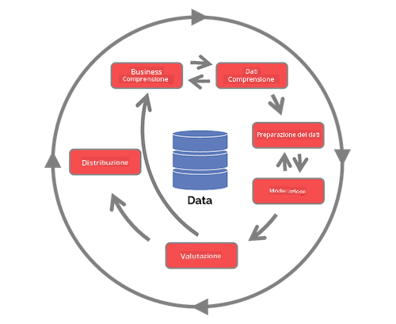

<!--
CO_OP_TRANSLATOR_METADATA:
{
  "original_hash": "07e12a25d20b8f191e3cb651c27fdb2b",
  "translation_date": "2025-09-06T20:53:19+00:00",
  "source_file": "4-Data-Science-Lifecycle/14-Introduction/README.md",
  "language_code": "it"
}
-->
# Introduzione al Ciclo di Vita della Data Science

| ](../../sketchnotes/14-DataScience-Lifecycle.png)|
|:---:|
| Introduzione al Ciclo di Vita della Data Science - _Sketchnote di [@nitya](https://twitter.com/nitya)_ |

## [Quiz Pre-Lezione](https://ff-quizzes.netlify.app/en/ds/quiz/26)

A questo punto probabilmente hai capito che la data science è un processo. Questo processo può essere suddiviso in 5 fasi:

- Acquisizione
- Elaborazione
- Analisi
- Comunicazione
- Manutenzione

Questa lezione si concentra su 3 parti del ciclo di vita: acquisizione, elaborazione e manutenzione.

  
> Foto di [Berkeley School of Information](https://ischoolonline.berkeley.edu/data-science/what-is-data-science/)

## Acquisizione

La prima fase del ciclo di vita è molto importante poiché le fasi successive dipendono da essa. È praticamente composta da due fasi combinate in una: acquisire i dati e definire lo scopo e i problemi che devono essere affrontati.  
Definire gli obiettivi del progetto richiederà un contesto più approfondito sul problema o sulla domanda. Per prima cosa, dobbiamo identificare e coinvolgere coloro che hanno bisogno di risolvere il loro problema. Questi possono essere stakeholder di un'azienda o sponsor del progetto, che possono aiutare a identificare chi o cosa trarrà beneficio da questo progetto, oltre a cosa e perché ne hanno bisogno. Un obiettivo ben definito dovrebbe essere misurabile e quantificabile per definire un risultato accettabile.

Domande che un data scientist potrebbe porsi:
- Questo problema è già stato affrontato in passato? Cosa è stato scoperto?
- Lo scopo e l'obiettivo sono chiari a tutti i soggetti coinvolti?
- Ci sono ambiguità e come possono essere ridotte?
- Quali sono i vincoli?
- Come potrebbe apparire il risultato finale?
- Quante risorse (tempo, persone, capacità computazionale) sono disponibili?

Successivamente, bisogna identificare, raccogliere e infine esplorare i dati necessari per raggiungere gli obiettivi definiti. In questa fase di acquisizione, i data scientist devono anche valutare la quantità e la qualità dei dati. Questo richiede un'esplorazione dei dati per confermare che ciò che è stato acquisito supporti il raggiungimento del risultato desiderato.

Domande che un data scientist potrebbe porsi sui dati:
- Quali dati sono già disponibili?
- Chi possiede questi dati?
- Quali sono le preoccupazioni relative alla privacy?
- Ho abbastanza dati per risolvere questo problema?
- I dati sono di qualità accettabile per questo problema?
- Se scopro ulteriori informazioni attraverso questi dati, dovremmo considerare di cambiare o ridefinire gli obiettivi?

## Elaborazione

La fase di elaborazione del ciclo di vita si concentra sulla scoperta di schemi nei dati e sulla modellazione. Alcune tecniche utilizzate in questa fase richiedono metodi statistici per individuare gli schemi. Tipicamente, questo sarebbe un compito noioso per un essere umano con un grande set di dati, quindi si fa affidamento sui computer per accelerare il processo. Questa fase è anche il punto in cui la data science e il machine learning si intersecano. Come hai appreso nella prima lezione, il machine learning è il processo di costruzione di modelli per comprendere i dati. I modelli rappresentano la relazione tra le variabili nei dati e aiutano a prevedere i risultati.

Le tecniche comuni utilizzate in questa fase sono trattate nel curriculum di ML per Principianti. Segui i link per saperne di più:

- [Classificazione](https://github.com/microsoft/ML-For-Beginners/tree/main/4-Classification): Organizzare i dati in categorie per un uso più efficiente.
- [Clustering](https://github.com/microsoft/ML-For-Beginners/tree/main/5-Clustering): Raggruppare i dati in gruppi simili.
- [Regressione](https://github.com/microsoft/ML-For-Beginners/tree/main/2-Regression): Determinare le relazioni tra variabili per prevedere o stimare valori.

## Manutenzione

Nel diagramma del ciclo di vita, potresti aver notato che la manutenzione si trova tra acquisizione ed elaborazione. La manutenzione è un processo continuo di gestione, archiviazione e protezione dei dati durante l'intero progetto e dovrebbe essere considerata per tutta la durata del progetto.

### Archiviazione dei Dati

Le modalità e i luoghi in cui i dati vengono archiviati possono influenzare i costi di archiviazione e le prestazioni di accesso ai dati. Decisioni come queste non sono probabilmente prese solo dal data scientist, ma potrebbero influenzare il modo in cui lavorano con i dati in base a come sono archiviati.

Ecco alcuni aspetti dei moderni sistemi di archiviazione dei dati che possono influenzare queste scelte:

**On premise vs off premise vs cloud pubblico o privato**

On premise si riferisce alla gestione dei dati su apparecchiature proprie, come un server con dischi rigidi che archiviano i dati, mentre off premise si basa su apparecchiature che non si possiedono, come un data center. Il cloud pubblico è una scelta popolare per archiviare dati che non richiede conoscenze su come o dove esattamente i dati siano archiviati, mentre il termine pubblico si riferisce a un'infrastruttura unificata condivisa da tutti gli utenti del cloud. Alcune organizzazioni hanno politiche di sicurezza rigorose che richiedono il completo accesso alle apparecchiature dove i dati sono ospitati e si affidano a un cloud privato che fornisce servizi cloud dedicati. Imparerai di più sui dati nel cloud nelle [lezioni successive](https://github.com/microsoft/Data-Science-For-Beginners/tree/main/5-Data-Science-In-Cloud).

**Dati freddi vs dati caldi**

Quando addestri i tuoi modelli, potresti aver bisogno di più dati di addestramento. Se sei soddisfatto del tuo modello, arriveranno comunque nuovi dati per permettere al modello di svolgere il suo scopo. In ogni caso, il costo di archiviazione e accesso ai dati aumenterà man mano che ne accumuli di più. Separare i dati raramente utilizzati, noti come dati freddi, dai dati frequentemente accessibili, noti come dati caldi, può essere un'opzione più economica per l'archiviazione tramite hardware o servizi software. Se i dati freddi devono essere accessibili, potrebbe richiedere un po' più di tempo per recuperarli rispetto ai dati caldi.

### Gestione dei Dati

Lavorando con i dati, potresti scoprire che alcuni di essi devono essere puliti utilizzando alcune delle tecniche trattate nella lezione dedicata alla [preparazione dei dati](https://github.com/microsoft/Data-Science-For-Beginners/tree/main/2-Working-With-Data/08-data-preparation) per costruire modelli accurati. Quando arrivano nuovi dati, sarà necessario applicare le stesse tecniche per mantenere la coerenza nella qualità. Alcuni progetti prevedono l'uso di strumenti automatizzati per la pulizia, l'aggregazione e la compressione prima che i dati vengano spostati nella loro posizione finale. Azure Data Factory è un esempio di uno di questi strumenti.

### Sicurezza dei Dati

Uno degli obiettivi principali della sicurezza dei dati è garantire che chi lavora con essi abbia il controllo su ciò che viene raccolto e sul contesto in cui viene utilizzato. Mantenere i dati sicuri significa limitare l'accesso solo a chi ne ha bisogno, rispettare le leggi e i regolamenti locali, oltre a mantenere standard etici, come trattato nella [lezione sull'etica](https://github.com/microsoft/Data-Science-For-Beginners/tree/main/1-Introduction/02-ethics).

Ecco alcune azioni che un team potrebbe intraprendere con la sicurezza in mente:
- Confermare che tutti i dati siano crittografati
- Fornire ai clienti informazioni su come vengono utilizzati i loro dati
- Rimuovere l'accesso ai dati a chi ha lasciato il progetto
- Consentire solo a determinati membri del progetto di modificare i dati

## 🚀 Sfida

Esistono molte versioni del Ciclo di Vita della Data Science, in cui ogni fase può avere nomi e numero di passaggi diversi, ma conterrà gli stessi processi menzionati in questa lezione.

Esplora il [Team Data Science Process lifecycle](https://docs.microsoft.com/en-us/azure/architecture/data-science-process/lifecycle) e il [Cross-industry standard process for data mining](https://www.datascience-pm.com/crisp-dm-2/). Nomina 3 somiglianze e differenze tra i due.

|Team Data Science Process (TDSP)|Cross-industry standard process for data mining (CRISP-DM)|
|--|--|
| |  |
| Immagine di [Microsoft](https://docs.microsoft.comazure/architecture/data-science-process/lifecycle) | Immagine di [Data Science Process Alliance](https://www.datascience-pm.com/crisp-dm-2/) |

## [Quiz Post-Lezione](https://ff-quizzes.netlify.app/en/ds/quiz/27)

## Revisione e Studio Autonomo

Applicare il Ciclo di Vita della Data Science coinvolge diversi ruoli e compiti, dove alcuni possono concentrarsi su particolari parti di ogni fase. Il Team Data Science Process fornisce alcune risorse che spiegano i tipi di ruoli e compiti che qualcuno potrebbe avere in un progetto.

* [Ruoli e compiti del Team Data Science Process](https://docs.microsoft.com/en-us/azure/architecture/data-science-process/roles-tasks)  
* [Eseguire compiti di data science: esplorazione, modellazione e distribuzione](https://docs.microsoft.com/en-us/azure/architecture/data-science-process/execute-data-science-tasks)

## Compito

[Valutare un Dataset](assignment.md)

---

**Disclaimer**:  
Questo documento è stato tradotto utilizzando il servizio di traduzione automatica [Co-op Translator](https://github.com/Azure/co-op-translator). Sebbene ci impegniamo per garantire l'accuratezza, si prega di notare che le traduzioni automatiche possono contenere errori o imprecisioni. Il documento originale nella sua lingua nativa deve essere considerato la fonte autorevole. Per informazioni critiche, si consiglia una traduzione professionale eseguita da un traduttore umano. Non siamo responsabili per eventuali fraintendimenti o interpretazioni errate derivanti dall'uso di questa traduzione.