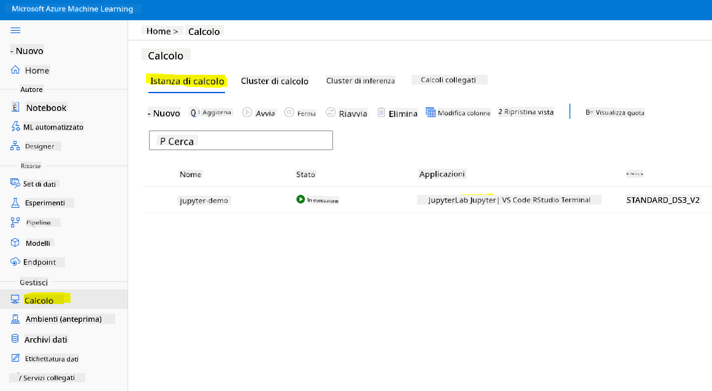

<!--
CO_OP_TRANSLATOR_METADATA:
{
  "original_hash": "5da2d6b3736f6d668b89de9bf3bdd31b",
  "translation_date": "2025-09-04T17:53:31+00:00",
  "source_file": "5-Data-Science-In-Cloud/19-Azure/README.md",
  "language_code": "it"
}
-->
# Data Science nel Cloud: Il metodo "Azure ML SDK"

| ](../../sketchnotes/19-DataScience-Cloud.png)|
|:---:|
| Data Science nel Cloud: Azure ML SDK - _Sketchnote di [@nitya](https://twitter.com/nitya)_ |

Indice:

- [Data Science nel Cloud: Il metodo "Azure ML SDK"](../../../../5-Data-Science-In-Cloud/19-Azure)
  - [Quiz Pre-Lettura](../../../../5-Data-Science-In-Cloud/19-Azure)
  - [1. Introduzione](../../../../5-Data-Science-In-Cloud/19-Azure)
    - [1.1 Cos'è Azure ML SDK?](../../../../5-Data-Science-In-Cloud/19-Azure)
    - [1.2 Progetto di previsione dell'insufficienza cardiaca e introduzione al dataset](../../../../5-Data-Science-In-Cloud/19-Azure)
  - [2. Addestramento di un modello con Azure ML SDK](../../../../5-Data-Science-In-Cloud/19-Azure)
    - [2.1 Creare un workspace Azure ML](../../../../5-Data-Science-In-Cloud/19-Azure)
    - [2.2 Creare un'istanza di calcolo](../../../../5-Data-Science-In-Cloud/19-Azure)
    - [2.3 Caricamento del dataset](../../../../5-Data-Science-In-Cloud/19-Azure)
    - [2.4 Creazione di notebook](../../../../5-Data-Science-In-Cloud/19-Azure)
    - [2.5 Addestramento di un modello](../../../../5-Data-Science-In-Cloud/19-Azure)
      - [2.5.1 Configurazione del workspace, esperimento, cluster di calcolo e dataset](../../../../5-Data-Science-In-Cloud/19-Azure)
      - [2.5.2 Configurazione AutoML e addestramento](../../../../5-Data-Science-In-Cloud/19-Azure)
  - [3. Distribuzione del modello e consumo dell'endpoint con Azure ML SDK](../../../../5-Data-Science-In-Cloud/19-Azure)
    - [3.1 Salvataggio del miglior modello](../../../../5-Data-Science-In-Cloud/19-Azure)
    - [3.2 Distribuzione del modello](../../../../5-Data-Science-In-Cloud/19-Azure)
    - [3.3 Consumo dell'endpoint](../../../../5-Data-Science-In-Cloud/19-Azure)
  - [🚀 Sfida](../../../../5-Data-Science-In-Cloud/19-Azure)
  - [Quiz Post-Lettura](../../../../5-Data-Science-In-Cloud/19-Azure)
  - [Revisione e Studio Autonomo](../../../../5-Data-Science-In-Cloud/19-Azure)
  - [Compito](../../../../5-Data-Science-In-Cloud/19-Azure)

## [Quiz Pre-Lettura](https://purple-hill-04aebfb03.1.azurestaticapps.net/quiz/36)

## 1. Introduzione

### 1.1 Cos'è Azure ML SDK?

I data scientist e gli sviluppatori di AI utilizzano l'SDK di Azure Machine Learning per costruire ed eseguire flussi di lavoro di machine learning con il servizio Azure Machine Learning. Puoi interagire con il servizio in qualsiasi ambiente Python, inclusi Jupyter Notebook, Visual Studio Code o il tuo IDE Python preferito.

Le aree principali dell'SDK includono:

- Esplorare, preparare e gestire il ciclo di vita dei dataset utilizzati negli esperimenti di machine learning.
- Gestire le risorse cloud per monitorare, registrare e organizzare gli esperimenti di machine learning.
- Addestrare modelli localmente o utilizzando risorse cloud, inclusi modelli accelerati da GPU.
- Utilizzare il machine learning automatico, che accetta parametri di configurazione e dati di addestramento. Itera automaticamente tra algoritmi e impostazioni di iperparametri per trovare il miglior modello per eseguire previsioni.
- Distribuire servizi web per convertire i modelli addestrati in servizi RESTful che possono essere consumati in qualsiasi applicazione.

[Scopri di più sull'SDK di Azure Machine Learning](https://docs.microsoft.com/python/api/overview/azure/ml?WT.mc_id=academic-77958-bethanycheum&ocid=AID3041109)

Nella [lezione precedente](../18-Low-Code/README.md), abbiamo visto come addestrare, distribuire e consumare un modello in modalità Low code/No code. Abbiamo utilizzato il dataset sull'insufficienza cardiaca per generare un modello di previsione dell'insufficienza cardiaca. In questa lezione, faremo esattamente la stessa cosa ma utilizzando l'SDK di Azure Machine Learning.


### 1.2 Progetto di previsione dell'insufficienza cardiaca e introduzione al dataset

Consulta [qui](../18-Low-Code/README.md) il progetto di previsione dell'insufficienza cardiaca e l'introduzione al dataset.

## 2. Addestramento di un modello con Azure ML SDK
### 2.1 Creare un workspace Azure ML

Per semplicità, lavoreremo su un notebook Jupyter. Questo implica che tu abbia già un workspace e un'istanza di calcolo. Se hai già un workspace, puoi passare direttamente alla sezione 2.3 Creazione di notebook.

In caso contrario, segui le istruzioni nella sezione **2.1 Creare un workspace Azure ML** nella [lezione precedente](../18-Low-Code/README.md) per creare un workspace.

### 2.2 Creare un'istanza di calcolo

Nel [workspace Azure ML](https://ml.azure.com/) che abbiamo creato in precedenza, vai al menu di calcolo e vedrai le diverse risorse di calcolo disponibili.


Creiamo un'istanza di calcolo per fornire un notebook Jupyter. 
1. Clicca sul pulsante + Nuovo. 
2. Dai un nome alla tua istanza di calcolo.
3. Scegli le opzioni: CPU o GPU, dimensione della VM e numero di core.
4. Clicca sul pulsante Crea.

Congratulazioni, hai appena creato un'istanza di calcolo! Utilizzeremo questa istanza di calcolo per creare un notebook nella [sezione Creazione di notebook](../../../../5-Data-Science-In-Cloud/19-Azure).

### 2.3 Caricamento del dataset
Consulta la [lezione precedente](../18-Low-Code/README.md) nella sezione **2.3 Caricamento del dataset** se non hai ancora caricato il dataset.

### 2.4 Creazione di notebook

> **_NOTA:_** Per il prossimo passaggio puoi creare un nuovo notebook da zero oppure caricare il [notebook che abbiamo creato](notebook.ipynb) nel tuo Azure ML Studio. Per caricarlo, clicca semplicemente sul menu "Notebook" e carica il notebook.

I notebook sono una parte davvero importante del processo di data science. Possono essere utilizzati per condurre analisi esplorative dei dati (EDA), chiamare un cluster di calcolo per addestrare un modello, chiamare un cluster di inferenza per distribuire un endpoint.

Per creare un notebook, abbiamo bisogno di un nodo di calcolo che fornisca l'istanza del notebook Jupyter. Torna al [workspace Azure ML](https://ml.azure.com/) e clicca su Istanza di calcolo. Nell'elenco delle istanze di calcolo dovresti vedere l'[istanza di calcolo che abbiamo creato in precedenza](../../../../5-Data-Science-In-Cloud/19-Azure). 

1. Nella sezione Applicazioni, clicca sull'opzione Jupyter. 
2. Spunta la casella "Sì, ho capito" e clicca sul pulsante Continua.

3. Questo dovrebbe aprire una nuova scheda del browser con la tua istanza di notebook Jupyter come segue. Clicca sul pulsante "Nuovo" per creare un notebook.


Ora che abbiamo un notebook, possiamo iniziare ad addestrare il modello con Azure ML SDK.

### 2.5 Addestramento di un modello

Prima di tutto, se hai dubbi, consulta la [documentazione di Azure ML SDK](https://docs.microsoft.com/python/api/overview/azure/ml?WT.mc_id=academic-77958-bethanycheum&ocid=AID3041109). Contiene tutte le informazioni necessarie per comprendere i moduli che vedremo in questa lezione.

#### 2.5.1 Configurazione del workspace, esperimento, cluster di calcolo e dataset

Devi caricare il `workspace` dal file di configurazione utilizzando il seguente codice:

```python
from azureml.core import Workspace
ws = Workspace.from_config()
```

Questo restituisce un oggetto di tipo `Workspace` che rappresenta il workspace. Poi devi creare un `esperimento` utilizzando il seguente codice:

```python
from azureml.core import Experiment
experiment_name = 'aml-experiment'
experiment = Experiment(ws, experiment_name)
```
Per ottenere o creare un esperimento da un workspace, richiedi l'esperimento utilizzando il nome dell'esperimento. Il nome dell'esperimento deve essere composto da 3-36 caratteri, iniziare con una lettera o un numero e può contenere solo lettere, numeri, underscore e trattini. Se l'esperimento non viene trovato nel workspace, viene creato un nuovo esperimento.

Ora devi creare un cluster di calcolo per l'addestramento utilizzando il seguente codice. Nota che questo passaggio può richiedere alcuni minuti. 

```python
from azureml.core.compute import AmlCompute

aml_name = "heart-f-cluster"
try:
    aml_compute = AmlCompute(ws, aml_name)
    print('Found existing AML compute context.')
except:
    print('Creating new AML compute context.')
    aml_config = AmlCompute.provisioning_configuration(vm_size = "Standard_D2_v2", min_nodes=1, max_nodes=3)
    aml_compute = AmlCompute.create(ws, name = aml_name, provisioning_configuration = aml_config)
    aml_compute.wait_for_completion(show_output = True)

cts = ws.compute_targets
compute_target = cts[aml_name]
```

Puoi ottenere il dataset dal workspace utilizzando il nome del dataset nel seguente modo:

```python
dataset = ws.datasets['heart-failure-records']
df = dataset.to_pandas_dataframe()
df.describe()
```
#### 2.5.2 Configurazione AutoML e addestramento

Per impostare la configurazione AutoML, utilizza la classe [AutoMLConfig](https://docs.microsoft.com/python/api/azureml-train-automl-client/azureml.train.automl.automlconfig(class)?WT.mc_id=academic-77958-bethanycheum&ocid=AID3041109).

Come descritto nella documentazione, ci sono molti parametri con cui puoi giocare. Per questo progetto, utilizzeremo i seguenti parametri:

- `experiment_timeout_minutes`: Il tempo massimo (in minuti) che l'esperimento è autorizzato a durare prima di essere automaticamente interrotto e i risultati resi disponibili.
- `max_concurrent_iterations`: Il numero massimo di iterazioni di addestramento concorrenti consentite per l'esperimento.
- `primary_metric`: La metrica principale utilizzata per determinare lo stato dell'esperimento.
- `compute_target`: La risorsa di calcolo di Azure Machine Learning su cui eseguire l'esperimento di Machine Learning automatico.
- `task`: Il tipo di attività da eseguire. I valori possono essere 'classification', 'regression' o 'forecasting' a seconda del tipo di problema di ML automatico da risolvere.
- `training_data`: I dati di addestramento da utilizzare nell'esperimento. Dovrebbe contenere sia le caratteristiche di addestramento che una colonna di etichetta (opzionalmente una colonna di pesi di campione).
- `label_column_name`: Il nome della colonna di etichetta.
- `path`: Il percorso completo alla cartella del progetto Azure Machine Learning.
- `enable_early_stopping`: Indica se abilitare la terminazione anticipata se il punteggio non migliora nel breve termine.
- `featurization`: Indicatore per determinare se il passaggio di featurizzazione deve essere eseguito automaticamente o meno, o se deve essere utilizzata una featurizzazione personalizzata.
- `debug_log`: Il file di log in cui scrivere informazioni di debug.

```python
from azureml.train.automl import AutoMLConfig

project_folder = './aml-project'

automl_settings = {
    "experiment_timeout_minutes": 20,
    "max_concurrent_iterations": 3,
    "primary_metric" : 'AUC_weighted'
}

automl_config = AutoMLConfig(compute_target=compute_target,
                             task = "classification",
                             training_data=dataset,
                             label_column_name="DEATH_EVENT",
                             path = project_folder,  
                             enable_early_stopping= True,
                             featurization= 'auto',
                             debug_log = "automl_errors.log",
                             **automl_settings
                            )
```
Ora che hai impostato la configurazione, puoi addestrare il modello utilizzando il seguente codice. Questo passaggio può richiedere fino a un'ora a seconda della dimensione del cluster.

```python
remote_run = experiment.submit(automl_config)
```
Puoi eseguire il widget RunDetails per mostrare i diversi esperimenti.
```python
from azureml.widgets import RunDetails
RunDetails(remote_run).show()
```
## 3. Distribuzione del modello e consumo dell'endpoint con Azure ML SDK

### 3.1 Salvataggio del miglior modello

Il `remote_run` è un oggetto di tipo [AutoMLRun](https://docs.microsoft.com/python/api/azureml-train-automl-client/azureml.train.automl.run.automlrun?WT.mc_id=academic-77958-bethanycheum&ocid=AID3041109). Questo oggetto contiene il metodo `get_output()` che restituisce il miglior run e il corrispondente modello adattato.

```python
best_run, fitted_model = remote_run.get_output()
```
Puoi vedere i parametri utilizzati per il miglior modello semplicemente stampando il `fitted_model` e vedere le proprietà del miglior modello utilizzando il metodo [get_properties()](https://docs.microsoft.com/python/api/azureml-core/azureml.core.run(class)?view=azure-ml-py#azureml_core_Run_get_properties?WT.mc_id=academic-77958-bethanycheum&ocid=AID3041109).

```python
best_run.get_properties()
```

Ora registra il modello con il metodo [register_model](https://docs.microsoft.com/python/api/azureml-train-automl-client/azureml.train.automl.run.automlrun?view=azure-ml-py#register-model-model-name-none--description-none--tags-none--iteration-none--metric-none-?WT.mc_id=academic-77958-bethanycheum&ocid=AID3041109).
```python
model_name = best_run.properties['model_name']
script_file_name = 'inference/score.py'
best_run.download_file('outputs/scoring_file_v_1_0_0.py', 'inference/score.py')
description = "aml heart failure project sdk"
model = best_run.register_model(model_name = model_name,
                                model_path = './outputs/',
                                description = description,
                                tags = None)
```
### 3.2 Distribuzione del modello

Una volta salvato il miglior modello, possiamo distribuirlo con la classe [InferenceConfig](https://docs.microsoft.com/python/api/azureml-core/azureml.core.model.inferenceconfig?view=azure-ml-py?ocid=AID3041109). InferenceConfig rappresenta le impostazioni di configurazione per un ambiente personalizzato utilizzato per la distribuzione. La classe [AciWebservice](https://docs.microsoft.com/python/api/azureml-core/azureml.core.webservice.aciwebservice?view=azure-ml-py) rappresenta un modello di machine learning distribuito come endpoint di servizio web su Azure Container Instances. Un servizio distribuito viene creato da un modello, uno script e file associati. Il servizio web risultante è un endpoint HTTP bilanciato con un'API REST. Puoi inviare dati a questa API e ricevere la previsione restituita dal modello.

Il modello viene distribuito utilizzando il metodo [deploy](https://docs.microsoft.com/python/api/azureml-core/azureml.core.model(class)?view=azure-ml-py#deploy-workspace--name--models--inference-config-none--deployment-config-none--deployment-target-none--overwrite-false--show-output-false-?WT.mc_id=academic-77958-bethanycheum&ocid=AID3041109).

```python
from azureml.core.model import InferenceConfig, Model
from azureml.core.webservice import AciWebservice

inference_config = InferenceConfig(entry_script=script_file_name, environment=best_run.get_environment())

aciconfig = AciWebservice.deploy_configuration(cpu_cores = 1,
                                               memory_gb = 1,
                                               tags = {'type': "automl-heart-failure-prediction"},
                                               description = 'Sample service for AutoML Heart Failure Prediction')

aci_service_name = 'automl-hf-sdk'
aci_service = Model.deploy(ws, aci_service_name, [model], inference_config, aciconfig)
aci_service.wait_for_deployment(True)
print(aci_service.state)
```
Questo passaggio dovrebbe richiedere alcuni minuti.

### 3.3 Consumo dell'endpoint

Puoi consumare il tuo endpoint creando un input di esempio:

```python
data = {
    "data":
    [
        {
            'age': "60",
            'anaemia': "false",
            'creatinine_phosphokinase': "500",
            'diabetes': "false",
            'ejection_fraction': "38",
            'high_blood_pressure': "false",
            'platelets': "260000",
            'serum_creatinine': "1.40",
            'serum_sodium': "137",
            'sex': "false",
            'smoking': "false",
            'time': "130",
        },
    ],
}

test_sample = str.encode(json.dumps(data))
```
E poi puoi inviare questo input al tuo modello per ottenere una previsione:
```python
response = aci_service.run(input_data=test_sample)
response
```
Questo dovrebbe restituire `'{"result": [false]}'`. Questo significa che l'input del paziente che abbiamo inviato all'endpoint ha generato la previsione `false`, il che indica che questa persona non è probabilmente a rischio di infarto.

Congratulazioni! Hai appena utilizzato il modello distribuito e addestrato su Azure ML con l'SDK di Azure ML!

> **_NOTE:_** Una volta completato il progetto, non dimenticare di eliminare tutte le risorse.

## 🚀 Sfida

Ci sono molte altre cose che puoi fare tramite l'SDK, purtroppo non possiamo esplorarle tutte in questa lezione. Ma la buona notizia è che imparare a consultare la documentazione dell'SDK può portarti lontano da solo. Dai un'occhiata alla documentazione dell'SDK di Azure ML e trova la classe `Pipeline` che ti permette di creare pipeline. Una Pipeline è una raccolta di passaggi che possono essere eseguiti come un flusso di lavoro.

**SUGGERIMENTO:** Vai alla [documentazione SDK](https://docs.microsoft.com/python/api/overview/azure/ml/?view=azure-ml-py?WT.mc_id=academic-77958-bethanycheum&ocid=AID3041109) e digita parole chiave nella barra di ricerca come "Pipeline". Dovresti trovare la classe `azureml.pipeline.core.Pipeline` nei risultati di ricerca.

## [Quiz post-lezione](https://ff-quizzes.netlify.app/en/ds/)

## Revisione e studio autonomo

In questa lezione, hai imparato come addestrare, distribuire e utilizzare un modello per prevedere il rischio di insufficienza cardiaca con l'SDK di Azure ML nel cloud. Consulta questa [documentazione](https://docs.microsoft.com/python/api/overview/azure/ml/?view=azure-ml-py?WT.mc_id=academic-77958-bethanycheum&ocid=AID3041109) per ulteriori informazioni sull'SDK di Azure ML. Prova a creare il tuo modello con l'SDK di Azure ML.

## Compito

[Progetto di Data Science utilizzando l'SDK di Azure ML](assignment.md)

---

**Disclaimer**:  
Questo documento è stato tradotto utilizzando il servizio di traduzione automatica [Co-op Translator](https://github.com/Azure/co-op-translator). Sebbene ci impegniamo per garantire l'accuratezza, si prega di notare che le traduzioni automatiche possono contenere errori o imprecisioni. Il documento originale nella sua lingua nativa dovrebbe essere considerato la fonte autorevole. Per informazioni critiche, si raccomanda una traduzione professionale effettuata da un traduttore umano. Non siamo responsabili per eventuali incomprensioni o interpretazioni errate derivanti dall'uso di questa traduzione.