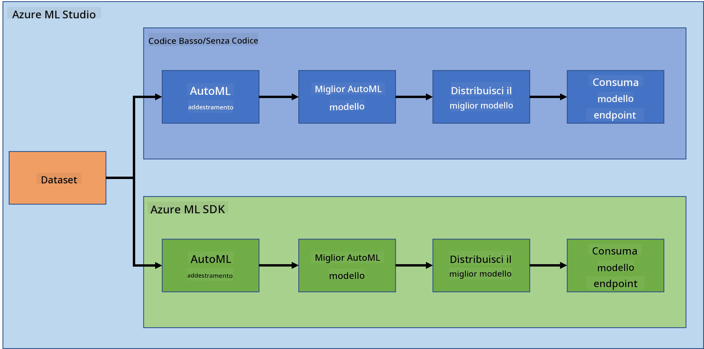

<!--
CO_OP_TRANSLATOR_METADATA:
{
  "original_hash": "8dfe141a0f46f7d253e07f74913c7f44",
  "translation_date": "2025-08-28T10:36:49+00:00",
  "source_file": "5-Data-Science-In-Cloud/README.md",
  "language_code": "it"
}
-->
# Data Science nel Cloud

> Foto di [Jelleke Vanooteghem](https://unsplash.com/@ilumire) da [Unsplash](https://unsplash.com/s/photos/cloud?orientation=landscape)

Quando si tratta di fare data science con big data, il cloud può essere una svolta. Nelle prossime tre lezioni, vedremo cos'è il cloud e perché può essere molto utile. Esploreremo anche un dataset relativo all'insufficienza cardiaca e costruiremo un modello per aiutare a valutare la probabilità che qualcuno abbia un'insufficienza cardiaca. Utilizzeremo la potenza del cloud per addestrare, distribuire e utilizzare un modello in due modi diversi. Un modo utilizzando solo l'interfaccia utente in modalità Low code/No code, l'altro modo utilizzando l'Azure Machine Learning Software Developer Kit (Azure ML SDK).

### Argomenti

1. [Perché usare il Cloud per la Data Science?](17-Introduction/README.md)
2. [Data Science nel Cloud: Il metodo "Low code/No code"](18-Low-Code/README.md)
3. [Data Science nel Cloud: Il metodo "Azure ML SDK"](19-Azure/README.md)

### Crediti
Queste lezioni sono state scritte con ☁️ e 💕 da [Maud Levy](https://twitter.com/maudstweets) e [Tiffany Souterre](https://twitter.com/TiffanySouterre)

I dati per il progetto di Predizione dell'Insufficienza Cardiaca provengono da [
Larxel](https://www.kaggle.com/andrewmvd) su [Kaggle](https://www.kaggle.com/andrewmvd/heart-failure-clinical-data). Sono concessi sotto licenza [Attribution 4.0 International (CC BY 4.0)](https://creativecommons.org/licenses/by/4.0/)

---

**Disclaimer**:  
Questo documento è stato tradotto utilizzando il servizio di traduzione automatica [Co-op Translator](https://github.com/Azure/co-op-translator). Sebbene ci impegniamo per garantire l'accuratezza, si prega di notare che le traduzioni automatiche potrebbero contenere errori o imprecisioni. Il documento originale nella sua lingua nativa dovrebbe essere considerato la fonte autorevole. Per informazioni critiche, si consiglia una traduzione professionale eseguita da un traduttore umano. Non siamo responsabili per eventuali fraintendimenti o interpretazioni errate derivanti dall'uso di questa traduzione.