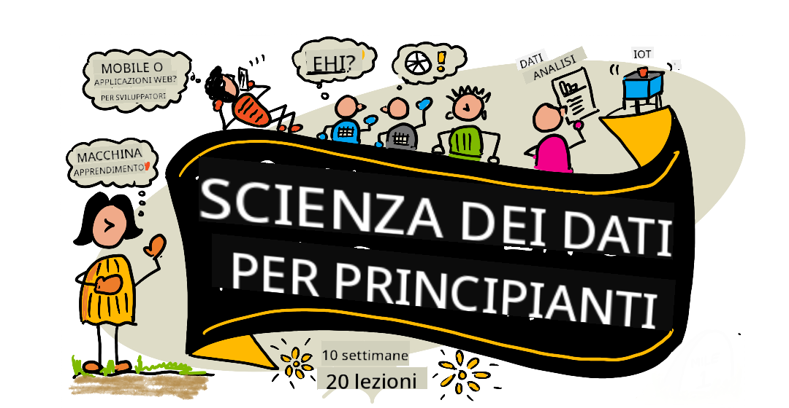

<!--
CO_OP_TRANSLATOR_METADATA:
{
  "original_hash": "a5443b88ba402d2ec7b000e4de6cecb8",
  "translation_date": "2025-08-29T09:55:00+00:00",
  "source_file": "README.md",
  "language_code": "it"
}
-->
# Data Science per Principianti - Un Curriculum

Azure Cloud Advocates di Microsoft sono lieti di offrire un curriculum di 10 settimane e 20 lezioni interamente dedicato alla Data Science. Ogni lezione include quiz pre-lezione e post-lezione, istruzioni scritte per completare la lezione, una soluzione e un compito. La nostra pedagogia basata sui progetti ti permette di imparare costruendo, un metodo comprovato per far sì che le nuove competenze si consolidino.

**Un sentito ringraziamento ai nostri autori:** [Jasmine Greenaway](https://www.twitter.com/paladique), [Dmitry Soshnikov](http://soshnikov.com), [Nitya Narasimhan](https://twitter.com/nitya), [Jalen McGee](https://twitter.com/JalenMcG), [Jen Looper](https://twitter.com/jenlooper), [Maud Levy](https://twitter.com/maudstweets), [Tiffany Souterre](https://twitter.com/TiffanySouterre), [Christopher Harrison](https://www.twitter.com/geektrainer).

**🙏 Un ringraziamento speciale 🙏 ai nostri [Microsoft Student Ambassador](https://studentambassadors.microsoft.com/) autori, revisori e collaboratori di contenuti,** in particolare Aaryan Arora, [Aditya Garg](https://github.com/AdityaGarg00), [Alondra Sanchez](https://www.linkedin.com/in/alondra-sanchez-molina/), [Ankita Singh](https://www.linkedin.com/in/ankitasingh007), [Anupam Mishra](https://www.linkedin.com/in/anupam--mishra/), [Arpita Das](https://www.linkedin.com/in/arpitadas01/), ChhailBihari Dubey, [Dibri Nsofor](https://www.linkedin.com/in/dibrinsofor), [Dishita Bhasin](https://www.linkedin.com/in/dishita-bhasin-7065281bb), [Majd Safi](https://www.linkedin.com/in/majd-s/), [Max Blum](https://www.linkedin.com/in/max-blum-6036a1186/), [Miguel Correa](https://www.linkedin.com/in/miguelmque/), [Mohamma Iftekher (Iftu) Ebne Jalal](https://twitter.com/iftu119), [Nawrin Tabassum](https://www.linkedin.com/in/nawrin-tabassum), [Raymond Wangsa Putra](https://www.linkedin.com/in/raymond-wp/), [Rohit Yadav](https://www.linkedin.com/in/rty2423), Samridhi Sharma, [Sanya Sinha](https://www.linkedin.com/mwlite/in/sanya-sinha-13aab1200),
[Sheena Narula](https://www.linkedin.com/in/sheena-narua-n/), [Tauqeer Ahmad](https://www.linkedin.com/in/tauqeerahmad5201/), Yogendrasingh Pawar, [Vidushi Gupta](https://www.linkedin.com/in/vidushi-gupta07/), [Jasleen Sondhi](https://www.linkedin.com/in/jasleen-sondhi/)

||
|:---:|
| Data Science per Principianti - _Sketchnote di [@nitya](https://twitter.com/nitya)_ |

### 🌐 Supporto Multilingue

#### Supportato tramite GitHub Action (Automatizzato e Sempre Aggiornato)

[Francese](../fr/README.md) | [Spagnolo](../es/README.md) | [Tedesco](../de/README.md) | [Russo](../ru/README.md) | [Arabo](../ar/README.md) | [Persiano (Farsi)](../fa/README.md) | [Urdu](../ur/README.md) | [Cinese (Semplificato)](../zh/README.md) | [Cinese (Tradizionale, Macao)](../mo/README.md) | [Cinese (Tradizionale, Hong Kong)](../hk/README.md) | [Cinese (Tradizionale, Taiwan)](../tw/README.md) | [Giapponese](../ja/README.md) | [Coreano](../ko/README.md) | [Hindi](../hi/README.md) | [Bengalese](../bn/README.md) | [Marathi](../mr/README.md) | [Nepalese](../ne/README.md) | [Punjabi (Gurmukhi)](../pa/README.md) | [Portoghese (Portogallo)](../pt/README.md) | [Portoghese (Brasile)](../br/README.md) | [Italiano](./README.md) | [Polacco](../pl/README.md) | [Turco](../tr/README.md) | [Greco](../el/README.md) | [Tailandese](../th/README.md) | [Svedese](../sv/README.md) | [Danese](../da/README.md) | [Norvegese](../no/README.md) | [Finlandese](../fi/README.md) | [Olandese](../nl/README.md) | [Ebraico](../he/README.md) | [Vietnamita](../vi/README.md) | [Indonesiano](../id/README.md) | [Malese](../ms/README.md) | [Tagalog (Filippino)](../tl/README.md) | [Swahili](../sw/README.md) | [Ungherese](../hu/README.md) | [Ceco](../cs/README.md) | [Slovacco](../sk/README.md) | [Rumeno](../ro/README.md) | [Bulgaro](../bg/README.md) | [Serbo (Cirillico)](../sr/README.md) | [Croato](../hr/README.md) | [Sloveno](../sl/README.md) | [Ucraino](../uk/README.md) | [Birmano (Myanmar)](../my/README.md)

**Se desideri supportare ulteriori traduzioni, le lingue disponibili sono elencate [qui](https://github.com/Azure/co-op-translator/blob/main/getting_started/supported-languages.md)**

#### Unisciti alla Nostra Comunità 

# Sei uno studente?

Inizia con le seguenti risorse:

- [Pagina Student Hub](https://docs.microsoft.com/en-gb/learn/student-hub?WT.mc_id=academic-77958-bethanycheum) In questa pagina troverai risorse per principianti, pacchetti per studenti e persino modi per ottenere un voucher per una certificazione gratuita. Questa è una pagina da aggiungere ai preferiti e controllare di tanto in tanto, poiché aggiorniamo i contenuti almeno mensilmente.
- [Microsoft Learn Student Ambassadors](https://studentambassadors.microsoft.com?WT.mc_id=academic-77958-bethanycheum) Unisciti a una comunità globale di ambasciatori studenti, potrebbe essere il tuo ingresso in Microsoft.

# Per Iniziare

> **Insegnanti**: abbiamo [incluso alcune indicazioni](for-teachers.md) su come utilizzare questo curriculum. Ci piacerebbe ricevere il vostro feedback [nel nostro forum di discussione](https://github.com/microsoft/Data-Science-For-Beginners/discussions)!

> **[Studenti](https://aka.ms/student-page)**: per utilizzare questo curriculum autonomamente, fai un fork dell'intero repository e completa gli esercizi da solo, iniziando con un quiz pre-lezione. Poi leggi la lezione e completa il resto delle attività. Cerca di creare i progetti comprendendo le lezioni piuttosto che copiare il codice della soluzione; tuttavia, quel codice è disponibile nelle cartelle /solutions in ogni lezione orientata al progetto. Un'altra idea potrebbe essere formare un gruppo di studio con amici e affrontare i contenuti insieme. Per ulteriori studi, ti consigliamo [Microsoft Learn](https://docs.microsoft.com/en-us/users/jenlooper-2911/collections/qprpajyoy3x0g7?WT.mc_id=academic-77958-bethanycheum).

## Incontra il Team

**Gif di** [Mohit Jaisal](https://www.linkedin.com/in/mohitjaisal)

> 🎥 Clicca sull'immagine sopra per un video sul progetto e sulle persone che lo hanno creato!

## Pedagogia

Abbiamo scelto due principi pedagogici nella costruzione di questo curriculum: garantire che sia basato su progetti e che includa quiz frequenti. Alla fine di questa serie, gli studenti avranno appreso i principi base della data science, inclusi concetti etici, preparazione dei dati, diversi modi di lavorare con i dati, visualizzazione dei dati, analisi dei dati, casi d'uso reali della data science e altro ancora.

Inoltre, un quiz a bassa pressione prima della lezione orienta lo studente verso l'apprendimento di un argomento, mentre un secondo quiz dopo la lezione garantisce una maggiore ritenzione. Questo curriculum è stato progettato per essere flessibile e divertente e può essere seguito interamente o in parte. I progetti iniziano in piccolo e diventano progressivamente più complessi entro la fine del ciclo di 10 settimane.
> Trova il nostro [Codice di Condotta](CODE_OF_CONDUCT.md), le linee guida per [Contribuire](CONTRIBUTING.md) e per la [Traduzione](TRANSLATIONS.md). Accogliamo con piacere i tuoi feedback costruttivi!
## Ogni lezione include:

- Sketchnote opzionale
- Video supplementare opzionale
- Quiz di riscaldamento pre-lezione
- Lezione scritta
- Per le lezioni basate su progetti, guide passo-passo su come costruire il progetto
- Verifiche delle conoscenze
- Una sfida
- Letture supplementari
- Compito
- [Quiz post-lezione](https://ff-quizzes.netlify.app/en/)

> **Una nota sui quiz**: Tutti i quiz sono contenuti nella cartella Quiz-App, per un totale di 40 quiz, ciascuno composto da tre domande. Sono collegati all'interno delle lezioni, ma l'app dei quiz può essere eseguita localmente o distribuita su Azure; segui le istruzioni nella cartella `quiz-app`. La localizzazione dei quiz è in corso.

## Lezioni

||
|:---:|
| Data Science per Principianti: Roadmap - _Sketchnote di [@nitya](https://twitter.com/nitya)_ |

| Numero Lezione | Argomento | Raggruppamento Lezione | Obiettivi di Apprendimento | Lezione Collegata | Autore |
| :-----------: | :----------------------------------------: | :--------------------------------------------------: | :-----------------------------------------------------------------------------------------------------------------------------------------------------------------------: | :---------------------------------------------------------------------: | :----: |
| 01 | Definire la Data Science | [Introduzione](1-Introduction/README.md) | Impara i concetti di base della data science e come è correlata all'intelligenza artificiale, al machine learning e ai big data. | [lezione](1-Introduction/01-defining-data-science/README.md) [video](https://youtu.be/beZ7Mb_oz9I) | [Dmitry](http://soshnikov.com) |
| 02 | Etica della Data Science | [Introduzione](1-Introduction/README.md) | Concetti, sfide e framework sull'etica dei dati. | [lezione](1-Introduction/02-ethics/README.md) | [Nitya](https://twitter.com/nitya) |
| 03 | Definire i Dati | [Introduzione](1-Introduction/README.md) | Come vengono classificati i dati e le loro fonti comuni. | [lezione](1-Introduction/03-defining-data/README.md) | [Jasmine](https://www.twitter.com/paladique) |
| 04 | Introduzione a Statistica e Probabilità | [Introduzione](1-Introduction/README.md) | Le tecniche matematiche di probabilità e statistica per comprendere i dati. | [lezione](1-Introduction/04-stats-and-probability/README.md) [video](https://youtu.be/Z5Zy85g4Yjw) | [Dmitry](http://soshnikov.com) |
| 05 | Lavorare con Dati Relazionali | [Lavorare con i Dati](2-Working-With-Data/README.md) | Introduzione ai dati relazionali e alle basi per esplorare e analizzare i dati relazionali con il linguaggio SQL (Structured Query Language). | [lezione](2-Working-With-Data/05-relational-databases/README.md) | [Christopher](https://www.twitter.com/geektrainer) | | |
| 06 | Lavorare con Dati NoSQL | [Lavorare con i Dati](2-Working-With-Data/README.md) | Introduzione ai dati non relazionali, ai loro vari tipi e alle basi per esplorare e analizzare i database documentali. | [lezione](2-Working-With-Data/06-non-relational/README.md) | [Jasmine](https://twitter.com/paladique)|
| 07 | Lavorare con Python | [Lavorare con i Dati](2-Working-With-Data/README.md) | Basi dell'uso di Python per l'esplorazione dei dati con librerie come Pandas. Si consiglia una conoscenza di base della programmazione in Python. | [lezione](2-Working-With-Data/07-python/README.md) [video](https://youtu.be/dZjWOGbsN4Y) | [Dmitry](http://soshnikov.com) |
| 08 | Preparazione dei Dati | [Lavorare con i Dati](2-Working-With-Data/README.md) | Tecniche per la pulizia e la trasformazione dei dati per affrontare le sfide di dati mancanti, inaccurati o incompleti. | [lezione](2-Working-With-Data/08-data-preparation/README.md) | [Jasmine](https://www.twitter.com/paladique) |
| 09 | Visualizzare le Quantità | [Visualizzazione dei Dati](3-Data-Visualization/README.md) | Impara a usare Matplotlib per visualizzare i dati sugli uccelli 🦆 | [lezione](3-Data-Visualization/09-visualization-quantities/README.md) | [Jen](https://twitter.com/jenlooper) |
| 10 | Visualizzare le Distribuzioni dei Dati | [Visualizzazione dei Dati](3-Data-Visualization/README.md) | Visualizzare osservazioni e tendenze all'interno di un intervallo. | [lezione](3-Data-Visualization/10-visualization-distributions/README.md) | [Jen](https://twitter.com/jenlooper) |
| 11 | Visualizzare le Proporzioni | [Visualizzazione dei Dati](3-Data-Visualization/README.md) | Visualizzare percentuali discrete e raggruppate. | [lezione](3-Data-Visualization/11-visualization-proportions/README.md) | [Jen](https://twitter.com/jenlooper) |
| 12 | Visualizzare le Relazioni | [Visualizzazione dei Dati](3-Data-Visualization/README.md) | Visualizzare connessioni e correlazioni tra insiemi di dati e le loro variabili. | [lezione](3-Data-Visualization/12-visualization-relationships/README.md) | [Jen](https://twitter.com/jenlooper) |
| 13 | Visualizzazioni Significative | [Visualizzazione dei Dati](3-Data-Visualization/README.md) | Tecniche e linee guida per rendere le tue visualizzazioni utili per risolvere problemi in modo efficace e ottenere approfondimenti. | [lezione](3-Data-Visualization/13-meaningful-visualizations/README.md) | [Jen](https://twitter.com/jenlooper) |
| 14 | Introduzione al Ciclo di Vita della Data Science | [Ciclo di Vita](4-Data-Science-Lifecycle/README.md) | Introduzione al ciclo di vita della data science e al suo primo passo: acquisire ed estrarre i dati. | [lezione](4-Data-Science-Lifecycle/14-Introduction/README.md) | [Jasmine](https://twitter.com/paladique) |
| 15 | Analisi | [Ciclo di Vita](4-Data-Science-Lifecycle/README.md) | Questa fase del ciclo di vita della data science si concentra sulle tecniche per analizzare i dati. | [lezione](4-Data-Science-Lifecycle/15-analyzing/README.md) | [Jasmine](https://twitter.com/paladique) | | |
| 16 | Comunicazione | [Ciclo di Vita](4-Data-Science-Lifecycle/README.md) | Questa fase del ciclo di vita della data science si concentra sulla presentazione delle intuizioni dai dati in modo che siano più comprensibili per i decisori. | [lezione](4-Data-Science-Lifecycle/16-communication/README.md) | [Jalen](https://twitter.com/JalenMcG) | | |
| 17 | Data Science nel Cloud | [Dati nel Cloud](5-Data-Science-In-Cloud/README.md) | Questa serie di lezioni introduce la data science nel cloud e i suoi benefici. | [lezione](5-Data-Science-In-Cloud/17-Introduction/README.md) | [Tiffany](https://twitter.com/TiffanySouterre) e [Maud](https://twitter.com/maudstweets) |
| 18 | Data Science nel Cloud | [Dati nel Cloud](5-Data-Science-In-Cloud/README.md) | Addestrare modelli utilizzando strumenti Low Code. |[lezione](5-Data-Science-In-Cloud/18-Low-Code/README.md) | [Tiffany](https://twitter.com/TiffanySouterre) e [Maud](https://twitter.com/maudstweets) |
| 19 | Data Science nel Cloud | [Dati nel Cloud](5-Data-Science-In-Cloud/README.md) | Distribuire modelli con Azure Machine Learning Studio. | [lezione](5-Data-Science-In-Cloud/19-Azure/README.md)| [Tiffany](https://twitter.com/TiffanySouterre) e [Maud](https://twitter.com/maudstweets) |
| 20 | Data Science nel Mondo Reale | [Nel Mondo Reale](6-Data-Science-In-Wild/README.md) | Progetti guidati dalla data science nel mondo reale. | [lezione](6-Data-Science-In-Wild/20-Real-World-Examples/README.md) | [Nitya](https://twitter.com/nitya) |

## GitHub Codespaces

Segui questi passaggi per aprire questo esempio in un Codespace:
1. Clicca sul menu a discesa Code e seleziona l'opzione Open with Codespaces.
2. Seleziona + New codespace in fondo al pannello.
Per maggiori informazioni, consulta la [documentazione di GitHub](https://docs.github.com/en/codespaces/developing-in-codespaces/creating-a-codespace-for-a-repository#creating-a-codespace).

## VSCode Remote - Containers
Segui questi passaggi per aprire questo repository in un container utilizzando il tuo computer locale e VSCode con l'estensione VS Code Remote - Containers:

1. Se è la prima volta che utilizzi un container di sviluppo, assicurati che il tuo sistema soddisfi i prerequisiti (ad esempio, avere Docker installato) nella [documentazione introduttiva](https://code.visualstudio.com/docs/devcontainers/containers#_getting-started).

Per utilizzare questo repository, puoi aprirlo in un volume Docker isolato:

**Nota**: In background, verrà utilizzato il comando Remote-Containers: **Clone Repository in Container Volume...** per clonare il codice sorgente in un volume Docker invece che nel file system locale. I [volumi](https://docs.docker.com/storage/volumes/) sono il meccanismo preferito per la persistenza dei dati nei container.

Oppure apri una versione clonata o scaricata localmente del repository:

- Clona questo repository nel tuo file system locale.
- Premi F1 e seleziona il comando **Remote-Containers: Open Folder in Container...**.
- Seleziona la copia clonata di questa cartella, attendi che il container si avvii e prova.

## Accesso offline

Puoi eseguire questa documentazione offline utilizzando [Docsify](https://docsify.js.org/#/). Fai un fork di questo repository, [installa Docsify](https://docsify.js.org/#/quickstart) sul tuo computer locale, quindi nella cartella principale di questo repository, digita `docsify serve`. Il sito web sarà servito sulla porta 3000 del tuo localhost: `localhost:3000`.

> Nota, i notebook non verranno visualizzati tramite Docsify, quindi quando hai bisogno di eseguire un notebook, fallo separatamente in VS Code utilizzando un kernel Python.

## Altri Corsi

Il nostro team produce altri corsi! Dai un'occhiata a:

- [Generative AI per Principianti](https://aka.ms/genai-beginners)
- [Generative AI per Principianti .NET](https://github.com/microsoft/Generative-AI-for-beginners-dotnet)
- [Generative AI con JavaScript](https://github.com/microsoft/generative-ai-with-javascript)
- [Generative AI con Java](https://aka.ms/genaijava)
- [AI per Principianti](https://aka.ms/ai-beginners)
- [Data Science per Principianti](https://aka.ms/datascience-beginners)
- [ML per Principianti](https://aka.ms/ml-beginners)
- [Cybersecurity per Principianti](https://github.com/microsoft/Security-101) 
- [Sviluppo Web per Principianti](https://aka.ms/webdev-beginners)
- [IoT per Principianti](https://aka.ms/iot-beginners)
- [Sviluppo XR per Principianti](https://github.com/microsoft/xr-development-for-beginners)
- [Padroneggiare GitHub Copilot per la Programmazione in Coppia](https://github.com/microsoft/Mastering-GitHub-Copilot-for-Paired-Programming)
- [Padroneggiare GitHub Copilot per Sviluppatori C#/.NET](https://github.com/microsoft/mastering-github-copilot-for-dotnet-csharp-developers)
- [Scegli la Tua Avventura con Copilot](https://github.com/microsoft/CopilotAdventures)

---

**Disclaimer**:  
Questo documento è stato tradotto utilizzando il servizio di traduzione automatica [Co-op Translator](https://github.com/Azure/co-op-translator). Sebbene ci impegniamo per garantire l'accuratezza, si prega di notare che le traduzioni automatiche possono contenere errori o imprecisioni. Il documento originale nella sua lingua nativa deve essere considerato la fonte autorevole. Per informazioni critiche, si consiglia una traduzione professionale eseguita da un traduttore umano. Non siamo responsabili per eventuali fraintendimenti o interpretazioni errate derivanti dall'uso di questa traduzione.