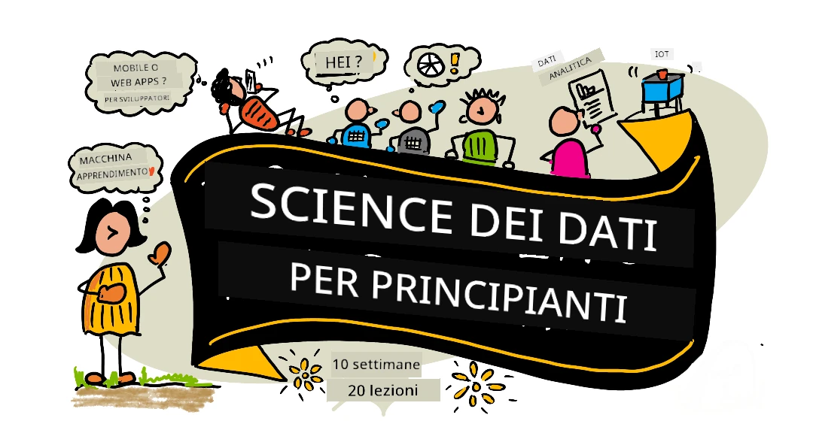
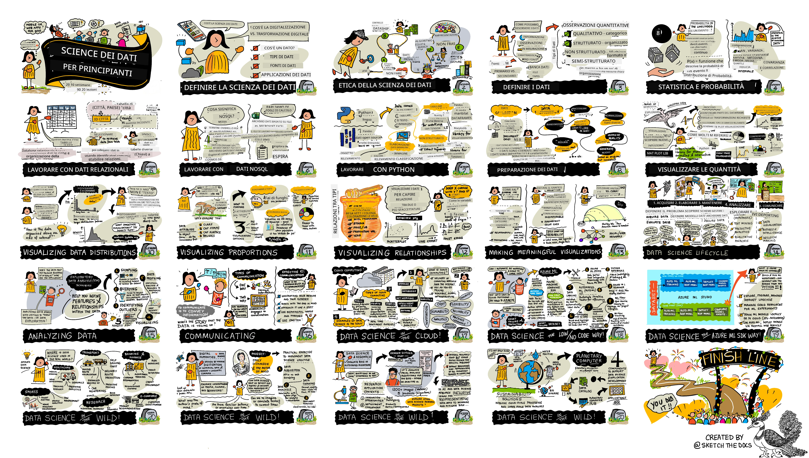

# Data Science per Principianti - Un Curriculum

[](https://github.com/codespaces/new?hide_repo_select=true&ref=main&repo=344191198)

[](https://github.com/microsoft/Data-Science-For-Beginners/blob/master/LICENSE)
[](https://GitHub.com/microsoft/Data-Science-For-Beginners/graphs/contributors/)
[](https://GitHub.com/microsoft/Data-Science-For-Beginners/issues/)
[](https://GitHub.com/microsoft/Data-Science-For-Beginners/pulls/)
[](http://makeapullrequest.com)

[](https://GitHub.com/microsoft/Data-Science-For-Beginners/watchers/)
[](https://GitHub.com/microsoft/Data-Science-For-Beginners/network/)
[](https://GitHub.com/microsoft/Data-Science-For-Beginners/stargazers/)


[](https://discord.gg/nTYy5BXMWG)

[](https://aka.ms/foundry/forum)

Gli Azure Cloud Advocates di Microsoft sono lieti di offrire un curriculum di 10 settimane, con 20 lezioni completamente dedicate alla Data Science. Ogni lezione include quiz pre-lezione e post-lezione, istruzioni scritte per completare la lezione, una soluzione e un esercizio. La nostra pedagogia basata su progetti ti permette di imparare costruendo, un metodo comprovato per fare "attaccare" nuove competenze.

**Un sentito grazie ai nostri autori:** [Jasmine Greenaway](https://www.twitter.com/paladique), [Dmitry Soshnikov](http://soshnikov.com), [Nitya Narasimhan](https://twitter.com/nitya), [Jalen McGee](https://twitter.com/JalenMcG), [Jen Looper](https://twitter.com/jenlooper), [Maud Levy](https://twitter.com/maudstweets), [Tiffany Souterre](https://twitter.com/TiffanySouterre), [Christopher Harrison](https://www.twitter.com/geektrainer).

**🙏 Un ringraziamento speciale 🙏 ai nostri autori, revisori e collaboratori di contenuti [Microsoft Student Ambassador](https://studentambassadors.microsoft.com/),** in particolare Aaryan Arora, [Aditya Garg](https://github.com/AdityaGarg00), [Alondra Sanchez](https://www.linkedin.com/in/alondra-sanchez-molina/), [Ankita Singh](https://www.linkedin.com/in/ankitasingh007), [Anupam Mishra](https://www.linkedin.com/in/anupam--mishra/), [Arpita Das](https://www.linkedin.com/in/arpitadas01/), ChhailBihari Dubey, [Dibri Nsofor](https://www.linkedin.com/in/dibrinsofor), [Dishita Bhasin](https://www.linkedin.com/in/dishita-bhasin-7065281bb), [Majd Safi](https://www.linkedin.com/in/majd-s/), [Max Blum](https://www.linkedin.com/in/max-blum-6036a1186/), [Miguel Correa](https://www.linkedin.com/in/miguelmque/), [Mohamma Iftekher (Iftu) Ebne Jalal](https://twitter.com/iftu119), [Nawrin Tabassum](https://www.linkedin.com/in/nawrin-tabassum), [Raymond Wangsa Putra](https://www.linkedin.com/in/raymond-wp/), [Rohit Yadav](https://www.linkedin.com/in/rty2423), Samridhi Sharma, [Sanya Sinha](https://www.linkedin.com/mwlite/in/sanya-sinha-13aab1200),
[Sheena Narula](https://www.linkedin.com/in/sheena-narua-n/), [Tauqeer Ahmad](https://www.linkedin.com/in/tauqeerahmad5201/), Yogendrasingh Pawar , [Vidushi Gupta](https://www.linkedin.com/in/vidushi-gupta07/), [Jasleen Sondhi](https://www.linkedin.com/in/jasleen-sondhi/)

||
|:---:|
| Data Science For Beginners - _Sketchnote di [@nitya](https://twitter.com/nitya)_ |

### 🌐 Supporto Multilingue

#### Supportato tramite GitHub Action (Automatizzato & Sempre Aggiornato)

<!-- CO-OP TRANSLATOR LANGUAGES TABLE START -->
[Arabic](../ar/README.md) | [Bengali](../bn/README.md) | [Bulgarian](../bg/README.md) | [Burmese (Myanmar)](../my/README.md) | [Chinese (Simplified)](../zh-CN/README.md) | [Chinese (Traditional, Hong Kong)](../zh-HK/README.md) | [Chinese (Traditional, Macau)](../zh-MO/README.md) | [Chinese (Traditional, Taiwan)](../zh-TW/README.md) | [Croatian](../hr/README.md) | [Czech](../cs/README.md) | [Danish](../da/README.md) | [Dutch](../nl/README.md) | [Estonian](../et/README.md) | [Finnish](../fi/README.md) | [French](../fr/README.md) | [German](../de/README.md) | [Greek](../el/README.md) | [Hebrew](../he/README.md) | [Hindi](../hi/README.md) | [Hungarian](../hu/README.md) | [Indonesian](../id/README.md) | [Italian](./README.md) | [Japanese](../ja/README.md) | [Kannada](../kn/README.md) | [Khmer](../km/README.md) | [Korean](../ko/README.md) | [Lithuanian](../lt/README.md) | [Malay](../ms/README.md) | [Malayalam](../ml/README.md) | [Marathi](../mr/README.md) | [Nepali](../ne/README.md) | [Nigerian Pidgin](../pcm/README.md) | [Norwegian](../no/README.md) | [Persian (Farsi)](../fa/README.md) | [Polish](../pl/README.md) | [Portuguese (Brazil)](../pt-BR/README.md) | [Portuguese (Portugal)](../pt-PT/README.md) | [Punjabi (Gurmukhi)](../pa/README.md) | [Romanian](../ro/README.md) | [Russian](../ru/README.md) | [Serbian (Cyrillic)](../sr/README.md) | [Slovak](../sk/README.md) | [Slovenian](../sl/README.md) | [Spanish](../es/README.md) | [Swahili](../sw/README.md) | [Swedish](../sv/README.md) | [Tagalog (Filipino)](../tl/README.md) | [Tamil](../ta/README.md) | [Telugu](../te/README.md) | [Thai](../th/README.md) | [Turkish](../tr/README.md) | [Ukrainian](../uk/README.md) | [Urdu](../ur/README.md) | [Vietnamese](../vi/README.md)

> **Preferisci clonare localmente?**
>
> Questo repository include oltre 50 traduzioni linguistiche che aumentano significativamente la dimensione del download. Per clonare senza le traduzioni, utilizza lo sparse checkout:
>
> **Bash / macOS / Linux:**
> ```bash
> git clone --filter=blob:none --sparse https://github.com/microsoft/Data-Science-For-Beginners.git
> cd Data-Science-For-Beginners
> git sparse-checkout set --no-cone '/*' '!translations' '!translated_images'
> ```
>
> **CMD (Windows):**
> ```cmd
> git clone --filter=blob:none --sparse https://github.com/microsoft/Data-Science-For-Beginners.git
> cd Data-Science-For-Beginners
> git sparse-checkout set --no-cone "/*" "!translations" "!translated_images"
> ```
>
> Questo ti fornisce tutto il necessario per completare il corso con un download molto più veloce.
<!-- CO-OP TRANSLATOR LANGUAGES TABLE END -->

**Se desideri che vengano supportate lingue aggiuntive, sono elencate [qui](https://github.com/Azure/co-op-translator/blob/main/getting_started/supported-languages.md)**

#### Unisciti alla nostra Comunità  
[](https://discord.gg/nTYy5BXMWG)

Abbiamo una serie Discord "Learn with AI" in corso, scopri di più e unisciti a noi su [Learn with AI Series](https://aka.ms/learnwithai/discord) dal 18 al 30 settembre 2025. Riceverai consigli e trucchi sull'uso di GitHub Copilot per la Data Science.


# Sei uno studente?

Inizia con le seguenti risorse:

- [Pagina Student Hub](https://docs.microsoft.com/en-gb/learn/student-hub?WT.mc_id=academic-77958-bethanycheum) In questa pagina, troverai risorse per principianti, pacchetti per studenti e perfino modi per ottenere un voucher gratuito per la certificazione. Questa è una pagina da aggiungere ai preferiti e consultare di tanto in tanto, poiché aggiorniamo i contenuti almeno mensilmente.
- [Microsoft Learn Student Ambassadors](https://studentambassadors.microsoft.com?WT.mc_id=academic-77958-bethanycheum) Unisciti a una comunità globale di ambasciatori studenteschi, questa potrebbe essere la tua strada verso Microsoft.

# Come Iniziare

## 📚 Documentazione

- **[Guida all'installazione](INSTALLATION.md)** - Istruzioni passo-passo per l'installazione per principianti
- **[Guida all'uso](USAGE.md)** - Esempi e flussi di lavoro comuni
- **[Risoluzione dei problemi](TROUBLESHOOTING.md)** - Soluzioni ai problemi comuni
- **[Guida alla contribuzione](CONTRIBUTING.md)** - Come contribuire a questo progetto
- **[Per insegnanti](for-teachers.md)** - Guida didattica e risorse per la classe

## 👨‍🎓 Per Studenti
> **Principianti completi**: Nuovo alla data science? Inizia con i nostri [esempi per principianti](examples/README.md)! Questi esempi semplici e ben commentati ti aiuteranno a comprendere le basi prima di immergerti nel curriculum completo.
> **[Studenti](https://aka.ms/student-page)**: per usare questo curriculum in autonomia, fai il fork dell'intero repo e completa gli esercizi da solo, iniziando con un quiz pre-lezione. Poi leggi la lezione e completa le altre attività. Cerca di creare i progetti comprendendo le lezioni anziché copiare il codice soluzione; tuttavia, quel codice è disponibile nelle cartelle /solutions in ogni lezione orientata al progetto. Un'altra idea sarebbe formare un gruppo di studio con amici e seguire insieme i contenuti. Per ulteriori studi, consigliamo [Microsoft Learn](https://docs.microsoft.com/en-us/users/jenlooper-2911/collections/qprpajyoy3x0g7?WT.mc_id=academic-77958-bethanycheum).

**Avvio rapido:**
1. Controlla la [Guida all'installazione](INSTALLATION.md) per configurare il tuo ambiente
2. Consulta la [Guida all'uso](USAGE.md) per imparare come lavorare con il curriculum
3. Inizia con la Lezione 1 e procedi in sequenza
4. Unisciti alla nostra [comunità Discord](https://aka.ms/ds4beginners/discord) per supporto

## 👩‍🏫 Per Insegnanti
> **Insegnanti**: abbiamo [incluso alcuni suggerimenti](for-teachers.md) su come utilizzare questo curriculum. Ci piacerebbe ricevere il vostro feedback [nel nostro forum di discussione](https://github.com/microsoft/Data-Science-For-Beginners/discussions)!

## Incontra il Team

[](https://youtu.be/8mzavjQSMM4 "Video promozionale")

**Gif di** [Mohit Jaisal](https://www.linkedin.com/in/mohitjaisal)

> 🎥 Clicca sull'immagine sopra per un video sul progetto e sulle persone che lo hanno creato!

## Pedagogia

Abbiamo scelto due principi pedagogici nella costruzione di questo curriculum: garantire che sia basato su progetti e che includa quiz frequenti. Alla fine di questa serie, gli studenti avranno appreso i principi base della scienza dei dati, inclusi concetti etici, preparazione dei dati, diversi modi di lavorare con i dati, visualizzazione dei dati, analisi dei dati, casi d'uso reali della scienza dei dati e altro ancora.

Inoltre, un quiz a bassa pressione prima della lezione indirizza lo studente verso l’apprendimento di un argomento, mentre un secondo quiz dopo la lezione ne assicura una ulteriore memorizzazione. Questo curriculum è stato progettato per essere flessibile e divertente e può essere seguito interamente o in parte. I progetti iniziano piccoli e diventano sempre più complessi entro la fine del ciclo di 10 settimane.

> Trova il nostro [Codice di Condotta](CODE_OF_CONDUCT.md), le linee guida per il [Contributo](CONTRIBUTING.md), [Traduzione](TRANSLATIONS.md). Accogliamo con piacere i tuoi feedback costruttivi!

## Ogni lezione include:

- Sketchnote opzionale
- Video supplementare opzionale
- Quiz di riscaldamento pre-lezione
- Lezione scritta
- Per le lezioni basate su progetti, guide passo-passo su come costruire il progetto
- Verifiche della conoscenza
- Una sfida
- Letture supplementari
- Compito
- [Quiz post-lezione](https://ff-quizzes.netlify.app/en/)

> **Una nota sui quiz**: Tutti i quiz sono contenuti nella cartella Quiz-App, per un totale di 40 quiz con tre domande ciascuno. Sono linkati all'interno delle lezioni, ma l'app di quiz può essere eseguita localmente o distribuita su Azure; segui le istruzioni nella cartella `quiz-app`. Sono in corso di localizzazione graduale.

## 🎓 Esempi per principianti

**Sei nuovo alla scienza dei dati?** Abbiamo creato una speciale [cartella di esempi](examples/README.md) con codice semplice e ben commentato per aiutarti a iniziare:

- 🌟 **Hello World** - Il tuo primo programma di scienza dei dati
- 📂 **Caricamento dati** - Impara a leggere ed esplorare i dataset
- 📊 **Analisi semplice** - Calcola statistiche e trova pattern
- 📈 **Visualizzazione di base** - Crea grafici e diagrammi
- 🔬 **Progetto reale** - Workflow completo dall’inizio alla fine

Ogni esempio include commenti dettagliati che spiegano ogni passaggio, rendendolo perfetto per principianti assoluti!

👉 **[Inizia con gli esempi](examples/README.md)** 👈

## Lezioni


||
|:---:|
| Data Science per Principianti: Roadmap - _Sketchnote di [@nitya](https://twitter.com/nitya)_ |


| Numero Lezione | Argomento | Gruppo di Lezioni | Obiettivi di Apprendimento | Lezione Collegata | Autore |
| :-----------: | :----------------------------------------: | :--------------------------------------------------: | :-----------------------------------------------------------------------------------------------------------------------------------------------------------------------: | :---------------------------------------------------------------------: | :----: |
| 01 | Definire la Scienza dei Dati | [Introduzione](1-Introduction/README.md) | Impara i concetti base dietro la scienza dei dati e come è correlata all’intelligenza artificiale, al machine learning e al big data. | [lezione](1-Introduction/01-defining-data-science/README.md) [video](https://youtu.be/beZ7Mb_oz9I) | [Dmitry](http://soshnikov.com) |
| 02 | Etica nella Scienza dei Dati | [Introduzione](1-Introduction/README.md) | Concetti, sfide e quadri etici della scienza dei dati. | [lezione](1-Introduction/02-ethics/README.md) | [Nitya](https://twitter.com/nitya) |
| 03 | Definire i Dati | [Introduzione](1-Introduction/README.md) | Come i dati sono classificati e le loro fonti comuni. | [lezione](1-Introduction/03-defining-data/README.md) | [Jasmine](https://www.twitter.com/paladique) |
| 04 | Introduzione a Statistica e Probabilità | [Introduzione](1-Introduction/README.md) | Le tecniche matematiche di probabilità e statistica per comprendere i dati. | [lezione](1-Introduction/04-stats-and-probability/README.md) [video](https://youtu.be/Z5Zy85g4Yjw) | [Dmitry](http://soshnikov.com) |
| 05 | Lavorare con dati relazionali | [Lavorare con i dati](2-Working-With-Data/README.md) | Introduzione ai dati relazionali e basi per esplorare e analizzare dati relazionali con Structured Query Language, noto anche come SQL (pronunciato "see-quell"). | [lezione](2-Working-With-Data/05-relational-databases/README.md) | [Christopher](https://www.twitter.com/geektrainer) | | |
| 06 | Lavorare con dati NoSQL | [Lavorare con i dati](2-Working-With-Data/README.md) | Introduzione ai dati non relazionali, ai loro vari tipi e alle basi per esplorare e analizzare database di documenti. | [lezione](2-Working-With-Data/06-non-relational/README.md) | [Jasmine](https://twitter.com/paladique)|
| 07 | Lavorare con Python | [Lavorare con i dati](2-Working-With-Data/README.md) | Basi dell’uso di Python per l’esplorazione dati con librerie come Pandas. Si raccomanda una conoscenza di base di programmazione Python. | [lezione](2-Working-With-Data/07-python/README.md) [video](https://youtu.be/dZjWOGbsN4Y) | [Dmitry](http://soshnikov.com) |
| 08 | Preparazione dati | [Lavorare con i dati](2-Working-With-Data/README.md) | Argomenti sulle tecniche di pulizia e trasformazione dei dati per gestire problemi di dati mancanti, inaccurati o incompleti. | [lezione](2-Working-With-Data/08-data-preparation/README.md) | [Jasmine](https://www.twitter.com/paladique) |
| 09 | Visualizzare quantità | [Visualizzazione dati](3-Data-Visualization/README.md) | Imparare a usare Matplotlib per visualizzare dati di uccelli 🦆 | [lezione](3-Data-Visualization/09-visualization-quantities/README.md) | [Jen](https://twitter.com/jenlooper) |
| 10 | Visualizzare distribuzioni di dati | [Visualizzazione dati](3-Data-Visualization/README.md) | Visualizzare osservazioni e tendenze in un intervallo. | [lezione](3-Data-Visualization/10-visualization-distributions/README.md) | [Jen](https://twitter.com/jenlooper) |
| 11 | Visualizzare proporzioni | [Visualizzazione dati](3-Data-Visualization/README.md) | Visualizzare percentuali discrete e raggruppate. | [lezione](3-Data-Visualization/11-visualization-proportions/README.md) | [Jen](https://twitter.com/jenlooper) |
| 12 | Visualizzare relazioni | [Visualizzazione dati](3-Data-Visualization/README.md) | Visualizzare connessioni e correlazioni tra set di dati e loro variabili. | [lezione](3-Data-Visualization/12-visualization-relationships/README.md) | [Jen](https://twitter.com/jenlooper) |
| 13 | Visualizzazioni significative | [Visualizzazione dati](3-Data-Visualization/README.md) | Tecniche e indicazioni per rendere le tue visualizzazioni utili per una risoluzione efficace dei problemi e per insight. | [lezione](3-Data-Visualization/13-meaningful-visualizations/README.md) | [Jen](https://twitter.com/jenlooper) |
| 14 | Introduzione al ciclo di vita della scienza dei dati | [Ciclo di vita](4-Data-Science-Lifecycle/README.md) | Introduzione al ciclo di vita della scienza dei dati e al suo primo passo di acquisizione ed estrazione dei dati. | [lezione](4-Data-Science-Lifecycle/14-Introduction/README.md) | [Jasmine](https://twitter.com/paladique) |
| 15 | Analisi | [Ciclo di vita](4-Data-Science-Lifecycle/README.md) | Questa fase del ciclo di vita della scienza dei dati si concentra sulle tecniche di analisi dei dati. | [lezione](4-Data-Science-Lifecycle/15-analyzing/README.md) | [Jasmine](https://twitter.com/paladique) | | |
| 16 | Comunicazione | [Ciclo di vita](4-Data-Science-Lifecycle/README.md) | Questa fase del ciclo di vita della scienza dei dati si concentra sulla presentazione degli insight dei dati in modo da agevolare la comprensione da parte dei decisori. | [lezione](4-Data-Science-Lifecycle/16-communication/README.md) | [Jalen](https://twitter.com/JalenMcG) | | |
| 17 | Scienza dei dati nel cloud | [Dati Cloud](5-Data-Science-In-Cloud/README.md) | Questa serie di lezioni introduce la scienza dei dati nel cloud e i suoi benefici. | [lezione](5-Data-Science-In-Cloud/17-Introduction/README.md) | [Tiffany](https://twitter.com/TiffanySouterre) e [Maud](https://twitter.com/maudstweets) |
| 18 | Scienza dei dati nel cloud | [Dati Cloud](5-Data-Science-In-Cloud/README.md) | Addestramento di modelli usando strumenti Low Code. |[lezione](5-Data-Science-In-Cloud/18-Low-Code/README.md) | [Tiffany](https://twitter.com/TiffanySouterre) e [Maud](https://twitter.com/maudstweets) |
| 19 | Scienza dei dati nel cloud | [Dati Cloud](5-Data-Science-In-Cloud/README.md) | Distribuzione di modelli con Azure Machine Learning Studio. | [lezione](5-Data-Science-In-Cloud/19-Azure/README.md)| [Tiffany](https://twitter.com/TiffanySouterre) e [Maud](https://twitter.com/maudstweets) |
| 20 | Scienza dei dati sul campo | [Sul campo](6-Data-Science-In-Wild/README.md) | Progetti di scienza dei dati nel mondo reale. | [lezione](6-Data-Science-In-Wild/20-Real-World-Examples/README.md) | [Nitya](https://twitter.com/nitya) |

## GitHub Codespaces

Segui questi passaggi per aprire questo esempio in un Codespace:
1. Clicca sul menu a discesa Codice e seleziona l’opzione Apri con Codespaces.
2. Seleziona + Nuovo codespace in fondo al pannello.
Per maggiori informazioni, consulta la [documentazione GitHub](https://docs.github.com/en/codespaces/developing-in-codespaces/creating-a-codespace-for-a-repository#creating-a-codespace).

## VSCode Remote - Containers
Segui questi passaggi per aprire questo repository in un container usando la tua macchina locale e VSCode con l’estensione VS Code Remote - Containers:

1. Se è la prima volta che usi un container di sviluppo, verifica che il tuo sistema soddisfi i prerequisiti (ad esempio avere Docker installato) nella [documentazione introduttiva](https://code.visualstudio.com/docs/devcontainers/containers#_getting-started).

Per usare questo repository, puoi aprirlo in un volume Docker isolato:

**Nota**: In pratica, questo utilizzerà il comando Remote-Containers: **Clona repository in volume container...** per clonare il codice sorgente in un volume Docker anziché nel file system locale. I [volumi](https://docs.docker.com/storage/volumes/) sono il meccanismo preferito per la persistenza dei dati nei container.

Oppure apri una versione clonata o scaricata localmente del repository:

- Clona questo repository nel tuo file system locale.
- Premi F1 e seleziona il comando **Remote-Containers: Apri cartella nel container...**.
- Seleziona la copia clonata di questa cartella, attendi l’avvio del container e prova a usarla.

## Accesso offline

Puoi eseguire questa documentazione offline usando [Docsify](https://docsify.js.org/#/). Fai un fork di questo repo, [installa Docsify](https://docsify.js.org/#/quickstart) sulla tua macchina locale, quindi nella cartella root di questo repo digita `docsify serve`. Il sito web sarà servito sulla porta 3000 sul tuo localhost: `localhost:3000`.

> Nota, i notebook non saranno renderizzati tramite Docsify, quindi quando devi eseguire un notebook, fallo separatamente in VS Code eseguendo un kernel Python.

## Altri curricula

Il nostro team produce altri curricula! Dai un’occhiata:

<!-- CO-OP TRANSLATOR OTHER COURSES START -->
### LangChain
[](https://aka.ms/langchain4j-for-beginners)
[](https://aka.ms/langchainjs-for-beginners?WT.mc_id=m365-94501-dwahlin)
[](https://github.com/microsoft/langchain-for-beginners?WT.mc_id=m365-94501-dwahlin)
---

### Azure / Edge / MCP / Agenti
[](https://github.com/microsoft/AZD-for-beginners?WT.mc_id=academic-105485-koreyst)
[](https://github.com/microsoft/edgeai-for-beginners?WT.mc_id=academic-105485-koreyst)
[](https://github.com/microsoft/mcp-for-beginners?WT.mc_id=academic-105485-koreyst)
[](https://github.com/microsoft/ai-agents-for-beginners?WT.mc_id=academic-105485-koreyst)

---
 
### Serie Intelligenza Artificiale Generativa
[](https://github.com/microsoft/generative-ai-for-beginners?WT.mc_id=academic-105485-koreyst)
[-9333EA?style=for-the-badge&labelColor=E5E7EB&color=9333EA)](https://github.com/microsoft/Generative-AI-for-beginners-dotnet?WT.mc_id=academic-105485-koreyst)
[-C084FC?style=for-the-badge&labelColor=E5E7EB&color=C084FC)](https://github.com/microsoft/generative-ai-for-beginners-java?WT.mc_id=academic-105485-koreyst)
[-E879F9?style=for-the-badge&labelColor=E5E7EB&color=E879F9)](https://github.com/microsoft/generative-ai-with-javascript?WT.mc_id=academic-105485-koreyst)

---
 
### Apprendimento di Base
[](https://aka.ms/ml-beginners?WT.mc_id=academic-105485-koreyst)
[](https://aka.ms/datascience-beginners?WT.mc_id=academic-105485-koreyst)
[](https://aka.ms/ai-beginners?WT.mc_id=academic-105485-koreyst)
[](https://github.com/microsoft/Security-101?WT.mc_id=academic-96948-sayoung)
[](https://aka.ms/webdev-beginners?WT.mc_id=academic-105485-koreyst)
[](https://aka.ms/iot-beginners?WT.mc_id=academic-105485-koreyst)
[](https://github.com/microsoft/xr-development-for-beginners?WT.mc_id=academic-105485-koreyst)

---
 
### Serie Copilot
[](https://aka.ms/GitHubCopilotAI?WT.mc_id=academic-105485-koreyst)
[](https://github.com/microsoft/mastering-github-copilot-for-dotnet-csharp-developers?WT.mc_id=academic-105485-koreyst)
[](https://github.com/microsoft/CopilotAdventures?WT.mc_id=academic-105485-koreyst)
<!-- CO-OP TRANSLATOR OTHER COURSES END -->

## Ottenere aiuto

**Hai riscontrato problemi?** Consulta la nostra [Guida alla risoluzione dei problemi](TROUBLESHOOTING.md) per soluzioni ai problemi comuni.

Se rimani bloccato o hai domande sulla creazione di app AI, unisciti a altri apprendenti e sviluppatori esperti nelle discussioni su MCP. È una comunità di supporto dove le domande sono benvenute e la conoscenza viene condivisa liberamente.

[](https://discord.gg/nTYy5BXMWG)

Se hai feedback sul prodotto o riscontri errori durante lo sviluppo, visita:

[](https://aka.ms/foundry/forum)

---

<!-- CO-OP TRANSLATOR DISCLAIMER START -->
**Disclaimer**:  
Questo documento è stato tradotto utilizzando il servizio di traduzione AI [Co-op Translator](https://github.com/Azure/co-op-translator). Pur impegnandoci per l’accuratezza, si prega di notare che le traduzioni automatiche possono contenere errori o inesattezze. Il documento originale nella sua lingua madre deve essere considerato la fonte autorevole. Per informazioni critiche, si raccomanda la traduzione professionale umana. Non siamo responsabili per eventuali malintesi o interpretazioni errate derivanti dall’uso di questa traduzione.
<!-- CO-OP TRANSLATOR DISCLAIMER END -->