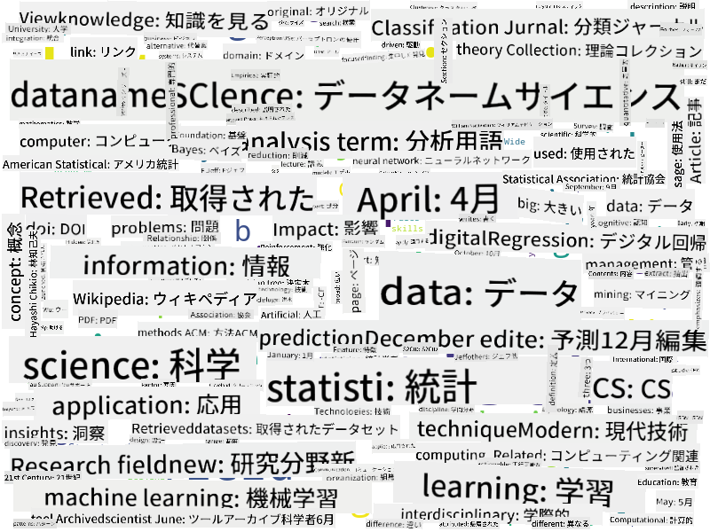

<!--
CO_OP_TRANSLATOR_METADATA:
{
  "original_hash": "a76ab694b1534fa57981311975660bfe",
  "translation_date": "2025-09-06T12:08:35+00:00",
  "source_file": "1-Introduction/01-defining-data-science/README.md",
  "language_code": "ja"
}
-->
## データの種類

前述の通り、データは至る所に存在しています。ただし、それを適切に収集する必要があります！データには、**構造化データ**と**非構造化データ**を区別することが有用です。構造化データは通常、表や複数の表の形式で整理されており、非構造化データは単なるファイルの集合です。また、**半構造化データ**についても言及することがあります。これはある程度の構造を持っていますが、その構造は大きく異なる場合があります。

| 構造化データ                                                              | 半構造化データ                                                                                   | 非構造化データ                        |
| ------------------------------------------------------------------------- | ------------------------------------------------------------------------------------------------ | ------------------------------------- |
| 人々の名前と電話番号のリスト                                               | リンク付きのWikipediaページ                                                                      | ブリタニカ百科事典のテキスト          |
| 過去20年間の建物内の各部屋の毎分ごとの温度                                 | 著者、発行日、要約を含むJSON形式の科学論文のコレクション                                         | 企業文書が保存されたファイル共有       |
| 建物に入るすべての人の年齢と性別のデータ                                   | インターネットページ                                                                             | 監視カメラからの生のビデオフィード     |

## データの入手先

データの入手先は無数にあり、すべてを列挙するのは不可能です！しかし、典型的なデータの入手先をいくつか挙げてみましょう：

* **構造化データ**
  - **IoT（モノのインターネット）**：温度センサーや圧力センサーなど、さまざまなセンサーからのデータは非常に有用です。例えば、オフィスビルがIoTセンサーで装備されている場合、コストを最小限に抑えるために暖房や照明を自動的に制御できます。
  - **アンケート**：購入後やウェブサイト訪問後にユーザーに記入してもらうアンケート。
  - **行動分析**：例えば、ユーザーがサイト内でどの程度深く進むのか、またはサイトを離れる典型的な理由を理解するのに役立ちます。
* **非構造化データ**
  - **テキスト**：全体的な**感情スコア**やキーワードや意味の抽出など、豊富な洞察を得ることができます。
  - **画像**や**ビデオ**：監視カメラのビデオは、道路の交通量を推定し、潜在的な渋滞について人々に通知するのに役立ちます。
  - ウェブサーバーの**ログ**：サイト内で最も頻繁に訪問されるページや滞在時間を理解するのに役立ちます。
* **半構造化データ**
  - **ソーシャルネットワーク**のグラフ：ユーザーの性格や情報拡散の効果を知るための優れたデータ源となります。
  - パーティーで撮影された写真の束がある場合、写真を撮り合った人々のグラフを作成することで、**グループダイナミクス**データを抽出できます。

さまざまなデータの入手先を知ることで、データサイエンスの技術を適用して状況をよりよく理解し、ビジネスプロセスを改善するためのさまざまなシナリオを考えることができます。

## データでできること

データサイエンスでは、データの旅の次のステップに焦点を当てます：

もちろん、実際のデータに応じて、いくつかのステップが省略される場合があります（例えば、すでにデータベースにデータがある場合や、モデルのトレーニングが不要な場合）。また、いくつかのステップが何度も繰り返される場合もあります（例えば、データ処理など）。

## デジタル化とデジタルトランスフォーメーション

過去10年間、多くの企業がビジネスの意思決定におけるデータの重要性を理解し始めました。データサイエンスの原則をビジネス運営に適用するには、まずデータを収集する必要があります。つまり、ビジネスプロセスをデジタル形式に変換する必要があります。これを**デジタル化**と呼びます。このデータにデータサイエンス技術を適用して意思決定を導くことで、生産性の大幅な向上（またはビジネスの方向転換）を実現することができ、これを**デジタルトランスフォーメーション**と呼びます。

例を考えてみましょう。データサイエンスのコース（このコースのようなもの）をオンラインで学生に提供しているとします。そして、データサイエンスを活用してコースを改善したいと考えています。どうすればよいでしょうか？

まず、「何をデジタル化できるか？」を考えることから始めます。最も簡単な方法は、各モジュールを完了するのに各学生がかかった時間を測定し、各モジュールの最後に選択式テストを実施して得られた知識を測定することです。すべての学生の平均完了時間を計算することで、学生にとって最も難しいモジュールを特定し、それを簡略化するための作業を行うことができます。
モジュールの長さが異なる可能性があるため、このアプローチが理想的ではないと主張するかもしれません。モジュールの長さ（文字数）で時間を割り、その値を比較する方が、おそらくより公平でしょう。
複数選択式テストの結果を分析し始めるとき、学生が理解に苦労している概念を特定し、その情報を使ってコンテンツを改善することができます。そのためには、各質問が特定の概念や知識の一部に対応するようにテストを設計する必要があります。

さらに複雑にしたい場合は、各モジュールにかかる時間を学生の年齢カテゴリと比較してプロットすることもできます。ある年齢カテゴリではモジュールを完了するのに不適切に長い時間がかかる、または学生が完了する前に離脱してしまうことが分かるかもしれません。この情報を活用して、モジュールの年齢推奨を提供し、不適切な期待による不満を最小限に抑えることができます。

## 🚀 チャレンジ

このチャレンジでは、テキストを調べることでデータサイエンス分野に関連する概念を見つけようとします。データサイエンスに関するWikipediaの記事を取得し、テキストを処理した後、以下のようなワードクラウドを作成します：

[`notebook.ipynb`](../../../../1-Introduction/01-defining-data-science/notebook.ipynb ':ignore') を訪れてコードを読んでみてください。コードを実行して、データ変換がリアルタイムでどのように行われるかを確認することもできます。

> Jupyter Notebookでコードを実行する方法が分からない場合は、[この記事](https://soshnikov.com/education/how-to-execute-notebooks-from-github/)を参照してください。

## [講義後のクイズ](https://ff-quizzes.netlify.app/en/ds/quiz/1)

## 課題

* **タスク 1**: 上記のコードを修正して、**ビッグデータ**や**機械学習**の分野に関連する概念を見つけてください。
* **タスク 2**: [データサイエンスのシナリオを考える](assignment.md)

## クレジット

このレッスンは [Dmitry Soshnikov](http://soshnikov.com) によって ♥️ を込めて作成されました。

---

**免責事項**:  
この文書は、AI翻訳サービス [Co-op Translator](https://github.com/Azure/co-op-translator) を使用して翻訳されています。正確性を期すよう努めておりますが、自動翻訳には誤りや不正確な表現が含まれる可能性があります。元の言語で記載された原文が公式な情報源と見なされるべきです。重要な情報については、専門の人間による翻訳を推奨します。この翻訳の使用に起因する誤解や誤解釈について、当方は一切の責任を負いません。