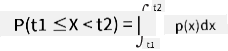

<!--
CO_OP_TRANSLATOR_METADATA:
{
  "original_hash": "ce95884566a74db72572cd51f0cb25ad",
  "translation_date": "2025-09-06T13:10:10+00:00",
  "source_file": "1-Introduction/04-stats-and-probability/README.md",
  "language_code": "ja"
}
-->
# 統計学と確率論の簡単な紹介

| ](../../sketchnotes/04-Statistics-Probability.png)|
|:---:|
| 統計学と確率論 - _スケッチノート by [@nitya](https://twitter.com/nitya)_ |

統計学と確率論は、データサイエンスにおいて非常に関連性の高い数学の分野です。数学の深い知識がなくてもデータを扱うことは可能ですが、基本的な概念を少しでも知っておく方が良いでしょう。ここでは、始めるための簡単な紹介を行います。

[](https://youtu.be/Z5Zy85g4Yjw)

## [講義前のクイズ](https://ff-quizzes.netlify.app/en/ds/quiz/6)

## 確率とランダム変数

**確率**とは、ある**事象**がどれだけ起こりやすいかを表す0から1の間の数値です。これは、事象を引き起こす正の結果の数を、すべての結果の総数で割ったものとして定義されます。ただし、すべての結果が等しく起こりやすい場合に限ります。例えば、サイコロを振ったとき、偶数が出る確率は3/6 = 0.5です。

事象について話す際には、**ランダム変数**を使用します。例えば、サイコロを振ったときに得られる数字を表すランダム変数は1から6までの値を取ります。この1から6までの数字の集合は**標本空間**と呼ばれます。ランダム変数が特定の値を取る確率について話すことができます。例えば、P(X=3)=1/6です。

前述の例のランダム変数は**離散型**と呼ばれます。これは、標本空間が数えられる値で構成されているためです。つまり、列挙可能な個別の値があります。一方で、標本空間が実数の範囲や実数全体である場合もあります。このような変数は**連続型**と呼ばれます。良い例としては、バスが到着する時間があります。

## 確率分布

離散型ランダム変数の場合、各事象の確率を関数P(X)で簡単に記述できます。標本空間*S*の各値*s*に対して、0から1の間の数値を与え、すべての事象に対するP(X=s)の値の合計が1になるようにします。

最もよく知られている離散分布は**一様分布**で、N個の要素からなる標本空間があり、それぞれの確率が1/Nで等しいものです。

連続型変数の確率分布を記述するのはより難しくなります。例えば、バスの到着時間のように、値が[a,b]の範囲や実数全体ℝから取られる場合です。実際には、特定の到着時間*t*にバスが到着する確率は0です！

> 確率が0の事象が起こることがあるのを知っておきましょう。そして、それは非常に頻繁に起こります！少なくともバスが到着するたびに！

変数が特定の値の範囲に収まる確率についてのみ話すことができます。例えば、P(t<sub>1</sub>≤X<t<sub>2</sub>)です。この場合、確率分布は**確率密度関数**p(x)によって記述されます。



連続型の一様分布は**連続一様分布**と呼ばれ、有限の区間で定義されます。値Xが長さlの区間に収まる確率はlに比例し、最大で1になります。

もう一つ重要な分布は**正規分布**で、これについては後ほど詳しく説明します。

## 平均、分散、標準偏差

ランダム変数Xのn個のサンプルを抽出するとします。x<sub>1</sub>, x<sub>2</sub>, ..., x<sub>n</sub>です。この列の**平均**（または**算術平均**）値を、従来の方法で(x<sub>1</sub>+x<sub>2</sub>+...+x<sub>n</sub>)/nとして定義できます。サンプルサイズを増やしていくと（n→∞の極限を取ると）、分布の平均（**期待値**とも呼ばれる）を得ることができます。期待値は**E**(x)で表します。

> 離散分布で値が{x<sub>1</sub>, x<sub>2</sub>, ..., x<sub>N</sub>}であり、それに対応する確率がp<sub>1</sub>, p<sub>2</sub>, ..., p<sub>N</sub>の場合、期待値はE(X)=x<sub>1</sub>p<sub>1</sub>+x<sub>2</sub>p<sub>2</sub>+...+x<sub>N</sub>p<sub>N</sub>となることが示されています。

値がどれだけ広がっているかを特定するために、分散σ<sup>2</sup> = ∑(x<sub>i</sub> - μ)<sup>2</sup>/nを計算できます。ここでμは列の平均です。値σは**標準偏差**と呼ばれ、σ<sup>2</sup>は**分散**と呼ばれます。

## 最頻値、中央値、四分位数

時には、平均がデータの「典型的な」値を十分に表さないことがあります。例えば、範囲外の極端な値がいくつかある場合、それらが平均に影響を与えることがあります。もう一つの良い指標は**中央値**で、データポイントの半分がその値より低く、もう半分がその値より高い値です。

データの分布を理解するためには、**四分位数**について話すのが役立ちます：

* 第一四分位数（Q1）は、データの25%がその値より低い値
* 第三四分位数（Q3）は、データの75%がその値より低い値

中央値と四分位数の関係を図示するために、**箱ひげ図**と呼ばれる図を使用します：


ここでは**四分位範囲**IQR=Q3-Q1を計算し、**外れ値**と呼ばれる値を特定します。これらは[Q1-1.5*IQR,Q3+1.5*IQR]の範囲外にある値です。

可能な値が少数しかない有限分布の場合、最も頻繁に現れる値が「典型的な」値として良い指標となります。これを**最頻値**と呼びます。最頻値は、色のようなカテゴリーデータにしばしば適用されます。例えば、赤を強く好む人々と青を好む人々の2つのグループがある状況を考えてみましょう。色を数字でコード化すると、好きな色の平均値はオレンジや緑のスペクトルのどこかになりますが、これはどちらのグループの実際の好みも示していません。しかし、最頻値は赤または青のいずれか、または両方になります。両方の色を好む人の数が同じ場合、サンプルは**多峰性**と呼ばれます。

## 実世界のデータ

実世界のデータを分析する際、それらは未知の結果を伴う実験を行うという意味で、厳密にはランダム変数ではないことがよくあります。例えば、野球選手のチームとその身体データ（身長、体重、年齢）を考えてみましょう。これらの数字は完全にランダムではありませんが、同じ数学的概念を適用することができます。例えば、人々の体重の列は、あるランダム変数から抽出された値の列と見なすことができます。以下は[メジャーリーグベースボール](http://mlb.mlb.com/index.jsp)の実際の野球選手の体重の列で、[このデータセット](http://wiki.stat.ucla.edu/socr/index.php/SOCR_Data_MLB_HeightsWeights)から取得されたものです（便宜上、最初の20個の値のみを表示しています）：

```
[180.0, 215.0, 210.0, 210.0, 188.0, 176.0, 209.0, 200.0, 231.0, 180.0, 188.0, 180.0, 185.0, 160.0, 180.0, 185.0, 197.0, 189.0, 185.0, 219.0]
```

> **Note**: このデータセットを使用した例を見るには、[付属のノートブック](notebook.ipynb)を参照してください。このレッスンにはいくつかの課題があり、それらをノートブックにコードを追加することで完了できます。データの操作方法がわからない場合は心配しないでください。後でPythonを使用してデータを操作する方法に戻ります。Jupyter Notebookでコードを実行する方法がわからない場合は、[この記事](https://soshnikov.com/education/how-to-execute-notebooks-from-github/)を参照してください。

以下は、データの平均、中央値、四分位数を示す箱ひげ図です：


データには異なる選手の**役割**に関する情報が含まれているため、役割ごとに箱ひげ図を作成することもできます。これにより、パラメータ値が役割ごとにどのように異なるかを把握できます。今回は身長を考慮します：


この図から、平均的に一塁手の身長が二塁手の身長より高いことが示唆されています。このレッスンの後半では、この仮説をより正式にテストする方法と、データが統計的に有意であることを示す方法を学びます。

> 実世界のデータを扱う際、すべてのデータポイントがある確率分布から抽出されたサンプルであると仮定します。この仮定により、機械学習技術を適用し、予測モデルを構築することが可能になります。

データの分布を確認するために、**ヒストグラム**と呼ばれるグラフをプロットすることができます。X軸には異なる体重区間（**ビン**）の数を含め、縦軸にはランダム変数のサンプルが特定の区間内に収まった回数を示します。


このヒストグラムから、すべての値が特定の平均体重の周りに集中しており、その体重から離れるほど、その値の体重が観測される頻度が減少することがわかります。つまり、野球選手の体重が平均体重から大きく異なることは非常に起こりにくいです。体重の分散は、体重が平均からどの程度異なる可能性があるかを示します。

> 他の人々、例えば大学生の体重を取ると、分布は異なる可能性があります。しかし、分布の形状は同じで、平均と分散が変化します。そのため、野球選手を対象にモデルを訓練すると、大学生に適用した場合には誤った結果を出す可能性があります。これは基礎となる分布が異なるためです。

## 正規分布

上記で見た体重の分布は非常に典型的であり、実世界の多くの測定値が同じタイプの分布に従いますが、平均と分散は異なります。この分布は**正規分布**と呼ばれ、統計学において非常に重要な役割を果たします。

正規分布を使用することで、潜在的な野球選手のランダムな体重を生成することができます。平均体重`mean`と標準偏差`std`がわかれば、以下の方法で1000個の体重サンプルを生成できます：
```python
samples = np.random.normal(mean,std,1000)
``` 

生成されたサンプルのヒストグラムをプロットすると、上記の図に非常に似たものが表示されます。サンプル数とビン数を増やすと、理想に近い正規分布の図を生成することができます：


*平均=0、標準偏差=1の正規分布*

## 信頼区間

野球選手の体重について話すとき、すべての野球選手の理想的な体重分布（**母集団**と呼ばれる）に対応する**ランダム変数W**があると仮定します。私たちの体重の列は、すべての野球選手のサブセット（**サンプル**と呼ばれる）に対応します。興味深い質問は、母集団の分布のパラメータ、つまり母集団の平均と分散を知ることができるかどうかです。

最も簡単な答えは、サンプルの平均と分散を計算することです。しかし、ランダムサンプルが完全な母集団を正確に表していない可能性があります。そのため、**信頼区間**について話すのが理にかなっています。

> **信頼区間**とは、サンプルを基に母集団の真の平均を推定するもので、一定の確率（または**信頼水準**）で正確です。

サンプルXがあると仮定します。

1</sub>, ..., X<sub>n</sub>を分布から抽出します。分布からサンプルを抽出するたびに、異なる平均値μが得られます。したがって、μはランダム変数と見なすことができます。信頼度pの**信頼区間**は、(L<sub>p</sub>,R<sub>p</sub>)という値のペアであり、**P**(L<sub>p</sub>≤μ≤R<sub>p</sub>) = p、つまり測定された平均値がその区間内に収まる確率がpであることを意味します。

これらの信頼区間がどのように計算されるかを詳細に説明することは、この短いイントロの範囲を超えています。詳細は[Wikipedia](https://en.wikipedia.org/wiki/Confidence_interval)で確認できます。簡単に言えば、母集団の真の平均に対する計算されたサンプル平均の分布を定義します。これを**スチューデント分布**と呼びます。

> **興味深い事実**: スチューデント分布は数学者ウィリアム・シーリー・ゴセットにちなんで名付けられました。彼は「スチューデント」というペンネームで論文を発表しました。彼はギネス醸造所で働いており、ある説によれば、彼の雇用主は統計的テストを使用して原材料の品質を判断していることを一般に知られたくなかったそうです。

母集団の平均μを信頼度pで推定したい場合、スチューデント分布Aの*(1-p)/2番目のパーセンタイル*を取得する必要があります。これは表から取得するか、統計ソフトウェア（例: Python、Rなど）の組み込み関数を使用して計算できます。その後、μの区間はX±A*D/√nで表されます。ここで、Xはサンプルの得られた平均値、Dは標準偏差です。

> **注意**: スチューデント分布に関連する重要な概念である[自由度](https://en.wikipedia.org/wiki/Degrees_of_freedom_(statistics))についての議論も省略しています。この概念をより深く理解するには、統計学の完全な書籍を参照してください。

体重と身長の信頼区間を計算する例は、[付属のノートブック](notebook.ipynb)に記載されています。

| p | 体重の平均 |
|-----|-----------|
| 0.85 | 201.73±0.94 |
| 0.90 | 201.73±1.08 |
| 0.95 | 201.73±1.28 |

信頼確率が高くなるほど、信頼区間が広くなることに注意してください。

## 仮説検定

野球選手のデータセットには、以下のようにまとめられる異なる選手の役割があります（この表がどのように計算されるかは[付属のノートブック](notebook.ipynb)を参照してください）。

| 役割 | 身長 | 体重 | 数 |
|------|--------|--------|-------|
| 捕手 | 72.723684 | 204.328947 | 76 |
| 指名打者 | 74.222222 | 220.888889 | 18 |
| 一塁手 | 74.000000 | 213.109091 | 55 |
| 外野手 | 73.010309 | 199.113402 | 194 |
| 救援投手 | 74.374603 | 203.517460 | 315 |
| 二塁手 | 71.362069 | 184.344828 | 58 |
| 遊撃手 | 71.903846 | 182.923077 | 52 |
| 先発投手 | 74.719457 | 205.163636 | 221 |
| 三塁手 | 73.044444 | 200.955556 | 45 |

一塁手の平均身長が二塁手の平均身長より高いことがわかります。したがって、**一塁手は二塁手よりも身長が高い**と結論付けたくなるかもしれません。

> この主張は**仮説**と呼ばれます。なぜなら、この事実が実際に真実かどうかはわからないからです。

しかし、この結論を出せるかどうかは必ずしも明らかではありません。上記の議論から、各平均値には関連する信頼区間があり、この差が単なる統計的誤差である可能性があります。仮説を検証するためには、より正式な方法が必要です。

一塁手と二塁手の身長について、それぞれの信頼区間を計算してみましょう。

| 信頼度 | 一塁手 | 二塁手 |
|------------|---------------|----------------|
| 0.85 | 73.62..74.38 | 71.04..71.69 |
| 0.90 | 73.56..74.44 | 70.99..71.73 |
| 0.95 | 73.47..74.53 | 70.92..71.81 |

どの信頼度でも区間が重ならないことがわかります。これにより、一塁手が二塁手よりも身長が高いという仮説が証明されます。

より正式には、私たちが解決しようとしている問題は、**2つの確率分布が同じかどうか**、または少なくとも同じパラメータを持っているかどうかを確認することです。分布に応じて、異なるテストを使用する必要があります。分布が正規分布であることがわかっている場合、**[スチューデントのt検定](https://en.wikipedia.org/wiki/Student%27s_t-test)**を適用できます。

スチューデントのt検定では、平均値の差を分散を考慮して示す**t値**を計算します。t値が**スチューデント分布**に従うことが示されており、これにより、指定された信頼度**p**の閾値を取得できます（これを計算するか、数値表で確認できます）。その後、t値をこの閾値と比較して仮説を承認または棄却します。

Pythonでは、**SciPy**パッケージを使用できます。このパッケージには`ttest_ind`関数が含まれており（他の便利な統計関数も多数含まれています！）、t値を計算し、信頼度p値の逆引きも行います。そのため、信頼度を確認するだけで結論を導き出すことができます。

例えば、一塁手と二塁手の身長の比較では、以下の結果が得られます：
```python
from scipy.stats import ttest_ind

tval, pval = ttest_ind(df.loc[df['Role']=='First_Baseman',['Height']], df.loc[df['Role']=='Designated_Hitter',['Height']],equal_var=False)
print(f"T-value = {tval[0]:.2f}\nP-value: {pval[0]}")
```
```
T-value = 7.65
P-value: 9.137321189738925e-12
```
この場合、p値が非常に低いため、一塁手が二塁手よりも身長が高いという強い証拠があることを示しています。

また、他にも検証したい仮説の種類がいくつかあります。例えば：
* サンプルが特定の分布に従うことを証明する。今回の場合、身長が正規分布していると仮定しましたが、それには正式な統計的検証が必要です。
* サンプルの平均値が事前に定義された値に対応していることを証明する
* 複数のサンプルの平均値を比較する（例: 異なる年齢層間の幸福度の違い）

## 大数の法則と中心極限定理

正規分布が重要である理由の1つは、**中心極限定理**と呼ばれるものです。独立したN個の値X<sub>1</sub>, ..., X<sub>N</sub>を、平均μと分散σ<sup>2</sup>を持つ任意の分布から抽出したとします。このとき、十分に大きなN（つまりN→∞の場合）では、Σ<sub>i</sub>X<sub>i</sub>の平均値は正規分布し、平均μと分散σ<sup>2</sup>/Nを持つようになります。

> 中心極限定理を別の方法で解釈すると、分布に関係なく、任意のランダム変数値の合計の平均を計算すると正規分布になると言えます。

中心極限定理から、N→∞の場合、サンプル平均がμに等しくなる確率が1になることも導き出されます。これを**大数の法則**と呼びます。

## 共分散と相関

データサイエンスが行うことの1つは、データ間の関係を見つけることです。2つの系列が同時に似たような挙動を示す場合、つまり同時に上昇/下降するか、1つの系列が上昇するときにもう1つが下降する場合、これらの系列は**相関**していると言います。言い換えれば、2つの系列間に何らかの関係があるように見えます。

> 相関は必ずしも2つの系列間の因果関係を示すわけではありません。時には両方の変数が外部の原因に依存している場合や、単なる偶然で相関している場合もあります。しかし、強い数学的相関は2つの変数が何らかの形で関連している良い指標となります。

数学的には、2つのランダム変数間の関係を示す主な概念は**共分散**であり、次のように計算されます：Cov(X,Y) = **E**\[(X-**E**(X))(Y-**E**(Y))\]。両方の変数の平均値からの偏差を計算し、それらの偏差の積を求めます。両方の変数が一緒に偏差する場合、積は常に正の値となり、正の共分散に加算されます。両方の変数が同期せずに偏差する場合（つまり、1つが平均値を下回るときにもう1つが平均値を上回る場合）、常に負の数が得られ、負の共分散に加算されます。偏差が依存していない場合、それらはほぼゼロに加算されます。

共分散の絶対値は、相関がどれほど大きいかを示すものではありません。実際の値の大きさに依存するためです。これを正規化するために、共分散を両方の変数の標準偏差で割ることで**相関**を得ます。相関は常に[-1,1]の範囲内にあり、1は値間の強い正の相関を示し、-1は強い負の相関を示し、0は全く相関がない（変数が独立している）ことを示します。

**例**: 野球選手の体重と身長の相関を計算してみましょう：
```python
print(np.corrcoef(weights,heights))
```
結果として、以下のような**相関行列**が得られます：
```
array([[1.        , 0.52959196],
       [0.52959196, 1.        ]])
```

> 相関行列Cは、任意の数の入力系列S<sub>1</sub>, ..., S<sub>n</sub>に対して計算できます。C<sub>ij</sub>の値はS<sub>i</sub>とS<sub>j</sub>の相関を示し、対角要素は常に1（これはS<sub>i</sub>の自己相関でもあります）です。

この場合、値0.53は、体重と身長の間にある程度の相関があることを示しています。また、1つの値をもう1つの値に対して散布図を作成し、関係を視覚的に確認することもできます：


> 相関と共分散のさらなる例は[付属のノートブック](notebook.ipynb)に記載されています。

## 結論

このセクションでは以下を学びました：

* 平均、分散、モード、四分位数などのデータの基本的な統計的性質
* 正規分布を含むランダム変数のさまざまな分布
* 異なる特性間の相関を見つける方法
* 数学と統計の健全な手法を使用して仮説を証明する方法
* データサンプルを基にランダム変数の信頼区間を計算する方法

確率と統計に存在するトピックの完全なリストではありませんが、このコースを始めるのに十分な基礎を提供するはずです。

## 🚀 チャレンジ

ノートブックのサンプルコードを使用して、以下の仮説を検証してください：
1. 一塁手は二塁手よりも年齢が高い
2. 一塁手は三塁手よりも身長が高い
3. 遊撃手は二塁手よりも身長が高い

## [講義後のクイズ](https://ff-quizzes.netlify.app/en/ds/quiz/7)

## 復習と自己学習

確率と統計は非常に広範なトピックであり、それ自体でコースを構成する価値があります。理論をさらに深く学びたい場合は、以下の書籍を読むことをお勧めします：

1. ニューヨーク大学の[Carlos Fernandez-Granda](https://cims.nyu.edu/~cfgranda/)による素晴らしい講義ノート[Probability and Statistics for Data Science](https://cims.nyu.edu/~cfgranda/pages/stuff/probability_stats_for_DS.pdf)（オンラインで利用可能）
1. [Peter and Andrew Bruce. Practical Statistics for Data Scientists.](https://www.oreilly.com/library/view/practical-statistics-for/9781491952955/) [[Rでのサンプルコード](https://github.com/andrewgbruce/statistics-for-data-scientists)] 
1. [James D. Miller. Statistics for Data Science](https://www.packtpub.com/product/statistics-for-data-science/9781788290678) [[Rでのサンプルコード](https://github.com/PacktPublishing/Statistics-for-Data-Science)]

## 課題

[小規模糖尿病研究](assignment.md)

## クレジット

このレッスンは[Dmitry Soshnikov](http://soshnikov.com)によって♥️を込めて作成されました。

---

**免責事項**:  
この文書は、AI翻訳サービス [Co-op Translator](https://github.com/Azure/co-op-translator) を使用して翻訳されています。正確性を期すよう努めておりますが、自動翻訳には誤りや不正確な表現が含まれる可能性があります。元の言語で記載された原文が公式な情報源と見なされるべきです。重要な情報については、専門の人間による翻訳を推奨します。この翻訳の利用に起因する誤解や誤認について、当方は一切の責任を負いません。