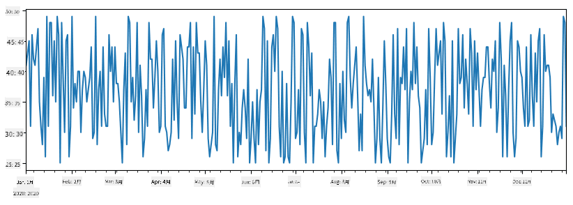
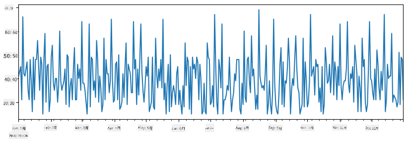
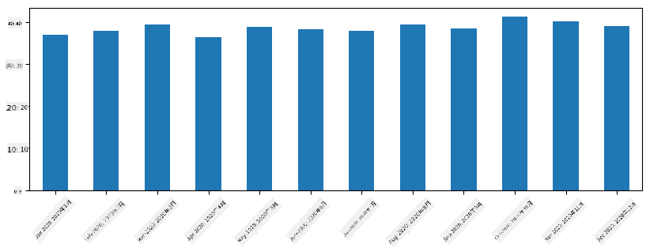
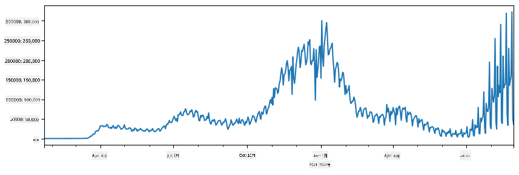
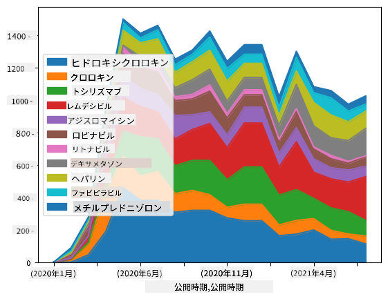

<!--
CO_OP_TRANSLATOR_METADATA:
{
  "original_hash": "116c5d361fbe812e59a73f37ce721d36",
  "translation_date": "2025-08-25T16:28:44+00:00",
  "source_file": "2-Working-With-Data/07-python/README.md",
  "language_code": "ja"
}
-->
# データの操作: PythonとPandasライブラリ

|  ](../../sketchnotes/07-WorkWithPython.png) |
| :-------------------------------------------------------------------------------------------------------: |
|                 Pythonでの操作 - _スケッチノート by [@nitya](https://twitter.com/nitya)_                 |

[](https://youtu.be/dZjWOGbsN4Y)

データベースはデータを効率的に保存し、クエリ言語を使って検索する方法を提供しますが、最も柔軟なデータ処理方法は、自分でプログラムを書いてデータを操作することです。多くの場合、データベースクエリを使用する方が効果的ですが、より複雑なデータ処理が必要な場合、SQLでは簡単に実現できないことがあります。  
データ処理はどのプログラミング言語でもプログラムできますが、データ操作に特化した高レベルな言語がいくつかあります。データサイエンティストは通常、以下の言語のいずれかを好みます:

* **[Python](https://www.python.org/)**: 汎用プログラミング言語で、そのシンプルさから初心者に最適とされています。Pythonには多くの追加ライブラリがあり、ZIPアーカイブからデータを抽出したり、画像をグレースケールに変換したりといった実用的な問題を解決できます。データサイエンスだけでなく、ウェブ開発にもよく使用されます。
* **[R](https://www.r-project.org/)**: 統計データ処理を目的に開発された伝統的なツールボックスです。大規模なライブラリリポジトリ（CRAN）を持ち、データ処理に適しています。ただし、Rは汎用プログラミング言語ではなく、データサイエンス以外の分野で使用されることは稀です。
* **[Julia](https://julialang.org/)**: データサイエンス専用に開発された言語で、Pythonよりも高いパフォーマンスを提供することを目的としています。科学的実験に適したツールです。

このレッスンでは、Pythonを使ったシンプルなデータ処理に焦点を当てます。Pythonの基本的な知識があることを前提としています。Pythonをより深く学びたい場合は、以下のリソースを参照してください:

* [Learn Python in a Fun Way with Turtle Graphics and Fractals](https://github.com/shwars/pycourse) - GitHubベースのPythonプログラミング入門コース
* [Take your First Steps with Python](https://docs.microsoft.com/en-us/learn/paths/python-first-steps/?WT.mc_id=academic-77958-bethanycheum) - [Microsoft Learn](http://learn.microsoft.com/?WT.mc_id=academic-77958-bethanycheum)の学習パス

データはさまざまな形式で存在します。このレッスンでは、**表形式データ**、**テキスト**、**画像**の3つの形式を扱います。

関連するすべてのライブラリを網羅するのではなく、いくつかのデータ処理の例に焦点を当てます。これにより、可能性の概要を理解し、必要なときに問題解決の方法を見つけるための手がかりを得ることができます。

> **最も役立つアドバイス**: データに対して特定の操作を行いたいが方法がわからない場合、インターネットで検索してみてください。[Stackoverflow](https://stackoverflow.com/)には、Pythonでの多くの典型的なタスクに関する有用なコードサンプルが多数掲載されています。

## [講義前クイズ](https://purple-hill-04aebfb03.1.azurestaticapps.net/quiz/12)

## 表形式データとデータフレーム

リレーショナルデータベースについて話したときに、表形式データに触れました。大量のデータがあり、それが多くの異なるリンクされたテーブルに含まれている場合、SQLを使用して操作するのが理にかなっています。しかし、データの分布や値間の相関関係など、このデータについての**理解**や**洞察**を得る必要がある場合があります。データサイエンスでは、元のデータを変換し、その後に可視化を行う必要があるケースが多くあります。これらのステップは、Pythonを使用することで簡単に実行できます。

Pythonで表形式データを扱うのに役立つ最も有用なライブラリは次の2つです:
* **[Pandas](https://pandas.pydata.org/)**: **データフレーム**と呼ばれるものを操作できます。データフレームはリレーショナルテーブルに類似しており、名前付きの列を持ち、行や列、データフレーム全体に対してさまざまな操作を行うことができます。
* **[Numpy](https://numpy.org/)**: **テンソル**、つまり多次元**配列**を操作するためのライブラリです。配列は同じ型の値を持ち、データフレームよりもシンプルですが、より多くの数学的操作を提供し、オーバーヘッドが少なくなります。

また、知っておくべき他のライブラリもいくつかあります:
* **[Matplotlib](https://matplotlib.org/)**: データの可視化やグラフのプロットに使用されるライブラリ
* **[SciPy](https://www.scipy.org/)**: 追加の科学的関数を提供するライブラリ。確率や統計について話したときにこのライブラリに触れました。

以下は、Pythonプログラムの冒頭でこれらのライブラリをインポートする際に通常使用するコードの一例です:
```python
import numpy as np
import pandas as pd
import matplotlib.pyplot as plt
from scipy import ... # you need to specify exact sub-packages that you need
```

Pandasは、いくつかの基本的な概念を中心に構築されています。

### Series

**Series**は、リストやnumpy配列に似た値のシーケンスです。主な違いは、Seriesには**インデックス**があり、Seriesを操作する際（例: 加算する際）にインデックスが考慮されることです。インデックスは、単純な整数の行番号（リストや配列からSeriesを作成する際のデフォルトのインデックス）である場合もあれば、日付間隔のような複雑な構造を持つ場合もあります。

> **Note**: 付属のノートブック [`notebook.ipynb`](../../../../2-Working-With-Data/07-python/notebook.ipynb) にPandasの入門コードが含まれています。ここではいくつかの例を概説するだけですが、ぜひ完全なノートブックを確認してください。

例を考えてみましょう: アイスクリームショップの売上を分析したいとします。一定期間の売上数（1日に売れたアイテム数）のSeriesを生成します:

```python
start_date = "Jan 1, 2020"
end_date = "Mar 31, 2020"
idx = pd.date_range(start_date,end_date)
print(f"Length of index is {len(idx)}")
items_sold = pd.Series(np.random.randint(25,50,size=len(idx)),index=idx)
items_sold.plot()
```


次に、毎週友人のためにパーティーを開催し、パーティー用にアイスクリームを10パック追加で持ち帰るとします。これを示すために、週ごとにインデックスされた別のSeriesを作成できます:
```python
additional_items = pd.Series(10,index=pd.date_range(start_date,end_date,freq="W"))
```
2つのSeriesを加算すると、合計数が得られます:
```python
total_items = items_sold.add(additional_items,fill_value=0)
total_items.plot()
```


> **Note**: 単純な構文 `total_items+additional_items` を使用していないことに注意してください。この場合、結果のSeriesに多くの`NaN`（*Not a Number*）値が含まれることになります。これは、`additional_items` Seriesの一部のインデックスポイントに値が欠けているためであり、`NaN`に何かを加算すると`NaN`になります。そのため、加算時に`fill_value`パラメータを指定する必要があります。

時系列データでは、異なる時間間隔で**リサンプリング**することもできます。たとえば、月ごとの平均売上量を計算したい場合、次のコードを使用できます:
```python
monthly = total_items.resample("1M").mean()
ax = monthly.plot(kind='bar')
```


### DataFrame

DataFrameは、同じインデックスを持つSeriesのコレクションです。複数のSeriesを組み合わせてDataFrameを作成できます:
```python
a = pd.Series(range(1,10))
b = pd.Series(["I","like","to","play","games","and","will","not","change"],index=range(0,9))
df = pd.DataFrame([a,b])
```
これにより、次のような横向きのテーブルが作成されます:
|     | 0   | 1    | 2   | 3   | 4      | 5   | 6      | 7    | 8    |
| --- | --- | ---- | --- | --- | ------ | --- | ------ | ---- | ---- |
| 0   | 1   | 2    | 3   | 4   | 5      | 6   | 7      | 8    | 9    |
| 1   | I   | like | to  | use | Python | and | Pandas | very | much |

また、Seriesを列として使用し、辞書を使って列名を指定することもできます:
```python
df = pd.DataFrame({ 'A' : a, 'B' : b })
```
これにより、次のようなテーブルが得られます:

|     | A   | B      |
| --- | --- | ------ |
| 0   | 1   | I      |
| 1   | 2   | like   |
| 2   | 3   | to     |
| 3   | 4   | use    |
| 4   | 5   | Python |
| 5   | 6   | and    |
| 6   | 7   | Pandas |
| 7   | 8   | very   |
| 8   | 9   | much   |

**Note**: 前のテーブルを転置することで、このレイアウトを得ることもできます。たとえば、次のように書くことで実現できます:
```python
df = pd.DataFrame([a,b]).T..rename(columns={ 0 : 'A', 1 : 'B' })
```
ここで`.T`はDataFrameを転置する操作（行と列を入れ替える操作）を意味し、`rename`操作を使用して列名を前の例に一致させることができます。

以下は、DataFrameで実行できる最も重要な操作のいくつかです:

**列の選択**: 個々の列を選択するには、`df['A']`と書きます。この操作はSeriesを返します。また、別のDataFrameに列のサブセットを選択するには、`df[['B','A']]`と書きます。これにより別のDataFrameが返されます。

**特定の条件に基づく行のフィルタリング**: たとえば、列`A`が5より大きい行だけを残すには、`df[df['A']>5]`と書きます。

> **Note**: フィルタリングの仕組みは次の通りです。式`df['A']<5`はブールSeriesを返し、元のSeries`df['A']`の各要素に対して式が`True`または`False`であるかを示します。ブールSeriesがインデックスとして使用されると、DataFrameの行のサブセットが返されます。そのため、任意のPythonブール式を使用することはできません。たとえば、`df[df['A']>5 and df['A']<7]`と書くのは間違いです。代わりに、ブールSeriesに対して特別な`&`演算子を使用し、`df[(df['A']>5) & (df['A']<7)]`と書く必要があります（*括弧が重要です*）。

**新しい計算可能な列の作成**: 直感的な式を使用して、DataFrameに新しい計算可能な列を簡単に作成できます:
```python
df['DivA'] = df['A']-df['A'].mean() 
``` 
この例では、列Aの平均値からの乖離を計算しています。ここで実際に行われているのは、Seriesを計算し、それを左辺に割り当てて新しい列を作成することです。そのため、Seriesと互換性のない操作を使用することはできません。たとえば、次のコードは間違っています:
```python
# Wrong code -> df['ADescr'] = "Low" if df['A'] < 5 else "Hi"
df['LenB'] = len(df['B']) # <- Wrong result
``` 
後者の例は構文的には正しいですが、意図した結果にはなりません。これは、列`B`のSeriesの長さを列全体に割り当ててしまい、個々の要素の長さを割り当てることができないためです。

このような複雑な式を計算する必要がある場合は、`apply`関数を使用できます。最後の例は次のように書き直すことができます:
```python
df['LenB'] = df['B'].apply(lambda x : len(x))
# or 
df['LenB'] = df['B'].apply(len)
```

上記の操作を行った後、次のDataFrameが得られます:

|     | A   | B      | DivA | LenB |
| --- | --- | ------ | ---- | ---- |
| 0   | 1   | I      | -4.0 | 1    |
| 1   | 2   | like   | -3.0 | 4    |
| 2   | 3   | to     | -2.0 | 2    |
| 3   | 4   | use    | -1.0 | 3    |
| 4   | 5   | Python | 0.0  | 6    |
| 5   | 6   | and    | 1.0  | 3    |
| 6   | 7   | Pandas | 2.0  | 6    |
| 7   | 8   | very   | 3.0  | 4    |
| 8   | 9   | much   | 4.0  | 4    |

**行番号に基づく行の選択**は、`iloc`構文を使用して行うことができます。たとえば、DataFrameの最初の5行を選択するには:
```python
df.iloc[:5]
```

**グループ化**は、Excelの*ピボットテーブル*に似た結果を得るためによく使用されます。たとえば、`LenB`ごとに列`A`の平均値を計算したい場合、DataFrameを`LenB`でグループ化し、`mean`を呼び出します:
```python
df.groupby(by='LenB').mean()
```
グループ内の平均値と要素数を計算する必要がある場合は、より複雑な`aggregate`関数を使用できます:
```python
df.groupby(by='LenB') \
 .aggregate({ 'DivA' : len, 'A' : lambda x: x.mean() }) \
 .rename(columns={ 'DivA' : 'Count', 'A' : 'Mean'})
```
これにより、次の表が得られます:

| LenB | Count | Mean     |
| ---- | ----- | -------- |
| 1    | 1     | 1.000000 |
| 2    | 1     | 3.000000 |
| 3    | 2     | 5.000000 |
| 4    | 3     | 6.333333 |
| 6    | 2     | 6.000000 |

### データの取得
PythonオブジェクトからSeriesやDataFrameを構築するのがいかに簡単かを見てきました。しかし、データは通常、テキストファイルやExcelテーブルの形式で提供されます。幸いなことに、Pandasはディスクからデータを読み込むための簡単な方法を提供しています。例えば、CSVファイルを読み込むのは以下のように簡単です：
```python
df = pd.read_csv('file.csv')
```
「チャレンジ」セクションでは、外部ウェブサイトからデータを取得する例を含め、データの読み込みについてさらに詳しく見ていきます。


### データの表示とプロット

データサイエンティストはデータを探索する必要があるため、データを視覚化する能力が重要です。DataFrameが大きい場合、最初の数行を表示してすべてが正しく動作していることを確認したいことがよくあります。これは`df.head()`を呼び出すことで実現できます。Jupyter Notebookで実行している場合、DataFrameがきれいな表形式で表示されます。

また、いくつかの列を視覚化するために`plot`関数を使用する方法も見てきました。`plot`は多くのタスクに非常に便利で、`kind=`パラメータを使用してさまざまなグラフタイプをサポートしていますが、より複雑なものをプロットしたい場合は、常に生の`matplotlib`ライブラリを使用することができます。データの視覚化については、別のコースレッスンで詳しく説明します。

この概要ではPandasの最も重要な概念をカバーしていますが、このライブラリは非常に豊富で、できることに制限はありません！では、この知識を使って具体的な問題を解決してみましょう。

## 🚀 チャレンジ1: COVIDの拡散を分析する

最初に取り組む問題は、COVID-19の流行拡散のモデル化です。そのために、[ジョンズ・ホプキンス大学](https://jhu.edu/)の[システム科学工学センター](https://systems.jhu.edu/) (CSSE)が提供する、各国の感染者数に関するデータを使用します。このデータセットは[このGitHubリポジトリ](https://github.com/CSSEGISandData/COVID-19)で利用可能です。

データの扱い方を示すために、[`notebook-covidspread.ipynb`](../../../../2-Working-With-Data/07-python/notebook-covidspread.ipynb)を開き、上から下まで読んでみてください。また、セルを実行したり、最後に残しておいたチャレンジに取り組むこともできます。




> Jupyter Notebookでコードを実行する方法がわからない場合は、[この記事](https://soshnikov.com/education/how-to-execute-notebooks-from-github/)を参照してください。

## 非構造化データの扱い

データは非常に頻繁に表形式で提供されますが、場合によっては、テキストや画像など、あまり構造化されていないデータを扱う必要があります。この場合、上記で見たデータ処理技術を適用するために、何らかの方法で構造化データを**抽出**する必要があります。以下はその例です：

* テキストからキーワードを抽出し、それらのキーワードがどのくらい頻繁に出現するかを確認する
* ニューラルネットワークを使用して画像内のオブジェクトに関する情報を抽出する
* ビデオカメラのフィードから人々の感情に関する情報を取得する

## 🚀 チャレンジ2: COVID関連論文の分析

このチャレンジでは、COVIDパンデミックのテーマを続け、関連する科学論文の処理に焦点を当てます。[CORD-19データセット](https://www.kaggle.com/allen-institute-for-ai/CORD-19-research-challenge)には、COVIDに関する7000以上（執筆時点）の論文が、メタデータや要約とともに提供されています（約半分には全文も含まれています）。

このデータセットを分析する完全な例は、[Text Analytics for Health](https://docs.microsoft.com/azure/cognitive-services/text-analytics/how-tos/text-analytics-for-health/?WT.mc_id=academic-77958-bethanycheum)コグニティブサービスを使用して[このブログ記事](https://soshnikov.com/science/analyzing-medical-papers-with-azure-and-text-analytics-for-health/)で説明されています。ここでは、この分析の簡略版を議論します。

> **NOTE**: このリポジトリにはデータセットのコピーは含まれていません。まず、[このKaggleデータセット](https://www.kaggle.com/allen-institute-for-ai/CORD-19-research-challenge?select=metadata.csv)から[`metadata.csv`](https://www.kaggle.com/allen-institute-for-ai/CORD-19-research-challenge?select=metadata.csv)ファイルをダウンロードする必要があります。Kaggleへの登録が必要になる場合があります。また、登録なしで[こちら](https://ai2-semanticscholar-cord-19.s3-us-west-2.amazonaws.com/historical_releases.html)からデータセットをダウンロードすることもできますが、メタデータファイルに加えて全文も含まれます。

[`notebook-papers.ipynb`](../../../../2-Working-With-Data/07-python/notebook-papers.ipynb)を開き、上から下まで読んでみてください。また、セルを実行したり、最後に残しておいたチャレンジに取り組むこともできます。



## 画像データの処理

最近、画像を理解するための非常に強力なAIモデルが開発されています。事前学習済みのニューラルネットワークやクラウドサービスを使用して解決できるタスクは多数あります。以下はその例です：

* **画像分類**：画像を事前定義されたクラスのいずれかに分類することができます。[Custom Vision](https://azure.microsoft.com/services/cognitive-services/custom-vision-service/?WT.mc_id=academic-77958-bethanycheum)などのサービスを使用して独自の画像分類器を簡単にトレーニングできます。
* **オブジェクト検出**：画像内のさまざまなオブジェクトを検出します。[Computer Vision](https://azure.microsoft.com/services/cognitive-services/computer-vision/?WT.mc_id=academic-77958-bethanycheum)などのサービスは多くの一般的なオブジェクトを検出でき、[Custom Vision](https://azure.microsoft.com/services/cognitive-services/custom-vision-service/?WT.mc_id=academic-77958-bethanycheum)モデルをトレーニングして特定の関心オブジェクトを検出することもできます。
* **顔検出**：年齢、性別、感情の検出を含みます。[Face API](https://azure.microsoft.com/services/cognitive-services/face/?WT.mc_id=academic-77958-bethanycheum)を使用して実現できます。

これらのクラウドサービスは[Python SDK](https://docs.microsoft.com/samples/azure-samples/cognitive-services-python-sdk-samples/cognitive-services-python-sdk-samples/?WT.mc_id=academic-77958-bethanycheum)を使用して呼び出すことができるため、データ探索ワークフローに簡単に組み込むことができます。

以下は画像データソースからデータを探索する例です：
* [How to Learn Data Science without Coding](https://soshnikov.com/azure/how-to-learn-data-science-without-coding/)というブログ記事では、Instagramの写真を探索し、人々が写真に多くの「いいね」を付ける理由を理解しようとしています。まず、[Computer Vision](https://azure.microsoft.com/services/cognitive-services/computer-vision/?WT.mc_id=academic-77958-bethanycheum)を使用して写真から可能な限り多くの情報を抽出し、その後[Azure Machine Learning AutoML](https://docs.microsoft.com/azure/machine-learning/concept-automated-ml/?WT.mc_id=academic-77958-bethanycheum)を使用して解釈可能なモデルを構築します。
* [Facial Studies Workshop](https://github.com/CloudAdvocacy/FaceStudies)では、[Face API](https://azure.microsoft.com/services/cognitive-services/face/?WT.mc_id=academic-77958-bethanycheum)を使用してイベントの写真に写っている人々の感情を抽出し、人々を幸せにする要因を理解しようとしています。

## 結論

構造化データでも非構造化データでも、Pythonを使用すればデータ処理と理解に関連するすべてのステップを実行できます。Pythonはおそらく最も柔軟なデータ処理方法であり、そのため多くのデータサイエンティストがPythonを主要なツールとして使用しています。データサイエンスの旅を本格的に進めたい場合は、Pythonを深く学ぶことをお勧めします。


## [講義後のクイズ](https://purple-hill-04aebfb03.1.azurestaticapps.net/quiz/13)

## 復習と自己学習

**書籍**
* [Wes McKinney. Python for Data Analysis: Data Wrangling with Pandas, NumPy, and IPython](https://www.amazon.com/gp/product/1491957662)

**オンラインリソース**
* 公式の[10 minutes to Pandas](https://pandas.pydata.org/pandas-docs/stable/user_guide/10min.html)チュートリアル
* [Pandas Visualizationのドキュメント](https://pandas.pydata.org/pandas-docs/stable/user_guide/visualization.html)

**Python学習**
* [Learn Python in a Fun Way with Turtle Graphics and Fractals](https://github.com/shwars/pycourse)
* [Take your First Steps with Python](https://docs.microsoft.com/learn/paths/python-first-steps/?WT.mc_id=academic-77958-bethanycheum) Microsoft Learnの学習パス

## 課題

[上記のチャレンジについてより詳細なデータ研究を行う](assignment.md)

## クレジット

このレッスンは[Dmitry Soshnikov](http://soshnikov.com)によって♥️を込めて作成されました。

**免責事項**:  
この文書は、AI翻訳サービス [Co-op Translator](https://github.com/Azure/co-op-translator) を使用して翻訳されています。正確性を追求しておりますが、自動翻訳には誤りや不正確な部分が含まれる可能性があることをご承知おきください。元の言語で記載された文書が公式な情報源とみなされるべきです。重要な情報については、専門の人間による翻訳を推奨します。この翻訳の使用に起因する誤解や誤認について、当方は一切の責任を負いません。