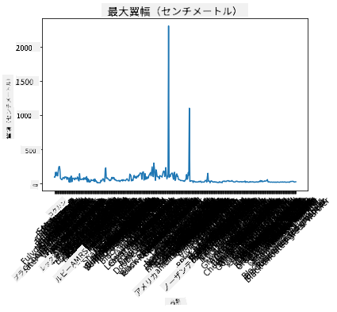
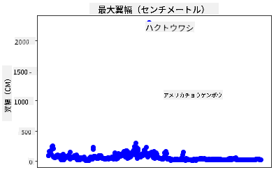
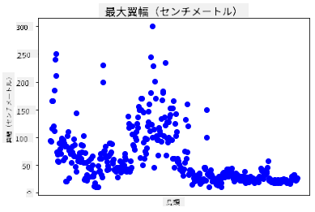
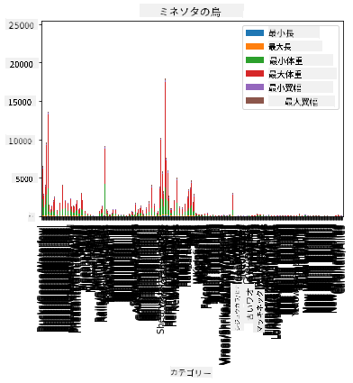
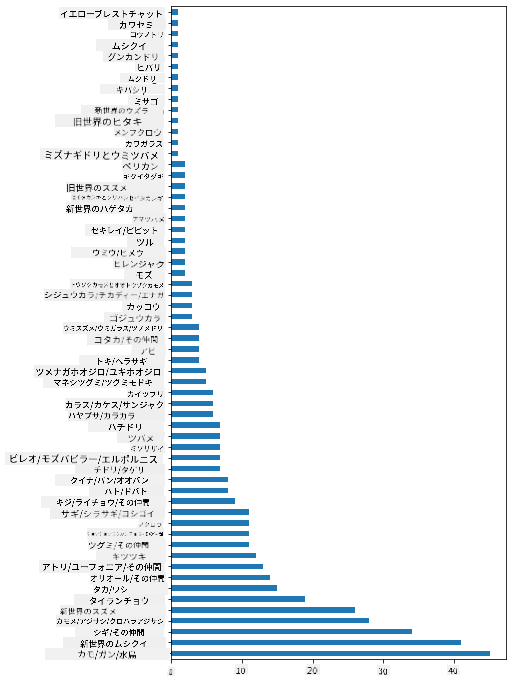
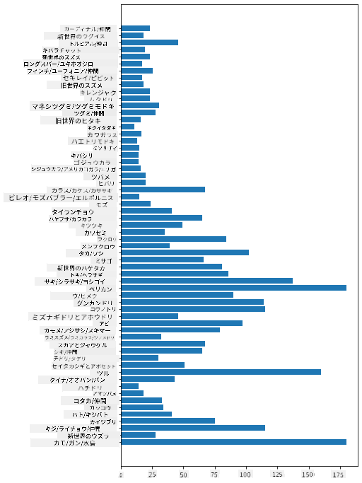
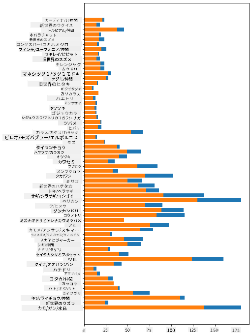

<!--
CO_OP_TRANSLATOR_METADATA:
{
  "original_hash": "43c402d9d90ae6da55d004519ada5033",
  "translation_date": "2025-08-25T18:37:53+00:00",
  "source_file": "3-Data-Visualization/09-visualization-quantities/README.md",
  "language_code": "ja"
}
-->
# 数量の可視化

| ](../../sketchnotes/09-Visualizing-Quantities.png)|
|:---:|
| 数量の可視化 - _スケッチノート by [@nitya](https://twitter.com/nitya)_ |

このレッスンでは、Pythonの多くのライブラリの1つを使用して、数量の概念に基づいた興味深い可視化を作成する方法を学びます。ミネソタ州の鳥に関するクリーンなデータセットを使用して、地元の野生生物について多くの興味深い事実を学ぶことができます。

## [講義前クイズ](https://purple-hill-04aebfb03.1.azurestaticapps.net/quiz/16)

## Matplotlibで翼幅を観察する

[Matplotlib](https://matplotlib.org/stable/index.html)は、さまざまな種類のシンプルで洗練されたプロットやチャートを作成するのに優れたライブラリです。一般的に、これらのライブラリを使用してデータをプロットするプロセスには、データフレームのターゲット部分を特定し、そのデータに必要な変換を行い、x軸とy軸の値を割り当て、表示するプロットの種類を決定し、プロットを表示することが含まれます。Matplotlibは多種多様な可視化を提供しますが、このレッスンでは数量を可視化するのに最も適したもの、つまり折れ線グラフ、散布図、棒グラフに焦点を当てます。

> ✅ データの構造や伝えたいストーリーに最適なチャートを使用しましょう。
> - 時間の経過による傾向を分析するには: 折れ線グラフ
> - 値を比較するには: 棒グラフ、縦棒グラフ、円グラフ、散布図
> - 部分が全体とどのように関連しているかを示すには: 円グラフ
> - データの分布を示すには: 散布図、棒グラフ
> - 傾向を示すには: 折れ線グラフ、縦棒グラフ
> - 値間の関係を示すには: 折れ線グラフ、散布図、バブルチャート

データセットを持っていて、特定の項目がどれだけ含まれているかを調べる必要がある場合、最初のタスクはその値を確認することです。

✅ Matplotlibの非常に便利な「チートシート」が[こちら](https://matplotlib.org/cheatsheets/cheatsheets.pdf)にあります。

## 鳥の翼幅値について折れ線グラフを作成する

このレッスンフォルダのルートにある`notebook.ipynb`ファイルを開き、セルを追加してください。

> 注: データはこのリポジトリのルートにある`/data`フォルダに保存されています。

```python
import pandas as pd
import matplotlib.pyplot as plt
birds = pd.read_csv('../../data/birds.csv')
birds.head()
```
このデータはテキストと数値が混在しています:

|      | Name                         | ScientificName         | Category              | Order        | Family   | Genus       | ConservationStatus | MinLength | MaxLength | MinBodyMass | MaxBodyMass | MinWingspan | MaxWingspan |
| ---: | :--------------------------- | :--------------------- | :-------------------- | :----------- | :------- | :---------- | :----------------- | --------: | --------: | ----------: | ----------: | ----------: | ----------: |
|    0 | Black-bellied whistling-duck | Dendrocygna autumnalis | Ducks/Geese/Waterfowl | Anseriformes | Anatidae | Dendrocygna | LC                 |        47 |        56 |         652 |        1020 |          76 |          94 |
|    1 | Fulvous whistling-duck       | Dendrocygna bicolor    | Ducks/Geese/Waterfowl | Anseriformes | Anatidae | Dendrocygna | LC                 |        45 |        53 |         712 |        1050 |          85 |          93 |
|    2 | Snow goose                   | Anser caerulescens     | Ducks/Geese/Waterfowl | Anseriformes | Anatidae | Anser       | LC                 |        64 |        79 |        2050 |        4050 |         135 |         165 |
|    3 | Ross's goose                 | Anser rossii           | Ducks/Geese/Waterfowl | Anseriformes | Anatidae | Anser       | LC                 |      57.3 |        64 |        1066 |        1567 |         113 |         116 |
|    4 | Greater white-fronted goose  | Anser albifrons        | Ducks/Geese/Waterfowl | Anseriformes | Anatidae | Anser       | LC                 |        64 |        81 |        1930 |        3310 |         130 |         165 |

これらの興味深い鳥の最大翼幅を視覚化するために、基本的な折れ線グラフをプロットしてみましょう。

```python
wingspan = birds['MaxWingspan'] 
wingspan.plot()
```


何がすぐに目に留まりますか？少なくとも1つの外れ値があるようです。これはかなりの翼幅ですね！2300センチメートルの翼幅は23メートルに相当します。ミネソタ州にプテロダクティルスがいるのでしょうか？調査してみましょう。

Excelで外れ値を素早くソートすることもできますが、プロット内で作業を続けて可視化プロセスを進めてみましょう。

x軸にラベルを追加して、どの種類の鳥が対象であるかを表示します:

```
plt.title('Max Wingspan in Centimeters')
plt.ylabel('Wingspan (CM)')
plt.xlabel('Birds')
plt.xticks(rotation=45)
x = birds['Name'] 
y = birds['MaxWingspan']

plt.plot(x, y)

plt.show()
```


ラベルを45度回転させても、読み取るには多すぎます。別の戦略を試してみましょう。外れ値だけにラベルを付け、チャート内にラベルを設定します。散布図を使用してラベル付けのスペースを確保できます:

```python
plt.title('Max Wingspan in Centimeters')
plt.ylabel('Wingspan (CM)')
plt.tick_params(axis='both',which='both',labelbottom=False,bottom=False)

for i in range(len(birds)):
    x = birds['Name'][i]
    y = birds['MaxWingspan'][i]
    plt.plot(x, y, 'bo')
    if birds['MaxWingspan'][i] > 500:
        plt.text(x, y * (1 - 0.05), birds['Name'][i], fontsize=12)
    
plt.show()
```
ここで何が起こっているのでしょうか？`tick_params`を使用して下部のラベルを非表示にし、鳥のデータセットをループしました。`bo`を使用して小さな青い丸の点でチャートをプロットし、最大翼幅が500を超える鳥をチェックして、該当する場合は点の横にラベルを表示しました。ラベルをy軸で少しオフセットし（`y * (1 - 0.05)`）、鳥の名前をラベルとして使用しました。

何がわかりましたか？



## データをフィルタリングする

ハクトウワシとプレーリーハヤブサは、おそらく非常に大きな鳥ですが、最大翼幅に余分な`0`が追加されているようです。翼幅が25メートルのハクトウワシに出会う可能性は低いですが、もしそうならぜひ教えてください！これら2つの外れ値を除外した新しいデータフレームを作成しましょう:

```python
plt.title('Max Wingspan in Centimeters')
plt.ylabel('Wingspan (CM)')
plt.xlabel('Birds')
plt.tick_params(axis='both',which='both',labelbottom=False,bottom=False)
for i in range(len(birds)):
    x = birds['Name'][i]
    y = birds['MaxWingspan'][i]
    if birds['Name'][i] not in ['Bald eagle', 'Prairie falcon']:
        plt.plot(x, y, 'bo')
plt.show()
```

外れ値を除外することで、データがより一貫性があり理解しやすくなりました。



少なくとも翼幅に関してクリーンなデータセットが得られたので、これらの鳥についてさらに詳しく調べてみましょう。

折れ線グラフや散布図はデータ値やその分布に関する情報を表示できますが、このデータセットに内在する値について考えてみましょう。以下のような数量に関する質問に答えるための可視化を作成できます:

> 鳥のカテゴリはいくつあり、それぞれの数はどれくらいですか？
> 絶滅、絶滅危惧、希少、または一般的な鳥はどれくらいいますか？
> リンネの分類法におけるさまざまな属や目の数はどれくらいですか？

## 棒グラフを探る

棒グラフは、データのグループを表示する必要がある場合に実用的です。このデータセットに存在する鳥のカテゴリを調べて、どのカテゴリが最も一般的であるかを確認してみましょう。

ノートブックファイルで基本的な棒グラフを作成します。

✅ 前のセクションで特定した2つの外れ値の鳥を除外するか、翼幅のタイプミスを修正するか、またはこれらの演習に依存しないためそのままにしておくことができます。

棒グラフを作成するには、焦点を当てたいデータを選択します。棒グラフは生データから作成できます:

```python
birds.plot(x='Category',
        kind='bar',
        stacked=True,
        title='Birds of Minnesota')

```


ただし、この棒グラフは非グループ化されたデータが多すぎて読み取れません。プロットしたいデータだけを選択する必要があります。鳥のカテゴリに基づいて長さを調べてみましょう。

データをフィルタリングして、鳥のカテゴリだけを含めます。

✅ Pandasを使用してデータを管理し、Matplotlibにチャート作成を任せることに注意してください。

カテゴリが多いため、このチャートを縦に表示し、すべてのデータを考慮するために高さを調整できます:

```python
category_count = birds.value_counts(birds['Category'].values, sort=True)
plt.rcParams['figure.figsize'] = [6, 12]
category_count.plot.barh()
```


この棒グラフは、各カテゴリの鳥の数をよく示しています。一目で、この地域で最も多い鳥がカモ/ガチョウ/水鳥のカテゴリに属していることがわかります。ミネソタ州は「1万の湖の地」として知られているので、これは驚くべきことではありません！

✅ このデータセットで他のカウントを試してみてください。何か驚くことはありますか？

## データの比較

新しい軸を作成して、グループ化されたデータのさまざまな比較を試すことができます。鳥のカテゴリに基づいて鳥の最大長を比較してみましょう:

```python
maxlength = birds['MaxLength']
plt.barh(y=birds['Category'], width=maxlength)
plt.rcParams['figure.figsize'] = [6, 12]
plt.show()
```


ここでは驚くことはありません。ハチドリはペリカンやガチョウと比較して最大長が最も短いです。データが論理的に意味をなすのは良いことです！

棒グラフのデータを重ね合わせることで、より興味深い可視化を作成できます。鳥のカテゴリごとに最小長と最大長を重ね合わせてみましょう:

```python
minLength = birds['MinLength']
maxLength = birds['MaxLength']
category = birds['Category']

plt.barh(category, maxLength)
plt.barh(category, minLength)

plt.show()
```
このプロットでは、鳥のカテゴリごとの最小長と最大長の範囲を見ることができます。このデータに基づいて、鳥が大きいほどその長さの範囲も広いと言えます。興味深いですね！



## 🚀 チャレンジ

この鳥のデータセットは、特定の生態系内のさまざまな種類の鳥に関する豊富な情報を提供します。インターネットで他の鳥に関するデータセットを探してみてください。これらの鳥に関するチャートやグラフを作成して、知らなかった事実を発見してみましょう。

## [講義後クイズ](https://purple-hill-04aebfb03.1.azurestaticapps.net/quiz/17)

## 復習と自己学習

この最初のレッスンでは、Matplotlibを使用して数量を可視化する方法についての情報をいくつか提供しました。データセットを可視化するための他の方法について調査してみてください。[Plotly](https://github.com/plotly/plotly.py)はこのレッスンでは取り上げませんが、その提供内容を確認してみてください。

## 課題

[折れ線、散布図、棒グラフ](assignment.md)

**免責事項**:  
この文書は、AI翻訳サービス [Co-op Translator](https://github.com/Azure/co-op-translator) を使用して翻訳されています。正確性を追求しておりますが、自動翻訳には誤りや不正確な部分が含まれる可能性があることをご承知ください。元の言語で記載された文書が正式な情報源とみなされるべきです。重要な情報については、専門の人間による翻訳を推奨します。この翻訳の使用に起因する誤解や誤解釈について、当社は一切の責任を負いません。