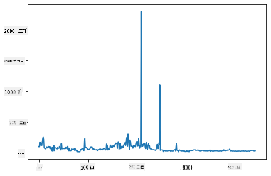

<!--
CO_OP_TRANSLATOR_METADATA:
{
  "original_hash": "69b32b6789a91f796ebc7a02f5575e03",
  "translation_date": "2025-09-04T13:19:05+00:00",
  "source_file": "3-Data-Visualization/09-visualization-quantities/README.md",
  "language_code": "ja"
}
-->
# 数量の可視化

| ](../../sketchnotes/09-Visualizing-Quantities.png)|
|:---:|
| 数量の可視化 - _スケッチノート作成者 [@nitya](https://twitter.com/nitya)_ |

このレッスンでは、Pythonの利用可能なライブラリの1つを使用して、数量の概念に基づいた興味深い可視化を作成する方法を学びます。ミネソタ州の鳥に関するクリーンなデータセットを使用して、地元の野生生物について多くの興味深い事実を学ぶことができます。

## [講義前のクイズ](https://purple-hill-04aebfb03.1.azurestaticapps.net/quiz/16)

## Matplotlibで翼幅を観察する

シンプルで洗練されたさまざまな種類のプロットやチャートを作成するための優れたライブラリが[Matplotlib](https://matplotlib.org/stable/index.html)です。一般的に、これらのライブラリを使用してデータをプロットするプロセスは、データフレームのターゲット部分を特定し、必要に応じてデータを変換し、x軸とy軸の値を割り当て、表示するプロットの種類を決定し、プロットを表示することを含みます。Matplotlibは多くの種類の可視化を提供しますが、このレッスンでは数量を可視化するのに最も適したものに焦点を当てます：折れ線グラフ、散布図、棒グラフです。

> ✅ データの構造と伝えたいストーリーに最適なチャートを使用しましょう。
> - 時間の経過による傾向を分析する: 折れ線グラフ
> - 値を比較する: 棒グラフ、縦棒グラフ、円グラフ、散布図
> - 部分が全体にどのように関連しているかを示す: 円グラフ
> - データの分布を示す: 散布図、棒グラフ
> - 傾向を示す: 折れ線グラフ、縦棒グラフ
> - 値間の関係を示す: 折れ線グラフ、散布図、バブルチャート

データセットを持っていて、特定の項目がどれだけ含まれているかを調べる必要がある場合、最初のタスクはその値を検査することです。

✅ Matplotlibの非常に良い「チートシート」が[こちら](https://matplotlib.org/cheatsheets/cheatsheets.pdf)にあります。

## 鳥の翼幅値について折れ線グラフを作成する

このレッスンフォルダのルートにある`notebook.ipynb`ファイルを開き、セルを追加してください。

> 注: データはこのリポジトリのルートにある`/data`フォルダに保存されています。

```python
import pandas as pd
import matplotlib.pyplot as plt
birds = pd.read_csv('../../data/birds.csv')
birds.head()
```
このデータはテキストと数値の混合です：

|      | 名前                         | 学名                   | カテゴリ              | 目           | 科       | 属         | 保全状況             | 最小長さ | 最大長さ | 最小体重   | 最大体重   | 最小翼幅   | 最大翼幅   |
| ---: | :--------------------------- | :--------------------- | :-------------------- | :----------- | :------- | :---------- | :----------------- | --------: | --------: | ----------: | ----------: | ----------: | ----------: |
|    0 | クロハラホシハジロ           | Dendrocygna autumnalis | カモ/ガン/水鳥        | カモ目       | カモ科   | Dendrocygna | LC                 |        47 |        56 |         652 |        1020 |          76 |          94 |
|    1 | フルボホシハジロ             | Dendrocygna bicolor    | カモ/ガン/水鳥        | カモ目       | カモ科   | Dendrocygna | LC                 |        45 |        53 |         712 |        1050 |          85 |          93 |
|    2 | ハクガン                     | Anser caerulescens     | カモ/ガン/水鳥        | カモ目       | カモ科   | Anser       | LC                 |        64 |        79 |        2050 |        4050 |         135 |         165 |
|    3 | ロスガン                     | Anser rossii           | カモ/ガン/水鳥        | カモ目       | カモ科   | Anser       | LC                 |      57.3 |        64 |        1066 |        1567 |         113 |         116 |
|    4 | オオハクガン                 | Anser albifrons        | カモ/ガン/水鳥        | カモ目       | カモ科   | Anser       | LC                 |        64 |        81 |        1930 |        3310 |         130 |         165 |

まず、基本的な折れ線グラフを使用して数値データをプロットしてみましょう。この興味深い鳥たちの最大翼幅を視覚化したいとします。

```python
wingspan = birds['MaxWingspan'] 
wingspan.plot()
```


何がすぐに目につきますか？少なくとも1つの外れ値があるようです。これはかなりの翼幅ですね！2300センチメートルの翼幅は23メートルに相当します。ミネソタにプテロダクティルスがいるのでしょうか？調査してみましょう。

Excelで簡単にソートして外れ値を見つけることもできますが、プロット内で作業を続けてみましょう。

x軸にラベルを追加して、どの種類の鳥が対象であるかを表示します：

```
plt.title('Max Wingspan in Centimeters')
plt.ylabel('Wingspan (CM)')
plt.xlabel('Birds')
plt.xticks(rotation=45)
x = birds['Name'] 
y = birds['MaxWingspan']

plt.plot(x, y)

plt.show()
```


ラベルを45度回転させても、読むには多すぎます。別の戦略を試してみましょう：外れ値のみをラベル付けし、チャート内にラベルを設定します。散布図を使用してラベル付けのスペースを増やすことができます：

```python
plt.title('Max Wingspan in Centimeters')
plt.ylabel('Wingspan (CM)')
plt.tick_params(axis='both',which='both',labelbottom=False,bottom=False)

for i in range(len(birds)):
    x = birds['Name'][i]
    y = birds['MaxWingspan'][i]
    plt.plot(x, y, 'bo')
    if birds['MaxWingspan'][i] > 500:
        plt.text(x, y * (1 - 0.05), birds['Name'][i], fontsize=12)
    
plt.show()
```
ここで何が起こっているのでしょうか？`tick_params`を使用して下部のラベルを非表示にし、その後鳥のデータセットをループしました。`bo`を使用して小さな青い丸の点でチャートをプロットし、最大翼幅が500を超える鳥をチェックし、該当する場合はその点の横にラベルを表示しました。ラベルをy軸で少しオフセットし（`y * (1 - 0.05)`）、鳥の名前をラベルとして使用しました。

何がわかりましたか？


## データをフィルタリングする

ハクトウワシとプレーリーファルコンは、おそらく非常に大きな鳥ですが、最大翼幅に余分な`0`が追加されているようです。翼幅が25メートルのハクトウワシに出会う可能性は低いですが、もしそうならぜひ教えてください！これら2つの外れ値を除外した新しいデータフレームを作成しましょう：

```python
plt.title('Max Wingspan in Centimeters')
plt.ylabel('Wingspan (CM)')
plt.xlabel('Birds')
plt.tick_params(axis='both',which='both',labelbottom=False,bottom=False)
for i in range(len(birds)):
    x = birds['Name'][i]
    y = birds['MaxWingspan'][i]
    if birds['Name'][i] not in ['Bald eagle', 'Prairie falcon']:
        plt.plot(x, y, 'bo')
plt.show()
```

外れ値をフィルタリングすることで、データがより一貫性を持ち、理解しやすくなります。


翼幅に関して少なくともクリーンなデータセットができたので、これらの鳥についてさらに詳しく調べてみましょう。

折れ線グラフや散布図はデータ値やその分布に関する情報を表示できますが、このデータセットに内在する値について考える必要があります。以下の質問に答えるための可視化を作成することができます：

> 鳥のカテゴリは何種類あり、それぞれの数はどれくらいですか？
> 絶滅、絶滅危惧種、希少種、一般的な鳥はどれくらいいますか？
> リンネの分類法に基づく属や目の数はどれくらいですか？

## 棒グラフを探る

棒グラフはデータのグループを表示する際に実用的です。このデータセットに存在する鳥のカテゴリを調べて、どのカテゴリが最も一般的かを確認してみましょう。

ノートブックファイルで基本的な棒グラフを作成します。

✅ 注：前のセクションで特定した2つの外れ値の鳥をフィルタリングするか、翼幅の誤記を編集するか、または翼幅値に依存しないこれらの演習ではそのまま残しておくことができます。

棒グラフを作成するには、焦点を当てたいデータを選択します。棒グラフは生データから作成できます：

```python
birds.plot(x='Category',
        kind='bar',
        stacked=True,
        title='Birds of Minnesota')

```


しかし、この棒グラフは読み取り不可能です。非グループ化されたデータが多すぎます。プロットしたいデータだけを選択する必要がありますので、カテゴリに基づいて鳥の長さを見てみましょう。

データを鳥のカテゴリのみを含むようにフィルタリングします。

✅ Pandasを使用してデータを管理し、Matplotlibにチャート作成を任せることに注意してください。

カテゴリが多いため、このチャートを縦に表示し、すべてのデータを考慮して高さを調整できます：

```python
category_count = birds.value_counts(birds['Category'].values, sort=True)
plt.rcParams['figure.figsize'] = [6, 12]
category_count.plot.barh()
```


この棒グラフは、各カテゴリの鳥の数を良い視点で示しています。一目で、この地域で最も多い鳥がカモ/ガン/水鳥カテゴリに属していることがわかります。ミネソタは「1万の湖の地」と呼ばれているので、これは驚くべきことではありません！

✅ このデータセットで他のカウントを試してみてください。何か驚くことはありますか？

## データの比較

グループ化されたデータの異なる比較を試すために新しい軸を作成できます。カテゴリに基づいて鳥の最大長さを比較してみましょう：

```python
maxlength = birds['MaxLength']
plt.barh(y=birds['Category'], width=maxlength)
plt.rcParams['figure.figsize'] = [6, 12]
plt.show()
```


ここには驚くべきことはありません：ハチドリはペリカンやガンと比較して最大長さが最も短いです。データが論理的に意味を持つのは良いことです！

棒グラフのより興味深い可視化を作成するために、データを重ね合わせることができます。鳥のカテゴリに基づいて最小長さと最大長さを重ね合わせてみましょう：

```python
minLength = birds['MinLength']
maxLength = birds['MaxLength']
category = birds['Category']

plt.barh(category, maxLength)
plt.barh(category, minLength)

plt.show()
```
このプロットでは、鳥のカテゴリごとの最小長さと最大長さの範囲を見ることができます。このデータに基づいて、大きな鳥ほど長さの範囲が広いと言えます。興味深いですね！


## 🚀 チャレンジ

この鳥のデータセットは、特定の生態系内のさまざまな種類の鳥についての豊富な情報を提供します。インターネットで検索して、他の鳥に関するデータセットを見つけてみてください。これらの鳥に関するチャートやグラフを作成して、知らなかった事実を発見してください。

## [講義後のクイズ](https://ff-quizzes.netlify.app/en/ds/)

## 復習と自己学習

この最初のレッスンでは、Matplotlibを使用して数量を可視化する方法についての情報を提供しました。データセットを可視化するための他の方法について調査してください。[Plotly](https://github.com/plotly/plotly.py)はこれらのレッスンでは取り上げませんので、その提供内容を確認してみてください。

## 課題

[折れ線、散布図、棒グラフ](assignment.md)

---

**免責事項**:  
この文書は、AI翻訳サービス [Co-op Translator](https://github.com/Azure/co-op-translator) を使用して翻訳されています。正確性を追求しておりますが、自動翻訳には誤りや不正確さが含まれる可能性があります。元の言語で記載された原文が正式な情報源と見なされるべきです。重要な情報については、専門の人間による翻訳を推奨します。この翻訳の使用に起因する誤解や誤認について、当社は一切の責任を負いません。