<!--
CO_OP_TRANSLATOR_METADATA:
{
  "original_hash": "02ce904bc1e2bfabb7dc05c25aae375c",
  "translation_date": "2025-09-04T13:21:02+00:00",
  "source_file": "3-Data-Visualization/10-visualization-distributions/README.md",
  "language_code": "ja"
}
-->
# 分布の可視化

| ](../../sketchnotes/10-Visualizing-Distributions.png)|
|:---:|
| 分布の可視化 - _スケッチノート by [@nitya](https://twitter.com/nitya)_ |

前のレッスンでは、ミネソタ州の鳥に関するデータセットについていくつか興味深い事実を学びました。外れ値を可視化することで誤ったデータを見つけ、鳥のカテゴリ間の最大長の違いを確認しました。

## [講義前のクイズ](https://purple-hill-04aebfb03.1.azurestaticapps.net/quiz/18)
## 鳥のデータセットを探索する

データを掘り下げるもう一つの方法は、その分布、つまりデータが軸に沿ってどのように整理されているかを見ることです。例えば、このデータセットでミネソタ州の鳥の最大翼幅や最大体重の一般的な分布について知りたいと思うかもしれません。

このデータセットの分布に関するいくつかの事実を発見してみましょう。このレッスンフォルダのルートにある _notebook.ipynb_ ファイルで、Pandas、Matplotlib、およびデータをインポートします:

```python
import pandas as pd
import matplotlib.pyplot as plt
birds = pd.read_csv('../../data/birds.csv')
birds.head()
```

|      | 名前                         | 学名                   | カテゴリ              | 目           | 科       | 属          | 保全状況             | 最小長さ | 最大長さ | 最小体重    | 最大体重    | 最小翼幅    | 最大翼幅    |
| ---: | :--------------------------- | :--------------------- | :-------------------- | :----------- | :------- | :---------- | :----------------- | --------: | --------: | ----------: | ----------: | ----------: | ----------: |
|    0 | クロハラホウカンチョウ       | Dendrocygna autumnalis | カモ/ガン/水鳥        | カモ目       | カモ科   | Dendrocygna | LC                 |        47 |        56 |         652 |        1020 |          76 |          94 |
|    1 | アカハラホウカンチョウ       | Dendrocygna bicolor    | カモ/ガン/水鳥        | カモ目       | カモ科   | Dendrocygna | LC                 |        45 |        53 |         712 |        1050 |          85 |          93 |
|    2 | ハクガン                     | Anser caerulescens     | カモ/ガン/水鳥        | カモ目       | カモ科   | Anser       | LC                 |        64 |        79 |        2050 |        4050 |         135 |         165 |
|    3 | ロスガン                     | Anser rossii           | カモ/ガン/水鳥        | カモ目       | カモ科   | Anser       | LC                 |      57.3 |        64 |        1066 |        1567 |         113 |         116 |
|    4 | マガン                       | Anser albifrons        | カモ/ガン/水鳥        | カモ目       | カモ科   | Anser       | LC                 |        64 |        81 |        1930 |        3310 |         130 |         165 |

一般的に、前のレッスンで行ったように散布図を使用してデータの分布をすばやく確認することができます:

```python
birds.plot(kind='scatter',x='MaxLength',y='Order',figsize=(12,8))

plt.title('Max Length per Order')
plt.ylabel('Order')
plt.xlabel('Max Length')

plt.show()
```
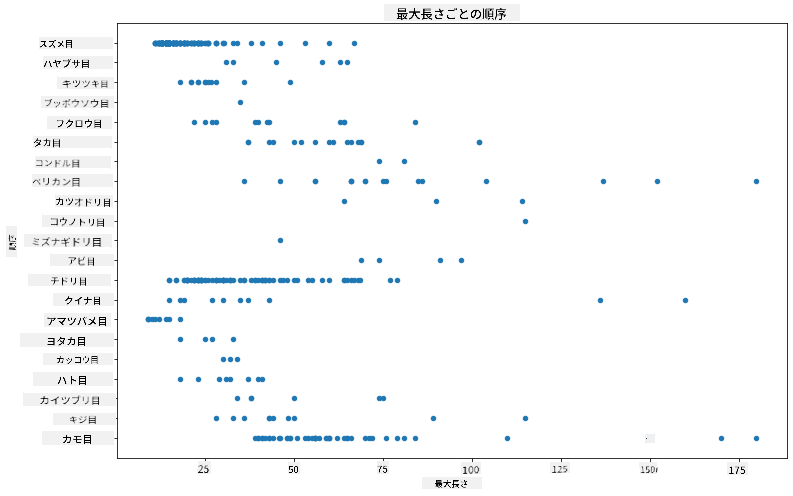

これにより、鳥の目ごとの体長の一般的な分布が概観できますが、真の分布を表示する最適な方法ではありません。このタスクは通常、ヒストグラムを作成することで処理されます。
## ヒストグラムの操作

Matplotlibはヒストグラムを使用してデータ分布を視覚化する非常に優れた方法を提供します。このタイプのチャートは棒グラフのようなもので、バーの上昇と下降を通じて分布を見ることができます。ヒストグラムを作成するには数値データが必要です。ヒストグラムを作成するには、種類を 'hist' として定義してチャートをプロットします。このチャートは、データセット全体の数値データ範囲における最大体重の分布を示します。与えられたデータ配列を小さなビンに分割することで、データ値の分布を表示できます:

```python
birds['MaxBodyMass'].plot(kind = 'hist', bins = 10, figsize = (12,12))
plt.show()
```
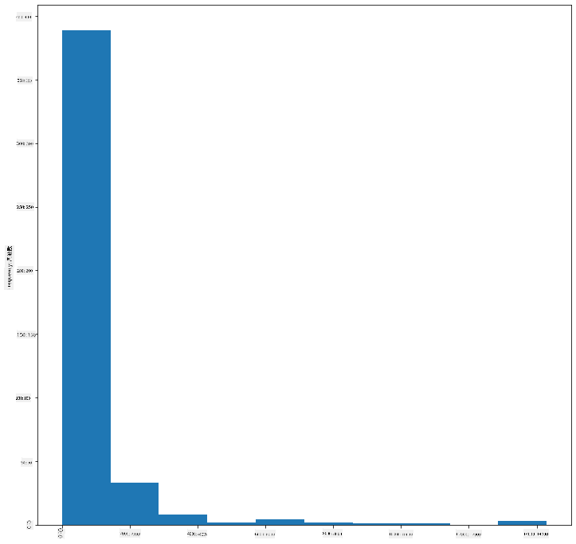

ご覧のとおり、このデータセットに含まれる400以上の鳥のほとんどは、最大体重が2000未満の範囲に収まっています。`bins` パラメータを30などの高い数値に変更して、データについてさらに洞察を得てみましょう:

```python
birds['MaxBodyMass'].plot(kind = 'hist', bins = 30, figsize = (12,12))
plt.show()
```
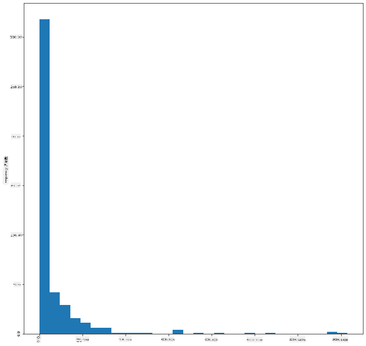

このチャートは、分布をもう少し細かく表示しています。左に偏りすぎないチャートを作成するには、特定の範囲内のデータのみを選択するようにします:

体重が60未満の鳥のみを取得するようにデータをフィルタリングし、40の `bins` を表示します:

```python
filteredBirds = birds[(birds['MaxBodyMass'] > 1) & (birds['MaxBodyMass'] < 60)]      
filteredBirds['MaxBodyMass'].plot(kind = 'hist',bins = 40,figsize = (12,12))
plt.show()     
```
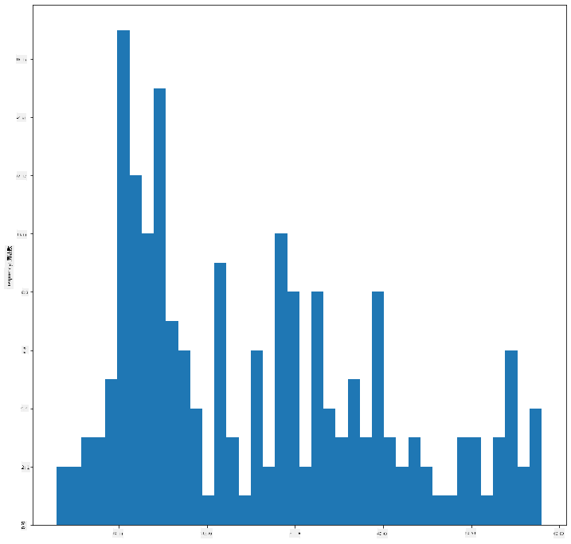

✅ 他のフィルタやデータポイントを試してみましょう。データの完全な分布を表示するには、`['MaxBodyMass']` フィルタを削除してラベル付き分布を表示します。

ヒストグラムには、色やラベルの強化機能もあります:

2Dヒストグラムを作成して、2つの分布間の関係を比較します。`MaxBodyMass` と `MaxLength` を比較してみましょう。Matplotlibは、明るい色を使用して収束を表示する組み込みの方法を提供しています:

```python
x = filteredBirds['MaxBodyMass']
y = filteredBirds['MaxLength']

fig, ax = plt.subplots(tight_layout=True)
hist = ax.hist2d(x, y)
```
これら2つの要素間には予想される軸に沿った相関があるようで、特に強い収束点が1つあります:

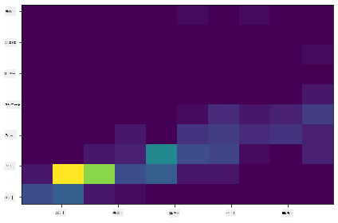

ヒストグラムはデフォルトで数値データに適しています。テキストデータに基づいて分布を確認する必要がある場合はどうしますか？
## テキストデータを使用したデータセットの分布を探索する

このデータセットには、鳥のカテゴリ、属、種、科、および保全状況に関する良い情報も含まれています。この保全情報を掘り下げてみましょう。鳥の保全状況に応じた分布はどのようになっていますか？

> ✅ データセットでは、保全状況を説明するためにいくつかの略語が使用されています。これらの略語は、種の状況をカタログ化する組織である [IUCNレッドリストカテゴリ](https://www.iucnredlist.org/) に由来します。
> 
> - CR: 絶滅危惧種
> - EN: 危急種
> - EX: 絶滅種
> - LC: 軽度懸念
> - NT: 準絶滅危惧種
> - VU: 危惧種

これらはテキストベースの値なので、ヒストグラムを作成するために変換を行う必要があります。filteredBirdsデータフレームを使用して、その保全状況と最小翼幅を表示します。何が見えますか？

```python
x1 = filteredBirds.loc[filteredBirds.ConservationStatus=='EX', 'MinWingspan']
x2 = filteredBirds.loc[filteredBirds.ConservationStatus=='CR', 'MinWingspan']
x3 = filteredBirds.loc[filteredBirds.ConservationStatus=='EN', 'MinWingspan']
x4 = filteredBirds.loc[filteredBirds.ConservationStatus=='NT', 'MinWingspan']
x5 = filteredBirds.loc[filteredBirds.ConservationStatus=='VU', 'MinWingspan']
x6 = filteredBirds.loc[filteredBirds.ConservationStatus=='LC', 'MinWingspan']

kwargs = dict(alpha=0.5, bins=20)

plt.hist(x1, **kwargs, color='red', label='Extinct')
plt.hist(x2, **kwargs, color='orange', label='Critically Endangered')
plt.hist(x3, **kwargs, color='yellow', label='Endangered')
plt.hist(x4, **kwargs, color='green', label='Near Threatened')
plt.hist(x5, **kwargs, color='blue', label='Vulnerable')
plt.hist(x6, **kwargs, color='gray', label='Least Concern')

plt.gca().set(title='Conservation Status', ylabel='Min Wingspan')
plt.legend();
```

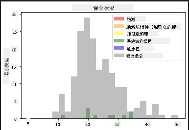

最小翼幅と保全状況の間に良い相関関係は見られないようです。この方法を使用してデータセットの他の要素をテストしてください。異なるフィルタも試してみてください。何か相関関係が見つかりますか？

## 密度プロット

これまで見てきたヒストグラムは「段階的」であり、滑らかな弧を描いていません。より滑らかな密度チャートを表示するには、密度プロットを試してみることができます。

密度プロットを操作するには、新しいプロットライブラリ [Seaborn](https://seaborn.pydata.org/generated/seaborn.kdeplot.html) に慣れる必要があります。

Seabornを読み込み、基本的な密度プロットを試してみましょう:

```python
import seaborn as sns
import matplotlib.pyplot as plt
sns.kdeplot(filteredBirds['MinWingspan'])
plt.show()
```
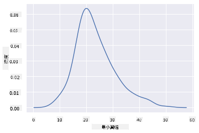

このプロットが最小翼幅データに対して以前のものを反映していることがわかります。ただし、少し滑らかになっています。Seabornのドキュメントによると、「ヒストグラムに比べて、KDEは複数の分布を描画する際に、よりすっきりとした解釈可能なプロットを生成できます。ただし、基礎となる分布が境界付きまたは滑らかでない場合、歪みを引き起こす可能性があります。ヒストグラムと同様に、表現の品質は良いスムージングパラメータの選択にも依存します。」[出典](https://seaborn.pydata.org/generated/seaborn.kdeplot.html) つまり、外れ値は常にチャートの動作を悪化させる可能性があります。

2番目に作成したギザギザの最大体重線を再訪したい場合、この方法を使用して非常に滑らかにすることができます:

```python
sns.kdeplot(filteredBirds['MaxBodyMass'])
plt.show()
```
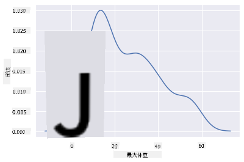

滑らかすぎない線を作成したい場合は、`bw_adjust` パラメータを編集します:

```python
sns.kdeplot(filteredBirds['MaxBodyMass'], bw_adjust=.2)
plt.show()
```
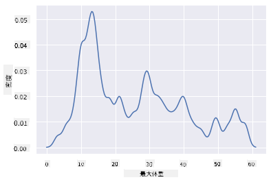

✅ このタイプのプロットで利用可能なパラメータについて調べて、実験してみましょう！

このタイプのチャートは非常に説明的な視覚化を提供します。例えば、数行のコードで鳥の目ごとの最大体重密度を表示できます:

```python
sns.kdeplot(
   data=filteredBirds, x="MaxBodyMass", hue="Order",
   fill=True, common_norm=False, palette="crest",
   alpha=.5, linewidth=0,
)
```

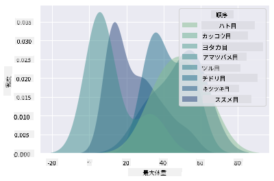

また、1つのチャートで複数の変数の密度をマッピングすることもできます。鳥の最大長と最小長を保全状況と比較してみましょう:

```python
sns.kdeplot(data=filteredBirds, x="MinLength", y="MaxLength", hue="ConservationStatus")
```

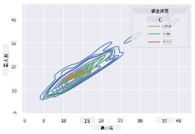

「危惧種」の鳥の長さに基づくクラスターが意味を持つかどうかを調査する価値があるかもしれません。

## 🚀 チャレンジ

ヒストグラムは基本的な散布図、棒グラフ、折れ線グラフよりも洗練されたタイプのチャートです。インターネットでヒストグラムの良い例を探してみましょう。それらがどのように使用されているか、何を示しているか、どの分野や調査領域で使用される傾向があるかを調べてください。

## [講義後のクイズ](https://ff-quizzes.netlify.app/en/ds/)

## 復習と自己学習

このレッスンでは、Matplotlibを使用し、Seabornを使い始めて、より洗練されたチャートを表示しました。Seabornの `kdeplot` について調査し、「1次元または複数次元の連続確率密度曲線」を理解してください。[ドキュメント](https://seaborn.pydata.org/generated/seaborn.kdeplot.html) を読んでその仕組みを理解しましょう。

## 課題

[スキルを活用する](assignment.md)

---

**免責事項**:  
この文書は、AI翻訳サービス [Co-op Translator](https://github.com/Azure/co-op-translator) を使用して翻訳されています。正確性を期すよう努めておりますが、自動翻訳には誤りや不正確な表現が含まれる可能性があります。元の言語で記載された原文が正式な情報源とみなされるべきです。重要な情報については、専門の人間による翻訳を推奨します。この翻訳の利用に起因する誤解や誤認について、当社は一切の責任を負いません。