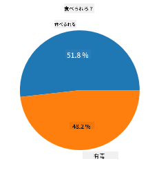
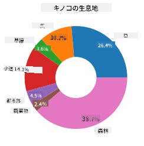
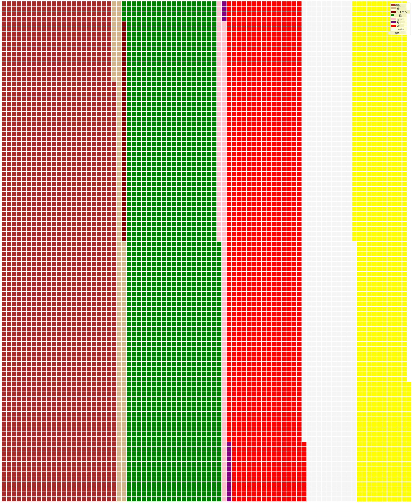

<!--
CO_OP_TRANSLATOR_METADATA:
{
  "original_hash": "af6a12015c6e250e500b570a9fa42593",
  "translation_date": "2025-08-25T18:41:57+00:00",
  "source_file": "3-Data-Visualization/11-visualization-proportions/README.md",
  "language_code": "ja"
}
-->
# 比率の可視化

| ](../../sketchnotes/11-Visualizing-Proportions.png)|
|:---:|
|比率の可視化 - _スケッチノート by [@nitya](https://twitter.com/nitya)_ |

このレッスンでは、自然に焦点を当てた別のデータセットを使用して、キノコに関するデータセット内でどのくらいの種類の菌類が存在するかなど、比率を可視化します。Audubonから提供されたデータセットを使用して、Agaricus（ハラタケ属）とLepiota（ハラタケモドキ属）の23種のひだのあるキノコに関する詳細を探ります。以下のような魅力的な可視化を試してみましょう：

- 円グラフ 🥧  
- ドーナツグラフ 🍩  
- ワッフルチャート 🧇  

> 💡 Microsoft Researchによる[Charticulator](https://charticulator.com)という非常に興味深いプロジェクトでは、データ可視化のための無料のドラッグ＆ドロップインターフェースを提供しています。彼らのチュートリアルの1つでもこのキノコのデータセットが使用されています！データを探索しながらライブラリの使い方を学ぶことができます：[Charticulator tutorial](https://charticulator.com/tutorials/tutorial4.html)。

## [講義前クイズ](https://purple-hill-04aebfb03.1.azurestaticapps.net/quiz/20)

## キノコを知ろう 🍄

キノコはとても興味深い存在です。データセットをインポートして調べてみましょう：

```python
import pandas as pd
import matplotlib.pyplot as plt
mushrooms = pd.read_csv('../../data/mushrooms.csv')
mushrooms.head()
```  
以下のような分析に適したデータがテーブルとして出力されます：

| class     | cap-shape | cap-surface | cap-color | bruises | odor    | gill-attachment | gill-spacing | gill-size | gill-color | stalk-shape | stalk-root | stalk-surface-above-ring | stalk-surface-below-ring | stalk-color-above-ring | stalk-color-below-ring | veil-type | veil-color | ring-number | ring-type | spore-print-color | population | habitat |
| --------- | --------- | ----------- | --------- | ------- | ------- | --------------- | ------------ | --------- | ---------- | ----------- | ---------- | ------------------------ | ------------------------ | ---------------------- | ---------------------- | --------- | ---------- | ----------- | --------- | ----------------- | ---------- | ------- |
| Poisonous | Convex    | Smooth      | Brown     | Bruises | Pungent | Free            | Close        | Narrow    | Black      | Enlarging   | Equal      | Smooth                   | Smooth                   | White                  | White                  | Partial   | White      | One         | Pendant   | Black             | Scattered  | Urban   |
| Edible    | Convex    | Smooth      | Yellow    | Bruises | Almond  | Free            | Close        | Broad     | Black      | Enlarging   | Club       | Smooth                   | Smooth                   | White                  | White                  | Partial   | White      | One         | Pendant   | Brown             | Numerous   | Grasses |
| Edible    | Bell      | Smooth      | White     | Bruises | Anise   | Free            | Close        | Broad     | Brown      | Enlarging   | Club       | Smooth                   | Smooth                   | White                  | White                  | Partial   | White      | One         | Pendant   | Brown             | Numerous   | Meadows |
| Poisonous | Convex    | Scaly       | White     | Bruises | Pungent | Free            | Close        | Narrow    | Brown      | Enlarging   | Equal      | Smooth                   | Smooth                   | White                  | White                  | Partial   | White      | One         | Pendant   | Black             | Scattered  | Urban   |

すぐに気づくのは、すべてのデータがテキスト形式であることです。このデータをチャートで使用できるように変換する必要があります。実際、このデータの多くはオブジェクトとして表現されています：

```python
print(mushrooms.select_dtypes(["object"]).columns)
```  

出力は以下の通りです：

```output
Index(['class', 'cap-shape', 'cap-surface', 'cap-color', 'bruises', 'odor',
       'gill-attachment', 'gill-spacing', 'gill-size', 'gill-color',
       'stalk-shape', 'stalk-root', 'stalk-surface-above-ring',
       'stalk-surface-below-ring', 'stalk-color-above-ring',
       'stalk-color-below-ring', 'veil-type', 'veil-color', 'ring-number',
       'ring-type', 'spore-print-color', 'population', 'habitat'],
      dtype='object')
```  
このデータを使用して、'class'列をカテゴリに変換します：

```python
cols = mushrooms.select_dtypes(["object"]).columns
mushrooms[cols] = mushrooms[cols].astype('category')
```  

```python
edibleclass=mushrooms.groupby(['class']).count()
edibleclass
```  

これで、キノコのデータを印刷すると、毒性/食用のクラスに基づいてカテゴリにグループ化されたことがわかります：

|           | cap-shape | cap-surface | cap-color | bruises | odor | gill-attachment | gill-spacing | gill-size | gill-color | stalk-shape | ... | stalk-surface-below-ring | stalk-color-above-ring | stalk-color-below-ring | veil-type | veil-color | ring-number | ring-type | spore-print-color | population | habitat |
| --------- | --------- | ----------- | --------- | ------- | ---- | --------------- | ------------ | --------- | ---------- | ----------- | --- | ------------------------ | ---------------------- | ---------------------- | --------- | ---------- | ----------- | --------- | ----------------- | ---------- | ------- |
| class     |           |             |           |         |      |                 |              |           |            |             |     |                          |                        |                        |           |            |             |           |                   |            |         |
| Edible    | 4208      | 4208        | 4208      | 4208    | 4208 | 4208            | 4208         | 4208      | 4208       | 4208        | ... | 4208                     | 4208                   | 4208                   | 4208      | 4208       | 4208        | 4208      | 4208              | 4208       | 4208    |
| Poisonous | 3916      | 3916        | 3916      | 3916    | 3916 | 3916            | 3916         | 3916      | 3916       | 3916        | ... | 3916                     | 3916                   | 3916                   | 3916      | 3916       | 3916        | 3916      | 3916              | 3916       | 3916    |

このテーブルの順序に従ってクラスカテゴリラベルを作成すれば、円グラフを作成できます。

## 円グラフ！

```python
labels=['Edible','Poisonous']
plt.pie(edibleclass['population'],labels=labels,autopct='%.1f %%')
plt.title('Edible?')
plt.show()
```  
このデータを2つのキノコクラスに基づいて比率を示す円グラフとして表示します。特にここではラベルの順序が重要なので、ラベル配列の順序を確認してください！



## ドーナツグラフ！

円グラフを少し視覚的に面白くしたものがドーナツグラフです。これは中央に穴がある円グラフです。この方法でデータを見てみましょう。

キノコが生育するさまざまな生息地を見てみましょう：

```python
habitat=mushrooms.groupby(['habitat']).count()
habitat
```  
ここではデータを生息地ごとにグループ化しています。7つの生息地がリストされているので、それらをドーナツグラフのラベルとして使用します：

```python
labels=['Grasses','Leaves','Meadows','Paths','Urban','Waste','Wood']

plt.pie(habitat['class'], labels=labels,
        autopct='%1.1f%%', pctdistance=0.85)
  
center_circle = plt.Circle((0, 0), 0.40, fc='white')
fig = plt.gcf()

fig.gca().add_artist(center_circle)
  
plt.title('Mushroom Habitats')
  
plt.show()
```  

  

このコードはチャートと中央の円を描画し、その後その中央の円をチャートに追加します。中央の円の幅を変更するには、`0.40`を別の値に変更してください。

ドーナツグラフはラベルを変更するなど、いくつかの方法で調整できます。特にラベルは読みやすさのために強調表示できます。詳細は[ドキュメント](https://matplotlib.org/stable/gallery/pie_and_polar_charts/pie_and_donut_labels.html?highlight=donut)をご覧ください。

データをグループ化して円グラフやドーナツグラフとして表示する方法を学んだので、他の種類のチャートも試してみましょう。次はワッフルチャートです。これは数量を別の方法で探索するものです。

## ワッフルチャート！

ワッフルチャートは、数量を2Dの正方形の配列として視覚化する方法です。このデータセット内のキノコの傘の色の異なる数量を視覚化してみましょう。そのためには、[PyWaffle](https://pypi.org/project/pywaffle/)というヘルパーライブラリをインストールし、Matplotlibを使用します：

```python
pip install pywaffle
```  

データの一部を選択してグループ化します：

```python
capcolor=mushrooms.groupby(['cap-color']).count()
capcolor
```  

ラベルを作成し、データをグループ化してワッフルチャートを作成します：

```python
import pandas as pd
import matplotlib.pyplot as plt
from pywaffle import Waffle
  
data ={'color': ['brown', 'buff', 'cinnamon', 'green', 'pink', 'purple', 'red', 'white', 'yellow'],
    'amount': capcolor['class']
     }
  
df = pd.DataFrame(data)
  
fig = plt.figure(
    FigureClass = Waffle,
    rows = 100,
    values = df.amount,
    labels = list(df.color),
    figsize = (30,30),
    colors=["brown", "tan", "maroon", "green", "pink", "purple", "red", "whitesmoke", "yellow"],
)
```  

ワッフルチャートを使用すると、このキノコのデータセットの傘の色の比率がはっきりとわかります。興味深いことに、緑色の傘を持つキノコが多く存在します！

  

✅ PyWaffleは、[Font Awesome](https://fontawesome.com/)で利用可能なアイコンを使用して、チャート内にアイコンを表示することをサポートしています。アイコンを正方形の代わりに使用して、さらに面白いワッフルチャートを作成する実験をしてみてください。

このレッスンでは、比率を可視化する3つの方法を学びました。まず、データをカテゴリにグループ化し、次にデータを表示する最適な方法（円グラフ、ドーナツグラフ、またはワッフルチャート）を決定します。どれも魅力的で、データセットのスナップショットを瞬時に提供します。

## 🚀 チャレンジ

[Charticulator](https://charticulator.com)でこれらの美味しいチャートを再現してみてください。

## [講義後クイズ](https://purple-hill-04aebfb03.1.azurestaticapps.net/quiz/21)

## 復習と自己学習

円グラフ、ドーナツグラフ、ワッフルチャートのどれを使用するべきかは、時には明確ではありません。このトピックに関する以下の記事を読んでみてください：

https://www.beautiful.ai/blog/battle-of-the-charts-pie-chart-vs-donut-chart  

https://medium.com/@hypsypops/pie-chart-vs-donut-chart-showdown-in-the-ring-5d24fd86a9ce  

https://www.mit.edu/~mbarker/formula1/f1help/11-ch-c6.htm  

https://medium.datadriveninvestor.com/data-visualization-done-the-right-way-with-tableau-waffle-chart-fdf2a19be402  

さらに情報を探して、この難しい選択について調査してみてください。

## 課題

[Excelで試してみる](assignment.md)  

**免責事項**:  
この文書は、AI翻訳サービス [Co-op Translator](https://github.com/Azure/co-op-translator) を使用して翻訳されています。正確性を追求しておりますが、自動翻訳には誤りや不正確な部分が含まれる可能性があることをご承知ください。元の言語で記載された文書が正式な情報源とみなされるべきです。重要な情報については、専門の人間による翻訳を推奨します。この翻訳の使用に起因する誤解や誤解釈について、当方は一切の責任を負いません。