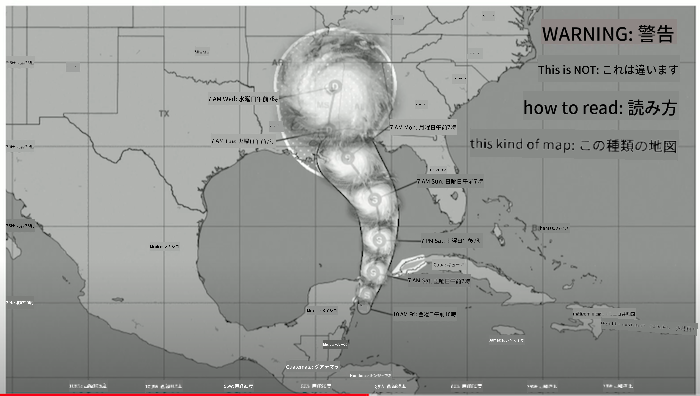
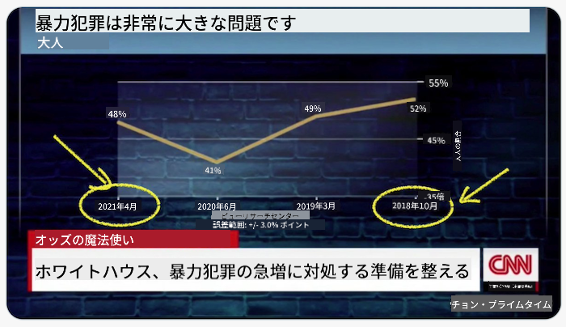
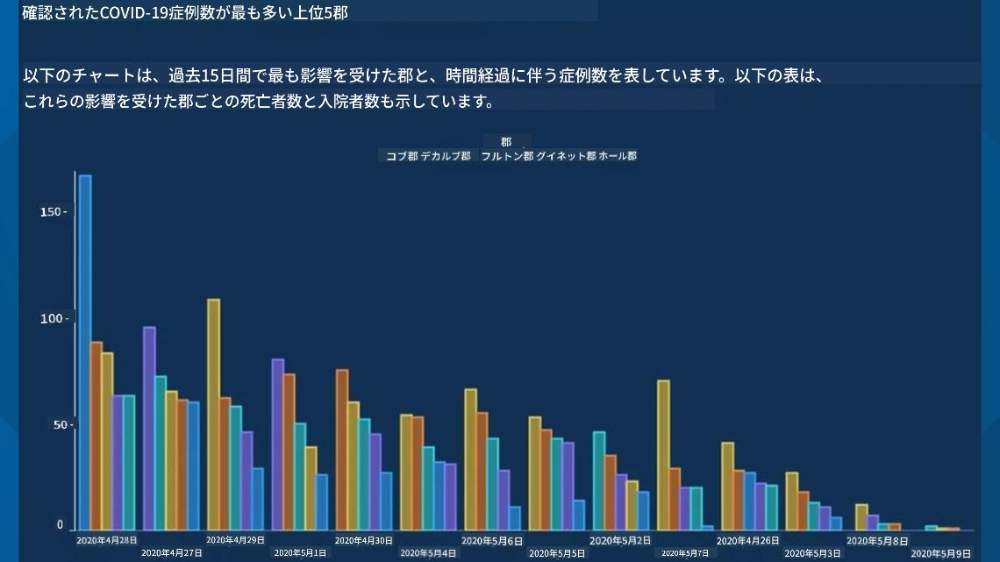
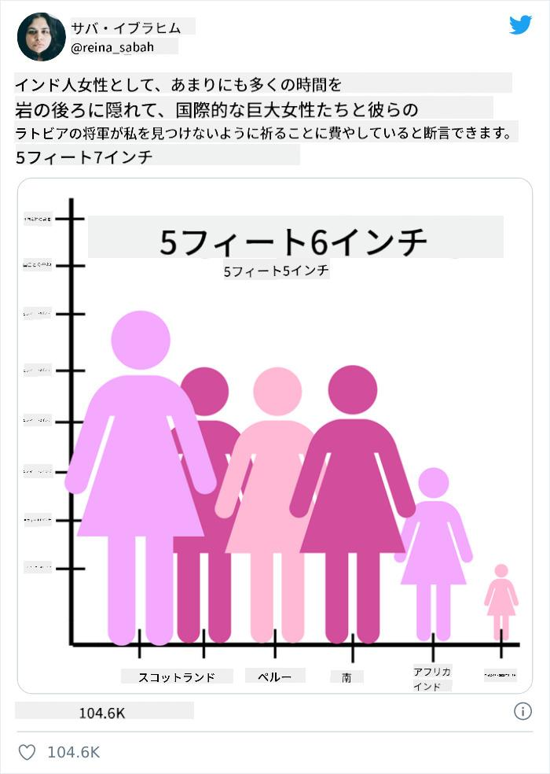
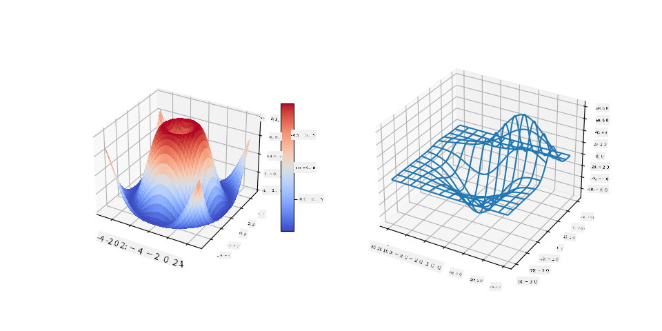

<!--
CO_OP_TRANSLATOR_METADATA:
{
  "original_hash": "4ec4747a9f4f7d194248ea29903ae165",
  "translation_date": "2025-08-25T18:01:19+00:00",
  "source_file": "3-Data-Visualization/13-meaningful-visualizations/README.md",
  "language_code": "ja"
}
-->
# 意味のあるデータビジュアライゼーションを作る

| ](../../sketchnotes/13-MeaningfulViz.png)|
|:---:|
| 意味のあるデータビジュアライゼーション - _スケッチノート by [@nitya](https://twitter.com/nitya)_ |

> 「データを十分に拷問すれば、何でも白状する」 -- [ロナルド・コース](https://en.wikiquote.org/wiki/Ronald_Coase)

データサイエンティストの基本的なスキルの一つは、質問に答えるのに役立つ意味のあるデータビジュアライゼーションを作成する能力です。データを可視化する前に、前のレッスンで行ったように、データをクリーンアップし準備する必要があります。その後、データを最適に提示する方法を決定することができます。

このレッスンでは以下を学びます：

1. 適切なチャートタイプの選び方
2. 誤解を招くチャートを避ける方法
3. 色の使い方
4. 読みやすさのためのチャートのスタイリング方法
5. アニメーションや3Dチャートソリューションの構築方法
6. 創造的なビジュアライゼーションの構築方法

## [講義前クイズ](https://purple-hill-04aebfb03.1.azurestaticapps.net/quiz/24)

## 適切なチャートタイプを選ぶ

前のレッスンでは、MatplotlibやSeabornを使ってさまざまな興味深いデータビジュアライゼーションを作成する実験をしました。一般的に、以下の表を使って質問に応じた[適切なチャートタイプ](https://chartio.com/learn/charts/how-to-select-a-data-vizualization/)を選ぶことができます：

| 必要なこと                 | 使用すべきもの                 |
| -------------------------- | ------------------------------- |
| 時間経過によるデータの傾向を示す | 折れ線グラフ                     |
| カテゴリーを比較する         | 棒グラフ、円グラフ               |
| 合計を比較する             | 円グラフ、積み上げ棒グラフ         |
| 関係性を示す               | 散布図、折れ線グラフ、ファセット、二重折れ線グラフ |
| 分布を示す                 | 散布図、ヒストグラム、箱ひげ図     |
| 比率を示す                 | 円グラフ、ドーナツグラフ、ワッフルグラフ |

> ✅ データの構成によっては、特定のチャートをサポートするためにテキストデータを数値データに変換する必要がある場合があります。

## 誤解を招くことを避ける

データサイエンティストが適切なチャートを選んだとしても、データを誤解を招く形で表示する方法はたくさんあります。これにより、データそのものを損なうことがあります。誤解を招くチャートやインフォグラフィックの例は数多く存在します！

[](https://www.youtube.com/watch?v=oX74Nge8Wkw "How charts lie")

> 🎥 上の画像をクリックすると、誤解を招くチャートについてのカンファレンストークが見られます

このチャートはX軸を逆転させ、日付に基づいて真実の反対を示しています：



[このチャート](https://media.firstcoastnews.com/assets/WTLV/images/170ae16f-4643-438f-b689-50d66ca6a8d8/170ae16f-4643-438f-b689-50d66ca6a8d8_1140x641.jpg)はさらに誤解を招きます。目は右側に引き寄せられ、時間の経過とともに各郡でCOVIDの症例が減少したと結論付けます。しかし、日付をよく見ると、誤解を招く下降傾向を示すために日付が並べ替えられていることがわかります。



この悪名高い例では、色と反転したY軸を使用して誤解を招きます。銃に優しい法律の施行後に銃による死亡が急増したのではなく、目は逆の結論を導くように欺かれます：


この奇妙なチャートは、比率が操作されるとどれほど滑稽になるかを示しています：



比較できないものを比較するのも、もう一つの不正な手法です。[素晴らしいウェブサイト](https://tylervigen.com/spurious-correlations)では、「スプリアスな相関関係」として、メイン州の離婚率とマーガリンの消費量などの「事実」を関連付ける例を表示しています。Redditのグループも[データの醜い使い方](https://www.reddit.com/r/dataisugly/top/?t=all)を収集しています。

誤解を招くチャートによって目が簡単に欺かれる方法を理解することが重要です。データサイエンティストの意図が良くても、例えば多すぎるカテゴリーを示す円グラフのような悪いタイプのチャートを選ぶと、誤解を招く可能性があります。

## 色

上記の「フロリダ銃暴力」チャートでは、色がチャートに追加の意味を与える方法を示しています。特にMatplotlibやSeabornのようなライブラリで設計されていないチャートでは、これらのライブラリにはさまざまな検証済みのカラーパレットが含まれています。手作業でチャートを作成する場合は、[色彩理論](https://colormatters.com/color-and-design/basic-color-theory)を少し学んでみてください。

> ✅ チャートを設計する際には、アクセシビリティが重要な側面であることを認識してください。一部のユーザーは色覚異常を持っているかもしれません。視覚障害を持つユーザーにとってもチャートが適切に表示されるか確認してください。

チャートの色を選ぶ際には注意が必要です。色は意図しない意味を伝える可能性があります。上記の「身長」チャートの「ピンクの女性」は、明確に「女性的」とされる意味を伝え、チャート自体の奇妙さを増しています。

[色の意味](https://colormatters.com/color-symbolism/the-meanings-of-colors)は地域によって異なる場合があり、色の濃淡によって意味が変わる傾向があります。一般的に、色の意味は以下の通りです：

| 色      | 意味                 |
| ------ | ------------------- |
| 赤      | 力                  |
| 青      | 信頼、忠誠           |
| 黄色    | 幸せ、注意           |
| 緑      | 環境、幸運、嫉妬     |
| 紫      | 幸せ                |
| オレンジ | 活気                |

カスタムカラーでチャートを作成する場合、チャートがアクセシブルであり、選んだ色が伝えたい意味と一致していることを確認してください。

## 読みやすさのためのチャートのスタイリング

チャートは読みやすくなければ意味がありません！チャートの幅と高さをデータに合わせてスケールするようにスタイリングすることを検討してください。例えば、50州すべてを表示する必要がある場合、可能であればY軸に縦に表示して、横スクロールのチャートを避けてください。

軸にラベルを付け、必要に応じて凡例を提供し、データの理解を深めるためにツールチップを提供してください。

データがX軸でテキストとして表示される場合、読みやすさを向上させるためにテキストを角度をつけて表示することができます。[Matplotlib](https://matplotlib.org/stable/tutorials/toolkits/mplot3d.html)は、データが対応している場合に3Dプロットを提供します。`mpl_toolkits.mplot3d`を使用して高度なデータビジュアライゼーションを作成することができます。



## アニメーションと3Dチャート表示

今日の最高のデータビジュアライゼーションの中には、アニメーション化されたものがあります。Shirley WuはD3を使って素晴らしいものを作成しています。例えば、'[film flowers](http://bl.ocks.org/sxywu/raw/d612c6c653fb8b4d7ff3d422be164a5d/)'では、各花が映画のビジュアライゼーションを表しています。Guardianの例では「bussed out」というインタラクティブな体験があり、GreensockとD3を使用してNYCがホームレス問題をどのように扱っているかを示すスクロール型の記事形式のビジュアライゼーションを提供しています。


> 「Bussed Out: How America Moves its Homeless」 - [Guardian](https://www.theguardian.com/us-news/ng-interactive/2017/dec/20/bussed-out-america-moves-homeless-people-country-study)。ビジュアライゼーション by Nadieh Bremer & Shirley Wu

このレッスンではこれらの強力なビジュアライゼーションライブラリを深く学ぶことはできませんが、D3を使用してVue.jsアプリで「危険な関係」という本のアニメーション化されたソーシャルネットワークのビジュアライゼーションを表示するライブラリを試してみてください。

> 「Les Liaisons Dangereuses」は書簡形式の小説で、手紙のシリーズとして提示される小説です。1782年にChoderlos de Laclosによって書かれ、18世紀後半のフランス貴族の二人の主人公、Vicomte de ValmontとMarquise de Merteuilの悪意ある社会的操作を描いています。両者は最終的に破滅しますが、社会的な損害を大いに与えます。この小説は、復讐を企てたり単に問題を起こしたりするために彼らの周囲の人々に送られた手紙のシリーズとして展開します。これらの手紙のビジュアライゼーションを作成して、物語の主要な中心人物を視覚的に発見してください。

このソーシャルネットワークのアニメーションビューを表示するウェブアプリを完成させます。このアプリは、Vue.jsとD3を使用して[ネットワークのビジュアル](https://github.com/emiliorizzo/vue-d3-network)を作成するために構築されたライブラリを使用します。アプリが実行されると、画面上でノードを引っ張ってデータをシャッフルすることができます。


## プロジェクト: D3.jsを使ってネットワークを示すチャートを作成する

> このレッスンフォルダには、完成したプロジェクトを参照できる`solution`フォルダが含まれています。

1. スターターフォルダのルートにあるREADME.mdファイルの指示に従ってください。プロジェクトの依存関係をインストールする前に、マシンでNPMとNode.jsが実行されていることを確認してください。

2. `starter/src`フォルダを開きます。そこには`assets`フォルダがあり、小説のすべての手紙が番号付きで「宛先」と「送信者」の注釈付きで記載された.jsonファイルが見つかります。

3. `components/Nodes.vue`のコードを完成させてビジュアライゼーションを有効にします。`createLinks()`というメソッドを探し、以下のネストされたループを追加してください。

.jsonオブジェクトをループして手紙の「宛先」と「送信者」のデータをキャプチャし、ビジュアライゼーションライブラリが消費できる`links`オブジェクトを構築します：

```javascript
//loop through letters
      let f = 0;
      let t = 0;
      for (var i = 0; i < letters.length; i++) {
          for (var j = 0; j < characters.length; j++) {
              
            if (characters[j] == letters[i].from) {
              f = j;
            }
            if (characters[j] == letters[i].to) {
              t = j;
            }
        }
        this.links.push({ sid: f, tid: t });
      }
  ```

ターミナルからアプリを実行（npm run serve）し、ビジュアライゼーションを楽しんでください！

## 🚀 チャレンジ

インターネットを巡って誤解を招くビジュアライゼーションを発見してください。作者はどのようにユーザーを欺いているのか、それは意図的なのか？ビジュアライゼーションを修正して、正しい表示方法を示してみてください。

## [講義後クイズ](https://purple-hill-04aebfb03.1.azurestaticapps.net/quiz/25)

## 復習と自己学習

誤解を招くデータビジュアライゼーションについての記事を読んでみてください：

https://gizmodo.com/how-to-lie-with-data-visualization-1563576606

http://ixd.prattsi.org/2017/12/visual-lies-usability-in-deceptive-data-visualizations/

歴史的な資産やアーティファクトに関する興味深いビジュアライゼーションを見てみてください：

https://handbook.pubpub.org/

アニメーションがビジュアライゼーションをどのように向上させるかについての記事を見てみてください：

https://medium.com/@EvanSinar/use-animation-to-supercharge-data-visualization-cd905a882ad4

## 課題

[カスタムビジュアライゼーションを作成する](assignment.md)

**免責事項**:  
この文書は、AI翻訳サービス [Co-op Translator](https://github.com/Azure/co-op-translator) を使用して翻訳されています。正確性を追求しておりますが、自動翻訳には誤りや不正確な部分が含まれる可能性があることをご承知ください。元の言語で記載された文書が正式な情報源とみなされるべきです。重要な情報については、専門の人間による翻訳を推奨します。この翻訳の使用に起因する誤解や誤解釈について、当方は一切の責任を負いません。