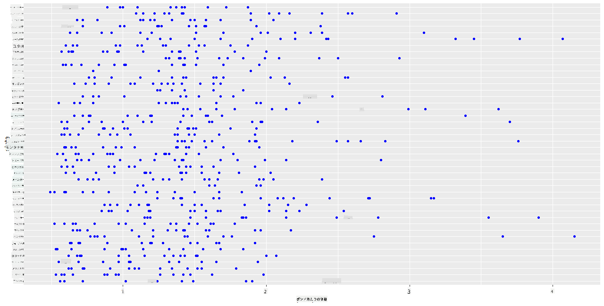
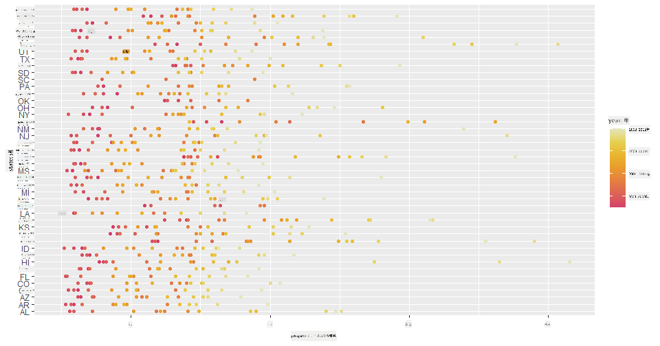
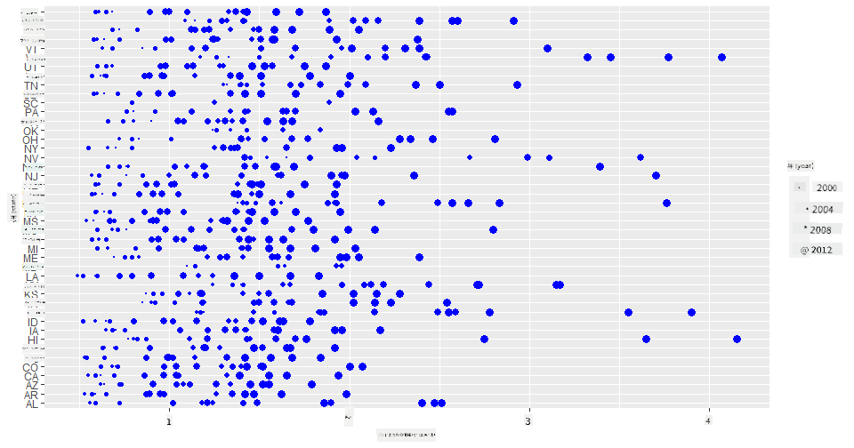
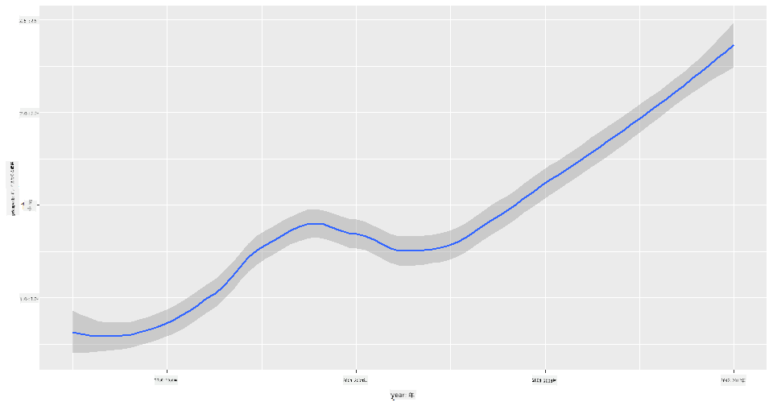
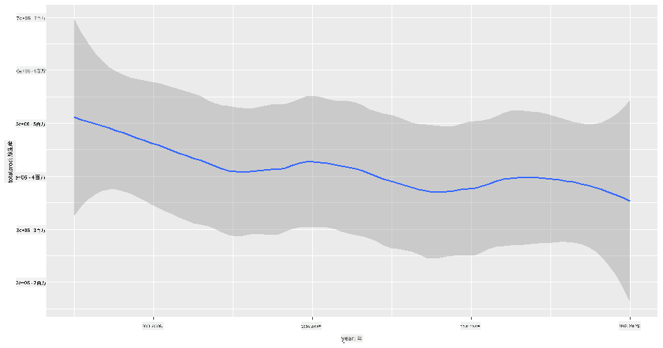
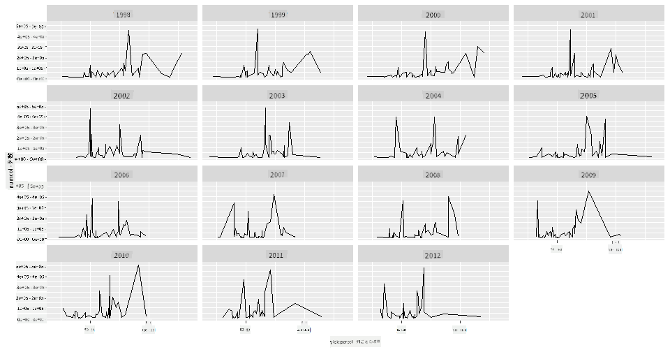
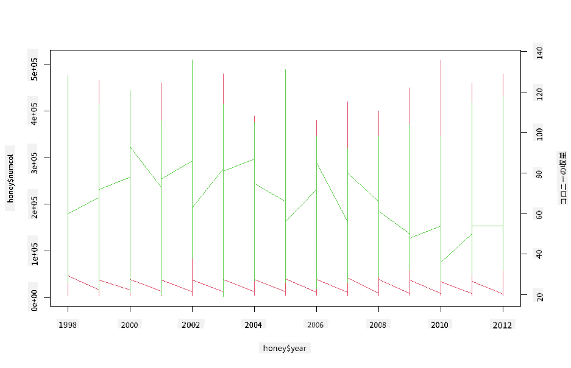

<!--
CO_OP_TRANSLATOR_METADATA:
{
  "original_hash": "a33c5d4b4156a2b41788d8720b6f724c",
  "translation_date": "2025-08-25T18:18:47+00:00",
  "source_file": "3-Data-Visualization/R/12-visualization-relationships/README.md",
  "language_code": "ja"
}
-->
# 関係の可視化: ハチミツについて 🍯

| ](../../../sketchnotes/12-Visualizing-Relationships.png)|
|:---:|
|関係の可視化 - _スケッチノート by [@nitya](https://twitter.com/nitya)_ |

私たちの研究の自然に焦点を当てたテーマを続け、さまざまな種類のハチミツ間の関係を示す興味深い可視化を探ってみましょう。このデータセットは[アメリカ合衆国農務省](https://www.nass.usda.gov/About_NASS/index.php)から得られたものです。

約600項目のデータセットには、アメリカの多くの州でのハチミツ生産が表示されています。例えば、州ごとのコロニー数、コロニーあたりの収量、総生産量、在庫、1ポンドあたりの価格、そして1998年から2012年までの各州のハチミツ生産価値を年ごとに確認できます。

特定の州の年間生産量とその州のハチミツ価格の関係を可視化するのは興味深いでしょう。または、州ごとのコロニーあたりのハチミツ収量の関係を可視化することもできます。この期間には、2006年に初めて確認された「CCD（コロニー崩壊症候群）」(http://npic.orst.edu/envir/ccd.html)が含まれており、研究する価値のあるデータセットです。🐝

## [講義前のクイズ](https://purple-hill-04aebfb03.1.azurestaticapps.net/quiz/22)

このレッスンでは、以前使用したことのあるggplot2を使って、変数間の関係を可視化する方法を学びます。特に興味深いのは、ggplot2の`geom_point`や`qplot`関数を使用して、散布図や折れ線グラフを作成し、データサイエンティストが変数間の関係をよりよく理解できるようにする「[統計的関係](https://ggplot2.tidyverse.org/)」を迅速に可視化することです。

## 散布図

散布図を使用して、州ごとのハチミツ価格が年々どのように変化しているかを示します。ggplot2の`ggplot`と`geom_point`を使用すると、州ごとのデータを便利にグループ化し、カテゴリカルデータと数値データの両方のデータポイントを表示できます。

まず、データとSeabornをインポートしましょう:

```r
honey=read.csv('../../data/honey.csv')
head(honey)
```
ハチミツデータには、年や1ポンドあたりの価格など、いくつか興味深い列が含まれています。これをアメリカの州ごとにグループ化して探索してみましょう:

| state | numcol | yieldpercol | totalprod | stocks   | priceperlb | prodvalue | year |
| ----- | ------ | ----------- | --------- | -------- | ---------- | --------- | ---- |
| AL    | 16000  | 71          | 1136000   | 159000   | 0.72       | 818000    | 1998 |
| AZ    | 55000  | 60          | 3300000   | 1485000  | 0.64       | 2112000   | 1998 |
| AR    | 53000  | 65          | 3445000   | 1688000  | 0.59       | 2033000   | 1998 |
| CA    | 450000 | 83          | 37350000  | 12326000 | 0.62       | 23157000  | 1998 |
| CO    | 27000  | 72          | 1944000   | 1594000  | 0.7        | 1361000   | 1998 |
| FL    | 230000 | 98          |22540000   | 4508000  | 0.64       | 14426000  | 1998 |

ハチミツの1ポンドあたりの価格とその州の関係を示す基本的な散布図を作成しましょう。`y`軸を十分に高くしてすべての州を表示できるようにします:

```r
library(ggplot2)
ggplot(honey, aes(x = priceperlb, y = state)) +
  geom_point(colour = "blue")
```


次に、ハチミツの色合いを使用して、価格が年々どのように変化しているかを示します。これを行うには、'scale_color_gradientn'パラメータを追加して、年ごとの変化を表示します:

> ✅ [scale_color_gradientn](https://www.rdocumentation.org/packages/ggplot2/versions/0.9.1/topics/scale_colour_gradientn)についてもっと学びましょう - 美しい虹色のカラースキームを試してみてください！

```r
ggplot(honey, aes(x = priceperlb, y = state, color=year)) +
  geom_point()+scale_color_gradientn(colours = colorspace::heat_hcl(7))
```


このカラースキームの変更により、ハチミツの1ポンドあたりの価格が年々明らかに進行していることがわかります。実際、データのサンプルセットを確認すると（例えばアリゾナ州を選択）、年々価格が上昇するパターンがいくつかの例外を除いて見られます:

| state | numcol | yieldpercol | totalprod | stocks  | priceperlb | prodvalue | year |
| ----- | ------ | ----------- | --------- | ------- | ---------- | --------- | ---- |
| AZ    | 55000  | 60          | 3300000   | 1485000 | 0.64       | 2112000   | 1998 |
| AZ    | 52000  | 62          | 3224000   | 1548000 | 0.62       | 1999000   | 1999 |
| AZ    | 40000  | 59          | 2360000   | 1322000 | 0.73       | 1723000   | 2000 |
| AZ    | 43000  | 59          | 2537000   | 1142000 | 0.72       | 1827000   | 2001 |
| AZ    | 38000  | 63          | 2394000   | 1197000 | 1.08       | 2586000   | 2002 |
| AZ    | 35000  | 72          | 2520000   | 983000  | 1.34       | 3377000   | 2003 |
| AZ    | 32000  | 55          | 1760000   | 774000  | 1.11       | 1954000   | 2004 |
| AZ    | 36000  | 50          | 1800000   | 720000  | 1.04       | 1872000   | 2005 |
| AZ    | 30000  | 65          | 1950000   | 839000  | 0.91       | 1775000   | 2006 |
| AZ    | 30000  | 64          | 1920000   | 902000  | 1.26       | 2419000   | 2007 |
| AZ    | 25000  | 64          | 1600000   | 336000  | 1.26       | 2016000   | 2008 |
| AZ    | 20000  | 52          | 1040000   | 562000  | 1.45       | 1508000   | 2009 |
| AZ    | 24000  | 77          | 1848000   | 665000  | 1.52       | 2809000   | 2010 |
| AZ    | 23000  | 53          | 1219000   | 427000  | 1.55       | 1889000   | 2011 |
| AZ    | 22000  | 46          | 1012000   | 253000  | 1.79       | 1811000   | 2012 |

色ではなくサイズを使用してこの進行を可視化する方法もあります。色覚異常のユーザーにとっては、これがより良い選択肢かもしれません。価格の増加を点の円周の増加で示すように可視化を編集しましょう:

```r
ggplot(honey, aes(x = priceperlb, y = state)) +
  geom_point(aes(size = year),colour = "blue") +
  scale_size_continuous(range = c(0.25, 3))
```
点のサイズが徐々に大きくなっているのがわかります。



これは単純な需要と供給の問題でしょうか？気候変動やコロニー崩壊などの要因により、年々購入可能なハチミツが減少し、その結果価格が上昇しているのでしょうか？

このデータセットの変数間の相関関係を発見するために、折れ線グラフを探索してみましょう。

## 折れ線グラフ

質問: ハチミツの1ポンドあたりの価格は年々明確に上昇しているのでしょうか？これを最も簡単に発見する方法は、単一の折れ線グラフを作成することです:

```r
qplot(honey$year,honey$priceperlb, geom='smooth', span =0.5, xlab = "year",ylab = "priceperlb")
```
答え: はい、ただし2003年付近にはいくつかの例外があります:



質問: では、2003年にはハチミツ供給の急増も見られるのでしょうか？年々の総生産量を見てみるとどうでしょう？

```python
qplot(honey$year,honey$totalprod, geom='smooth', span =0.5, xlab = "year",ylab = "totalprod")
```



答え: 実際にはそうではありません。総生産量を見ると、特定の年には増加しているように見えますが、一般的にはこの期間中のハチミツ生産量は減少しているようです。

質問: その場合、2003年付近のハチミツ価格の急上昇の原因は何だったのでしょうか？

これを発見するために、ファセットグリッドを探索してみましょう。

## ファセットグリッド

ファセットグリッドはデータセットの1つのファセット（この場合は「年」を選択して、生成されるファセットが多すぎないようにします）を取り、Seabornが選択したx座標とy座標のプロットを各ファセットごとに作成します。これにより、比較が容易になります。2003年はこのタイプの比較で際立っているでしょうか？

[ggplot2のドキュメント](https://ggplot2.tidyverse.org/reference/facet_wrap.html)で推奨されているように、`facet_wrap`を使用してファセットグリッドを作成します。

```r
ggplot(honey, aes(x=yieldpercol, y = numcol,group = 1)) + 
  geom_line() + facet_wrap(vars(year))
```
この可視化では、コロニーあたりの収量とコロニー数を年々比較し、列を3に設定して並べて表示します:



このデータセットでは、州ごとのコロニー数とその収量に関して、年々特に際立ったものは見られません。これら2つの変数間の相関関係を見つける別の方法はあるでしょうか？

## デュアルラインプロット

Rの`par`と`plot`関数を使用して、2つの折れ線グラフを重ね合わせたマルチラインプロットを試してみましょう。x軸に年をプロットし、2つのy軸を表示します。コロニーあたりの収量とコロニー数を重ね合わせて表示します:

```r
par(mar = c(5, 4, 4, 4) + 0.3)              
plot(honey$year, honey$numcol, pch = 16, col = 2,type="l")              
par(new = TRUE)                             
plot(honey$year, honey$yieldpercol, pch = 17, col = 3,              
     axes = FALSE, xlab = "", ylab = "",type="l")
axis(side = 4, at = pretty(range(y2)))      
mtext("colony yield", side = 4, line = 3)   
```


2003年付近で目立つものはありませんが、全体的にコロニー数が減少している一方で、コロニー数が安定していることがわかります。コロニーあたりの収量は減少しているものの、少し明るいニュースでこのレッスンを締めくくることができます。

がんばれ、ミツバチたち！

🐝❤️
## 🚀 チャレンジ

このレッスンでは、散布図やライングリッドの他の用途について少し学びました。ファセットグリッドを使用して、以前のレッスンで使用したデータセットを使って挑戦してみましょう。これらの技術を使用してグリッドを作成する際の所要時間や注意点を確認してください。
## [講義後のクイズ](https://purple-hill-04aebfb03.1.azurestaticapps.net/quiz/23)

## 復習と自己学習

折れ線グラフはシンプルなものから非常に複雑なものまであります。[ggplot2のドキュメント](https://ggplot2.tidyverse.org/reference/geom_path.html#:~:text=geom_line()%20connects%20them%20in,which%20cases%20are%20connected%20together)を少し読んで、折れ線グラフを構築するさまざまな方法について学びましょう。このレッスンで作成した折れ線グラフを、ドキュメントに記載されている他の方法で強化してみてください。
## 課題

[ハチミツの巣に飛び込もう](assignment.md)

**免責事項**:  
この文書は、AI翻訳サービス [Co-op Translator](https://github.com/Azure/co-op-translator) を使用して翻訳されています。正確性を追求しておりますが、自動翻訳には誤りや不正確な部分が含まれる可能性があることをご承知ください。元の言語で記載された文書が正式な情報源とみなされるべきです。重要な情報については、専門の人間による翻訳を推奨します。この翻訳の使用に起因する誤解や誤解釈について、当方は一切の責任を負いません。