<!--
CO_OP_TRANSLATOR_METADATA:
{
  "original_hash": "39f3b3a9d873eaa522c2e792ce0ca503",
  "translation_date": "2025-09-04T13:07:39+00:00",
  "source_file": "5-Data-Science-In-Cloud/18-Low-Code/README.md",
  "language_code": "ja"
}
-->
# クラウドでのデータサイエンス: 「ローコード/ノーコード」アプローチ

| ](../../sketchnotes/18-DataScience-Cloud.png)|
|:---:|
| クラウドでのデータサイエンス: ローコード - _スケッチノート by [@nitya](https://twitter.com/nitya)_ |

目次:

- [クラウドでのデータサイエンス: 「ローコード/ノーコード」アプローチ](../../../../5-Data-Science-In-Cloud/18-Low-Code)
  - [講義前のクイズ](../../../../5-Data-Science-In-Cloud/18-Low-Code)
  - [1. はじめに](../../../../5-Data-Science-In-Cloud/18-Low-Code)
    - [1.1 Azure Machine Learningとは？](../../../../5-Data-Science-In-Cloud/18-Low-Code)
    - [1.2 心不全予測プロジェクト:](../../../../5-Data-Science-In-Cloud/18-Low-Code)
    - [1.3 心不全データセット:](../../../../5-Data-Science-In-Cloud/18-Low-Code)
  - [2. Azure ML Studioでのローコード/ノーコードによるモデルのトレーニング](../../../../5-Data-Science-In-Cloud/18-Low-Code)
    - [2.1 Azure MLワークスペースの作成](../../../../5-Data-Science-In-Cloud/18-Low-Code)
    - [2.2 コンピュートリソース](../../../../5-Data-Science-In-Cloud/18-Low-Code)
      - [2.2.1 コンピュートリソースの適切な選択](../../../../5-Data-Science-In-Cloud/18-Low-Code)
      - [2.2.2 コンピュートクラスターの作成](../../../../5-Data-Science-In-Cloud/18-Low-Code)
    - [2.3 データセットの読み込み](../../../../5-Data-Science-In-Cloud/18-Low-Code)
    - [2.4 AutoMLによるローコード/ノーコードトレーニング](../../../../5-Data-Science-In-Cloud/18-Low-Code)
  - [3. ローコード/ノーコードによるモデルのデプロイとエンドポイントの利用](../../../../5-Data-Science-In-Cloud/18-Low-Code)
    - [3.1 モデルのデプロイ](../../../../5-Data-Science-In-Cloud/18-Low-Code)
    - [3.2 エンドポイントの利用](../../../../5-Data-Science-In-Cloud/18-Low-Code)
  - [🚀 チャレンジ](../../../../5-Data-Science-In-Cloud/18-Low-Code)
  - [講義後のクイズ](../../../../5-Data-Science-In-Cloud/18-Low-Code)
  - [レビューと自己学習](../../../../5-Data-Science-In-Cloud/18-Low-Code)
  - [課題](../../../../5-Data-Science-In-Cloud/18-Low-Code)
  
## [講義前のクイズ](https://ff-quizzes.netlify.app/en/ds/)

## 1. はじめに
### 1.1 Azure Machine Learningとは？

Azureクラウドプラットフォームは、200以上の製品とクラウドサービスを提供し、新しいソリューションを実現するための支援を行います。
データサイエンティストは、データの探索や前処理、さまざまなモデルトレーニングアルゴリズムの試行に多くの時間を費やします。これらの作業は時間がかかり、高価なコンピュートハードウェアを非効率的に使用することがよくあります。

[Azure ML](https://docs.microsoft.com/azure/machine-learning/overview-what-is-azure-machine-learning?WT.mc_id=academic-77958-bethanycheum&ocid=AID3041109)は、Azureで機械学習ソリューションを構築・運用するためのクラウドベースのプラットフォームです。データの準備、モデルのトレーニング、予測サービスの公開、使用状況の監視を支援する幅広い機能を備えています。特に、モデルトレーニングに関連する時間のかかる作業を自動化することで効率を向上させ、クラウドベースのコンピュートリソースを効果的にスケールさせ、大量のデータを処理しながら実際に使用した分だけのコストを発生させることができます。

Azure MLは、開発者やデータサイエンティストが機械学習ワークフローを実行するために必要なツールをすべて提供します。これには以下が含まれます：

- **Azure Machine Learning Studio**: モデルのトレーニング、デプロイ、オートメーション、トラッキング、資産管理をローコード/ノーコードで行うためのウェブポータル。Azure Machine Learning SDKと統合されています。
- **Jupyter Notebooks**: MLモデルを迅速にプロトタイプ化しテストするためのツール。
- **Azure Machine Learning Designer**: モジュールをドラッグ＆ドロップして実験を構築し、ローコード環境でパイプラインをデプロイ可能。
- **自動化された機械学習UI (AutoML)**: 機械学習モデル開発の反復作業を自動化し、高いスケール、効率、生産性を実現しながらモデル品質を維持。
- **データラベリング**: データを自動的にラベル付けする支援ツール。
- **Visual Studio Code用機械学習拡張機能**: MLプロジェクトを構築・管理するためのフル機能の開発環境。
- **機械学習CLI**: コマンドラインからAzure MLリソースを管理するためのコマンドを提供。
- **オープンソースフレームワークとの統合**: PyTorch、TensorFlow、Scikit-learnなどを使用して、機械学習プロセスのエンドツーエンドをトレーニング、デプロイ、管理。
- **MLflow**: 機械学習実験のライフサイクルを管理するためのオープンソースライブラリ。**MLFlow Tracking**は、トレーニング実行のメトリクスやモデルアーティファクトをログ・トラッキングするコンポーネント。

### 1.2 心不全予測プロジェクト:

プロジェクトを作成・構築することは、スキルや知識を試す最良の方法であることは間違いありません。このレッスンでは、Azure ML Studioを使用して心不全発作の予測プロジェクトを構築する2つの異なる方法を探ります。ローコード/ノーコードとAzure ML SDKを以下のスキーマで示します：

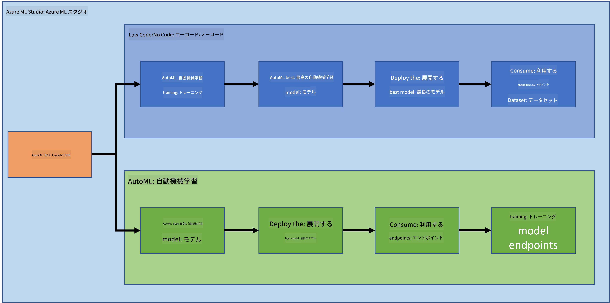

それぞれの方法には利点と欠点があります。ローコード/ノーコードの方法は、GUI（グラフィカルユーザーインターフェース）を使用するため、コードの事前知識が不要で、簡単に始められます。この方法はプロジェクトの実現可能性を迅速にテストし、POC（概念実証）を作成するのに適しています。しかし、プロジェクトが成長し、プロダクション対応が必要になると、GUIを使用してリソースを作成するのは現実的ではありません。リソースの作成からモデルのデプロイまで、すべてをプログラムで自動化する必要があります。このような場合、Azure ML SDKの使用方法を知ることが重要になります。

|                   | ローコード/ノーコード | Azure ML SDK              |
|-------------------|------------------|---------------------------|
| コードの専門知識 | 不要             | 必要                      |
| 開発時間         | 簡単で迅速       | コードの専門知識に依存    |
| プロダクション対応 | いいえ           | はい                      |

### 1.3 心不全データセット: 

心血管疾患（CVD）は世界的に死因の第1位であり、全死亡の31%を占めています。タバコの使用、不健康な食事と肥満、身体活動の欠如、有害なアルコール使用などの環境的および行動的リスク要因は、推定モデルの特徴として使用できます。CVDの発症確率を推定できることは、高リスクの人々の発作を予防するために非常に役立ちます。

Kaggleは、[心不全データセット](https://www.kaggle.com/andrewmvd/heart-failure-clinical-data)を公開しており、このプロジェクトで使用します。このデータセットは、13列（12の特徴と1つのターゲット変数）と299行の表形式データです。

|    | 変数名                     | 型              | 説明                                                     | 例                 |
|----|---------------------------|-----------------|-----------------------------------------------------------|-------------------|
| 1  | age                       | 数値型          | 患者の年齢                                               | 25                |
| 2  | anaemia                   | ブール型        | 赤血球またはヘモグロビンの減少                           | 0 または 1        |
| 3  | creatinine_phosphokinase  | 数値型          | 血中のCPK酵素のレベル                                    | 542               |
| 4  | diabetes                  | ブール型        | 患者が糖尿病かどうか                                     | 0 または 1        |
| 5  | ejection_fraction         | 数値型          | 心臓の収縮ごとに心臓から出る血液の割合                   | 45                |
| 6  | high_blood_pressure       | ブール型        | 患者が高血圧かどうか                                     | 0 または 1        |
| 7  | platelets                 | 数値型          | 血中の血小板                                             | 149000            |
| 8  | serum_creatinine          | 数値型          | 血中の血清クレアチニンのレベル                           | 0.5               |
| 9  | serum_sodium              | 数値型          | 血中の血清ナトリウムのレベル                             | jun               |
| 10 | sex                       | ブール型        | 女性または男性                                           | 0 または 1        |
| 11 | smoking                   | ブール型        | 患者が喫煙しているかどうか                               | 0 または 1        |
| 12 | time                      | 数値型          | フォローアップ期間（日数）                               | 4                 |
|----|---------------------------|-----------------|-----------------------------------------------------------|-------------------|
| 21 | DEATH_EVENT [ターゲット]  | ブール型        | フォローアップ期間中に患者が死亡したかどうか             | 0 または 1        |

データセットを取得したら、Azureでプロジェクトを開始できます。

## 2. Azure ML Studioでのローコード/ノーコードによるモデルのトレーニング
### 2.1 Azure MLワークスペースの作成
Azure MLでモデルをトレーニングするには、まずAzure MLワークスペースを作成する必要があります。ワークスペースはAzure Machine Learningのトップレベルリソースであり、Azure Machine Learningを使用して作成するすべてのアーティファクトを集中管理する場所を提供します。ワークスペースはすべてのトレーニング実行の履歴を保持し、ログ、メトリクス、出力、スクリプトのスナップショットを含みます。この情報を使用して、最良のモデルを生成するトレーニング実行を特定します。[詳細はこちら](https://docs.microsoft.com/azure/machine-learning/concept-workspace?WT.mc_id=academic-77958-bethanycheum&ocid=AID3041109)

最新のブラウザを使用することを推奨します。以下のブラウザがサポートされています：

- Microsoft Edge（新しいMicrosoft Edge、最新バージョン。Microsoft Edgeレガシーではありません）
- Safari（最新バージョン、Macのみ）
- Chrome（最新バージョン）
- Firefox（最新バージョン）

Azure Machine Learningを使用するには、Azureサブスクリプション内にワークスペースを作成します。このワークスペースを使用して、データ、コンピュートリソース、コード、モデル、その他の機械学習ワークロードに関連するアーティファクトを管理できます。

> **_注意:_** Azure Machine Learningワークスペースがサブスクリプション内に存在する限り、データストレージに少額の料金が発生します。そのため、使用しなくなった場合はAzure Machine Learningワークスペースを削除することを推奨します。

1. [Azureポータル](https://ms.portal.azure.com/)にMicrosoftの資格情報を使用してサインインします。
2. **＋リソースの作成**を選択します。
   
   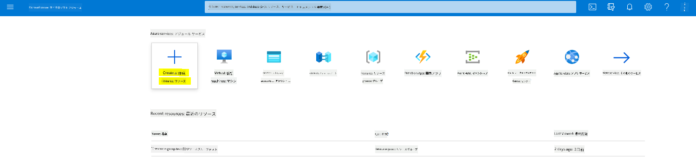

   Machine Learningを検索し、Machine Learningタイルを選択します。

   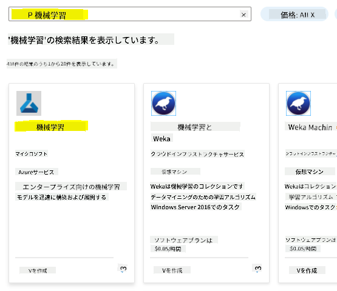

   作成ボタンをクリックします。

   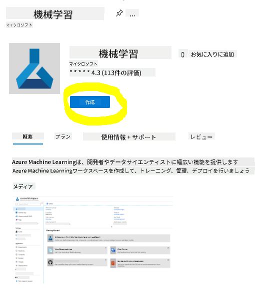

   以下の設定を入力します：
   - サブスクリプション: あなたのAzureサブスクリプション
   - リソースグループ: リソースグループを作成または選択
   - ワークスペース名: ワークスペースの一意の名前を入力
   - リージョン: あなたに最も近い地理的リージョンを選択
   - ストレージアカウント: ワークスペース用に作成されるデフォルトの新しいストレージアカウントに注意
   - キーボールト: ワークスペース用に作成されるデフォルトの新しいキーボールトに注意
   - アプリケーションインサイト: ワークスペース用に作成されるデフォルトの新しいアプリケーションインサイトリソースに注意
   - コンテナレジストリ: なし（モデルをコンテナにデプロイする際に自動的に作成されます）

    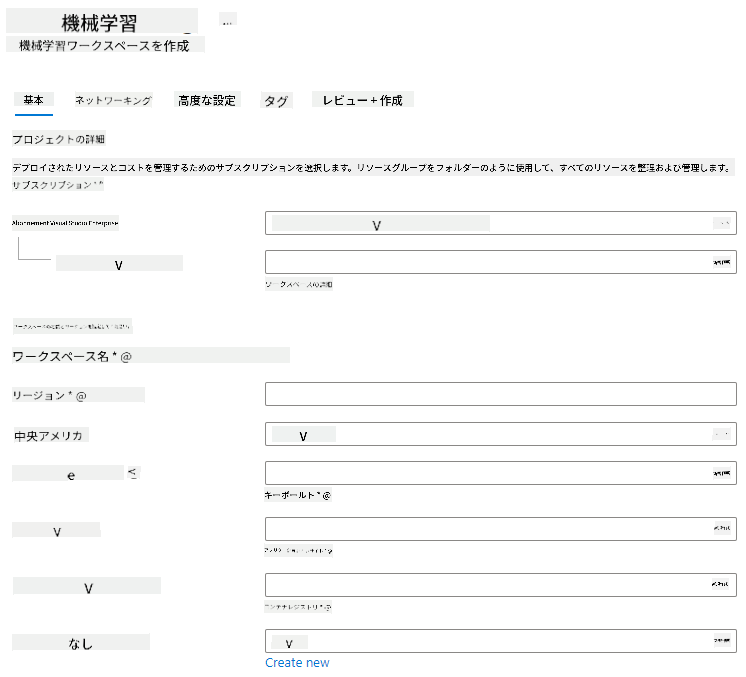

   - 作成＋レビューをクリックし、その後作成ボタンをクリックします。
3. ワークスペースが作成されるのを待ちます（数分かかる場合があります）。その後、ポータルでワークスペースに移動します。Machine Learning Azureサービスを通じて見つけることができます。
4. ワークスペースの概要ページでAzure Machine Learning Studioを起動します（または新しいブラウザタブを開き、https://ml.azure.com に移動します）。Microsoftアカウントを使用してAzure Machine Learning Studioにサインインします。プロンプトが表示された場合は、Azureディレクトリとサブスクリプション、Azure Machine Learningワークスペースを選択します。
   
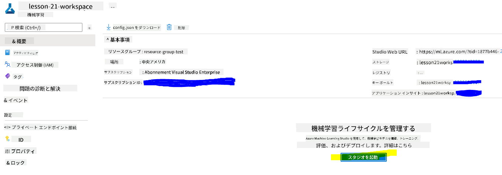

5. Azure Machine Learning Studioで、左上の☰アイコンを切り替えてインターフェース内のさまざまなページを表示します。これらのページを使用してワークスペース内のリソースを管理できます。

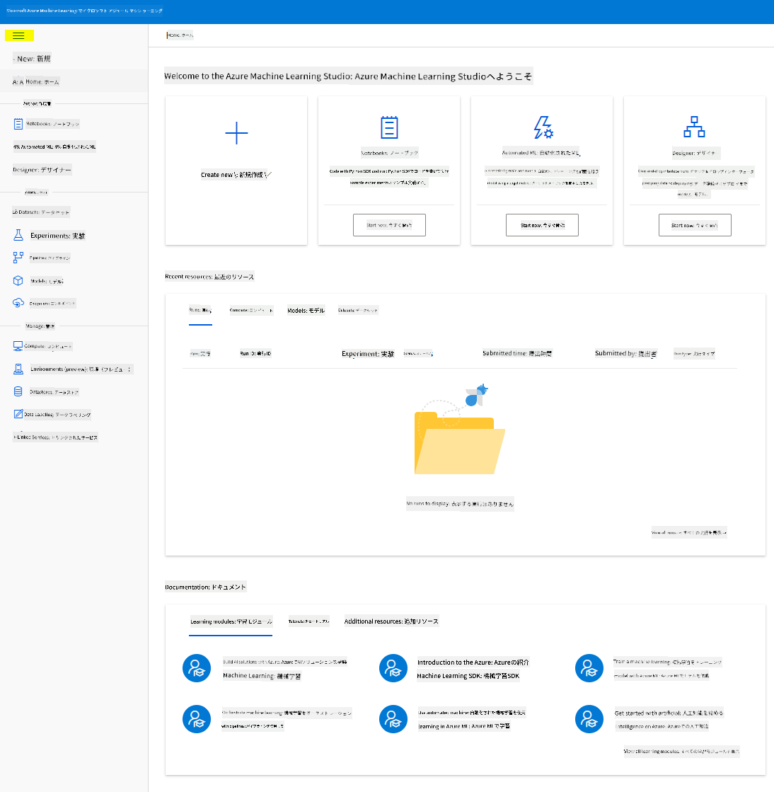

Azureポータルを使用してワークスペースを管理できますが、データサイエンティストや機械学習運用エンジニアにとっては、Azure Machine Learning Studioがワークスペースリソースを管理するためのより集中したユーザーインターフェースを提供します。

### 2.2 コンピュートリソース

コンピュートリソースは、モデルのトレーニングやデータ探索プロセスを実行するためのクラウドベースのリソースです。以下の4種類のコンピュートリソースを作成できます：

- **コンピュートインスタンス**: データサイエンティストがデータやモデルを操作するための開発用ワークステーション。これには仮想マシン（VM）の作成とノートブックインスタンスの起動が含まれます。その後、ノートブックからコンピュートクラスターを呼び出してモデルをトレーニングできます。
- **コンピュートクラスター**: 実験コードのオンデマンド処理のためのスケーラブルなVMクラスター。モデルをトレーニングする際に必要です。コンピュートクラスターは、専門的なGPUやCPUリソースも利用できます。
- **推論クラスター**: トレーニング済みモデルを使用する予測サービスのデプロイターゲット。
- **アタッチされたコンピュート**: Virtual MachinesやAzure Databricksクラスターなど、既存のAzureコンピュートリソースにリンクします。

#### 2.2.1 コンピュートリソースに適したオプションを選ぶ

コンピュートリソースを作成する際に考慮すべき重要な要素がいくつかあります。これらの選択は重要な決定となる場合があります。

**CPUが必要ですか、それともGPUですか？**

CPU（中央処理装置）は、コンピュータプログラムを構成する命令を実行する電子回路です。一方、GPU（グラフィックス処理装置）は、グラフィックス関連のコードを非常に高速で実行できる特殊な電子回路です。

CPUとGPUのアーキテクチャの主な違いは、CPUは幅広いタスクを迅速に処理するよう設計されていますが（CPUクロックスピードで測定）、同時に実行できるタスクの数には制限があります。一方、GPUは並列計算に特化しており、ディープラーニングタスクに非常に適しています。

| CPU                                     | GPU                         |
|-----------------------------------------|-----------------------------|
| コストが低い                            | コストが高い                |
| 同時実行性が低い                        | 同時実行性が高い            |
| ディープラーニングモデルのトレーニングが遅い | ディープラーニングに最適    |

**クラスターサイズ**

クラスターが大きいほどコストは高くなりますが、応答性が向上します。そのため、時間に余裕があり予算が限られている場合は、小さなクラスターから始めるべきです。逆に、予算に余裕があり時間が限られている場合は、大きなクラスターから始めるべきです。

**VMサイズ**

時間と予算の制約に応じて、RAM、ディスク、コア数、クロックスピードのサイズを調整できます。これらのパラメータを増やすとコストは高くなりますが、パフォーマンスは向上します。

**専用インスタンスか低優先度インスタンスか？**

低優先度インスタンスは中断可能であることを意味します。つまり、Microsoft Azureがこれらのリソースを他のタスクに割り当てることでジョブが中断される可能性があります。一方、専用インスタンス（中断不可）は、許可なくジョブが終了することはありません。
これは時間とコストのトレードオフの一例であり、中断可能なインスタンスは専用インスタンスよりも安価です。

#### 2.2.2 コンピュートクラスターの作成

以前に作成した[Azure MLワークスペース](https://ml.azure.com/)で、コンピュートに移動すると、先ほど説明したさまざまなコンピュートリソース（コンピュートインスタンス、コンピュートクラスター、推論クラスター、アタッチされたコンピュート）を確認できます。このプロジェクトでは、モデルトレーニングのためにコンピュートクラスターが必要です。Studioで「コンピュート」メニューをクリックし、「コンピュートクラスター」タブを選択して、「+ 新規」ボタンをクリックしてコンピュートクラスターを作成します。

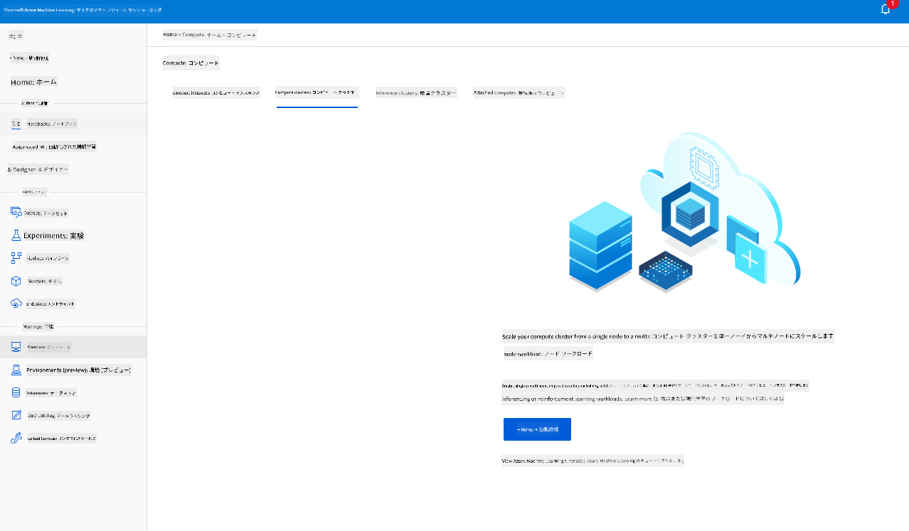

1. オプションを選択します：専用か低優先度か、CPUかGPUか、VMサイズとコア数（このプロジェクトではデフォルト設定のままで構いません）。
2. 「次へ」ボタンをクリックします。

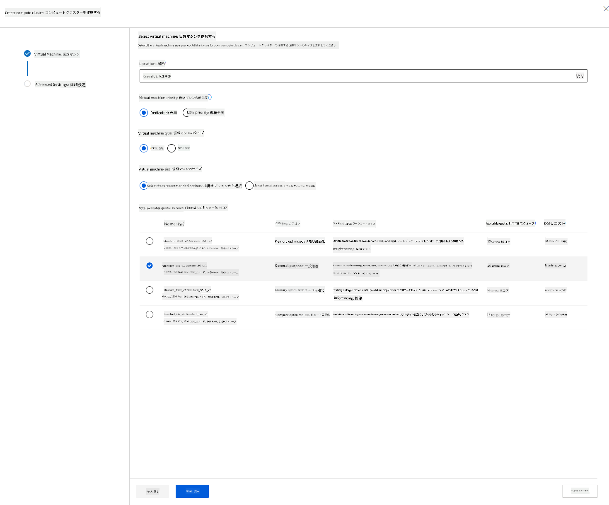

3. クラスターに名前を付けます。
4. オプションを選択します：最小/最大ノード数、スケールダウンまでのアイドル秒数、SSHアクセス。最小ノード数を0に設定すると、クラスターがアイドル状態のときにコストを節約できます。最大ノード数が多いほどトレーニング時間は短くなります。推奨される最大ノード数は3です。
5. 「作成」ボタンをクリックします。このステップには数分かかる場合があります。

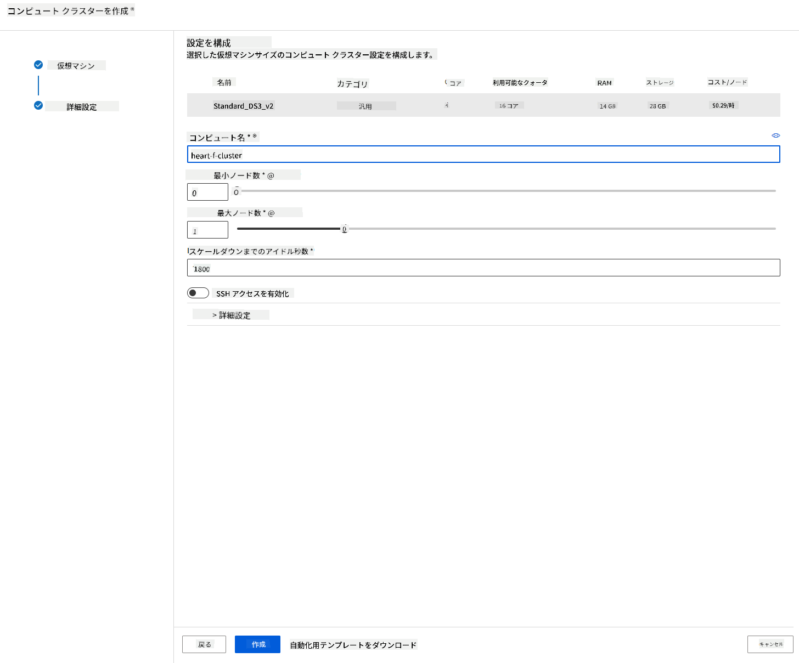

素晴らしい！これでコンピュートクラスターが作成されましたので、Azure ML Studioにデータをロードする必要があります。

### 2.3 データセットのロード

1. 以前に作成した[Azure MLワークスペース](https://ml.azure.com/)で、左メニューの「データセット」をクリックし、「+ データセットの作成」ボタンをクリックしてデータセットを作成します。「ローカルファイルから」のオプションを選択し、先ほどダウンロードしたKaggleデータセットを選択します。

   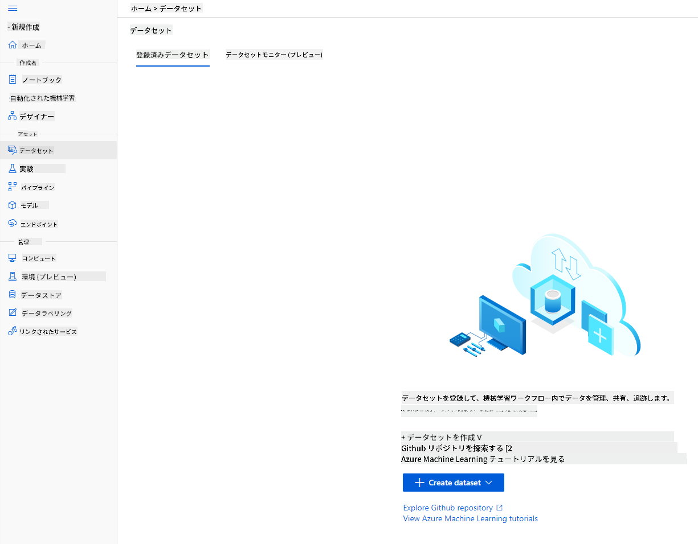

2. データセットに名前、タイプ、説明を付けます。「次へ」をクリックします。ファイルからデータをアップロードします。「次へ」をクリックします。

   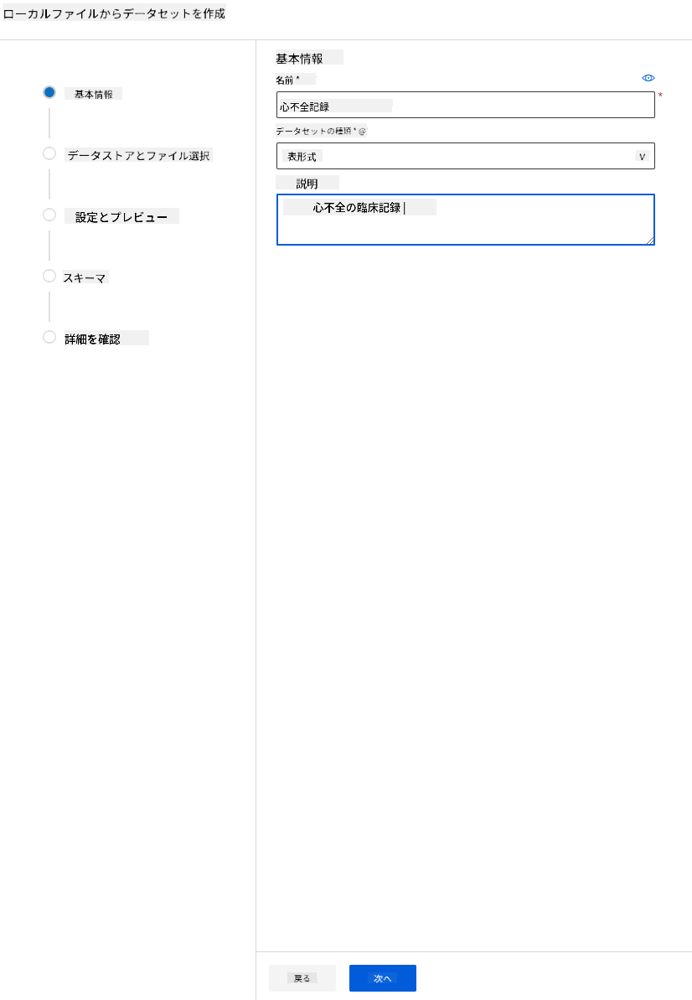

3. スキーマで、以下の特徴のデータ型をBooleanに変更します：anaemia、diabetes、high blood pressure、sex、smoking、DEATH_EVENT。「次へ」をクリックし、「作成」をクリックします。

   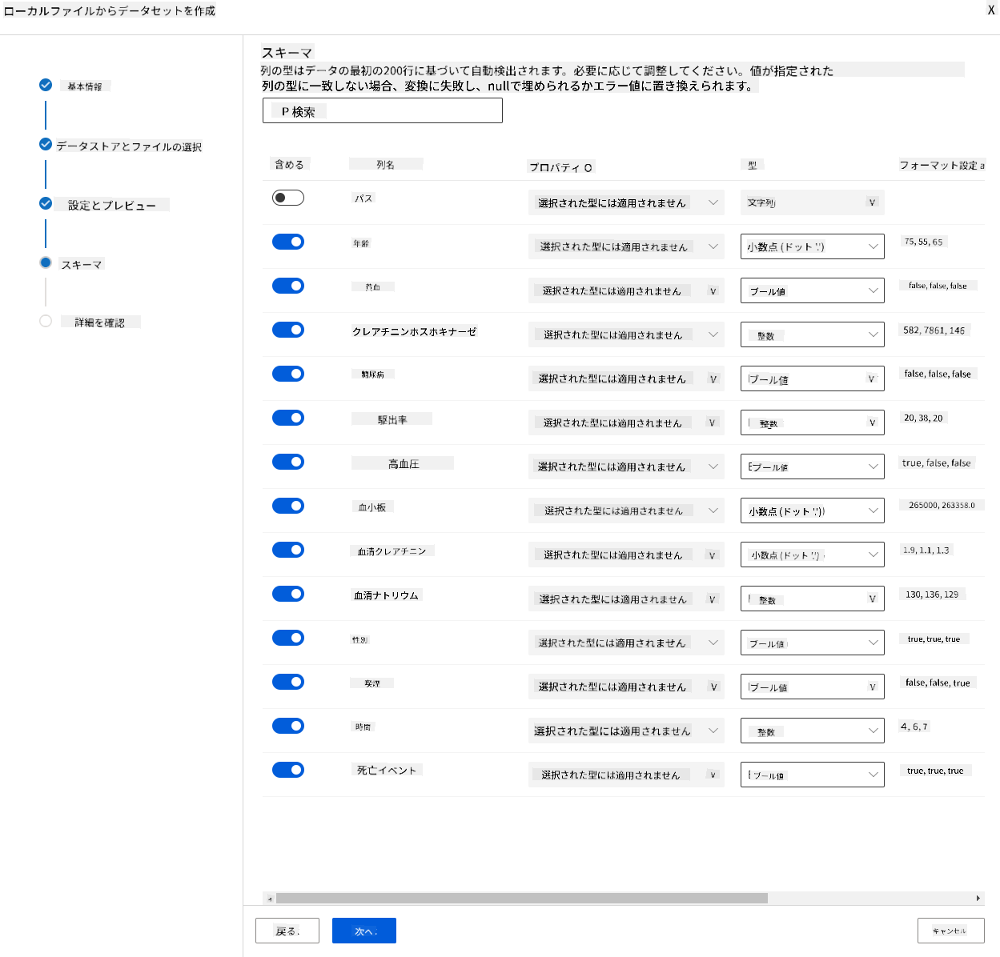

素晴らしい！これでデータセットが準備され、コンピュートクラスターも作成されましたので、モデルのトレーニングを開始できます！

### 2.4 AutoMLを使ったローコード/ノーコードトレーニング

従来の機械学習モデルの開発はリソースを多く消費し、専門的な知識と多くの時間を必要とします。自動化された機械学習（AutoML）は、機械学習モデル開発の時間のかかる反復的なタスクを自動化するプロセスです。これにより、データサイエンティスト、アナリスト、開発者が高いスケール、効率、生産性でMLモデルを構築できるようになります。モデルの品質を維持しながら、プロダクション対応のMLモデルを迅速に作成することが可能です。[詳細はこちら](https://docs.microsoft.com/azure/machine-learning/concept-automated-ml?WT.mc_id=academic-77958-bethanycheum&ocid=AID3041109)

1. 以前に作成した[Azure MLワークスペース](https://ml.azure.com/)で、左メニューの「Automated ML」をクリックし、先ほどアップロードしたデータセットを選択します。「次へ」をクリックします。

   

2. 新しい実験名、ターゲット列（DEATH_EVENT）、作成したコンピュートクラスターを入力します。「次へ」をクリックします。

   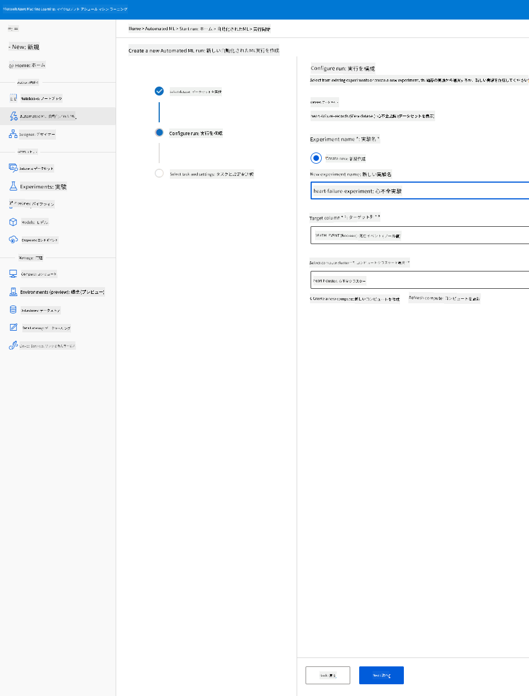

3. 「分類」を選択し、「完了」をクリックします。このステップには30分から1時間かかる場合があります（コンピュートクラスターのサイズによります）。

   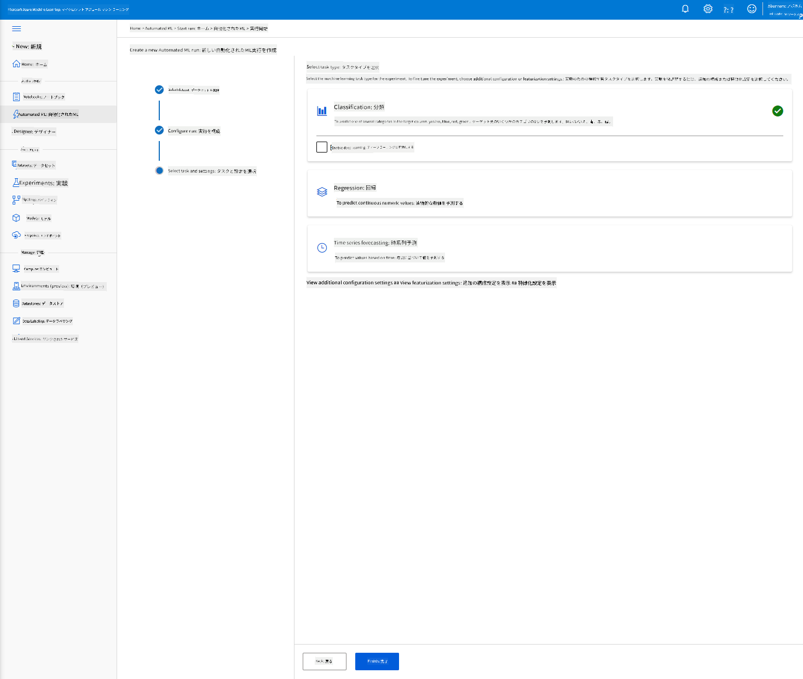

4. 実行が完了したら、「Automated ML」タブをクリックし、実行を選択して、「ベストモデル概要」カードのアルゴリズムをクリックします。

   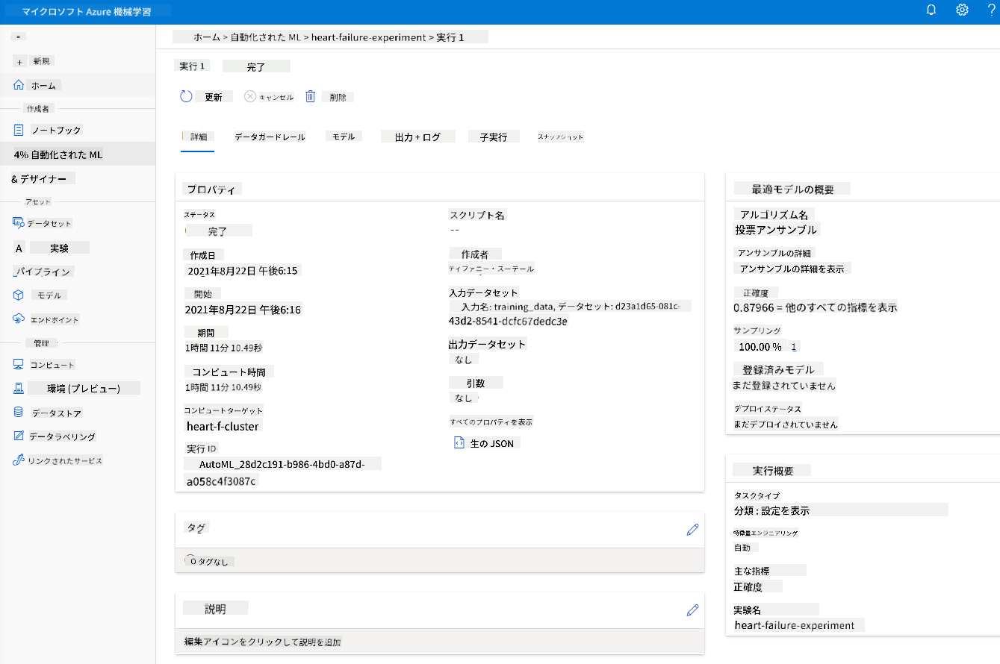

ここでは、AutoMLが生成したベストモデルの詳細な説明を確認できます。また、「モデル」タブで他のモデルも探索できます。数分間、生成されたモデルを調査し、AutoMLが選択したベストモデルを使用する理由を理解してください（ここではAutoMLが選択したベストモデルを使用します）。次に、このモデルをデプロイする方法を見ていきます。

## 3. ローコード/ノーコードモデルのデプロイとエンドポイントの利用
### 3.1 モデルのデプロイ

自動化された機械学習インターフェースを使用すると、数ステップでベストモデルをWebサービスとしてデプロイできます。デプロイメントとは、新しいデータに基づいて予測を行い、潜在的な機会領域を特定できるようにモデルを統合することを意味します。このプロジェクトでは、Webサービスへのデプロイメントにより、医療アプリケーションがモデルを利用して患者の心臓発作リスクをリアルタイムで予測できるようになります。

ベストモデルの説明で「デプロイ」ボタンをクリックします。

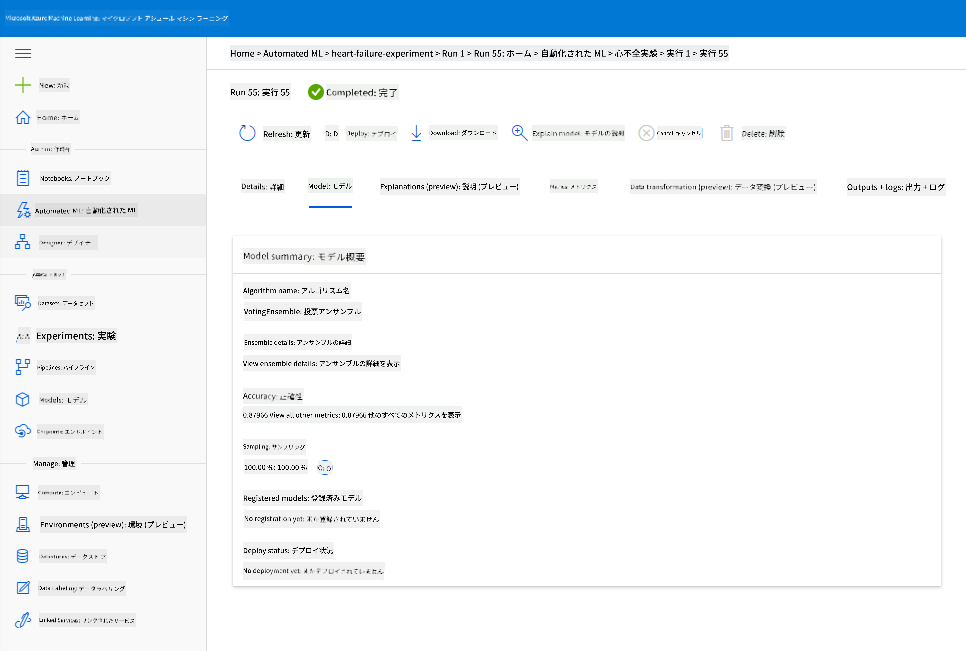

15. 名前、説明、コンピュートタイプ（Azure Container Instance）、認証を有効にして「デプロイ」をクリックします。このステップには約20分かかる場合があります。デプロイメントプロセスには、モデルの登録、リソースの生成、それらをWebサービス用に構成するステップが含まれます。「デプロイステータス」の下にステータスメッセージが表示されます。「更新」を定期的に選択してデプロイステータスを確認してください。ステータスが「正常」になれば、デプロイメントが完了し、稼働中です。

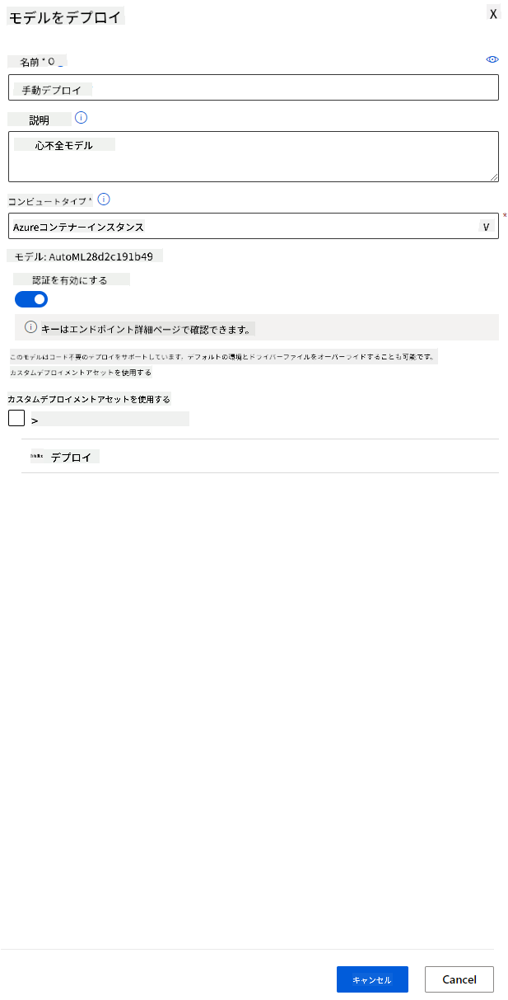

16. デプロイが完了したら、「エンドポイント」タブをクリックし、デプロイしたエンドポイントを選択します。ここでエンドポイントに関するすべての詳細を確認できます。

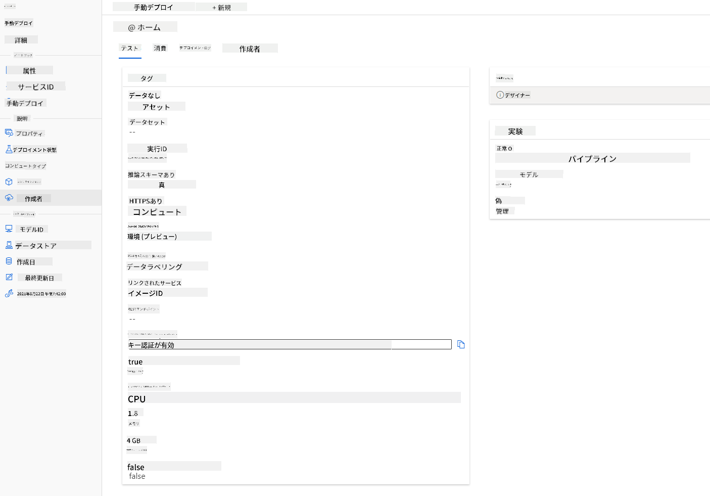

素晴らしい！これでモデルがデプロイされましたので、エンドポイントの利用を開始できます。

### 3.2 エンドポイントの利用

「利用」タブをクリックします。ここでは、RESTエンドポイントとPythonスクリプトを利用オプションで確認できます。Pythonコードをよく読んでみてください。

このスクリプトはローカルマシンから直接実行でき、エンドポイントを利用します。

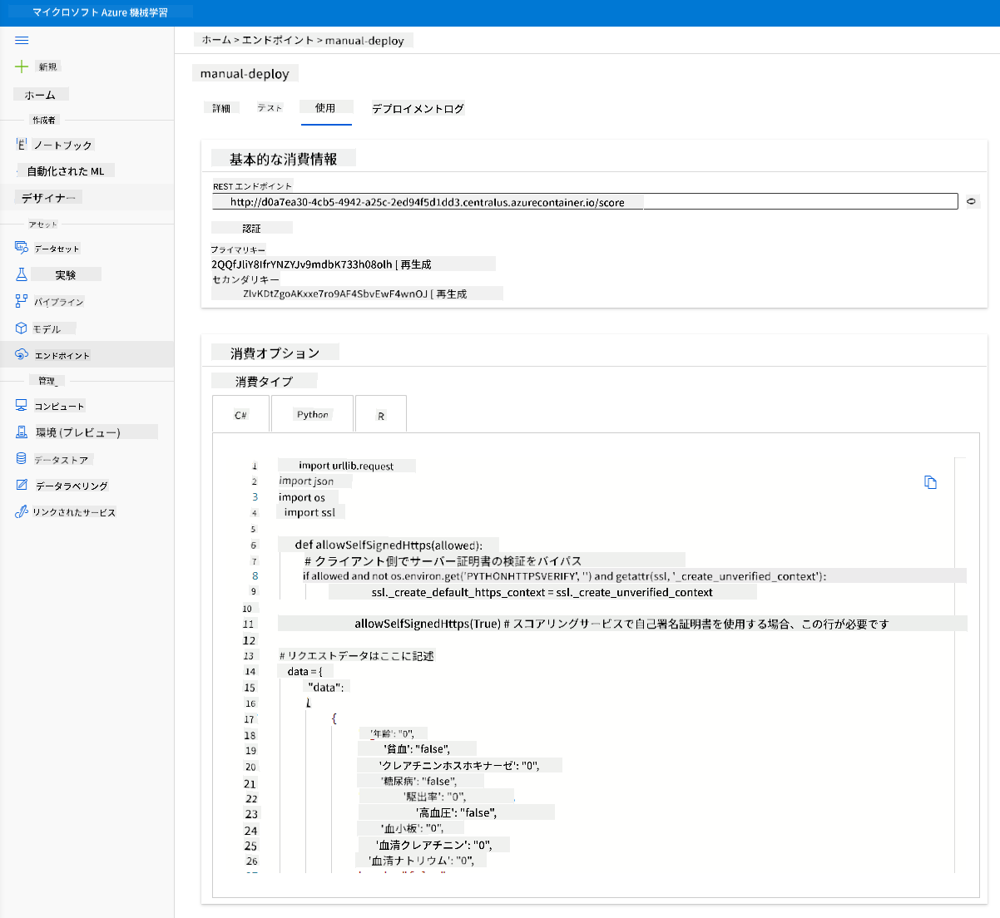

以下の2行のコードを確認してください：

```python
url = 'http://98e3715f-xxxx-xxxx-xxxx-9ec22d57b796.centralus.azurecontainer.io/score'
api_key = '' # Replace this with the API key for the web service
```  
`url`変数は利用タブにあるRESTエンドポイントで、`api_key`変数は認証を有効にした場合に利用タブに表示されるプライマリキーです。このスクリプトはこの情報を使用してエンドポイントを利用します。

18. スクリプトを実行すると、以下の出力が表示されるはずです：
    ```python
    b'"{\\"result\\": [true]}"'
    ```  
これは、与えられたデータに基づいて心不全の予測が真であることを意味します。スクリプトで自動生成されたデータをよく見ると、すべてがデフォルトで0またはfalseになっているため、これは理にかなっています。以下の入力サンプルでデータを変更できます：

```python
data = {
    "data":
    [
        {
            'age': "0",
            'anaemia': "false",
            'creatinine_phosphokinase': "0",
            'diabetes': "false",
            'ejection_fraction': "0",
            'high_blood_pressure': "false",
            'platelets': "0",
            'serum_creatinine': "0",
            'serum_sodium': "0",
            'sex': "false",
            'smoking': "false",
            'time': "0",
        },
        {
            'age': "60",
            'anaemia': "false",
            'creatinine_phosphokinase': "500",
            'diabetes': "false",
            'ejection_fraction': "38",
            'high_blood_pressure': "false",
            'platelets': "260000",
            'serum_creatinine': "1.40",
            'serum_sodium': "137",
            'sex': "false",
            'smoking': "false",
            'time': "130",
        },
    ],
}
```  
スクリプトは以下を返すはずです：
    ```python
    b'"{\\"result\\": [true, false]}"'
    ```  

おめでとうございます！これで、Azure MLでトレーニングしデプロイしたモデルを利用しました！

> **_注意:_** プロジェクトが完了したら、すべてのリソースを削除するのを忘れないでください。

## 🚀 チャレンジ

AutoMLが生成したトップモデルの説明と詳細をよく見てください。なぜベストモデルが他のモデルより優れているのかを理解してください。どのアルゴリズムが比較されましたか？それらの違いは何ですか？なぜこのケースでベストモデルがより良いパフォーマンスを発揮しているのでしょうか？

## [講義後のクイズ](https://ff-quizzes.netlify.app/en/ds/)

## 復習と自己学習

このレッスンでは、クラウド上でローコード/ノーコードで心不全リスクを予測するモデルをトレーニング、デプロイ、利用する方法を学びました。まだ行っていない場合は、AutoMLが生成したトップモデルの説明をさらに深く掘り下げ、なぜベストモデルが他のモデルより優れているのかを理解してください。

ローコード/ノーコードAutoMLについてさらに学ぶには、この[ドキュメント](https://docs.microsoft.com/azure/machine-learning/tutorial-first-experiment-automated-ml?WT.mc_id=academic-77958-bethanycheum&ocid=AID3041109)を読んでください。

## 課題

[Azure MLでのローコード/ノーコードデータサイエンスプロジェクト](assignment.md)

---

**免責事項**:  
この文書は、AI翻訳サービス [Co-op Translator](https://github.com/Azure/co-op-translator) を使用して翻訳されています。正確性を追求しておりますが、自動翻訳には誤りや不正確な部分が含まれる可能性があります。元の言語で記載された原文を公式な情報源としてご参照ください。重要な情報については、専門の人間による翻訳を推奨します。この翻訳の利用に起因する誤解や誤認について、当方は一切の責任を負いません。