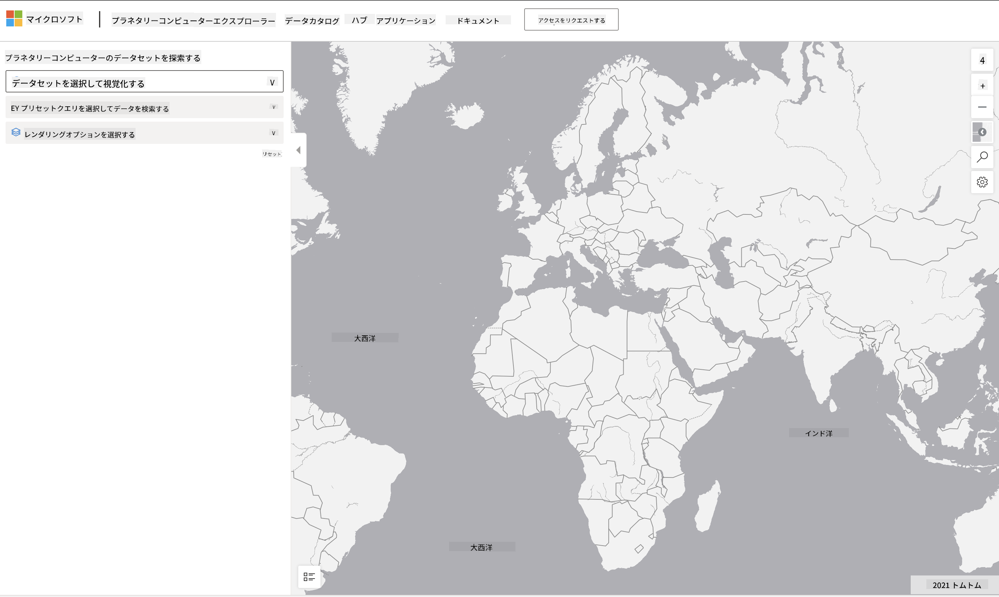

<!--
CO_OP_TRANSLATOR_METADATA:
{
  "original_hash": "d1e05715f9d97de6c4f1fb0c5a4702c0",
  "translation_date": "2025-08-25T17:18:50+00:00",
  "source_file": "6-Data-Science-In-Wild/20-Real-World-Examples/assignment.md",
  "language_code": "ja"
}
-->
# 惑星コンピューターのデータセットを探る

## 手順

このレッスンでは、データサイエンスのさまざまな応用分野について話し合いました。研究、持続可能性、デジタル人文学に関連する具体例を深く掘り下げました。この課題では、これらの例の1つをさらに詳しく調べ、データの視覚化や分析に関する学びを活用して、持続可能性データに関する洞察を導き出します。

[Planetary Computer](https://planetarycomputer.microsoft.com/) プロジェクトには、アカウントを作成することでアクセスできるデータセットやAPIがあります。課題のボーナスステップを試したい場合は、アカウントをリクエストしてください。また、アカウントを作成せずに使用できる [Explorer](https://planetarycomputer.microsoft.com/explore) 機能も提供されています。

`手順:`
Explorerインターフェース（以下のスクリーンショット参照）では、データセット（提供されているオプションから選択）、プリセットクエリ（データをフィルタリングするため）、およびレンダリングオプション（関連する視覚化を作成するため）を選択できます。この課題では、以下を行います：

 1. [Explorerのドキュメント](https://planetarycomputer.microsoft.com/docs/overview/explorer/) を読む - オプションを理解する。
 2. データセットの [Catalog](https://planetarycomputer.microsoft.com/catalog) を調べる - 各データセットの目的を学ぶ。
 3. Explorerを使用する - 興味のあるデータセットを選び、関連するクエリとレンダリングオプションを選択する。

`あなたの課題:`
ブラウザに表示された視覚化を調べ、以下の質問に答えてください：
 * データセットにはどのような _特徴_ が含まれていますか？
 * 視覚化はどのような _洞察_ や結果を提供していますか？
 * その洞察がプロジェクトの持続可能性目標にどのような _影響_ を与えますか？
 * 視覚化の _限界_ は何ですか（つまり、どのような洞察が得られなかったか）？
 * 生データを取得できた場合、どのような _代替視覚化_ を作成しますか？その理由は？

`ボーナスポイント:`
アカウントを申請し、承認されたらログインしてください。
 * _Launch Hub_ オプションを使用して、生データをノートブックで開く。
 * データを対話的に探り、考えた代替視覚化を実装する。
 * カスタム視覚化を分析し、以前に得られなかった洞察を導き出せたかどうかを確認する。

## 評価基準

優秀 | 適切 | 改善が必要
--- | --- | -- |
5つの主要な質問すべてに回答している。現在の視覚化と代替視覚化が持続可能性の目標や成果にどのように洞察を提供するかを明確に特定している。| 上位3つの質問に十分な詳細で回答しており、Explorerを実際に使用した経験があることを示している。| 複数の質問に回答していない、または詳細が不十分であり、課題に対して意味のある取り組みが行われていないことを示している。 |

**免責事項**:  
この文書は、AI翻訳サービス [Co-op Translator](https://github.com/Azure/co-op-translator) を使用して翻訳されています。正確性を追求しておりますが、自動翻訳には誤りや不正確な部分が含まれる可能性があることをご承知ください。元の言語で記載された文書が正式な情報源とみなされるべきです。重要な情報については、専門の人間による翻訳を推奨します。この翻訳の使用に起因する誤解や誤認について、当方は一切の責任を負いません。