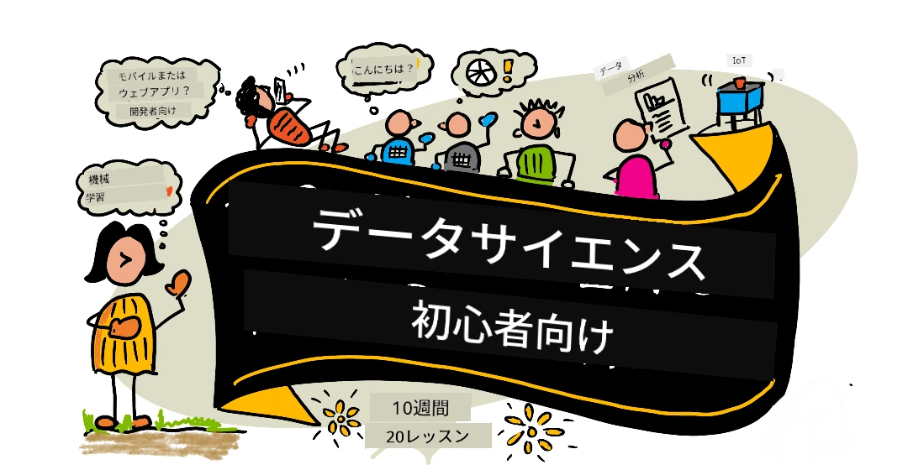
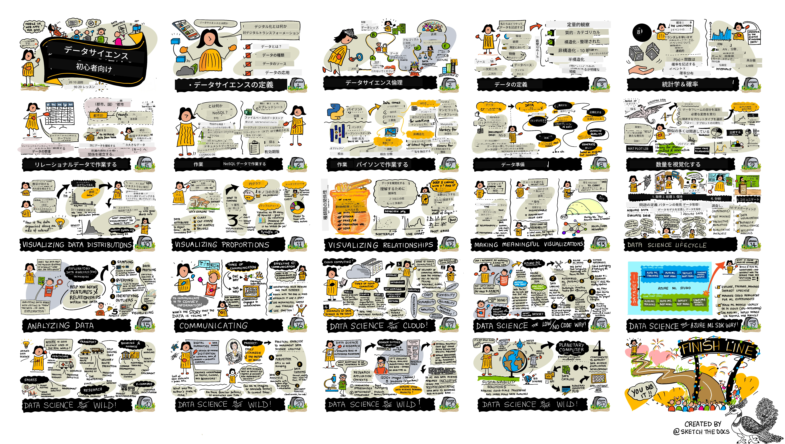

# データサイエンス入門 - カリキュラム

[](https://github.com/codespaces/new?hide_repo_select=true&ref=main&repo=344191198)

[](https://github.com/microsoft/Data-Science-For-Beginners/blob/master/LICENSE)
[](https://GitHub.com/microsoft/Data-Science-For-Beginners/graphs/contributors/)
[](https://GitHub.com/microsoft/Data-Science-For-Beginners/issues/)
[](https://GitHub.com/microsoft/Data-Science-For-Beginners/pulls/)
[](http://makeapullrequest.com)

[](https://GitHub.com/microsoft/Data-Science-For-Beginners/watchers/)
[](https://GitHub.com/microsoft/Data-Science-For-Beginners/network/)
[](https://GitHub.com/microsoft/Data-Science-For-Beginners/stargazers/)


[](https://discord.gg/nTYy5BXMWG)

[](https://aka.ms/foundry/forum)

MicrosoftのAzure Cloud Advocatesは、データサイエンスに関する10週間、全20レッスンのカリキュラムを提供します。各レッスンには、レッスン前とレッスン後のクイズ、レッスン完了のための文書化された手順、解答例、課題が含まれています。プロジェクトベースの教育法により、実際に作りながら学習できるため、新しいスキルが「定着」することが証明されています。

**著者の皆様へ心より感謝いたします：** [Jasmine Greenaway](https://www.twitter.com/paladique), [Dmitry Soshnikov](http://soshnikov.com), [Nitya Narasimhan](https://twitter.com/nitya), [Jalen McGee](https://twitter.com/JalenMcG), [Jen Looper](https://twitter.com/jenlooper), [Maud Levy](https://twitter.com/maudstweets), [Tiffany Souterre](https://twitter.com/TiffanySouterre), [Christopher Harrison](https://www.twitter.com/geektrainer).

**🙏 特に感謝します 🙏 [Microsoft Student Ambassador](https://studentambassadors.microsoft.com/) の著者、レビューアー、コンテンツ提供者の皆様へ、** 具体的には Aaryan Arora, [Aditya Garg](https://github.com/AdityaGarg00), [Alondra Sanchez](https://www.linkedin.com/in/alondra-sanchez-molina/), [Ankita Singh](https://www.linkedin.com/in/ankitasingh007), [Anupam Mishra](https://www.linkedin.com/in/anupam--mishra/), [Arpita Das](https://www.linkedin.com/in/arpitadas01/), ChhailBihari Dubey, [Dibri Nsofor](https://www.linkedin.com/in/dibrinsofor), [Dishita Bhasin](https://www.linkedin.com/in/dishita-bhasin-7065281bb), [Majd Safi](https://www.linkedin.com/in/majd-s/), [Max Blum](https://www.linkedin.com/in/max-blum-6036a1186/), [Miguel Correa](https://www.linkedin.com/in/miguelmque/), [Mohamma Iftekher (Iftu) Ebne Jalal](https://twitter.com/iftu119), [Nawrin Tabassum](https://www.linkedin.com/in/nawrin-tabassum), [Raymond Wangsa Putra](https://www.linkedin.com/in/raymond-wp/), [Rohit Yadav](https://www.linkedin.com/in/rty2423), Samridhi Sharma, [Sanya Sinha](https://www.linkedin.com/mwlite/in/sanya-sinha-13aab1200),
[Sheena Narula](https://www.linkedin.com/in/sheena-narua-n/), [Tauqeer Ahmad](https://www.linkedin.com/in/tauqeerahmad5201/), Yogendrasingh Pawar , [Vidushi Gupta](https://www.linkedin.com/in/vidushi-gupta07/), [Jasleen Sondhi](https://www.linkedin.com/in/jasleen-sondhi/)

||
|:---:|
| データサイエンス入門 - _[@nitya](https://twitter.com/nitya)によるスケッチノート_ |

### 🌐 多言語サポート

#### GitHub Actionsによるサポート（自動＆常に最新）

<!-- CO-OP TRANSLATOR LANGUAGES TABLE START -->
[アラビア語](../ar/README.md) | [ベンガル語](../bn/README.md) | [ブルガリア語](../bg/README.md) | [ビルマ語（ミャンマー）](../my/README.md) | [中国語（簡体字）](../zh-CN/README.md) | [中国語（繁体字、香港）](../zh-HK/README.md) | [中国語（繁体字、マカオ）](../zh-MO/README.md) | [中国語（繁体字、台湾）](../zh-TW/README.md) | [クロアチア語](../hr/README.md) | [チェコ語](../cs/README.md) | [デンマーク語](../da/README.md) | [オランダ語](../nl/README.md) | [エストニア語](../et/README.md) | [フィンランド語](../fi/README.md) | [フランス語](../fr/README.md) | [ドイツ語](../de/README.md) | [ギリシャ語](../el/README.md) | [ヘブライ語](../he/README.md) | [ヒンディー語](../hi/README.md) | [ハンガリー語](../hu/README.md) | [インドネシア語](../id/README.md) | [イタリア語](../it/README.md) | [日本語](./README.md) | [カンナダ語](../kn/README.md) | [クメール語](../km/README.md) | [韓国語](../ko/README.md) | [リトアニア語](../lt/README.md) | [マレー語](../ms/README.md) | [マラヤーラム語](../ml/README.md) | [マラーティー語](../mr/README.md) | [ネパール語](../ne/README.md) | [ナイジェリア・ピジン語](../pcm/README.md) | [ノルウェー語](../no/README.md) | [ペルシャ語（ファルシー）](../fa/README.md) | [ポーランド語](../pl/README.md) | [ポルトガル語（ブラジル）](../pt-BR/README.md) | [ポルトガル語（ポルトガル）](../pt-PT/README.md) | [パンジャブ語（グルムキー）](../pa/README.md) | [ルーマニア語](../ro/README.md) | [ロシア語](../ru/README.md) | [セルビア語（キリル）](../sr/README.md) | [スロバキア語](../sk/README.md) | [スロベニア語](../sl/README.md) | [スペイン語](../es/README.md) | [スワヒリ語](../sw/README.md) | [スウェーデン語](../sv/README.md) | [タガログ語（フィリピン）](../tl/README.md) | [タミル語](../ta/README.md) | [テルグ語](../te/README.md) | [タイ語](../th/README.md) | [トルコ語](../tr/README.md) | [ウクライナ語](../uk/README.md) | [ウルドゥー語](../ur/README.md) | [ベトナム語](../vi/README.md)

> **ローカルにクローンしますか？**
>
> このリポジトリには50以上の言語翻訳が含まれており、ダウンロードサイズが大きくなります。翻訳なしでクローンするには、スパースチェックアウトを使用してください。
>
> **Bash / macOS / Linux:**
> ```bash
> git clone --filter=blob:none --sparse https://github.com/microsoft/Data-Science-For-Beginners.git
> cd Data-Science-For-Beginners
> git sparse-checkout set --no-cone '/*' '!translations' '!translated_images'
> ```
>
> **CMD（Windows）:**
> ```cmd
> git clone --filter=blob:none --sparse https://github.com/microsoft/Data-Science-For-Beginners.git
> cd Data-Science-For-Beginners
> git sparse-checkout set --no-cone "/*" "!translations" "!translated_images"
> ```
>
> これにより、コースを完了するのに必要なすべてがはるかに高速にダウンロードできます。
<!-- CO-OP TRANSLATOR LANGUAGES TABLE END -->

**追加の翻訳言語を希望される場合は、[こちら](https://github.com/Azure/co-op-translator/blob/main/getting_started/supported-languages.md) に掲載されています。**

#### コミュニティへ参加しよう 
[](https://discord.gg/nTYy5BXMWG)

Discordでの「AIと学ぶシリーズ」を現在開催中です。詳細と参加はこちら [Learn with AI Series](https://aka.ms/learnwithai/discord)、開催期間は2025年9月18日〜30日です。GitHub Copilotを活用したデータサイエンスのヒントやコツを学べます。


# 学生ですか？

以下のリソースから始めましょう：

- [Student Hubページ](https://docs.microsoft.com/en-gb/learn/student-hub?WT.mc_id=academic-77958-bethanycheum) このページには初心者向けのリソースや学生パック、無料認定バウチャーを獲得する方法まであります。最低でも月に一度は内容が更新されるので、ブックマークして時々チェックしましょう。
- [Microsoft Learn Student Ambassadors](https://studentambassadors.microsoft.com?WT.mc_id=academic-77958-bethanycheum) グローバルな学生大使コミュニティに参加できます。Microsoftへの近道になるかもしれません。

# はじめに

## 📚 ドキュメント

- **[インストールガイド](INSTALLATION.md)** - 初心者向けのステップバイステップ設定手順
- **[使用ガイド](USAGE.md)** - 例と一般的なワークフロー
- **[トラブルシューティング](TROUBLESHOOTING.md)** - よくある問題の解決法
- **[コントリビュートガイド](CONTRIBUTING.md)** - 本プロジェクトへの貢献方法
- **[教師向け](for-teachers.md)** - 授業の指導ガイダンスと教室用リソース

## 👨‍🎓 学生向け
> <strong>完全な初心者の方へ</strong>：データサイエンスが初めて？まずは[初心者向けの例](examples/README.md)から始めてみましょう！これらのシンプルでコメント付きの例が基礎理解の助けとなり、その後カリキュラム全体に進む前の準備になります。
> **[学生の皆さん](https://aka.ms/student-page)**：このカリキュラムを自分で利用する場合はリポジトリ全体をフォークし、レッスン前クイズから始めて自習してください。その後、講義を読み残りの課題を完了しましょう。解答コードは各プロジェクト型レッスンの/solutionsフォルダーにありますが、解答を写すのではなくレッスンを理解して作成することを心がけてください。友人とスタディグループを作って一緒に進めるのも良い方法です。さらなる学習には[Microsoft Learn](https://docs.microsoft.com/en-us/users/jenlooper-2911/collections/qprpajyoy3x0g7?WT.mc_id=academic-77958-bethanycheum)を推奨します。

**クイックスタート:**
1. [インストールガイド](INSTALLATION.md)を確認して環境を構築する
2. [使用ガイド](USAGE.md)をレビューしてカリキュラムの使い方を理解する
3. レッスン1から順番に進める
4. サポートのために[Discordコミュニティ](https://aka.ms/ds4beginners/discord)に参加する

## 👩‍🏫 教師向け
> <strong>先生方へ</strong>: このカリキュラムの活用方法について[いくつかの提案](for-teachers.md)を含めています。ぜひ[ディスカッションフォーラム](https://github.com/microsoft/Data-Science-For-Beginners/discussions)でご意見をお聞かせください！

## チームの紹介

[](https://youtu.be/8mzavjQSMM4 "プロモーションビデオ")

**GIF制作**: [Mohit Jaisal](https://www.linkedin.com/in/mohitjaisal)

> 🎥 上の画像をクリックすると、本プロジェクトとそれを作ったメンバーについてのビデオが見られます！

## 教育方針

このカリキュラムを作成するにあたり、プロジェクトベースであることと頻繁なクイズを取り入れることの二つの教育原則を選びました。このシリーズの終わりには、学生は倫理的概念、データ準備、データの扱い方の多様性、データ可視化、データ分析、実世界におけるデータサイエンスの活用例など、データサイエンスの基本原則を学んでいるでしょう。

さらに、授業前の軽いクイズは学生の学習への意欲を設定し、授業後の二回目のクイズが理解の定着を助けます。このカリキュラムは柔軟で楽しく、全体でも一部でも受講可能です。プロジェクトは小規模から始まり、10週間のサイクルの終わりには徐々に複雑になります。

> [行動規範](CODE_OF_CONDUCT.md)、[貢献ガイドライン](CONTRIBUTING.md)、[翻訳ガイドライン](TRANSLATIONS.md)をご覧ください。建設的なフィードバックを歓迎します！

## 各レッスンには以下が含まれます：

- オプションのスケッチノート
- オプションの補足動画
- 授業前のウォームアップクイズ
- 文章によるレッスン内容
- プロジェクトベースのレッスンの場合、プロジェクトの作成手順ガイド
- 知識チェック
- チャレンジ
- 補足読書資料
- 課題
- [授業後のクイズ](https://ff-quizzes.netlify.app/en/)

> <strong>クイズに関する注意</strong>: 全てのクイズはQuiz-Appフォルダー内にあり、計40回分、各3問のクイズがあります。レッスン内からリンクされていますが、クイズアプリはローカルで実行するかAzureにデプロイできます。`quiz-app`フォルダー内の説明に従ってください。順次ローカライズも進めています。

## 🎓 初心者に優しい例題

**データサイエンス初心者ですか？** シンプルでコメントが充実したコードをまとめた特別な[examplesディレクトリ](examples/README.md)を作成しました。これで学び始めましょう：

- 🌟 **Hello World** - はじめてのデータサイエンスプログラム
- 📂 <strong>データの読み込み</strong> - データセットを読み込み、探索する方法
- 📊 <strong>簡単な分析</strong> - 統計を計算し、パターンを見つける
- 📈 <strong>基本的な可視化</strong> - チャートやグラフの作成
- 🔬 <strong>実世界のプロジェクト</strong> - 初めから終わりまでの完全なワークフロー

どの例もステップごとに詳細なコメント付きで、完全な初心者にぴったり！

👉 **[例題から始める](examples/README.md)** 👈

## レッスン一覧


||
|:---:|
| Data Science For Beginners: Roadmap - _[@nitya](https://twitter.com/nitya)によるスケッチノート_ |


| レッスン番号 | トピック | レッスングループ | 学習目標 | 関連レッスン | 著者 |
| :-----------: | :----------------------------------------: | :--------------------------------------------------: | :-----------------------------------------------------------------------------------------------------------------------------------------------------------------------: | :---------------------------------------------------------------------: | :----: |
| 01 | データサイエンスの定義 | [イントロダクション](1-Introduction/README.md) | データサイエンスの基本概念と、それが人工知能、機械学習、ビッグデータとどのように関連しているかを学ぶ。 | [レッスン](1-Introduction/01-defining-data-science/README.md) [ビデオ](https://youtu.be/beZ7Mb_oz9I) | [Dmitry](http://soshnikov.com) |
| 02 | データサイエンス倫理 | [イントロダクション](1-Introduction/README.md) | データ倫理の概念、課題およびフレームワーク。 | [レッスン](1-Introduction/02-ethics/README.md) | [Nitya](https://twitter.com/nitya) |
| 03 | データの定義 | [イントロダクション](1-Introduction/README.md) | データの分類法と一般的なデータソースについて。 | [レッスン](1-Introduction/03-defining-data/README.md) | [Jasmine](https://www.twitter.com/paladique) |
| 04 | 統計と確率の入門 | [イントロダクション](1-Introduction/README.md) | データを理解するための確率と統計の数学的手法。 | [レッスン](1-Introduction/04-stats-and-probability/README.md) [ビデオ](https://youtu.be/Z5Zy85g4Yjw) | [Dmitry](http://soshnikov.com) |
| 05 | リレーショナルデータの操作 | [データ操作](2-Working-With-Data/README.md) | リレーショナルデータの紹介と、構造化クエリ言語（SQL、発音は「シークェル」）を用いたリレーショナルデータの基本的な探索と分析方法。 | [レッスン](2-Working-With-Data/05-relational-databases/README.md) | [Christopher](https://www.twitter.com/geektrainer) | | |
| 06 | NoSQLデータの操作 | [データ操作](2-Working-With-Data/README.md) | 非リレーショナルデータの紹介、各種タイプ、ドキュメントデータベースの基本的な探索と分析方法。 | [レッスン](2-Working-With-Data/06-non-relational/README.md) | [Jasmine](https://twitter.com/paladique)|
| 07 | Pythonの基礎：データ操作 | [データ操作](2-Working-With-Data/README.md) | Pandasなどのライブラリを用いたデータ探索のためのPythonの基礎。Pythonプログラミングの基礎知識が推奨されます。 | [レッスン](2-Working-With-Data/07-python/README.md) [ビデオ](https://youtu.be/dZjWOGbsN4Y) | [Dmitry](http://soshnikov.com) |
| 08 | データ準備 | [データ操作](2-Working-With-Data/README.md) | 欠損、不正確、または不完全なデータの課題を扱うためのデータクレンジングと変換の技術。 | [レッスン](2-Working-With-Data/08-data-preparation/README.md) | [Jasmine](https://www.twitter.com/paladique) |
| 09 | 量の可視化 | [データ可視化](3-Data-Visualization/README.md) | Matplotlibを使って鳥のデータを可視化する方法 🦆 | [レッスン](3-Data-Visualization/09-visualization-quantities/README.md) | [Jen](https://twitter.com/jenlooper) |
| 10 | データ分布の可視化 | [データ可視化](3-Data-Visualization/README.md) | 観測値やトレンドを区間内で視覚化する方法。 | [レッスン](3-Data-Visualization/10-visualization-distributions/README.md) | [Jen](https://twitter.com/jenlooper) |
| 11 | 比率の可視化 | [データ可視化](3-Data-Visualization/README.md) | 離散的およびグループ化されたパーセンテージの可視化。 | [レッスン](3-Data-Visualization/11-visualization-proportions/README.md) | [Jen](https://twitter.com/jenlooper) |
| 12 | 関係性の可視化 | [データ可視化](3-Data-Visualization/README.md) | データセットと変数間のつながりや相関の可視化。 | [レッスン](3-Data-Visualization/12-visualization-relationships/README.md) | [Jen](https://twitter.com/jenlooper) |
| 13 | 有意義な可視化 | [データ可視化](3-Data-Visualization/README.md) | 問題解決と洞察に役立つ価値ある可視化の技術とガイダンス。 | [レッスン](3-Data-Visualization/13-meaningful-visualizations/README.md) | [Jen](https://twitter.com/jenlooper) |
| 14 | データサイエンスのライフサイクル入門 | [ライフサイクル](4-Data-Science-Lifecycle/README.md) | データサイエンスのライフサイクルと、データの収集および抽出に関する最初のステップの紹介。 | [レッスン](4-Data-Science-Lifecycle/14-Introduction/README.md) | [Jasmine](https://twitter.com/paladique) |
| 15 | データ分析 | [ライフサイクル](4-Data-Science-Lifecycle/README.md) | データサイエンスライフサイクルのこのフェーズはデータ分析の技術に焦点を当てる。 | [レッスン](4-Data-Science-Lifecycle/15-analyzing/README.md) | [Jasmine](https://twitter.com/paladique) | | |
| 16 | コミュニケーション | [ライフサイクル](4-Data-Science-Lifecycle/README.md) | データから得た知見を意思決定者に理解しやすく提示するフェーズ。 | [レッスン](4-Data-Science-Lifecycle/16-communication/README.md) | [Jalen](https://twitter.com/JalenMcG) | | |
| 17 | クラウドにおけるデータサイエンス | [クラウドデータ](5-Data-Science-In-Cloud/README.md) | クラウドにおけるデータサイエンスの紹介とその利点。 | [レッスン](5-Data-Science-In-Cloud/17-Introduction/README.md) | [Tiffany](https://twitter.com/TiffanySouterre) と [Maud](https://twitter.com/maudstweets) |
| 18 | クラウドにおけるデータサイエンス | [クラウドデータ](5-Data-Science-In-Cloud/README.md) | ローコードツールを用いたモデルのトレーニング。 |[レッスン](5-Data-Science-In-Cloud/18-Low-Code/README.md) | [Tiffany](https://twitter.com/TiffanySouterre) と [Maud](https://twitter.com/maudstweets) |
| 19 | クラウドにおけるデータサイエンス | [クラウドデータ](5-Data-Science-In-Cloud/README.md) | Azure Machine Learning Studioによるモデルのデプロイ。 | [レッスン](5-Data-Science-In-Cloud/19-Azure/README.md)| [Tiffany](https://twitter.com/TiffanySouterre) と [Maud](https://twitter.com/maudstweets) |
| 20 | 実世界におけるデータサイエンス | [実世界](6-Data-Science-In-Wild/README.md) | 現実世界でのデータサイエンス駆動のプロジェクト。 | [レッスン](6-Data-Science-In-Wild/20-Real-World-Examples/README.md) | [Nitya](https://twitter.com/nitya) |

## GitHub Codespaces

このサンプルをCodespaceで開く手順：
1. Codeのドロップダウンメニューをクリックし、Open with Codespacesを選択。
2. パネル下部の+ New codespaceを選択。
詳細は[GitHubドキュメント](https://docs.github.com/en/codespaces/developing-in-codespaces/creating-a-codespace-for-a-repository#creating-a-codespace)を参照。

## VSCode Remote - Containers
ローカルマシンとVSCodeのVS Code Remote - Containers拡張機能を使ってこのリポジトリをコンテナ内で開く手順：

1. 開発コンテナを初めて使う場合は、[Getting Started ドキュメント](https://code.visualstudio.com/docs/devcontainers/containers#_getting-started)の前提条件（例：Dockerがインストールされていること）を確認してください。

このリポジトリを使うには、隔離されたDockerボリューム内でリポジトリを開く方法があります：

<strong>注意</strong>: 内部的には、Remote-Containersの<strong>Clone Repository in Container Volume...</strong>コマンドを使い、ソースコードをローカルファイルシステムではなくDockerボリュームにクローンします。ボリュームはコンテナデータの永続化に推奨される仕組みです。

または、ローカルにクローンまたはダウンロードしたリポジトリを使うことも可能です：

- このリポジトリをローカルファイルシステムにクローン。
- F1キーを押し、**Remote-Containers: Open Folder in Container...** コマンドを選択。
- クローンしたフォルダを選択し、コンテナが起動するのを待って、操作を試してください。

## オフラインアクセス

[Docsify](https://docsify.js.org/#/)を使ってオフラインでこのドキュメントを閲覧できます。このリポジトリをフォークし、ローカルに[Docsifyをインストール](https://docsify.js.org/#/quickstart)の上、ルートフォルダで `docsify serve` と入力すると、ローカルホストのポート3000でサイトが起動します：`localhost:3000`

> 注意：ノートブックはDocsifyではレンダリングされないため、ノートブックを実行するにはVS CodeのPythonカーネルを使って別途行ってください。

## その他のカリキュラム

私たちのチームは他のカリキュラムも制作しています。ぜひご覧ください：

<!-- CO-OP TRANSLATOR OTHER COURSES START -->
### LangChain
[](https://aka.ms/langchain4j-for-beginners)
[](https://aka.ms/langchainjs-for-beginners?WT.mc_id=m365-94501-dwahlin)
[](https://github.com/microsoft/langchain-for-beginners?WT.mc_id=m365-94501-dwahlin)
---

### Azure / Edge / MCP / Agents
[](https://github.com/microsoft/AZD-for-beginners?WT.mc_id=academic-105485-koreyst)
[](https://github.com/microsoft/edgeai-for-beginners?WT.mc_id=academic-105485-koreyst)
[](https://github.com/microsoft/mcp-for-beginners?WT.mc_id=academic-105485-koreyst)
[](https://github.com/microsoft/ai-agents-for-beginners?WT.mc_id=academic-105485-koreyst)

---
 
### ジェネレーティブAIシリーズ
[](https://github.com/microsoft/generative-ai-for-beginners?WT.mc_id=academic-105485-koreyst)
[-9333EA?style=for-the-badge&labelColor=E5E7EB&color=9333EA)](https://github.com/microsoft/Generative-AI-for-beginners-dotnet?WT.mc_id=academic-105485-koreyst)
[-C084FC?style=for-the-badge&labelColor=E5E7EB&color=C084FC)](https://github.com/microsoft/generative-ai-for-beginners-java?WT.mc_id=academic-105485-koreyst)
[-E879F9?style=for-the-badge&labelColor=E5E7EB&color=E879F9)](https://github.com/microsoft/generative-ai-with-javascript?WT.mc_id=academic-105485-koreyst)

---
 
### コアラーニング
[](https://aka.ms/ml-beginners?WT.mc_id=academic-105485-koreyst)
[](https://aka.ms/datascience-beginners?WT.mc_id=academic-105485-koreyst)
[](https://aka.ms/ai-beginners?WT.mc_id=academic-105485-koreyst)
[](https://github.com/microsoft/Security-101?WT.mc_id=academic-96948-sayoung)
[](https://aka.ms/webdev-beginners?WT.mc_id=academic-105485-koreyst)
[](https://aka.ms/iot-beginners?WT.mc_id=academic-105485-koreyst)
[](https://github.com/microsoft/xr-development-for-beginners?WT.mc_id=academic-105485-koreyst)

---
 
### Copilotシリーズ
[](https://aka.ms/GitHubCopilotAI?WT.mc_id=academic-105485-koreyst)
[](https://github.com/microsoft/mastering-github-copilot-for-dotnet-csharp-developers?WT.mc_id=academic-105485-koreyst)
[](https://github.com/microsoft/CopilotAdventures?WT.mc_id=academic-105485-koreyst)
<!-- CO-OP TRANSLATOR OTHER COURSES END -->

## ヘルプを得る

**問題が発生しましたか？** よくある問題の解決策については[トラブルシューティングガイド](TROUBLESHOOTING.md)を確認してください。

AIアプリの構築で行き詰まったり質問がある場合は、仲間の学習者や経験豊富な開発者とMCPに関するディスカッションに参加してください。質問が歓迎され、知識が自由に共有される支援的なコミュニティです。

[](https://discord.gg/nTYy5BXMWG)

製品のフィードバックやビルド中のエラーがあれば以下を訪問してください:

[](https://aka.ms/foundry/forum)

---

<!-- CO-OP TRANSLATOR DISCLAIMER START -->
**免責事項**:  
本書類はAI翻訳サービス [Co-op Translator](https://github.com/Azure/co-op-translator) を使用して翻訳されています。正確性を期していますが、自動翻訳には誤りや不正確な部分が含まれる可能性があることをご承知おきください。オリジナルの文書はその原言語での内容が正式な情報源とみなされるべきです。重要な情報については、専門の人間による翻訳を推奨します。本翻訳の使用により生じたいかなる誤解や誤訳についても当方は責任を負いかねます。
<!-- CO-OP TRANSLATOR DISCLAIMER END -->