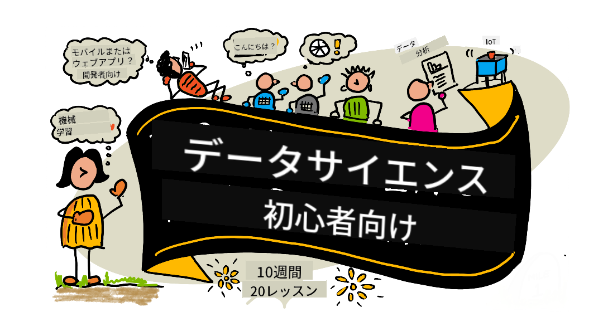

<!--
CO_OP_TRANSLATOR_METADATA:
{
  "original_hash": "278a30661fe9f10afd81dea999adc63a",
  "translation_date": "2025-12-21T10:43:46+00:00",
  "source_file": "README.md",
  "language_code": "ja"
}
-->
# 初心者のためのデータサイエンス - カリキュラム

MicrosoftのAzure Cloud Advocatesは、データサイエンスに関する10週間・20レッスンのカリキュラムを提供できることを嬉しく思います。各レッスンには、事前・事後のクイズ、レッスンを完了するための文章による指示、解答例、課題が含まれます。プロジェクトベースの教授法により、作りながら学ぶことで新しいスキルが定着しやすくなります。

**執筆者の皆様に心から感謝します：** [Jasmine Greenaway](https://www.twitter.com/paladique), [Dmitry Soshnikov](http://soshnikov.com), [Nitya Narasimhan](https://twitter.com/nitya), [Jalen McGee](https://twitter.com/JalenMcG), [Jen Looper](https://twitter.com/jenlooper), [Maud Levy](https://twitter.com/maudstweets), [Tiffany Souterre](https://twitter.com/TiffanySouterre), [Christopher Harrison](https://www.twitter.com/geektrainer).

**🙏 特別な謝辞 🙏 [Microsoft Student Ambassador](https://studentambassadors.microsoft.com/) の執筆者、レビュアー、コンテンツ寄稿者の皆様へ、** 特に Aaryan Arora, [Aditya Garg](https://github.com/AdityaGarg00), [Alondra Sanchez](https://www.linkedin.com/in/alondra-sanchez-molina/), [Ankita Singh](https://www.linkedin.com/in/ankitasingh007), [Anupam Mishra](https://www.linkedin.com/in/anupam--mishra/), [Arpita Das](https://www.linkedin.com/in/arpitadas01/), ChhailBihari Dubey, [Dibri Nsofor](https://www.linkedin.com/in/dibrinsofor), [Dishita Bhasin](https://www.linkedin.com/in/dishita-bhasin-7065281bb), [Majd Safi](https://www.linkedin.com/in/majd-s/), [Max Blum](https://www.linkedin.com/in/max-blum-6036a1186/), [Miguel Correa](https://www.linkedin.com/in/miguelmque/), [Mohamma Iftekher (Iftu) Ebne Jalal](https://twitter.com/iftu119), [Nawrin Tabassum](https://www.linkedin.com/in/nawrin-tabassum), [Raymond Wangsa Putra](https://www.linkedin.com/in/raymond-wp/), [Rohit Yadav](https://www.linkedin.com/in/rty2423), Samridhi Sharma, [Sanya Sinha](https://www.linkedin.com/mwlite/in/sanya-sinha-13aab1200),
[Sheena Narula](https://www.linkedin.com/in/sheena-narua-n/), [Tauqeer Ahmad](https://www.linkedin.com/in/tauqeerahmad5201/), Yogendrasingh Pawar , [Vidushi Gupta](https://www.linkedin.com/in/vidushi-gupta07/), [Jasleen Sondhi](https://www.linkedin.com/in/jasleen-sondhi/)

||
|:---:|
| 初心者のためのデータサイエンス - _スケッチノート by [@nitya](https://twitter.com/nitya)_ |

### 🌐 多言語サポート

#### GitHub Actionによるサポート（自動かつ常に最新）

<!-- CO-OP TRANSLATOR LANGUAGES TABLE START -->
[アラビア語](../ar/README.md) | [ベンガル語](../bn/README.md) | [ブルガリア語](../bg/README.md) | [ビルマ語（ミャンマー）](../my/README.md) | [中国語（簡体字）](../zh/README.md) | [中国語（繁体字・香港）](../hk/README.md) | [中国語（繁体字・マカオ）](../mo/README.md) | [中国語（繁体字・台湾）](../tw/README.md) | [クロアチア語](../hr/README.md) | [チェコ語](../cs/README.md) | [デンマーク語](../da/README.md) | [オランダ語](../nl/README.md) | [エストニア語](../et/README.md) | [フィンランド語](../fi/README.md) | [フランス語](../fr/README.md) | [ドイツ語](../de/README.md) | [ギリシャ語](../el/README.md) | [ヘブライ語](../he/README.md) | [ヒンディー語](../hi/README.md) | [ハンガリー語](../hu/README.md) | [インドネシア語](../id/README.md) | [イタリア語](../it/README.md) | [日本語](./README.md) | [カンナダ語](../kn/README.md) | [韓国語](../ko/README.md) | [リトアニア語](../lt/README.md) | [マレー語](../ms/README.md) | [マラヤーラム語](../ml/README.md) | [マラーティー語](../mr/README.md) | [ネパール語](../ne/README.md) | [ナイジェリア・ピジン語](../pcm/README.md) | [ノルウェー語](../no/README.md) | [ペルシア語（ファルシ）](../fa/README.md) | [ポーランド語](../pl/README.md) | [ポルトガル語（ブラジル）](../br/README.md) | [ポルトガル語（ポルトガル）](../pt/README.md) | [パンジャブ語（グルムキー）](../pa/README.md) | [ルーマニア語](../ro/README.md) | [ロシア語](../ru/README.md) | [セルビア語（キリル文字）](../sr/README.md) | [スロバキア語](../sk/README.md) | [スロベニア語](../sl/README.md) | [スペイン語](../es/README.md) | [スワヒリ語](../sw/README.md) | [スウェーデン語](../sv/README.md) | [タガログ語（フィリピン）](../tl/README.md) | [タミル語](../ta/README.md) | [テルグ語](../te/README.md) | [タイ語](../th/README.md) | [トルコ語](../tr/README.md) | [ウクライナ語](../uk/README.md) | [ウルドゥー語](../ur/README.md) | [ベトナム語](../vi/README.md)
<!-- CO-OP TRANSLATOR LANGUAGES TABLE END -->

**追加の翻訳を希望する場合、対応言語は[こちら](https://github.com/Azure/co-op-translator/blob/main/getting_started/supported-languages.md)に記載されています**

#### コミュニティに参加する 

現在、Discordで「Learn with AI」シリーズを開催しています。詳細と参加は2025年9月18日〜30日に[Learn with AI Series](https://aka.ms/learnwithai/discord)へ。Data ScienceでGitHub Copilotを活用するためのコツやティップスが得られます。

# あなたは学生ですか？

以下のリソースから始めましょう：

- [Student Hub page](https://docs.microsoft.com/en-gb/learn/student-hub?WT.mc_id=academic-77958-bethanycheum) このページでは、初心者向けリソース、学生向けパック、および無料の認定バウチャーを取得する方法などが見つかります。コンテンツは少なくとも月単位で入れ替わるため、このページをブックマークして時々確認することをおすすめします。
- [Microsoft Learn Student Ambassadors](https://studentambassadors.microsoft.com?WT.mc_id=academic-77958-bethanycheum) 学生大使のグローバルコミュニティに参加しましょう。これがMicrosoftへの道になるかもしれません。

# はじめに

## 📚 ドキュメント

- **[インストールガイド](INSTALLATION.md)** - 初心者向けのステップバイステップのセットアップ手順
- **[使用ガイド](USAGE.md)** - 例と一般的なワークフロー
- **[トラブルシューティング](TROUBLESHOOTING.md)** - よくある問題の解決方法
- **[コントリビューションガイド](CONTRIBUTING.md)** - このプロジェクトへの貢献方法
- **[教師向け](for-teachers.md)** - 教育の指針と教室向けリソース

## 👨‍🎓 学生向け
> **完全な初心者**: データサイエンスが初めてですか？まずは[初心者向けの例](examples/README.md)から始めましょう！これらの簡単でコメント付きの例は、カリキュラム全体に入る前に基本を理解するのに役立ちます。
> **[学生向け](https://aka.ms/student-page)**: このカリキュラムを自分で使うには、リポジトリ全体をフォークして、講義前クイズから始めて演習を自分で完了してください。その後講義を読み、残りのアクティビティを完了します。解答コードをコピーするのではなく、レッスンを理解してプロジェクトを作成するように努めてください。ただし、そのコードは各プロジェクト指向のレッスン内の /solutions フォルダーにあります。別の案として、友人と学習グループを作り、一緒にコンテンツを進めることもできます。さらなる学習には[Microsoft Learn](https://docs.microsoft.com/en-us/users/jenlooper-2911/collections/qprpajyoy3x0g7?WT.mc_id=academic-77958-bethanycheum)をお勧めします。

**クイックスタート:**
1. 環境を設定するには[インストールガイド](INSTALLATION.md)を確認してください
2. カリキュラムの使い方を学ぶには[使用ガイド](USAGE.md)を参照してください
3. レッスン1から始めて順に進めてください
4. サポートのために[Discordコミュニティ](https://aka.ms/ds4beginners/discord)に参加してください

## 👩‍🏫 教師向け

> **教師の皆様**: このカリキュラムの使い方について[いくつかの提案](for-teachers.md)を含めています。フィードバックを[ディスカッションフォーラム](https://github.com/microsoft/Data-Science-For-Beginners/discussions)でお寄せください！

## チーム紹介

**Gif 作成者** [Mohit Jaisal](https://www.linkedin.com/in/mohitjaisal)
> 🎥 上の画像をクリックすると、このプロジェクトの動画を、  作成した人々について見ることができます！

## 教育方針

このカリキュラムを作るにあたり、プロジェクトベースであることと、頻繁なクイズを含むこと、という2つの教育方針を採用しました。このシリーズを終えるまでに、受講者はデータサイエンスの基本原則（倫理的概念、データ準備、データのさまざまな扱い方、データ可視化、データ分析、データサイエンスの実世界でのユースケースなど）を学びます。

さらに、授業前の低リスクなクイズは学生の学習への意図づけになり、授業後の2回目のクイズは定着を促します。このカリキュラムは柔軟で楽しく受講できるよう設計されており、全体または一部で受講できます。プロジェクトは小さく始まり、10週間のサイクルの終わりには徐々に複雑になります。

> 私たちの [行動規範](CODE_OF_CONDUCT.md), [貢献ガイドライン](CONTRIBUTING.md),  [翻訳ガイドライン](TRANSLATIONS.md) をご覧ください。建設的なフィードバックを歓迎します！

## Each lesson includes:

- 任意のスケッチノート
- 任意の補助動画
- レッスン前のウォームアップクイズ
- 文書によるレッスン
- プロジェクトベースのレッスンでは、プロジェクトを構築するためのステップバイステップガイド
- 知識チェック
- チャレンジ
- 補足資料
- 課題
- [レッスン後のクイズ](https://ff-quizzes.netlify.app/en/)

> **クイズについての注意**: すべてのクイズは Quiz-App フォルダーに含まれており、合計で 40 個のクイズがあり、それぞれ 3 問あります。クイズはレッスン内からリンクされていますが、クイズアプリはローカルで実行するか Azure にデプロイできます。`quiz-app` フォルダーの指示に従ってください。クイズは徐々にローカライズされています。

## 🎓 初心者向けの例

**データサイエンスが初めてですか？** 開始を助ける、簡単でコメントが丁寧なコードを含む特別な [examples ディレクトリ](examples/README.md) を作成しました:

- 🌟 **Hello World** - あなたの最初のデータサイエンスプログラム
- 📂 **Loading Data** - データセットの読み込みと探索を学ぶ
- 📊 **Simple Analysis** - 統計を計算してパターンを見つける
- 📈 **Basic Visualization** - チャートやグラフを作成する
- 🔬 **Real-World Project** - 最初から最後までのワークフローを完了する

各例には各ステップを説明する詳細なコメントが含まれており、完全な初心者に最適です！

👉 **[examples から始める](examples/README.md)** 👈

## Lessons

||
|:---:|
| 初心者のためのデータサイエンス: ロードマップ - _スケッチノート作成: [@nitya](https://twitter.com/nitya)_ |

| レッスン番号 | トピック | レッスングループ | 学習目標 | 関連レッスン | 著者 |
| :-----------: | :----------------------------------------: | :--------------------------------------------------: | :-----------------------------------------------------------------------------------------------------------------------------------------------------------------------: | :---------------------------------------------------------------------: | :----: |
| 01 | データサイエンスの定義 | [Introduction](1-Introduction/README.md) | データサイエンスの基本概念と、それが人工知能、機械学習、ビッグデータとどのように関連しているかを学びます。 | [レッスン](1-Introduction/01-defining-data-science/README.md) [ビデオ](https://youtu.be/beZ7Mb_oz9I) | [Dmitry](http://soshnikov.com) |
| 02 | データサイエンスの倫理 | [Introduction](1-Introduction/README.md) | データ倫理の概念、課題、フレームワーク。 | [レッスン](1-Introduction/02-ethics/README.md) | [Nitya](https://twitter.com/nitya) |
| 03 | データの定義 | [Introduction](1-Introduction/README.md) | データがどのように分類され、一般的なソースは何か。 | [レッスン](1-Introduction/03-defining-data/README.md) | [Jasmine](https://www.twitter.com/paladique) |
| 04 | 統計学と確率論の入門 | [Introduction](1-Introduction/README.md) | データを理解するための確率と統計の数学的手法。 | [レッスン](1-Introduction/04-stats-and-probability/README.md) [ビデオ](https://youtu.be/Z5Zy85g4Yjw) | [Dmitry](http://soshnikov.com) |
| 05 | リレーショナルデータの扱い | [Working With Data](2-Working-With-Data/README.md) | リレーショナルデータの入門と、Structured Query Language（SQL、発音は“see-quell”）を使ったリレーショナルデータの探索と分析の基本。 | [レッスン](2-Working-With-Data/05-relational-databases/README.md) | [Christopher](https://www.twitter.com/geektrainer) | | |
| 06 | NoSQLデータの扱い | [Working With Data](2-Working-With-Data/README.md) | 非リレーショナルデータの入門、その各種タイプおよびドキュメントデータベースの探索と分析の基本。 | [レッスン](2-Working-With-Data/06-non-relational/README.md) | [Jasmine](https://twitter.com/paladique)|
| 07 | Pythonの扱い | [Working With Data](2-Working-With-Data/README.md) | Pandasなどのライブラリを用いたデータ探索のためのPythonの基本。Pythonプログラミングの基礎理解を推奨。 | [レッスン](2-Working-With-Data/07-python/README.md) [ビデオ](https://youtu.be/dZjWOGbsN4Y) | [Dmitry](http://soshnikov.com) |
| 08 | データ準備 | [Working With Data](2-Working-With-Data/README.md) | 欠損、不正確、または不完全なデータの課題に対処するための、データのクレンジングや変換に関する技術。 | [レッスン](2-Working-With-Data/08-data-preparation/README.md) | [Jasmine](https://www.twitter.com/paladique) |
| 09 | 量の可視化 | [Data Visualization](3-Data-Visualization/README.md) | Matplotlibを使って鳥データを可視化する方法を学ぶ 🦆 | [レッスン](3-Data-Visualization/09-visualization-quantities/README.md) | [Jen](https://twitter.com/jenlooper) |
| 10 | データの分布の可視化 | [Data Visualization](3-Data-Visualization/README.md) | 区間内の観測値と傾向を可視化する。 | [レッスン](3-Data-Visualization/10-visualization-distributions/README.md) | [Jen](https://twitter.com/jenlooper) |
| 11 | 割合の可視化 | [Data Visualization](3-Data-Visualization/README.md) | 離散およびグループ化されたパーセンテージを可視化する。 | [レッスン](3-Data-Visualization/11-visualization-proportions/README.md) | [Jen](https://twitter.com/jenlooper) |
| 12 | 関係の可視化 | [Data Visualization](3-Data-Visualization/README.md) | データセットやその変数間の結びつきや相関を可視化する。 | [レッスン](3-Data-Visualization/12-visualization-relationships/README.md) | [Jen](https://twitter.com/jenlooper) |
| 13 | 有意義な可視化 | [Data Visualization](3-Data-Visualization/README.md) | 問題解決やインサイトに役立つ価値ある可視化のテクニックとガイダンス。 | [レッスン](3-Data-Visualization/13-meaningful-visualizations/README.md) | [Jen](https://twitter.com/jenlooper) |
| 14 | データサイエンスライフサイクルの入門 | [Lifecycle](4-Data-Science-Lifecycle/README.md) | データサイエンスライフサイクルとその最初のステップであるデータの取得と抽出の紹介。 | [レッスン](4-Data-Science-Lifecycle/14-Introduction/README.md) | [Jasmine](https://twitter.com/paladique) |
| 15 | 分析 | [Lifecycle](4-Data-Science-Lifecycle/README.md) | このフェーズは、データを分析するための手法に焦点を当てます。 | [レッスン](4-Data-Science-Lifecycle/15-analyzing/README.md) | [Jasmine](https://twitter.com/paladique) | | |
| 16 | コミュニケーション | [Lifecycle](4-Data-Science-Lifecycle/README.md) | このフェーズは、意思決定者が理解しやすいようにデータからのインサイトを提示することに焦点を当てます。 | [レッスン](4-Data-Science-Lifecycle/16-communication/README.md) | [Jalen](https://twitter.com/JalenMcG) | | |
| 17 | クラウドにおけるデータサイエンス | [Cloud Data](5-Data-Science-In-Cloud/README.md) | このシリーズのレッスンはクラウドでのデータサイエンスとその利点を紹介します。 | [レッスン](5-Data-Science-In-Cloud/17-Introduction/README.md) | [Tiffany](https://twitter.com/TiffanySouterre) and [Maud](https://twitter.com/maudstweets) |
| 18 | クラウドにおけるデータサイエンス | [Cloud Data](5-Data-Science-In-Cloud/README.md) | ローコードツールを用いたモデルのトレーニング。 |[レッスン](5-Data-Science-In-Cloud/18-Low-Code/README.md) | [Tiffany](https://twitter.com/TiffanySouterre) and [Maud](https://twitter.com/maudstweets) |
| 19 | クラウドにおけるデータサイエンス | [Cloud Data](5-Data-Science-In-Cloud/README.md) | Azure Machine Learning Studio を用いたモデルのデプロイ。 | [レッスン](5-Data-Science-In-Cloud/19-Azure/README.md)| [Tiffany](https://twitter.com/TiffanySouterre) and [Maud](https://twitter.com/maudstweets) |
| 20 | 実世界でのデータサイエンス | [In the Wild](6-Data-Science-In-Wild/README.md) | 実世界のデータサイエンス駆動プロジェクト。 | [レッスン](6-Data-Science-In-Wild/20-Real-World-Examples/README.md) | [Nitya](https://twitter.com/nitya) |

## GitHub Codespaces

Follow these steps to open this sample in a Codespace:
1. Code ドロップダウンメニューをクリックして、Open with Codespaces オプションを選択します。
2. パネルの下部で + New codespace を選択します。
For more info, check out the [GitHub ドキュメント](https://docs.github.com/en/codespaces/developing-in-codespaces/creating-a-codespace-for-a-repository#creating-a-codespace).

## VSCode Remote - Containers
Follow these steps to open this repo in a container using your local machine and VSCode using  the VS Code Remote - Containers extension:

1. If this is your first time using a development container, please ensure your system meets the pre-reqs (i.e. have Docker installed) in [the getting started documentation](https://code.visualstudio.com/docs/devcontainers/containers#_getting-started).

To use this repository, you can either open the repository in an isolated Docker volume:

**Note**: Under the hood, this will use the Remote-Containers: **Clone Repository in Container Volume...** command to clone the source code in a Docker volume instead of the local filesystem. [Volumes](https://docs.docker.com/storage/volumes/) are the preferred mechanism for persisting container data.

Or open a locally cloned or downloaded version of the repository:

- Clone this repository to your local filesystem.
- Press F1 and select the **Remote-Containers: Open Folder in Container...** command.
- Select the cloned copy of this folder, wait for the container to start, and try things out.

## Offline access

You can run this documentation offline by using [Docsify](https://docsify.js.org/#/). Fork this repo, [install Docsify](https://docsify.js.org/#/quickstart) on your local machine,  then in the root folder of this repo, type `docsify serve`. The website will be served on port 3000 on your localhost: `localhost:3000`.

> 注: ノートブックは Docsify ではレンダリングされないため、ノートブックを実行する必要がある場合は、VS Code で Python カーネルを使って別途実行してください。

## Other Curricula

Our team produces other curricula! Check out:

<!-- CO-OP TRANSLATOR OTHER COURSES START -->
### LangChain

---

### Azure / Edge / MCP / Agents

---
 
### 生成AIシリーズ

[-9333EA?style=for-the-badge&labelColor=E5E7EB&color=9333EA)](https://github.com/microsoft/Generative-AI-for-beginners-dotnet?WT.mc_id=academic-105485-koreyst)
[-C084FC?style=for-the-badge&labelColor=E5E7EB&color=C084FC)](https://github.com/microsoft/generative-ai-for-beginners-java?WT.mc_id=academic-105485-koreyst)
[-E879F9?style=for-the-badge&labelColor=E5E7EB&color=E879F9)](https://github.com/microsoft/generative-ai-with-javascript?WT.mc_id=academic-105485-koreyst)

---
 
### 基礎学習

---
 
### Copilot シリーズ

<!-- CO-OP TRANSLATOR OTHER COURSES END -->

## ヘルプ

**問題が発生していますか？** Check our [トラブルシューティングガイド](TROUBLESHOOTING.md) for solutions to common problems.

If you get stuck or have any questions about building AI apps. Join fellow learners and experienced developers in discussions about MCP. It's a supportive community where questions are welcome and knowledge is shared freely.

If you have product feedback or errors while building visit:

---

<!-- CO-OP TRANSLATOR DISCLAIMER START -->
免責事項：
本書は AI 翻訳サービス「Co‑op Translator」(https://github.com/Azure/co-op-translator) を使用して翻訳されました。正確性の確保に努めていますが、自動翻訳には誤りや不正確な箇所が含まれる可能性があることにご留意ください。原文（原語で記載された文書）が最終的な権威ある出典と見なされるべきです。重要な情報については、専門の翻訳者による翻訳を推奨します。本翻訳の利用により生じたいかなる誤解や解釈の相違についても、当社は一切の責任を負いません。
<!-- CO-OP TRANSLATOR DISCLAIMER END -->