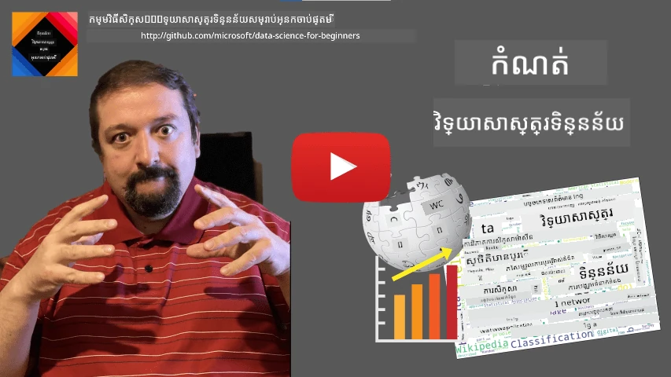
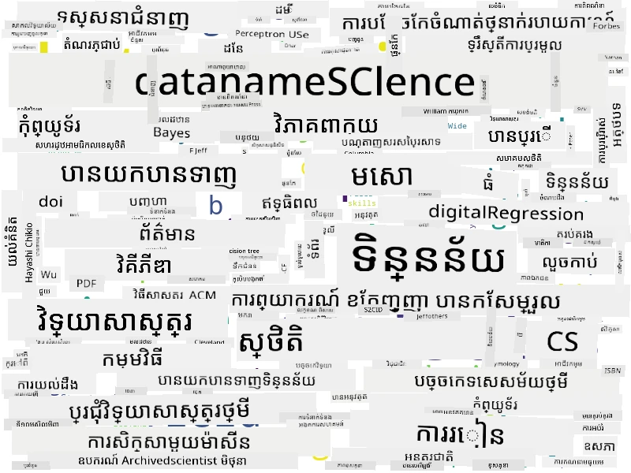

# ការកំណត់វិទ្យាសាស្ត្រទិន្នន័យ

|  ](../../sketchnotes/01-Definitions.png) |
| :----------------------------------------------------------------------------------------------------: |
|              ការកំណត់វិទ្យាសាស្ត្រទិន្នន័យ - _Sketchnote ដោយ [@nitya](https://twitter.com/nitya)_               |

---

## [Pre-lecture quiz](https://ff-quizzes.netlify.app/en/ds/quiz/0)

## តើទិន្នន័យជាអ្វី?

នៅក្នុងជីវិតប្រចាំថ្ងៃរបស់យើង យើងតែងតែជុំវិញដោយទិន្នន័យ។ អត្ថបទដែលអ្នកកំពុងអានឥឡូវនេះគឺជាទិន្នន័យ។ បញ្ជីលេខទូរសព្ទ័របស់មិត្តភក្តិរបស់អ្នកនៅក្នុងស្មាតហ្វូនរបស់អ្នកគឺជាទិន្នន័យ ដូចជាឥឡូវនេះម៉ោងបង្ហាញនៅលើនาฬិការបស់អ្នកផងដែរ។ ជាមនុស្ស យើងធម្មតាជាមួយទិន្នន័យដោយរាប់ប្រាក់ដែលយើងមាន ឬដោយសរសេរពីសំបុត្រទៅមិត្តភក្តិរបស់យើង។

ទោះយ៉ាងណា ទិន្នន័យមានសារៈសំខាន់បន្ថែមឡើងជាងមុនជាមួយការបង្កើតកុំព្យូទ័រ។ តួនាទីសំខាន់របស់កុំព្យូទ័រគឺបំពេញការគណនា ប៉ុន្តែកុំព្យូទ័រត្រូវការទិន្នន័យដើម្បីដំណើរការ។ ដូចនេះ យើងត្រូវយល់ពីរបៀបដែលកុំព្យូទ័រផ្ទុក និងដំណើរការទិន្នន័យ។

ជាមួយការកើតមាននៃអ៊ិនធឺណេត តួនាទីរបស់កុំព្យូទ័រជាឧបករណ៍ដំណើរការទិន្នន័យក៏បានកើនឡើង។ ប្រសិនបើអ្នកគិតពីវា ឥឡូវនេះយើងប្រើកុំព្យូទ័រច្រើន និងច្រើនសម្រាប់ដំណើរការទិន្នន័យ និងការទំនាក់ទំនង មិនមែនគឺការគណនាពិតប្រាកដទេ។ ពេលយើងសរសេរ​អ៊ីមែលទៅមិត្តភក្តិ ឬស្វែងរកព័ត៌មានមួយនៅលើអ៊ិនធឺណេត - យើងគឺកំពុងបង្កើត ផ្ទុក ផ្ទេរ និងដំណើរការទិន្នន័យ។
> តើអ្នកអាចចងចាំពេលចុងក្រោយដែលអ្នកបានប្រើកុំព្យូទ័រដើម្បីគណនារឿងមួយបានទេ?

## តើវិទ្យាសាស្ត្រទិន្នន័យជាអ្វី?

នៅក្នុង [វិគីភីឌា](https://en.wikipedia.org/wiki/Data_science), **វិទ្យាសាស្ត្រទិន្នន័យ** ត្រូវបានកំណត់ជា *វិស័យវិទ្យាសាស្ត្រមួយដែលប្រើវិធីសាស្ត្រវិទ្យាសាស្រ្តដើម្បីដាក់ទិន្នន័យដែលមានរចនាសម្ព័ន្ធនិងគ្មានរចនាសម្ព័ន្ធ ដើម្បីទាញយកចំណេះដឹង និងការយល់ដឹង និងអនុវត្តចំណេះដឹង និងការយល់ដឹងដែលអាចអនុវត្តបានពីទិន្នន័យ នៅក្នុងវិស័យអនុវត្តន៍ជាច្រើន*។

ការកំណត់នេះបង្ហាញនូវមុខមាត់សំខាន់ៗដូចខាងក្រោមនៃវិទ្យាសាស្ត្រទិន្នន័យ៖

* គោលដៅសំខាន់នៃវិទ្យាសាស្ត្រទិន្នន័យគឺ **ទាញយកចំណេះដឹង** ពីទិន្នន័យ ឬថា - **យល់ពី** ទិន្នន័យ រកឃើញពាណិជ្ជកម្មលាក់ខ្លួន និងកសាង **ម៉ូឌែល**។
* វិទ្យាសាស្ត្រទិន្នន័យប្រើ **វិធីសាស្ត្រវិទ្យាសាស្ត្រ** ដូចជាភាពហានិភ័យ និងស្ថិតិយវិទ្យា។ ពិតណាស់ ពេលដែលពាក្យ *វិទ្យាសាស្ត្រទិន្នន័យ* ត្រូវបានណែនាំជាលើកដំបូង មានមនុស្សខ្លះបានជជែកថាវីទ្យាសាស្ត្រទិន្នន័យគ្រាន់តែជាឈ្មោះថ្មីសម្រាប់ស្ថិតិយវិទ្យា។ ប៉ុន្តែកាលពីពេលបច្ចុប្បន្ន វាបានជាក់លាក់ថាវិស័យនេះធំបំផុត។
* ចំណេះដឹងដែលទទួលបានគួរត្រូវបានអនុវត្តដើម្បីផលិតជាការយល់ដឹងដែលអាចអនុវត្តបាន ប្រសិនបើមានគឺជាការយល់ដឹងប្រតិបត្តិដែលអ្នកអាចប្រើបានក្នុងស្ថានភាពអាជីវកម្មពិត។
* យើងគួរតែអាចដំណើរការជាមួយទាំងទិន្នន័យដែលមាន **រចនាសម្ព័ន្ធ** និង **គ្មានរចនាសម្ព័ន្ធ**។ យើងនឹងត្រឡប់មកពិភាក្សាអំពីប្រភេទទិន្នន័យផ្សេងៗនៅពេលក្រោយក្នុងវគ្គសិក្សា។
* **ដែនអនុវត្តន៍** គឺជាគំនិតសំខាន់មួយ ហើយអ្នកវិទ្យាសាស្ត្រទិន្នន័យភាគច្រើនត្រូវការមានវាយនភាពខ្លះបំផុតក្នុងដែនបញ្ហា ឧទាហរណ៍៖ ហិរញ្ញវត្ថុ វេជ្ជសាស្ត្រ ឬទីផ្សារ។

> មុខមាត់សំខាន់មួយទៀតនៃវិទ្យាសាស្ត្រទិន្នន័យ គឺវាសិក្សារបៀបដែលទិន្នន័យអាចត្រូវបានប្រមូល ផ្ទុក និងដំណើរការដោយប្រើកុំព្យូទ័រ។ ខណៈដែលស្ថិតិយវិទ្យាប្រគល់មូលដ្ឋានគណិតវិទ្យា វិទ្យាសាស្ត្រទិន្នន័យនាំយកគំនិតគណិតវិទ្យាដើម្បីទាញយកចំណេះដឹងពីទិន្នន័យមែន។

វិធីមួយ (ដែលមានមូលដ្ឋានពី [Jim Gray](https://en.wikipedia.org/wiki/Jim_Gray_(computer_scientist))) ដើម្បីមើលវិទ្យាសាស្ត្រទិន្នន័យគឺជាវិធីសាស្ត្រផ្សេងទៀតនៃវិទ្យាសាស្ត្រ៖
* **ការពិសោធន៍ផ្ទាល់ (Empirical)** ដែលយើងផ្អែកគ្រប់គ្នាសម្រាប់ការសង្កេត និងលទ្ធផលនៃសាកល្បង។
* **ទ្រឹស្តី (Theoretical)** ដែលយើងបង្កើតគំនិតថ្មីពីចំណេះដឹងវិទ្យាសាស្ត្រមានស្រាប់។
* **កុំព្យូទិក (Computational)** ដែលយើងរកឃើញគោលការណ៍ថ្មីៗដោយផ្អែកលើការសាកល្បងកុំព្យូទិក។
* **មូលដ្ឋានទិន្នន័យ (Data-Driven)** ដែលផ្អែកលើការរកឃើញទំនាក់ទំនង និងគំរូទិន្នន័យ។

## វិស័យទាក់ទងផ្សេងទៀត

ដោយសារតែទិន្នន័យមាននៅគ្រប់ទីកន្លែង យ៉ាងហោចណាស់វិទ្យាសាស្ត្រទិន្នន័យផ្ទាល់ខ្លួនក៏ជាវិស័យធំបែបធំ ដែលប៉ះពាល់ដល់វិស័យផ្សេងៗជាច្រើន។

<dl>
<dt>មូលដ្ឋានទិន្នន័យ (Databases)</dt>
<dd>
ការបញ្ចូនចិត្តសំខាន់គឺ <b>របៀបផ្ទុក</b> ទិន្នន័យ វានៅក្នុងរូបមន្តណាមួយដែលអាចដំណើរការបានយ៉ាងលឿន។ មានប្រភពមូលដ្ឋានទិន្នន័យផ្សេងៗដែលផ្ទុកទិន្នន័យមានរចនាសម្ព័ន្ធ និងគ្មានរចនាសម្ព័ន្ធ ដែល <a href="../../2-Working-With-Data/README.md">យើងនឹងពិចារណាក្នុងវគ្គសិក្សារបស់យើង</a>។
</dd>
<dt>ទិន្នន័យធំ (Big Data)</dt>
<dd>
ម្តងម្ដែង យើងត្រូវរក្សាទិន្នន័យច្រើនខ្លាំងក្នុងរចនាសម្ព័ន្ធសាមញ្ញ។ មានវិធីសាស្ត្រ និងឧបករណ៍ពិសេសដើម្បីទុកទិន្នន័យនោះលើកុំព្យូទ័រច្រើនប្រព្រឹត្តទៅ ហើយដំណើរការយ៉ាងមានប្រសិទ្ធភាព។
</dd>
<dt>ការរៀនម៉ាស៊ីន (Machine Learning)</dt>
<dd>
វិធីដើម្បីយល់ពីទិន្នន័យគឺ <b>កសាងម៉ូឌែល</b> ដែលអាចព្យាករណ៍លទ្ធផលដែលចង់បាន។ ការបង្កើតម៉ូឌែលពីទិន្នន័យហៅថា <b>ការរៀនម៉ាស៊ីន</b>។ អ្នកអាចចង់មើលប្រមុខមុខវិជ្ជា <a href="https://aka.ms/ml-beginners">Machine Learning for Beginners</a> ដើម្បីរៀនបន្ថែម។
</dd>
<dt>បញ្ញាសិប្បនិម្មិត (Artificial Intelligence)</dt>
<dd>
វិស័យមួយនៃការរៀនម៉ាស៊ីនគឺបញ្ញាសិប្បនិម្មិត (AI) ក៏ផ្អែកលើទិន្នន័យ ហើយវាអំពាវនាវការកសាងម៉ូឌែលស្មុគស្មាញខ្ពស់ដូចជាគំនិតគិតរបស់មនុស្ស។ វិធីសាស្ត្រ AI ជាញឹកញាប់អនុញ្ញាតឲ្យយើងបម្លែងទិន្នន័យគ្មានរចនាសម្ព័ន្ធ (ដូចជាភាសាជាតិត្រង់) ទៅជាការយល់ដឹងដែលមានរចនាសម្ព័ន្ធ។
</dd>
<dt>ការតំណាងទិន្នន័យ (Visualization)</dt>
<dd>
ទិន្នន័យច្រើនធំទូលាយលំបាកយល់សម្រាប់មនុស្ស ប៉ុន្តិប៉ុន្មានពេលដែលយើងបង្កើតការតំណាងប្រយោជន៍ពីទិន្នន័យនោះ យើងអាចយល់បានល្អប្រសើរពីទិន្នន័យ និងធ្វើចំណាំកំណត់សម្រេច។ ដូច្នេះ វាសំខាន់ក្នុងការដឹងពីវិធីសាស្ត្រច្រើនក្នុងការតំណាងព័ត៌មាន - អ្វីដែលយើងនឹងពិភាក្សានៅ <a href="../../3-Data-Visualization/README.md">ផ្នែក 3</a> នៃវគ្គសិក្សារបស់យើង។ វិស័យទាក់ទងផ្សេងទៀតរួមមាន <b>Infographics</b> និង <b>Human-Computer Interaction</b> ទូទៅ។
</dd>
</dl>

## ប្រភេទទិន្នន័យ

ដូចដែលយើងបានរៀបរាប់រួចមកទេ ទិន្នន័យមាននៅគ្រប់ទីកន្លែង។ យើងតែត្រូវចាប់យកវាតាមរបៀបត្រឹមត្រូវ! វាជាគន្លងមានប្រយោជន៍ក្នុងការបែងចែកទិន្នន័យជា **មានរចនាសម្ព័ន្ធ** និង **គ្មានរចនាសម្ព័ន្ធ**។ ប្រភេទមុនសំដៅលើទម្រង់ដែលមានរចនាសម្ព័ន្ធល្អ ជាទូទៅជាតារាង ឬចំនួនតារាង ខណៈដែលប្រភេទក្រោយគ្រាន់តែជាការប្រមូលផ្គុំឯកសារ។ ពេលខ្លះវានៅមានចំណែកជា **ឆ្វេងតាំងរចនាសម្ព័ន្ធ** ដែលមានរចនាសម្ព័ន្ធមួយណាមួយដែលអាចខុសគ្នាខ្លាំង។

| មានរចនាសម្ព័ន្ធ                                                                   | ឆ្វេងតាំងរចនាសម្ព័ន្ធ                                                                                 | គ្មានរចនាសម្ព័ន្ធ                            |
| ---------------------------------------------------------------------------- | ---------------------------------------------------------------------------------------------- | --------------------------------------- |
| បញ្ជីមនុស្សជាមួយលេខទូរសព្ទ័ររបស់ពួកគេ                                       | ទំព័រវិគីភីឌាជាមួយតំណភ្ជាប់                                                                     | អត្ថបទព្រះរាជាណាចក្រអង់គ្លេស Britannica        |
| សីតុន្ថាននៅក្នុងបន្ទប់ទាំងអស់នៃអាគារទាំងមូលក្នុងមួយនាទីសម្រាប់រយៈពេល 20 ឆ្នាំចុងក្រោយ | ប្រមូលផ្តុំអត្ថបទវិទ្យាសាស្ត្រជាទម្រង់ JSON មានអ្នកនិពន្ធ ថ្ងៃខែឆ្នាំផ្សាយ និងសេចក្ដីសង្ខេប           | ការចែករំលែកឯកសារជាមួយឯកសារពាណិជ្ជកម្ម     |
| ទិន្នន័យអាយុ និងស្រី ភេទរបស់មនុស្សទាំងអស់ដែលចូលទៅក្នុងអាគារ                  | ទំព័រអ៊ិនធឺណេត                                                                                 | វីដេអូធម្មជាតិពីកាមេរ៉ាស្ងោចរក្សា |

## ទីតាំងទាញទិន្នន័យ

មានប្រភពទិន្នន័យជាច្រើន ហើយវានឹងមិនអាចរាប់បញ្ចូលគ្រប់អ្វីបានទេ! ទោះបីជាយ៉ាងណា យើងនឹងរាយបញ្ជីពីកន្លែងធម្មតាដែលអ្នកអាចទាញយកទិន្នន័យ៖

* **មានរចនាសម្ព័ន្ធ**
  - **Internet of Things** (IoT) រួមមានទិន្នន័យពីឧបករណ៍ស័ង្កសម្រាប់តាមដានផ្សេងៗ ដូចជាសវន្តុភាពឬសម្ពាធផ្តល់នូវទិន្នន័យដែលមានប្រយោជន៍។ ឧទាហរណ៍ បើស្ថាបនាការិយាល័យមានឧបករណ៍ IoT យើងអាចគ្រប់គ្រងកម្តៅ និងការចាក់ភ្លើងដោយស្វ័យប្រវត្តិ ដើម្បីបន្ថយការចំណាយ។
  - **ការស្ទង់មតិ** ដែលយើងស្នើសុំអ្នកប្រើបញ្ចប់បន្ទាប់ពីការទិញ អូរឬបន្ទាប់ពីទស្សនាគេហទំព័រ។
  - **វិភាគអាកប្បកិរិយា** អាចជួយយើងយល់ថាអ្នកប្រើចូលរួមក្នុងគេហទំព័រយ៉ាងជ្រាលជ្រៅ និងហេតុផលធម្មតាសម្រាប់លាចាកចោលគេហទំព័រ។
* **គ្មានរចនាសម្ព័ន្ធ**
  - **អត្ថបទ** អាចជាផ្ទៃដីសម្បូរបែបនៃការយល់ដឹង ដូចជាពិន្ទុអារម្មណ៍សរុប ឬការទាញយកពាក្យគន្លឹះ និងន័យផ្ទាល់ខ្លួន។
  - **រូបភាព** ឬ **វីដេអូ** វីដេអូពីកាមេរ៉ាស្ងោចរក្សាអាចប្រើសម្រាប់វាស់វិញ្ញាណចរាចរណ៍លើផ្លូវ និងជូនដំណឹងអំពីចរាចរណ៍តំណក់ខ្លះ។
  - កំណត់ហេតុបម្រើគេហទំព័រ (**Logs**) អាចប្រើសម្រាប់យល់ថាតើទំព័រណានៃគេហទំព័រយើងត្រូវបានចូលមើលខ្ពស់បំផុត និងរយៈពេលប៉ុន្មាន។
* ឆ្វេងតាំងរចនាសម្ព័ន្ធ
  - ក្រាហ្វបណ្តាញសង្គមអាចជាផ្ទាំងប្រភពទិន្នន័យល្អសម្រាប់យល់អំពីបុគ្គលភាពអ្នកប្រើ និងប្រសិទ្ធភាពក្នុងការចែកចាយព័ត៌មាន។
  - ពេលយើងមានរូបថតជាច្រើនពីការប្រជុំ យើងអាចព្យាយាមទាញយកទិន្នន័យ​ **សារសំឡេងក្រុម** ដោយកសាងក្រាហ្វមនុស្សដែលថតរូបជាមួយគ្នា។

ដោយដឹងពីប្រភពទិន្នន័យផ្សេងៗ អ្នកអាចពិចារណាពីសេណារីយ៉ូផ្សេងៗដែលបច្ចេកទេសវិទ្យាសាស្ត្រទិន្នន័យអាចអនុវត្តបាន ដើម្បីយល់បរិបទល្អប្រសើរជាងមុន និងបង្កើនដើមថ្នល់អាជីវកម្ម។

## អ្នកអាចធ្វើអ្វីបានជាមួយទិន្នន័យ

ក្នុងវិទ្យាសាស្ត្រទិន្នន័យ យើងផ្តោតលើជំហានខាងក្រោមនៃការធ្វើដំណើរទិន្នន័យ៖

<dl>
<dt>១) ការប្រមូលទិន្នន័យ (Data Acquisition)</dt>
<dd>
ជំហានដំបូងគឺ ប្រមូលទិន្នន័យ។ បើសិនជាករណីជាច្រើន វាអាចជាព្រះបញ្ញាដំណើរការងាយស្រួល ដូចជាទិន្នន័យចេញពីកម្មវិធីវេបកម្ពុជទៅមូលដ្ឋានទិន្នន័យ ក៏ប៉ុន្តែនៅពេលខ្លះ យើងត្រូវប្រើវិធីសាស្ត្រពិសេស។ ឧទាហរណ៍ ទិន្នន័យពីឧបករណ៍ IoT អាចច្រើនខ្លាំង ហើយវាជារបៀបល្អក្នុងការប្រើបញ្ចប់ប៊ុហ្វឺរដូចជា IoT Hub ដើម្បីប្រមូលទិន្នន័យទាំងអស់មុនពេលដំណើរការបន្ថែម។
</dd>
<dt>២) ការផ្ទុកទិន្នន័យ (Data Storage)</dt>
<dd>
ការផ្ទុកទិន្នន័យអាចជាលំបាក ជាពិសេសប្រសិនបើយើងនិយាយអំពីទិន្នន័យធំ។ ពេលសម្រេចចិត្តពីរបៀបផ្ទុកទិន្នន័យ វាសមរម្យក្នុងការចាត់ទុករបៀបដែលអ្នកចង់សួរទិន្នន័យនៅថ្ងៃអនាគត។ មានវិធីច្រើនក្នុងការផ្ទុកទិន្នន័យ៖
<ul>
<li>មូលដ្ឋានទិន្នន័យទំនាក់ទំនងផ្ទុកកំណត់តាលាងមួយជាច្រើន ហើយប្រើភាសាពិសេសដែលហៅថា SQL ដើម្បីសួរកំណត់តាលាង។ ជាទូទៅ កំណត់តាលាងត្រូវបានរៀបចំជាច្រើនក្រុមហៅថា schemas។ នៅក្នុងករណីជាច្រើន យើងត្រូវបំលែងទិន្នន័យពីទម្រង់ដើមឲ្យត្រូវនឹង schema។</li>
<li><a href="https://en.wikipedia.org/wiki/NoSQL">មូលដ្ឋានទិន្នន័យ NoSQL</a> ដូចជា <a href="https://azure.microsoft.com/services/cosmos-db/?WT.mc_id=academic-77958-bethanycheum">CosmosDB</a> មិនដាក់កំណត់ schema លើទិន្នន័យនោះទេ ហើយអនុញ្ញាតឲ្យផ្ទុកទិន្នន័យស្មុគស្មាញជាងមុន ដូចជាឯកសារ JSON ជារចនាសម្ព័ន្ធដំណាក់កាល ឬក្រាហ្វ។ ប៉ុន្តែមូលដ្ឋានទិន្នន័យ NoSQL មិនមានសមត្ថភាពសួរច្រើនដូច SQL និងមិនផ្ដល់កត្តានៃភាពសម្របសម្រួលរវាងតារាង រួមទាំងច្បាប់ភាពយល់ព្រមពីរបៀបដែលទិន្នន័យទាន់សម័យក្នុងតារាងនិងគ្រប់គ្រងទំនាក់ទំនងរវាងតារាងទេ។</li>
<li><a href="https://en.wikipedia.org/wiki/Data_lake">ទឹកស្តុកទិន្នន័យ (Data Lake)</a> ត្រូវបានប្រើសម្រាប់ប្រមូលផ្តុំទិន្នន័យធំៗក្នុងទម្រង់មិនរចនាសម្ព័ន្ធសម្រាប់ទិន្នន័យធំ ដែលមិនអាចផ្ទុកផ្ទាល់នៅលើម៉ាស៊ីនម្នាក់បាន ហើយត្រូវបានប្រើរួមជាមួយក្រុមម៉ាស៊ីនបម្រើ។ <a href="https://en.wikipedia.org/wiki/Apache_Parquet">Parquet</a> គឺជាទម្រង់ទិន្នន័យដែលត្រូវបានប្រើជាញឹកញាប់ជាមួយទិន្នន័យធំ។</li> 
</ul>
</dd>
<dt>៣) ការដំណើរការទិន្នន័យ (Data Processing)</dt>
<dd>
នេះជាផ្នែកគួរឱ្យរំភើបបំផុតនៃដំណើរទិន្នន័យ ដែលពាក់ព័ន្ធនឹងការបំលែងទិន្នន័យពីទម្រង់ដើមទៅទម្រង់ដែលអាចប្រើសម្រាប់ការតំណាង/បណ្តុះបណ្តាលម៉ូឌែល។ បើទិន្នន័យគ្មានរចនាសម្ព័ន្ធដូចជាអត្ថបទ ឬរូបភាព យើងប្រហែលត្រូវប្រើបច្ចេកទេស AI ឆែកយក <b>លក្ខណៈសម្បត្តិ</b> ពីទិន្នន័យ ដូច្នេះបំលែងវាជារចនាសម្ព័ន្ធត្រឹមត្រូវ។</dd>
<dt>៤) ការតំណាង / ការយល់ដឹងមនុស្ស</dt>
<dd>
ជាញឹកញាប់ ដើម្បីយល់ពីទិន្នន័យ យើងត្រូវតំណាងវា។ មានបច្ចេកទេសតំណាងច្រើននៅក្នុងឧបករណ៍ស្ដុករបស់យើង យើងអាចរកទស្សនៈត្រឹមត្រូវដើម្បីបង្កើតការយល់ចិត្តល្អ។ ជាញឹកញាប់ អ្នកវិទ្យាសាស្ត្រទិន្នន័យត្រូវ "លេងជាមួយទិន្នន័យ" តំណាងវាច្រើនដង ហើយស្វែងរកទំនាក់ទំនងមួយចំនួន។ ក៏ដូចជាយើងប្រើបច្ចេកវិទ្យាស្ថិតិ ដើម្បីសាកល្បងសន្មត ឬបង្ហាញពីការទាក់ទងរវាងបំណែកទិន្នន័យផ្សេងៗ។</dd>
<dt>៥) បណ្តុះបណ្តាលម៉ូឌែលទស្សន៍ទាយ</dt>
<dd>
ដោយសារ​គោលដៅចុងក្រោយនៃវិទ្យាសាស្ត្រទិន្នន័យគឺឲ្យ​អាចធ្វើ​សម្រេចចិត្ត​ដោយផ្អែកលើទិន្នន័យ យើងអាចចង់ប្រើបច្ចេកទេស <a href="http://github.com/microsoft/ml-for-beginners">ការរៀនម៉ាស៊ីន</a> ដើម្បីកសាងម៉ូឌែលទស្សន៍ទាយ។​ បន្ទាប់មកយើងអាចប្រើវាដើម្បីទស្សន៍ទាយដោយប្រើសំណុំទិន្នន័យថ្មីដែលមានរចនាសម្ព័ន្ធដូចគ្នា។
</dd>
</dl>

នៅពិតប្រាកដ អាស្រ័យលើទិន្នន័យពិតប្រាកដ មួយចំនួនជំហានអាចគ្មាន (ឧ. ពេលដែលយើងមានទិន្នន័យរួចនៅក្នុងមូលដ្ឋានទិន្នន័យ ឬពេលដែលមិនត្រូវការបណ្តុះបណ្តាលម៉ូឌែលទេ) ឬជំហានមួយចំនួនអាចត្រូវធ្វើម្តងសងអស់ច្រើនដង (ដូចជា ការដំណើរការទិន្នន័យ)។

## ការឌីជីថល និងការបម្លែងឌីជីថល

ក្នុងសតវត្សទីបី ក្រុមហ៊ុនជាច្រើនបានចាប់ផ្តើមយល់ពីសារៈសំខាន់របស់ទិន្នន័យនៅពេលធ្វើសម្រេចចិត្តអាជីវកម្ម។ ដើម្បីអនុវត្តវិធានការវិទ្យាសាស្ត្រទិន្នន័យលើការជួបប្រជុំអាជីវកម្ម អ្នកត្រូវតែចាប់ផ្តើមដោយប្រមូលទិន្នន័យមួយចំនួន ឬបម្លែងដំណើរការអាជីវកម្មទៅជាទម្រង់ឌីជីថល។ វាគឺហៅថា **ការឌីជីថល**។ ការអនុវត្តបច្ចេកទេសវិទ្យាសាស្ត្រទិន្នន័យទៅលើទិន្នន័យនេះដើម្បីណែនាំការសម្រេចចិត្ត អាចនាំឲ្យមានកំណើនប្រសិទ្ធភាពយ៉ាងច្រើន (ឬដ zelfs ការបម្លែងអាជីវកម្ម) ហៅថា **ការបម្លែងឌីជីថល**។

យើងចូលចិត្តបង្ហាញឧទាហរណ៍មួយ។ បើសិនជាយើងមានវគ្គសិក្សាវិទ្យាសាស្ត្រទិន្នន័យ (ដូចនេះ) ដែលយើងផ្តល់ជូនតាមអនឡាញសិស្ស ហើយយើងចង់ប្រើវិទ្យាសាស្ត្រទិន្នន័យដើម្បីធ្វើឲ្យវល្អប្រសើរឡើង។ តើយើងធ្វើបែបណា?

យើងអាចចាប់ផ្តើមដោយសួរ "តើអ្វីដែលអាចត្រូវបានបំលែងជាឌីជីថល?" របៀបសាមញ្ញបំផុតគឺវាស់ពេលវេលាដែលសិស្សម្នាក់ៗចំណាយក្នុងការបញ្ចប់មេរៀនមួយ និងវាស់ចំណេះដឹងដែលទទួលបានដោយផ្តល់លទ្ធផលតេស្តជាច្រើនជម្រើសនៅចុងមេរៀននីមួយៗ។ ដោយគណនាពេលវេលាเฉลี่ยទាំងអស់នៃសិស្សទាំងអស់ យើងអាចរកឃើញថា មេរៀនណាដែលមានភាពពិបាកបំផុតសម្រាប់សិស្ស ហើយធ្វើការកែលម្អវា។
> អ្នកអាចធ្វើអោយផ្ទាចថាវិធីនេះមិនល្អនៅព្រោះម៉ូឌុលអាចមានកម្ពស់ខុសៗគ្នា។ វាអាចពិតជាយល់សមរម្យជាងក្នុងការបែងចែកពេលវេលាតាមរយៈប្រវែងម៉ូឌុល (ក្នុងចំនួនតួអក្សរ) ហើយប្រៀបធៀបតម្លៃទាំងនោះជំនួស។

នៅពេលយើងចាប់ផ្តើមវិភាគលទ្ធផលនៃតេស្តជ្រើសរើសចម្លើយច្រើន យើងអាចព្យាយามកំណត់ថាភាពយល់ច្រឡំអ្វីខ្លះដែលសិស្សមាន ក៏ដូចជាការប្រើប្រាស់ព័ត៌មាននោះ ដើម្បីកែលម្អមាតិកា។ ដើម្បីធ្វើអោយបានដូច្នោះ យើងត្រូវរចនាតេស្តក្នុងវិធីដែលសំណួរពីរបីត្រូវដាក់ទៅជាមួយគំនិត ឬចំណុចចំណេះដឹងមួយ។

បើសិនចង់ធ្វើអោយកាន់តែស្មុគស្មាញ យើងអាចគូសជាមួយពេលវេលាដែលចំណាយសម្រាប់ម៉ូឌុលមួយៗ ប្រៀបធៀបទៅនឹងវ័យរបស់សិស្ស។ យើងអាចស្វែងរកថាសម្រាប់វ័យខ្លះៗ វាត្រូវចំណាយពេលយូរពេកក្នុងការបញ្ចប់ម៉ូឌុល ឬសិស្សបោះបង់មុនពេលបញ្ចប់វា។ នេះអាចជួយផ្តល់នូវការផ្ដល់អនុសាសន៍អាយុសម្រាប់ម៉ូឌុល និងកាត់បន្ថយការមិនពេញចិត្តពីការរំពឹងយ៉ាងខុស។

## 🚀 ការប្រកួតប្រជែង

នៅក្នុងការប្រកួតនេះ យើងនឹងព្យាយាមស្វែងរកគំនិតដែលពាក់ព័ន្ធនឹងវិស័យ Data Science ដោយមើលតាមអត្ថបទ។ យើងនឹងយកអត្ថបទវិចិប៊ីគីពី Data Science ទាញយក និងដំណើរការអត្ថបទ ហើយបង្កើតមេឃពាក្យដូចជា:

ចូលទៅកាន់ [`notebook.ipynb`](../../../../1-Introduction/01-defining-data-science/notebook.ipynb ':ignore') ដើម្បីអានកូដ។ អ្នកក៏អាចដំណើរការកូដ វា​នឹងបង្ហាញពីរបៀបកែប្រែទិន្នន័យទាំងអស់ដោយផ្ទាល់។

> បើអ្នកមិនដឹងរបៀបដំណើរការកូដក្នុង Jupyter Notebook ទេ សូមពិនិត្យមើល [អត្ថបទនេះ](https://soshnikov.com/education/how-to-execute-notebooks-from-github/)។

## [សំណួរបន្ទាប់បន្ទប់បង្រៀន](https://ff-quizzes.netlify.app/en/ds/quiz/1)

## កិច្ចការងារ

* **កិច្ចការ ១**៖ កែប្រែកូដខាងលើ ដើម្បីស្វែងរកគំនិតពាក់ព័ន្ធសម្រាប់វិស័យ **Big Data** និង **Machine Learning**
* **កិច្ចការ ២**៖ [គិតអំពីសណ្ឋានភាព Data Science](assignment.md)

## អំណោយផល

មេរៀននេះត្រូវបានបង្កើតដោយសេចក្តីស្រលាញ់ ♥️ ដោយ [Dmitry Soshnikov](http://soshnikov.com)

---

<!-- CO-OP TRANSLATOR DISCLAIMER START -->
**ការ​បដិសេធ**៖  
ឯកសារ​នេះ​ត្រូវបាន​ប្រែសម្រួល​តាមសេវាកម្ម​ប្រែសម្រួល AI [Co-op Translator](https://github.com/Azure/co-op-translator)។ ខណៈដែល​យើង​ព្យាយាម​ធ្វើឱ្យ​ត្រឹមត្រូវ​ សូម​យល់ព្រម​ថា​ការប្រែសម្រួលស្វ័យប្រវត្តិ​អាច​មាន​កំហុស ឬ​ការមិនត្រឹមត្រូវ។ ឯកសារ​មូលដ្ឋាន​ក្នុង​ភាសាដើម​របស់វា​គួរត្រូវ​បានពិចារណា​ជា​ប្រភព​ផ្លូវការ។ សម្រាប់​ព័ត៌មាន​សំខាន់ៗ ការប្រែសម្រួល​ដោយមនុស្សជំនាញ​កាន់តែ​ត្រូវ​បានផ្ដល់អាទិភាព។ យើង​មិនទទួល​ខុសត្រូវ​ចំពោះ​ការ​យល់ច្រឡំ ឬ​ការបកស្រាយខុសៗ​ដែលកើតមានពីការប្រើប្រាស់​ការ​ប្រែសម្រួល​នេះឡើយ។
<!-- CO-OP TRANSLATOR DISCLAIMER END -->