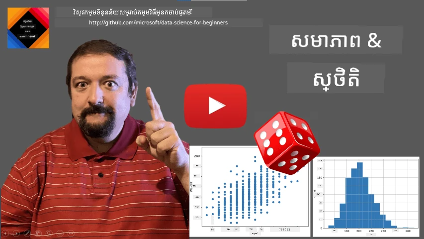
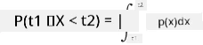
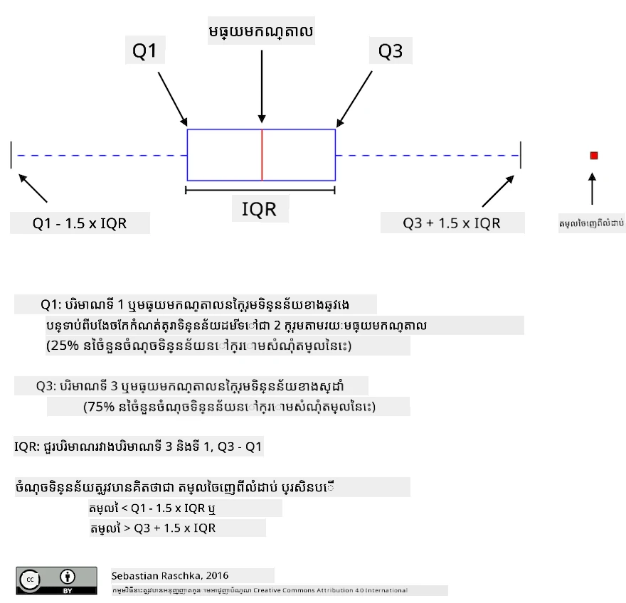
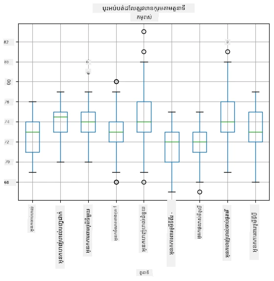
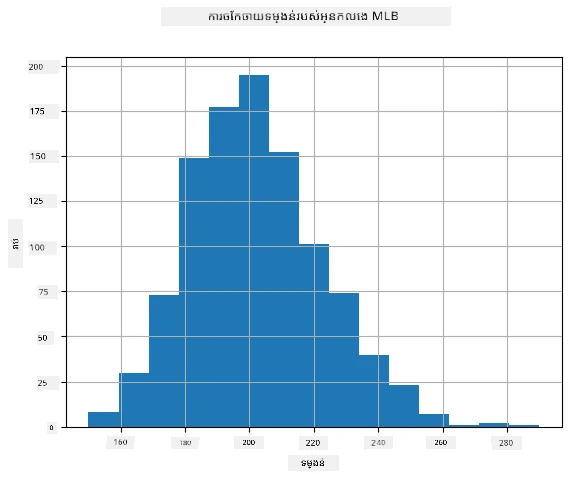
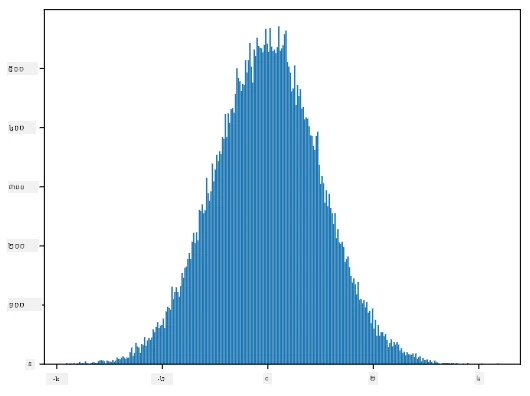
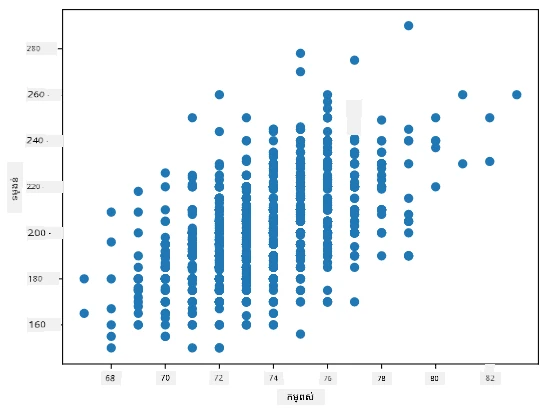

# ការណែនាំខ្លីៗអំពីស្ថិតិ និងប្រភេទ

| ](../../sketchnotes/04-Statistics-Probability.png)|
|:---:|
| ស្ថិតិ និងប្រភេទ - _Sketchnote ដោយ [@nitya](https://twitter.com/nitya)_ |

ទ្រឹស្តីស្ថិតិ និងប្រភេទ គឺជាវិស័យទំនាក់ទំនងខ្លាំងទ្វេ ដំណាលជាមួយគណិតវិទ្យាដែលពាក់ព័ន្ធយ៉ាងខ្លាំងនឹងវិទ្យាសាស្រ្តទិន្នន័យ។ អាចប្រតិបត្តិការជាមួយទិន្នន័យដោយគ្មានចំណេះដឹងជ្រៅអំពីគណិតវិទ្យាប៉ុន្តែគឺក្រលាប់បំផុត ដើម្បីដឹងគំនិតមូលដ្ឋានខ្លះៗ។ នៅទីនេះ យើងនឹងដាក់បង្ហាញការណែនាំខ្លីៗដែលនឹងជួយអ្នកចាប់ផ្តើម។

[](https://youtu.be/Z5Zy85g4Yjw)


## [ការប្រលងមុនមេរៀន](https://ff-quizzes.netlify.app/en/ds/quiz/6)

## ប្រភេទ និងអថេរប្រភេទចៃដន្យ

**ប្រភេទ** គឺជាលេខមួយនៅចន្លោះ 0 និង 1 ដែលបង្ហាញពីភាពស័ក្ដិសមនៃព្រឹត្តិការណ៍មួយ។ វាត្រូវបានកំណត់ជា​ចំនួនលទ្ធផលវិជ្ជមាន (ដែលនាំឲ្យកើតព្រឹត្តិការណ៍) ចែកជាមួយចំនួនលទ្ធផលសរុប ដែលទាំងអស់នៃលទ្ធផលមានប្រភេទស្មើគ្នា។ ឧទាហរណ៍ នៅពេលយើងទាត់ប៉ាសដៃក្រឡា យើងបានប្រភេទនៃការទទួលបានលេខសូវេគឺ 3/6 = 0.5។

ពេលយើងនិយាយអំពីព្រឹត្តិការណ៍ យើងប្រើ **អថេរប្រភេទចៃដន្យ**។ ឧទាហរណ៍ អថេរប្រភេទចៃដន្យដែលតំណាងឲ្យលេខដែលទទួលបានពេលទាត់ប៉ាសដៃក្រឡា នឹងមានតម្លៃចាប់ពី 1 ដល់ 6។ ចំណាត់ថ្នាក់លេខចាប់ពី 1 ដល់ 6 ត្រូវបានហៅថា **ទីតាំងគំរូ**។ យើងអាចនិយាយអំពីប្រភេទនៃអថេរប្រភេទចៃដន្យមួយដែលទទួលតម្លៃជាក់លាក់មួយបាន៖ ឧទាហរណ៍ P(X=3)=1/6។

អថេរប្រភេទចៃដន្យនៅក្នុងឧទាហរណ៍មុនត្រូវបានហៅថា **ចំនួនចម្លង** ព្រោះវាមានទីតាំងគំរូដែលអាចរាប់បាន មានតម្លៃមិនទទេដែលអាចរាប់បាន។ មានករណីដែលទីតាំងគំរូជាជួរលេខពិត ឬជាសំណុំលេខពិតទាំងមូល។ អថេរនេះហៅថា **បន្ត**។ ឧទាហរណ៍ល្អ គឺពេលដែលរថយន្តក្រុងដល់។

## ចែកចាយប្រភេទ

សម្រាប់អថេរប្រភេទចម្លង វាងាយស្រួលក្នុងការពិពណ៌នាប្រភេទនៃព្រឹត្តិការណ៍មួយៗដោយមុខងារ P(X)។ សម្រាប់តម្លៃ *s* មួយពីទីតាំងគំរូ *S* វានឹងផ្តល់លេខមួយចន្លោះ 0 ទៅ 1 ល្បឿនបូកគ្រប់តម្លៃ P(X=s) សម្រាប់ព្រឹត្តិការណ៍ទាំងអស់នឹងស្មើ 1។

ចែកចាយចម្លងដែលស្គាល់ប្រាំបំផុតគឺ **ចែកចាយស្មើ** ដែលទីតាំងគំរូមានធាតុ N និងមានប្រភេទស្មើ 1/N សម្រាប់មួយៗ។

វាពិបាកក្នុងការពិពណ៌នាចែកចាយប្រភេទបន្ត ដែលមានតម្លៃយកពីចន្លោះ [a,b] ឬសំណុំលេខពិត &Ropf;។ ពិចារណាចំពោះពេលរថយន្តក្រុងដល់។ ពិតណាស់ សម្រាប់ពេលដល់ *t* ជាក់លាក់ ប្រភេទនៃការរថយន្តដល់ពេលនោះគឺ 0!

> ឥឡូវអ្នកបានដឹងថា ព្រឹត្តិការណ៍ដែលមានប្រភេទ 0 កើតមាន ហើយជាញឹកញាប់ណាស់! យ៉ាងហោចណាស់នៅពេលដែលរថយន្តក្រុងដល់!

យើងអាចនិយាយតែអំពីប្រភេទនៃអថេរចុះទៅក្នុងចន្លោះតម្លៃដែលបានទុកឲ្យ, ឧទាហរណ៍ P(t<sub>1</sub>&le;X&lt;t<sub>2</sub>)។ ក្នុងករណីនេះ ចែកចាយប្រភេទត្រូវបានពិពណ៌នាដោយ **មុខងារស្ដិតិយមប្រភេទ** p(x), ដូច្នេះ


  
ប្រភេទបន្តមួយដូចបន្តឆ្លងស្មើហៅថា **បន្តឆ្លងស្មើ** ដែលកំណត់នៅចន្លោះមានកំណត់មួយ។ ប្រភេទនៃការទទួលបានតម្លៃ X នៅក្នុងចន្លោះប្រវែង l អាស្រ័យលើ l ហើយកើនឡើងដល់ 1។

ចែកចាយសំខាន់មួយទៀតគឺ **ចែកចាយធម្មតា** ដែលយើងនឹងពិភាក្សាទៅលម្អិតបន្ថែមក្រោមនេះ។

## មធ្យម, វ៉ារ្យាំង និងស្តង់ដាវិលធឺណេស

សន្មត់ថាយើងគូរដេក្សម៉ាស n របស់អថេរប្រភេទចៃដន្យ X៖ x<sub>1</sub>, x<sub>2</sub>, ..., x<sub>n</sub>។ យើងអាចកំណត់ **មធ្យម** (ឬ **មធ្យមគណិតវិទ្យា**) នៃស៊េរីបានតាមបែបប្រពៃណីជា (x<sub>1</sub>+x<sub>2</sub>+...+x<sub>n</sub>)/n។ ពេលយើងពង្រីកទំហំឧទាហរណ៍ (មានន័យថា កំណត់លីមីត n&rarr;&infin;) យើងនឹងទទួលបានមធ្យម (ដែលត្រូវបានហៅថា **ការរំពឹងទុក**) នៃចែកចាយ។ យើងនឹងតំណាងការរំពឹងទុកដោយ **E**(x)។

> វាអាចបង្ហាញបានសម្រាប់ចែកចាយចម្លងណាមួយដែលមានតម្លៃ {x<sub>1</sub>, x<sub>2</sub>, ..., x<sub>N</sub>} និងប្រភេទ p<sub>1</sub>, p<sub>2</sub>, ..., p<sub>N</sub> ដូច្នេះការរំពឹងទុកគឺសំដៅទៅ E(X)=x<sub>1</sub>p<sub>1</sub>+x<sub>2</sub>p<sub>2</sub>+...+x<sub>N</sub>p<sub>N</sub> ។

ដើម្បីកំណត់ថាតម្លៃបានបែកចាយច្រើនណាស់ យើងអាចគណនា វ៉ារ្យាំង &sigma;<sup>2</sup> = &sum;(x<sub>i</sub> - &mu;)<sup>2</sup>/n ដែល &mu; គឺមធ្យមនៃស៊េរី។ តម្លៃ &sigma; ត្រូវបានហៅថា **ស្តង់ដាវិលធឺណេស** ហើយ &sigma;<sup>2</sup> ត្រូវបានហៅថា **វ៉ារ្យាំង**។

## ម៉ូដ, មេឌៀន និងឈ្ជៀតធៀប

ពេលខ្លះ មធ្យមមិនអាចតំណាងឲ្យតម្លៃ "ទូទៅ" សម្រាប់ទិន្នន័យបានល្អគ្រប់គ្រាន់។ ឧទាហរណ៍ ពេលមានតម្លៃខ្ពស់ពេកខ្លះៗ ដែលខ្វះលំហធំ អាចប៉ះពាល់មធ្យម។ ចំនុចល្អមួយទៀត គឺ **មេឌៀន** ដែលជាតម្លៃមួយដែលមានដុំទិន្នន័យបីផ្នែក តម្លៃកថាផ្នែកមួយចំនួនមានតម្លៃក្រោមវា ហើយភាគច្រើនខ្វះខ្លះនៅលើវា។

ដើម្បីជួយយើងយល់ពីចែកចាយទិន្នន័យ វាជាការល្អក្នុងការនិយាយអំពី **ឈ្ជៀតធៀប**៖

* ឈ្ជៀតធៀបទីមួយ ឬ Q1 គឺជាតម្លៃដែល 25% នៃទិន្នន័យស្ថិតក្រោមវា
* ឈ្ជៀតធៀបទីបី ឬ Q3 គឺជាតម្លៃដែល 75% នៃទិន្នន័យស្ថិតក្រោមវា

យើងអាចបង្ហាញទំនាក់ទំនងរវាងមេឌៀន និងឈ្ជៀតធៀបនៅក្នុងគំនូស **ប្រអប់បង្ហាញ**៖



នៅទីនេះ យើងក៏គណនាដែនឈ្ជៀតធៀប IQR=Q3-Q1 និងតម្លៃដែលហៅថា **តម្លៃចេញពីវិមាត្រ** (outliers) គឺតម្លៃដែលស្ថិតខាងក្រៅលំដាប់ [Q1-1.5*IQR,Q3+1.5*IQR]។

សម្រាប់ចែកចាយចំនួនកំណត់​ដែលមានតម្លៃអាចកើតមានតិចមួយ តម្លៃ "ទូទៅ" ល្អគឺតម្លៃដែលបង្ហាញញឹកញាប់បំផុតហៅថា **ម៉ូដ**។ វាត្រូវបានប្រើជាញឹកញាប់សម្រាប់ទិន្នន័យប្រភេទចំណាត់ថ្នាក់ដូចជារ៉ែម៉ាត់។ ពិចារណាពេលដែលយើងមានក្រុមមនុស្សពីរប្រភេទ - មនុស្សខ្លះដែលចូលចិត្តពណ៌ក្រហមខ្លាំង និងអ្នកផ្សេងៗដែលចូលចិត្តពណ៌ខៀវ។ ប្រសិនបើយើងកូដពណ៌ដោយលេខ តម្លៃមធ្យមនៃពណ៌ចូលចិត្តនឹងភាគច្រើននៅក្នុងចំណោមពណ៌ទឹកក្រូច-បៃតង ដែលមិនបង្ហាញចំណង់ចាប់ផ្តើមរបស់គ្នាទេ។ ទោះជាយ៉ាងណា ម៉ូដនឹងគឺជាប្រភេទពណ៌មួយ ឬទាំងពីរពណ៌ ប្រសិនបើចំនួនអ្នកបោះឆ្នោតស្មើគ្នា (សម្រាប់ករណីនេះ យើងហៅឈ្មោះសំណុំគំរូថា **multimodal**).

## ទិន្នន័យពិតប្រាកដ

ពេលយើងវិភាគទិន្នន័យពីជីវិតពិត វាតែងតែ​មិនមែនជាអថេរប្រភេទចៃដន្យបែបដាច់ដោយល្អទេ ពីព្រោះយើងមិនបានអនុវត្ត្រប្រឡងជាមួយលទ្ធផលមិនដឹង។ ឧទាហរណ៍ សូមពិចារណាក្រុមកីឡាករ baseball និងទិន្នន័យរាងកាយរបស់ពួកគេដូចជាព្រលឹង កំញាស់ និងអាយុ។ លេខទាំងនេះមិនមែនចៃដន្យពិតទេ ប៉ុន្តែយើងក៏អាចអនុវត្តគំនិតគណិតវិទ្យាដូចគ្នាបាន។ ឧទាហរណ៍ ស៊េរីគ្រប់គុណនៃទម្ងន់មនុស្សអាចត្រូវបានគេពិចារណាថាជាស៊េរីតម្លៃដែលទទួលបានពីអថេរប្រភេទចៃដន្យមួយ។ ខាងក្រោមគឺជាស៊េរីទម្ងន់កីឡាករ baseball ពិតប្រាកដពី [Major League Baseball](http://mlb.mlb.com/index.jsp), ហៅពី [ទិន្នន័យនេះ](http://wiki.stat.ucla.edu/socr/index.php/SOCR_Data_MLB_HeightsWeights) (សម្រាប់ភាពងាយស្រួល បង្ហាញតែ 20 តម្លៃដំបូងប៉ុណ្ណោះ):

```
[180.0, 215.0, 210.0, 210.0, 188.0, 176.0, 209.0, 200.0, 231.0, 180.0, 188.0, 180.0, 185.0, 160.0, 180.0, 185.0, 197.0, 189.0, 185.0, 219.0]
```

> **សម្គាល់**៖ ដើម្បីមើលឧទាហរណ៍នៃការធ្វើការជាមួយទិន្នន័យនេះ សូមមើល [សៀវភៅចំណាំ](notebook.ipynb) ជារួម។ ក៏មានការប្រកួតតួចំនួនមួយនៅក្នុងមេរៀននេះ ហើយអ្នកអាចបញ្ចប់វាដោយបន្ថែមកូដទៅក្នុងសៀវភៅនេះ។ ប្រសិនបើអ្នកមិនប្រាកដពីរបៀបដំណើរការជាមួយទិន្នន័យ កុំបារម្ភ - យើងនឹងត្រលប់មកធ្វើការជាមួយទិន្នន័យដោយប្រើ Python នៅពេលក្រោយ។ ប្រសិនបើអ្នកមិនដឹងពីរបៀបបើកកូដក្នុង Jupyter Notebook សូមមើល [អត្ថបទនេះ](https://soshnikov.com/education/how-to-execute-notebooks-from-github/)។

នេះគឺជាប្រអប់បង្ហាញដែលបង្ហាញមធ្យម មេឌៀន និងឈ្ជៀតធៀបសម្រាប់ទិន្នន័យរបស់យើង៖


ដោយសារតែទិន្នន័យរបស់យើងមានព័ត៌មានអំពី **តួនាទី**នៃកីឡាករ ក៏អាចធ្វើប្រអប់បង្ហាញតាមតួនាទីផងដែរ - នេះនឹងឲ្យយើងយល់ពីរបៀបដែលតម្លៃប៉ារ៉ាម៉ែត្របំលែងគ្នាតាមតួនាទី។ ពេលនេះយើងនឹងពិចារណាអំពីកម្ពស់៖



គំនូរសម្រាប់ម៉ូដនេះសំដៅថា មធ្យមនៃកម្ពស់បាសម៉ែនលើសកម្ពស់បាសម៉ែនទីពីរ។ នៅពេលក្រោយក្នុងមេរៀននេះ យើងនឹងស្វែងយល់ពីរបៀបពិនិត្យសញ្ញានេះយ៉ាងផ្លូវការជាងនេះ ហើយរបៀបបង្ហាញថាទិន្នន័យរបស់យើងមានសារៈសំខាន់ផ្នែកស្ថិតិ។

> នៅពេលធ្វើការជាមួយទិន្នន័យពិតប្រាកដ យើងសន្មតថាទិន្នន័យទាំងអស់គឺជាតំណាងឧទាហរណ៍ដែលទទួលបានពីចែកចាយប្រភេទណាមួយ។ ការសន្មតនេះអនុញ្ញាតឲ្យយើងអាចអនុវត្តវិធីសាស្រ្តរៀនម៉ាស៊ីន និងបង្កើតម៉ូឌែលទាយទ្រង់ដែលមានប្រសិទ្ធភាព។

ដើម្បីមើលថាតើចែកចាយទិន្នន័យរបស់យើងជាថាតើម្តេច យើងអាចគូរឯកសារតាំងហៅថា **អ៊ីនតុលយុក្រាម**។ អ័ក្ស X បង្ហាញជាចំនួនវគ្គទម្ងន់ផ្សេងៗ (ហៅថា **bins**) ហើយអ័ក្សដាក់ទម្រង់បង្ហាញចំនួនដងដែលលទ្ធផលឧទាហរណ៍របស់អថេរប្រភេទចៃដន្យនៅក្នុងចន្លោះនោះ។



ពីអ៊ីនតុលយុក្រាមនេះ អ្នកអាចមើលឃើញថាតម្លៃទាំងអស់កណ្តាលនៅជុំវិញមធ្យមនៃទម្ងន់ ហើយប្រសិនបើយើងចេញពីទម្ងន់នេះ ចំនួនទម្ងន់នៃតម្លៃនោះតិចបន្តិច។ មានន័យថា វាបានច្បាស់ថាទម្ងន់កីឡាករបោះបាល់គុនមិនងាយត្រូវចម្ងាយខុសពីមធ្យមទេ។ វ៉ារ្យាំងបង្ហាញដល់ប្រវែងដែលទម្ងន់អាចខុសគ្នាពីមធ្យម។

> ប្រសិនបើយើងគយទម្ងន់នៃមនុស្សផ្សេងមិនមកពីក្រុមបាល់ទាត់ baseball ចែកចាយប្រហែលជាខុសគ្នា។ តែទម្រង់ចែកចាយនៅតែដូចគ្នា ប៉ុន្តែមធ្យមនិងវ៉ារ្យាំងអាចផ្លាស់ប្តូរ។ ដូច្នេះ ប្រសិនបើយើងផ្តល់ការបណ្តុះបណ្តាលម៉ូឌែលលើកីឡាករលីគ baseball វាគ្រប់ទៅអត់ត្រឹមត្រូវពេលអនុវត្តទៅលើនិស្សិតមាគ៌ា ពីព្រោះចែកចាយមូលដ្ឋានខុសគ្នា។

## ចែកចាយធម្មតា

ចែកចាយនៃទម្ងន់ដែលយើងបានឃើញខាងលើគឺជាលក្ខណៈទូទៅមួយ ហើយវាស់វែងជាច្រើនសកម្មភាពនៅជីវិតពិតតាមចែកចាយប្រភេទនេះ ប៉ុន្តែមធ្យម និងវ៉ារ្យាំងខុសគ្នា។ ចែកចាយនេះហៅថា **ចែកចាយធម្មតា** ហើយវាកាន់តែមានតួនាទីសំខាន់ក្នុងវិទ្យាសាស្រ្តស្ថិតិ។

ការប្រើប្រាស់ចែកចាយធម្មតាជារបៀបត្រឹមត្រូវក្នុងការបង្កើតទម្ងន់ចៃដន្យនៃកីឡាករបាល់ទាត់។ ពេលយើងដឹងមធ្យមទម្ងន់ `mean` និងស្តង់ដាវិលធឺណេស `std` យើងអាចបង្កើតសំណុំទម្ងន់ ១,០០០ ដោយរបៀបនេះ៖
```python
samples = np.random.normal(mean,std,1000)
``` 

បើយើងគូរអ៊ីនតុលយុក្រាមនៃសំណុំទម្ងន់ដែលបង្កើត យើងនឹងឃើញរូបភាពដូចជារូបនេះខាងលើ។ ហើយបើយើងបន្ថែមចំនួនសំណុំ និងចំនួន bins យើងអាចបង្កើតរូបភាពចែកចាយធម្មតាដែលជិតល្អគ្រប់គ្រាន់៖



*ចែកចាយធម្មតាមធ្យម=0 និងស្តង់ដាវិលធឺណេស=1*

## ចន្លោះទំនុកចិត្ត

ពេលយើងនិយាយអំពីទម្ងន់កីឡាករបាល់ទាត់ យើងសន្មតថាមានអថេរចៃដន្យ W មួយដែលតំណាងឲ្យចែកចាយប្រភេទល្អឥតខ្ចោះនៃទម្ងន់កីឡាករទាំងអស់ (ហៅថា **ប្រជាជន** ទំនាក់ទំនង)។ ស៊េរីទម្ងន់របស់យើងគឺជាឧទាហរណ៍មួយ​រាប់ពីប្រជាជននេះដែលហៅថា **គំរូ**។ សំណួរពិសេស គឺតើយើងអាចដឹងប៉ារ៉ាម៉ែត្រចែកចាយរបស់ W ឬក៏មធ្យម និងវ៉ារ្យាំងរបស់ប្រជាជនឬនៅ?

ចម្លើយងាយៗគឺគណនាមធ្យម និងវ៉ារ្យាំងរបស់គំរូរបស់យើង។ ទោះជាយ៉ាងណា អាចស្ថិតនៅតែថា គំរូចៃដន្យរបស់យើងមិនតំណាងខុសត្រង់នឹងប្រជាជនទាំងមូលទេ។ ដូច្នេះ មានភាពសំខាន់ក្នុងការចុះនិយាយអំពី **ចន្លោះទំនុកចិត្ត**។

> **ចន្លោះទំនុកចិត្ត** គឺជាការប៉ាន់ប្រមាណមធ្យមពិតប្រាកដនៃប្រជាជន ដោយផ្អែកលើគំរូ ធ្វើការត្រឹមត្រូវនៅភាពមានប្រភេទខ្ពស់មួយ (ឬ **សន្ទស្សន៍ទំនុកចិត្ត**)។

សន្មតថាយើងមានគំរូ X<sub>1</sub>, ..., X<sub>n</sub> ពីចែកចាយរបស់យើង។ ក្នុងមួយពេល យើងគូរគំរូពីចែកចាយរបស់យើង យើងនឹងមានតម្លៃមធ្យមផ្សេងៗគ្នា &mu;។ ដូច្នេះ &mu; ត្រូវបានទស្សនាថាជាអថេរប្រភេទចៃដន្យ។ **ចន្លោះទំនុកចិត្ត** ជាគូតម្លៃ (L<sub>p</sub>,R<sub>p</sub>) ដូច្នេះ **P**(L<sub>p</sub>&leq;&mu;&leq;R<sub>p</sub>) = p គឺជាប្រភេទនៃការបង្ហាញតម្លៃមធ្យមវាស់របស់គំរូនៅចន្លោះនេះ។

វាធ្វើលើសទ្ធិរកមិនចប់នៅការណែនាំខ្លីៗនេះ ក្នុងការពិភាក្សារាល់លម្អិតនៃរបៀបគណនាចន្លោះទំនុកចិត្ត។ ព័ត៌មានបន្ថែមអាចរកបាន [នៅលើវីគីពីឌា](https://en.wikipedia.org/wiki/Confidence_interval)។ ជាសង្ខេប យើងកំណត់ចែកចាយរបស់មធ្យមឧទាហរណ៍ គ្មានទំនាក់ទំនងទៅមធ្យមពិតប្រាកដនៃប្រជាជន ដែលហៅថា **ចែកចាយសិស្ស**។
> **ហេតុការណ៍គួរឱ្យចាប់អារម្មណ៍**៖ ការចែកចាយ Student ត្រូវបានដាក់ឈ្មោះតាមរយៈអ្នកគណិតវិទ្យា William Sealy Gosset ដែលបានបោះពុម្ពផ្សាយឯកសាររបស់គាត់ក្រោមឈ្មោះប្រើប្រាស់ "Student"។ គាត់បានធ្វើការនៅរោងការផលិតស្រាហ្គីននេស និងជាភាគីក្នុងករណីមួយ អ្នកដឹកនាំរបស់គាត់មិនចង់ឲ្យសាធារណជនទូទៅដឹងថាពួកគេកំពុងប្រើសាកល្បងស្ថិតិដើម្បីកំណត់គុណភាពសម្ភារៈដើមទេ។

បើយើងចង់ប៉ាន់ស្មានភាពមធ្យម &mu; របស់ប្រជាជនរបស់យើងជាមួយនឹងកម្រិតជំនឿ p យើងត្រូវយក *(1-p)/2-th percentile* នៃចែកចាយ Student A ដែលអាចយកពីតារាង ឬក៏កុំព្យូទ័រជាមួយនឹងមុខងារស្ថិតិដែលមានរួចនៅក្នុងកម្មវិធីស្ថិតិ (ឧ. Python, R, ល។) បន្ទាប់មកចន្លោះសម្រាប់ &mu; នឹងត្រូវបានផ្ដល់ដោយ X&pm;A*D/&radic;n ដែល X គឺជាមធ្យមដែលទទួលបានពីគំរូ និង D គឺជាការបែកធ្លាយស្តង់ដារ។

> **សម្គាល់**៖ យើងក៏មិនពិភាក្សាបន្ថែមអំពីគំនិតសំខាន់មួយក្នុងនាមឈ្មោះ [degrees of freedom](https://en.wikipedia.org/wiki/Degrees_of_freedom_(statistics)) ដែលមានសារៈសំខាន់នៅក្នុងទាក់ទងនឹងចែកចាយ Student ទេ។ អ្នកអាចយោងទៅកាន់សៀវភៅស្ថិតិដែលពេញលេញជាងនេះដើម្បីយល់អំពីគំនិតនេះជ្រៅជាង។

ឧទាហរណ៍នៃការគណនាចន្លោះជំនឿសម្រាប់ទំងន់និងកម្ពស់ត្រូវបានផ្ដល់នៅក្នុង [កំណត់ត្រារួម](notebook.ipynb)។

| p | មធ្យមទំងន់ |
|-----|-----------|
| 0.85 | 201.73±0.94 |
| 0.90 | 201.73±1.08 |
| 0.95 | 201.73±1.28 |

សម្គាល់ថា កំរិតជំនឿ càngខ្ពស់ ចន្លោះជំនឿ càngទូលាយ។

## ការធ្វើតេស្តសម្តីហេតុ

ក្នុងទិន្នន័យកីឡាករបេស្បាល់របស់យើង មានតួនាទីកីឡាករផ្សេងៗ ដែលត្រូវបានសង្ខេបខាងក្រោម (សូមមើល [កំណត់ត្រារួម](notebook.ipynb) ដើម្បីឃើញរបៀបគណនាតារាងនេះ):

| តួនាទី | កម្ពស់ | ទំងន់ | ចំនួន |
|------|--------|--------|-------|
| អ្នកចាប់បាល់ត្រី | 72.723684 | 204.328947 | 76 |
| អ្នកបាញ់បាល់ឱ្យបានពិន្ទុ | 74.222222 | 220.888889 | 18 |
| អ្នកលេងទីមួយ | 74.000000 | 213.109091 | 55 |
| អ្នកលេងខាងក្រៅ | 73.010309 | 199.113402 | 194 |
| អ្នកបោះបាល់ជំនួយ | 74.374603 | 203.517460 | 315 |
| អ្នកលេងទីពីរ | 71.362069 | 184.344828 | 58 |
| អ្នកកាន់បាល់ខ្លួនខ្លី | 71.903846 | 182.923077 | 52 |
| អ្នកបោះបាល់ចំបាប់ | 74.719457 | 205.163636 | 221 |
| អ្នកលេងទីបី | 73.044444 | 200.955556 | 45 |

យើងអាចមើលឃើញថា មធ្យមកម្ពស់របស់អ្នកលេងទីមួយខ្ពស់ជាងអ្នកលេងទីពីរ។ ដូច្នេះយើងប្រហែលនឹងចង់សន្និដ្ឋានថា **អ្នកលេងទីមួយខ្ពស់ជាងអ្នកលេងទីពីរ**។

> សេចក្តីថ្លែងនេះហៅថា **សម្តីហេតុ** ព្រោះយើងមិនបានដឹងថាតើវាធ្វើបានត្រឹមត្រូវពិតប្រាកដឬអត់ទេ។

យ៉ាងណាក៏ដោយ គ្មានភាពច្បាស់ជានិច្ចថា យើងអាចធ្វើសន្និដ្ឋាននេះបានឬអត់ទេ។ ពីការពិភាក្សាខាងលើ យើងដឹងថាមធ្យមនីមួយៗមានចន្លោះជំនឿធ្វើជាសមាជិក ដូច្នេះការខុសគ្នានេះអាចជាការខុសមួយដែលមកពីស្ថិតិ ហើយយើងត្រូវការវិធីផ្លូវការមួយដើម្បីត្រួតពិនិត្យសម្តីហេតុរបស់យើង។

យើងត្រូវគណនាចន្លោះជំនឿដោយចែកខុសគ្នាសម្រាប់កម្ពស់របស់អ្នកលេងទីមួយ និងទីពីរ៖

| កម្រិតជំនឿ | អ្នកលេងទីមួយ | អ្នកលេងទីពីរ |
|------------|---------------|----------------|
| 0.85 | 73.62..74.38 | 71.04..71.69 |
| 0.90 | 73.56..74.44 | 70.99..71.73 |
| 0.95 | 73.47..74.53 | 70.92..71.81 |

យើងអាចឃើញថា គ្មានចន្លោះណាមួយដែលបំពង់គ្នា ត្រង់នេះបង្ហាញពីសម្តីហេតុរបស់យើងថា អ្នកលេងទីមួយខ្ពស់ជាងអ្នកលេងទីពីរ។

យ៉ាងជាក់ស្តែង problème ដែលយើងកំពុងដោះស្រាយគឺដើម្បីមើលថា **ចែកចាយប្រភេទពីរនេះមានដូចគ្នាទេឬយ៉ាងហោចណាស់មានប៉ារ៉ាម៉ែត្រដូចគ្នា។** យោងទៅតាមចែកចាយ យើងត្រូវប្រើសាកល្បងខុសគ្នា បើយើងដឹងថាចែកចាយរបស់យើងគឺស្ដង់ដារធម្មតា យើងអាចអនុវត្ត **[Student t-test](https://en.wikipedia.org/wiki/Student%27s_t-test)**។

នៅក្នុង Student t-test, យើងគណនាតម្លៃដែលហៅថា **តម្លៃ t** ដែលបង្ហាញអំពីភាពខុសគ្នារវាងមធ្យម ដែលគិតចំពោះអថេរការផ្សំលំហូរ។ វាត្រូវបានបង្ហាញថាតម្លៃ t អនុវត្តចែចែកចាយ **student distribution** ដែលអនុញ្ញាតឱ្យយើងទទួលបានតម្លៃកម្ពស់តស៊ូសម្រាប់កម្រិតជំនឿ p ជាក់លាក់ (អាចគណនា ឬស្វែងរកក្នុងតារាងលេខ)។ បន្ទាប់មកយើងប្រៀបធៀបទម្លៃ t នឹងតម្លៃកម្ពស់នេះដើម្បីទទួលយកឬបដិសេធសម្តីហេតុ។

នៅក្នុង Python យើងអាចប្រើកញ្ចប់ **SciPy** ដែលរួមបញ្ចូលមុខងារ `ttest_ind` (លើសពីមុខងារស្ថិតិមានប្រយោជន៍ផ្សេងទៀត!)។ វាគណនាតម្លៃ t សម្រាប់យើង ហើយធ្វើការស្វែងរកតម្លៃ p-value ផង ដូច្នេះយើងអាចមើលតែការជំនឿដើម្បីបានសន្និដ្ឋាន។

ឧទាហរណ៍ ការប្រៀបធៀបទំងន់រវាងអ្នកលេងទីមួយ និងទីពីរផ្តល់លទ្ធផលដូចខាងក្រោម៖ 
```python
from scipy.stats import ttest_ind

tval, pval = ttest_ind(df.loc[df['Role']=='First_Baseman',['Height']], df.loc[df['Role']=='Designated_Hitter',['Height']],equal_var=False)
print(f"T-value = {tval[0]:.2f}\nP-value: {pval[0]}")
```
```
T-value = 7.65
P-value: 9.137321189738925e-12
```
ក្នុងករណីរបស់យើង p-value មានតម្លៃទាបណាស់ សម្គាល់ថាមានភស្តុតាងខ្លាំងដែលគាំទ្រថាអ្នកលេងទីមួយខ្ពស់ជាង។

មានសម្តីហេតុផ្សេងទៀតដែលយើងអាចចង់សាកល្បង ដូចជា៖
* ដើម្បីបញ្ជាក់ថាគំរូមួយអនុវត្តចែកចាយណាមួយ។ នៅក្នុងករណីនេះ យើងបានសន្និដ្ឋានថាកម្ពស់មានចែកចាយធម្មតា ប៉ុន្តែតម្រូវឱ្យមានការត្រួតពិនិត្យស្ថិតិផ្លូវការ។
* ដើម្បីបញ្ជាក់ថាតម្លៃមធ្យមនៃគំរូសមាប់ទៅតម្លៃដែលបានកំណត់ជាមុន។
* ដើម្បីប្រៀបធៀបទម្លៃមធ្យមនៃគំរូជាច្រើន (ឧ. តម្លៃផ្សំនៃកម្រិតសុខសប្បាយរវាងក្រុមអាយុផ្សេងៗ)។

## ច្បាប់ចំនួនច្រើន និងទ្រឹស្តីខ្សេលំអិតកណ្តាល

មូលហេតុមួយដែលធ្វើឲ្យចែកចាយធម្មតាមានសារៈសំខាន់គឺទ្រឹស្តីដែលហៅថា **central limit theorem**។ សន្មតមានគំរូធំនៃតម្លៃឯករាជ្យ N ដែលជា X<sub>1</sub>, ..., X<sub>N</sub> ដែលយកពីចែកចាយណាមួយដែលមានមធ្យម &mu; និងការផ្សំលំហូរ &sigma;<sup>2</sup>។ បន្ទាប់មកសម្រាប់ N ធំគ្រប់គ្រាន់ (ក្នុងពេលដែល N&rarr;&infin;) មធ្យម &Sigma;<sub>i</sub>X<sub>i</sub> នឹងចែកចាយធម្មតា មានមធ្យម &mu; និងផ្សំលំហូរ &sigma;<sup>2</sup>/N។

> វិធីមួយផ្សេងទៀតក្នុងការបកស្រាយទ្រឹស្តីខ្សែលំអិតកណ្តាល គឺថា មិនគិតថាជាបំណែកចែកចាយណា សម្រាប់ការគណនាមធ្យមនៃផៅលីយ៉ង់តម្លៃអថេរអ្នកទាំងឡាយ នឹងដល់ទៅចែកចាយធម្មតា។

ពីទ្រឹស្តីខ្សែលំអិតកណ្តាល យើងទទួលបានថា នៅពេល N&rarr;&infin; អ្នកប្រហែលតម្លៃមធ្យមនៃគំរូនឹងផ្ទៀងផ្ទាត់ទៅ &mu; ជាឯកតា 1។ នេះហៅថា **ច្បាប់ចំនួនច្រើន**។

## សមាសភាពការពារនិងការតភ្ជាប់

មួយក្នុងចំណោមរឿងដែលវិទ្យាសាស្ត្រទិន្នន័យធ្វើ គឺរកចំណុចទាក់ទងរវាងទិន្នន័យ។ យើងនិយាយថាស្របតៗ **តភ្ជាប់គ្នា** នៅពេលពួកវាបង្ហាញឥរិយាបថដូចគ្នាតែមួយពេល ឬថាពួកវាឡើង/ចុះជាមួយគ្នា។ ផ្ទុយទៅវិញ នៅខណៈពេលមួយឡើង ហើយមួយចុះ ឬថាពួកវាមានទំនាក់ទំនងមួយចំណុច។

> ការតភ្ជាប់មិនបញ្ជាក់ថាមានទំនាក់ទំនងហេតុផលចន្លោះគ្នាទេ ច្រើនពេលវាលទ្ធផលពីមូលហេតុខាងក្រៅ រឺជាករណីឱ្យលទ្ធផលតភ្ជាប់គ្នា។ ប៉ុន្តែការតភ្ជាប់គណិតវិទ្យាខ្លាំងគឺជាសញ្ញាល្អថាអថេរទាំងពីរជាប់គ្នា។

ជាគណិតវិទ្យា គំនិតសំខាន់បង្ហាញទំនាក់ទំនងរវាងអថេរប្រាក់ពីរគឺ **covariance** ដែលគណនាតាមសមីការ៖ Cov(X,Y) = **E**[(X-**E**(X))(Y-**E**(Y))]។ យើងគណនាប្រែប្រួលទាំងពីរពីមធ្យមរបស់ពួកវា ហើយបូកប្រាក់ផលនៃការប្រែប្រួល។ ប្រសិនបើយោងតាមទាំងពីរលំបាកគ្នា អត្រានៃផលគឺជាតម្លៃវិជ្ជមាន ហើយនាំឲ្យមាន covarianceវិជ្ជមាន។ ប្រសិនបើគេច្រាស់ភាពនៃការប្រែប្រួលមិនស្រប (មួយត្រូវចុះ ខណៈមួយឡើង) យើងនឹងទទួលជាតម្លៃអវិជ្ជមាន ដែលនាំឲ្យមាន covarianceអវិជ្ជមាន។ ប្រសិនបើតម្លៃប្រែប្រួលគ្មានទំនាក់ទំនង គេនឹងទទួលទឹកប្រាក់ប្រហាក់ប្រហែលសូន្យ។

តម្លៃសរុបរបស់ covariance មិនប្រាប់យើងច្រើនអំពីកម្រិតតភ្ជាប់ ទេសោះទំនាក់ទំនងទៅលើទំហំនៃតម្លៃពិត។ ដើម្បីធ្វើឲ្យមានស្តង់ដារ យើងអាចបែងចែក covariance នេះដោយការបែកធ្លាយស្តង់ដាររបស់ទាំងពីរដើម្បីទទួលបាន **correlation**។ អ្វីល្អគឺ correlation មានតម្លៃនៅក្នុងចន្លោះ [-1,1] នៅពេលដែល 1 សំដៅការតភ្ជាប់វិជ្ជមានខ្លាំង, -1 សំដៅការតភ្ជាប់អវិជ្ជមានខ្លាំង និង 0 គ្មានសមាភាគភាព (អថេរនៅឯករាជ្យ)។

**ឧទាហរណ៍**៖ យើងអាចគណនាការតភ្ជាប់រវាងទំងន់និងកម្ពស់របស់កីឡាករបេស្បាល់ពី dataset ដែលបានផ្តល់ខាងលើ៖
```python
print(np.corrcoef(weights,heights))
```
លទ្ធផល គឺយើងទទួលបាន **matrix correlations** ដូចខាងក្រោម៖
```
array([[1.        , 0.52959196],
       [0.52959196, 1.        ]])
```

> Matrix correlations C អាចគណនា​បាន​ចំពោះ​ចំនួន​អង្គតម្រង់ S<sub>1</sub>, ..., S<sub>n</sub>។ តម្លៃ C<sub>ij</sub> ជាការតភ្ជាប់រវាង S<sub>i</sub> និង S<sub>j</sub> ហើយធាតុបន្ទាត់កូណាដែលមានតម្លៃជានិច្ច 1 (ដែលជាការតភ្ជាប់ឯងផ្ទាល់របស់ S<sub>i</sub>)។

នៅក្នុងករណីរបស់យើង តម្លៃ 0.53 បង្ហាញថាមានការតភ្ជាប់មួយចំនួនរវាងទំងន់និងកម្ពស់មនុស្ស។ យើងក៏អាចបង្កើត scatter plot របស់តម្លៃមួយទៅតម្លៃមួយផ្សេងទៀត ដើម្បីមើលទំនាក់ទំនងជាភាពច្បាស់៖



> មានឧទាហរណ៍បន្ថែមទៀតអំពីគណនាការតភ្ជាប់និង covariance ត្រូវបានរកឃើញនៅក្នុង [កំណត់ត្រារួម](notebook.ipynb)។

## សេចក្ដីសន្និដ្ឋាន

នៅក្នុងផ្នែកនេះ យើងបានរៀន៖

* គុណលក្ខណៈស្ថិតិមូលដ្ឋាននៃទិន្នន័យ ដូចជា មធ្យម ការផ្សំលំហូរ ម៉ូត និង quartiles
* ការចែកចាយផ្សេងៗរបស់អថេរព្រាំង រួមទាំងការចែកចាយធម្មតា
* របៀបរកការតភ្ជាប់រវាងគុណលក្ខណៈផ្សេងៗ
* របៀបប្រើគ្រឿងម៉ាស៊ីនគណិតវិទ្យានិងស្ថិតិដើម្បីបញ្ជាក់សម្តីហេតុមួយចំនួន
* របៀបគណនាចន្លោះជំនឿសម្រាប់អថេរព្រាំងដែលផ្អែកលើគំរូទិន្នន័យ។

ខណៈពេលនេះគឺមិនមែនជាបញ្ជីពេញលេញនៃប្រធានបទដែលមាននៅក្នុងប្រព័ន្ធឥតប្រយោជន៍និងស្ថិតិ, វាគួរតែគ្របដណ្តប់បានល្អសម្រាប់ការចាប់ផ្តើមនៅក្នុងវគ្គសិក្សានេះ។

## 🚀 ការប្រឡង

ប្រើកូដគំរូក្នុងកំណត់ត្រារួមដូចខាងក្រោម ដើម្បីធ្វើតេស្តសម្តីហេតុផ្សេងៗ៖
1. អ្នកលេងទីមួយចាស់ជាងអ្នកលេងទីពីរ
2. អ្នកលេងទីមួយខ្ពស់ជាងអ្នកលេងទីបី
3. អ្នកកាន់បាល់ខ្លួនខ្លីខ្ពស់ជាងអ្នកលេងទីពីរ

## [កម្រងប្រឡងបន្ទាប់មកពីមេរៀន](https://ff-quizzes.netlify.app/en/ds/quiz/7)

## វិភាគ & សិក្សាផ្ទាល់ខ្លួន

ប្រទេស Probability និងស្ថិតិ គឺជាប្រធានបទធំមួយដែលបានសមរម្យសម្រាប់វគ្គសិក្សាផ្ទាល់ខ្លួន។ ប្រសិនបើអ្នកចាប់អារម្មណ៍បន្តសិក្សាធ្នាក់បន្ថែម អ្នកអាចបន្តអានសៀវភៅមួយចំនួនដូចខាងក្រោម៖

1. [Carlos Fernandez-Granda](https://cims.nyu.edu/~cfgranda/) ពីសាកលវិទ្យាល័យ New York មានកំណត់ត្រាសិក្សាល្អ [Probability and Statistics for Data Science](https://cims.nyu.edu/~cfgranda/pages/stuff/probability_stats_for_DS.pdf) (អាចប្រើបានតាមអនឡាញ)
1. [Peter និង Andrew Bruce. Practical Statistics for Data Scientists.](https://www.oreilly.com/library/view/practical-statistics-for/9781491952955/) [[code គំរូនៅក្នុង R](https://github.com/andrewgbruce/statistics-for-data-scientists)]។ 
1. [James D. Miller. Statistics for Data Science](https://www.packtpub.com/product/statistics-for-data-science/9781788290678) [[code គំរូនៅក្នុង R](https://github.com/PacktPublishing/Statistics-for-Data-Science)]

## ការប្រឡង

[ការសិក្សារណមួយតិចតួចអំពីជម្ងឺទឹកនោមផ្អែម](assignment.md)

## ការសរសេរ

មេរៀននេះបាននិពន្ធដោយមាន♥️ ដោយ [Dmitry Soshnikov](http://soshnikov.com)

---

<!-- CO-OP TRANSLATOR DISCLAIMER START -->
**ការបដិសេធ**៖  
ឯកសារនេះត្រូវបានបកប្រែដោយប្រើសេវាកម្មបកប្រែ AI [Co-op Translator](https://github.com/Azure/co-op-translator)។ ខណៈពេលដែលយើងខិតខំផ្តល់ភាពត្រឹមត្រូវ សូមជ្រាបថាការបកប្រែដោយស្វ័យប្រវត្តិអាចមានកំហុសឬភាពមិនត្រឹមត្រូវ។ ឯកសារដើមក្នុងភាសាដើមគួរត្រូវបានចាត់ទុកថាជាក្រដាសឯកសារដើមមានសុពលភាព។ សម្រាប់ព័ត៌មានសំខាន់ៗ អ្នកគួរតែប្រើការបកប្រែដែលធ្វើដោយមនុស្សជំនាញ។ យើងមិនទទួលខុសត្រូវចំពោះការយល់ច្រឡំ ឬការបកស្រាយខុសពីការប្រើប្រាស់ការបកប្រែនេះឡើយ។
<!-- CO-OP TRANSLATOR DISCLAIMER END -->