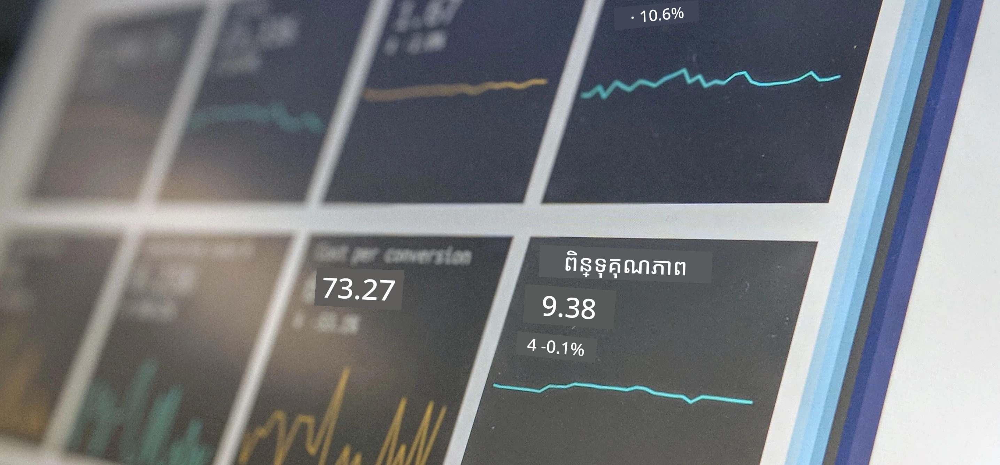

# មុខជំនាញទិន្នន័យ

> រូបថតដោយ <a href="https://unsplash.com/@dawson2406?utm_source=unsplash&utm_medium=referral&utm_content=creditCopyText">Stephen Dawson</a> នៅលើ <a href="https://unsplash.com/s/photos/data?utm_source=unsplash&utm_medium=referral&utm_content=creditCopyText">Unsplash</a>
  
នៅក្នុងមេរៀនទាំងនេះ អ្នកនឹងស្វែងយល់ថាមុខជំនាញទិន្នន័យត្រូវបានកំណត់យ៉ាងដូចម្តេច ហើយរៀនអំពីការពិចារណាអំពីចរិតល្អវិជ្ជាជីវៈដែលត្រូវបានគេគិតទុកសម្រាប់អ្នកវិទ្យាសាស្ត្រទិន្នន័យ។ អ្នកនឹងរៀនផងដែរ របៀបកំណត់ន័យទិន្នន័យ និងរៀនរឿងខ្លីៗពាក់ព័ន្ធនឹងស្ថិតិសាស្ត្រ និងសម្បត្តិនៃកំហុស ឆ្លងកាត់ផ្នែកសិក្សាសំខាន់ៗនៃមុខជំនាញទិន្នន័យ។

### ប្រធានបទ

1. [ការកំណត់មុខជំនាញទិន្នន័យ](01-defining-data-science/README.md)
2. [ចរិតវិជ្ជាជីវៈនៃមុខជំនាញទិន្នន័យ](02-ethics/README.md)
3. [ការកំណត់ន័យទិន្នន័យ](03-defining-data/README.md)
4. [ការណែនាំអំពីស្ថិតិសាស្ត្រ និងសម្បត្តិនៃកំហុស](04-stats-and-probability/README.md)

### ការទទួលស្គាល់

មេរៀនទាំងនេះបានសរសេរដោយមាន❤️ដោយ [Nitya Narasimhan](https://twitter.com/nitya) និង [Dmitry Soshnikov](https://twitter.com/shwars)។

---

<!-- CO-OP TRANSLATOR DISCLAIMER START -->
**ការព្រមាន**៖  
ឯកសារនេះត្រូវបានបកប្រែដោយប្រើសេវាកម្មបកប្រែ AI [Co-op Translator](https://github.com/Azure/co-op-translator)។ ពីព្រោះយើងខិតខំសម្រាប់ភាពត្រឹមត្រូវ សូមយកចិត្តទុកដាក់ថាការបកប្រែដោយស្វ័យប្រវត្តិនេះអាចមានកំហុស ឬក៏ភាពមិនត្រឹមត្រូវ។ ឯកសារដើមក្នុងភាសាម្ចាស់ភាគគឺជាផ្ទៃដីដ៏ត្រឹមត្រូវ។ សម្រាប់ព័ត៌មានសំខាន់ៗ សូមផ្នែកបកប្រែដោយអ្នកជំនាញមានបទពិសោធន៍ត្រូវបានផ្តល់អាទិភាព។ យើងមិនមានភារកិច្ចចំពោះការយល់ច្រឡំនិងការបកស្រាយខុសៗ កើតមានពីការប្រើប្រាស់ការបកប្រែនេះទេ។
<!-- CO-OP TRANSLATOR DISCLAIMER END -->