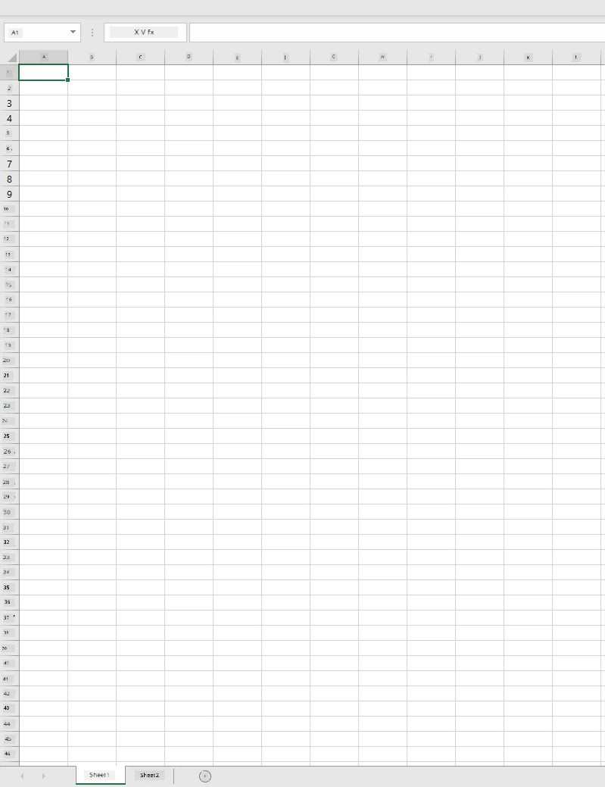
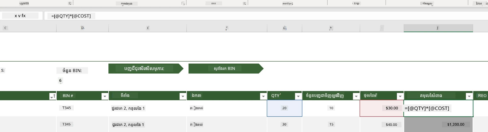
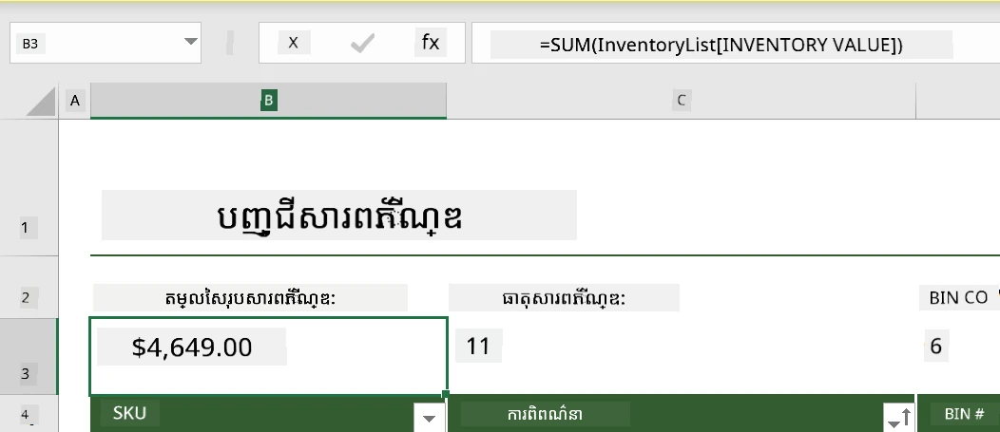
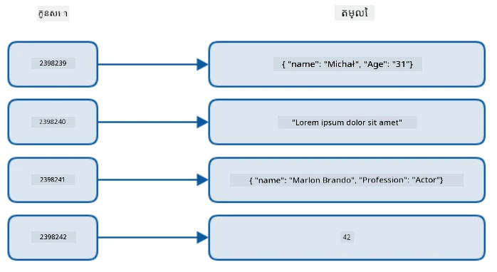
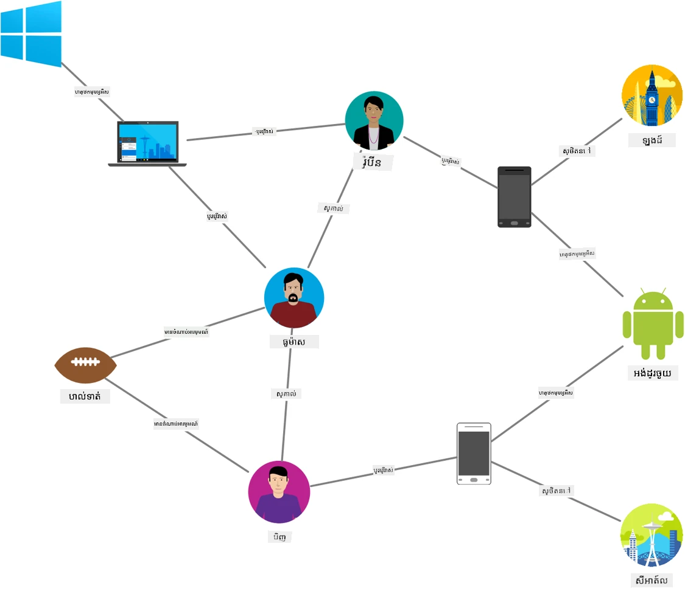
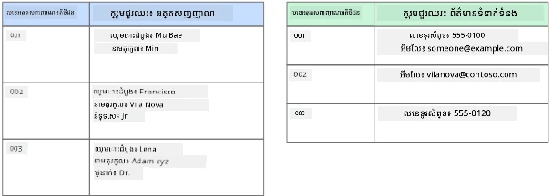
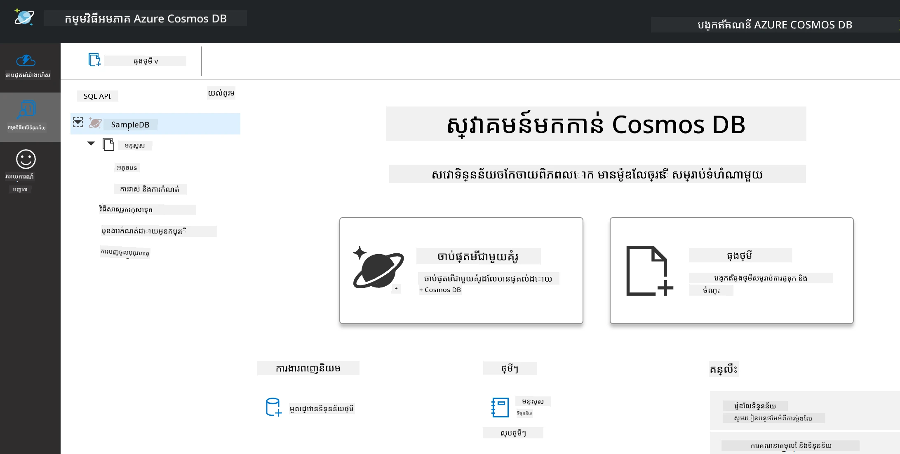
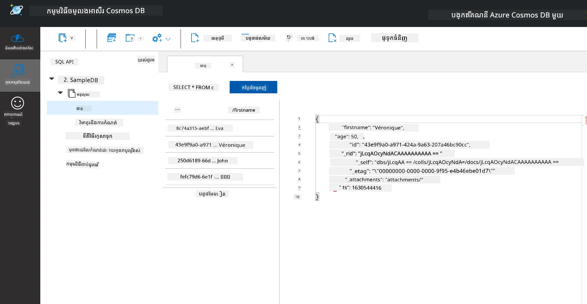
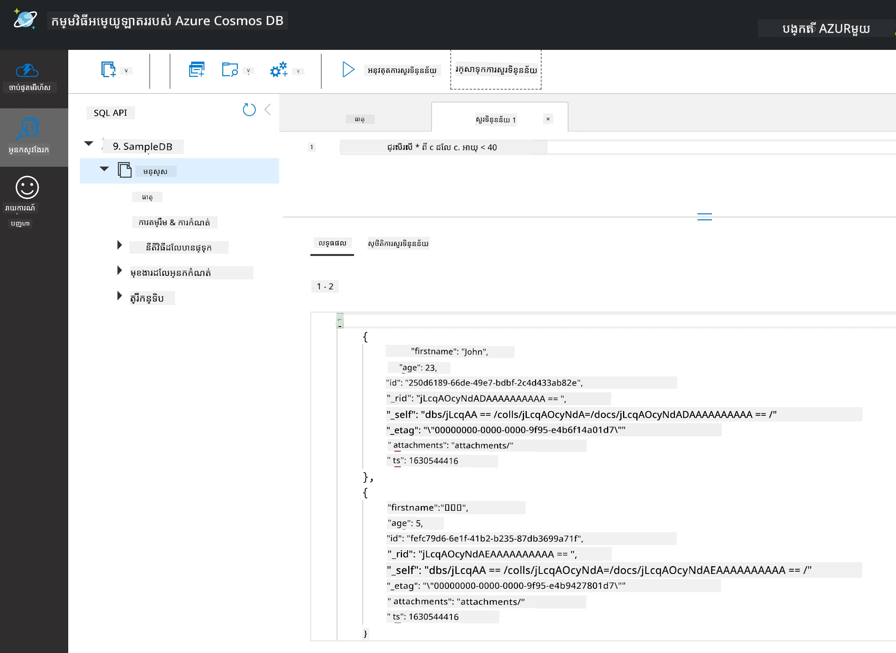

# ការដំណើរការជាមួយទិន្នន័យ: ទិន្នន័យមិនទាក់ទងគ្នា

| ](../../sketchnotes/06-NoSQL.png)|
|:---:|
|ការដំណើរការជាមួយទិន្នន័យ NoSQL - _Sketchnote ដោយ [@nitya](https://twitter.com/nitya)_ |

## [សំណួរជាមុខសិក្សា](https://ff-quizzes.netlify.app/en/ds/quiz/10)

ទិន្នន័យមិនទាន់មានដែនកំណត់នៅក្នុងមូលដ្ឋានទិន្នន័យទាក់ទងគ្នា។មេរៀននេះផ្ដោតលើទិន្នន័យមិនទាក់ទងគ្នា និងនឹងគ្របដណ្ដប់គោលការណ៍មូលដ្ឋាននៃសៀវភៅបណ្ណាល័យ និង NoSQL។

## សៀវភៅបណ្ណាល័យ

សៀវភៅបណ្ណាល័យគឺជាវិធីដែលពេញនិយមសម្រាប់រក្សាទុកនិងស្វែងយល់ទិន្នន័យ ពីព្រោះវាត្រូវការការងារតិចក្នុងការតាំងពិចារណា និងចាប់ផ្តើម។ នៅក្នុងមេរៀននេះអ្នកនឹងរៀនពីធាតុមូលដ្ឋាននៃសៀវភៅបណ្ណាល័យ បន្ថែមបែបបទនិងមុខងារ។ ឧទាហរណ៍នឹងត្រូវបង្ហាញជាមួយ Microsoft Excel ប៉ុន្តែក្នុងបរិបទភាគ១ភាគច្រើននៃផ្នែក និងប្រធានបទនឹងមានឈ្មោះនិងដំណើរការដូចគ្នាទៅនឹងកម្មវិធីសៀវភៅបណ្ណាល័យផ្សេងទៀត។



សៀវភៅបណ្ណាល័យគឺជាឯកសារ ហើយនឹងអាចចូលដំណើរការបាននៅក្នុងប្រព័ន្ធឯកសាររបស់កុំព្យូទ័រ ឧបករណ៍ ឬប្រព័ន្ធឯកសារលើពពក។ កម្មវិធីខ្លួនវាអាចជាកម្មវិធីផ្ទាល់លើកម្មវិប័ន្ធ Browser ឬកម្មវិធីដែលត្រូវតែដំឡើងនៅលើកុំព្យូទ័រ ឬទាញយកជាកម្មវិធី។ ក្នុង Excel ឯកសារទាំងនេះត្រូវបានកំណត់ជាថ្មីថា **workbooks** ហើយពាក្យបញ្ញត្តិនេះនឹងត្រូវប្រើនៅក្នុងមេរៀននេះទៅមុខ។

កម្មវិធី一本រួមបញ្ចូលមានមួយ ឬច្រើន **worksheets**, ដែលក្នុងនោះ worksheet ទាំងអស់ត្រូវបានសម្គាល់ដោយផ្ទាំងស្លាបព្រិល។ ក្រៅពីនេះក្នុង worksheet មានរាងការេហៅថា **cells** ដែលផ្ទុកទិន្នន័យពិតប្រាកដ។ មួយ cell គឺជាចំណុចប្រទាក់រវាងជួរ និងជួរឈរ ដែលជួរឈរត្រូវបានសម្គាល់ដោយតួអក្សរអក្សរ និងជួរត្រូវបានសម្គាល់ដោយលេខ។ សៀវភៅបណ្ណាល័យខ្លះនឹងមានក្បាលនៅជួរដំបូងប៉ុន្មានជួរដើម្បីពិពណ៌នាទិន្នន័យនៅក្នុង cell។

ដោយឧទាហរណ៍ Excel workbook នេះ យើងនឹងប្រើឧទាហរណ៍មួយផ្តោតលើ [Microsoft Templates](https://templates.office.com/) សម្រាប់គ្រប់គ្រងសារពើភ័ណ្ឌ ដើម្បីដើរតួបន្ថែមផ្នែកផ្សេងទៀតនៃសៀវភៅបណ្ណាល័យ។

### ការគ្រប់គ្រងសារពើភ័ណ្ឌ

ឯកសារសៀវភៅបណ្ណាល័យដែលមានឈ្មោះ "InventoryExample" គឺជាសៀវភៅបណ្ណាល័យបានបំលែងរួចពីទ្រព្យសម្បត្តិនៅក្នុងសារពើភ័ណ្ឌ ដែលមាន worksheets បីឈ្មោះ "Inventory List", "Inventory Pick List" និង "Bin Lookup"។ ជួរ​ទី 4 នៃ worksheet Inventory List គឺជាក្បាល ដែលពិពណ៌នាថាតម្លៃនៃមួយមួយក្នុងជួរក្បាល។



មានករណីដែលមួយ cell គួរត្រូវអាស្រ័យលើតម្លៃនៃក្រុម cell ផ្សេងទៀតដើម្បីបង្កើតតម្លៃរបស់វា។ សៀវភៅបញ្ជីសារពើភ័ណ្ឌកំពុងតាមដានតម្លៃកម្រៃរបស់មួយមុខទំនិញក្នុងសារពើភ័ណ្ឌ ប៉ុន្តែបើយើងត្រូវការដឹងតម្លៃទាំងអស់ក្នុងសារពើភ័ណ្ឌ? [**Formulas**](https://support.microsoft.com/en-us/office/overview-of-formulas-34519a4e-1e8d-4f4b-84d4-d642c4f63263) ធ្វើសកម្មភាពលើទិន្នន័យក្នុង cells ហើយប្រើសម្រាប់គណនាទៅលើតម្លៃសារពើភ័ណ្ឌក្នុងឧទាហរណ៍នេះ។ សៀវភៅបណ្ណាល័យនេះប្រើសមាសធាតុ នៅក្នុងជួរឈរ Inventory Value ដើម្បីគណនាតម្លៃមុខទំនិញក្នុងតម្លៃ ដែលគុណតម្លៃបរិមាណនៅក្រោមក្បាល QTY និងតម្លៃនៅក្រោមក្បាល COST។ ហោះរើស cell ឬចុចពីរដងលើ cell នឹងបង្ហាញសមាសធាតុនេះ។ អ្នកនឹងទទួលបានសមាសធាតុចាប់ផ្តើមជាមួយសញ្ញាស្មើ (=) បន្ទាប់ពីនេះជាការគណនាឬប្រតិបត្តិការ។



យើងអាចប្រើសមាសធាតុមួយទៀតដើម្បីបូកតម្លៃទាំងឡាយនៅក្នុងជួរឈរ Inventory Value រួមគ្នា ដើម្បីទទួលតម្លៃសរុប។ វាអាចគណនាបានដោយបូកមួយ cell មួយតែម្តង ប៉ុន្តែនោះអាចជាការងារលំបាក។ Excel មាន [**functions**](https://support.microsoft.com/en-us/office/sum-function-043e1c7d-7726-4e80-8f32-07b23e057f89) ឬ formula ដែលបានកំណត់ជាមុនសម្រាប់បំពេញការគណនាលើតម្លៃ cell។ មុខងារផ្ទុះតម្រូវអាគុយម៉ង មួយនេះគឺជាតម្លៃដែលត្រូវប្រើនៅក្នុងការគណនា។ នៅពេលដែលមុខងារ​ត្រូវការអាគុយម៉ង់ច្រើន ការតំរូវអាគុយម៉ង់ទាំងនេះត្រូវតែចុះបញ្ជីក្នុងលំដាប់ជាក់លាក់ មិនដូច្នេះមុខងារអាចគ្មានការគណនាតម្លៃបានត្រឹមត្រូវ។ ឧទាហរណ៍នេះប្រើមុខងារ SUM ហើយប្រើតម្លៃក្នុងជួរឈរ Inventory Value ជាអាគុយម៉ង់ដើម្បីបូកចេញតម្លៃសរុបដែលបង្ហាញនៅក្រោមជួរ 3 ជួរឈរ B (ដែលហៅថា B3)។

## NoSQL

NoSQL គឺជាពាក្យទូទៅសម្រាប់វិធីសាស្រ្តផ្សេងៗក្នុងការរក្សាទុកទិន្នន័យមិនទាក់ទងគ្នា និងអាចបកប្រែថា "មិន​មែន SQL", "មិន​ទាក់ទង", ឬ "មិនត្រឹមតែ SQL"។ ប្រភេទម៉ាស៊ីនទិន្នន័យនេះអាចចាត់ថ្នាក់ជាបួនប្រភេទ។


> ប្រភពពី [Michał Białecki Blog](https://www.michalbialecki.com/2018/03/18/azure-cosmos-db-key-value-database-cloud/)

មូលដ្ឋានទិន្នន័យ [Key-value](https://docs.microsoft.com/en-us/azure/architecture/data-guide/big-data/non-relational-data#keyvalue-data-stores) មានគូរមូលដ្ឋានទិន្នន័យជាមួយកូនសោតែមួយ ដែលជាផ្ទៃសម្គាល់តែមួយភ្ជាប់ជាមួយតម្លៃមួយ។ ចំណុចទាំងនេះត្រូវបានរក្សាទុកដោយប្រើ [hash table](https://www.hackerearth.com/practice/data-structures/hash-tables/basics-of-hash-tables/tutorial/) ដែលមានមុខងារបញ្ចូល hashing។


> ប្រភពពី [Microsoft](https://docs.microsoft.com/en-us/azure/cosmos-db/graph/graph-introduction#graph-database-by-example)

មូលដ្ឋានទិន្នន័យ [Graph](https://docs.microsoft.com/en-us/azure/architecture/data-guide/big-data/non-relational-data#graph-data-stores) ពិពណ៌នាឱ្យដឹងពីទំនាក់ទំនងក្នុងទិន្នន័យ និងតំណាងជាការប្រម្ទេសនៃក្បាល (nodes) និងបន្ទាត់ភ្ជាប់ (edges)។ ក្បាលជាតំណាងអង្គភាព មួយវត្ថុដែលមាននៅក្នុងពិភពពិតដូចជា និស្សិត ឬប្រតិបត្តិការ ធនាគារ។ បន្ទាត់ភ្ជាប់បង្ហាញពីទំនាក់ទំនងរវាងអង្គភាពពីរនេះ។ ក្បាលនិងបន្ទាត់ភ្ជាប់នីមួយៗមានលក្ខណៈដែលផ្តល់ព័ត៌មានបន្ថែមអំពីពួកវា។



មូលដ្ឋានទិន្នន័យ [Columnar](https://docs.microsoft.com/en-us/azure/architecture/data-guide/big-data/non-relational-data#columnar-data-stores) រៀបចំទិន្នន័យជាជួរឈរ និងជួរដូចជារចនាសម្ព័ន្ធទិន្នន័យទាក់ទងគ្នា ប៉ុន្តែលើក្រុមជួរឈរត្រូវបានចែកចេញជា "column family" ដែលទិន្នន័យទាំងមូលនៅក្រោមជួរឈរមួយទាក់ទងគ្នា ហើយអាចទាញយក និងផ្លាស់ប្តូរបានជារួមមួយត្រៀម។

### មូលដ្ឋានទិន្នន័យឯកសារជាមួយ Azure Cosmos DB

មូលដ្ឋានទិន្នន័យ [Document](https://docs.microsoft.com/en-us/azure/architecture/data-guide/big-data/non-relational-data#document-data-stores) អនុវត្តលើគំនិតនៃ key-value data store ហើយមានបណ្តុំវាល និងវត្ថុ។ ផ្នែកនេះនឹងស្វែងយល់អំពីមូលដ្ឋានទិន្នន័យឯកសារជាមួយ Cosmos DB emulator។

មូលដ្ឋានទិន្នន័យ Cosmos DB សម្របសម្រួលកម្មវិធី "Not Only SQL" (មិនមែនត្រឹមតែនៅ SQL) ដែល database ឯកសាររបស់ Cosmos DB អាស្រ័យលើ SQL ដើម្បីស្វែងរកទិន្នន័យ។ [មេរៀនមុន](../05-relational-databases/README.md) អំពី SQL គ្របដណ្ដប់គោលការណ៍មូលដ្ឋាន នឹងអាចអនុវត្តន៍សំណួរដូចគ្នាមួយចំនួនទៅមូលដ្ឋានទិន្នន័យឯកសារនៅទីនេះ។ យើងនឹងប្រើ Cosmos DB Emulator ដែលអនុញ្ញាតឱ្យចាប់ផ្តើម និងស្វែងយល់មូលដ្ឋានទិន្នន័យឯកសារបានក្នុងកុំព្យូទ័រផ្ទាល់ខ្លួន។ អានបន្ថែមអំពី Emulator  [នៅទីនេះ](https://docs.microsoft.com/en-us/azure/cosmos-db/local-emulator?tabs=ssl-netstd21)។

ឯកសារជាបណ្ណាល័យមួយនៃវាល និងតម្លៃវត្ថុ ដែលវាលនីមួយៗពិពណ៌នាថាតម្លៃវត្ថុបង្ហាញអ្វី។ ខាងក្រោមគឺជាឧទាហរណ៍ឯកសារ។

```json
{
    "firstname": "Eva",
    "age": 44,
    "id": "8c74a315-aebf-4a16-bb38-2430a9896ce5",
    "_rid": "bHwDAPQz8s0BAAAAAAAAAA==",
    "_self": "dbs/bHwDAA==/colls/bHwDAPQz8s0=/docs/bHwDAPQz8s0BAAAAAAAAAA==/",
    "_etag": "\"00000000-0000-0000-9f95-010a691e01d7\"",
    "_attachments": "attachments/",
    "_ts": 1630544034
}
```

វាលដែលមានភាពចាប់អារម្មណ៍នៅក្នុងឯកសារនេះគឺ៖ `firstname`, `id`, និង `age`។ វាលផ្សេងទៀតដែលមានអន្ទាក់ ត្រូវបានបង្កើតឡើងដោយ Cosmos DB។

#### ស្វែងយល់ទិន្នន័យជាមួយ Cosmos DB Emulator

អ្នកអាចទាញយក និងដំឡើង emulator [សម្រាប់ Windows នៅទីនេះ](https://aka.ms/cosmosdb-emulator)។ សូមយោងទៅឯកសារនេះ [documentation](https://docs.microsoft.com/en-us/azure/cosmos-db/local-emulator?tabs=ssl-netstd21#run-on-linux-macos) សម្រាប់ជម្រើសរបៀបដំណើរការ Emulator សម្រាប់ macOS និង Linux។

Emulator បើកផ្ទាំងកម្មវិធី Browser ដែលចុះបញ្ជី Explorer អនុញ្ញាតឱ្យអ្នកស្វែងយល់ឯកសារ។



ប្រសិនបើលោកអ្នកតាមដាន សូមចុច "Start with Sample" ដើម្បីបង្កើតមូលដ្ឋានទិន្នន័យគំរូដែលមានឈ្មោះ SampleDB។ ប្រសិនបើលាយ Sample DB ដោយចុចលើឥដ្ឋភ្នែក អ្នកនឹងឃើញcontainer ឈ្មោះ `Persons`, ធុង (container) មានអង្គភាពនៃធាតុ ដែលជាឯកសារក្នុងcontainer នោះ។ អ្នកអាចស្វែងយល់ឯកសារផ្ទាល់ខ្លួនបួនក្នុង `Items`។



#### សំណួរទៅលើទិន្នន័យឯកសារជាមួយ Cosmos DB Emulator

យើងក៏អាចសួរទិន្នន័យគំរូដោយចុចប៊ូតុង SQL Query ថ្មី (ប៊ូតុងទីពីរពីខាងឆ្វេង)។

`SELECT * FROM c` ត្រឡប់មកឯកសារទាំងអស់នៅក្នុងcontainer។ នាំឱ្យបន្ថែមរូបភាព where និងស្វែងរកមនុស្សជាតំលៃអាយុតិចជាង 40 ។

`SELECT * FROM c where c.age < 40`

 

សំណួរត្រឡប់ឡើងឯកសារពីរមុខ ហើយបញ្ជាក់ថាតម្លៃអាយុសម្រាប់ឯកសារនីមួយៗតិចជាង 40។

#### JSON និងឯកសារ

ប្រសិនបើលោកអ្នកស្គាល់ JavaScript Object Notation (JSON) អ្នកនឹងសង្កេតឃើញឯកសារទាំងនេះមានរូបរាងដូច JSON។ មានឯកសារ `PersonsData.json` នៅក្នុងថតនេះ ដែលមានទិន្នន័យបន្ថែមដែលអ្នកអាចបញ្ចូលទៅ container Persons ក្នុង Emulator តាមរយៈប៊ូតុង `Upload Item`។

នៅក្នុងករណីភាគច្រើន API ដែលត្រឡប់ JSON អាចផ្ទេរដោយផ្ទាល់ ហើយរក្សាទុកនៅក្នុងមូលដ្ឋានទិន្នន័យឯកសារ។ ខាងក្រោមជាឯកសារមួយផ្សេងទៀត ដែលតំណាងឱ្យ tweet ពីគណនី Twitter របស់ Microsoft ដែលបានទាញយកតាមរយៈ Twitter API រួចបញ្ចូលទៅ Cosmos DB។

```json
{
    "created_at": "2021-08-31T19:03:01.000Z",
    "id": "1432780985872142341",
    "text": "Blank slate. Like this tweet if you’ve ever painted in Microsoft Paint before. https://t.co/cFeEs8eOPK",
    "_rid": "dhAmAIUsA4oHAAAAAAAAAA==",
    "_self": "dbs/dhAmAA==/colls/dhAmAIUsA4o=/docs/dhAmAIUsA4oHAAAAAAAAAA==/",
    "_etag": "\"00000000-0000-0000-9f84-a0958ad901d7\"",
    "_attachments": "attachments/",
    "_ts": 1630537000
```

វាលដែលមានភាពចាប់អារម្មណ៍នៅក្នុងឯកសារនេះគឺ៖ `created_at`, `id`, និង `text`។

## 🚀 챌린지 (បញ្ហាគំរូ)


​មានឯកសារ `TwitterData.json` ដែលអ្នកអាចបញ្ចូលទៅក្នុងមូលដ្ឋានទិន្នន័យ SampleDB។ ភាពឈរបានណែនាំឱ្យអ្នកបញ្ចូលវាទៅក្នុង container ផ្សេងឯណាមួយ។ អ្នកអាចធ្វើបានដោយ៖

1. ចុចប៊ូតុង container ថ្មី នៅខាងលើស្ដាំ
1. ជ្រើសរើសមូលដ្ឋានទិន្នន័យស្ថិតមានរួច (SampleDB) និងបង្កើត container id សម្រាប់container
1. កំណត់ partition key ទៅ `/id`
1. ចុច OK (អ្នកអាចមិនចាំបាច់ជួសជុលព័ត៌មាននៅក្នុងទិដ្ឋភាពនេះ ពីព្រោះវាជាដាតាស៊ែតតូចដែលដំណើរការលើម៉ាស៊ីនរបស់អ្នក)
1. បើកcontainer ថ្មីរបស់អ្នក និងបញ្ចូលឯកសារ Twitter Data ជាមួយប៊ូតុង `Upload Item`

ព្យាយាមបញ្ចូលសំណួរ few select ដើម្បីស្វែងរកឯកសារដែលមានពាក្យMicrosoft នៅក្នុងវាលអត្ថបទ។ សោចំណេះដឹង៖ សាកល្បងប្រើ [LIKE keyword](https://docs.microsoft.com/en-us/azure/cosmos-db/sql/sql-query-keywords#using-like-with-the--wildcard-character)

## [សំណួរបន្ទាប់បន្ទាប់បន្ទាន់ការសិក្សា](https://ff-quizzes.netlify.app/en/ds/quiz/11)


## ការត្រួតពិនិត្យ និងការសិក្សាឯកឯង

- មានការតុបតែងបន្ថែម និងមុខងារបន្ថែមក្នុងសៀវភៅបណ្ណាល័យនេះ ដែលមេរៀននេះមិនគ្របដណ្ដប់។ Microsoft មាន [បណ្ណាល័យឯកសារធំ និងវីដេអូ](https://support.microsoft.com/excel) អំពី Excel សម្រាប់អ្នកចូលចិត្តរៀនបន្ថែម។

- ឯកសាររៀបចំនេះពិពណ៌នាលក្ខណៈនៃប្រភេទទិន្នន័យមិនទាក់ទងគ្នាប្រភេទផ្សេងៗ៖ [ទិន្នន័យមិនទាក់ទង និង NoSQL](https://docs.microsoft.com/en-us/azure/architecture/data-guide/big-data/non-relational-data)

- Cosmos DB គឺជាមូលដ្ឋានទិន្នន័យមិនទាក់ទងគ្នា ដែលដំណើរការលើពពក។ វាក៏អាចរក្សាទុកប្រភេទ NoSQL ផ្សេងៗដែលបានលើកឡើងនៅក្នុងមេរៀននេះ។ សូមរៀនបន្ថែមអំពីប្រភេទទាំងនេះនៅក្នុង [មូឌុល Microsoft Learn Cosmos DB](https://docs.microsoft.com/en-us/learn/paths/work-with-nosql-data-in-azure-cosmos-db/)

## ការចាត់តាំង

[Soda Profits](assignment.md)

---

<!-- CO-OP TRANSLATOR DISCLAIMER START -->
**ការបដិសេធ**៖  
ឯកសារនេះត្រូវបានបកប្រែដោយប្រើសេវាកម្មបកប្រែ AI [Co-op Translator](https://github.com/Azure/co-op-translator)។ ខណៈពេលយើងខិតខំសម្រាប់ភាពត្រឹមត្រូវ សូមយល់ព្រមថាការបកប្រែដោយស្វ័យប្រវត្តិនោះអាចមានកំហុស ឬភាពមិនត្រឹមត្រូវ។ ឯកសារដើមជាភាសារបស់ខ្លួនគួរត្រូវបានពិចារណាថាជាដេតាបេនសម្រាប់ប្រភពដ៏មានសុពលភាព។ សម្រាប់ព័ត៌មានសំខាន់ៗ ការបកប្រែដោយអ្នកវិជ្ជាជីវៈជាមនុស្សត្រូវបានផ្តល់អនុសាសន៍។ យើងមិនទទួលខុសត្រូវចំពោះការយល់ព្រមខុស ឬការបកប្រែខុសផ្សេងៗណាមួយដែលកើតឡើងពីការប្រើប្រាស់ការបកប្រែនេះឡើយ។
<!-- CO-OP TRANSLATOR DISCLAIMER END -->