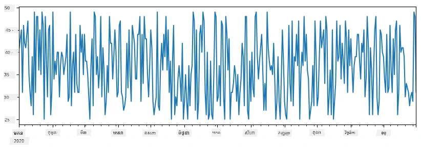
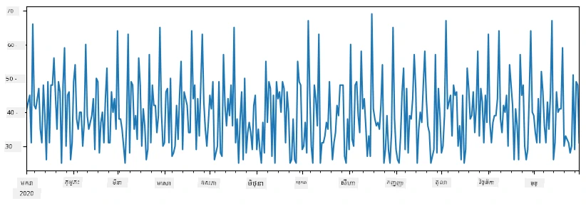
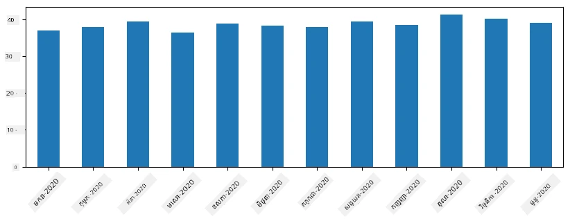
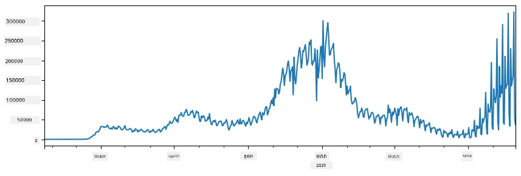
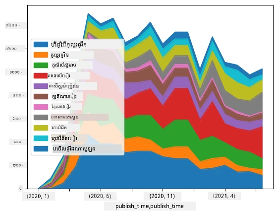

# ការធ្វើការ​ជាមួយទិន្នន័យ៖ Python និងបណ្ណាល័យ Pandas

|  ](../../sketchnotes/07-WorkWithPython.png) |
| :-------------------------------------------------------------------------------------------------------: |
|                 ការធ្វើការ​ជាមួយ Python - _Sketchnote by [@nitya](https://twitter.com/nitya)_                 |

[](https://youtu.be/dZjWOGbsN4Y)

ខណៈដែលមូលដ្ឋានទិន្នន័យផ្តល់នូវវិធីសាស្រ្តមានប្រសិទ្ធភាពខ្ពស់ក្នុងការផ្ទុកទិន្នន័យ និងស្វែងរកតាមភាសាស្វែងរក គន្លឹះបត់បែនបំផុតក្នុងការដំណើរការទិន្នន័យ គឺការសរសេរ​កម្មវិធី​ដើម្បីប្រែក្លាយ​ទិន្នន័យ។ ក្នុង​ច្រើន​ពេលវេលា ការ​ស្វែងរក​មូលដ្ឋាន​ទិន្នន័យ នឹង​ជា​វិធីមាន​ប្រសិទ្ធភាព​ជាង។ ប៉ុន្តែក្នុងករណីខ្លះដែលត្រូវការ​ដំណើរការ​ទិន្នន័យ​ស្មុគស្មាញជាងនេះ វាមិនអាចធ្វើបាន​យ៉ាងងាយស្រួល​នៅ​តាមរយៈ SQL នោះទេ។  
ការដំណើរការទិន្នន័យអាចត្រូវបានកម្មវិធីដោយភាសាបញ្ញាសិប្បនិម្មិតណាមួយក៏បាន ប៉ុន្តែមានភាសាខ្លះៗដែលមានកម្រិតខ្ពស់ជាងទាក់ទងនឹងការធ្វើការជាមួយទិន្នន័យ។ អ្នកវិទ្យាសាស្ត្រទិន្នន័យភាគច្រើនចូលចិត្តប្រើភាសាដូចខាងក្រោម៖

* **[Python](https://www.python.org/)**, ភាសាកម្មវិធីទូទៅមួយ ដែលជាញឹកញាប់ត្រូវបានគេចាត់ទុកថាជាជម្រើសល្អសម្រាប់អ្នកចាប់ផ្តើមដោយសារតែកែបំណងស្រាល។ Python មានបណ្ណាល័យបន្ថែម​ជាច្រើនដែលអាចជួយដោះស្រាយបញ្ហាទូទៅជាច្រើន ដូចជាការដកទិន្នន័យពីឯកសារ ZIP ឬបម្លែងរូបភាពទៅពណ៌ប្រផេះ។ បន្ថែមពីការវិទ្យាសាស្ត្រទិន្នន័យ Python ក៏ត្រូវបានប្រើសម្រាប់ការអភិវឌ្ឍបណ្ដាញគេហទំព័រផងដែរ។  
* **[R](https://www.r-project.org/)** គឺជាឧបករណ៍ប្រអប់ធម្មតាមួយដែលបានបង្កើតសម្រាប់លទ្ធផលដំណើរការទិន្នន័យស្ថិតិ។ វាក៏មានបណ្ណាល័យធំមួយ (CRAN) ដែលធ្វើឱ្យវាជាជម្រើសល្អសម្រាប់ដំណើរការទិន្នន័យ។ តែក្រៅពីវិស័យវិទ្យាសាស្ត្រទិន្នន័យ R មិនមែនជាភាសាកម្មវិធីទូទៅទេ ហើយត្រូវបានប្រើប្រាស់តិចនៅក្រៅវិស័យនេះ។  
* **[Julia](https://julialang.org/)** គឺជាភាសាមួយផ្សេងទៀតដែលបានបង្កើតឡើងជាពិសេសសម្រាប់វិជ្ជាវិទ្យាសាស្ត្រទិន្នន័យ។ វាត្រូវបានគោលបំណងដើម្បីផ្ដល់សមត្ថភាពល្អជាង Python ដែលធ្វើឱ្យវាជាឧបករណ៍ល្អសម្រាប់ការសាកល្បងវិទ្យាសាស្រ្ត។

ក្នុងមេរៀននេះ យើងនឹងផ្តោតលើការប្រើ Python សម្រាប់ដំណើរការទិន្នន័យសាមញ្ញ។ យើងនឹងសន្មត់ថាអ្នកមានការស្គាល់មូលដ្ឋានជាមួយភាសា។ ប្រសិនបើចង់ដឹងបន្ថែមអំពី Python អ្នកអាចយោងទៅកាន់ធនធានចំនួនមួយដូចខាងក្រោម៖

* [រៀន Python យ៉ាងរីករាយជាមួយក្រមសម្លេង Turtle និង Fractals](https://github.com/shwars/pycourse) - វគ្គសិក្សាទី១សម្រាប់ការណែនាំលឿន Python លើ GitHub  
* [ជំហានទីមួយជាមួយ Python](https://docs.microsoft.com/en-us/learn/paths/python-first-steps/?WT.mc_id=academic-77958-bethanycheum) ផ្លូវសិក្សានៅលើ [Microsoft Learn](http://learn.microsoft.com/?WT.mc_id=academic-77958-bethanycheum)

ទិន្នន័យអាចមានរាងដូចជាច្រើន។ ក្នុងមេរៀននេះ យើងនឹងពិចារណាទាំងបីរាងទិន្នន័យ - **ទិន្នន័យតារាង**, **អត្ថបទ** និង **រូបភាព**។

យើងនឹងផ្តោតលើឧទាហរណ៍ជាច្រើននៃការដំណើរការទិន្នន័យ ដោយមិនបង្ហាញរឿងទាំងអស់នៃបណ្ណាល័យដែលទាក់ទង។ វានឹងអនុញ្ញាតឱ្យអ្នកយល់ពីគំនិតសំខាន់នៃអ្វីដែលអាចធ្វើបាន និងទុកឲ្យអ្នកយល់ថាតើគួររកការជំនួយនៅកន្លែងណា ពេលអ្នកត្រូវការ។

> **របៀបណែនាំដ៏មានប្រយោជន៍​បំផុត**។ នៅពេលដែលអ្នកត្រូវការធ្វើប្រតិបត្តិការណ៍ណាមួយលើទិន្នន័យដែលអ្នកមិនដឹងធ្វើដូចម្តេច សូមស្វែងរកវាតាមអ៊ីនធឺណិត។ [Stackoverflow](https://stackoverflow.com/) ជាទូទៅមានគំរូកូដប្រើប្រាស់បានច្រើនក្នុង Python សម្រាប់ភារកិច្ចទូទៅជាច្រើន។ 

## [សំណួរផ្ទេរមុនមេរៀន](https://ff-quizzes.netlify.app/en/ds/quiz/12)

## ទិន្នន័យតារាង និង Dataframes

អ្នកបានស្គាល់ទិន្នន័យតារាងរួចហើយនៅពេលដែលយើងបាននិយាយពីមូលដ្ឋានទិន្នន័យទំនាក់ទំនង។ នៅពេលអ្នកមានទិន្នន័យច្រើន ហើយវាត្រូវបានផ្ទុកក្នុងតារាងភ្ជាប់គ្នាច្រើន វាជាការសមរម្យក្នុងការប្រើ SQL ដើម្បីធ្វើការងារ។ ទោះយ៉ាងណា មានករណីជាច្រើនដែលយើងមានតារាងទិន្នន័យ ហើយយើងត្រូវការទទួលបាន **ការយល់ដឹង** ឬ **ការយល់កាន់តែល្អ** អំពីទិន្នន័យនេះ ដូចជា ចំណែកចាយ និងកការតភ្ជាប់រវាងតម្លៃ។ ក្នុងវិទ្យាសាស្ត្រទិន្នន័យ មានរឿងជាច្រើនដែលយើងត្រូវតែបំលែងទិន្នន័យដើមរួចបង្ហាញវា។ ទាំងពីរវិធីសាស្រ្តនោះអាចធ្វើបានយ៉ាងងាយស្រួលជាមួយ Python។

មានបណ្ណាល័យពីរដែលមានប្រយោជន៍ខ្លាំងក្នុង Python ជួយអ្នកគ្រប់គ្រងទិន្នន័យតារាង៖  
* **[Pandas](https://pandas.pydata.org/)** អនុញ្ញាតឱ្យអ្នកដំណើរការ **Dataframes** ដែលដូចជាតារាងទំនាក់ទំនង។ អ្នកអាចមានជួរឈរឈ្មោះហើយអាចបំពេញប្រតិបត្តិការបានលើជួរដេក ជួរឈរ និង Dataframes ជាទូទៅ។  
* **[Numpy](https://numpy.org/)** ជាបណ្ណាល័យសម្រាប់ការងារជាមួយ **tensor** គឺជា **arrays** ពហុវិមាត្រ។ Array មានតម្លៃពីប្រភេទដូចគ្នា ហើយវាងាយស្រួលជាង DataFrame ប៉ុន្តែផ្តល់នូវប្រតិបត្តិការគណិតវិជ្ជាជាង ហើយបង្កើតចំណាយរចនាសម្ព័ន្ធតិចជាង។

មានបណ្ណាល័យប្លែកៗមួយចំនួនដែលអ្នកគួរតែស្គាល់ផងដែរ៖  
* **[Matplotlib](https://matplotlib.org/)** ជាបណ្ណាល័យប្រើសម្រាប់បង្ហាញទិន្នន័យ និងគូរសៀគ្វីក្រាប  
* **[SciPy](https://www.scipy.org/)** ជាបណ្ណាល័យដែលមានមុខងារវិទ្យាសាស្រ្តបន្ថែម។ យើងបានប្រើបណ្ណាល័យនេះរួចនៅពេលពិភាក្សាអំពីប្រូបាបានិងស្ថិតិ។

នេះជាកូដដែលអ្នកប្រើប្រាស់បាទធម្មតាដើម្បីនាំចូលបណ្ណាល័យទាំងនេះនៅដើមកម្មវិធី Python របស់អ្នក៖  
```python
import numpy as np
import pandas as pd
import matplotlib.pyplot as plt
from scipy import ... # អ្នកត្រូវការបញ្ជាក់កញ្ចប់រងដែលច្បាស់លាស់ដែលអ្នកត្រូវការ
``` 
  
Pandas គឺផ្តោតលើគំនិតបន្ទាត់មូលដ្ឋានមួយចំនួន។

### Series

**Series** ជាជួរតម្លៃមួយ ស្រដៀងនឹងបញ្ជីឬ numpy array។ ខុសគ្នាពិសេសគឺ series មាន **index** ហើយនៅពេលយើងធ្វើប្រតិបត្តិការលើ series (ដូចជា បូករួម) អ្វីដែលកើតឡើងគឺយក index ចូលគិតផង។ Index អាចជាលេខចំនួនគត់ (ដែលគេប្រើលំនាំដើមនៅពេលបង្កើត series ពីបញ្ជី ឬ array) ឬច្រើនដូចជាគ្រាប់កាលបរិច្ឆេទ។

> **ចំណាំ**៖ មានកូដផ្តើមនៃ Pandas នៅក្នុងសៀវភៅសរសេរពិសេស [`notebook.ipynb`](notebook.ipynb)។ យើងបង្ហាញតែឧទាហរណ៍ខ្លះនៅទីនេះ ហើយអ្នកអាចចូលមើលសៀវភៅពេញលេញនេះបាន។

យកឧទាហរណ៍៖ យើងចង់វិភាគការលក់នៅកន្លែងលក់អයිស្ក្រីមរបស់យើង។ មកបង្កើត series សម្រាប់ចំនួនលក់ (ចំនួនទំនិញលក់បានមួយថ្ងៃ) ក្នុងរយៈពេលមួយ៖

```python
start_date = "Jan 1, 2020"
end_date = "Mar 31, 2020"
idx = pd.date_range(start_date,end_date)
print(f"Length of index is {len(idx)}")
items_sold = pd.Series(np.random.randint(25,50,size=len(idx)),index=idx)
items_sold.plot()
```
  


ឥឡូវ suppose រាល់សប្តាហ៍យើងរៀបចំវេទិការីក៏និងយកថង់អයිស្ក្រីមបន្ថែម ១០ កញ្ចប់សម្រាប់បុណ្យ។ យើងអាចបង្កើត series ផ្សេងទៀត ដែល index គឺសប្តាហ៍ ដើម្បីបង្ហាញពីវា៖  
```python
additional_items = pd.Series(10,index=pd.date_range(start_date,end_date,freq="W"))
```
  
ពេលយើងបូក series ពីរជាមួយគ្នា អ្នកទទួលបានចំនួនសរុប៖  
```python
total_items = items_sold.add(additional_items,fill_value=0)
total_items.plot()
```
  


> **ចំណាំ** ថាយើងមិនបានប្រើសរសេរ​សាមញ្ញ `total_items+additional_items` ទេ។ ប្រសិនបើយើងធ្វើវា វានឹងមានតម្លៃ `NaN` (*Not a Number*) ច្រើននៅក្នុង series លទ្ធផល។ នេះដោយសារតែមានតម្លៃបាត់បង់នៅ index មួយចំនួនក្នុង series `additional_items` ហើយបូក `NaN` ជាមួយអ្វីគឺទទួលបាន `NaN`។ ដូច្នេះយើងត្រូវតែបញ្ជាក់តម្លៃ `fill_value` នៅពេលបូក។

ជាមួយ time series យើងអាចអនុវត្ត **resample** លើ series ជាមួយចន្លោះពេលវេលាផ្សេងៗបាន។ ឧទាហរណ៍ suppose យើងចង់គណនាមធ្យមការលក់ប្រចាំខែ។ យើងអាចប្រើកូដដូចខាងក្រោម៖  
```python
monthly = total_items.resample("1M").mean()
ax = monthly.plot(kind='bar')
```
  


### DataFrame

DataFrame ជាជាការប្រមួល series ដែលមាន index ដូចគ្នា។ យើងអាចបង្រួបបង្រួម series ជាច្រើនចូលទៅក្នុង DataFrame៖  
```python
a = pd.Series(range(1,10))
b = pd.Series(["I","like","to","play","games","and","will","not","change"],index=range(0,9))
df = pd.DataFrame([a,b])
```
  
វានឹងបង្កើតតារាងបញ្ឈរ​ដូចខាងក្រោម៖  
|     | 0   | 1    | 2   | 3   | 4      | 5   | 6      | 7    | 8    |
| --- | --- | ---- | --- | --- | ------ | --- | ------ | ---- | ---- |
| 0   | 1   | 2    | 3   | 4   | 5      | 6   | 7      | 8    | 9    |
| 1   | I   | like | to  | use | Python | and | Pandas | very | much |

យើងក៏អាចប្រើ Series ជាជួរឈរ និងបញ្ជាក់ឈ្មោះជួរឈរ ដោយប្រើ dictionary៖  
```python
df = pd.DataFrame({ 'A' : a, 'B' : b })
```
  
វានឹងផ្តល់តារាងដូចខាងក្រោម៖

|     | A   | B      |
| --- | --- | ------ |
| 0   | 1   | I      |
| 1   | 2   | like   |
| 2   | 3   | to     |
| 3   | 4   | use    |
| 4   | 5   | Python |
| 5   | 6   | and    |
| 6   | 7   | Pandas |
| 7   | 8   | very   |
| 8   | 9   | much   |

**ចំណាំ** អ្នកក៏អាចទទួលបានចំណាត់ថ្នាក់តារាងនេះដោយប្ដូរទ្រង់ទ្រាយតារាងមុន ដូចជាសរសេរ  
```python
df = pd.DataFrame([a,b]).T..rename(columns={ 0 : 'A', 1 : 'B' })
```
  
ដែល `.T` មានន័យថាជាប្រតិបត្តិការប្ដូរ​ជួរដេកនិងជួរឈរ DataFrame ហើយ `rename` អនុញ្ញាតឱ្យអ្នកប្ដូរឈ្មោះជួរឈរឱ្យសមល្អដូចឧទាហរណ៍មុន។

ខាងក្រោមជាប្រតិបត្តិការសំខាន់ៗដែលយើងអាចធ្វើបានលើ DataFrames៖

**ជ្រើសជួរឈរ**។ យើងអាចជ្រើសជួរឈរ​ដោយសរសេរ `df['A']` - ប្រតិបត្តិការនេះត្រឡប់ជាមួយ Series។ យើងក៏អាចជ្រើសជួរឈរផ្នែកខ្លះ ចេញជាទំនាក់ទំនងថ្មី ដោយសរសេរ `df[['B','A']]` - វាត្រឡប់ជាមួយ DataFrame ផ្សេងទៀត។

**តម្រង** ជួរដេកជាក់លាក់ដោយលក្ខខណ្ឌ។ ឧទាហរណ៍ ដើម្បីទុកតែជួរដេកដែលជួរឈរ `A` មានតម្លៃធំជាង 5 យើងអាចសរសេរ `df[df['A']>5]`។

> **ចំណាំ** របៀបធ្វើការ​តម្រងគឺ៖ ការប៉ាឡេស្យុង `df['A']<5` ត្រឡប់ជាមួយ series ប៊ូលខាងមុខ បង្ហាញថាតើលក្ខខណ្ឌគឺពិត ឬមិនពិតសម្រាប់ធាតុទោលនីមួយៗក្នុង series ដើម `df['A']`។ នៅពេលដែល series ប៊ូលត្រូវបានប្រើជាអាំងឌិច វាត្រឡប់ជាមួយមាត្រដ្ឋានជួរដេកក្នុង DataFrame។ ដូច្នេះមិនអាចប្រើបញ្ញាពិត/មិនពិត Python ដូចជាសរសេរ `df[df['A']>5 and df['A']<7]` បានទេ។ ត្រូវប្រើប្រតិបត្តិការ `&` លើ boolean series ដូចជា `df[(df['A']>5) & (df['A']<7)]` (*សញ្ញាព័ណនេះចាំបាច់*។)

**បង្កើតជួរឈរថ្មីដែលគណនា​បាន**។ យើងអាចបង្កើតជួរឈរក្នុង DataFrame ជាមួយសមីការផ្សេងៗដោយសាមញ្ញ៖  
```python
df['DivA'] = df['A']-df['A'].mean() 
``` 
  
ឧទាហរណ៍នេះគណនាការប្រែប្រួលរបស់ A ពីតម្លៃមធ្យមរបស់វា។ អ្វីដែលកើតឡើងនៅទីនេះគឺ យើងកំពុងគណនា series មួយ ហើយបន្ទាប់មកចាត់តម្លៃទៅឈាត្បិចឆ្វេង បង្កើតជួរឈរថ្មី។ ដូច្នេះយើងមិនអាចប្រើប្រតិបត្តិការ​អ្វីដែលមិនសមត្ថភាពជាមួយ series​បានទេ។ ឧទាហរណ៍កូដខាងក្រោមខុស៖  
```python
# កូដខុស -> df['ADescr'] = "Low" ប្រសិនបើ df['A'] < 5 ត្រង់នេះ "Hi"
df['LenB'] = len(df['B']) # <- លទ្ធផលខុស
``` 
  
ឧទាហរណ៍ចុងក្រោយទោះជាដោយលក្ខណៈវេយ្យាករណ៍គឺត្រឹមត្រូវ ប៉ុន្តែម្តងម៉ោងវាផ្ដល់លទ្ធផលខុសដោយសារតែវាវាយតម្លៃប្រវែងរបស់ series `B` ទៅកាន់តម្លៃទាំងអស់ នៅក្នុងជួរឈរនៃ DataFrame មិនមែនប្រវែងរបស់ធាតុមួយៗដូចដែលចង់បាន។

ប្រសិនបើយើងត្រូវបង្ហាញអនុគមន៍ស្មុគស្មាញដូចនេះ អាចប្រើមុខងារ `apply`។ ឧទាហរណ៍ចុងក្រោយអាចសរសេរ​ដូចខាងក្រោម៖  
```python
df['LenB'] = df['B'].apply(lambda x : len(x))
# ឬ
df['LenB'] = df['B'].apply(len)
```
  
បន្ទាប់ពីអនុវត្តខាងលើ យើងបាន DataFrame ដូចខាងក្រោម៖

|     | A   | B      | DivA | LenB |
| --- | --- | ------ | ---- | ---- |
| 0   | 1   | I      | -4.0 | 1    |
| 1   | 2   | like   | -3.0 | 4    |
| 2   | 3   | to     | -2.0 | 2    |
| 3   | 4   | use    | -1.0 | 3    |
| 4   | 5   | Python | 0.0  | 6    |
| 5   | 6   | and    | 1.0  | 3    |
| 6   | 7   | Pandas | 2.0  | 6    |
| 7   | 8   | very   | 3.0  | 4    |
| 8   | 9   | much   | 4.0  | 4    |

**ជ្រើសជួរដេកដោយផ្អែកលើលេខ** អាចធ្វើបានដោយប្រើ `iloc`។ ឧទាហរណ៍ ជ្រើសជួរដេកចំនួន 5 ដំបូងពី DataFrame៖  
```python
df.iloc[:5]
```
  
**ការបើកក្រុម** គឺជារឿងជាញឹកញាប់សម្រាប់ទទួលបានលទ្ធផលស្រដៀងនឹង *pivot tables* នៅក្នុង Excel។ suppose យើងចង់គណនាតម្លៃមធ្យមនៃជួរឈរ `A` សម្រាប់ជួរឈរ `LenB` មួយៗ។ ហើយយើងអាចបង្រួម DataFrame ដោយ `LenB` ហើយហៅ `mean`៖  
```python
df.groupby(by='LenB')[['A','DivA']].mean()
```
  
ប្រសិនបើត្រូវការគណនាមធ្យម និងចំនួនធាតុនៅក្នុងក្រុម អ្នកអាចប្រើមុខងារ `aggregate` ស្មុគស្មាញ៖  
```python
df.groupby(by='LenB') \
 .aggregate({ 'DivA' : len, 'A' : lambda x: x.mean() }) \
 .rename(columns={ 'DivA' : 'Count', 'A' : 'Mean'})
```
  
វាបង្ហាញតារាងដូចខាងក្រោម៖

| LenB | Count | Mean     |
| ---- | ----- | -------- |
| 1    | 1     | 1.000000 |
| 2    | 1     | 3.000000 |
| 3    | 2     | 5.000000 |
| 4    | 3     | 6.333333 |
| 6    | 2     | 6.000000 |

### ការទទួលទិន្នន័យ
យើងបានឃើញថាវាងាយស្រួលយ៉ាងដូចម្តេចក្នុងការបង្កើត Series និង DataFrames ពីវត្ថុ Python។ ប៉ុន្តែទិន្នន័យភាគច្រើនមានឡើងក្នុងរូបមន្តនៃឯកសារច្បាប់ ឬតារាង Excel។ โชคดีที่ Pandas ផ្ដល់ជម្រើសមួយសាមញ្ញក្នុងការលោតទិន្នន័យពីឌីស។ ឧទាហរណ៍ ការអានឯកសារ CSV គឺសាមញ្ញដូចខាងក្រោមនេះ៖
```python
df = pd.read_csv('file.csv')
```
យើងនឹងឃើញឧទាហរណ៍បន្ថែមទៀតនៃការលោតទិន្នន័យ រួមទាំងការទាញយកវាពីតំបន់បណ្តាញខាងក្រៅ ក្នុងផ្នែក "ប្រលង"

### ការបោះពុម្ភ និងគំនូស

អ្នកវិទ្យាសាស្ត្រទិន្នន័យភាគច្រើនត្រូវស្វែងរកទិន្នន័យ ដូច្នេះវាជារឿងសំខាន់ក្នុងការអាចមើលឃើញវា។ នៅពេល DataFrame មានទំហំធំ មួយចំនួនយើងត្រូវការតែប្រាកដថាយើងកំពុងធ្វើអ្វីបានត្រឹមត្រូវដោយបោះពុម្ភជួរដើមៗមួយចំនួន។ វាអាចធ្វើបានដោយការហៅ `df.head()`។ ប្រសិនបើអ្នកបង្ហាញវាពី Jupyter Notebook វានឹងបោះពុម្ភ DataFrame ជាទម្រង់តារាងដ៏ស្អាតមួយ។

យើងបានឃើញការប្រើប្រាស់ `plot` ដើម្បីចាក់បង្ហាញជួរឈរមួយចំនួន។ ខណៈដែល `plot` មានប្រយោជន៍សម្រាប់ការងារជាច្រើន ហើយគាំទ្រប្រភេទគំនូសជាច្រើនតាមព្រមានុភាព `kind=` អ្នកអាចតែងតែប្រើបណ្ណាល័យ `matplotlib` ដើមដើម្បីគូរអ្វីដែលស្មុគស្មាញជាងនេះ។ យើងនឹងពិពណ៌នាអំពីការមើលទិន្នន័យយ៉ាងលម្អិតក្នុងមេរៀនវគ្គផ្សេងៗ។

ការពិចារណាទាំងនេះគ្របដណ្តប់គំនិតសំខាន់ៗភាគច្រើនរបស់ Pandas ប៉ុន្តែបណ្ណាល័យនេះមានភាពសម្បូរបែបខ្លាំង ហើយគ្មានដែនកំណត់អ្វីដែលអ្នកអាចធ្វើជាមួយវាទេ! ឥឡូវពួកយើងនឹងអនុវត្តចំណេះដឹងនេះដើម្បីដោះស្រាយបញ្ហាក់្បាស់លាស់មួយ។

## 🚀 ប្រលង ១៖ ការវិភាគការរីករាលដាល COVID

បញ្ហាប្រកាសដែលយើងនឹងផ្តោតទៅលើគឺការមោងម៉ូដែលការរីករាលដាលរោគរាតត្បាត COVID-19។ ដើម្បីធ្វើការនេះ យើងនឹងប្រើទិន្នន័យអំពីចំនួនមនុស្សដែលឆ្លងជួរ​នីមួយៗនៅប្រទេសផ្សេងៗ ដែលបានផ្តល់ដោយ [មជ្ឈមណ្ឌលសង្គមវិជ្ជាសាស្ត្រនិងវិស្វកម្ម](https://systems.jhu.edu/) (CSSE) នៅ [សាកលវិទ្យាល័យ Johns Hopkins](https://jhu.edu/)។ សំណុំទិន្នន័យនេះអាចរកបាននៅក្នុង [សារពើភ័ណ្ឌ GitHub នេះ](https://github.com/CSSEGISandData/COVID-19)។

ដោយសារយើងចង់បង្ហាញពីរបៀបដោះស្រាយទិន្នន័យ អ្នកត្រូវបើកបោះពុម្ភ [`notebook-covidspread.ipynb`](notebook-covidspread.ipynb) ហើយអានវាពីលើផ្ទាំងខាងលើទៅក្រោម។ អ្នកអាចប្រតិបត្តិការ cells ផងនិងធ្វើប្រលងខ្លះដែលយើងបានទុកសម្រាប់អ្នកនៅចុងក្រោយ។



> ប្រសិនបើអ្នកមិនដឹងយ៉ាងដូចម្តេចក្នុងការរត់កូដនៅក្នុង Jupyter Notebook សូមមើល [អត្ថបទនេះ](https://soshnikov.com/education/how-to-execute-notebooks-from-github/)។

## ការធ្វើការជាមួយទិន្នន័យមិនមានរចនាសម្ព័ន្ធ

ខណៈដែលទិន្នន័យភាគច្រើនមានរូបមន្តក្នុងទម្រង់តារាង ករណីខ្លះយើងត្រូវប្រយ័ត្នជាមួយទិន្នន័យដែលមានរចនាសម្ព័ន្ធតិចជាង ដូចជាអត្ថបទឬរូបភាព។ ក្នុងករណីនេះ ដើម្បីអនុវត្តវិធីសាស្ត្របំពានទិន្នន័យដែលយើងបានឃើញខាងលើ អ្នកត្រូវការដកស្រង់ទិន្នន័យដែលមានរចនាសម្ព័ន្ធមួយយ៉ាងណាម្តង។ នេះគឺជាឧទាហរណ៍មួយចំនួន៖

* ដកពាក្យគន្លឹះពីអត្ថបទ ហើយមើលថាពាក្យគន្លឹះអាក្រក់កើតឡើងប៉ុន្មានដង
* ប្រើបណ្តាញប្រសាទដើម្បីលើកឡើងព័ត៌មានអំពីវត្ថុក្នុងរូបភាព
* ទទួលព័ត៌មានអារម្មណ៍របស់មនុស្សក្នុងវីដេអូជាបញ្ចូលពីកាមេរ៉ា

## 🚀 ប្រលង ២៖ ការវិភាគអត្ថបទ COVID

នៅក្នុងប្រលងនេះ យើងនឹងបន្តជាមួយប្រធានបទជំងឺរាតត្បាត COVID ហើយផ្តោតលើការបំពានក្រដាសវិទ្យាសាស្ត្រលើប្រធានបទនេះ។ មានសំណុំទិន្នន័យ [CORD-19 Dataset](https://www.kaggle.com/allen-institute-for-ai/CORD-19-research-challenge) ដែលមានអត្ថបទលើសពី ៧០០០ (នៅពេលសរសេរ) អំពី COVID ដោយផ្ដល់ជាមួយព័ត៌មានមេតា និងសង្ខេប (និងសម្រាប់ប្រហែលពាក់កណ្តាលក្នុងចំណោមគេស្ថិតនៅមានអត្ថបទពេញ)។

ឧទាហរណ៍ពេញលេញនៃការវិភាគសំណុំនេះដោយប្រើសេវាកម្មការយល់ដឹង [Text Analytics for Health](https://docs.microsoft.com/azure/cognitive-services/text-analytics/how-tos/text-analytics-for-health/?WT.mc_id=academic-77958-bethanycheum) ត្រូវបានពិពណ៌នាជារបាយការណ៍ [នៅក្នុងប្លុកនេះ](https://soshnikov.com/science/analyzing-medical-papers-with-azure-and-text-analytics-for-health/)។ យើងនឹងពិភាក្សារបស់កំណែកំណត់ត្រឹមត្រូវនៃការវិភាគនេះ។

> **ចំណាំ**៖ យើងមិនផ្ដល់ចម្លងសំណុំទិន្នន័យជាផ្នែកនៃសារពើភ័ណ្ឌនេះទេ។ អ្នកប្រហែលជាត្រូវទាញយកឯកសារ [`metadata.csv`](https://www.kaggle.com/allen-institute-for-ai/CORD-19-research-challenge?select=metadata.csv) មុនពី [សំណុំទិន្នន័យនេះនៅ Kaggle](https://www.kaggle.com/allen-institute-for-ai/CORD-19-research-challenge)។ អ្នកប្រហែលជាត្រូវចុះឈ្មោះជាមួយ Kaggle ដើម្បីចូលប្រើ។ អ្នកអាចទាញយកសំណុំទិន្នន័យដោយមិនចាំបាច់ចុះឈ្មោះ [នៅទីនេះ](https://ai2-semanticscholar-cord-19.s3-us-west-2.amazonaws.com/historical_releases.html) បែបនេះបានទេ ប៉ុន្តែវានឹងរួមបញ្ចូលអត្ថបទពេញទាំងអស់ក្រៅពីឯកសារ metadata ។

បើក [`notebook-papers.ipynb`](notebook-papers.ipynb) ហើយអានវាពីលើទៅក្រោម។ អ្នកអាចប្រតិបត្តិការចន្លោះទាំងមូល និងធ្វើប្រលងខ្លះដែលយើងបានទុកឲ្យអ្នកនៅចុងក្រោយផងដែរ។



## ការដំណើរការទិន្នន័យរូបភាព

នៅពេលថ្មីៗនេះ ម៉ូដែល AI មានអំណាចខ្លាំងត្រូវបានអភិវឌ្ឍដែលអនុញ្ញាតិឲ្យយើងយល់ពីរូបភាព។ មានកិច្ចការជាច្រើនដែលអាចដោះស្រាយបានដោយប្រើបណ្តាញប្រសាទដែលបានបណ្ដុះបណ្ដាលរួចហើយ ឬសេវាគ្លាពហោស័ណ្ឌ។ ឧទាហរណ៍តូចៗរួមមាន៖

* **ចំណាត់ថ្នាក់រូបភាព** ដែលជួយអោយអ្នកចាត់ថ្នាក់រូបភាពទៅក្នុងថ្នាក់ដែលបានកំណត់រួចមួយ។ អ្នកអាចបណ្ដុះបណ្ដាលម៉ូដែលចំណាត់ថ្នាក់រូបភាពជារបស់ខ្លួនយ៉ាងងាយស្រួលដោយប្រើសេវាកម្មដូចជា [Custom Vision](https://azure.microsoft.com/services/cognitive-services/custom-vision-service/?WT.mc_id=academic-77958-bethanycheum)
* **ការរកឃើញវត្ថុ** ដើម្បីរកវត្ថុផ្សេងៗនៅក្នុងរូបភាព។ សេវាកម្មដូចជា [computer vision](https://azure.microsoft.com/services/cognitive-services/computer-vision/?WT.mc_id=academic-77958-bethanycheum) អាចរកឃើញវត្ថុទូទៅជាច្រើន ហើយអ្នកអាចបណ្ដុះបណ្ដាលម៉ូដែល [Custom Vision](https://azure.microsoft.com/services/cognitive-services/custom-vision-service/?WT.mc_id=academic-77958-bethanycheum) ដើម្បីរកវត្ថុជាក់លាក់មួយចំនួនដែលចាប់អារម្មណ៍។
* **ការរកមុខ** រួមទាំង ការរកអាយុ ភេទ និងអារម្មណ៍។ វាអាចធ្វើបានតាមរយៈ [Face API](https://azure.microsoft.com/services/cognitive-services/face/?WT.mc_id=academic-77958-bethanycheum)។

សេវាកម្មគ្លាពทั้งหมดទាំងអស់ជាច្រើននេះអាចហៅប្រើបានដោយប្រើ [Python SDKs](https://docs.microsoft.com/samples/azure-samples/cognitive-services-python-sdk-samples/cognitive-services-python-sdk-samples/?WT.mc_id=academic-77958-bethanycheum) ហើយដូចនេះអាចបញ្ចូលបានយ៉ាងងាយស្រួលក្នុងដំណើរការស្វែងរកទិន្នន័យរបស់អ្នក។

នេះជាឧទាហរណ៍ខ្លះៗនៃការស្វែងរកទិន្នន័យពីប្រភពទិន្នន័យរូបភាព៖
* នៅក្នុងប្លុក [How to Learn Data Science without Coding](https://soshnikov.com/azure/how-to-learn-data-science-without-coding/) យើងស្វែងរករូបថត Instagram ព្យាយាមយល់ថាអ្វីធ្វើឲ្យមនុស្សចូលចិត្តរូបថតមួយច្រើនជាង។ យើងដកយកព័ត៌មានបានច្រើនបំផុតពីរូបភាពដោយប្រើប្រាស់ [computer vision](https://azure.microsoft.com/services/cognitive-services/computer-vision/?WT.mc_id=academic-77958-bethanycheum) ហើយបន្ទាប់មកប្រើ [Azure Machine Learning AutoML](https://docs.microsoft.com/azure/machine-learning/concept-automated-ml/?WT.mc_id=academic-77958-bethanycheum) ដើម្បីបង្កើតម៉ូដែលដែលអាចពន្យល់បាន។
* នៅក្នុង [Facial Studies Workshop](https://github.com/CloudAdvocacy/FaceStudies) យើងប្រើ [Face API](https://azure.microsoft.com/services/cognitive-services/face/?WT.mc_id=academic-77958-bethanycheum) ដើម្បីស្វែងយល់អារម្មណ៍លើមនុស្សក្នុងរូបថតពីព្រឹត្តិការណ៍ ដើម្បីព្យាយាមយល់ថាអ្វីធ្វើឲ្យមនុស្សសប្បាយចិត្ត។

## សេចក្ដីសន្និដ្ឋាន

មិនថា អ្នកមានទិន្នន័យដែលមានរចនាសម្ព័ន្ធ ឬមិនមានរចនាសម្ព័ន្ធ មុននឹងប្រើ Python អ្នកអាចអនុវត្តជំហានទាំងអស់ដែលពាក់ព័ន្ធនឹងការបំពានទិន្នន័យ និងការយល់ដឹងលើវា។ វាជារបៀបដែលរាបស្រាយបំផុតក្នុងការបំពានទិន្នន័យ ហើយនេះគឺជាហេតុផលដែលភាគច្រើនអ្នកវិទ្យាសាស្ត្រ ទិន្នន័យប្រើប្រាស់ Python ជាឧបករណ៍ដើមរបស់ពួកគេ។ ការរៀន Python ជ្រៅជាងគឺជាគំនិតល្អ ប្រសិនបើអ្នកចង់ធ្វើជាអ្នកវិទ្យាសាស្ត្រ ទិន្នន័យយ៉ាងស្មោះត្រង់!

## [សំនួរសរសេរបង្ហាញក្រោយមេរៀន](https://ff-quizzes.netlify.app/en/ds/quiz/13)

## ការពិនិត្យឡើងវិញ និងការសិក្សាផ្ទាល់ខ្លួន

**សៀវភៅ**
* [Wes McKinney. Python for Data Analysis: Data Wrangling with Pandas, NumPy, and IPython](https://www.amazon.com/gp/product/1491957662)

**ធនធានអនឡាញ**
* មេរៀនផ្លូវការជាចំនួន [១០ នាទីទៅ Pandas](https://pandas.pydata.org/pandas-docs/stable/user_guide/10min.html)
* [ឯកសារអំពីការមើលទិន្នន័យ Pandas Visualization](https://pandas.pydata.org/pandas-docs/stable/user_guide/visualization.html)

**ការរៀន Python**
* [រៀន Python ជាមួយកម្រងតុក្កតា និងរាង Fractals ដោយរីករាយ](https://github.com/shwars/pycourse)
* [ចាប់ផ្តើមជំហានដំបូងជាមួយ Python](https://docs.microsoft.com/learn/paths/python-first-steps/?WT.mc_id=academic-77958-bethanycheum) ផ្លូវការសិក្សា នៅលើ [Microsoft Learn](http://learn.microsoft.com/?WT.mc_id=academic-77958-bethanycheum)

## បេសកកម្ម

[អនុវត្តការសិក្សាទិន្នន័យអោយលម្អិតជាងនេះសម្រាប់ប្រលងខាងលើ](assignment.md)

## អំណោយផល

មេរៀននេះត្រូវបានសរសេរជាមួយ ♥️ ដោយ [Dmitry Soshnikov](http://soshnikov.com)

---

<!-- CO-OP TRANSLATOR DISCLAIMER START -->
**ការបដិសេធ**៖  
ឯកសារនេះត្រូវបានបកប្រែដោយប្រើសេវាបកប្រែ AI [Co-op Translator](https://github.com/Azure/co-op-translator)។ ខណៈពេលយើងខិតខំអោយបានភាពត្រឹមត្រូវ សូមយល់ថាការបកប្រែដោយស្វ័យប្រវត្តិក្ដីអាចមានកំហុស ឬភាពមិនត្រឹមត្រូវ។ ឯកសារដើមក្នុងភាសារដើមគួរត្រូវបានយកជាអនុស្សាវរីយ៍ដ៏ទាន់សម័យ។ សម្រាប់ព័ត៌មានដែលមានសារៈសំខាន់ ការបកប្រែដោយអ្នកជំនាញមនុស្សត្រូវបានណែនាំ។ យើងមិនទទួលខុសត្រូវចំពោះការយល់ច្រឡំ ឬការបកបفا្ציותខុសដែលកើតឡើងពីការប្រើប្រាស់ការបកប្រែនេះឡើយ។
<!-- CO-OP TRANSLATOR DISCLAIMER END -->