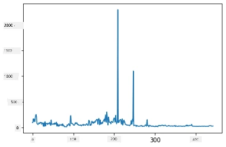
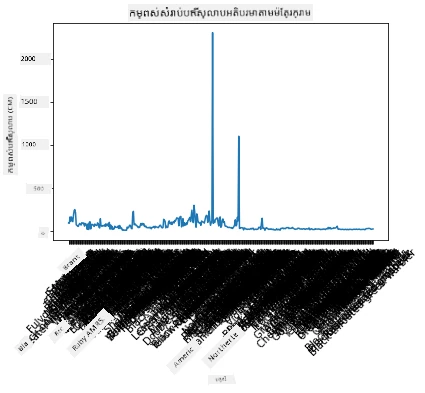
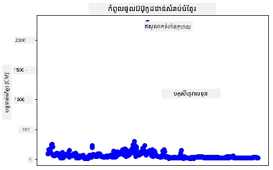
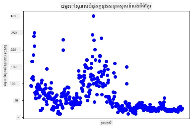
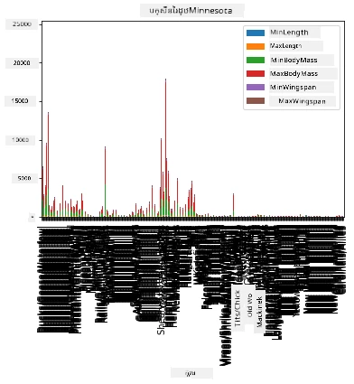
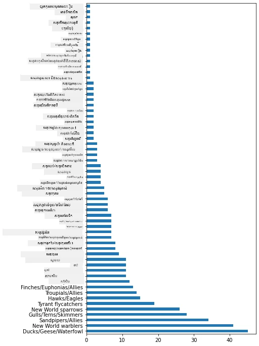
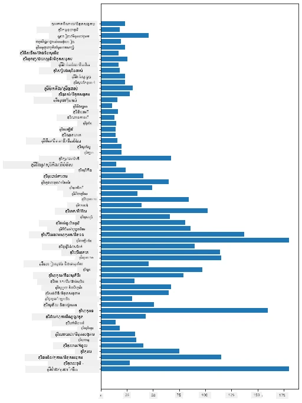
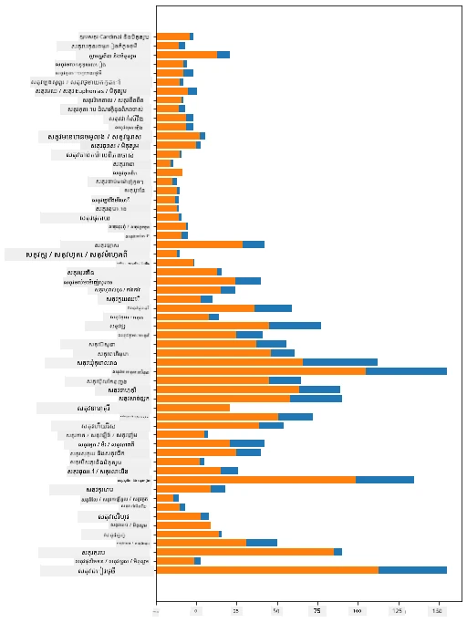

# ការមើលឃើញចំនួន

| ](../../sketchnotes/09-Visualizing-Quantities.png)|
|:---:|
| ការមើលឃើញចំនួន - _Sketchnote ដោយ [@nitya](https://twitter.com/nitya)_ |

ក្នុងមេរៀននេះ អ្នកនឹងសិក្សាថាតើធ្វើដូចម្តេចដើម្បីប្រើប្រាស់មួយក្នុងន័យបណ្ណាល័យ Python ជាច្រើនដែលមានស្រាប់ ដើម្បីរៀនពីរបៀបបង្កើតការមើលឃើញដែលគួរឲ្យចាប់អារម្មណ៍ជុំវិញគំនិតនៃចំនួន។ ដោយប្រើតំណាងទិន្នន័យបានស្អាតពាក់ព័ន្ធនឹងសត្វបក្សីនៅ Minnesota អ្នកអាចស្វែងរកគំនិតច្រើនដែលគួរឲ្យចាប់អារម្មណ៍អំពីសត្វព្រៃក្នុងតំបន់។

## [សំនួរសាកល្បងមុនសម្ភាសន៍](https://ff-quizzes.netlify.app/en/ds/quiz/16)

## ពិនិត្យមើលទំហំនៃស្លាបជាមួយ Matplotlib

បណ្ណាល័យល្អមួយសម្រាប់បង្កើតក្រาฟសាមញ្ញ និងស្មុគស្មាញជាច្រើនគឺ [Matplotlib](https://matplotlib.org/stable/index.html)។ ជារួម វិធីសាស្ត្រនៃការគូរទិន្នន័យដោយប្រើបណ្ណាល័យទាំងនេះរួមមាន ការរកឃើញផ្នែកនៃអង់ត្រូសម្រាប់ដាតាដែលអ្នកចង់ផ្តោត, ការប្រែក្លាយទិន្នន័យដែលចាំបាច់, ការផ្ដល់តម្លៃ axis x និង y, ការជ្រើសរើសប្រភេទក្រាផត្រីដែលត្រូវបង្ហាញ ហើយបង្ហាញប្រាប់។ Matplotlib ផ្តល់ជូននូវការមើលឃើញជាច្រើនបំផុត ប៉ុន្តសម្រាប់មេរៀននេះបន្ទាប់មក តោះផ្ដោតទៅលើរូបមន្តដែលសមស្របសម្រាប់ការមើលឃើញចំនួន៖ គំនូរជួរឈរ រូប Scatter និងរូបបារ។

> ✅ ប្រើក្រាផត្រីល្អបំផុតសម្រាប់រចនាសម្ព័ន្ធទិន្នន័យរបស់អ្នក និងរឿងដែលអ្នកចង់ប្រាប់។
> - ដើម្បីវិភាគនិន្នាការជាមួួយបន្ទាត់ពេលវេលា: ជួរឈរ
> - ដើម្បីប្រៀបធៀបទិន្នន័យ: បារ, ជួរឈរ, ខ្នាតមូល, រូប scatterplot
> - ដើម្បីបង្ហាញពីរបៀបដែលផ្នែកផ្សេងទាក់ទងនឹងសរុប: ខ្នាតមូល
> - ដើម្បីបង្ហាញការចែកចាយនៃទិន្នន័យ: រូប scatterplot, បារ
> - ដើម្បីបង្ហាញនិន្នាការ: ជួរឈរ, ជួរឈរ
> - ដើម្បីបង្ហាញទំនាក់ទំនងនៃតម្លៃ: ជួរឈរ, រូប scatterplot, រ៉ុងប៊ុល

បើអ្នកមានតារាងទិន្នន័យ ហើយត្រូវការរកមើលថាតើមានប៉ុន្មាននៅក្នុងធាតុដែលបានផ្ដល់ អ្នកនឹងត្រូវចាប់ផ្តើមដោយការត្រួតពិនិត្យតម្លៃរបស់វា។

✅ មាន 'cheat sheets' ល្អមួយសម្រាប់ Matplotlib [នៅទីនេះ](https://matplotlib.org/cheatsheets/cheatsheets.pdf)។

## បង្កើតរូបជួរឈរអំពីតម្លៃទំហំនៃស្លាបសត្វបក្សី

បើកឯកសារ `notebook.ipynb` នៅទីតាំងដើមនៃថតមេរៀននេះ ហើយបន្ថែមកោសិកាចាស់មួយ។

> ទំនាក់ទំនង៖ ទិន្នន័យកាន់ទុកនៅដើម repo នេះក្នុងថត `/data`។

```python
import pandas as pd
import matplotlib.pyplot as plt
birds = pd.read_csv('../../data/birds.csv')
birds.head()
```
ទិន្នន័យនេះជាចម្រុះនៃអក្សរ និងលេខ៖


|      | Name                         | ScientificName         | Category              | Order        | Family   | Genus       | ConservationStatus | MinLength | MaxLength | MinBodyMass | MaxBodyMass | MinWingspan | MaxWingspan |
| ---: | :--------------------------- | :--------------------- | :-------------------- | :----------- | :------- | :---------- | :----------------- | --------: | --------: | ----------: | ----------: | ----------: | ----------: |
|    0 | Black-bellied whistling-duck | Dendrocygna autumnalis | Ducks/Geese/Waterfowl | Anseriformes | Anatidae | Dendrocygna | LC                 |        47 |        56 |         652 |        1020 |          76 |          94 |
|    1 | Fulvous whistling-duck       | Dendrocygna bicolor    | Ducks/Geese/Waterfowl | Anseriformes | Anatidae | Dendrocygna | LC                 |        45 |        53 |         712 |        1050 |          85 |          93 |
|    2 | Snow goose                   | Anser caerulescens     | Ducks/Geese/Waterfowl | Anseriformes | Anatidae | Anser       | LC                 |        64 |        79 |        2050 |        4050 |         135 |         165 |
|    3 | Ross's goose                 | Anser rossii           | Ducks/Geese/Waterfowl | Anseriformes | Anatidae | Anser       | LC                 |      57.3 |        64 |        1066 |        1567 |         113 |         116 |
|    4 | Greater white-fronted goose  | Anser albifrons        | Ducks/Geese/Waterfowl | Anseriformes | Anatidae | Anser       | LC                 |        64 |        81 |        1930 |        3310 |         130 |         165 |

យើងចាប់ផ្ដើមដោយគូរទិន្នន័យចំនួនមួយចំនួនដោយប្រើរូបជួរឈរមូលដ្ឋានមួយ។ សន្និដ្ឋានថាអ្នកចង់បានទេសភាពទំហំស្លាបអតិបរមារបស់បក្សីទាំងនេះ។

```python
wingspan = birds['MaxWingspan'] 
wingspan.plot()
```


តើអ្នកសង្កេតអ្វីបានខ្លះភ្លាមៗ? មានរាងមួយពិតជា outlier - នោះគឺទំហំស្លាបដ៏ធំមួយ! ទំហំនៃស្លាប 2300 សង់ទីម៉ែត្រ ស្មើនឹង 23 ម៉ែត្រ - តើមានសត្វ Pterodactyls រត់លេង នៅ Minnesota ទេ? តោះស៊ើបអង្កេត។

បើទោះបីអ្នកអាចធ្វើការតម្រៀបឆាប់ក្នុង Excel ដើម្បីស្វែងរកអ្នកនៅក្រៅស្តង់ដារ (outliers) ដែលប្រហែលជាជាកំហុស អ្នកបន្តធ្វើដំណើរការមើលឃើញដោយធ្វើការងារពីខាងក្នុងរូប។

បន្ថែមស្លាកចុះបញ្ជាក់ទៅលើរង-x ដើម្បីបង្ហាញថាសត្វបក្សីណាខ្លះដែលត្រូវបានពិចារណា៖

```
plt.title('Max Wingspan in Centimeters')
plt.ylabel('Wingspan (CM)')
plt.xlabel('Birds')
plt.xticks(rotation=45)
x = birds['Name'] 
y = birds['MaxWingspan']

plt.plot(x, y)

plt.show()
```


ទោះបីមានការបង្វិលស្លាកបានកំណត់ទៅ ៤៥ កុំផ្នែក ក៏មានច្រើនពេកមិនអាចអានបាន។ តោះសាកល្បងយុទ្ធសាស្ត្រផ្សេងទៀត៖ ស្លាកគ្រាប់ថ្មីប៉ុណ្ណោះ ហើយកំណត់ស្លាកនៅក្នុងតារាង។ អ្នកអាចប្រើរូប scatter ដើម្បីធ្វើឲ្យមានកន្លែងសម្រាប់ស្លាកច្រើនជាងមុន៖

```python
plt.title('Max Wingspan in Centimeters')
plt.ylabel('Wingspan (CM)')
plt.tick_params(axis='both',which='both',labelbottom=False,bottom=False)

for i in range(len(birds)):
    x = birds['Name'][i]
    y = birds['MaxWingspan'][i]
    plt.plot(x, y, 'bo')
    if birds['MaxWingspan'][i] > 500:
        plt.text(x, y * (1 - 0.05), birds['Name'][i], fontsize=12)
    
plt.show()
```
តើមានអ្វីកើតឡើងនៅទីនេះ? អ្នកបានប្រើ `tick_params` ដើម្បីលាក់ស្លាកខាងក្រោម ហើយបន្ទាប់មកបានបង្កើតរង្វិលលើសំណុំទិន្នន័យសត្វបក្សីរបស់អ្នក។ តាងរូបជាមួយចំណុចតូចពណ៌ខៀវ ដោយប្រើ `bo` អ្នកបានពិនិត្យមើលបក្សីណាមួយដែលមានទំហំស្លាបអតិបរមាច្រើនជាង ៥០០ ហើយបង្ហាញស្លាករបស់ពួកវាចាស់ជាប់ជាមួយចំណុចបើបើដូច្នេះ។ អ្នកបានផ្លាស់ទីស្លាកបន្តិចនៅលើអ័ក្ស y (`y * (1 - 0.05)`) ហើយប្រើឈ្មោះសត្វបក្សីជាស្លាក។

តើអ្នកបានរកឃើញអ្វី?



## ស្កេនទិន្នន័យរបស់អ្នក

ទាំង Bald Eagle និង Prairie Falcon ទោះបីជាមិនមែនបក្សីតូចទេក៏ដោយ ប្រហែលជា​បានដាក់ស្លាកខុស ដោយបញ្ចូល `0` ផ្សេងទៀតទៅក្នុងទំហំស្លាបអតិបរមា។ មិនសមរម្យទេដែលអ្នកជួប Bald Eagle ដែលមានទំហំស្លាប ២៥ ម៉ែត្រ បើបើដូច្នេះ សូមប្រាប់ឲ្យយើងដឹង! តោះបង្កើត dataframe ថ្មីមួយដោយគ្មានអ្នកមានចំណុចក្រៅស្តង់ដារទាំងពីរនេះ៖

```python
plt.title('Max Wingspan in Centimeters')
plt.ylabel('Wingspan (CM)')
plt.xlabel('Birds')
plt.tick_params(axis='both',which='both',labelbottom=False,bottom=False)
for i in range(len(birds)):
    x = birds['Name'][i]
    y = birds['MaxWingspan'][i]
    if birds['Name'][i] not in ['Bald eagle', 'Prairie falcon']:
        plt.plot(x, y, 'bo')
plt.show()
```


ដោយការសសៃចេញចំណុចក្រៅស្តង់ដា ទិន្នន័យរបស់អ្នកឥឡូវនេះមានសមាសភាពល្អ និងងាយស្រួលយល់។



ឥឡូវនេះយើងមាន dataset ដែលបានជ្រៅស្អាតយ៉ាងហោចណាស់ក្នុងវិស័យទំហំស្លាប ចូររកឃើញព័ត៌មានបន្ថែមអំពីសត្វបក្សីទាំងនេះ។

ខណៈដែលរូបជួរឈរ និង scatterplot អាចបង្ហាញព័ត៌មានអំពីតម្លៃទិន្នន័យ និងការចែកចាយរបស់វា ប៉ុន្តា យើងចង់គិតអំពីតម្លៃដែលមាននៅក្នុង dataset នេះ។ អ្នកអាចបង្កើតការមើលឃើញដើម្បីឆ្លើយសំនួរបន្ថែមអំពីចំនួន៖

> តើមានប៉ុន្មានប្រភេទសត្វបក្សី និងតើពួកវាមានចំនួនប៉ុន្មាន?
> តើមានប៉ុន្មានជាបក្សីដែលស្រុតស្រយាល បញ្ហាទឹកជំនន់ កម្រ តន្ត្រី ឬធម្មតា?
> តើមានប៉ុន្មាននៅក្នុងចំណាត់ថ្នាក់ជិនិងការបញ្ជីលំដាប់តាមផែនការលីណេអូ?

## ស្រាវជ្រាវរូបបារ

រូបបារ មានប្រយោជន៍នៅពេលអ្នកត្រូវបង្ហាញក្រុមនៃទិន្នន័យ។ តោះស្រាវជ្រាវប្រភេទសត្វបក្សីដែលមាននៅក្នុង dataset ដើម្បីមើលថាតើប្រភេទណាមានច្រើនបំផុត។

នៅក្នុងឯកសារ notebook បង្កើតរូបបារសាមញ្ញមួយ។

✅ សម្គាល់ អ្នកអាចស្កីនចេញពីបក្សីចំណុចក្រោយណាមួយដែលបានកំណត់ពីមុន កែសម្រួលកំហុសនៅចំណុចទំហំស្លាបរបស់ពួកគេ ឬទុកពួកគេនៅក្នុងការប្រើប្រាស់ប្រឡងទាំងនេះដែលមិនគិតពីតម្លៃទំហំស្លាប។

បើអ្នកចង់បង្កើតរូបបារ អ្នកអាចជ្រើសរើសទិន្នន័យដែលចង់ផ្តោត។ រូបបារអាចបង្កើតពីទិន្នន័យដើម៖

```python
birds.plot(x='Category',
        kind='bar',
        stacked=True,
        title='Birds of Minnesota')

```


រូបបារនេះ ពិតមែន មិនអាចអានបាន ព្រោះមានទិន្នន័យមិនសម្រាប់ក្រុមច្រើនពេក។ អ្នកត្រូវលៃតម្រូវតែជ្រើសទិន្នន័យដែលចង់គូរតែប៉ុណ្ណោះ។ តោះមកមើលប្រវែងបក្សីផ្អែកលើប្រភេទ។

ស្កេនទិន្នន័យរបស់អ្នក ដើម្បីរួមបញ្ចូលតែប្រភេទសត្វបក្សី។

✅ សូមចំណាំថា អ្នកប្រើ Pandas ដើម្បីគ្រប់គ្រងទិន្នន័យ ហើយបន្ទាប់មកអោយ Matplotlib សម្រាប់បង្កើតរូប។

ដោយសារតែមានប្រភេទជាច្រើន អ្នកអាចបង្ហាញរូបនេះជាតំណើងឈររង្វ្រឹង ហើយកែទំងន់របស់វាដើម្បីគ្រប់គ្រងទិន្នន័យទាំងមូល៖

```python
category_count = birds.value_counts(birds['Category'].values, sort=True)
plt.rcParams['figure.figsize'] = [6, 12]
category_count.plot.barh()
```


រូបបារនេះបង្ហាញទស្សនៈល្អនៃចំនួនបក្សីនៅក្នុងប្រភេទនីមួយៗ។ ក្នុងមួយទស្សន៏ជូនភ្នែក អ្នកឃើញចំនួនសត្វបក្សីច្រើនបំផុតនៅតំបន់នេះស្ថិតនៅក្នុងប្រភេទ Ducks/Geese/Waterfowl។ Minnesota ត្រូវបានគេស្គាល់ថាជា 'ដីជ្រលងទឹក ១០,០០០' ដូច្នេះវាគ្មានអ្វីអាថ៌កំបាំងឡើយ!

✅ សាកល្បងគណនាផ្សេងៗលើ dataset នេះ។ តើមានអ្វីជាមិនចំអក្សរអ្នកទេ?

## ប្រៀបធៀបទិន្នន័យ

អ្នកអាចសាកល្បងប្រៀបធៀបទិន្នន័យក្រុមផ្សេងៗដោយបង្កើតអក្សផ្ទាល់ខ្លួនថ្មី។ សាកល្បងប្រៀបធៀបទិន្នន័យ MaxLength នៃសត្វផ្អែកលើប្រភេទរបស់វា៖

```python
maxlength = birds['MaxLength']
plt.barh(y=birds['Category'], width=maxlength)
plt.rcParams['figure.figsize'] = [6, 12]
plt.show()
```


គ្មានអ្វីដែលអស្ចារ្យនៅទីនេះទេ៖ សត្វ hummingbirds មាន MaxLength តិចជាង Pelicans ឬ Geese។ វាល្អប្រាកដនៅពេលដែលទិន្នន័យមានហេតុផលច្បាស់លាស់!

អ្នកអាចបង្កើតការមើលឃើញគួរឲ្យចាប់អារម្មណ៍ជាងនៅរូបបារ ដោយការលាយបញ្ចូលទិន្នន័យ។ តោះសំឡេងលើ Minimum និង Maximum Length ក្នុងប្រភេទសត្វឲ្យឃើញ៖

```python
minLength = birds['MinLength']
maxLength = birds['MaxLength']
category = birds['Category']

plt.barh(category, maxLength)
plt.barh(category, minLength)

plt.show()
```
នៅក្នុងរូបនេះ អ្នកអាចឃើញជួរតម្លៃក្នុងប្រភេទសត្វនីមួយនៃ Minimum Length និង Maximum Length។ អ្នកអាចនិយាយយ៉ាងស្ងប់ស្ងាត់ថា ដោយផ្អែកលើទិន្នន័យនេះ បក្សីធំនានឹងមានជួរត្រង់ប្រវែងធំបំផុត។ វាគួរឲ្យចាប់អារម្មណ៍ណាស់!



## 🚀 បញ្ហា

Dataset សត្វបក្សីនេះផ្តល់ព័ត៌មានច្រើនអំពីប្រភេទសត្វបក្សីផ្សេងៗនៅក្នុងបរិស្ថានជាក់លាក់មួយ។ ស្វែងរកនៅលើអ៊ីនធឺណិត បើអ្នកអាចរកឃើញ dataset ស្វាគមន៍ផ្សេងទៀតដែលទាក់ទងនឹងសត្វបក្សី។ ចូរប្រឡងបង្កើតក្រាផត្រីនិងក្រាហ្វនៅជុំវិញបក្សីទាំងនេះ ដើម្បីស្វែងរកបច្ចេកវិទ្យាដែលអ្នកមិនបានដឹងមុន។

## [សំនួរផ្នែកក្រោយសម្ភាសន៍](https://ff-quizzes.netlify.app/en/ds/quiz/17)

## ទិដ្ឋភាពទូទៅ និងសិក្សាផ្ទាល់ខ្លួន

មេរៀនដំបូងនេះបានផ្តល់ព័ត៌មានពីរបៀបប្រើ Matplotlib ដើម្បីមើលឃើញចំនួន ខណៈអធិប្បាយពីវិធីផ្សេងទៀតសម្រាប់ធ្វើការជាមួយ dataset ដើម្បីមើលឃើញ។ [Plotly](https://github.com/plotly/plotly.py) គឺជារបៀបមួយដែលយើងមិនលើកឡើងក្នុងមេរៀនទាំងនេះ ដូច្នេះសូមមើលវាថាតើវាផ្តល់អ្វីខ្លះ។

## សំណើការងារ

[ជួរ, Scatter និង បារ](assignment.md)

---

<!-- CO-OP TRANSLATOR DISCLAIMER START -->
**ការបញ្ចាក់**៖
ឯកសារនេះត្រូវបានបកប្រែក្នុងការប្រើប្រាស់សេវាកម្មបកប្រែកាន់តែប្រសើរដោយAI [Co-op Translator](https://github.com/Azure/co-op-translator)។ ខណៈពេលដែលយើងខំប្រឹងរកការពិតប្រាកដ សូមចាប់អារម្មណ៍ថាការបកប្រែដោយស្វ័យប្រវត្តិអាចមានកំហុស ឬភាពមិនច្បាស់លាស់។ ឯកសារដើមក្នុងភាសា​ដើមគួรถูกមើលជាមូលដ្ឋានដែលមានអំណាច។ សម្រាប់ព័ត៌មានសំខាន់ៗ គួរតែមានការបកប្រែដោយមនុស្សជំនាញវិជ្ជាជីវៈ។ យើងមិនទទួលខុសត្រូវចំពោះការយល់ច្រឡំ ឬការបកស្រាយខុសពីការប្រើប្រាស់ការបកប្រែនេះទេ។
<!-- CO-OP TRANSLATOR DISCLAIMER END -->