# ការបង្ហាញចែកចាយទិន្នន័យ

| ](../../sketchnotes/10-Visualizing-Distributions.png)|
|:---:|
| ការបង្ហាញចែកចាយទិន្នន័យ - _ស្កេតឈូកដោយ [@nitya](https://twitter.com/nitya)_ |

ក្នុងមេរៀនមុន អ្នកបានរៀនពីព័ត៌មានចំណាប់អារម្មណ៍ខ្លះខាងលើសំណុំទិន្នន័យដែលពាក់ព័ន្ធនឹងបក្សីនៅរដ្ឋ Minnesota។ អ្នកបានរកឃើញទិន្នន័យដែលមានកំហុសដោយការបង្ហាញ outliers និងបានមើលភាគខុសគ្នារវាងប្រភេទបក្សីតាមប្រវែងអតិបរមារបស់ពួកវា។

## [សំណួរលំហាត់មុនវគ្គសិក្សា](https://ff-quizzes.netlify.app/en/ds/quiz/18)
## ស្រាវជ្រាវសំណុំទិន្នន័យបក្សី

វិធីមួយផ្សេងទៀតក្នុងការចូលទៅក្នុងទិន្នន័យគឺដោយមើលការចែកចាយរបស់វា ឬរបៀបដែលទិន្នន័យត្រូវបានរៀបចំតាមអ័ក្សមួយ។ ប្រហែលជាអ្នកចង់រៀនអំពីការចែកចាយទូទៅ សម្រាប់សំណុំទិន្នន័យនេះ អំពីកម្រិតអតិបរមានៃបណ្តោយ​ស្លាប ឬ massas សារពាង្គកាយអតិបរមាសម្រាប់បក្សីនៅ Minnesota។

យើងត្រូវស្វែងយល់ពីព័ត៌មានខ្លះក៏អំពីការចែកចាយទិន្នន័យក្នុងសំណុំទិន្នន័យនេះ។ នៅក្នុងឯកសារ _notebook.ipynb_ នៅដើមថតមេរៀននេះ សូមនាំចូល Pandas, Matplotlib និងទិន្នន័យរបស់អ្នក៖

```python
import pandas as pd
import matplotlib.pyplot as plt
birds = pd.read_csv('../../data/birds.csv')
birds.head()
```

|      | Name                         | ScientificName         | Category              | Order        | Family   | Genus       | ConservationStatus | MinLength | MaxLength | MinBodyMass | MaxBodyMass | MinWingspan | MaxWingspan |
| ---: | :--------------------------- | :--------------------- | :-------------------- | :----------- | :------- | :---------- | :----------------- | --------: | --------: | ----------: | ----------: | ----------: | ----------: |
|    0 | Black-bellied whistling-duck | Dendrocygna autumnalis | Ducks/Geese/Waterfowl | Anseriformes | Anatidae | Dendrocygna | LC                 |        47 |        56 |         652 |        1020 |          76 |          94 |
|    1 | Fulvous whistling-duck       | Dendrocygna bicolor    | Ducks/Geese/Waterfowl | Anseriformes | Anatidae | Dendrocygna | LC                 |        45 |        53 |         712 |        1050 |          85 |          93 |
|    2 | Snow goose                   | Anser caerulescens     | Ducks/Geese/Waterfowl | Anseriformes | Anatidae | Anser       | LC                 |        64 |        79 |        2050 |        4050 |         135 |         165 |
|    3 | Ross's goose                 | Anser rossii           | Ducks/Geese/Waterfowl | Anseriformes | Anatidae | Anser       | LC                 |      57.3 |        64 |        1066 |        1567 |         113 |         116 |
|    4 | Greater white-fronted goose  | Anser albifrons        | Ducks/Geese/Waterfowl | Anseriformes | Anatidae | Anser       | LC                 |        64 |        81 |        1930 |        3310 |         130 |         165 |


ដោយទូទៅ អ្នកអាចមើលឲ្យឆាប់រហ័សពីរបៀបដែលទិន្នន័យត្រូវបានចែកចាយ ដោយប្រើរចនាប័ទ្ម scatter plot ដូចដែលយើងបានធ្វើក្នុងមេរៀនមុន៖

```python
birds.plot(kind='scatter',x='MaxLength',y='Order',figsize=(12,8))

plt.title('Max Length per Order')
plt.ylabel('Order')
plt.xlabel('Max Length')

plt.show()
```
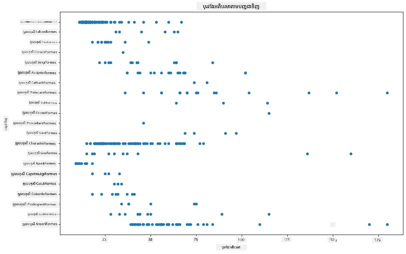

នេះផ្តល់ឱ្យនូវទិដ្ឋភាពទូទៅអំពីការចែកចាយរេសមាយប្រវែងសារពាង្គកាយក្នុងមួយបក្សី តាមក្រុម Order ប៉ុន្តែមិនមែនជារបៀបល្អបំផុតក្នុងការបង្ហាញការចែកចាយពិតប្រាកដទេ។ ការងារនេះភាគច្រើនត្រូវបានគ្រប់គ្រងដោយការបង្កើត Histogram។
## ការដំណើរការជាមួយ histograms

Matplotlib ផ្តល់នូវវិធីល្អណាស់ក្នុងការបង្ហាញការចែកចាយទិន្នន័យដោយប្រើ Histograms។ ប្រភេទតារាងនេះមានរូបរាងដូចជាតារាងបារ ដែលការចែកចាយអាចមើលឃើញតាមរបៀបឡើង និងចុះនៃបារ។ ដើម្បីបង្កើត histogram អ្នកត្រូវការទិន្នន័យជាតួចំនួន។ ដើម្បីបង្កើត Histogram អ្នកអាចគូសតារាងដោយកំណត់ប្រភេទជា 'hist' សម្រាប់ Histogram។ តារាងនេះបង្ហាញនូវការចែកចាយនៃ MaxBodyMass សម្រាប់ចន្លោះទិន្នន័យជាច្រើនរួមទាំងទាំងសំណុំទិន្នន័យ។ ដោយបែងចែកអារេនៃទិន្នន័យដែលបានផ្តល់ជាព្រំដែនតូចៗ វាអាចបង្ហាញការចែកចាយនៃតម្លៃទិន្នន័យ៖

```python
birds['MaxBodyMass'].plot(kind = 'hist', bins = 10, figsize = (12,12))
plt.show()
```
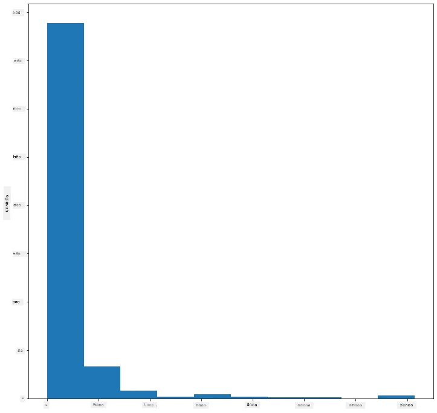

ដូចដែលអ្នកអាចមើលឃើញ តួចំនួនភាគច្រើនពីបក្សីច្រើនជាង ៤០០ ត្រូវបានដាក់នៅក្នុងចន្លោះក្រោម ២០០០ សម្រាប់ Max Body Mass របស់ពួកវា។ សូមទទួលបានអំណាចកាន់តែច្រើនលើទិន្នន័យដោយការប្ដូរព៉ារ៉ាម៉ែត្រ `bins` ទៅចំនួនខ្ពស់ជាងនេះ ប្រហែល ៣០៖

```python
birds['MaxBodyMass'].plot(kind = 'hist', bins = 30, figsize = (12,12))
plt.show()
```
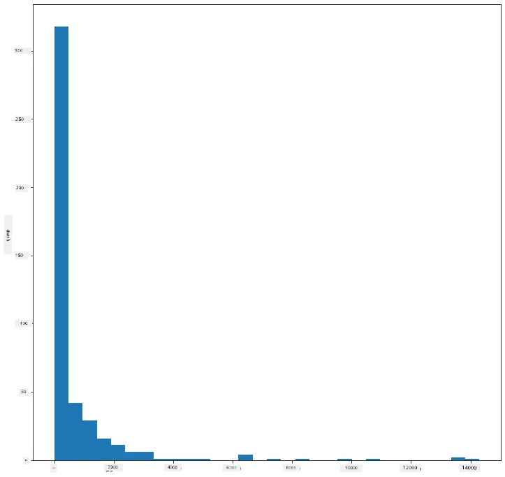

តារាងនេះបង្ហាញការចែកចាយដោយមានលំអិតបន្ថែម។ តារាងមួយដែលមិនបត់ទៅឆ្វេងច្រើនអាចត្រូវបានបង្កើតដោយធ្វើឲ្យប្រាកដថាអ្នកជ្រើសតែទិន្នន័យត្រឹម​ក្នុងចន្លោះជាក់លាក់មួយ៖

ធ្វើតម្រងទិន្នន័យរបស់អ្នកឲ្យទទួលបានតែបក្សីដែល mass នៃរូបកាយមានតិចជាង ៦០ ហើយបង្ហាញ ៤០ `bins`៖

```python
filteredBirds = birds[(birds['MaxBodyMass'] > 1) & (birds['MaxBodyMass'] < 60)]      
filteredBirds['MaxBodyMass'].plot(kind = 'hist',bins = 40,figsize = (12,12))
plt.show()     
```
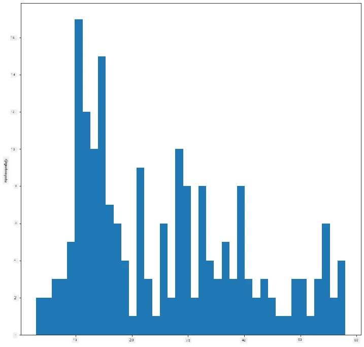

✅ សូមសាកល្បងតម្រង និងចំណុចទិន្នន័យផ្សេងទៀត។ ដើម្បីមើលការចែកចាយទិន្នន័យពេញលេញ សូមដកចេញតម្រង `['MaxBodyMass']` ដើម្បីបង្ហាញការចែកចាយដែលមានស្លាក។

histogram ផ្តល់នូវការពណ៌ និងស្លាកដែលស្អាតដើម្បីសាកល្បងផងដែរ៖

បង្កើត 2D histogram ដើម្បីប្រៀបធៀបទំនាក់ទំនងរវាងការចែកចាយពីរមុខ។ យើងប្រៀបធៀប `MaxBodyMass` ទល់នឹង `MaxLength`។ Matplotlib ផ្តល់វិធីក្នុងខ្លួនក្រោមដើម្បីបង្ហាញការប្រមូលផ្តុំដោយការប្រើពណ៌ភ្លឺ៖

```python
x = filteredBirds['MaxBodyMass']
y = filteredBirds['MaxLength']

fig, ax = plt.subplots(tight_layout=True)
hist = ax.hist2d(x, y)
```
​មានមួយចំនុចដែលទៅទំនាក់ទំនងគ្នាដែលរំពឹងទុកបានរវាងធាតុទាំងពីរនៅលើអ័ក្សដែលរំពឹងទុក មួយមានការប្រមូលផ្តុំខ្លាំងជាពិសេស៖

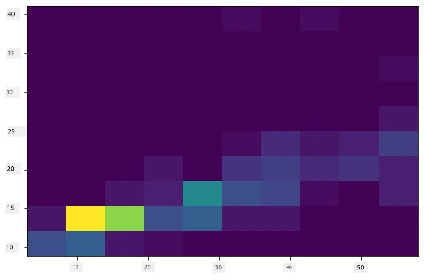

Histograms ដំណើរការល្អដោយលំនាំដើមសម្រាប់ទិន្នន័យជាតួចំនួន។ តើប្រសិនបើអ្នកចង់មើលការចែកចាយតាមព័ត៌មានអត្ថបទ?

## ស្រាវជ្រាវសំណុំទិន្នន័យសម្រាប់ការចែកចាយដោយប្រើទិន្នន័យអត្ថបទ

សំណុំទិន្នន័យនេះក៏មានព័ត៌មានល្អទាក់ទងនឹងប្រភេទបក្សី ហើយជាតិ (genus), ប្រភេទ (species), និងគ្រួសារ (family) រួមទាំងស្ថានភាពការការពារ។ យើងនឹងស្វែងយល់អំពីព័ត៌មានការការពារនេះ។ តើការចែកចាយបក្សីនៅតាមស្ថានភាពការការពាររបស់ពួកវាជាតម្លៃបែបណា?

> ✅ នៅក្នុងសំណុំទិន្នន័យនេះ មានអាក្រោមឡើងច្រើនដែលប្រើបញ្ជាក់ស្ថានភាពការការពារ។ អាក្រោមទាំងនេះមានមូលដ្ឋានមកពី [IUCN Red List Categories](https://www.iucnredlist.org/) ដែលជាស្ថាប័នដែលចំណាត់ថ្នាក់ស្ថានភាពប្រភេទសត្វ។
> 
> - CR: Endangered ដ៏វឹកវរ
> - EN: Endangered
> - EX: និស្ស័យ
> - LC: បញ្ហាទាបបំផុត
> - NT: សេសសល់ជិតក្រៃលែង
> - VU: អាចផ្ទុកការប៉ះពាល់

តម្លៃទាំងនេះជាទ្រង់ទ្រាយអត្ថបទ ដូច្នេះអ្នកត្រូវធ្វើការបម្លែងដើម្បីបង្កើត histogram។ ដោយប្រើ dataframe filteredBirds បង្ហាញស្ថានភាពការពាររួមជាមួយនឹង Minimum Wingspan។ តើអ្នកមើលឃើញអ្វីខ្លះ?

```python
x1 = filteredBirds.loc[filteredBirds.ConservationStatus=='EX', 'MinWingspan']
x2 = filteredBirds.loc[filteredBirds.ConservationStatus=='CR', 'MinWingspan']
x3 = filteredBirds.loc[filteredBirds.ConservationStatus=='EN', 'MinWingspan']
x4 = filteredBirds.loc[filteredBirds.ConservationStatus=='NT', 'MinWingspan']
x5 = filteredBirds.loc[filteredBirds.ConservationStatus=='VU', 'MinWingspan']
x6 = filteredBirds.loc[filteredBirds.ConservationStatus=='LC', 'MinWingspan']

kwargs = dict(alpha=0.5, bins=20)

plt.hist(x1, **kwargs, color='red', label='Extinct')
plt.hist(x2, **kwargs, color='orange', label='Critically Endangered')
plt.hist(x3, **kwargs, color='yellow', label='Endangered')
plt.hist(x4, **kwargs, color='green', label='Near Threatened')
plt.hist(x5, **kwargs, color='blue', label='Vulnerable')
plt.hist(x6, **kwargs, color='gray', label='Least Concern')

plt.gca().set(title='Conservation Status', ylabel='Min Wingspan')
plt.legend();
```

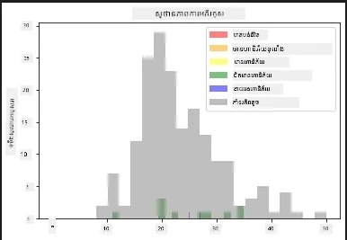

មើលទៅមិនមានទំនាក់ទំនងល្អណាមួយរវាងទំហំស្លាបអប្បបរមា និងស្ថានភាពការការពារទេ។ សាកល្បងធាតុផ្សេងទៀតនៅក្នុងសំណុំទិន្នន័យដោយប្រើវិធីនេះ។ អ្នកអាចសាកល្បងតម្រងផ្សេងៗបានផងដែរ។ តើអ្នកបានរកឃើញទំនាក់ទំនងមួយណា?

## រាងផ្ទុកដង់ស៊ីត្តី (Density plots)

 អ្នកអាចបានសង្កេតឃើញថា histograms ដែលយើងបានមើលមកទល់បច្ចុប្បន្នគឺមានទ្រង់ទ្រាយ 'ងើកជំហាន' ហើយមិនរលោងជារមពោង។ ដើម្បីបង្ហាញតារាងផ្ទុកដង់ស៊ីត្តីដែលរលោង អ្នកអាចសាកល្បងរាងផ្ទុកដង់ស៊ីត្តី។

 ដើម្បីធ្វើការដំណើរការជាមួយរាងផ្ទុកដង់ស៊ីត្តី សូមស្គាល់បណ្ណាល័យគូសតារាងថ្មីមួយ គឺ [Seaborn](https://seaborn.pydata.org/generated/seaborn.kdeplot.html)។

 បន្ទាប់ពីនាំចូល Seaborn សូមសាកល្បងរាងផ្ទុកដង់ស៊ីត្តីមូលដ្ឋាន៖

```python
import seaborn as sns
import matplotlib.pyplot as plt
sns.kdeplot(filteredBirds['MinWingspan'])
plt.show()
```
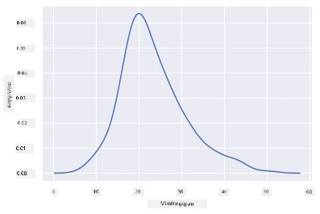

 អ្នកអាចមើលឃើញថាតារាងនេះមានការមានរបងទន់លើការបង្ហាញវាលស្លាបអប្បបរមា; វាត្រឡប់ទៅតារាងពីមុន ហើយគ្រាន់តែផ្ទាត់បន្តិចបន្តួច។ យោងតាមឯកសាររបស់ Seaborn, "ប្រៀបធៀបនឹង histogram, KDE អាចបង្កើតតារាងដែលមានចរាចរល្អ និងងាយក្នុងការបកស្រាយ ជាពិសេសនៅពេលគូសតារាងច្រើន។ ប៉ុន្តែវាអាចបង្កើតបំរែបំរួលបើការចែកចាយគោលដៅត្រូវបានដាក់ព្រំដែន ឬមិនរលោង។ ដូចជា histogram គុណភាពនៃការបង្ហាញក៏ពឹងផ្អែកលើការជ្រើសយកព៉ារ៉ាម៉ែត្រការស្ទង់ល្អ។" [ប្រភព](https://seaborn.pydata.org/generated/seaborn.kdeplot.html) ក្នុងន័យផ្សេង outliers តែងធ្វើឲ្យតារាងរបស់អ្នកប្រព្រឹត្ដខុស។

 ប្រសិនបើអ្នកចង់ពិនិត្យមើលខ្សែកោង MaxBodyMass ដែលចំហាចេញនៅតារាងទីពីរដែលបានបង្កើត អ្នកអាចធ្វើឲ្យរលោងបានយ៉ាងល្អជាមួយវិធីនេះ៖

```python
sns.kdeplot(filteredBirds['MaxBodyMass'])
plt.show()
```
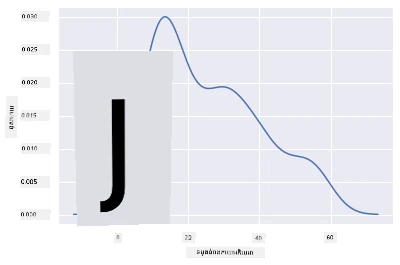

 ប្រសិនបើអ្នកចង់បានខ្សែកោងរលោង ប៉ុន្តែមិនរលោងពេក អ្នកអាចកែប្រែព៉ារ៉ាម៉ែត្រ `bw_adjust`៖ 

```python
sns.kdeplot(filteredBirds['MaxBodyMass'], bw_adjust=.2)
plt.show()
```
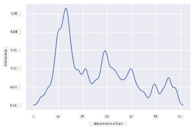

✅ អានអំពីព៉ារ៉ាម៉ែត្រដែលមានសម្រាប់តារាងនេះ ហើយសាកល្បងប្រើ!

 ប្រភេទតារាងនេះផ្តល់នូវការបង្ហាញត្រចៀកស្រាលដែរ។ ជាមួយបណ្ដាលេខកូដមួយចំនួន អ្នកអាចបង្ហាញភាពងាយស្រួលក្នុងការមើលបរិមាណសារពាង្គកាយអតិបរមា នៃបក្សីតាមក្រុម Order:

```python
sns.kdeplot(
   data=filteredBirds, x="MaxBodyMass", hue="Order",
   fill=True, common_norm=False, palette="crest",
   alpha=.5, linewidth=0,
)
```

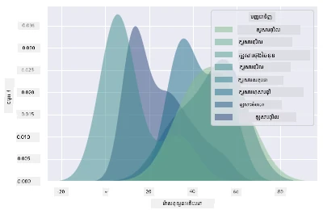

 អ្នកអាចផាត់មាំរាងដង់ស៊ីត្តីច្រើនផ្សំក្នុងតារាងតែមួយផងដែរ។ តេស្ត MaxLength និង MinLength នៃបក្សី ប្រៀបធៀបនឹងស្ថានភាពការការពាររបស់ពួកវា៖

```python
sns.kdeplot(data=filteredBirds, x="MinLength", y="MaxLength", hue="ConservationStatus")
```

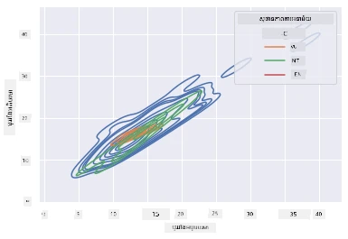

 ប្រហែលជាវាក៏មានតម្លៃក្នុងការស្រាវជ្រាវថាតើក្រុមបក្សី 'Vulnerable' ដែលតាមប្រវែងរបស់ពួកវាមានអត្ថន័យមានសារៈសំខាន់ ឬគ្មាន។

## 🚀 챌린지

Histograms គឺជាប្រភេទតារាងកាន់តែចំណុចខ្ពស់ជាង scatterplots បឋម, តារាង bar ឬ តារាងខ្សែ។ ស្វែងរកលើអ៊ីនធឺណេតដើម្បីស្វែងរកគំរូល្អៗនៃការប្រើ histograms។ តើវាត្រូវបានប្រើក្នុងរបៀបណា, វាបង្ហាញអ្វី, ហើយវាត្រូវបានប្រើនៅក្នុងវិស័យ ឬដែនកំណត់ស្រាវជ្រាវណាខ្លះ?

## [សំណួរលំហាត់បន្ទាប់វគ្គសិក្សា](https://ff-quizzes.netlify.app/en/ds/quiz/19)

## បទបង្ហាញ និងការសិក្សាឯករាជ្យ

ក្នុងមេរៀននេះ អ្នកបានប្រើ Matplotlib ហើយចាប់ផ្តើមការងារជាមួយ Seaborn ដើម្បីបង្ហាញតារាងកាន់តែចំណុចខ្ពស់។ សូមស្រាវជ្រាវអំពី `kdeplot` នៅក្នុង Seaborn ដែលជារាងកាយផ្ទុកប្រហាក់ប្រហែលបន្តបន្ទាប់មួយក្នុងវិមាត្រមួយ ឬច្រើន។ អានតាម [ឯកសារ](https://seaborn.pydata.org/generated/seaborn.kdeplot.html) ដើម្បីយល់ពីរបៀបដំណើរការ។

## កិច្ចការស្រីប

[អនុវត្តជំនាញរបស់អ្នក](assignment.md)

---

<!-- CO-OP TRANSLATOR DISCLAIMER START -->
**ការបដិសេធ**៖
ឯកសារនេះបានបកប្រែដោយប្រើសេវាកម្មបកប្រែ AI [Co-op Translator](https://github.com/Azure/co-op-translator)។ ទោះយើងខំប្រឹងសម្រាប់ភាពត្រឹមត្រូវ ក៏សូមជ្រាបថាការបកប្រែដោយស្វ័យប្រវត្តិអាចមានកំហុសឬចុះខាត។ ឯកសារដើមជាភាសាមូលដ្ឋានគួរត្រូវបានពិចារណានូវលទ្ធផលដ៏មានអំណាច។ សម្រាប់ព័ត៌មានសំខាន់ៗ គួរតែប្រើការបកប្រែជាជំនាញដោយមនុស្សវិជ្ជាជីវៈ។ យើងមិនទទួលខុសត្រូវចំពោះការយល់ថ្ងងឬការបកប្រែបែបមិនត្រឹមត្រូវណាមួយដែលកើតឡើងពីការប្រើប្រាស់ការបកប្រែនេះឡើយ។
<!-- CO-OP TRANSLATOR DISCLAIMER END -->