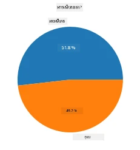
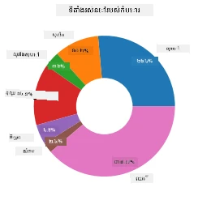
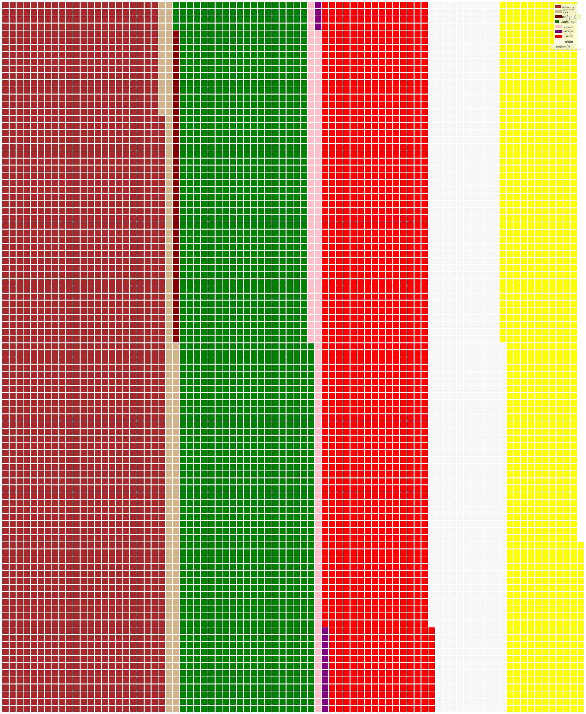

# Visualizing Proportions

| ](../../sketchnotes/11-Visualizing-Proportions.png)|
|:---:|
|ទិដ្ឋភាពអំពីសមurtle-កត់ភាគនៃទិន្នន័យ - _Sketchnote ដោយ [@nitya](https://twitter.com/nitya)_ |

នៅក្នុងមេរៀននេះ អ្នកនឹងប្រើឌាតាដែលផ្តោតលើធម្មជាតិខុសប្លែក ដើម្បីបង្ហាញភាគរយ ដូចជា ចំនួនប្រភេទផ្សេងៗនៃស្រូវឈើដែលមាននៅក្នុងដាតាដែលពាក់ព័ន្ធនឹងផ្សិត។ យើងនឹងស្វែងយល់អំពីផ្សិតទាំងនេះដោយប្រើឌាតា ដែលយកពី Audubon ដែលរាយការណ៍ព័ត៌មានអំពីប្រភេទផ្សិតស្រមោល ២៣ប្រភេទក្នុងគ្រួសារ Agaricus និង Lepiota។ អ្នកនឹងសាកល្បងបង្ហាញទិន្នន័យស្រដៀងៗនេះជាគំនូរដូចជា៖

- ក្រឡាចត្រង្គគ្រាប់បាយ 🥧
- ក្រឡាចត្រង្គដូណាត់ 🍩
- ក្រឡាចត្រង្គវ៉ាហ្វន 🧇

> 💡 គម្រោងចំណាប់អារម្មណ៍មួយមានឈ្មោះថា [Charticulator](https://charticulator.com) របស់ Microsoft Research ផ្តល់នូវចំណុចបញ្ចូល-ចាប់យកដោយឥតគិតថ្លៃសម្រាប់ការបង្ហាញទិន្នន័យ។ ក្នុងមេរៀនមួយរបស់ពួកគេ ក៏បានប្រើ dataset ផ្សិតនេះដែរ! រួចអ្នកអាចស្វែងយល់ទិន្នន័យនិងរៀនបណ្ណាល័យជាមួយគ្នាបាន៖ [Charticulator tutorial](https://charticulator.com/tutorials/tutorial4.html)។

## [ការសាកល្បងមុនវគ្គសិក្សា](https://ff-quizzes.netlify.app/en/ds/quiz/20)

## ស្គាល់បំពង់ផ្សិតរបស់អ្នក 🍄

ផ្សិតគឺគួរឱ្យចាប់អារម្មណ៍ខ្លាំងណាស់។ យើងនាំចូលដាតាដើម្បីសិក្សាពីពួកវា៖

```python
import pandas as pd
import matplotlib.pyplot as plt
mushrooms = pd.read_csv('../../data/mushrooms.csv')
mushrooms.head()
```
តារាងមួយត្រូវបានបោះពុម្ពជាមួយទិន្នន័យល្អសម្រាប់វិភាគ៖


| ចំណាត់ថ្នាក់ | រូបរាងក្បាល | ផ្ទៃក្បាល | ពណ៌ក្បាល | មានស្នាម | ក្លិន | តំណភ្ជាប់ស្លា | ចម្ងាយស្លា | ទំហំស្លា | ពណ៌ស្លា | រូបរាងដោះ | មូលដោះ | ផ្ទៃដោះលើច្រវ៉ាក់ | ផ្ទៃដោះក្រោមច្រវ៉ាក់ | ពណ៌ដោះលើច្រវ៉ាក់ | ពណ៌ដោះក្រោមច្រវ៉ាក់ | ប្រភេទមួក | ពណ៌មួក | ចំនួនខ្សែកោង | ប្រភេទខ្សែកោង | ពណ៌ស្នាមអង្កាម | បរិយាយពាណិជ្ជកម្ម | តំបន់រស់នៅ |
| --------- | --------- | ----------- | --------- | ------- | ------- | --------------- | ------------ | --------- | ---------- | ----------- | ---------- | ------------------------ | ------------------------ | ---------------------- | ---------------------- | --------- | ---------- | ----------- | --------- | ----------------- | ---------- | ------- |
| ពុល       | ខ្ពស់កោង  | មានផ្ទៃស្រួយ | ពណ៌ត្នោត | មានស្នាម | ខ្លាញ់ខ្លា | បានសេរី         | នៅជិត         | ស្តាំតិច  | ពណ៌ខ្មៅ     | កំពស់ឡើង    | តុល្យ       | មានផ្ទៃស្រួយ            | មានផ្ទៃស្រួយ            | ពណ៌ស ពណ៌ស            | ពណ៌ស ពណ៌ស           | ផ្នែកខ្នាត | ពណ៌ស       | មួយ         | ពីរដង     | ពណ៌ខ្មៅ             | រឹងស៊ីន    | ភូមិទីក្រុង |
| អាចបរិភោគបាន | ខ្ពស់កោង  | មានផ្ទៃស្រួយ | លឿង     | មានស្នាម | ដំណក់ដំណាប់ | បានសេរី         | នៅជិត         | ធំ       | ពណ៌ខ្មៅ     | កំពស់ឡើង    | ឈើភ្លៅ      | មានផ្ទៃស្រួយ            | មានផ្ទៃស្រួយ            | ពណ៌ស ពណ៌ស            | ពណ៌ស ពណ៌ស           | ផ្នែកខ្នាត | ពណ៌ស       | មួយ         | ពីរដង     | ពណ៌ត្នោត             | ច្រើន      | ស្មៅ      |
| អាចបរិភោគបាន | រង្វង់     | មានផ្ទៃស្រួយ | ពណ៌ស     | មានស្នាម | ថ្នាំ         | បានសេរី         | នៅជិត         | ធំ       | ពណ៌ត្នោត     | កំពស់ឡើង    | ឈើភ្លៅ      | មានផ្ទៃស្រួយ            | មានផ្ទៃស្រួយ            | ពណ៌ស ពណ៌ស            | ពណ៌ស ពណ៌ស           | ផ្នែកខ្នាត | ពណ៌ស       | មួយ         | ពីរដង     | ពណ៌ត្នោត             | ច្រើន      | ទំនាប     |
| ពុល       | ខ្ពស់កោង  | មានស្បែកក្រហម | ពណ៌ស     | មានស្នាម | ខ្លាញ់ខ្លា | បានសេរី         | នៅជិត         | ស្តាំតិច  | ពណ៌ត្នោត     | កំពស់ឡើង    | តុល្យ       | មានផ្ទៃស្រួយ            | មានផ្ទៃស្រួយ            | ពណ៌ស ពណ៌ស            | ពណ៌ស ពណ៌ស           | ផ្នែកខ្នាត | ពណ៌ស       | មួយ         | ពីរដង     | ពណ៌ខ្មៅ             | រឹងស៊ីន    | ភូមិទីក្រុង |

ភ្លាមៗ អ្នកមើលឃើញថាទិន្នន័យទាំងអស់គឺជាអក្សរទេ។ អ្នកត្រូវបម្លែងទិន្នន័យនេះសម្រាប់ប្រើក្នុងក្រឡាចត្រង្គ។ ភាគច្រើនរបស់ទិន្នន័យ ក្រៅតែពិតប្រាកដ គឺតំណាងដោយវត្ថុ៖

```python
print(mushrooms.select_dtypes(["object"]).columns)
```

លទ្ធផលដែលបាន៖

```output
Index(['class', 'cap-shape', 'cap-surface', 'cap-color', 'bruises', 'odor',
       'gill-attachment', 'gill-spacing', 'gill-size', 'gill-color',
       'stalk-shape', 'stalk-root', 'stalk-surface-above-ring',
       'stalk-surface-below-ring', 'stalk-color-above-ring',
       'stalk-color-below-ring', 'veil-type', 'veil-color', 'ring-number',
       'ring-type', 'spore-print-color', 'population', 'habitat'],
      dtype='object')
```
យកទិន្នន័យនេះ ហើយបម្លែងជួរឈរដែលមានឈ្មោះ 'class' ទៅជាប្រភេទ category៖

```python
cols = mushrooms.select_dtypes(["object"]).columns
mushrooms[cols] = mushrooms[cols].astype('category')
```

```python
edibleclass=mushrooms.groupby(['class']).count()
edibleclass
```

ឥឡូវនេះ ប្រសិនបើអ្នកបោះពុម្ពទិន្នន័យផ្សិត អ្នកអាចមើលឃើញថា វាត្រូវបានក្រុមតាមប្រភេទប Poisonous/Edible៖


|           | រូបរាងក្បាល | ផ្ទៃក្បាល | ពណ៌ក្បាល | មានស្នាម | ក្លិន | តំណភ្ជាប់ស្លា | ចម្ងាយស្លា | ទំហំស្លា | ពណ៌ស្លា | រូបរាងដោះ | ... | ផ្ទៃដោះក្រោមច្រវ៉ាក់ | ពណ៌ដោះលើច្រវ៉ាក់ | ពណ៌ដោះក្រោមច្រវ៉ាក់ | ប្រភេទមួក | ពណ៌មួក | ចំនួនខ្សែកោង | ប្រភេទខ្សែកោង | ពណ៌ស្នាមអង្កាម | បរិយាយពាណិជ្ជកម្ម | តំបន់រស់នៅ |
| --------- | --------- | ----------- | --------- | ------- | ---- | --------------- | ------------ | --------- | ---------- | ----------- | --- | ------------------------ | ---------------------- | ---------------------- | --------- | ---------- | ----------- | --------- | ----------------- | ---------- | ------- |
| class     |           |             |           |         |      |                 |              |           |            |             |     |                          |                        |                        |           |            |             |           |                   |            |         |
| អាចបរិភោគបាន    | ៤២០៨      | ៤២០៨        | ៤២០៨      | ៤២០៨    | ៤២០៨ | ៤២០៨            | ៤២០៨         | ៤២០៨      | ៤២០៨       | ៤២០៨        | ... | ៤២០៨                     | ៤២០៨                   | ៤២០៨                   | ៤២០៨      | ៤២០៨       | ៤២០៨        | ៤២០៨      | ៤២០៨              | ៤២០៨       | ៤២០៨    |
| ពុល       | ៣៩១៦      | ៣៩១៦        | ៣៩១៦      | ៣៩១៦    | ៣៩១៦ | ៣៩១៦            | ៣៩១៦         | ៣៩១៦      | ៣៩១៦       | ៣៩១៦        | ... | ៣៩១៦                     | ៣៩១៦                   | ៣៩១៦                   | ៣៩១៦      | ៣៩១៦       | ៣៩១៦        | ៣៩១៦      | ៣៩១៦              | ៣៩១៦       | ៣៩១៦    |

ប្រសិនបើអ្នកធ្វើតាមលំដាប់ដែលបង្ហាញក្នុងតារាងនេះ ដើម្បីបង្កើតស្លាកចំណាត់ថ្នាក់ អ្នកអាចបង្កើតក្រឡាចត្រង្គគ្រាប់បាយបាន៖

## ក្រឡាចត្រង្គគ្រាប់បាយ!

```python
labels=['Edible','Poisonous']
plt.pie(edibleclass['population'],labels=labels,autopct='%.1f %%')
plt.title('Edible?')
plt.show()
```
Voila, ក្រឡាចត្រង្គគ្រាប់បាយបង្ហាញអត្រាតាមភាគរយនៃទិន្នន័យនេះ តាមរយៈចំណាត់ថ្នាក់ពីរនេះនៃផ្សិត។ វាសំខាន់ណាស់ក្នុងការកំណត់លំដាប់ស្លាកឲ្យត្រឹមត្រូវ ដូច្នេះសូមផ្ទៀងផ្ទាត់លំដាប់ដែលបង្កើតស្លាកជាប្រចាំមួយ!



## ក្រឡាចត្រង្គដូណាត់!

ក្រោយមក ក្រឡាចត្រង្គដូណាត់គឺជាក្រឡាចត្រង្គគ្រាប់បាយដែលមានរនាំងនៅចំកណ្ដាល។ យើងមកមើលទិន្នន័យរបស់យើងជារបៀបនេះ។

សូមមើលតំបន់រស់នៅផ្សេងៗដែលផ្សិតដាំដុះ៖

```python
habitat=mushrooms.groupby(['habitat']).count()
habitat
```
នៅទីនេះ អ្នកកំពុងក្រុមទិន្នន័យរបស់អ្នកតាមតំបន់រស់នៅ។ មានចំនួន ៧ តំបន់ បើកនេះជាស្លាកសម្រាប់ក្រឡាចត្រង្គដូណាត់របស់អ្នក៖

```python
labels=['Grasses','Leaves','Meadows','Paths','Urban','Waste','Wood']

plt.pie(habitat['class'], labels=labels,
        autopct='%1.1f%%', pctdistance=0.85)
  
center_circle = plt.Circle((0, 0), 0.40, fc='white')
fig = plt.gcf()

fig.gca().add_artist(center_circle)
  
plt.title('Mushroom Habitats')
  
plt.show()
```



កូដនេះគូរក្រឡាចត្រង្គ និងរង្វង់កណ្តាលមួយ បន្ទាប់មកបន្ថែមរង្វង់កណ្តាលនោះក្នុងក្រឡាចត្រង្គ។ អ្នកអាចកែទំហំនៃរង្វង់កណ្តាលដោយផ្លាស់ប្តូរ `0.40` ទៅតម្លៃផ្សេង។

ក្រឡាចត្រង្គដូណាត់អាចកែសម្រួលបានជាច្រើនមុខ ដើម្បីផ្លាស់ប្តូរស្លាក។ ស្លាកអាចត្រូវបានសម្គាល់សម្រាប់ភាពងាយជ្រាប។ រៀនបន្ថែមនៅ [ឯកសារ](https://matplotlib.org/stable/gallery/pie_and_polar_charts/pie_and_donut_labels.html?highlight=donut)។

ឥឡូវដែលអ្នកបានស្គាល់របៀបក្រុមទិន្នន័យ រួចបង្ហាញវាជាក្រឡាចត្រង្គគ្រាប់បាយឬដូណាត់ អ្នកអាចស្វែងរកក្រឡាចត្រង្គប្រភេទផ្សេងទៀត។ សាកល្បងក្រឡាចត្រង្គវ៉ាហ្វន ដែលជារបៀបផ្សេងក្នុងការស្វែងយល់ពីបរិមាណ។

## ក្រឡាចត្រង្គវ៉ាហ្វន!

គំរូ​ក្រឡាចត្រង្គ​ប្រភេទ 'វ៉ាហ្វន' គឺជា វិធីផ្សេងសម្រាប់បំពេញបរិមាណជារាងជួរផ្ទាំង ២D នៃជ្រុងតិចៗ។ សាកល្បងបង្ហាញបរិមាណពណ៌ក្បាលផ្សិតផ្សេងៗក្នុង dataset នេះ។ ដើម្បីធ្វើបែបនេះ អ្នកត្រូវដំឡើងបណ្ណាល័យជំនួយមួយជា [PyWaffle](https://pypi.org/project/pywaffle/) និងប្រើ Matplotlib៖

```python
pip install pywaffle
```

ជ្រើសរើសផ្នែកមួយនៃទិន្នន័យរបស់អ្នកសម្រាប់ក្រុម៖

```python
capcolor=mushrooms.groupby(['cap-color']).count()
capcolor
```

បង្កើតក្រឡាចត្រង្គវ៉ាហ្វនដោយបង្កើតស្លាក ហើយបន្ទាប់មកក្រុមទិន្នន័យរបស់អ្នក៖

```python
import pandas as pd
import matplotlib.pyplot as plt
from pywaffle import Waffle
  
data ={'color': ['brown', 'buff', 'cinnamon', 'green', 'pink', 'purple', 'red', 'white', 'yellow'],
    'amount': capcolor['class']
     }
  
df = pd.DataFrame(data)
  
fig = plt.figure(
    FigureClass = Waffle,
    rows = 100,
    values = df.amount,
    labels = list(df.color),
    figsize = (30,30),
    colors=["brown", "tan", "maroon", "green", "pink", "purple", "red", "whitesmoke", "yellow"],
)
```

ដោយប្រើក្រឡាចត្រង្គវ៉ាហ្វន អ្នកអាចឃើញថាពណ៌ក្បាលផ្សិតក្នុង dataset នេះមានអត្រាពីរបីមិនទ្បឿន។ គួរឱ្យចាប់អារម្មណ៍ដែលមានផ្សិតពណ៌បៃតងច្រើន។



✅ Pywaffle គាំទ្ររូបតំណាងនៅក្នុងក្រឡាចត្រង្គ ដែលប្រើរូបតំណាងណាមួយដែលមាននៅ [Font Awesome](https://fontawesome.com/). សាកល្បងបន្ថែម ដើម្បីបង្កើតក្រឡាចត្រង្គវ៉ាហ្វនកាន់តែគួរឱ្យចាប់អារម្មណ៍ដោយប្រើរូបតំណាងជំនួសជ្រុង។

ក្នុងមេរៀននេះ អ្នកបានរៀនពីវិធីបង្ហាញភាគរយចំនួនបី។ ជាចម្បង អ្នកត្រូវក្រុមទិន្នន័យជាប្រភេទ រួចសម្រេចថាតើវិធីណាដែលល្អបំផុតសម្រាប់បង្ហាញទិន្នន័យ - ក្រឡាចត្រង្គគ្រាប់បាយ, ដូណាត់, ឬវ៉ាហ្វន។ ទាំងអស់គឺឆ្ងាញ់ និងផ្តល់ឱ្យអ្នកប្រើនូវការមើលឃើញភ្លាមភ្លាមលើ dataset។

## 🚀 thách thức

សូមព្យាយាមបង្កើតក្រឡាចត្រង្គឆ្ងាញ់ៗទាំងនេះនៅ [Charticulator](https://charticulator.com)។
## [ការសាកល្បងបន្ទាប់វគ្គសិក្សា](https://ff-quizzes.netlify.app/en/ds/quiz/21)

## សង្គ្រោះវិញ និងសិក្សាផ្ទាល់ខ្លួន

មួយចំនួនពេលវេលា វាជាពិបាកក្នុងការជ្រើសរើសប្រើក្រឡាចត្រង្គគ្រាប់បាយ ដូណាត់ ឬវ៉ាហ្វន។ នេះជាបទអានខ្លះសម្រាប់អានអំពីប្រធានបទនេះ៖

https://www.beautiful.ai/blog/battle-of-the-charts-pie-chart-vs-donut-chart

https://medium.com/@hypsypops/pie-chart-vs-donut-chart-showdown-in-the-ring-5d24fd86a9ce

https://www.mit.edu/~mbarker/formula1/f1help/11-ch-c6.htm

https://medium.datadriveninvestor.com/data-visualization-done-the-right-way-with-tableau-waffle-chart-fdf2a19be402

សូមស្វែងយល់បន្ថែមដើម្បីរកព័ត៌មានលម្អិតអំពីការជ្រើសរើសវេលានេះ។
## កិច្ចការសិក្សា

[សាកល្បងវានៅ Excel](assignment.md)

---

<!-- CO-OP TRANSLATOR DISCLAIMER START -->
**សេចក្ដីប្រកាស**៖  
ឯកសារនេះត្រូវបានបកប្រែដោយប្រើសេវាបកប្រែ AI [Co-op Translator](https://github.com/Azure/co-op-translator)। ខណៈពេលយើងខិតខំប្រឹងប្រែងសម្រាប់ភាពត្រឹមត្រូវ សូមយកចិត្តទុកដាក់ថាការបកប្រែដោយស្វ័យប្រវត្តិអាចមានកំហុសឬភាពមិនត្រឹមត្រូវ។ ឯកសារដើមនៅក្នុងភាសាមុខងារដើមគួរត្រូវបានយកជាផ្លូវការជាអ្នកផ្តល់ព័ត៌មាន។ សម្រាប់ព័ត៌មានសំខាន់ ចាត់ទុកការបកប្រែដោយអ្នកជំនាញជាអ្នកណែនាំជាលក្ខណៈផ្លូវការ។ យើងមិនទទួលខុសត្រូវចំពោះការយល់ច្រឡំ ឬការបកប្រែខុសពីការប្រើប្រាស់ការបកប្រែនេះឡើយ។
<!-- CO-OP TRANSLATOR DISCLAIMER END -->