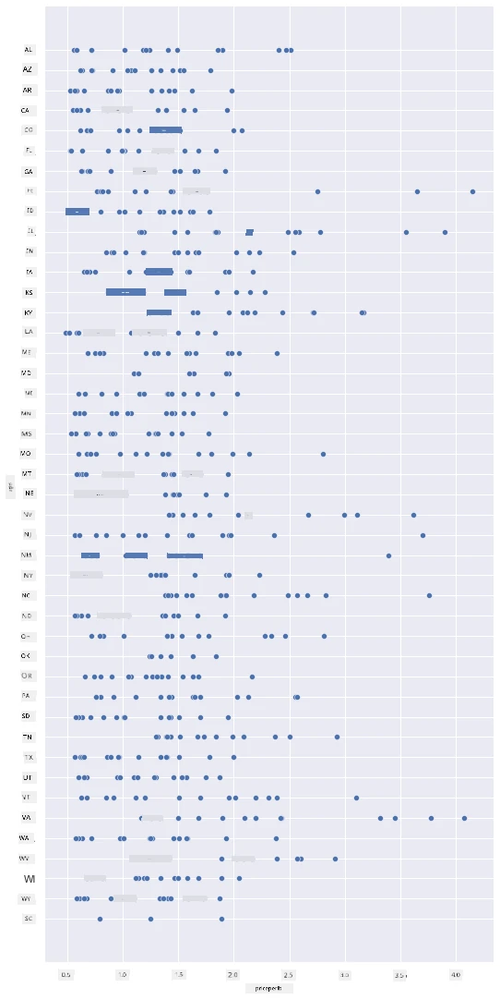
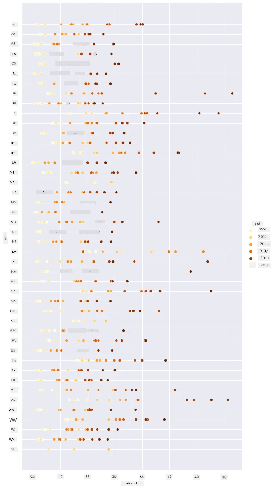
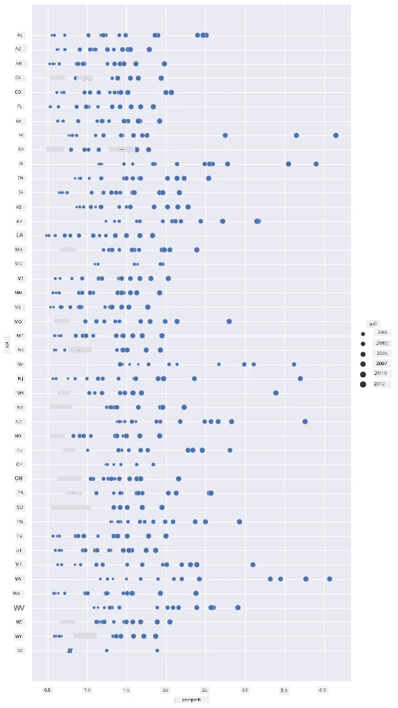
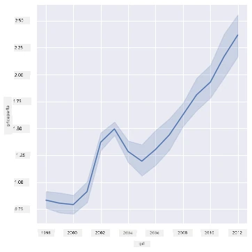
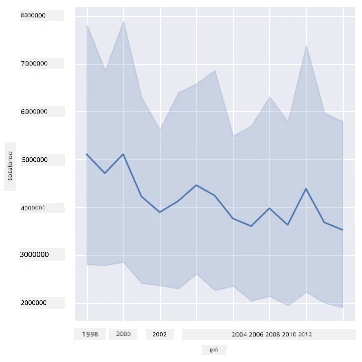
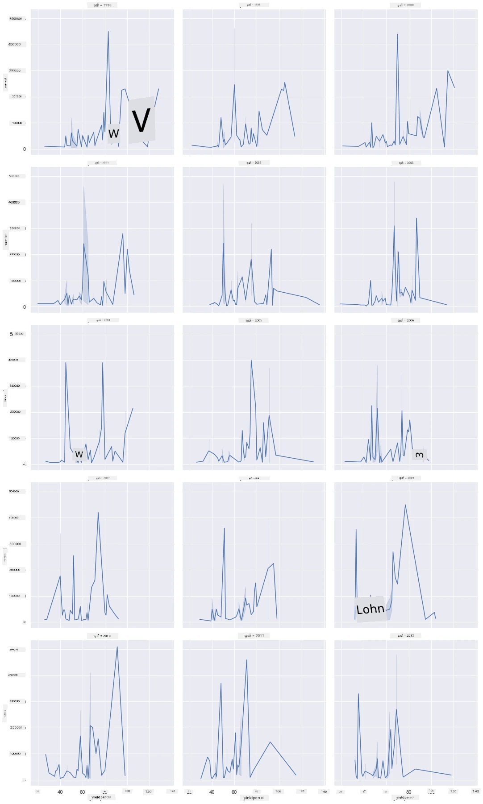
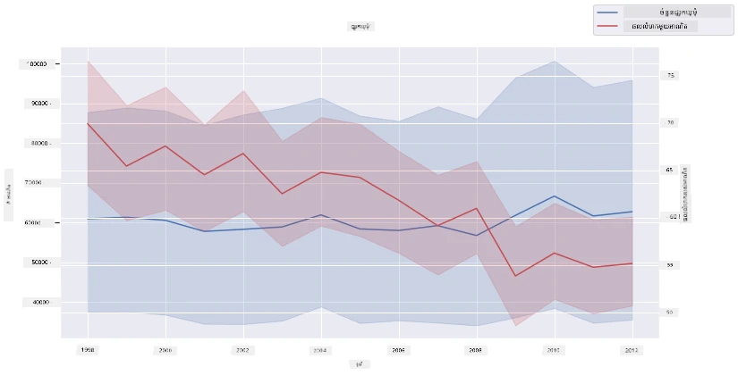

# ការមើលឃើញទំនាក់ទំនង៖ ទាំងអំពីទឹកឃ្មុំ 🍯

| ](../../sketchnotes/12-Visualizing-Relationships.png)|
|:---:|
|ការមើលឃើញទំនាក់ទំនង - _សេចក្ដីសង្ខេបគំនូរសៀង្ការ ដោយ [@nitya](https://twitter.com/nitya)_ |

បន្តការយកចំណុចផ្តោតលើធម្មជាតិក្នុងការស្រាវជ្រាវរបស់យើង មកស្វែងរកការមើលឃើញដែលគួរឲ្យចាប់អារម្មណ៍ដើម្បីបង្ហាញទំនាក់ទំនងរវាងប្រភេទទឹកឃ្មុំផ្សេងៗគ្នា គិតតាមទិន្នន័យដែលបានរៀបចំចេញពី [ក្រសួងកសិកម្មសហរដ្ឋអាមេរិក](https://www.nass.usda.gov/About_NASS/index.php)។

ទិន្នន័យនេះមានប្រហែល 600 ធាតុបង្ហាញការផលិតទឹកឃ្មុំ ក្នុងមួយរដ្ឋជាច្រើនរបស់សហរដ្ឋអាមេរិក។ ដូច្នេះ ឧទាហរណ៍ អ្នកអាចមើលឃើញចំនួនប្រូនសត្វមេឃ្មុំ ផលចំណេញក្នុងមួយប្រូនសត្វមេឃ្មុំ ការផលិតសរុប ស្តុក តម្លៃក្នុងមួយផោន និងតម្លៃទឹកឃ្មុំដែលផលិតក្នុងរដ្ឋណាមួយពីឆ្នាំ 1998 ដល់ 2012 ដែលមានមួយជាប់ជាជួរដើម្បីផ្ដល់សំណុំទិន្នន័យក្នុងមួយឆ្នាំសម្រាប់រាជរដ្ឋានីយ៍នីមួយៗ។

វានឹងគួរឲ្យចាប់អារម្មណ៍ក្នុងការមើលឃើញទំនាក់ទំនងរវាងការផលិតក្នុងមួយឆ្នាំរបស់រដ្ឋណាមួយ និង, ឧទាហរណ៍, តម្លៃទឹកឃ្មុំក្នុងរដ្ឋនោះ។ ជំនួស អ្នកអាចមើលឃើញទំនាក់ទំនងរវាងផលចំណេញទឹកឃ្មុំក្នុងមួយប្រូនសត្វមេឃ្មុំរបស់រដ្ឋផ្សេងៗគ្នា។ រយៈពេលឆ្នាំនេះគ្របដណ្តប់សំរាប់ជំងឺសម្លាប់ប្រូនសត្វ 'CCD' ឬ 'Colony Collapse Disorder' ដែលបានមើលឃើញជាលើកដំបូងនៅឆ្នាំ 2006 (http://npic.orst.edu/envir/ccd.html) ដែលជាទិន្នន័យសម្រាប់សិក្សាដ៏មានតម្លៃ។ 🐝

## [​សំណួរប្រឡងមុនការបង្រៀន](https://ff-quizzes.netlify.app/en/ds/quiz/22)

ក្នុងមេរៀននេះ អ្នកអាចប្រើ Seaborn ដែលអ្នកបានប្រើមុននោះជាគ្រឿងសំអាងល្អសម្រាប់មើលឃើញទំនាក់ទំនងរវាងអថេរ។ អ្វីដែលគួរឱ្យចាប់អារម្មណ៍ជាពិសេសគឺការប្រើប្រាស់មុខងារ `relplot` របស់ Seaborn ដែលអនុញ្ញាតឲ្យបង្កើតផ្ទាំងសៀវភៅចុចសារ (scatter plots) និងផ្ទាំងខ្សែ (line plots) ដើម្បីមើលឃើញនូវ '[ទំនាក់ទំនងស្ថិតិ](https://seaborn.pydata.org/tutorial/relational.html?highlight=relationships)' ដែលអនុញ្ញាតឱ្យអ្នកវិទ្យាសាស្រ្តទិន្នន័យយល់ដឹងពីរបៀបការទំនាក់ទំនងរវាងអថេរ។

## ផ្ទាំងចុចសារ (Scatterplots)

ប្រើផ្ទាំងចុចសារដើម្បីបង្ហាញពីរបៀបដែលតម្លៃទឹកឃ្មុំបានបំលែង ជារៀងរាល់ឆ្នាំ សម្រាប់ក្នុងមួយរដ្ឋ។ Seaborn ដែលប្រើ `relplot` ចំណាយថាមពលក្នុងការបែងចែកទិន្នន័យរដ្ឋ និងបង្ហាញចំណុចទិន្នន័យសម្រាប់ទិន្នន័យប្រភេទកាតេហ្គរី និងលេខ។

ចូរចាប់ផ្តើមដោយនាំចូលទិន្នន័យ និង Seaborn៖

```python
import pandas as pd
import matplotlib.pyplot as plt
import seaborn as sns
honey = pd.read_csv('../../data/honey.csv')
honey.head()
```
 អ្នកជ្រាបថាទិន្នន័យទឹកឃ្មុំមានជួរឈរ ដែលគួរឲ្យចាប់អារម្មណ៍ជាច្រើន រួមមានឆ្នាំ និងតម្លៃក្នុងមួយផោន។ មកស្វែងយល់ពីទិន្នន័យនេះ បែងចែកតាមរដ្ឋសហរដ្ឋអាមេរិក៖

| រដ្ឋ | numcol | yieldpercol | totalprod | stocks   | priceperlb | prodvalue | ឆ្នាំ |
| ----- | ------ | ----------- | --------- | -------- | ---------- | --------- | ---- |
| AL    | 16000  | 71          | 1136000   | 159000   | 0.72       | 818000    | 1998 |
| AZ    | 55000  | 60          | 3300000   | 1485000  | 0.64       | 2112000   | 1998 |
| AR    | 53000  | 65          | 3445000   | 1688000  | 0.59       | 2033000   | 1998 |
| CA    | 450000 | 83          | 37350000  | 12326000 | 0.62       | 23157000  | 1998 |
| CO    | 27000  | 72          | 1944000   | 1594000  | 0.7        | 1361000   | 1998 |

បង្កើតផ្ទាំងចុចសារជាមូលដ្ឋានដើម្បីបង្ហាញទំនាក់ទំនងរវាងតម្លៃក្នុងមួយផោននៃទឹកឃ្មុំ និងរដ្ឋដែលផលិតវា។ ចូរធ្វើឱ្យតំបន់អក្សរតំណាង `y` មានកម្ពស់គ្រប់គ្រាន់ដើម្បីបង្ហាញរដ្ឋទាំងអស់៖

```python
sns.relplot(x="priceperlb", y="state", data=honey, height=15, aspect=.5);
```


ឥឡូវនេះ បង្ហាញទិន្នន័យដូចគ្នាជាមួយផ្ទាំងពណ៌ទឹកឃ្មុំ ដើម្បីបង្ហាញពីរបៀបដែលតម្លៃបានបំលែងជារៀងរាល់ឆ្នាំ។ អ្នកអាចធ្វើវាដោយបន្ថែមប៉ារ៉ាម៉ែត្រ 'hue' ដើម្បីបង្ហាញការផ្លាស់ប្ដូរ ជារៀងរាល់ឆ្នាំ៖

> ✅ រៀនបន្ថែមអំពី [ពណ៌ផ្លាស់ប្ដូរដែលអ្នកអាចប្រើជាមួយ Seaborn](https://seaborn.pydata.org/tutorial/color_palettes.html) – សាកល្បងពណ៌រ៉ែនប៉ាក់ដ៏ស្រស់ស្អាត!

```python
sns.relplot(x="priceperlb", y="state", hue="year", palette="YlOrBr", data=honey, height=15, aspect=.5);
```


ជាមួយការផ្លាស់ប្ដូរផ្ទាំងពណ៌នេះ អ្នកអាចមើលឃើញថា មានការវិវឌ្ឍមាំមួននៅរយៈពេលជាច្រើនឆ្នាំក្នុងទំហំនៃតម្លៃទឹកឃ្មុំក្នុងមួយផោន។ ជាក់ស្តែង បើអ្នកមើលឃើញដែលជាគំរូមួយពីទិន្នន័យ ដើម្បីផ្ទៀងផ្ទាត់ (ជ្រើសរើសរដ្ឋណាមួយ, ដូចជា Arizona) អ្នកអាចឃើញលំនាំតម្លៃកើនឡើងជារៀងរាល់ឆ្នាំ មានតែខ្លះតែប៉ុណ្ណោះដែលជាប់ខុសត្រូវ៖

| រដ្ឋ | numcol | yieldpercol | totalprod | stocks  | priceperlb | prodvalue | ឆ្នាំ |
| ----- | ------ | ----------- | --------- | ------- | ---------- | --------- | ---- |
| AZ    | 55000  | 60          | 3300000   | 1485000 | 0.64       | 2112000   | 1998 |
| AZ    | 52000  | 62          | 3224000   | 1548000 | 0.62       | 1999000   | 1999 |
| AZ    | 40000  | 59          | 2360000   | 1322000 | 0.73       | 1723000   | 2000 |
| AZ    | 43000  | 59          | 2537000   | 1142000 | 0.72       | 1827000   | 2001 |
| AZ    | 38000  | 63          | 2394000   | 1197000 | 1.08       | 2586000   | 2002 |
| AZ    | 35000  | 72          | 2520000   | 983000  | 1.34       | 3377000   | 2003 |
| AZ    | 32000  | 55          | 1760000   | 774000  | 1.11       | 1954000   | 2004 |
| AZ    | 36000  | 50          | 1800000   | 720000  | 1.04       | 1872000   | 2005 |
| AZ    | 30000  | 65          | 1950000   | 839000  | 0.91       | 1775000   | 2006 |
| AZ    | 30000  | 64          | 1920000   | 902000  | 1.26       | 2419000   | 2007 |
| AZ    | 25000  | 64          | 1600000   | 336000  | 1.26       | 2016000   | 2008 |
| AZ    | 20000  | 52          | 1040000   | 562000  | 1.45       | 1508000   | 2009 |
| AZ    | 24000  | 77          | 1848000   | 665000  | 1.52       | 2809000   | 2010 |
| AZ    | 23000  | 53          | 1219000   | 427000  | 1.55       | 1889000   | 2011 |
| AZ    | 22000  | 46          | 1012000   | 253000  | 1.79       | 1811000   | 2012 |

វិធីមួយផ្សេងទៀតនៃការមើលឃើញការវិវឌ្ឍនេះគឺប្រើទ្រង់ទ្រាយទំហំ ផ្ទុយពីពណ៌។ សម្រាប់អ្នកដែលមានមើលមិនឃើញពណ៌ ពួកគេអាចរកមើលជម្រើសនេះបានល្អ។ កែសម្រួលការមើលឃើញរបស់អ្នក ដើម្បីបង្ហាញការកើនឡើងនៃតម្លៃដោយការកើនឡើងនៃចំនួនជុំវិញចំណុច៖

```python
sns.relplot(x="priceperlb", y="state", size="year", data=honey, height=15, aspect=.5);
```
 អ្នកអាចមើលឃើញទំហំចំណុចកើនឡើងមែន។



តើនេះជាគ្រាឌីមងាយស្រួលរបស់ការផ្គត់ផ្គង់ និងសំណើរឬ? ដោយសាររឿងដូចជា អាកាសធាតុបម្លាស់ប្តូរ និងជំងឺសម្លាប់ប្រូនសត្វមេឃ្មុំ កើតមានថាតើមានទឹកឃ្មុំតិចជាងសម្រាប់ការជាវមួយជារៀងរាល់ឆ្នាំ ហើយដូច្នេះតម្លៃកើនឡើង?

ដើម្បីរកមើលការតភ្ជាប់រវាងអថេរក្នុងទិន្នន័យនេះ មកស្វែងយល់ពីផ្ទាំងខ្សែខាងក្រោម។

## ផ្ទាំងខ្សែ

សំណួរ៖ តើមានការកើនឡើងច្បាស់លាស់ក្នុងតម្លៃទឹកឃ្មុំក្នុងមួយផោន ជារៀងរាល់ឆ្នាំទេ? អ្នកអាចរកឃើញវាប្រសើរបំផុតដោយបង្កើតផ្ទាំងខ្សែតែមួយ ៖

```python
sns.relplot(x="year", y="priceperlb", kind="line", data=honey);
```
ចម្លើយ៖ បាទ/ចាស មាន ទោះបីមានករណីខុសប្លែកនៅឆ្នាំ 2003 ក៏ដោយ៖



✅ ពីព្រោះ Seaborn រួមបញ្ចូលទិន្នន័យជុំវិញខ្សែខាងលើ មើលឃើញ "ការវាស់វែងច្រើននៅតំលៃ x រៀងៗគ្នា ដោយបង្ហាញចំណុចមធ្យម និងចន្លោះទំនុកចិត្ត 95% រំលងចំណុចមធ្យម"។ [ប្រភព](https://seaborn.pydata.org/tutorial/relational.html)។ អាកប្បកិរិយានេះដែលចំណាយពេលអាចបិទបានដោយបន្ថែម `ci=None`។

សំណួរ៖ តើនៅឆ្នាំ 2003 ក៏អាចឃើញការកើនឡើងនៃការផ្គត់ផ្គង់ទឹកឃ្មុំផងដែរឬ? តើអ្នកមើលការផលិតសរុបជារៀងរាល់ឆ្នាំដូចម្តេច?

```python
sns.relplot(x="year", y="totalprod", kind="line", data=honey);
```



ចម្លើយ៖ មិនមែនទេ។ ប្រសិនបើអ្នកមើលការផលិតសរុប វាត្រូវបានគេចាត់ទុកថាបានកើនឡើងនៅឆ្នាំនោះប៉ុន្តែលើកលែងតែមួយ បើប្រៀបធៀបទៅតាមទូទៅបរិមាណទឹកឃ្មុំដែលបានផលិតកំពុងធ្លាក់ចុះក្នុងរយៈពេលនេះ។

សំណួរ៖ ក្នុងករណីនេះ តើអ្វីដែលអាចបណ្តាលឲ្យមានការកើនឡើងតម្លៃទឹកឃ្មុំនៅឆ្នាំ 2003?

ដើម្បីស្វែងរកវា អ្នកអាចស្វែងយល់ពី grid បង្ហាញផ្នែក។

## ផ្នែក grid

ផ្នែក grid ស្ទួនគ្នាផ្នែកមួយនៃទិន្នន័យរបស់អ្នក (ក្នុងករណីនេះ អ្នកអាចជ្រើសរើស 'ឆ្នាំ' ដ כדיចៀសវាងការបង្កើតផ្នែក grid ច្រើនពេក)។ Seaborn អាចបង្កើតផ្ទាំងចងក្រងសម្រាប់ផ្នែកនីមួយៗនៃបន្ទាត់គូ x និង y ដែលបានជ្រើសរើសសម្រាប់កាត់បៀបកំណត់ផ្ទាំងភាគរយប្រសើរឡើង។ តើឆ្នាំ 2003 មានcl គឺមានភាពច្បាស់លាស់ក្នុងការប្រៀបធៀបប្រភេទនេះឬ?

បង្កើតផ្នែក grid ដោយបន្តប្រើ `relplot` ដូចដែលបានផ្តល់អនុសាសន៍ដោយ [ឯកសាររបស់ Seaborn](https://seaborn.pydata.org/generated/seaborn.FacetGrid.html?highlight=facetgrid#seaborn.FacetGrid) ។

```python
sns.relplot(
    data=honey, 
    x="yieldpercol", y="numcol",
    col="year", 
    col_wrap=3,
    kind="line"
    )
```
នៅក្នុងការមើលឃើញនេះ អ្នកអាចប្រៀបធៀបផលចំណេញក្នុងមួយប្រូនសត្វមេឃ្មុំ និងចំនួនប្រូនសត្វមេឃ្មុំ ជារៀងរាល់ឆ្នាំ នៅជាប់ជាមួយការតម្រៀបប៉ះពាល់នៅជួរឈរ 3៖



សម្រាប់ទិន្នន័យនេះ មិនមានអ្វីបង្ហាញឲ្យដឹងជាក់ស្តែងទាក់ទងនឹងចំនួនប្រូនសត្វមេឃ្មុំ និងផលចំណេញរបស់ពួកវា ជារៀងរាល់ឆ្នាំ និងសម្រាប់រាជរដ្ឋានីយ៍នីមួយៗទេ។ តើមានវិធីផ្សេងទៀតដើម្បីស្វែងរកការតភ្ជាប់រវាងអថេរទាំងពីរទេ?

## ផ្ទាំងខ្សែពីរជាប់គ្នា (Dual-line Plots)

សាកល្បងបង្កើតផ្ទាំងខ្សែច្រើនជាមួយការវាស់វែងពីរដែលរំលេចលើគ្នា ប្រើ 'despine' របស់ Seaborn ដើម្បីដករាំងខ្សែចងក្រងខាងលើ និង ខាងស្ដាំ និងប្រើ `ax.twinx` [ដែលបានយកចេញពី Matplotlib](https://matplotlib.org/stable/api/_as_gen/matplotlib.axes.Axes.twinx.html)។ Twinx អនុញ្ញាតឲ្យផ្ទាំងបង្ហាញចែករំលែកតំបន់ x ហើយបង្ហាញតំបន់ y ប្ដូរពីរប្រភេទ។ ដូច្នេះ បង្ហាញផលចំណេញក្នុងមួយប្រូនសត្វមេឃ្មុំ និងចំនួនប្រូនសត្វមេឃ្មុំ រំលេចលើគ្នា៖

```python
fig, ax = plt.subplots(figsize=(12,6))
lineplot = sns.lineplot(x=honey['year'], y=honey['numcol'], data=honey, 
                        label = 'Number of bee colonies', legend=False)
sns.despine()
plt.ylabel('# colonies')
plt.title('Honey Production Year over Year');

ax2 = ax.twinx()
lineplot2 = sns.lineplot(x=honey['year'], y=honey['yieldpercol'], ax=ax2, color="r", 
                         label ='Yield per colony', legend=False) 
sns.despine(right=False)
plt.ylabel('colony yield')
ax.figure.legend();
```


ទោះបីជាមិនមានអ្វីដែលមើលទៅបំភ្លឺច្បាស់នៅឆ្នាំ 2003 ក៏ដោយ វាក៏អនុញ្ញាតឲ្យយើងបញ្ចប់មេរៀននេះជាមួយពាក្យប្លែកៗថា ទោះបីជាចំនួនប្រូនសត្វមេឃ្មុំកំពុងធ្លាក់ចុះទូទៅ ក៏ប៉ុន្តែចំនួនប្រូនសត្វមេឃ្មុំបានមានស្ថេរភាព ទោះបីជាផលចំណេញក្នុងមួយប្រូនសត្វមេឃ្មុំកំពុងធ្លាក់ចុះ។

ចូរចេញដំណើរ តាតាតា!

🐝❤️
## 🚀 챌린지

ក្នុងមេរៀននេះ អ្នកបានរៀនអំពីការប្រើប្រាស់ផ្ទាំងចុចសារ និង grid ខ្សែជាច្រើនរួមទាំង grid ផ្នែកផងដែរ។ តេស្តខ្លួនឯង ដោយបង្កើត grid ផ្នែកតាមការប្រើប្រាស់ទិន្នន័យផ្សេងទៀត ខាងលើបើត្រូវ តើគួរឲ្យប្រសើរឬ? ចំណាំវេលានិងការប៉ះពាល់ពេលបង្កើតវាប្រើបច្ចេកទេសទាំងនេះ។

## [សំណួរប្រឡងបន្ទាប់ពីបង្រៀន](https://ff-quizzes.netlify.app/en/ds/quiz/23)

## ការពិនិត្យឡើងវិញ និងរៀនដោយខ្លួនឯង

ផ្ទាំងខ្សែអាចមានភាពសាមញ្ញ ឬស្មុគស្មាញកម្រិតខ្ពស់។ សូមអានបន្ថែមក្នុង [ឯកសាររបស់ Seaborn](https://seaborn.pydata.org/generated/seaborn.lineplot.html) អំពីវិធីផ្សេងៗក្នុងការបង្កើតវា។ ព្យាយាមបន្ថែមលទ្ធផលទាំងនេះខាងលើដោយរបៀបផ្សេងទៀតដែលមានក្នុងឯកសារ។

## ការចាត់ការងារ

[ចូលទៅក្នុងគំនរមែកោះ](assignment.md)

---

<!-- CO-OP TRANSLATOR DISCLAIMER START -->
**ការបដិសេធ**:  
ឯកសារនេះត្រូវបានបកប្រែដោយប្រើសេវាកម្មបកប្រែ AI [Co-op Translator](https://github.com/Azure/co-op-translator)។ បើទោះបីយើងខិតខំផ្តល់ភាពត្រឹមត្រូវក៏ដោយ សូមយល់ថាការបកប្រែដោយស្វ័យប្រវត្តិក្នុងឯកសារនេះអាចមានកំហុសឬភាពមិនត្រឹមត្រូវ។ ឯកសារដើមជាភាសាដើមគួรถ្រូវបានគេចាត់ទុកជាដើមកំណត់។ សម្រាប់ព័ត៌មានសំខាន់ៗ ផ្តល់ជូននូវការបកប្រែដោយមនុស្សជំនាញអាជីពគឺល្អជាង។ យើងមិនទទួលខុសត្រូវចំពោះការយល់ច្រឡំ ឬការពន្យល់ខុសដែលកើតមានពីការប្រើប្រាស់បកប្រែនេះទេ។
<!-- CO-OP TRANSLATOR DISCLAIMER END -->