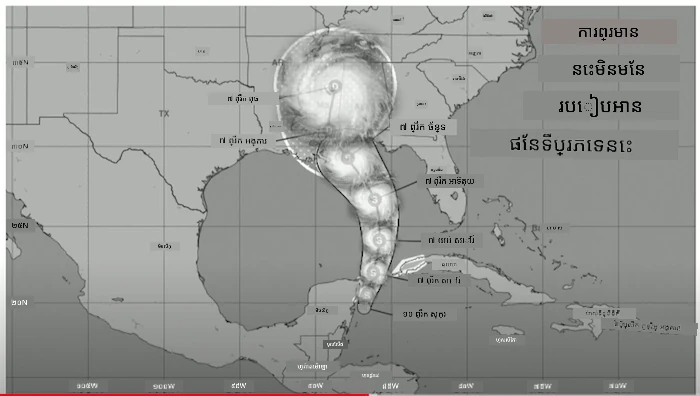
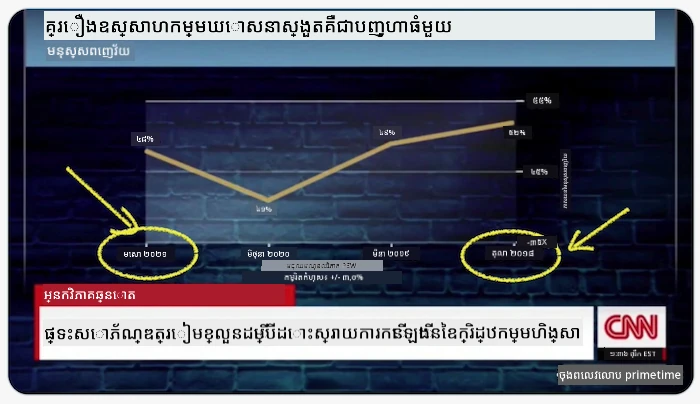
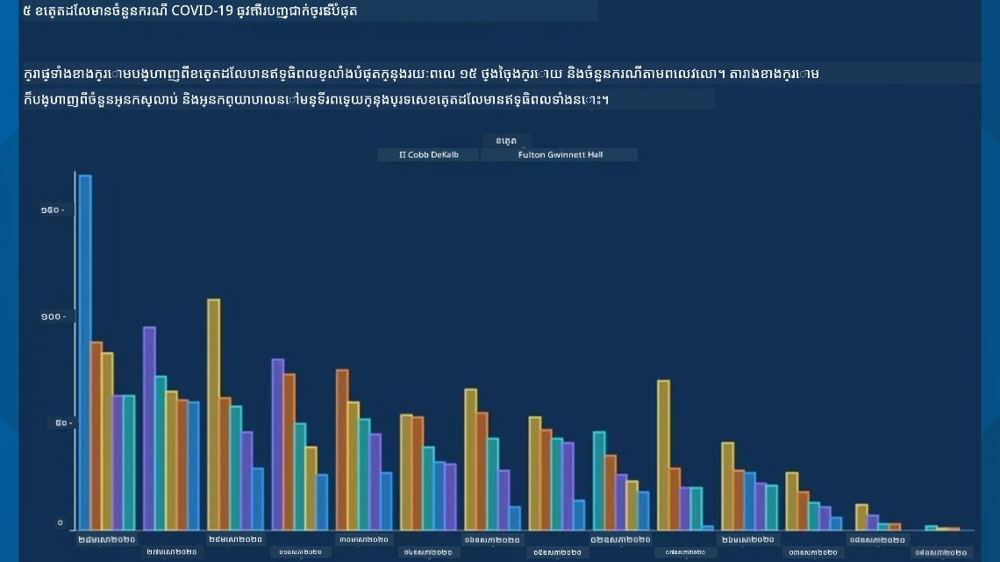
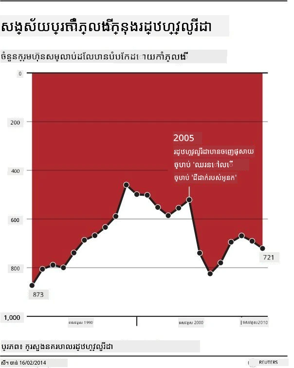
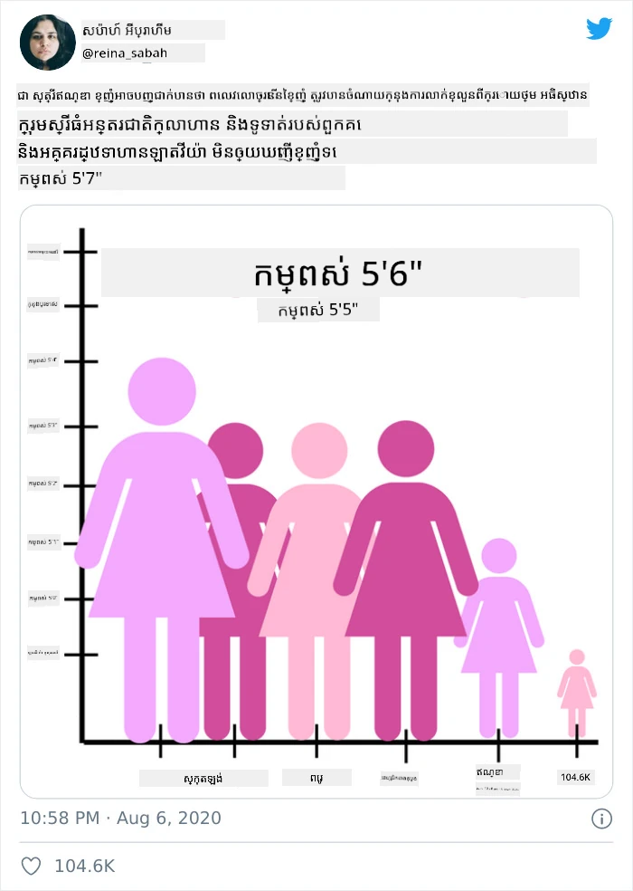
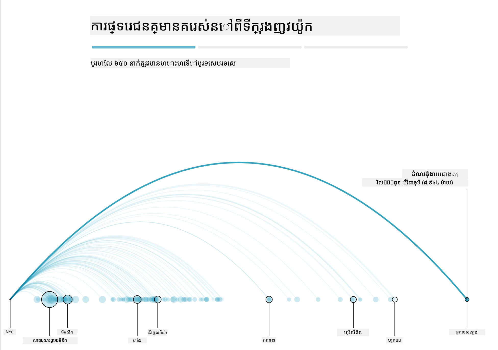
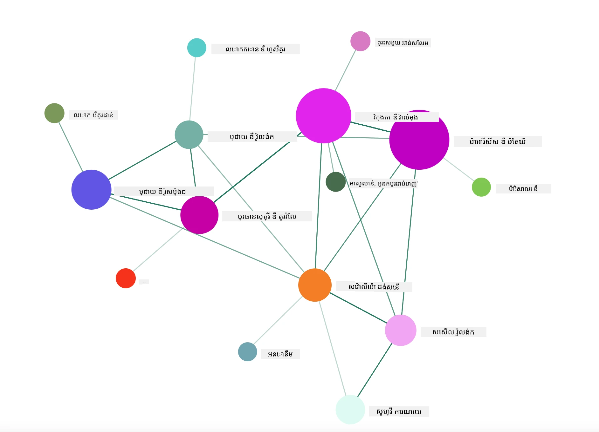

# ការធ្វើ ដាក់បង្ហាញទិន្នន័យមានអត្ថន័យ

| ](../../sketchnotes/13-MeaningfulViz.png)|
|:---:|
| ការដាក់បង្ហាញទិន្នន័យមានអត្ថន័យ - _Sketchnote ដោយ [@nitya](https://twitter.com/nitya)_ |

> "បើអ្នកทรมานครデータគ្រប់រយៈពេលគ្រប់យ៉ាងវានឹងសារភាពអ្វីគ្រប់យ៉ាង" -- [Ronald Coase](https://en.wikiquote.org/wiki/Ronald_Coase)

មួយក្នុងចំណាត់ថ្នាក់ជំនាញមូលដ្ឋានរបស់អ្នកវិទ្យាសាស្ត្រទិន្នន័យគឺសមត្ថភាពក្នុងការបង្កើតការដាក់បង្ហាញទិន្នន័យដែលមានអត្ថន័យជួយឆ្លើយសំណួរដែលអ្នកប្រហែលជាមាន។ មុននឹងដាក់បង្ហាញទិន្នន័យរបស់អ្នក អ្នកត្រូវប្រាកដថាវាត្រូវបានសំអាត និងរៀបចំរួចហើយ ដូចដែលអ្នកបានធ្វើនៅមេរៀនមុនៗ។ បន្ទាប់មក អ្នកអាចចាប់ផ្តើមសម្រេចចិត្តពីវិធីដ៏ល្អបំផុតក្នុងការបង្ហាញទិន្នន័យ។

នៅក្នុងមេរៀននេះ អ្នកនឹងសិក្សា៖

1. របៀបជ្រើសរើសប្រភេទផែនតារូបភាពត្រឹមត្រូវ
2. របៀបជៀសវាងការបង្ហាញខុសប្លែក
3. របៀបធ្វើការជាមួយពណ៌
4. របៀបបង្កើតរចនាបថផែនតារបស់អ្នកសម្រាប់ការអានបានងាយ
5. របៀបសាងសង់ដំណោះស្រាយផែនតារផ្សាយរូបចលនា ឬមានរូបភាព3D
6. របៀបបង្កើតការដាក់បង្ហាញបែបច្នៃប្រឌិត

## [ប.quiz មុនមេរៀន](https://ff-quizzes.netlify.app/en/ds/quiz/24)

## ជ្រើសរើសប្រភេទផែនតារូបភាពត្រឹមត្រូវ

នៅមេរៀនមុនៗ អ្នកបានសាកល្បងបង្កើតការដាក់បង្ហាញទិន្នន័យដែលគួរឱ្យចាប់អារម្មណ៏គ្រប់ប្រភេទដោយប្រើ Matplotlib និង Seaborn សម្រាប់ធ្វើផែនតា។ ជាទូទៅ អ្នកអាចជ្រើសរើស [ប្រភេទផែនតារូបភាពត្រឹមត្រូវ](https://chartio.com/learn/charts/how-to-select-a-data-vizualization/) សម្រាប់សំណួរដែលអ្នកសួរបាន ដោយប្រើតារាងនេះ៖

| អ្នកត្រូវការ:               | អ្នកគួរប្រើ:                 |
| -------------------------- | ------------------------------ |
| បង្ហាញនិន្នាការទិន្នន័យតាមរយៈពេលវេលា | ខ្សែ                            |
| ប្រៀបធៀបប្រភេទ            | បារ, ពាយ                      |
| ប្រៀបធៀបសរុប             | ពាយ, បារ ដែលស្តុក             |
| បង្ហាញទំនាក់ទំនង           | ចំណុចរាក់ទាក់, ខ្សែ, ផ្នែក, ខ្សែទ្វេ              |
| បង្ហាញចែកចាយ             | ចំណុចរាក់ទាក់, ប្រវត្តិ, ប្រអប់          |
| បង្ហាញនៃសមាហរណៈ          | ពាយ, ដូណាត់, វ៉ាហ្វហ្វ          |

> ✅ សម្រាប់ទម្រង់តំណាងទិន្នន័យ អ្នកប្រហែលជាត្រូវបម្លែងវាពីអត្ថបទទៅលេខ ដើម្បីឲ្យផែនតារូបភាពជួយគាំទ្រវា។

## ជៀសវាងការលំលំហ

ព្រោះថាមានច្រើនវិធីដែលទិន្នន័យអាចត្រូវបានបង្ហាញដើម្បីបញ្ជាក់មតិ ឬបង្កើតតំរូវការមិនត្រឹមត្រូវ ហើយនៅពេលជាក់ស្តែងគឺធ្វើឲ្យទិន្នន័យខូច។ មាន ឧទាហរណ៍ជាច្រើននៃផែនតារូបភាព និងព័ត៌មានមិនត្រឹមត្រូវ! 

[](https://www.youtube.com/watch?v=oX74Nge8Wkw "How charts lie")

> 🎥 ចុចរូបខាងលើសម្រាប់សុន្ទរកថាស្តីពីផែនតារូបភាពមិនត្រឹមត្រូវ

ផែនតានេះប្ដូរតម្លៃអ័ក្ស X ឲ្យវិលត្រឡប់ក្នុងការបង្ហាញវាលេងផ្សេងពីការពិត ពឹងផ្អែកលើកាលបរិច្ឆេទ៖



[ផែនតានេះ](https://media.firstcoastnews.com/assets/WTLV/images/170ae16f-4643-438f-b689-50d66ca6a8d8/170ae16f-4643-438f-b689-50d66ca6a8d8_1140x641.jpg) គ្រប់គ្រាន់លំបាកជាងនេះ ព្រោះភ្នែកត្រូវទាញទៅស្តាំដើម្បីសន្និដ្ឋានថា ទីកន្លែងផ្សេងៗមានករណី COVID កាត់បន្ថយ។ តាមពិត ប្រសិនបើអ្នកមើលកាលបរិច្ឆេទយ៉ាងហ្មត់ចត់ អ្នកនឹងឃើញថាវាត្រូវបានផ្លាស់ប្តូរជារបៀបដែលបង្កើតនិន្នាការចុះ។



ឧទាហរណ៍ដ៏ល្បីនោះប្រើពណ៌ និងប្រែតម្លៃអ័ក្ស Y ដោយបង្ខំ៖ ជំនួសនឹងបញ្ជាក់ថាចំនួនស្លាប់ពីកាំភ្លើងកើនឡើងបន្ទាប់ពីច្បាប់រដ្ឋាភិបាលដែលគាំទ្រកាំភ្លើង តាមពិតភ្នែកត្រូវបានគួរឱ្យភ្លក់គិតថាពីព្រោះទេបង្កើតការច្រៀង។



ផែនតាពិសេសនេះបង្ហាញពីរបៀបដែលអាចគ្រប់គ្រងភាគរយ ដើម្បីផលប៉ះពាល់សើចសើច៖



ការប្រៀបធៀបរបស់អ្វីដែលមិនអាចប្រៀបធៀបគ្នា បានជាសកម្មភាពមួយផ្សេងទៀត។ មាន [គេហទំព័រអស្ចារ្យមួយ](https://tylervigen.com/spurious-correlations) ស្តីពី 'ការតភ្ជាប់មិនពិត' រួមបញ្ចូល 'ការពិត' ដែលភ្ជាប់ទៅនឹងអត្រាពិលនាពិលនានិងការបរិភោគផលិតផល margarine។ ក្រុម Reddit អ្នកក៏រកគ្នា [ការប្រើប្រាស់មិនស្អាត](https://www.reddit.com/r/dataisugly/top/?t=all) នៃទិន្នន័យផងដែរ។

សំខាន់ក្នុងការយល់ថាការភ្នែកុមភ្លេចដោយផែនតាគំនូរបន្លំនោះយ៉ាងងាយស្រួល។ ទោះបីជាគោលបំណងរបស់អ្នកវិទ្យាសាស្ត្រទិន្នន័យល្អ ក៏សំណួរជ្រើសរើសបែបផែនតាល្អមិនបាន ក៏អាចបង្កើតចំនុចច្របូកច្របល់។

## ពណ៌

អ្នកបានឃើញនៅក្នុងផែនតា 'ហិង្សាអាវុធនៅ Florida' ខាងលើថាពណ៌អាចផ្តល់ស្រទាប់ន័យបន្ថែមសម្រាប់ផែនតា ជាពិសេសដែលមិនបានរចនាគ្រប់គ្រងដោយបណ្ណាល័យដូចជា Matplotlib និង Seaborn ដែលមានបណ្ណាល័យពណ៌ និងពណ៌ភ្លឺដែលត្រូវបានត្រួតពិនិត្យ។ ប្រសិនបើអ្នកបង្កើតផែនតាដោយដៃ សូមសិក្សាថ្នាក់ [ទ្រឹស្តីពណ៌](https://colormatters.com/color-and-design/basic-color-theory)

> ✅ ត្រូវមានការយកចិត្តទុកដាក់ ពេលរចនាផែនតា អំពីការចូលដំណើរការអ្នកប្រើប្រាស់ ជាជំងឺមួយក្នុងការបង្ហាញ។ មនុស្សខ្លះអាចមានជំងឺភ្នែកមិនឃើញពណ៌ - តើផែនតារបស់អ្នកបង្ហាញល្អសម្រាប់អ្នកមានបញ្ហាជំនួសការមើល?

ប្រុងប្រយ័ត្នពេលជ្រើសរើសពណ៌សម្រាប់ផែនតារបស់អ្នក ព្រោះពណ៌អាចផ្ដល់ន័យដែលអ្នកមិនចង់ដូច។ 'ស្រីសោភា' ក្នុងផែនតា 'កម្ពស់' ខាងលើ ផ្ដល់ន័យផ្លូវភេទ ស្រី ដែលបន្ថែមភាពអស្ចារ្យនៃផែនតា។

ក្នុងពិភពលោក ខួបផែនពណ៌ អាចខុសគ្នា និយាយតាមតំបន់ និងផ្លាស់ប្តូរន័យរបស់ពណ៌តាមបំណែករលោងរបស់វា។ ជាទូទៅ ន័យពណ៌រួមមាន:

| ពណ៌     | ន័យ                      |
| -------- | ------------------------- |
| ក្រហម    | ពលកម្ម                    |
| ខៀវ     | ការជឿទុកចិត្ត, ឧស្សាហិរណ៍  |
| លឿង     | សេចក្តីសុខ, ការប្រុងប្រយ័ត្ន   |
| បៃតង    | អេកូឡូជី, ជោគជ័យ, ការជ្រួលជ្រេរ |
| ទឹកក្រូច | សេចក្តីរីករាយ               |
| ពណ៌ទឹកក្រូច | ការរីករាយ              |

បើអ្នកត្រូវបង្កើតផែនតាដោយពណ៌ផ្ទាល់ខ្លួន សូមប្រាកដថាផែនតារបស់អ្នកអាចចូលដំណើរការបាន និងពណ៌ដែលអ្នកជ្រើសបានផ្គូរផ្គងទៅនឹងន័យដែលអ្នកចង់បង្ហាញ។

## រៀបចំបំពាក់ផែនតារបស់អ្នកសម្រាប់ការអានបានងាយ

ផែនតាមិនមានអត្ថន័យទេ ប្រសិនបើវាមិនអានបាន! ចំណាយពេលបន្តិចក្នុងការយកចិត្តទុកដាក់លើការរៀបចំទំហំទទឹងនិងកម្ពស់ផែនតារបស់អ្នកឲ្យសមរម្យជាមួយទិន្នន័យរបស់អ្នក។ ប្រសិនបើខ្លឹមសារមួយ (ដូចជា រដ្ឋទាំង ៥០) ត្រូវបង្ហាញ សូមបង្ហាញវាឲ្យឈរ បង្ហាញនៅអ័ក្ស Y បើអាច ដើម្បីជៀសវាងការច្រាសដំណើរការ horizontally ។

សរសេរឈ្មោះអ័ក្ស រួមបញ្ចូលជូនសញ្ញាសម្គាល់ប្រសិនបើត្រូវការ ហើយផ្តល់ឧបករណ៍សម្រាប់ពណ៌នាទិន្នន័យឲ្យច្បាស់ល្អ។

ប្រសិនបើទិន្នន័យរបស់អ្នកជាអត្ថបទវែងលើអ័ក្ស X អ្នកអាចបត់អត្ថបទសម្រាប់អានបានល្អឡើង។ [Matplotlib](https://matplotlib.org/stable/tutorials/toolkits/mplot3d.html) ផ្ដល់ជូនការគូរផែនតា3D ប្រសិនបើទិន្នន័យរបស់អ្នកគាំទ្រ។ ការដាក់បង្ហាញទិន្នន័យមានផាសុខភាពអាចបង្កើតបានដោយប្រើ `mpl_toolkits.mplot3d`។


## ផ្សាយរូបចលនា និងផែនតា3D

ខ្លះនៃការដាក់បង្ហាញទិន្នន័យល្អបំផុតសព្វថ្ងៃគឺមានរូបចលនា។ Shirley Wu មានផែនតាល្អៗដែលបង្កើតជាមួយ D3 ដូចជា '[ផ្កាភ្នំពេញ](http://bl.ocks.org/sxywu/raw/d612c6c653fb8b4d7ff3d422be164a5d/)' ដែលផ្កាផ្សេងៗគ្នារបស់មួយៗពាក់ព័ន្ធទៅនឹងភាពយន្តមួយ។ ឧទាហរណ៍ផ្សេងទៀតសម្រាប់រុក្ខជាតិ Guardian គឺ 'bussed out' ដែលជាបទពិសោធន៍អន្តរកម្មផ្ដល់បទពិសោធន៍បង្ហាញរូបភាពជារួមជាមួយ Greensock និង D3 បូកជាមួយអត្ថបទ scrollytelling ដើម្បីបង្ហាញពីរបៀប NYC គ្រប់គ្រងបញ្ហាឧត្តមភាពដោយបញ្ជូនមនុស្សជាពលរដ្ឋក្រៅទីក្រុង។



> "Bussed Out: ម៉ាយ៉ាងអាមេរិកាដឹកនាំមនុស្សគ្មានលំនៅដ្ឋានរបស់ខ្លួន" ពី [the Guardian](https://www.theguardian.com/us-news/ng-interactive/2017/dec/20/bussed-out-america-moves-homeless-people-country-study)។ បង្ហាញរូបភាពដោយ Nadieh Bremer & Shirley Wu

នៅពេលនេះមេរៀនមិនគ្រប់គ្រាន់សម្រាប់បង្រៀនជម្រៅអំពីបណ្ណាល័យដាក់បង្ហាញរូបភាពមានសក្ដានុពលទាំងនេះទេ។ សូមសាកល្បងប្រើ D3 ក្នុងកម្មវិធី Vue.js ដោយប្រើបណ្ណាល័យដើម្បីបង្ហាញ visualisation របស់សៀវភៅ "Dangerous Liaisons" ជាបណ្ដាញសង្គមរូបចលនា។

> "Les Liaisons Dangereuses" គឺជារឿងរ៉ាវលិខិត នៅក្នុងកន្លែងជាបណ្ដារនៃលិខិត។ សរសេរឡើងនៅឆ្នាំ ១៧៨២ ដោយ Choderlos de Laclos វាបាននិយាយពីរឿងរ៉ាវនៃការគារតកម្មសង្គមផ្សេងគ្នារបស់អ្នកចម្បងពីរនាក់នៃថ្នាក់អាណាចក្របារាំងនាពេលចុងសតវត្សទី ១៨ គឺ Vicomte de Valmont និង Marquise de Merteuil។ ទាំងពីរបញ្ចប់ជាពួកខាន ដោយមានការខូចខាតសង្គមធ្ងន់ធ្ងរ។ រឿងរ៉ាវបង្ហាញជា បណ្ដារបស់លិខិតចំនួនជូនមនុស្សផ្សេងៗក្នុងជុំវិញពួកគេ ដែលគំរោងសម្រាប់បន្លំឬធ្វើបញ្ហា។ បង្កើតការបង្ហាញរូបភាពនៃលិខិតទាំងនេះដើម្បីរកឃើញអ្នកសំខាន់ក្នុងរឿងយ៉ាងច្រើន គិតតាមរូបភាព។

អ្នកនឹងបញ្ចប់កម្មវិធីបណ្ដាញមួយដែលបង្ហាញចំណុចបណ្ដាញសង្គមដែលមានរូបចលនា។ វាប្រើបណ្ណាល័យមួយដែលត្រូវបានបង្កើតសម្រាប់បង្កើត [រូបបណ្ដាញមួយ](https://github.com/emiliorizzo/vue-d3-network) ដោយប្រើ Vue.js និង D3។ នៅពេលកម្មវិធីដំណើរការ អ្នកអាចរុញចំណុចនៅលើអេក្រង់ដើម្បីបញ្ច្រាសទិន្នន័យ។



## គម្រោង៖ បង្កើតផែនតាដើម្បីបង្ហាញបណ្ដាញដោយប្រើ D3.js

> ថតមេរៀននេះរួមបញ្ចូលថត `solution` ដែលអ្នកអាចរកមើលគំរូគម្រោងរួចហើយ សម្រាប់យោង។

1. អនុវត្តតាមសេចក្ដីណែនាំក្នុងឯកសារ README.md នៅក្នុងថត starter។ ប្រាកដថាអ្នកមាន NPM និង Node.js ដំណើរការលើម៉ាស៊ីនរបស់អ្នក មុនពេលដំឡើងផ្នែកអង្កេតរបស់គម្រោង។

2. បើកថត `starter/src`។ អ្នកនឹងរកឃើញថត `assets` ដែលមានឯកសារ .json ដែលផ្ទុកលិខិតទាំងអស់ពីរឿង ខណៈសម្គាល់លេខ និង 'to' និង 'from'។

3. បញ្ចប់កូដនៅក្នុង `components/Nodes.vue` ដើម្បីអនុញ្ញាតឲ្យបង្ហាញ។ ស្វែងរកមុខងារ `createLinks()` ហើយបន្ថែម loop ស្វៃស្វាយខាងក្រោម។

រុញតាមអ្វីដែលមានក្នុង .json ដើម្បីយក 'to' និង 'from' សម្រាប់លិខិត ហើយកសាង `links` ដើម្បីបណ្ណាល័យបង្ហាញអាចប្រើប្រាស់វា៖

```javascript
//គូរ​លើតួ​អក្សរ
      let f = 0;
      let t = 0;
      for (var i = 0; i < letters.length; i++) {
          for (var j = 0; j < characters.length; j++) {
              
            if (characters[j] == letters[i].from) {
              f = j;
            }
            if (characters[j] == letters[i].to) {
              t = j;
            }
        }
        this.links.push({ sid: f, tid: t });
      }
  ```


រត់កម្មវិធីរបស់អ្នកពី terminal (npm run serve) ហើយរីករាយជាមួយការបង្ហាញ!

## 🚀 ការប្រកួតប្រជែង

ធ្វើដំណើរជុំវិញអ៊ីនធឺណិតដើម្បីរកការបង្ហាញរូបភាពបន្លំ។ តើអ្នកនិពន្ធបន្លំអ្នកប្រើ បើសិនជាជាសំណើរមែនទេ? សាកល្បងកែប្រែការបង្ហាញ ដើម្បីបង្ហាញវាឲ្យបានត្រឹមត្រូវ។

## [ប.quiz បន្ទាប់មេរៀន](https://ff-quizzes.netlify.app/en/ds/quiz/25)

## សិក្សាពិនិត្យឡើងវិញ និងរៀនដាច់ដោយខ្លួនឯង

នេះជាបទความមួយចំនួនសម្រាប់អានអំពីការបង្ហាញទិន្នន័យបន្លំ៖

https://gizmodo.com/how-to-lie-with-data-visualization-1563576606

http://ixd.prattsi.org/2017/12/visual-lies-usability-in-deceptive-data-visualizations/

មើលការបង្ហាញផែនតាដែលគួរឱ្យចាប់អារម្មណ៍សម្រាប់ទ្រព្យសម្បត្តិ និងគ្រឿងអលង្ការ ប្រវត្តិសាស្ត្រ៖

https://handbook.pubpub.org/

មើលអត្ថបទនេះអំពីរបៀបដែលរូបចលនាអាចបង្កើនការដាក់បង្ហាញរបស់អ្នក៖

https://medium.com/@EvanSinar/use-animation-to-supercharge-data-visualization-cd905a882ad4

## កិច្ចការ

[បង្កើតការបង្ហាញផ្ទាល់ខ្លួនរបស់អ្នក](assignment.md)

---

<!-- CO-OP TRANSLATOR DISCLAIMER START -->
**ការបដិសេធ**៖  
ឯកសារនេះត្រូវបានបកប្រែដោយប្រើសេវាកម្មបកប្រែ AI [Co-op Translator](https://github.com/Azure/co-op-translator)។ ក្រៅពីការតស៊ូមតិដើម្បីទទួលបានភាពត្រឹមត្រូវ សូមដឹងថាការបកប្រែដោយស្វ័យប្រវត្តិក្នុងឯកសារនេះអាចមានកំហុស ឬ ភាពមិនត្រឹមត្រូវ។ ឯកសារដើមក្នុងភាសាតិចតាំងដើមគួរត្រូវបានគេយកជាតំណាងឯកសារដែលមានអំណាចខ្លាំងបំផុត។ សម្រាប់ព័ត៌មានសំខាន់ៗ យើងសូមណែនាំឱ្យប្រើការបកប្រែដោយអ្នកជំនាញមនុស្ស។ យើងមិនទទួលខុសត្រូវចំពោះការយល់ច្រឡំ ឬ ការបកប្រែខុសពីការប្រើប្រាស់ការបកប្រែនេះឡើយ។
<!-- CO-OP TRANSLATOR DISCLAIMER END -->