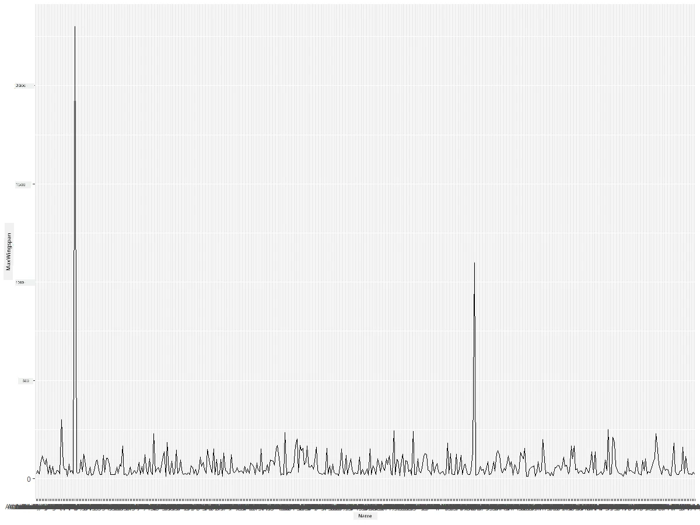
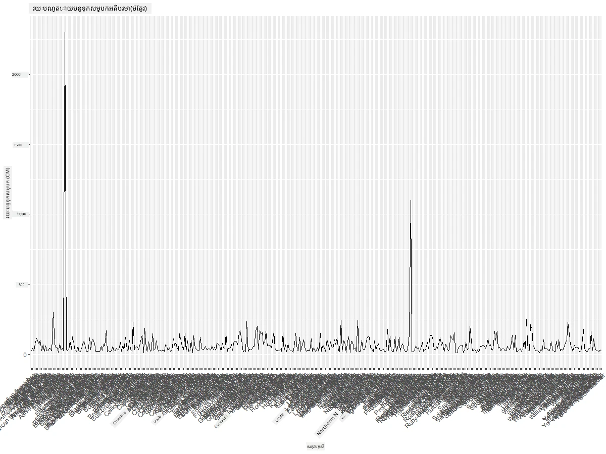
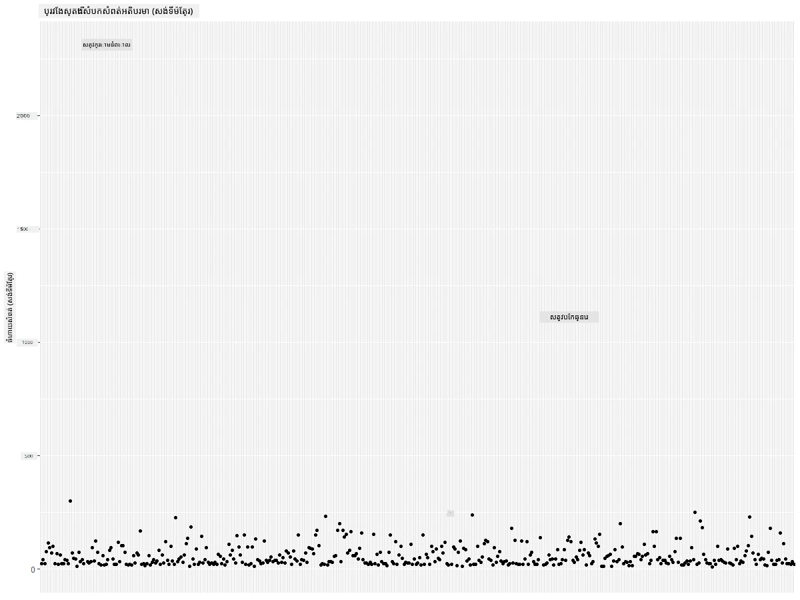
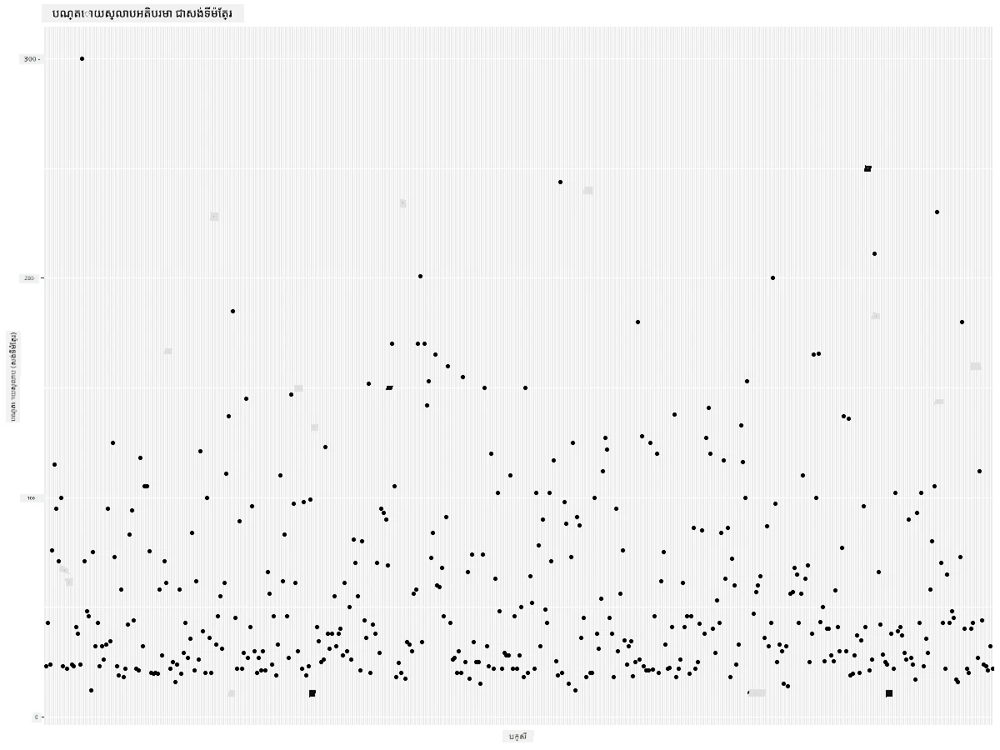
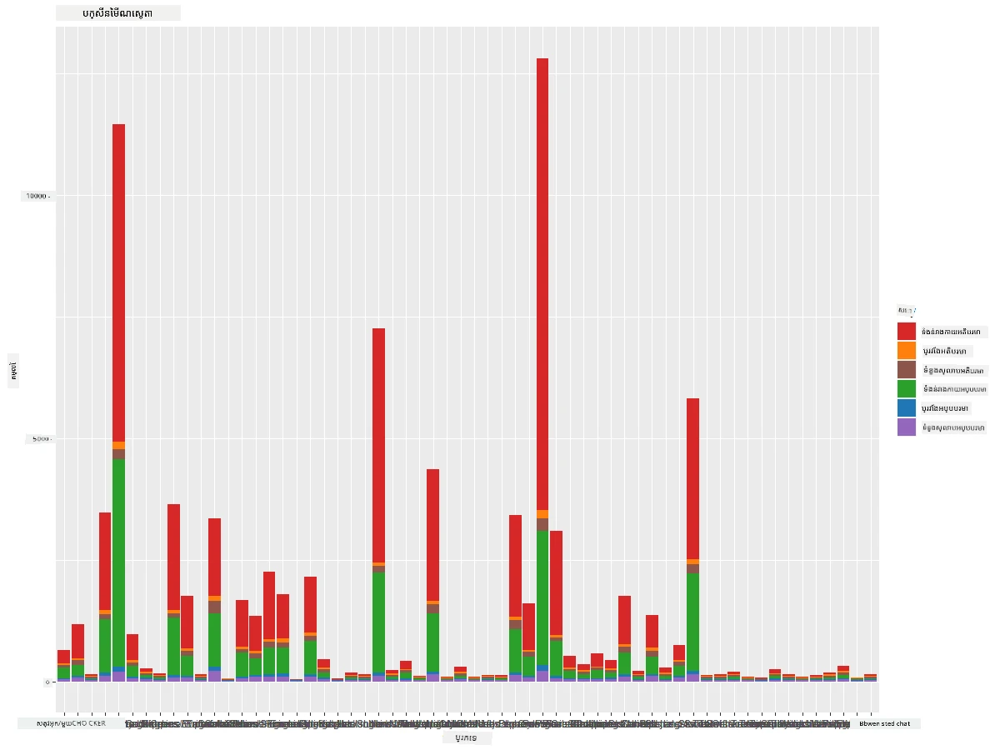
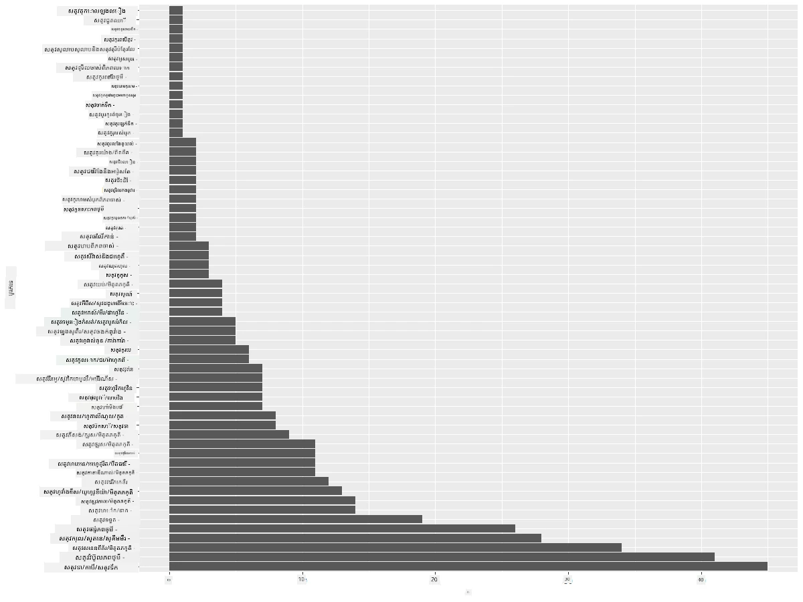
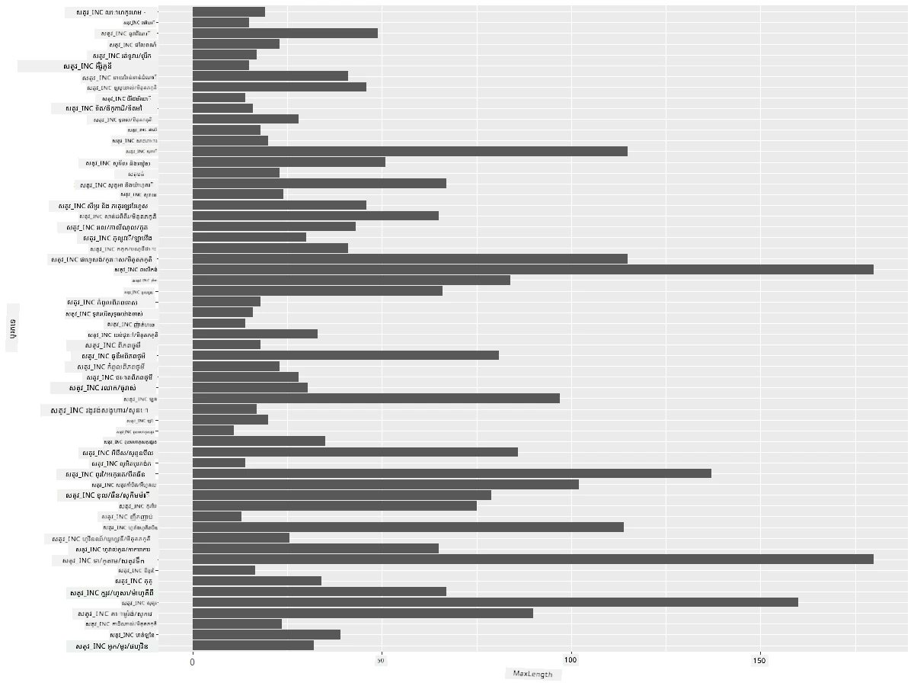
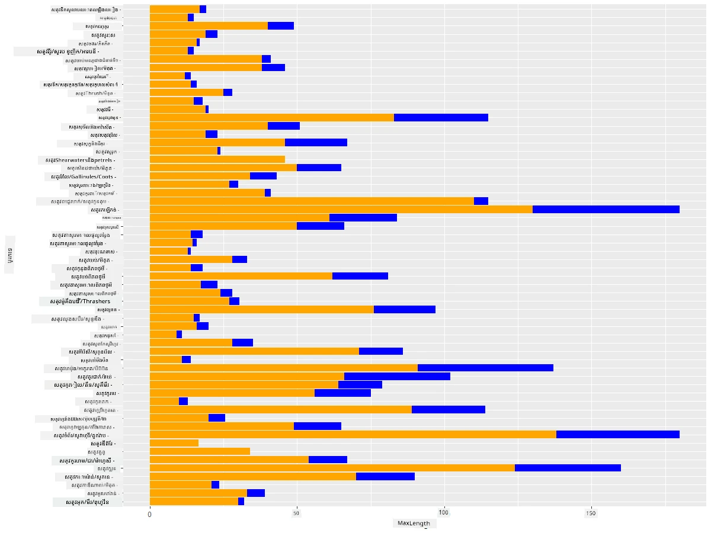

# ការមើលឃើញបរិមាណ
| ](https://github.com/microsoft/Data-Science-For-Beginners/blob/main/sketchnotes/09-Visualizing-Quantities.png)|
|:---:|
| ការមើលឃើញបរិមាណ - _Sketchnote ដោយ [@nitya](https://twitter.com/nitya)_ |

នៅក្នុងមេរៀននេះ អ្នកនឹងស្វែងយល់ពីរបៀបប្រើប្រាស់កញ្ចប់បណ្ណាល័យ R ច្រើនដែលមានស្រាប់ ដើម្បីរៀនពីរបៀបបង្កើតការមើលឃើញដ៏គួរឱ្យចាប់អារម្មណ៍ជុំវិញមូលដ្ឋាននៃមាត្រដ្ឋានបរិមាណ។ ដោយប្រើសំណុំទិន្នន័យបានសំអាតអំពីបក្សីក្នុងរដ្ឋ Minnesota អ្នកអាចរៀនព័ត៌មានច្រើនគួរឱ្យចាប់អារម្មណ៍អំពីសត្វព្រៃក្នុងតំបន់។

## [តេស្តមុនមេរៀន](https://purple-hill-04aebfb03.1.azurestaticapps.net/quiz/16)

## សង្កេត wingspan ជាមួយ ggplot2
បណ្ណាល័យល្អបំផុតមួយសម្រាប់បង្កើតគំនូស និងតារាងសាមញ្ញក៏ដូចជាស្មុគស្មាញមានប្រភេទផ្សេងៗគ្នា គឺ [ggplot2](https://cran.r-project.org/web/packages/ggplot2/index.html)។ ជាទូទៅ ការបង្កើតគំនូសជាមួយបណ្ណាល័យទាំងនេះរួមមាន ការបញ្ជាក់ពីផ្នែកនៃទិន្នន័យដែលអ្នកចង់ចំណេញ ការប្រតិបត្តិការបំលែងលើទិន្នន័យតាមតម្រូវការ ការបែងចែកតម្លៃអ័ក្ស x និង y ការជ្រើសរើសប្រភេទគំនូសដែលចង់បង្ហាញ ហើយបង្ហាញគំនូស។

`ggplot2` គឺជារបៀបសម្រាប់បង្កើតក្រាហ្វិកដោយប្រកាសដោយផ្អែកលើ The Grammar of Graphics។ The [Grammar of Graphics](https://en.wikipedia.org/wiki/Ggplot2) គឺជារៀបចំទូទៅមួយសម្រាប់ការមើលឃើញទិន្នន័យដែលបំបែកក្រាហ្វិកទៅជាផ្នែកសម័យផ្សេងៗដូចជាជម្រក និងស្រទាប់។ ផ្សេងទៀត ការងាយស្រួលក្នុងការបង្កើតគំនូស និងក្រាហ្វិកសម្រាប់ទិន្នន័យមួយឬច្រើនជាមួយកូដតិចបំផុតធ្វើឲ្យ `ggplot2` ជាកញ្ចប់ដែលពេញនិយមបំផុតសម្រាប់ការមើលឃើញទិន្នន័យក្នុង R ។ អ្នកប្រើប្រាស់ប្រាប់ `ggplot2` ដើម្បីផ្គូផ្គងអថេរ ទៅកាន់អេស្ថេតិក គំនូសក្រាហ្វិកត្រូវប្រើ ហើយ `ggplot2` នឹងថែរក្សាផ្នែកនៅសល់។

> ✅ គំនូស = ទិន្នន័យ + អេស្ថេតិក + រូបវិទ្យា
> - ទិន្នន័យឈ្មោះដល់សំណុំទិន្នន័យ
> - អេស្ថេតិក ប្រាប់ពីអថេរដែលត្រូវសិក្សា (អ័ក្ស x និង y)
> - រូបវិទ្យា ជាប្រភេទនៃគំនូស (គំនូសបន្ទាត់, គំនូសបារ, ល។)

ជ្រើសរើសរូបវិទ្យាដែលល្អបំផុត (ប្រភេទគំនូស) នៅតាមទិន្នន័យរបស់អ្នក និងរឿងដែលអ្នកចង់ប្រាប់តាមរយៈគំនូស។

> - ដើម្បីវិភាគនិន្នាការ៖ បន្ទាត់, ជួរឈរ
> - ដើម្បីប្រៀបធៀបតម្លៃ៖ បារ, ជួរឈរ, ផ្គុំផែនទី, គំនូសចែកចាយចុចចំលើយ
> - ដើម្បីបង្ហាញរបៀបផ្នែកជាប់នឹងទីបំផុត៖ ផ្គុំផែនទី
> - ដើម្បីបង្ហាញការបែងចែកទិន្នន័យ៖ គំនូសចែកចាយចុចចំលើយ, បារ
> - ដើម្បីបង្ហាញទំនាក់ទំនងរវាងតម្លៃ៖ បន្ទាត់, គំនូសចែកចាយចុចចំលើយ, គំនូសរំញ័រ

✅ អ្នកអាចពិនិត្យមើល [cheatsheet ពណ៌នានេះ](https://nyu-cdsc.github.io/learningr/assets/data-visualization-2.1.pdf) សម្រាប់ ggplot2។

## បង្កើតគំនូសបន្ទាត់អំពីតម្លៃ wingspan របស់បក្សី

បើករបាយការណ៍ R និងនាំចូលសំណុំទិន្នន័យ។
> ចំណាំ៖ សំណុំទិន្នន័យត្រូវរក្សាទុកនៅថតគោលនៃប្រភពនេះក្នុងថត `/data`។

យើងនាំចូលសំណុំទិន្នន័យ ហើយសង្កេតមើលក្បាល (5ជួរដេកលើសម្រាប់ទិន្នន័យ)។

```r
birds <- read.csv("../../data/birds.csv",fileEncoding="UTF-8-BOM")
head(birds)
```
ក្បាលទិន្នន័យមានការលាយបញ្ចូលរវាងអក្សរនិងលេខ៖

|      | ឈ្មោះ                        | ឈ្មោះវិទ្យាសាស្ត្រ         | ប្រភេទ                   | លំដាប់            | គ្រួសារ  | និយមន័យ    | ស្ថានភាពការការពារ | ប្រវែងតិចបំផុត | ប្រវែងធំបំផុត | ទំងន់រាងកាយតិចបំផុត | ទំងន់រាងកាយធំបំផុត | Wingspan តិចបំផុត | Wingspan ធំបំផុត |
| ---: | :--------------------------- | :--------------------- | :-------------------- | :----------- | :------- | :---------- | :----------------- | --------: | --------: | ----------: | ----------: | ----------: | ----------: |
|    0 | ក្មេងទន្សាយខ្មៅ-ខ្លា           | Dendrocygna autumnalis | ទូតទេរ/ទេស្ដ/ទឹកសម្រាប់      | Anseriformes | Anatidae | Dendrocygna | LC                 |        47 |        56 |         652 |        1020 |          76 |          94 |
|    1 | ក្មេងទន្សាយលឿង                   | Dendrocygna bicolor    | ទូតទេរ/ទេស្ដ/ទឹកសម្រាប់      | Anseriformes | Anatidae | Dendrocygna | LC                 |        45 |        53 |         712 |        1050 |          85 |          93 |
|    2 | ទន្សាយពណ៌ស                      | Anser caerulescens     | ទូតទេរ/ទេស្ដ/ទឹកសម្រាប់      | Anseriformes | Anatidae | Anser       | LC                 |        64 |        79 |        2050 |        4050 |         135 |         165 |
|    3 | ទន្សាយរ៉ូស                       | Anser rossii           | ទូតទេរ/ទេស្ដ/ទឹកសម្រាប់      | Anseriformes | Anatidae | Anser       | LC                 |      57.3 |        64 |        1066 |        1567 |         113 |         116 |
|    4 | ទន្សាយសន្និបាតធំ                 | Anser albifrons        | ទូតទេរ/ទេស្ដ/ទឹកសម្រាប់      | Anseriformes | Anatidae | Anser       | LC                 |        64 |        81 |        1930 |        3310 |         130 |         165 |

ចាប់ផ្តើមដោយបង្កើតគំនូសខ្លះៗនៃទិន្នន័យលេខដោយគំនូសបន្ទាត់មូលដ្ឋាន។ សន្មត់ថាអ្នកចង់មើលទិសដៅពី wingspan ខ្ពស់បំផុតសម្រាប់បក្សីទាំងនេះ។

```r
install.packages("ggplot2")
library("ggplot2")
ggplot(data=birds, aes(x=Name, y=MaxWingspan,group=1)) +
  geom_line() 
```
នៅទីនេះ អ្នកដំឡើងកញ្ចប់ `ggplot2` ហើយនាំចូលវាទៅកាន់ផ្ទៃការងារ ដោយប្រើពាក្យបញ្ជា `library("ggplot2")`។ ដើម្បីគូសគំនូសណាមួយក្នុង ggplot អ្នកប្រើមុខងារ `ggplot()` ហើយបញ្ជាក់សំណុំទិន្នន័យ អ័ក្ស x, y ជាទ្រព្យសម្បត្តិ។ ក្នុងករណីនេះ យើងប្រើមុខងារ `geom_line()` ពីព្រោះមានគោលដៅបង្ហាញគំនូសបន្ទាត់។



តើអ្នកចាប់អារម្មណ៍អ្វីភ្លាមៗ? មានប្រហែលករណីចេញក្រៅអង្គការ ១ករណីមួយណាមួយ - នោះគឺ wingspan ធំបំផុតខ្លាំងណាស់! wingspan 2000+ សង់ទីម៉ែត្រ មានប្រវែងលើស 20 ម៉ែត្រហើយដែរ - តើមាន Pterodactyls ឡើងដើរនៅ Minnesota? មកវិភាគច្បាស់។

ក្នុងខណៈដែលអ្នកអាចធ្វើការតម្រៀបក្នុង Excel ដើម្បីរកករណីចេញក្រៅ មួយនេះដែលប្រហែលជាការខុសត្រូវបានវាយតម្លៃ បន្តដំណើរការមើលឃើញដោយធ្វើការងាយក្នុងគំនូស។

បញ្ចូលស្លាកទៅអ័ក្ស x ដើម្បីបង្ហាញថាបក្សីណាខ្លះខ្លះត្រូវបានពិចារណា៖

```r
ggplot(data=birds, aes(x=Name, y=MaxWingspan,group=1)) +
  geom_line() +
  theme(axis.text.x = element_text(angle = 45, hjust=1))+
  xlab("Birds") +
  ylab("Wingspan (CM)") +
  ggtitle("Max Wingspan in Centimeters")
```
យើងបញ្ជាក់មុំក្នុង `theme` ហើយបញ្ជាក់ស្លាកអ័ក្ស x និង y ជាផ្ទាំងស្លាកក្នុង `xlab()` និង `ylab()` តាមលំដាប់។ `ggtitle()` ផ្តល់ឈ្មោះដល់ក្រាហ្វ/គំនូស។



ទោះបីជាបានបង្វិលស្លាកទៅ 45 ដឺក្រេ ក៏ប៉ុន្តែមានច្រើនពេកដើម្បីអាន។ តោះសាកល្បងយុទ្ធសាស្រ្តផ្សេង៖ ស្លាកមានតែចេញក្រៅប៉ុណ្ណោះ ហើយកំណត់ស្លាកនៅក្នុងតារាង។ អ្នកអាចប្រើគំនូសចែកចាយចុចចំលើយដើម្បីធ្វើផ្លូវសម្រាប់ស្លាកជា​ច្រើន៖

```r
ggplot(data=birds, aes(x=Name, y=MaxWingspan,group=1)) +
  geom_point() +
  geom_text(aes(label=ifelse(MaxWingspan>500,as.character(Name),'')),hjust=0,vjust=0) + 
  theme(axis.title.x=element_blank(), axis.text.x=element_blank(), axis.ticks.x=element_blank())
  ylab("Wingspan (CM)") +
  ggtitle("Max Wingspan in Centimeters") + 
```
តើមានអ្វីកើតឡើងនៅទីនេះ? អ្នកប្រើមុខងារ `geom_point()` ដើម្បីគូសចំណុចចែកចាយ។ តាមនេះ អ្នកបានបន្ថែមស្លាកសម្រាប់បក្សីដែលមាន `MaxWingspan > 500` ហើយលាក់ស្លាកនៅអ័ក្ស x ដើម្បីអោយគំនូសស្អាតក្នុងវិស័យតូចម្ដង។

តើអ្នករកឃើញអ្វី?



## កែលម្អទិន្នន័យរបស់អ្នក

ទាំង Bald Eagle និង Prairie Falcon ទោះបីជាបង្ហាញថា ត្រូវបង្កើនតម្លៃតែម្ដង ទោះបីវាលំបាកប៉ុន្តែក៏មានទីតាំងត្រឹមត្រូវ ដែលមានការបន្ថែម 0 មួយទៀតទៅក្នុង wingspan សំខាន់របស់ពួកវា។ មិនសូវមានសង្ឃឹមថាអ្នកនឹងជួប Bald Eagle ដែលមាន wingspan 25 ម៉ែត្រ, ប៉ុន្តែប្រសិនបើមាន សូមប្រាប់យើង! តោះបង្កើត dataframe ថ្មីដែលមិនមានករណីចេញក្រៅទាំងពីរ៖

```r
birds_filtered <- subset(birds, MaxWingspan < 500)

ggplot(data=birds_filtered, aes(x=Name, y=MaxWingspan,group=1)) +
  geom_point() +
  ylab("Wingspan (CM)") +
  xlab("Birds") +
  ggtitle("Max Wingspan in Centimeters") + 
  geom_text(aes(label=ifelse(MaxWingspan>500,as.character(Name),'')),hjust=0,vjust=0) +
  theme(axis.text.x=element_blank(), axis.ticks.x=element_blank())
```
យើងបានបង្កើត dataframe ថ្មី `birds_filtered` ហើយក៏គូសគំនូសចែកចាយចុចចំលើយមួយ។ ដោយច្រោះចេញពីករណីចេញក្រៅ ទិន្នន័យរបស់អ្នកឥឡូវនេះមានភាពសន្តិសុខ និងយល់បានល្អ។



ឥឡូវនេះដែលយើងមានសំណុំទិន្នន័យបានសម្អាតយ៉ាងហោចណាស់ក្នុងវិស័យ wingspan យើងមកស្វែងយល់បន្ថែមអំពីបក្សីទាំងនេះ។

ក្នុងខណៈដែលគំនូសបន្ទាត់ និងគំនូសចែកចាយចុចចំលើយអាចបង្ហាញព័ត៌មានអំពីតម្លៃទិន្នន័យ និងការបែងចែកទិន្នន័យ ប៉ុន្តែយើងចង់គិតអំពីតម្លៃដែលស្ថិតក្នុងសំណុំទិន្នន័យនេះ។ អ្នកអាចបង្កើតការមើលឃើញដើម្បីឆ្លើយសំណួរខាងក្រោមអំពីបរិមាណ៖

> តើមានប៉ុន្មានប្រភេទបក្សី ហើយតើមានចំនួនប៉ុន្មាន?
> តើមានប៉ុន្មានបក្សីបានបាត់បង់, មានគ្រោះថ្នាក់, មានកំណត់ត្រាច្រើន, ឬធម្មតា?
> តើមានប៉ុន្មាននៃក្រុម genus និងលំដាប់នៅក្នុងប្រព័ន្ធ Linnaeus?

## សិក្សា គំនូសបារ

គំនូសបារ អាចប្រើបានយ៉ាងមានប្រយោជន៍នៅពេលដែលអ្នកត្រូវបង្ហាញក្រុមទិន្នន័យ។ តោះស្រាវជ្រាវប្រភេទបក្សីដែលមាននៅក្នុងសំណុំទិន្នន័យនេះ ដើម្បីមើលថាតើប្រភេទណាគឺពេញនិយមបំផុតតាមចំនួន។

តោះបង្កើតគំនូសបារ លើទិន្នន័យបានច្រោះចេញ។

```r
install.packages("dplyr")
install.packages("tidyverse")

library(lubridate)
library(scales)
library(dplyr)
library(ggplot2)
library(tidyverse)

birds_filtered %>% group_by(Category) %>%
  summarise(n=n(),
  MinLength = mean(MinLength),
  MaxLength = mean(MaxLength),
  MinBodyMass = mean(MinBodyMass),
  MaxBodyMass = mean(MaxBodyMass),
  MinWingspan=mean(MinWingspan),
  MaxWingspan=mean(MaxWingspan)) %>% 
  gather("key", "value", - c(Category, n)) %>%
  ggplot(aes(x = Category, y = value, group = key, fill = key)) +
  geom_bar(stat = "identity") +
  scale_fill_manual(values = c("#D62728", "#FF7F0E", "#8C564B","#2CA02C", "#1F77B4", "#9467BD")) +                   
  xlab("Category")+ggtitle("Birds of Minnesota")

```
ក្នុងខ័ណ្ឌនេះ យើងដំឡើងកញ្ចប់ [dplyr](https://www.rdocumentation.org/packages/dplyr/versions/0.7.8) និង [lubridate](https://www.rdocumentation.org/packages/lubridate/versions/1.8.0) ដើម្បីជួយដោះស្រាយ និងចែកចាយទិន្នន័យសម្រាប់គំនូសបារ stacked។ ជាលើកដំបូង អ្នកចែកក្រុមទិន្នន័យតាម `Category` នៃបក្សី ហើយបន្តស្សារតាមជួរឈរ `MinLength`, `MaxLength`, `MinBodyMass`, `MaxdyMass`, `MinWingspan`, `MaxWingspan`។ បន្ទាប់មក គូសគំនូសបារប្រើកញ្ចប់ `ggplot2` ហើយបញ្ជាក់ពណ៌សម្រាប់ប្រភេទផ្សេងៗនៃបក្សី និងស្លាក។



គំនូសបារនេះ មិនអាចអានបានទេ ព្រោះមានទិន្នន័យមិនបានចែកក្រុមច្រើនពេក។ អ្នកត្រូវជ្រើសទិន្នន័យដែលចង់គូសប៉ុណ្ណោះ ដូច្នេះមកមើលប្រវែងនៃបក្សីដាក់លើមូលដ្ឋានប្រភេទរបស់ពួកវា។

ច្រោះចេញតែចំណាត់ថ្នាក់បក្សីប៉ុណ្ណោះ។

ដោយសារតែមានច្រើនប្រភេទ អ្នកអាចបង្ហាញគំនូសនេះឱ្យឈរឈរ ហើយកែសំរួលកម្ពស់វាឱ្យត្រូវនឹងទិន្នន័យទាំងអស់៖

```r
birds_count<-dplyr::count(birds_filtered, Category, sort = TRUE)
birds_count$Category <- factor(birds_count$Category, levels = birds_count$Category)
ggplot(birds_count,aes(Category,n))+geom_bar(stat="identity")+coord_flip()
```
អ្នករាប់តម្លៃតែម្តងក្នុងជួរឈរ `Category` ហើយតម្រៀបវាទៅក្នុង dataframe ថ្មីឈ្មោះ `birds_count`។ ទិន្នន័យតម្រៀបនេះត្រូវបានកំណត់ជាតម្លៃ factored នៅក្នុងកម្រិតដដែល ហើយបានគូសវាទៅក្នុងរបបតម្រៀប។ ប្រើ `ggplot2` អ្នកគូសគំនូសបារដោយបញ្ចូល `coord_flip()` ដើម្បីបង្ហាញបារ៉ាងហ្វូយហ្វូយ។



គំនូសបារនេះបង្ហាញទស្សនវិស័យល្អចំពោះចំនួនបក្សីក្នុងប្រភេទនីមួយៗ។ ក្នុងពេលខ្លី ទស្សនាវិទ្យាអ្នកមើលឃើញថាចំនួនបក្សីច្រើនបំផុតនៅតំបន់នេះស្ថិតនៅក្នុងប្រភេទ Ducks/Geese/Waterfowl។ Minnesota គឺជាដែនដីនៃបឹង ១០,០០០ ផ្ទាំង ដូច្នេះវាមិនអារម្មណ៍ភាពហោរាឡើយ!

✅ សាកល្បងរាប់តម្លៃផ្សេងទៀតលើសំណុំទិន្នន័យនេះ។ តើមានអ្វីដែលធ្វើអោយអ្នកភ្ញាក់ផ្អើលទេ?

## ការប្រៀបធៀបទិន្នន័យ

អ្នកអាចសាកល្បងការប្រៀបធៀបនៃទិន្នន័យបែងចែកដោយបង្កើតអ័ក្សថ្មីៗ។ សាកល្បងប្រៀបធៀប MaxLength នៃបក្សីមួយ ដោយផ្អែកលើប្រភេទរបស់វា៖

```r
birds_grouped <- birds_filtered %>%
  group_by(Category) %>%
  summarise(
  MaxLength = max(MaxLength, na.rm = T),
  MinLength = max(MinLength, na.rm = T)
           ) %>%
  arrange(Category)
  
ggplot(birds_grouped,aes(Category,MaxLength))+geom_bar(stat="identity")+coord_flip()
```
យើងចែកក្រុមទិន្នន័យ `birds_filtered` តាម `Category` ហើយបន្ទាប់មកគូសគំនូសបារ។



គ្មានអ្វីអស្រូវទេ៖ បក្សី hummingbirds មាន MaxLength តិចជាង Pelicans ឬ Geese។ វាល្អពេលដែលទិន្នន័យមានអត្ថន័យត្រឹមត្រូវ!

អ្នកអាចបង្កើតការមើលឃើញគំនូសបារដ៏គួរឱ្យចាប់អារម្មណ៍ជាមួយការចំបាញ់ទិន្នន័យពីរដុំគ្នា។ អ្នកអាចចំបាញ់ប្រវែងតិចបំផុត និងប្រវែងធំបំផុតនៅលើប្រភេទបក្សីមួយ៖

```r
ggplot(data=birds_grouped, aes(x=Category)) +
  geom_bar(aes(y=MaxLength), stat="identity", position ="identity",  fill='blue') +
  geom_bar(aes(y=MinLength), stat="identity", position="identity", fill='orange')+
  coord_flip()
```


## 🚀 សម្រួល

សំណុំទិន្នន័យបក្សីនេះផ្តល់ព័ត៌មានជាច្រើនអំពីប្រភេទបក្សីនៅក្នុងប្រព័ន្ធបរិស្ថានជាក់លាក់ទេ។ ស្វែងរកនៅលើអ៊ីនធឺណិត ហើយមើលថាតើអ្នកអាចរកឃើញសំណុំទិន្នន័យផ្សេងៗទាក់ទងនឹងបក្សីទៀតប៉ុន្មាន។ ហាត់បង្កើតគំនូស និងក្រាហ្វិកជុំវិញបក្សីទាំងនេះ ដើម្បីរកឃើញកត្តាផ្សេងៗដែលអ្នកមិនធ្លាប់ដឹង។

## [តេស្តបន្ទាប់មេរៀន](https://purple-hill-04aebfb03.1.azurestaticapps.net/quiz/17)

## ពិនិត្យឡើងវិញ និងសិក្សាឯកតាឯករាជ្យ

មេរៀនទី១នេះបានផ្តល់ព័ត៌មានមួយចំនួនអំពីរបៀបប្រើប្រាស់ `ggplot2` ដើម្បីមើលឃើញបរិមាណ។ ស្រាវជ្រាវបន្ថែមអំពីវិធីផ្សេងទៀតក្នុងការជំនួសទិន្នន័យសម្រាប់ការមើលឃើញ។ ស្រាវជ្រាវ និងតាមដានសំណុំទិន្នន័យដែលអាចបង្កើតការមើលឃើញដោយកញ្ចប់ផ្សេងទៀត ដូចជា [Lattice](https://stat.ethz.ch/R-manual/R-devel/library/lattice/html/Lattice.html) និង [Plotly](https://github.com/plotly/plotly.R#readme)

## បេសកកម្ម
[បន្ទាត់, ការបែកចែក និង បារ](assignment.md)

---

<!-- CO-OP TRANSLATOR DISCLAIMER START -->
**ការព្រមាន**៖  
ឯកសារនេះត្រូវបានបម្លែងជាភាសាដោយប្រើសេវាកម្មបកប្រែ AI [Co-op Translator](https://github.com/Azure/co-op-translator)។ ខណៈពេលដែលយើងខំប្រឹងប្រែងដើម្បីភាពត្រឹមត្រូវ សូមយកចិត្តទុកដាក់ថាការបកប្រែដោយស្វ័យប្រវត្តិកើតមានកំហុស ឬភាពមិនត្រឹមត្រូវបាន។ ឯកសារដើមក្នុងភាសាមាតុភូមិនឹងត្រូវបានគិតជារម្មណ៍ឯកសារដែលមានអំណាច។ សម្រាប់ព័ត៌មានសំខាន់ៗ សូមណែនាំឲ្យមានការបកប្រែដោយអ្នកជំនាញដែលមានជំនាញ។ យើងមិនទទួលខុសត្រូវចំពោះការយល់ច្រឡំហ ឬការបកប្រែខុសពីការប្រើប្រាស់បកប្រែក្នុងឯកសារនេះទេ។
<!-- CO-OP TRANSLATOR DISCLAIMER END -->