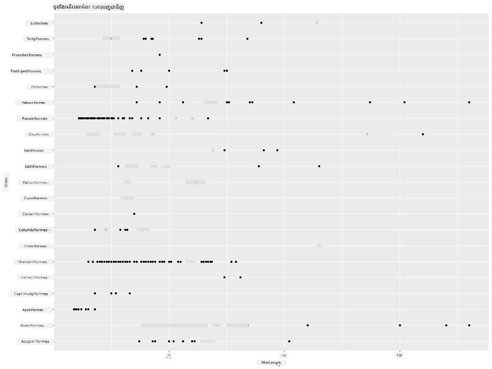
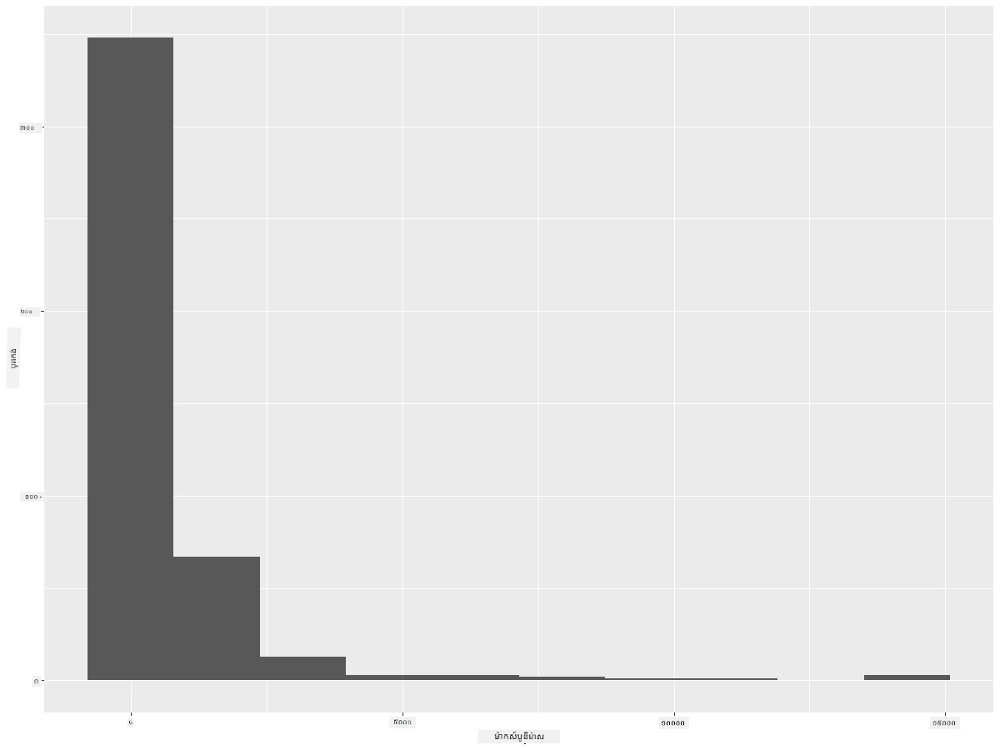
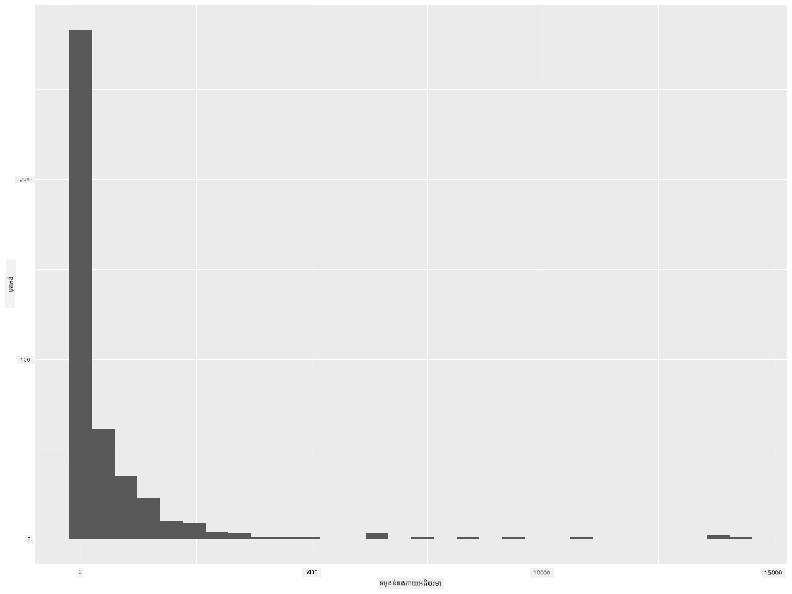
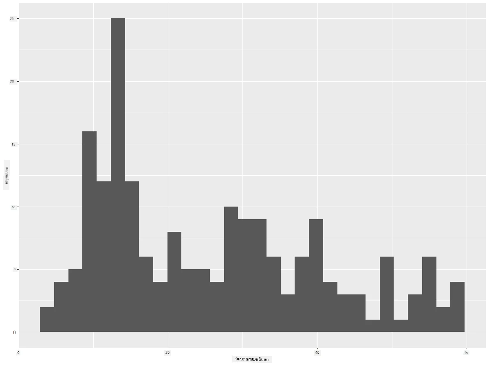
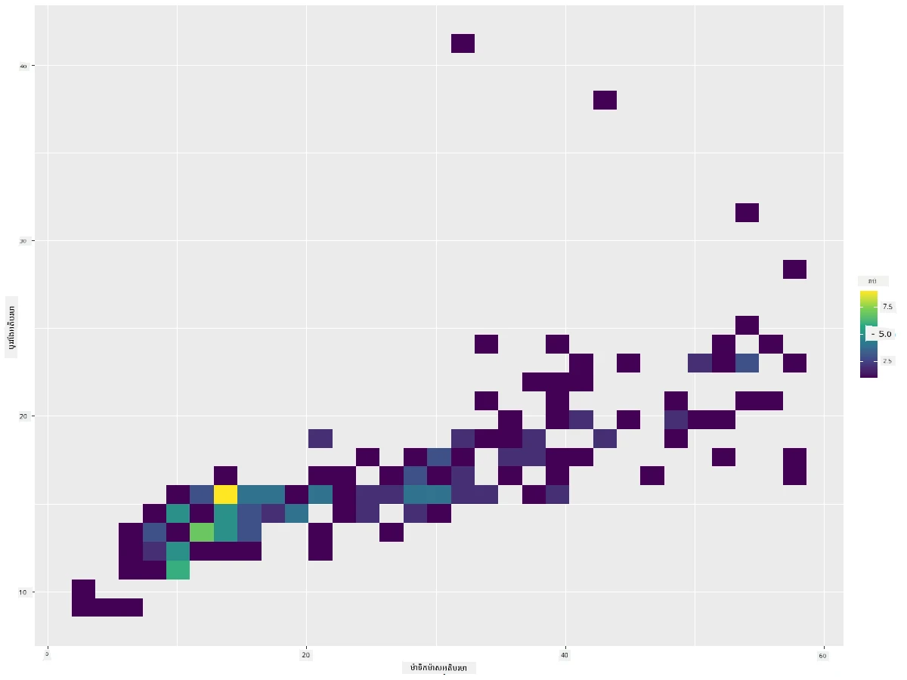
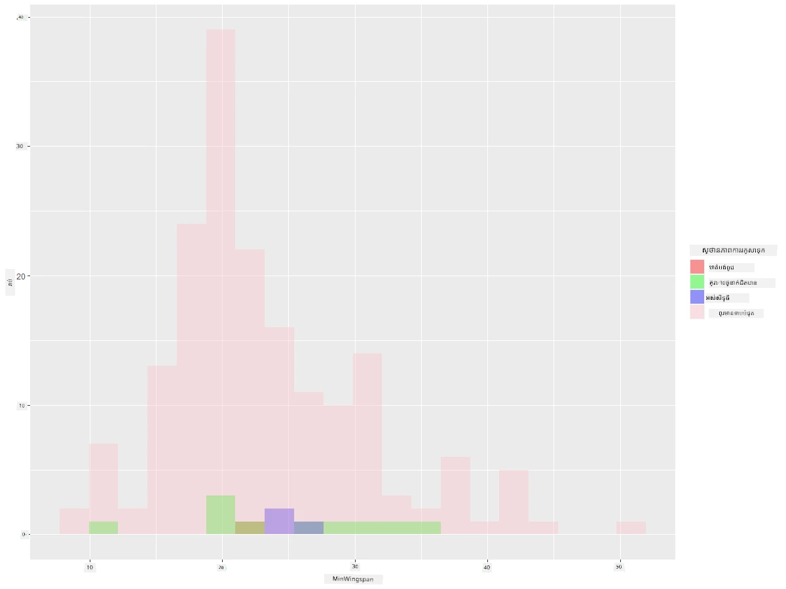
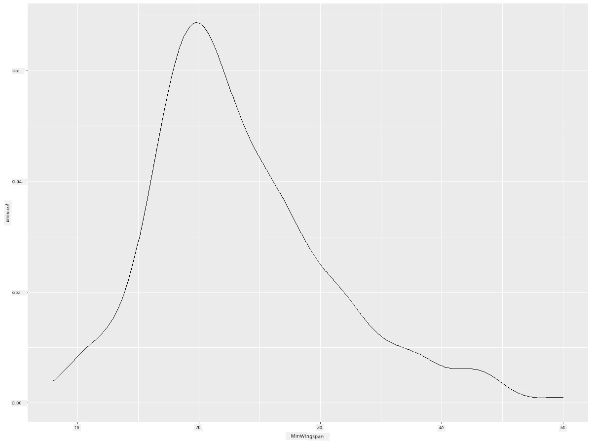
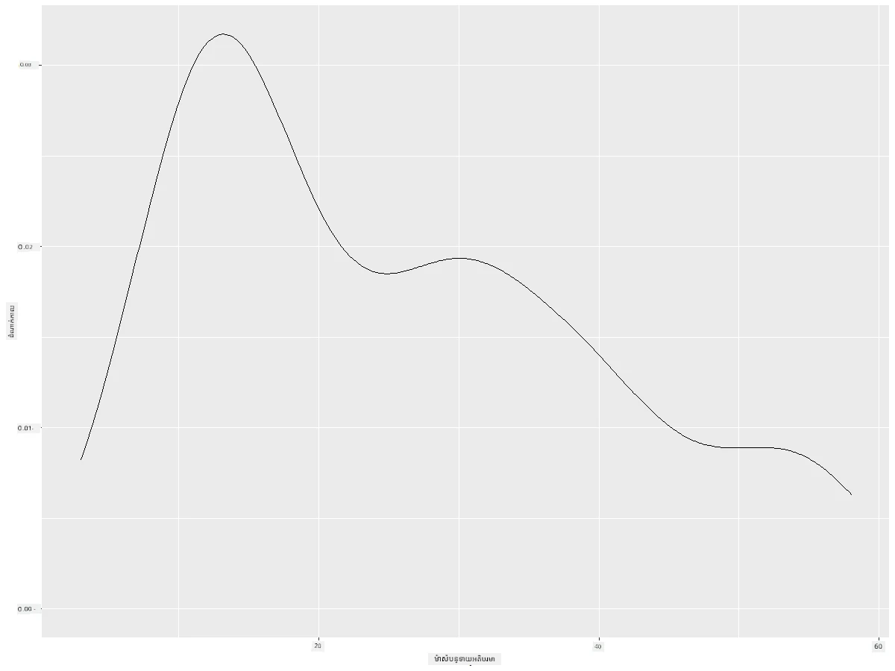
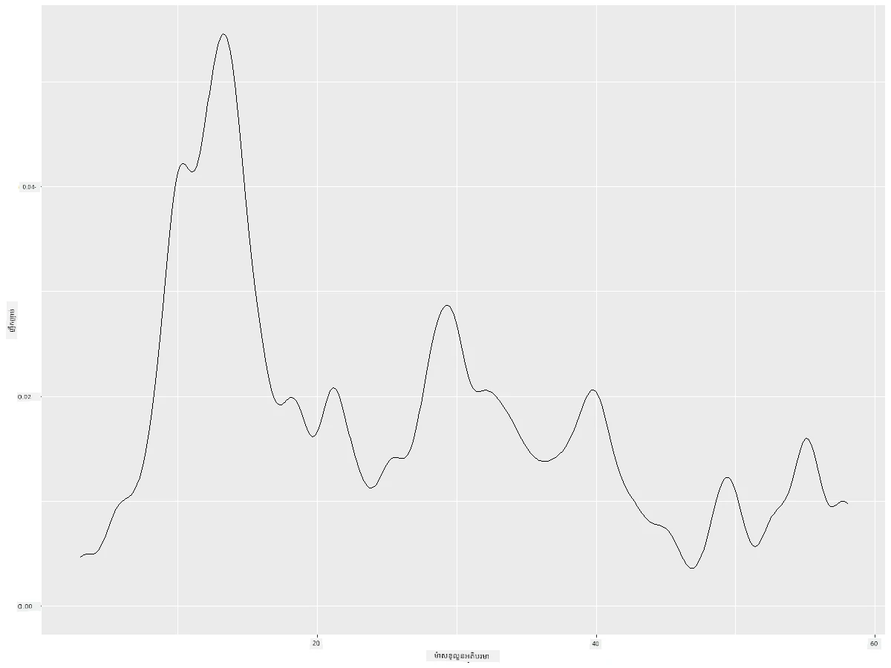
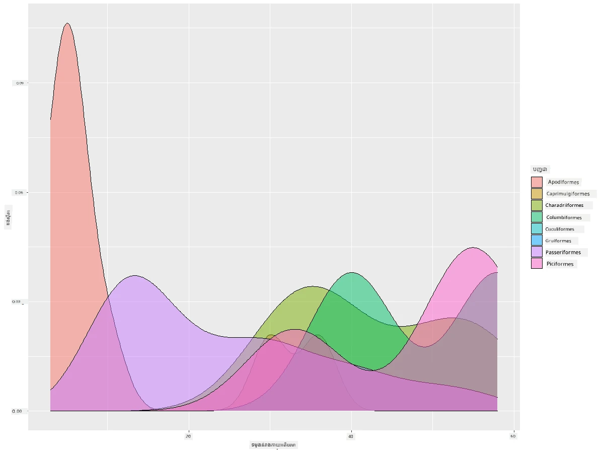

# Visualizing Distributions

| ](https://github.com/microsoft/Data-Science-For-Beginners/blob/main/sketchnotes/10-Visualizing-Distributions.png)|
|:---:|
| ការបង្ហាញចែកចាយ - _Sketchnote ដោយ [@nitya](https://twitter.com/nitya)_ |

នៅក្នុងមេរៀនមុន អ្នកបានរៀនពីការពិតចំនួនមួយអំពីឃ្លាំងទិន្នន័យអំពីសត្វបកប្រទេស Minnesota។ អ្នកបានរកឃើញទិន្នន័យកំហុសមួយចំនួន ដោយភ្លក្សមើលចំណុចខុសឆ្គង ហើយបានមើលឃើញភាពខុសគ្នារវាងប្រភេទសត្វបកតាមប្រវែងអតិបរមារបស់ពួកវា។

## [Pre-lecture quiz](https://purple-hill-04aebfb03.1.azurestaticapps.net/quiz/18)
## ស្វែងយល់អំពីឃ្លាំងទិន្នន័យសត្វបក

វិធីមួយផ្សេងទៀតដើម្បីស្វែងយល់ចំពោះទិន្នន័យគឺមើលតាមចែកចាយរបស់វា ឬរបៀបដែលទិន្នន័យត្រូវបានរៀបចំតាមតួអក្សរ។ ប្រហែលជា អ្នកចង់ស្វែងយល់អំពីការចែកចាយទូទៅ សម្រាប់ឃ្លាំងទិន្នន័យនេះ នៃប្រវែងកែវស្លាបអតិបរមា ឬម៉ាសរាងកាយអតិបរមាសម្រាប់សត្វបករបស់ Minnesota។ 

យើងនឹងស្វែងរកការពិតអំពីចែកចាយទិន្នន័យនៅក្នុងឃ្លាំងទិន្នន័យនេះ។ នៅក្នុងម៉ាស៊ីន R របស់អ្នក នាំចូល `ggplot2` និងឃ្លាំងទិន្នន័យ។ ដកចេញចំណុចខុសឆ្គងពីឃ្លាំងទិន្នន័យដូចក្នុងប្រធានបទមុន។

```r
library(ggplot2)

birds <- read.csv("../../data/birds.csv",fileEncoding="UTF-8-BOM")

birds_filtered <- subset(birds, MaxWingspan < 500)
head(birds_filtered)
```
|      | Name                         | ScientificName         | Category              | Order        | Family   | Genus       | ConservationStatus | MinLength | MaxLength | MinBodyMass | MaxBodyMass | MinWingspan | MaxWingspan |
| ---: | :--------------------------- | :--------------------- | :-------------------- | :----------- | :------- | :---------- | :----------------- | --------: | --------: | ----------: | ----------: | ----------: | ----------: |
|    0 | Black-bellied whistling-duck | Dendrocygna autumnalis | Ducks/Geese/Waterfowl | Anseriformes | Anatidae | Dendrocygna | LC                 |        47 |        56 |         652 |        1020 |          76 |          94 |
|    1 | Fulvous whistling-duck       | Dendrocygna bicolor    | Ducks/Geese/Waterfowl | Anseriformes | Anatidae | Dendrocygna | LC                 |        45 |        53 |         712 |        1050 |          85 |          93 |
|    2 | Snow goose                   | Anser caerulescens     | Ducks/Geese/Waterfowl | Anseriformes | Anatidae | Anser       | LC                 |        64 |        79 |        2050 |        4050 |         135 |         165 |
|    3 | Ross's goose                 | Anser rossii           | Ducks/Geese/Waterfowl | Anseriformes | Anatidae | Anser       | LC                 |      57.3 |        64 |        1066 |        1567 |         113 |         116 |
|    4 | Greater white-fronted goose  | Anser albifrons        | Ducks/Geese/Waterfowl | Anseriformes | Anatidae | Anser       | LC                 |        64 |        81 |        1930 |        3310 |         130 |         165 |

ទូទៅ អ្នកអាចមើលឃើញយ៉ាងរហ័សរបៀបដែលទិន្នន័យត្រូវបានចែកចាយ ដោយប្រើអ្នកគូរប្រភេទស្កាតទ័រ ដូចដែលយើងបានធ្វើក្នុងមេរៀនមុន៖

```r
ggplot(data=birds_filtered, aes(x=Order, y=MaxLength,group=1)) +
  geom_point() +
  ggtitle("Max Length per order") + coord_flip()
```


នេះបង្ហាញទិដ្ឋភាពទូទៅនៃចែកចាយប្រវែងកាយខ្លួនប្រចាំលំដាប់សត្វបក ប៉ុន្តែវាមិនមែនជាវិធីល្អបំផុតសម្រាប់បង្ហាញចែកចាយពិតប្រាកដទេ។ ការប្រព្រឹត្តការនេះទូទៅត្រូវបានធ្វើដោយការ បង្កើតតារាងហ៊ីស្តូក្រាម។
## ការងារជាមួយហ៊ីស្តូក្រាម

`ggplot2` ផ្ដល់នូវវិធីល្អបំផុតសម្រាប់បង្ហាញចែកចាយទិន្នន័យដោយការប្រើប្រាស់ហ៊ីស្តូក្រាម។ ប្រភេទតារាងនេះគឺដូចជាតារាងកន្ទុយដែលអាចឃើញចែកចាយតាមរបៀបពីការកើនឡើងនិងធ្លាក់ចុះរបស់កន្ទុយ។ ដើម្បីបង្កើតហ៊ីស្តូក្រាម អ្នកត្រូវការទិន្នន័យគណិតវិទ្យា ។ ដើម្បីបង្កើតហ៊ីស្តូក្រាម អ្នកអាចគូរតារាងបានដោយកំណត់ប្រភេទជា 'hist' សម្រាប់ហ៊ីស្តូក្រាម។ តារាងនេះបង្ហាញចែកចាយនៃ MaxBodyMass សម្រាប់ជួរទិន្នន័យគណិតវិទ្យាទាំងមូលនៃឃ្លាំងទិន្នន័យ។ ដោយបែងចែកសំណុំទិន្នន័យដែលមានទៅជាធុងតូចៗ វាអាចបង្ហាញចែកចាយតម្លៃទិន្នន័យបាន៖

```r
ggplot(data = birds_filtered, aes(x = MaxBodyMass)) + 
  geom_histogram(bins=10)+ylab('Frequency')
```


ដូចដែលអ្នកអាចមើលឃើញ សត្វបកជាង ៤០០ ត្រូវរុំខ្លួននៅក្នុងជួរទាបជាង ២០០០ សម្រាប់មាស់របស់ពួកវា។ ទទួលបានការយល់ដឹងបន្ថែមអំពីទិន្នន័យដោយប្តូរពារ៉ាម៉ែត្រ `bins` ទៅចំនួនខ្ពស់ជាងនេះ ប្រហែលជា ៣០៖

```r
ggplot(data = birds_filtered, aes(x = MaxBodyMass)) + geom_histogram(bins=30)+ylab('Frequency')
```



តារាងនេះបង្ហាញចែកចាយនៅក្នុងរបៀបលំអិតជាងមុន។ តារាងដែលមិនលំអៀងទៅឆ្វេងច្រើនអាចបង្កើតបានដោយធ្វើឲ្យប្រាកដថាអ្នកជ្រើសរើសទិន្នន័យក្នុងជួរមួយកំណត់៖

ចម្រាញ់ទិន្នន័យរបស់អ្នកសម្រាប់ត្រឹមតែសត្វបកដែលម៉ាសរាងកាយតិចជាង ៦០ ហើយបង្ហាញ ៣០ `bins`៖

```r
birds_filtered_1 <- subset(birds_filtered, MaxBodyMass > 1 & MaxBodyMass < 60)
ggplot(data = birds_filtered_1, aes(x = MaxBodyMass)) + 
  geom_histogram(bins=30)+ylab('Frequency')
```



✅ សាកល្បងចម្រាញ់និងចំណុចទិន្នន័យផ្សេងទៀត។ ដើម្បីមើលចែកចាយទិន្នន័យបែបពេញលេញ សូមដកចេញថ្នាក់តម្រៀប `['MaxBodyMass']` ដើម្បីបង្ហាញចែកចាយដែលមានស្លាក។

ហ៊ីស្តូក្រាមផ្ដល់នូវពណ៌ និងស្លាកដែលមានលក្ខណៈល្អសម្រាប់សាកល្បងដែរ៖

បង្កើតហ៊ីស្តូក្រាម 2D ដើម្បីប្រៀបធៀបទំនាក់ទំនងរវាងចែកចាយពីរប្រភេទ។ យើងប្រៀបធៀบ `MaxBodyMass` និង `MaxLength`។ `ggplot2` ផ្ដល់វិធីសាស្រ្តមួយដែលបង្កើតពណ៌ភ្លឺសម្រាប់បង្ហាញភាពប្រសើររួមបញ្ចូលគ្នា៖

```r
ggplot(data=birds_filtered_1, aes(x=MaxBodyMass, y=MaxLength) ) +
  geom_bin2d() +scale_fill_continuous(type = "viridis")
```
មានបំណងមានទំនាក់ទំនងដែលគេរំពឹងទុករវាងធាតុទាំងពីរនៅលើតួអក្សរដែលរំពឹងទុក មួយចំណុចបង្ហាញសកម្មភាពរួមបញ្ចូលខ្លាំងពិសេសមួយ៖



ហ៊ីស្តូក្រាមដំណើរការល្អសម្រាប់ទិន្នន័យគណិតវិទ្យា។ តើអ្នកត្រូវការមើលចែកចាយផ្អែកលើទិន្នន័យអក្សរតើដូចម្តេច?

## ស្វែងយល់ឃ្លាំងទិន្នន័យសម្រាប់ចែកចាយដោយប្រើទិន្នន័យអក្សរ

ឃ្លាំងទិន្នន័យនេះក៏មានព័ត៌មានល្អអំពីប្រភេទសត្វបក និងក្រុមជីវចម្រុះជាតិ គ្រួសារ និងស្ថានភាពការធ្វើអភិរក្សរបស់វា។ មកពិនិត្យពីព័ត៌មានស្តីអំពីការរក្សាសត្វនេះ។ តើមានចែកចាយយ៉ាងដូចម្តេចអំពីសត្វបក តាមស្ថានភាពការធ្វើអភិរក្សរបស់ពួកវា?

> ✅ ក្នុងឃ្លាំងទិន្នន័យនេះ វាក៏មានអក្សរកាត់ច្រើនប្រើសម្រាប់ពិពណ៌នាស្ថានភាពការធ្វើអភិរក្សផងដែរ។ អក្សកាត់ទាំងនេះមានមកពី [IUCN Red List Categories](https://www.iucnredlist.org/), អង្គការដែលកំណត់ស្ថានភាពប្រភេទសត្វ។
> 
> - CR: មានអនាគតធ្ងន់ធ្ងរ
> - EN: កំពុងស្ថិតក្នុងហានិភ័យ
> - EX: សម្រាកសព
> - LC: មិនមានបញ្ហា
> - NT: ជិតមានហានិភ័យ
> - VU: ងាយរងហានិភ័យ

តម្លៃទាំងនេះមានលក្ខណៈអក្សរសម្រាប់អត្រាកំណត់ ទាក់ទងនឹងដង់ស៊ីតារបស់ Minimum Wingspan។ តើអ្នកមើលឃើញអ្វី?

```r
birds_filtered_1$ConservationStatus[birds_filtered_1$ConservationStatus == 'EX'] <- 'x1' 
birds_filtered_1$ConservationStatus[birds_filtered_1$ConservationStatus == 'CR'] <- 'x2'
birds_filtered_1$ConservationStatus[birds_filtered_1$ConservationStatus == 'EN'] <- 'x3'
birds_filtered_1$ConservationStatus[birds_filtered_1$ConservationStatus == 'NT'] <- 'x4'
birds_filtered_1$ConservationStatus[birds_filtered_1$ConservationStatus == 'VU'] <- 'x5'
birds_filtered_1$ConservationStatus[birds_filtered_1$ConservationStatus == 'LC'] <- 'x6'

ggplot(data=birds_filtered_1, aes(x = MinWingspan, fill = ConservationStatus)) +
  geom_histogram(position = "identity", alpha = 0.4, bins = 20) +
  scale_fill_manual(name="Conservation Status",values=c("red","green","blue","pink"),labels=c("Endangered","Near Threathened","Vulnerable","Least Concern"))
```



មិនមានទំនាក់ទំនងល្អណាមួយមាត់ស្លាបអប្បបរមា និងស្ថានភាពការធ្វើអភិរក្ស។ សាកល្បងធាតុផ្សេងទៀតពីឃ្លាំងទិន្នន័យដោយវិធីនេះ។ អ្នកអាចសាកល្បងចម្រាញ់ផ្សេងៗបានផងដែរ។ តើអ្នករកឃើញទំនាក់ទំនងដែរឬទេ?

## តារាងកម្រាស់ (Density plots)

អ្នកប្រហែលថាបានដឹងថា ហ៊ីស្តូក្រាមដែលយើងបានមើលមកដល់បច្ចុប្បន្នគឺ 'ជ પગបិតជំហាន' ហើយមិនរលូនទន់ត្រង់។ ដើម្បីបង្ហាញតារាងកម្រាស់ទន់ប្រសើរជាងនេះ អ្នកអាចសាកល្បងប្រើតារាងកម្រាស់ (density plot)។

មកធ្វើការជាមួយតារាងកម្រាស់ឥឡូវនេះ!

```r
ggplot(data = birds_filtered_1, aes(x = MinWingspan)) + 
  geom_density()
```


អ្នកអាចមើលឃើញថាតារាងនេះស្រដៀងទៅនឹងតារាងមុនសម្រាប់ទិន្នន័យ Minimum Wingspan; វាត្រឹមតែទន់ចិត្តជាងបន្តិច។ ប្រសិនបើអ្នកចង់ត្រឡប់ទៅមើលខ្សែ MaxBodyMass ដែលមានជំហានច្រើននៅក្នុងតារាងទីពីរ អ្នកអាចធ្វើឱ្យវាត្រង់ល្អជាងមុនដោយបង្កើតវាឡើងវិញដោយវិធីនេះ៖

```r
ggplot(data = birds_filtered_1, aes(x = MaxBodyMass)) + 
  geom_density()
```


បើអ្នកចង់មានខ្សែធម្មតា តែមិនទន់លឿនពេក អ្នកអាចកែប្រែពារ៉ាម៉ែត្រ `adjust`:

```r
ggplot(data = birds_filtered_1, aes(x = MaxBodyMass)) + 
  geom_density(adjust = 1/5)
```


✅ អានអំពីពារ៉ាម៉ែត្រដែលអាចប្រើបានសម្រាប់ប្រភេទតារាងនេះ ហើយសាកល្បង!

ប្រភេទតារាងនេះផ្តល់នូវការបង្ហាញដែលស្រួលយល់។ ជាមួយជួរដេកកូដមួយចំនួន អ្នកអាចបង្ហាញកម្រាស់ម៉ាសរាងកាយប៉ុណ្ណៃរបស់សត្វបកប្រចាំលំដាប់៖

```r
ggplot(data=birds_filtered_1,aes(x = MaxBodyMass, fill = Order)) +
  geom_density(alpha=0.5)
```


## 🚀 챌린지

ហ៊ីស្តូក្រាមគឺជាប្រភេទតារាងដែលមានភាពស្មុគស្មាញជាងតារាងស្កាតទ័រ ឬតារាងកន្ទុយ ឬតារាងខ្សែធម្មតា។ ស្វែងរកតាមអ៊ីនធឺណិតសម្រាប់ឧទាហរណ៍ល្អៗនៃការប្រើប្រាស់ហ៊ីស្តូក្រាម។ តើពួកវាត្រូវបានប្រើប្រាស់យ៉ាងដូចម្តេច, បង្ហាញអ្វី, និងនៅក្នុងដែនកំណត់ ឬវិស័យស្រាវជ្រាវណាដែលពួកវាត្រូវបានប្រើប្រាស់ជាទូទៅ?

## [Post-lecture quiz](https://purple-hill-04aebfb03.1.azurestaticapps.net/quiz/19)

## សារមន្ទីរ និងការសិក្សាឯករាជ្យ

នៅក្នុងមេរៀននេះ អ្នកបានប្រើ `ggplot2` ហើយបានចាប់ផ្តើមបង្ហាញតារាងប្រើប្រាស់ស្មុគស្មាញជាងមុន។ សូមស្រាវជ្រាវអំពី `geom_density_2d()` គឺជា "ខ្សែកង់កម្រាស់ប្រហាស់ឆាប់ដោយបន្តបន្ទាប់ក្នុងវិមាត្រមួយឬច្រើន"។ អានតាម [ឯកសារ](https://ggplot2.tidyverse.org/reference/geom_density_2d.html) ដើម្បីយល់ពីរបៀបដែលវាដំណើរការ។

## ការតែងការ

[អនុវត្តជំនាញរបស់អ្នក](assignment.md)

---

<!-- CO-OP TRANSLATOR DISCLAIMER START -->
**ការបដិសេធ**៖  
ឯកសារនេះត្រូវបានបកប្រែ ដោយប្រើសេវាកម្មបកប្រែ AI [Co-op Translator](https://github.com/Azure/co-op-translator)។ បើទោះបីយើងខិតខំរកច្បាស់លាស់ក៏ដោយ សូមយល់ព្រមថា បកប្រែដោយស្វ័យប្រវត្តិអាចមានកំហុស ឬមិនត្រឹមត្រូវខ្លះ។ ឯកសារដើមជាភាសាពុទ្ធបុរាណ គួរត្រូវបានចាត់ទុកថាជាមូលដ្ឋានច្បាស់លាស់បំផុត។ សម្រាប់ព័ត៌មានសំខាន់ៗ យើងផ្តល់អនុសាសន៍ឱ្យប្រើការបកប្រែដោយអ្នកប្រាជ្ញមនុស្ស។ យើងមិនទទួលខុសត្រូវចំពោះការយល់ច្រឡំ ឬការបកប្រែខុសពីសេចក្តីដែលបណ្តាលមកពីការប្រើប្រាស់បកប្រែនេះទេ។
<!-- CO-OP TRANSLATOR DISCLAIMER END -->