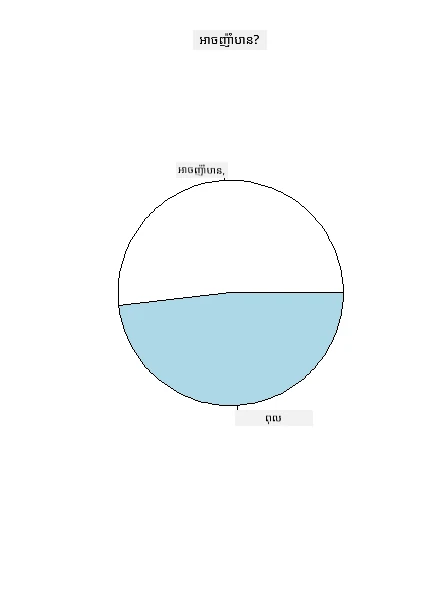
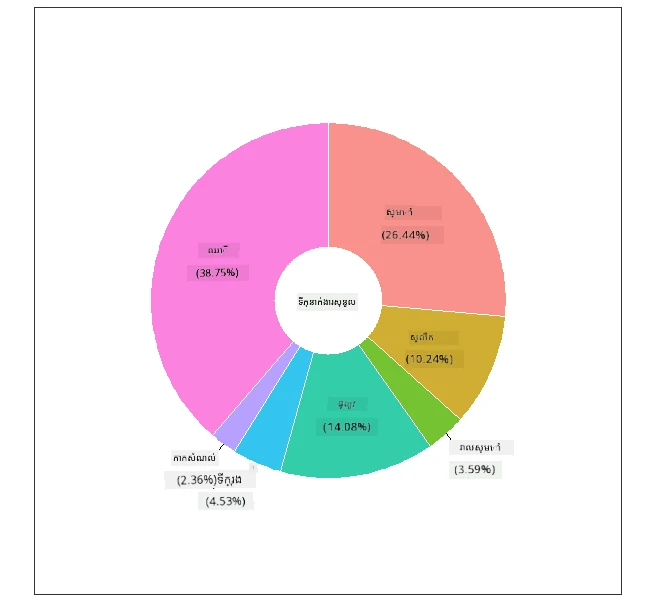
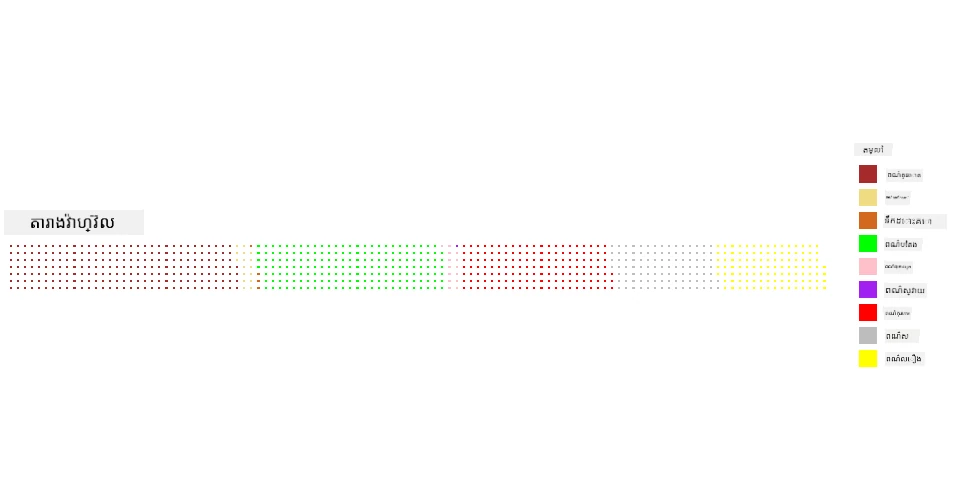

# ការចាក់បង្ហាញអំពីអត្រា​ភាគរយ

| ](../../../sketchnotes/11-Visualizing-Proportions.png)|
|:---:|
|ការចាក់បង្ហាញអំពីអត្រា​ភាគរយ - _Sketchnote ដោយ [@nitya](https://twitter.com/nitya)_ |

នៅក្នុងមេរៀននេះ អ្នកនឹងប្រើឈុតទិន្នន័យផ្សេងទៀតដែលផ្តោតលើធម្មជាតិ ដើម្បីបង្ហាញអត្រា​ភាគរយ ដូចជាចំនួនបែបបទផ្សេងៗនៃប្រភេទផ្សិតដែលរស់នៅក្នុងឈុតទិន្នន័យអំពីផ្សិត។ យើងចង់ស្វែងយល់អំពីផ្សិតដែលគួរឱ្យចាប់អារម្មណ៍ទាំងនេះដោយប្រើឈុតទិន្នន័យមួយដែលបានប្រមូលផ្តុំពី Audubon ដែលបញ្ជាក់ព័ត៌មានលម្អិតអំពីប្រភេទផ្សិត ២៣ ជាតិសត្វលក្ខណៈប្រភេទស្លាបក្នុងគ្រួសារ Agaricus និង Lepiota។ អ្នកនឹងសាកល្បងជាមួយការបង្ហាញដែលឆ្ងាញ់ៗដូចជា៖

- គំនូរជាតារាងមូល 🥧
- គំនូរស្លាបព្រីង 🍩
- គំនូរតារាងវ៉ាហ្វ៊ែ 🧇

> 💡 គម្រោងមួយដែលគួរឲ្យចាប់អារម្មណ៍ខ្លាំងដែលហៅថា [Charticulator](https://charticulator.com) ដោយ Microsoft Research ផ្តល់ឱ្យនូវចំណុចប្រទាក់ចាប់យកនិងទម្លាក់ដោយសេរីសម្រាប់ការបង្ហាញទិន្នន័យ។ ក្នុងមេរៀនមួយរបស់ពួកគេសព្វថ្ងៃ ខ្លួនពួកគេសម្តែងរៀបចំឈុតទិន្នន័យផ្សិតនេះផងដែរ! ដូច្នេះ អ្នកអាចស្វែងយល់ទិន្នន័យ និងសិក្សាបណ្ណាល័យនៅពេលតែមួយ: [មេរៀន Charticulator](https://charticulator.com/tutorials/tutorial4.html)។

## [សំណួរកម្រិតមុនបង្រៀន](https://purple-hill-04aebfb03.1.azurestaticapps.net/quiz/20)

## ស្គាល់ពីផ្សិតរបស់អ្នក 🍄

ផ្សិតគឺគួរឱ្យចាប់អារម្មណ៍ខ្លាំង។ យើងមកនាំចូលឈុតទិន្នន័យដើម្បីសិក្សាទាំងនេះ៖

```r
mushrooms = read.csv('../../data/mushrooms.csv')
head(mushrooms)
```
តារាងមួយត្រូវបានបោះពុម្ពចេញជាមួយទិន្នន័យល្អសម្រាប់វិភាគ៖


| ថ្នាក់     | រូបរាងមួក | ភាពរលោងមួក | ពណ៌មួក | ប្រេះ   | ផ្លែទែ | ការចងភ្លៅ | រង្វាស់គ្នាជិត | ទំហំភ្លៅ | ពណ៌ភ្លៅ | រូបរាងកំពង់ | ជើងកំពង់ | ភាពរលោងខាងលើកំពង់ | ភាពរលោងខាងក្រោមកំពង់ | ពណ៌ខាងលើកំពង់ | ពណ៌ខាងក្រោមកំពង់ | ប្រភេទវេល | ពណ៌វេល | ចំនួនរំលង | ប្រភេទរំលង | ពណ៌ព្រីនស្ពរ | ប្រជាជន | បរិយាកាស |
| --------- | --------- | ----------- | --------- | ------- | ------- | --------------- | ------------ | --------- | ---------- | ----------- | ---------- | ------------------------ | ------------------------ | ---------------------- | ---------------------- | --------- | ---------- | ----------- | --------- | ----------------- | ---------- | ------- |
| ពុលសកម្ម | ព្រួញរាងក្រោម | រលោង     | សំឡីខ្មៅ | ប្រេះ     | ក្លិនខ្លាញ់ | មិនចងភ្លៅ      | ក្បែរ         | ស្ពឹកតូច | ខ្មៅ       | កំពង់តែងដល់ | ស្មើ    | រលោង                   | រលោង                   | ស         | ស         | ផ្នែកមួយ | ស         | មួយ          | រំលង      | ទីក្រុង   |
| ដោះផ្លែបរិភោគ | ព្រួញរាងក្រោម | រលោង     | លឿង       | ប្រេះ     | អាល់មល      | មិនចងភ្លៅ      | ក្បែរ         | ក្បាលធំ  | ខ្មៅ       | កំពង់តែងដល់ | ក្លឹប       | រលោង                   | រលោង                   | ស         | ស         | ផ្នែកមួយ | ស         | មួយ          | ច្រើន      | ស្មៅ      |
| ដោះផ្លែបរិភោគ | ខ្ទះ         | រលោង     | ស         | ប្រេះ     | ស្លឹកអាណី     | មិនចងភ្លៅ      | ក្បែរ         | ក្បាលធំ  | សំឡីខ្មៅ  | កំពង់តែងដល់ | ក្លឹប       | រលោង                   | រលោង                   | ស         | ស         | ផ្នែកមួយ | ស         | មួយ          | ច្រើន      | ទីស្រែ     |
| ពុលសកម្ម | ព្រួញរាងក្រោម | មានស្បែកលើ | ស         | ប្រេះ     | ក្លិនខ្លាញ់ | មិនចងភ្លៅ      | ក្បែរ         | ស្ពឹកតូច | សំឡីខ្មៅ  | កំពង់តែងដល់ | ស្មើ    | រលោង                   | រលោង                   | ស         | ស         | ផ្នែកមួយ | ស         | មួយ          | រំលង      | ទីក្រុង  
| ដោះផ្លែបរិភោគ | ព្រួញរាងក្រោម | រលោង     | បៃតង     | គ្មានប្រេះ | គ្មានក្លិន | មិនចងភ្លៅ      | ក្បែរពេញ  | ក្បាលធំ  | ខ្មៅ       | រាបចុះ   | ស្មើ    | រលោង                   | រលោង                   | ស         | ស         | ផ្នែកមួយ | ស         | មួយ          | ច្រើន      | ស្មៅ      
| ដោះផ្លែបរិភោគ | ព្រួញរាងក្រោម | មានស្បែកលើ | លឿង       | ប្រេះ     | អាល់មល      | មិនចងភ្លៅ      | ក្បែរ         | ក្បាលធំ  | សំឡីខ្មៅ  | កំពង់តែងដល់ | ក្លឹប       | រលោង                   | រលោង                   | ស         | ស         | ផ្នែកមួយ | ស         | មួយ          | ច្រើន      | ស្មៅ      

ភ្លាមៗ អ្នកនឹងសង្កេតឃើញថាទិន្នន័យទាំងអស់គឺជាច្រកអក្សរ។ អ្នកត្រូវតែកែប្រែទិន្នន័យនេះដើម្បីដាក់ក្នុងតារាង។ ភាគច្រើនទិន្នន័យនេះ ត្រូវបានបញ្ចេញជា​វត្ថុ​មួយ៖

```r
names(mushrooms)
```
  
លទ្ធផលគឺ៖

```output
[1] "class"                    "cap.shape"               
 [3] "cap.surface"              "cap.color"               
 [5] "bruises"                  "odor"                    
 [7] "gill.attachment"          "gill.spacing"            
 [9] "gill.size"                "gill.color"              
[11] "stalk.shape"              "stalk.root"              
[13] "stalk.surface.above.ring" "stalk.surface.below.ring"
[15] "stalk.color.above.ring"   "stalk.color.below.ring"  
[17] "veil.type"                "veil.color"              
[19] "ring.number"              "ring.type"               
[21] "spore.print.color"        "population"              
[23] "habitat"            
```
  
យកទិន្នន័យនេះហើយបំលែងជួរឈរលក្ខណៈ 'class' ទៅជាប្រភេទ៖

```r
library(dplyr)
grouped=mushrooms %>%
  group_by(class) %>%
  summarise(count=n())
```


ឥឡូវនេះ បើអ្នកបោះពុម្ពទិន្នន័យផ្សិតនេះចេញ អ្នកនឹងឃើញថាវាត្រូវបានចែកជាក្រុមតាមលក្ខណៈពុល/អាចប្រើបាន៖
```r
View(grouped)
```


| class | ចំនួន |
| --------- | --------- |
| ដោះផ្លែបរិភោគ | 4208 |
| ពុលសកម្ម | 3916 |


បើអ្នកធ្វើតាមលំដាប់បង្ហាញនៅក្នុងតារាងនេះ ដើម្បីបង្កើតស្លាកប្រភេទថ្នាក់ អ្នកអាចបង្កើតតារាងភាគរយបាន។

## ភាគរយ!

```r
pie(grouped$count,grouped$class, main="Edible?")
```
  
វ៉ា ឡា, គំនូរតារាងមូលបង្ហាញអត្រាសមាមាត្រនៃទិន្នន័យនេះដោយផ្អែកលើថ្នាក់ផ្សិតទាំងពីរ។ វារស់សំខាន់ក្នុងការត្រួតពិនិត្យលំដាប់នៃស្លាក ដូច្នេះចូរត្រួតពិនិត្យលំដាប់របស់ចំណងជើងដែលបង្កើតឡើងច្បាស់លាស់ណាស់!



## ស្លាបព្រីង!

គំនូរតារាងមូលមួយដែលគួរឲ្យចាប់អារម្មណ៍ visually ធ្វើបានជាស្លាបព្រីង ដែលបង្កើតដោយមានរន្ធនៅកណ្តាល។ យើងមកមើលទិន្នន័យរបស់យើងដោយរបៀបនេះ។

មើលទៅផ្ទៃនៅជុំវិញដែលផ្សិតធំឡើង៖

```r
library(dplyr)
habitat=mushrooms %>%
  group_by(habitat) %>%
  summarise(count=n())
View(habitat)
```
  
លទ្ធផលគឺ៖  
| បរិយាកាស| ចំនួន |  
| --------- | --------- |  
| ស្មៅ | 2148 |  
| ស្លឹក | 832 |  
| ទីស្រែ | 292 |  
| ផ្លូវ | 1144 |  
| ទីក្រុង | 368 |  
| ខូច | 192 |  
| ឈើ | 3148 |


នៅទីនេះ អ្នកកំពុងចែកប្រភេទទិន្នន័យដោយផ្អែកលើបរិយាកាស។ មាន ៧ ប្រភេទដូច្នេះចូរប្រើវាជាស្លាកសម្រាប់គំនូរស្លាបព្រីងរបស់អ្នក៖

```r
library(ggplot2)
library(webr)
PieDonut(habitat, aes(habitat, count=count))
```
  


កូដនេះប្រើបណ្ណាល័យពីរ ggplot2 និង webr។ ដោយប្រើមុខងារ PieDonut ពីបណ្ណាល័យ webr អ្នកអាចបង្កើតគំនូរស្លាបព្រីងបានយ៉ាងងាយស្រួល!

គំនូរស្លាបព្រីងនៅក្នុងភាសា R អាចបង្កើតបានតែដោយប្រើបណ្ណាល័យ ggplot2 ផងដែរ។ អ្នកអាចស្វែងយល់បន្ថែមអំពីវា [នៅទីនេះ](https://www.r-graph-gallery.com/128-ring-or-donut-plot.html) ហើយសាកល្បងដោយខ្លួនឯង។

ឥឡូវនេះ អ្នកបានស្គាល់របៀបក្រុមទិន្នន័យរបស់អ្នក រួចបង្ហាញវាជាស្លាកភាគរយ ឬស្លាបព្រីង អ្នកអាចសាកល្បងមើលគំនូរផ្សេងទៀត។ សាកល្បងគំនូរតារាងវ៉ាហ្វ៊ែ ដែលជាវិធីផ្សេងទៀតក្នុងការបង្ហាញបរិមាណ។

## វ៉ាហ្វ៊ែ!

គំនូរប្រភេទ 'វ៉ាហ្វ៊ែ' គឺជាវិធីខុសគ្នាក្នុងការចាក់បង្ហាញបរិមាណជា ២D ជួរឈរ និងជួរឈរ។ សាកល្បងបង្ហាញបរិមាណពណ៌មួកផ្សិតផ្សេងគ្នាជាមួយឈុតទិន្នន័យនេះ។ ដើម្បីធ្វើបែបនេះ អ្នកត្រូវតែដំឡើងបណ្ណាល័យជំនួយមួយដែលហៅថា [waffle](https://cran.r-project.org/web/packages/waffle/waffle.pdf) ហើយប្រើវាដើម្បីបង្កើតការចាក់បង្ហាញរបស់អ្នក៖

```r
install.packages("waffle", repos = "https://cinc.rud.is")
```
  
ជ្រើសរើសផ្នែកមួយនៃទិន្នន័យរបស់អ្នកដើម្បីក្រុម៖

```r
library(dplyr)
cap_color=mushrooms %>%
  group_by(cap.color) %>%
  summarise(count=n())
View(cap_color)
```
  
បង្កើតគំនូរតារាងវ៉ាហ្វ៊ែដោយបង្កើតស្លាក ហើយបន្ទាប់មកក្រុមទិន្នន័យរបស់អ្នក៖

```r
library(waffle)
names(cap_color$count) = paste0(cap_color$cap.color)
waffle((cap_color$count/10), rows = 7, title = "Waffle Chart")+scale_fill_manual(values=c("brown", "#F0DC82", "#D2691E", "green", 
                                                                                     "pink", "purple", "red", "grey", 
                                                                                     "yellow","white"))
```
  
ដោយប្រើគំនូរតារាងវ៉ាហ្វ៊ែ អ្នកអាចមើលឃើញពីភាគរយពណ៌មួកក្នុងឈុតទិន្នន័យផ្សិតនេះយ៉ាងច្បាស់។ គួរឲ្យចាប់អារម្មណ៍មានផ្សិតពណ៌បៃតងច្រើន!



នៅក្នុងមេរៀននេះ អ្នកបានរៀនពីវិធីបង្ហាញអត្រា​ភាគរយឆេរបីវិធី។ ជាមុនសិន អ្នកត្រូវចែកទិន្នន័យជាក្រុមតាមប្រភេទ ហើយបន្ទាប់មកជ្រើសរើសវិធីល្អបំផុតសម្រាប់បង្ហាញទិន្នន័យ - គំនូរមូល ភាគរយស្លាបព្រីង ឬវ៉ាហ្វ៊ែ។ ទាំងអស់ទាំងនេះឆ្ងាញ់និងផ្តល់ចំណង់ចំណូលចិត្តឱ្យអ្នកប្រើដោយទទួលបានរូបភាពមួយភ្លាមៗពីឈុតទិន្នន័យ។

## 🚀 មេរៀនបញ្ញាត់

សាកល្បងបង្កើតវិញគំនូរឆ្ងាញ់ៗទាំងនេះនៅក្នុង [Charticulator](https://charticulator.com)។
## [សំណួរកម្រិតបន្ទាប់បង្រៀន](https://purple-hill-04aebfb03.1.azurestaticapps.net/quiz/21)

## ពិនិត្យមើលឡើងវិញ និងអនុវត្តផ្ទាល់

មួយច្រើនពេលវាជារឿងពិបាកក្នុងការជ្រើសរើសពេលណាដែលត្រូវប្រើគំនូរមូល ស្លាបព្រីង ឬវ៉ាហ្វ៊ែ។ មានអង្គការសម្រាប់អានអត្ថបទនៅលើប្រធានបទនេះ៖

https://www.beautiful.ai/blog/battle-of-the-charts-pie-chart-vs-donut-chart

https://medium.com/@hypsypops/pie-chart-vs-donut-chart-showdown-in-the-ring-5d24fd86a9ce

https://www.mit.edu/~mbarker/formula1/f1help/11-ch-c6.htm

https://medium.datadriveninvestor.com/data-visualization-done-the-right-way-with-tableau-waffle-chart-fdf2a19be402

សូមស្រាវជ្រាវបន្ថែមសម្រាប់ព័ត៌មានបន្ថែមអំពីការសម្រេចចិត្តពិបាកនេះ។
## ការងារ  

[សាកល្បងវាក្នុង Excel](assignment.md)

---

<!-- CO-OP TRANSLATOR DISCLAIMER START -->
**ការព្រមាន**៖  
ឯកសារនេះត្រូវបានបកប្រែដោយប្រើសេវាកម្មបកប្រែ AI [Co-op Translator](https://github.com/Azure/co-op-translator)។ ក្នុងខណៈពេលយើងខិតខំបំផុតដើម្បីឲ្យបានភាពត្រឹមត្រូវ សូមយល់ដឹងថាការបកប្រែដោយស្វ័យប្រវត្តិអាចមានកំហុស ឬភាពមិនត្រឹមត្រូវខ្លះ។ ឯកសារដើមនៅក្នុងភាសាមូលដ្ឋានគួរត្រូវបានគេចាត់ទុកជាមូលដ្ឋានដែលមានអំណាច។ សម្រាប់ព័ត៌មានសំខាន់ៗ ការបកប្រែដោយមនុស្សជំនាញត្រូវបានផ្តល់អនុសាសន៍។ យើងមិនទទួលខុសត្រូវចំពោះការយល់ច្រឡំ ឬការបកស្រាយខុសទៅពីការប្រើប្រាស់ការបកប្រែនេះទេ។
<!-- CO-OP TRANSLATOR DISCLAIMER END -->