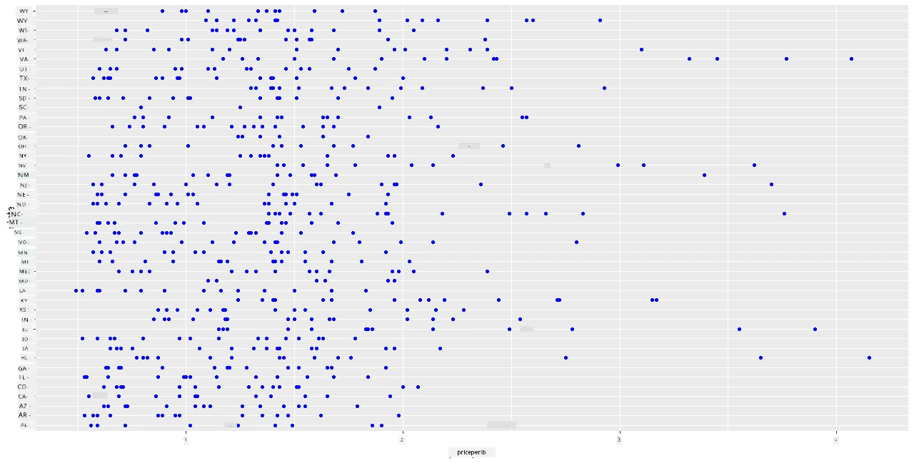
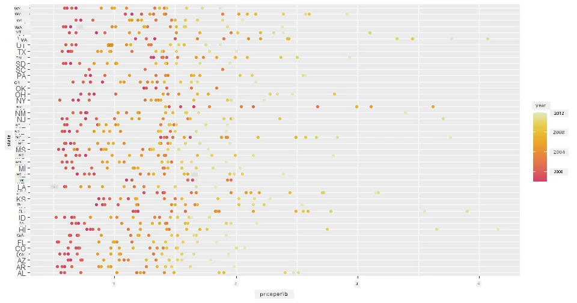
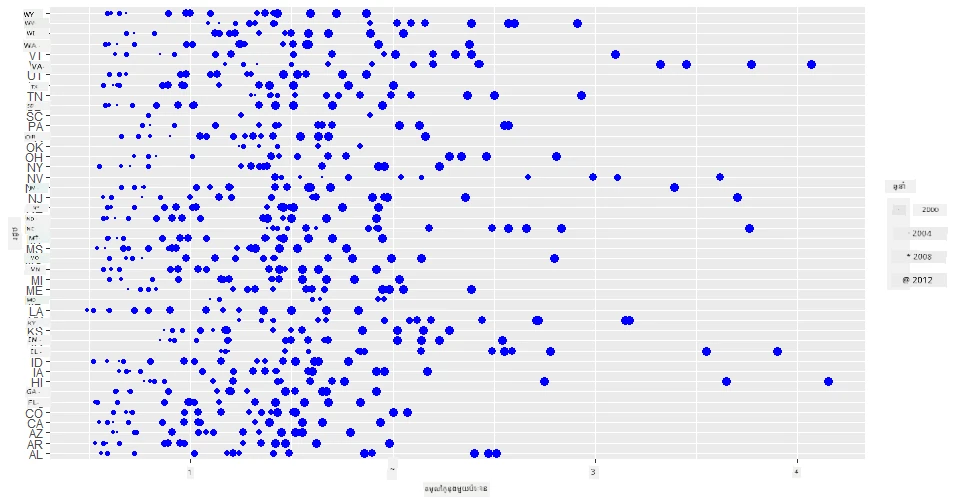
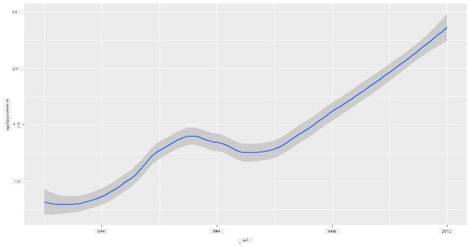
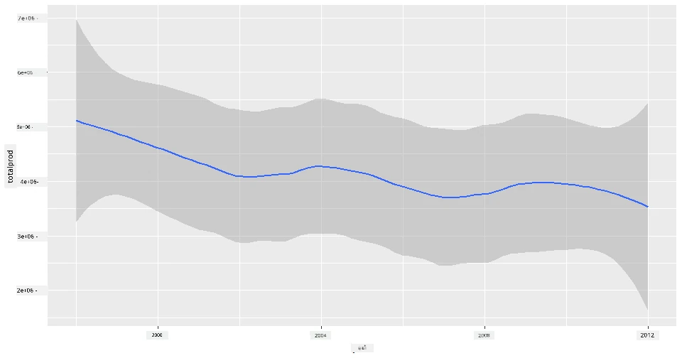
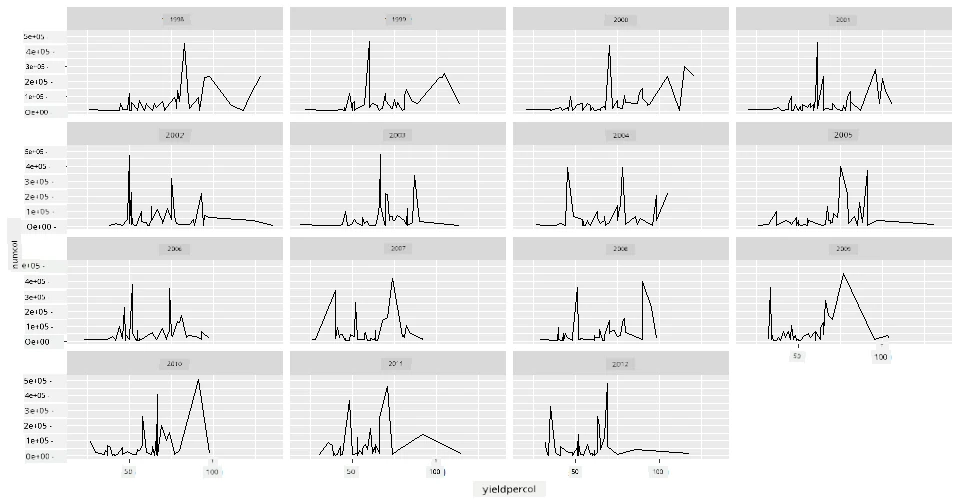
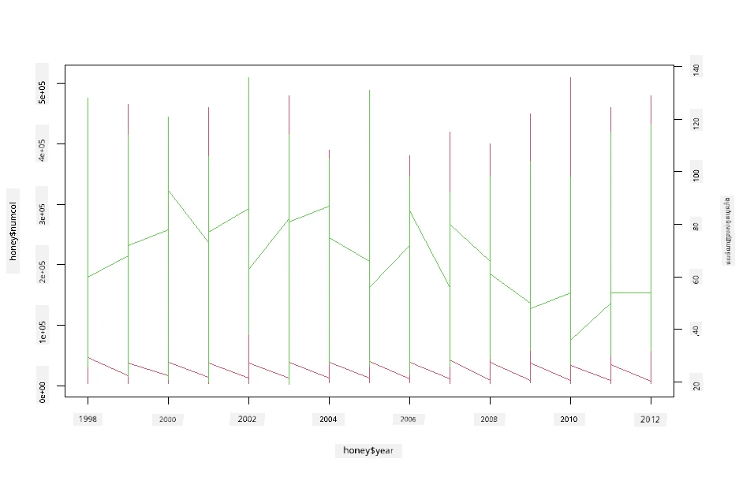

# ការមើលឃើញទំនាក់ទំនង៖ អំពីទឹកឃ្មុំទាំងអស់ 🍯

| ](../../../sketchnotes/12-Visualizing-Relationships.png)|
|:---:|
|ការមើលឃើញទំនាក់ទំនង - _Sketchnote by [@nitya](https://twitter.com/nitya)_ |

បន្តជាមួយការផ្ដោតលើធម្មជាតិ ក្នុងការស្រាវជ្រាវរបស់យើង ចូរបង្ហាញការមើលឃើញដ៏គួរឲ្យចាប់អារម្មណ៍ ដើម្បីបង្ហាញទំនាក់ទំនងរវាងប្រភេទទឹកឃ្មុំផ្សេងៗគ្នា អាប់ដាតពីទិន្នន័យមួយដែលទទួលបានពី [ក្រសួងកសិកម្មសហរដ្ឋអាមេរិក](https://www.nass.usda.gov/About_NASS/index.php) ។

ទិន្នន័យនេះមានប្រហែល ៦០០ធាតុ បង្ហាញពីការផលិតទឹកឃ្មុំក្នុងរដ្ឋជាច្រើនរបស់អាមេរិក។ ដូច្នេះ ឧទាហរណ៍ អ្នកអាចមើលចំនួនពូជមហាធំ, ផលចំណេញលើមហាធំមួយ, ការផលិតសរុប, ផ្ទុកទុក, តម្លៃក្នុងមួយផោន អ្នកតម្លៃរបស់ទឹកឃ្មុំនៅក្នុងរដ្ឋនោះពីឆ្នាំ ១៩៩៨ ដល់ ២០១២ ក្នុងមួយជួរតួជាឆ្នាំសម្រាប់រដ្ឋនីមួយៗ។ 

វានឹងគួរឱ្យចាប់អារម្មណ៍ក្នុងការមើលឃើញទំនាក់ទំនងរវាងការផលិតរបស់រដ្ឋមួយក្នុងមួយឆ្នាំ និងឧទាហរណ៍តម្លៃទឹកឃមុំជារដ្ឋនោះ។ ជាជម្រើសផ្សេង អ្នកអាចមើលឃើញទំនាក់ទំនងរវាងផលចំណេញលើមហាធំរបស់រដ្ឋនីមួយៗ។ អំឡុងពេលឆ្នាំនេះគ្របដណ្តប់ការបញ្ហា 'CCD' ឬ 'Colony Collapse Disorder' ដែលអាចឃើញបានដំបូងនៅឆ្នាំ ២០០៦ (http://npic.orst.edu/envir/ccd.html) ហើយវា​គឺជាទិន្នន័យដ៏ចាស់សុក្រឹតសម្រាប់ការសិក្សា 🐝

## [ល្បែងវាយតម្លៃមុនមេរៀន](https://purple-hill-04aebfb03.1.azurestaticapps.net/quiz/22)

នៅក្នុងមេរៀននេះ អ្នកអាចប្រើ ggplot2 ដែលអ្នកបានប្រើមុននោះជាយុលីបប្រើល្អក្នុងការមើលឃើញទំនាក់ទំនងរវាងអថេរ។ ខាងក្រោម ការប្រើ `geom_point` និង `qplot` របស់ ggplot2 ជារឿងគួរឱ្យចាប់អារម្មណ៍ ដែលអនុញ្ញាតឲ្យបង្ហាញក្រាភិកសាច់ញាតិកំណត់តាមចំណុច និងបន្ទាត់ ដើម្បីមើលឃើញ “[ទំនាក់ទំនងស្ថិតិ](https://ggplot2.tidyverse.org/)” ដែលជួយឲ្យអ្នកវិទ្យាសាស្ត្រទិន្នន័យយល់ដឹងពីរបៀបដែលអថេរតភ្ជាប់គ្នា។

## សាច់ញាតិកំណត់តាមចំណុច

ប្រើសាច់ញាតិកំណត់តាមចំណុច ដើម្បីបង្ហាញថាតម្លៃទឹកឃ្មុំនៅឆ្នាំក្នុងមួយឆ្នាំ តម្លៃលើរដ្ឋណាមួយ។ ggplot2 ប្រើ `ggplot` និង `geom_point` ជាការងាយស្រួលក្នុងការបំបែកទិន្នន័យរដ្ឋ និងបង្ហាញចំណុចទិន្នន័យទាំងសម្រាប់ទិន្នន័យចំណាត់ថ្នាក់ និងចំនួន។

ចាប់ផ្តើមដោយនាំចូលទិន្នន័យ និង Seaborn៖

```r
honey=read.csv('../../data/honey.csv')
head(honey)
```
 អ្នកនឹងសង្កេតឃើញថាទិន្នន័យទឹកឃ្មុំមានជួរឈរច្រើនដ៏គួរឲ្យចាប់អារម្មណ៍ រួមមានឆ្នាំ និងតម្លៃក្នុងមួយផោន។ ចង់ស្វែងយល់ពីទិន្នន័យនេះ ដែលបានក្រុមតាមរដ្ឋអាមេរិក៖

| រដ្ឋ  | numcol | yieldpercol | totalprod | stocks   | priceperlb | prodvalue | ឆ្នាំ  |
| ----- | ------ | ----------- | --------- | -------- | ---------- | --------- | ---- |
| AL    | 16000  | 71          | 1136000   | 159000   | 0.72       | 818000    | 1998 |
| AZ    | 55000  | 60          | 3300000   | 1485000  | 0.64       | 2112000   | 1998 |
| AR    | 53000  | 65          | 3445000   | 1688000  | 0.59       | 2033000   | 1998 |
| CA    | 450000 | 83          | 37350000  | 12326000 | 0.62       | 23157000  | 1998 |
| CO    | 27000  | 72          | 1944000   | 1594000  | 0.7        | 1361000   | 1998 |
| FL    | 230000 | 98          |22540000   | 4508000  | 0.64       | 14426000  | 1998 |

បង្កើតសាច់ញាតិកំណត់តាមចំណុចមួយ ដើម្បីបង្ហាញទំនាក់ទំនងរវាងតម្លៃក្នុងមួយផោននៃទឹកឃ្មុំ និងរដ្ឋអាមេរិកដើមកំណើត។ ប្រាកដថាអ័ក្ស `y` មានកម្ពស់គ្រប់គ្រងគ្រប់រដ្ឋទាំងអស់៖

```r
library(ggplot2)
ggplot(honey, aes(x = priceperlb, y = state)) +
  geom_point(colour = "blue")
```


ឥឡូវនេះ បង្ហាញទិន្នន័យដូចគ្នានេះជាមួយផ្ទាំងពណ៌ទឹកឃ្មុំ ដើម្បីបង្ហាញពីការវិវឌ្ឍតម្លៃក្នុងរយៈពេលជាច្រើនឆ្នាំ។ អ្នកអាចធ្វើនេះដោយបន្ថែមអថេរ 'scale_color_gradientn' ដើម្បីបង្ហាញការផ្លាស់ប្តូរពីឆ្នាំមួយទៅឆ្នាំមួយ៖

> ✅ សូមរៀនបន្ថែមអំពី [scale_color_gradientn](https://www.rdocumentation.org/packages/ggplot2/versions/0.9.1/topics/scale_colour_gradientn) - សាកល្បងផ្ទាំងពណ៌ឥដ្ឋស្រស់ស្អាត!

```r
ggplot(honey, aes(x = priceperlb, y = state, color=year)) +
  geom_point()+scale_color_gradientn(colours = colorspace::heat_hcl(7))
```


ជាមួយការប្រែប្រួលផ្ទាំងពណ៌នេះ អ្នកអាចឃើញថាមានការទៅមុខយ៉ាងខ្លាំងតាមឆ្នាំពាក់ព័ន្ធនឹងតម្លៃទឹកឃ្មុំក្នុងមួយផោនពិតប្រាកដ។ ពិតណាស់ ប្រសិនបើអ្នកមើលទៅកន្លែងមួយក្នុងទិន្នន័យដើម្បីផ្ទៀងផ្ទាត់ (ជ្រើសរើសរដ្ឋមួយ, ឧទាហរណ៍ Arizona) អ្នកអាចឃើញលំនាំនៃការកើនឡើងតម្លៃរៀងរាល់ឆ្នាំ ជាមួយនឹងលក្ខណៈលើសខ្លះ៖

| រដ្ឋ  | numcol | yieldpercol | totalprod | stocks  | priceperlb | prodvalue | ឆ្នាំ  |
| ----- | ------ | ----------- | --------- | ------- | ---------- | --------- | ---- |
| AZ    | 55000  | 60          | 3300000   | 1485000 | 0.64       | 2112000   | 1998 |
| AZ    | 52000  | 62          | 3224000   | 1548000 | 0.62       | 1999000   | 1999 |
| AZ    | 40000  | 59          | 2360000   | 1322000 | 0.73       | 1723000   | 2000 |
| AZ    | 43000  | 59          | 2537000   | 1142000 | 0.72       | 1827000   | 2001 |
| AZ    | 38000  | 63          | 2394000   | 1197000 | 1.08       | 2586000   | 2002 |
| AZ    | 35000  | 72          | 2520000   | 983000  | 1.34       | 3377000   | 2003 |
| AZ    | 32000  | 55          | 1760000   | 774000  | 1.11       | 1954000   | 2004 |
| AZ    | 36000  | 50          | 1800000   | 720000  | 1.04       | 1872000   | 2005 |
| AZ    | 30000  | 65          | 1950000   | 839000  | 0.91       | 1775000   | 2006 |
| AZ    | 30000  | 64          | 1920000   | 902000  | 1.26       | 2419000   | 2007 |
| AZ    | 25000  | 64          | 1600000   | 336000  | 1.26       | 2016000   | 2008 |
| AZ    | 20000  | 52          | 1040000   | 562000  | 1.45       | 1508000   | 2009 |
| AZ    | 24000  | 77          | 1848000   | 665000  | 1.52       | 2809000   | 2010 |
| AZ    | 23000  | 53          | 1219000   | 427000  | 1.55       | 1889000   | 2011 |
| AZ    | 22000  | 46          | 1012000   | 253000  | 1.79       | 1811000   | 2012 |

វិធីមួយផ្សេងទៀតក្នុងការមើលឃើញការវិវឌ្ឍនេះ គឺប្រើទំហំ ជំនួសពណ៌។ សម្រាប់អ្នកដែលមានវិបត្តិពណ៌ បែបនេះអាចជាជម្រើសល្អប្រសើរជាង។ កែប្រែការមើលឃើញរបស់អ្នក ដើម្បីបង្ហាញកំណើនតម្លៃតាមការកើនជុំវិញជុំវិញនៃចំណុច៖

```r
ggplot(honey, aes(x = priceperlb, y = state)) +
  geom_point(aes(size = year),colour = "blue") +
  scale_size_continuous(range = c(0.25, 3))
```
 អ្នកអាចឃើញទំហំចំណុចកើនឡើងយ៉ាងលំនាំ។



តើនេះជាករណីធម្មតាជារឿងផ្គត់ផ្គង់ និងតម្រូវការឬ? ដោយសារបញ្ហាដូចជា ការប្រែប្រួលអាកាសធាតុ និងការបាត់បង់ពូជមហាធំ ទឹកឃ្មុំមានបរិមាណតិចជាងមុនក្នុងមួយឆ្នាំ ហើយតម្លៃកំពុងឡើង?

ដើម្បីស្វែងរកទំនាក់ទំនងរវាងអថេរមួយចំនួនក្នុងទិន្នន័យនេះ សូមស្វែងយល់ពីក្រាភិកបន្ទាត់ខ្លះ។

## ក្រាភិកបន្ទាត់

សំនួរ៖ តើមានការកើនឡើងច្បាស់លាស់ក្នុងតម្លៃទឹកឃ្មុំក្នុងមួយផោន រៀងរាល់ឆ្នាំឬ? អ្នកអាចស្វែងរកកម្រិតមិនលំបាក ដោយបង្កើតក្រាភិកបន្ទាត់តែមួយ៖

```r
qplot(honey$year,honey$priceperlb, geom='smooth', span =0.5, xlab = "year",ylab = "priceperlb")
```
ចម្លើយ៖ មែនហើយ មានករណីលើសខ្លះនៅឆ្នាំ ២០០៣៖



សំនួរ៖ នៅឆ្នាំ ២០០៣ តើយើងអាចឃើញកំណើនក្នុងការផ្គត់ផ្គង់ទឹកឃ្មុំដែរឬ? ប្រសិនបើអ្នកមើលការផលិតសរុប រៀងរាល់ឆ្នាំ?

```python
qplot(honey$year,honey$totalprod, geom='smooth', span =0.5, xlab = "year",ylab = "totalprod")
```



ចម្លើយ៖ មិនមែនទេ។ ប្រសិនបើអ្នកមើលកម្រិតការផលិតសរុប វាហាក់បីដូចជាបានកើនឡើងនៅឆ្នាំនោះ ចូរបញ្ជាក់ថា ជាទូទៅ ចំនួនទឹកឃ្មុំផលិតកំពុងធ្លាក់ចុះនៅក្នុងឆ្នាំទាំងនេះ។

សំនួរ៖ ក្នុងករណីនោះ អ្វីជាអ្វីដែលបណ្តាលឲ្យតម្លៃទឹកឃ្មុំកើនឡើងខ្លាំងនៅឆ្នាំ ២០០៣? 

ដើម្បីស្វែងរកចម្លើយនេះ អ្នកអាចស្វែងយល់ក្រាភិក facet grid មួយ។

## Facet grids

Facet grids កាន់កាប់មុខងារមួយនៃទិន្នន័យរបស់អ្នក (សម្រាប់ករណីរបស់យើង អ្នកអាចជ្រើសរើស 'ឆ្នាំ' ដើម្បីជៀសវាងការបង្កើត facet ច្រើនពេក)។ Seaborn អាចបង្កើតក្រាភិកមួយសម្រាប់មុខងារនីមួយៗនៃកូអរដោនេត x និង y ដែលអ្នកជ្រើសរើស ដើម្បីបង្កើតការប្រៀបធៀបទាន់សម័យបានកាន់តែស្រួល។ តើឆ្នាំ ២០០៣ មានភាពខុសគ្នា ក្រោមការប្រៀបធៀបបែបនេះ?

បង្កើត facet grid ដោយប្រើ `facet_wrap` ដូចដែលបានណែនាំក្នុង [ឯកសាររបស់ ggplot2](https://ggplot2.tidyverse.org/reference/facet_wrap.html)។

```r
ggplot(honey, aes(x=yieldpercol, y = numcol,group = 1)) + 
  geom_line() + facet_wrap(vars(year))
```
 ក្នុងការមើលឃើញនេះ អ្នកអាចប្រៀបធៀបផលចំណេញលើមហាធំ និងចំនួនពូជមហាធំ រៀងរាល់ឆ្នាំគ្នា ដោយមាន wrap 3 សម្រាប់ជួរឈរ៖



សម្រាប់ទិន្នន័យនេះ ពុំមានអ្វីសំខាន់ផ្ដល់អារម្មណ៍ពិសេសទាក់ទងនឹងចំនួនពូជ និងផលចំណេញរបស់ពួកគេ រៀងរាល់ឆ្នាំ និងរៀងរាល់រដ្ឋទេ។ តើមានវិធីផ្សេងណាមួយដើម្បីស្វែងរកទំនាក់ទំនងរវាងអថេរទាំងពីរនេះទេ?

## ក្រាភិកបន្ទាត់គូ

សាកល្បងក្រាភិកបន្ទាត់ច្រើន ដោយដាក់ចំលងក្រាភិកបន្ទាត់ពីរលើគ្នា ប្រើប្រាស់ `par` និង `plot` របស់ R។ យើងនឹងបង្ហាញឆ្នាំនៅអ័ក្ស x ហើយបង្ហាញអ័ក្ស y ពីរជាមួយគ្នា។ ដូច្នេះ បង្ហាញផលចំណេញលើមហាធំ និងចំនួនពូជមហាធំ ជាបន្ទាត់លើគ្នា៖

```r
par(mar = c(5, 4, 4, 4) + 0.3)              
plot(honey$year, honey$numcol, pch = 16, col = 2,type="l")              
par(new = TRUE)                             
plot(honey$year, honey$yieldpercol, pch = 17, col = 3,              
     axes = FALSE, xlab = "", ylab = "",type="l")
axis(side = 4, at = pretty(range(y2)))      
mtext("colony yield", side = 4, line = 3)   
```


ខណៈពេលដែលគ្មានអ្វីបង្ហាញឡើងយ៉ាងច្បាស់នៅឆ្នាំ ២០០៣ វានៅតែមើលឃើញថាគម្ពីរនេះអាចបញ្ចប់មេរៀននេះដោយសំណើចមួយ៖ បើទោះជា ចំនួនពូជមហាធំពីរបៀបចុះតាមរយៈសរុប តែក៏ចំនួនពូជមហាធំពីរត្រូវបានអនុវត្តន៍ថ្កោលទុក ទោះបីផលចំណេញលើមហាធំកំពុងធ្លាក់ចុះមែន។

បាទ សិប្បនិម្មិត្តសូម្បី!

🐝❤️
## 🚀 ប្រវត្តិនេះជាការប្រកួតប្រជែង

នៅក្នុងមេរៀននេះ អ្នកបានរៀនបន្ថែមពីការប្រើប្រាស់សាច់ញាតិកំណត់តាមចំណុច និងក្រាភិកបន្ទាត់គូ រួមមាន facet grids។ ជួបប្រទៈខ្លួនអ្នកដោយបង្កើត facet grid មួយ ប្រើទិន្នន័យផ្សេងៗ ប្រហែលជា ទិន្នន័យដែលអ្នកបានប្រើមុនមេរៀនទាំងនេះ។ សូមចំណាំរយៈពេលដែលអ្នកចំណាយក្នុងការបង្កើត និងត្រូវប្រយ័ត្នចំនួន grid ដែលអ្នកត្រូវបង្ហាញដោយប្រើវិធីសាស្ត្រនេះ។

## [ល្បែងវាយតម្លៃបន្ទាប់មេរៀន](https://purple-hill-04aebfb03.1.azurestaticapps.net/quiz/23)

## សង្ខេប និងសិក្សាដោយខ្លួនឯង

ក្រាភិកបន្ទាត់អាចជារឿងសាមញ្ញ ឬស្មុគស្មាញជាងនេះ។ សូមអានបន្ថែមនៅក្នុង [ឯកសារ ggplot2](https://ggplot2.tidyverse.org/reference/geom_path.html#:~:text=geom_line()%20connects%20them%20in,which%20cases%20are%20connected%20together) អំពីវិធីសាស្ត្រផ្សេងៗដែលអ្នកអាចសាងសំនង់បាន។ ព្យាយាមបង្កើនគុណភាពក្រាភិកបន្ទាត់ដែលអ្នកបានបង្កើតនៅក្នុងមេរៀននេះជាមួយវិធីសាស្ត្រផ្សេងៗដែលបានរាយនៅក្នុងឯកសារ។

## បំណងផ្ទាល់ខ្លួន

[ចូលទៅក្នុងរោងចក្រពូជមហាធំ](assignment.md)

---

<!-- CO-OP TRANSLATOR DISCLAIMER START -->
**ការបដិសេធ**៖  
ឯកសារនេះត្រូវបានបកប្រែដោយប្រើសេវាកម្មបកប្រែ AI [Co-op Translator](https://github.com/Azure/co-op-translator)។ ទន្ទឹមនឹងការខំប្រឹងធ្វើឲ្យមានភាពត្រឹមត្រូវ សូមដឹងថាការបកប្រែដោយស្វ័យប្រវត្តិអាចមានកំហុស ឬភាពមិនត្រឹមត្រូវ។ ឯកសារដើមនៅក្នុងភាសាម្ដងរបស់វាត្រូវបានគេចាត់ទុកថាជាឯកសារយោងដ៏សំខាន់។ សម្រាប់ព័ត៌មានសំខាន់ គួរតែប្រែដោយអ្នកជំនាញផ្នែក មនុស្ស។ យើងមិនទទួលខុសត្រូវចំពោះការយល់ច្រឡំ ឬការបកប្រែខុសទេដែលកើតឡើងពីការប្រើប្រាស់ការបកប្រែនេះឡើយ។
<!-- CO-OP TRANSLATOR DISCLAIMER END -->