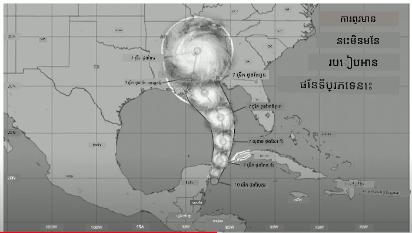
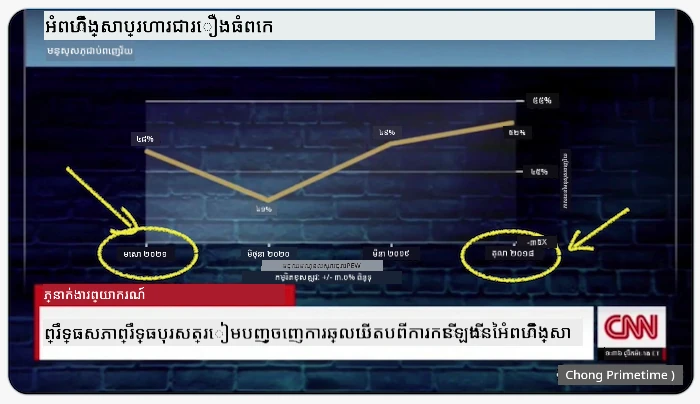
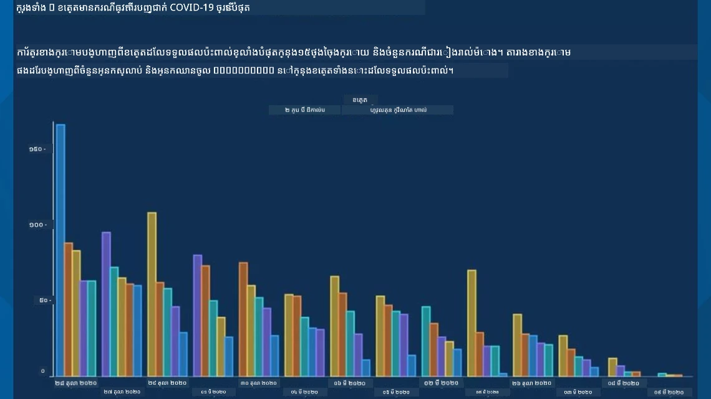
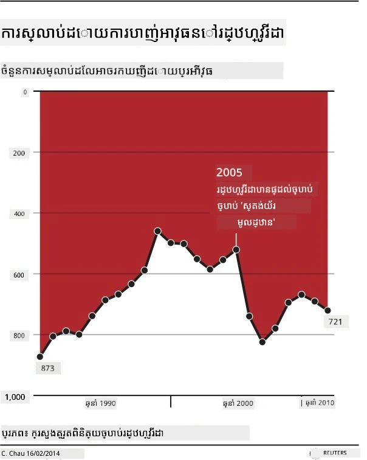
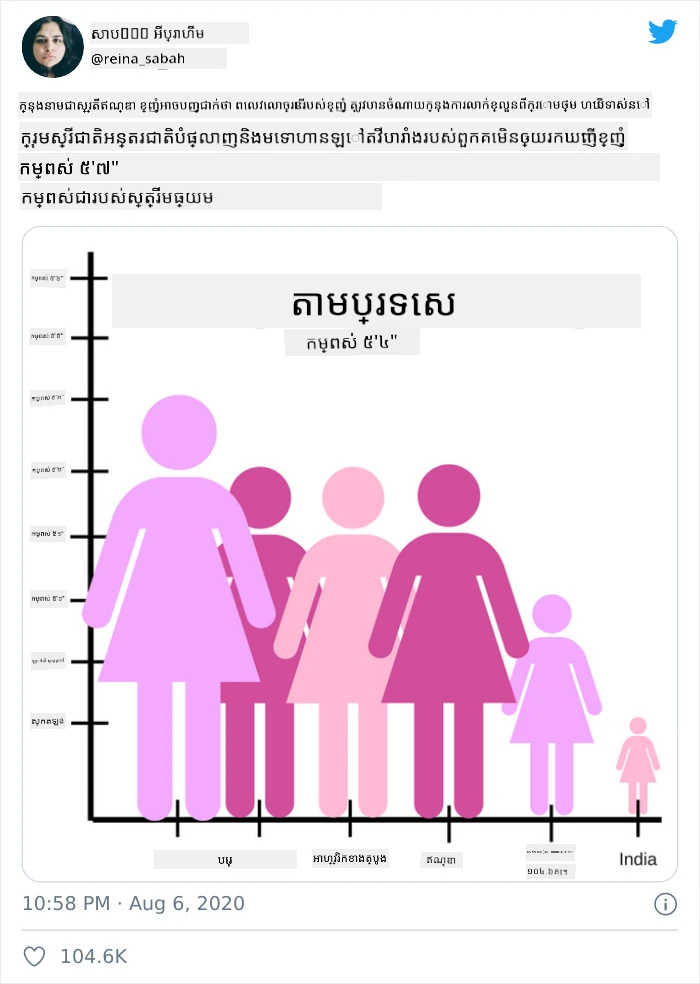
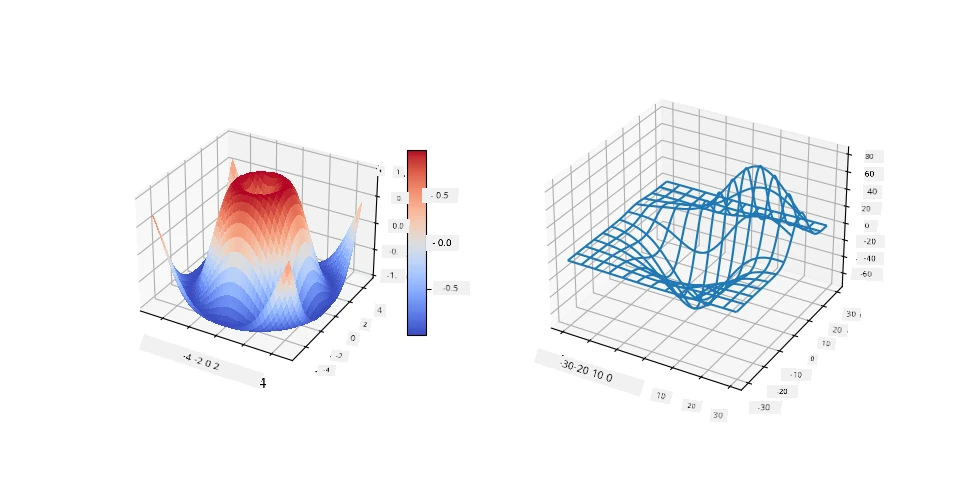
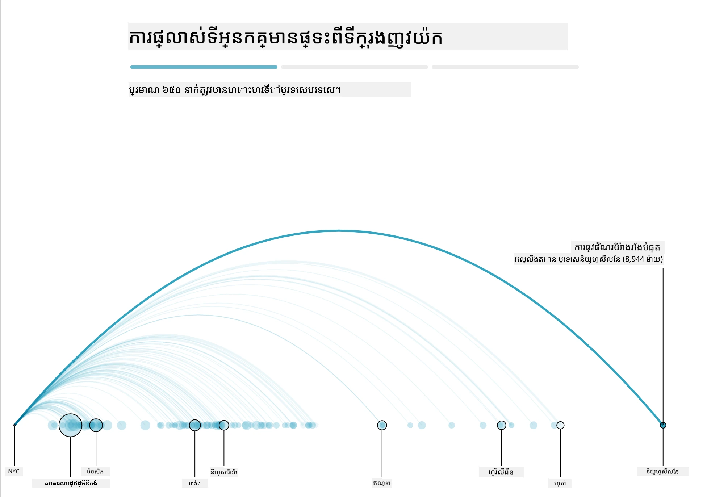
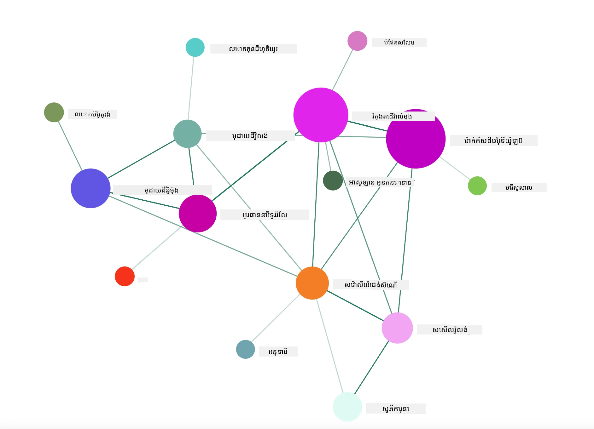

# ការបង្កើតការមើលឃើញដែលមានអត្ថន័យ

| ](../../../sketchnotes/13-MeaningfulViz.png)|
|:---:|
| ការមើលឃើញដែលមានអត្ថន័យ - _Sketchnote ដោយ [@nitya](https://twitter.com/nitya)_ |

> "បើអ្នកដេញធ្វើសង្ស័យទិន្នន័យយូរប៉ុណ្ណោះ វានឹងស្គាល់ការពិតគ្រប់យ៉ាង" -- [Ronald Coase](https://en.wikiquote.org/wiki/Ronald_Coase)

មនុស្សវិទ្យាសាស្ត្រទិន្នន័យមួយមានជំនាញមូលដ្ឋានមួយគឺសមត្ថភាពបង្កើតការមើលឃើញទិន្នន័យដែលមានអត្ថន័យដែលជួយឲ្យមានការឆ្លើយសំណួរដែលអ្នកមាន។ មុនពេលបង្ហាញទិន្នន័យរបស់អ្នក អ្នកត្រូវតែធានាថាវាត្រូវបានសម្អាត និងរៀបចំរួចហើយ ដូចដែលអ្នកបានធ្វើនៅចំណែកមុន។ បន្ទាប់មក អ្នកអាចចាប់ផ្តើមសម្រេចចិត្តពីរបៀបល្អបំផុតក្នុងការបង្ហាញទិន្នន័យ។

ក្នុងមេរៀននេះ អ្នកនឹងពិនិត្យឡើងវិញ៖

1. របៀបជ្រើសរើសប្រភេទតារាងត្រឹមត្រូវ
2. របៀបចៀសវាងការបោកប្រាស់តារាង
3. របៀបប្រើពណ៌
4. របៀបប៊ិចបន្តាបតារាងឲ្យអាចអានបានងាយ
5. របៀបកសាងដំណោះស្រាយតារាងវីដេអូអនុវត្តឬ 3D
6. របៀបកសាងការមើលឃើញបែបច្នៃប្រឌិត

## [សំនួរប្រឡងមុនបង្រៀន](https://purple-hill-04aebfb03.1.azurestaticapps.net/quiz/24)

## ជ្រើសរើសប្រភេទតារាងត្រឹមត្រូវ

នៅក្នុងមេរៀនមុនៗ អ្នកបានសាកល្បងបង្កើតការមើលឃើញទិន្នន័យគ្រប់ប្រភេទដ៏គួរឱ្យចាប់អារម្មណ៍ដោយប្រើ Matplotlib និង Seaborn សម្រាប់ការគូរសន្លឹក។ ទូទៅ អ្នកអាចជ្រើសប្រភេទតារាងត្រឹមត្រូវសម្រាប់សំណួរដែលអ្នកកំពុងសួរតាមតារាងនេះ៖

| អ្នកត្រូវការធ្វើ           | អ្នកគួរតែប្រើ           |
| -------------------------- | ------------------------ |
| បង្ហាញនិន្នាការទិន្នន័យកាលៈទេសៈ | បន្ទាត់                     |
| ប្រៀបធៀបប្រភេទ              | បារ, ឆេះ                    |
| ប្រៀបធៀបសរុប               | ឆេះ, បារ stacked          |
| បង្ហាញទំនាក់ទំនង           | Scatter, បន្ទាត់, Facet, បន្ទាត់ទ្វេ              |
| បង្ហាញការបែកចែកផ្សេងៗ       | Scatter, ប្រភេទនៃធរណីមាត្រ, ប្រអប់          |
| បង្ហាញអត្រាភាគរយ             | ឆេះ, ដូណាត់, វ៉ាហ្វភល          |

> ✅ ផ្អែកលើរូបមន្តទិន្នន័យរបស់អ្នក អ្នកប្រហែលជាត្រូវបម្លែងវាពីអត្ថបទទៅលេខ ដើម្បីឲ្យតារាងគាំទ្រវា។

## ជៀសវាងការបោកប្រាស់

បើទោះប៉ុន្តិមនុស្សវិទ្យាសាស្ត្រទិន្នន័យមានការប្រុងប្រយ័ត្នក្នុងការជ្រើសរើសតារាងត្រឹមត្រូវសម្រាប់ទិន្នន័យត្រឹមត្រូវ ក៏មានវិធីជាច្រើនដែលទិន្នន័យអាចបង្ហាញដោយរបៀបមិនត្រឹមត្រូវ ដើម្បីបញ្ជាក់ចំណុចណាមួយ ជាចម្បងក្នុងការបំភ្លឺពីទិន្នន័យ។ មានឧទាហរណ៌ជាច្រើននៃតារាង និងរូបភាពបោកប្រាស់!

[](https://www.youtube.com/watch?v=oX74Nge8Wkw "របៀបដែលតារាងធ្វើការគង់ល្មម")

> 🎥 ចុចរូបភាពខាងលើសម្រាប់ការនិយាយសន្និសីទអំពីតារាងបោកប្រាស់

តារាងនេះបញ្ចេញ X axis ត្រឡប់ក្រោយដើម្បីបង្ហាញវិញនូវភាពមែនតែមិនត្រឹមត្រូវ ដោយផ្អែកលើកាលបរិច្ឆេទ៖



[តារាងនេះ](https://media.firstcoastnews.com/assets/WTLV/images/170ae16f-4643-438f-b689-50d66ca6a8d8/170ae16f-4643-438f-b689-50d66ca6a8d8_1140x641.jpg) មានភាពបោកប្រាស់ខ្លាំងជាងនេះ ព្រោះភ្នែកត្រូវបានទាក់ទាញទៅពីសល់បញ្ចប់ក្នុងការសន្និដ្ឋានថា ករណី COVID បានបន្ថយចុះក្នុងខណ្ឌជាច្រើន។ ជាការពិត ប្រសិនបើអ្នកមើលជិតស្តាយនៅលើកាលបរិច្ឆេទ អ្នកនឹងឃើញថាវាត្រូវបានរៀបចំឡើងវិញ ដើម្បីបង្ហាញនិន្នាការកង្វះខាតនេះ។



ឧទាហរណ៍ល្បីល្បាញនេះប្រើពណ៌ និងការបញ្ចេញ Y axis បញ្ច្រាស់ដើម្បីបោកប្រាស់៖ ជំនួសការសន្និដ្ឋានថា ករណីស្លាប់ដោយកាំភ្លើងបានកើនឡើងក្រោយពេលចេញច្បាប់ចេញលើកាំភ្លើង គឺភ្នែកត្រូវបានបោកប្រាស់ឲ្យគិតថាផ្ទុយគ្នា។



តារាងរបៀបចម្លែកនេះបង្ហាញរបៀបដែលអាចប្តូរភាគរយបាន ដោយមានផលប៉ះពាល់គួរឲ្យសើច៖



ការប្រៀបធៀបអ្វីដែលមិនអាចប្រៀបបានគឺជាទន្លឹមមួយទៀតក្នុងការបោកប្រាស់។ មានវេបសាយមួយគួរឱ្យចាប់អារម្មណ៍ [wonderful web site](https://tylervigen.com/spurious-correlations) ស្តីពី 'សមាគមបែបក្លែងក្លាយ'(spurious correlations) បង្ហាញ 'ការពិត' ដែលពាក់ព័ន្ធដូចជាអត្រាការបែកគ្នាក្នុងរដ្ឋ Maine និងការបរិច្ឆេទមាស៊ីម៉ារីន។ ក្រុម Reddit ក៏បានប្រមូលប្រមាណ [ការប្រើប្រាស់មិនស្អាត](https://www.reddit.com/r/dataisugly/top/?t=all) នៃទិន្នន័យនេះផងដែរ។

វាមានសារៈសំខាន់ក្នុងការយល់ដឹងពីរបៀបដែលភ្នែកអាចត្រូវបានបោកប្រាស់យ៉ាងងាយស្រួលដោយតារាងបោកប្រាស់។ ទោះបីជាគោលបំណងមនុស្សវិទ្យាសាស្ត្រទិន្នន័យល្អ ការជ្រើសរើសប្រភេទតារាងមិនល្អ ដូចជា តារាងឆេះដែលបង្ហាញប្រភេទច្រើនពេក អាចផ្តល់ការបោកប្រាស់បាន។

## ពណ៌

អ្នកបានឃើញនៅក្នុងតារាង 'ហិង្សាកាំភ្លើង Florida' ខាងលើ ការប្រើពណ៌អាចផ្តល់ស្រទាប់អត្ថន័យបន្ថែមទៅលើតារាង រំពាក់ជាពិសេសនូវតារាងដែលមិនបានរចនាឡើងដោយបណ្ណាល័យដូចជា ggplot2 និង RColorBrewer ដែលមានបណ្ណាល័យពណ៌ និងផ្លែឈើនានាដែលបានអនុម័តជាប្រចាំ។ ប្រសិនបើអ្នកកំពុងបង្កើតតារាងដោយដៃ សូមសិក្សាពី [ទ្រឹស្តីពណ៌](https://colormatters.com/color-and-design/basic-color-theory) បន្ថែម។

> ✅ សូមយកចិត្តទុកដាក់ ពេលរចនាតារាងថា ចំណុចចូលដំណើរការត្រូវមានសារៈសំខាន់។ អ្នកប្រើប្រាស់ខ្លះរបស់អ្នកប្រហែលជា​មានភាពមិនអាចមើលឃើញពណ៌ – តើតារាងរបស់អ្នកបង្ហាញល្អសម្រាប់អ្នកដែលមានភាពមិនឃើញពណ៌?

ប្រយ័ត្នពេលជ្រើសពណ៌សម្រាប់តារាងរបស់អ្នក ពីព្រោះពណ៌អាចបញ្ជាក់អត្ថន័យមួយដែលអ្នកប្រហែលជាមិនចង់បានទេ។ 'នារីផ្កាឈូក' នៅក្នុងតារាង 'រយៈបាត' ខាងលើបញ្ជាក់អត្ថន័យ 'ស្ត្រី' មួយដែលបន្ថែមភាពអស្ចារ្យទៅតារាង។

ខណៈពេលដែល [អត្ថន័យពណ៌](https://colormatters.com/color-symbolism/the-meanings-of-colors) ប្រហែលជាពីរពណ៌គ្នានៅតំបន់ផ្សេងៗនៃពិភពលោក ហើយមានការប្រែប្រួលក្នុងអត្ថន័យទៅតាមស្រទាប់ពណ៌របស់ពួកវា។ ជាភាគច្រើន អត្ថន័យពណ៌រួមមាន៖

| ពណ៌   | អត្ថន័យ             |
| ------- | ------------------- |
| ក្រហម   | អំណាច               |
| ខៀវ    | ទំនុកចិត្ត, ភាពស្មោះត្រង់      |
| លឿង    | ភាពរីករាយ, ការប្រុងប្រយ័ត្ន  |
| បៃតង   | បរិស្ថាន, ផ្លូវ, ភាពស្ទះចិត្ត |
| ស្វាយ    | ភាពរីករាយ           |
| ក្រហមស្វាយ | ភាពរីករាយ            |

បើអ្នកត្រូវបង្កើតតារាងដែលមានពណ៌ប៊ិចបន្តា ត្រូវអនុវត្តឲ្យតារាងមានចំណូលដំណើរ និងពណ៌ដែលអ្នកជ្រើសរើសត្រូវសមនឹងអត្ថន័យដែលអ្នកចង់ផ្តល់។

## ការប៊ិចបន្តាតារាងឲ្យអាចអានបានងាយ

តារាងមិនមានអត្ថន័យទេ ប្រសិនបើវាមិនអាចអានបាន! សូមយកពេលមើលទៅកាន់ការប៊ិចបន្តាបំផុតទទឹង និងកម្ពស់របស់តារាងឲ្យសមស្របជាមួយទិន្នន័យ។ ប្រសិនបើអថេរមួយ (ដូចជា រដ្ឋទាំង 50) ត្រូវបានបង្ហាញ សូមបង្ហាញវាឡើងលើ Y axis ប្រសិនបើអាចធ្វើបាន ដើម្បីចៀសវាងការស្ទូតទឹកដៃម្ខាង។

សរសេរឈ្មោះអក្ខរាវរណៈរបស់អ្នក, ផ្តល់ទ្រង្វង់ប្រសិនបើចាំបាច់ ហើយផ្តល់ឧបករណ៍ជំនួយសម្រាប់ការយល់ដឹងល្អប្រសើរជាងនេះ។

ប្រសិនបើទិន្នន័យរបស់អ្នកគឺអត្ថបទហើយវាយ៉ាងរំពេចលើ X axis អ្នកអាចមៀលអត្ថបទឲ្យមានកោងមួយសម្រាប់អានងាយ។ [plot3D](https://cran.r-project.org/web/packages/plot3D/index.html) ផ្តល់ជូននូវភាពសមហត្ថភាពក្នុងការគូរ 3d ប្រសិនបើទិន្នន័យរបស់អ្នកគាំទ្រវា។ ការមើលឃើញទិន្នន័យស្មុគស្មាញអាចបង្កើតបានដោយវា។



## ការវិលតួ និងការបង្ហាញតារាង 3D

ខ្លះនៃការមើលឃើញទិន្នន័យល្អបំផុតសព្វថ្ងៃគឺមានការវិលតួ។ Shirley Wu មានការមើលឃើញដ៏អស្ចារ្យដែលបានធ្វើជាមួយ D3 ដូចជា '[ផ្កាភាពភាពខ្មៅ](http://bl.ocks.org/sxywu/raw/d612c6c653fb8b4d7ff3d422be164a5d/)' ដែលផ្កាទីមួយមួយជាការមើលឃើញនៃភាពយន្តមួយ។ ឧទាហរណ៍មួយទៀតសម្រាប់ Guardian គឺ 'bussed out', រឿងអន្តរកម្មបញ្ចូលការមើលឃើញជាមួយ Greensock និង D3 គ្រប់បែបបទអត្ថបទមានការវាយតម្លៃ scrollytelling ដើម្បីបង្ហាញពីរបៀប NYC ដោះស្រាយបញ្ហាអ្នកគ្មានផ្ទះដោយបញ្ជូនមនុស្សចេញពីទីក្រុង។



> "Bussed Out: របៀបដែលអាមេរិកចល័តមនុស្សគ្មានផ្ទះ" ពី [the Guardian](https://www.theguardian.com/us-news/ng-interactive/2017/dec/20/bussed-out-america-moves-homeless-people-country-study)។ ការមើលឃើញដោយ Nadieh Bremer & Shirley Wu

ខណៈពេលមេរៀននេះមិនគ្រប់គ្រាន់សម្រាប់បង្រៀនជម្រាលជាប្រវត្តិសាស្ត្រអំពីបណ្ណាល័យមើលឃើញដ៏មានឥទ្ធិពលទាំងនេះទេ សូមសាកល្បង D3 ក្នុងកម្មវិធី Vue.js ដោយប្រើបណ្ណាល័យមួយសម្រាប់បង្ហាញការមើលឃើញសៀវភៅ "Dangerous Liaisons" ជាបណ្ដាញសង្គមវិលតួ។

> "Les Liaisons Dangereuses" គឺជារឿងនិទានក្នុងរូបមន្ត epistolary novel, ឬជារឿងនិទានដែលបង្ហាញជាសំណុំលិខិតមួយ។ បានសរសេរឡើងក្នុងឆ្នាំ ១៧៨២ ដោយ Choderlos de Laclos ។ វាកាំកាត់រឿងរបស់ការចេញចលនាតាមសង្គមឥតលោភល័ក្ខពីមនុស្សច្រើនក្នុងអាថ៌កំបាំងសង្គមបែបរបស់អាណាព្យាបាលបារាំងនៅដើមទី ១៨ សតវត្ស Vicomte de Valmont និង Marquise de Merteuil។ ពួកគេស្លាប់នៅចុងបញ្ចប់ ប៉ុន្តែគ្មានការចោទថាបានបង្កឲ្យមានការប៉ះពាល់សង្គមយ៉ាងខ្លាំងមួយ។ រឿងនេះបែកខ្លួនជាសំណុំអក្សរដែលបានសរសេរដល់មនុស្សផ្សេងៗក្នុងវង់កូនក្រុមរបស់ពួកគេ រៀបចំផែនការសង្រ្គោះឬបង្កការេរ៉ុក។ បង្កើតភាពមើលឃើញនៃលិខិតទាំងនេះដើម្បីរកឃើញអ្នកសំខាន់ៗនៅក្នុងរឿង ដោយការមើលឃើញ។

អ្នកនឹងបញ្ចប់កម្មវិធីវេបមួយដែលបង្ហាញទិដ្ឋភាពវិលតួបណ្ដាញសង្គមនេះ។ វាប្រើបណ្ណាល័យដែលបានបង្កើតឡើងដើម្បីបង្កើត [រូបភាពបណ្ដាញ](https://github.com/emiliorizzo/vue-d3-network) ដោយប្រើ Vue.js និង D3។ ពេលកម្មវិធីដំណើរការ អ្នកអាចទាញកំណត់ចំណុចនៅលើអេក្រង់ដើម្បីរំកិលទិន្នន័យបាន។



## គំរោង៖ បង្កើតតារាងបង្ហាញបណ្ដាញដោយប្រើ D3.js

> ឯកសារហ្វូលឌ័រមេរៀននេះមានហ្វូលឌ័រមួយឈ្មោះ `solution` ដែលអ្នកអាចរកឃើញគំរោងបានបញ្ចប់សម្រាប់យោង។

1. អនុវត្តតាមការណែនាំនៅក្នុងឯកសារ README.md នៅក្នុងរុក្ខជាតិហ្វូលឌ័រចាប់ផ្តើម រួចប្រាកដថាអ្នកមាន NPM និង Node.js ដំណើរការលើម៉ាស៊ីនរបស់អ្នក មុននឹងតំឡើងផ្នែកពឹងផ្អែកនៃគំរោងរបស់អ្នក។

2. បើកហ្វូលឌ័រដូចជា `starter/src` ។ អ្នកនឹងរកឃើញហ្វូលឌ័រមួយឈ្មោះ `assets` ដែលនៅក្នុងនោះមានឯកសារ .json ដែលមានលិខិតទាំងអស់ពីរឿងនិទាន ចំនួនទាំងអស់ ហើយមានការ�ANNOTATED 'to' និង 'from'។

3. បញ្ចប់កូដនៅក្នុង `components/Nodes.vue` ដើម្បីបើកអនុញ្ញាតការមើលឃើញ។ ស្វែងរកមេធដ្ឋ called `createLinks()` ហើយបន្ថែមល្បង nested loop ខាងក្រោមនេះ។

រុងរឿងក្នុងវត្ថុ .json ដើម្បីចាប់យកទិន្នន័យ 'to' និង 'from' សម្រាប់លិខិត ហើយបង្កើតអាប់អject `links` ឲ្យបណ្ណាល័យវិចិត្រត្រូវបរិភោគវា៖

```javascript
//វិលជុំទៀតតាមអក្សរ
      let f = 0;
      let t = 0;
      for (var i = 0; i < letters.length; i++) {
          for (var j = 0; j < characters.length; j++) {
              
            if (characters[j] == letters[i].from) {
              f = j;
            }
            if (characters[j] == letters[i].to) {
              t = j;
            }
        }
        this.links.push({ sid: f, tid: t });
      }
  ```
  
ដំណើរការកម្មវិធីរបស់អ្នកពី terminal (npm run serve) ហើយរីករាយជាមួយការមើលឃើញ!

## 🚀 챌린지

ទស្សនាក្នុងអ៊ីនធឺណិតដើម្បីរកការមើលឃើញខុសៗគ្នា។ តើអ្នកនិពន្ធបោកអ្នកប្រើប្រាស់ដោយរបៀបណា ហើយតើវាមានគោលបំណងមែនទេ? ជំរុញកែប្រែការមើលឃើញដើម្បីបង្ហាញពីរបៀបដែលគួរតែមាន។

## [សំនួរប្រឡងបន្ទាប់បង្រៀន](https://purple-hill-04aebfb03.1.azurestaticapps.net/quiz/25)

## ការពិនិត្យឡើងវិញ និងសិក្សាឯករាជ្យ

នេះជាអត្ថបទមួយចំនួនសម្រាប់អានអំពីការបោកប្រាស់ការមើលឃើញទិន្នន័យ៖

https://gizmodo.com/how-to-lie-with-data-visualization-1563576606

http://ixd.prattsi.org/2017/12/visual-lies-usability-in-deceptive-data-visualizations/

សូមមើលការមើលឃើញគួរឱ្យចាប់អារម្មណ៍នេះសម្រាប់ទ្រព្យសម្បត្តិសាស្ដ្រ និងវត្ថុបុរាណ៖

https://handbook.pubpub.org/

អានអត្ថបទនេះស្តីពីរបៀបដែលវីដេអូអនុវត្តអាចបង្កើនការមើលឃើញរបស់អ្នក៖

https://medium.com/@EvanSinar/use-animation-to-supercharge-data-visualization-cd905a882ad4

## មុខងារ

[បង្កើតការមើលឃើញផ្ទាល់ខ្លួនរបស់អ្នក](assignment.md)

---

<!-- CO-OP TRANSLATOR DISCLAIMER START -->
**ការបដិសេធ**៖  
ឯកសារនេះត្រូវបានបកប្រែដោយប្រើសេវាកម្មបកប្រែ AI [Co-op Translator](https://github.com/Azure/co-op-translator)។ ខណៈពេលដែលយើងខិតខំរកភាពត្រឹមត្រូវ សូមជ្រាបថាការបកប្រែដោយស្វ័យប្រវត្តិនៅតែមជ្រុលខុសឬមានកំហុសបាន។ ឯកសារដើមជាភាសាបំណើតគួរត្រូវបានគិតថាជា ប្រភពត្រឹមត្រូវ និងមានសមត្ថិ్యత។ សម្រាប់ព័ត៌មានសំខាន់ៗ ការបកប្រែមនុស្សវិជ្ជាជីវៈមានការផ្ដល់អនុសាសន៍។ យើងមិនទទួលខុសត្រូវចំពោះការយល់ច្រឡំ ឬការបកប្រែខុសណាមួយដែលកើតឡើងពីការប្រើប្រាស់ការបកប្រែនេះឡើយ។
<!-- CO-OP TRANSLATOR DISCLAIMER END -->