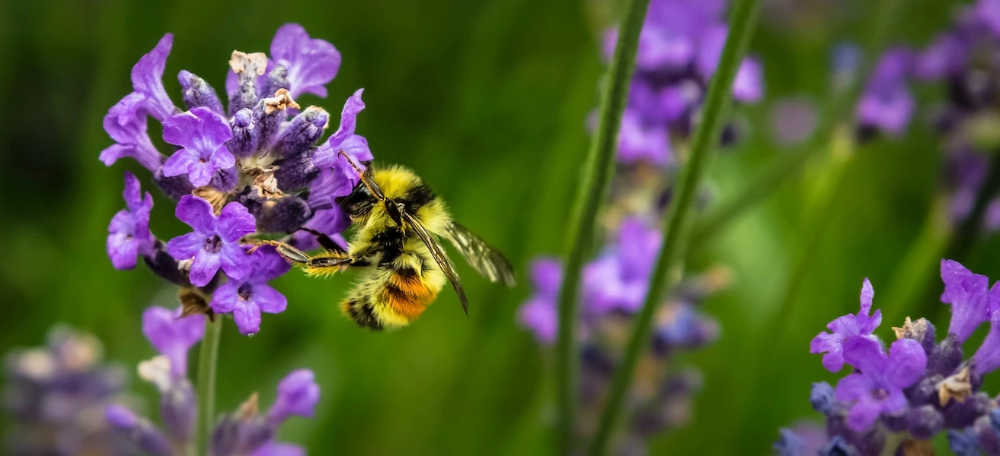

# Visualizations

> រូបថតដោយ <a href="https://unsplash.com/@jenna2980?utm_source=unsplash&utm_medium=referral&utm_content=creditCopyText">Jenna Lee</a> នៅលើ <a href="https://unsplash.com/s/photos/bees-in-a-meadow?utm_source=unsplash&utm_medium=referral&utm_content=creditCopyText">Unsplash</a>

ការបង្ហាញទិន្នន័យគឺជារឿងមួយសំខាន់បំផុតបំផុតសម្រាប់អ្នកវិទ្យាសាស្ត្រទិន្នន័យ។ រូបភាពមានតំលៃស្មើនឹងពាក្យ ១០០០ ពាក្យ ហើយការបង្ហាញអាចជួយអ្នកកំណត់ចំណុចគួរឲទាក់ទាញនានានៃទិន្នន័យរបស់អ្នកដូចជាឧបសគ្គ, ការប្រមាណខុស, ការបំបែកជាក្រុម, និន្ទានុប្បវត្តិ និងជាច្រើនទៀត ដែលអាចជួយអ្នកយល់ចាំបាច់ពីរឿងដែលទិន្នន័យរបស់អ្នកកំពុងព្យាយាមប្រាប់។

នៅក្នុងមេរៀន៥នេះ អ្នកនឹងត្រូវស្រាវជ្រាវទិន្នន័យដែលបានប្រមូលចំពោះធម្មជាតិ ហើយបង្កើតការបង្ហាញដែលគួរឲ្យចាប់អារម្មណ៍ និងស្អាត ប្រើបច្ចេកទេសជាច្រើនផ្សេងៗ។

| លេខប្រធានបទ | ប្រធានបទ | មេរៀនដែលភ្ជាប់ | អ្នកនិពន្ធ |
| :-----------: | :--: | :-----------: | :----: |
| 1. | ការបង្ហាញបរិមាណ | <ul> <li> [Python](09-visualization-quantities/README.md)</li>  <li>[R](../../../3-Data-Visualization/R/09-visualization-quantities) </li> </ul>|<ul> <li> [Jen Looper](https://twitter.com/jenlooper)</li><li> [Vidushi Gupta](https://github.com/Vidushi-Gupta)</li> <li>[Jasleen Sondhi](https://github.com/jasleen101010)</li></ul> |
| 2. | ការបង្ហាញចែកចាយ | <ul> <li> [Python](10-visualization-distributions/README.md)</li>  <li>[R](../../../3-Data-Visualization/R/10-visualization-distributions) </li> </ul>|<ul> <li> [Jen Looper](https://twitter.com/jenlooper)</li><li> [Vidushi Gupta](https://github.com/Vidushi-Gupta)</li> <li>[Jasleen Sondhi](https://github.com/jasleen101010)</li></ul> |
| 3. | ការបង្ហាញអត្រា | <ul> <li> [Python](11-visualization-proportions/README.md)</li>  <li>[R](../../../3-Data-Visualization) </li> </ul>|<ul> <li> [Jen Looper](https://twitter.com/jenlooper)</li><li> [Vidushi Gupta](https://github.com/Vidushi-Gupta)</li> <li>[Jasleen Sondhi](https://github.com/jasleen101010)</li></ul> |
| 4. | ការបង្ហាញទំនាក់ទំនង | <ul> <li> [Python](12-visualization-relationships/README.md)</li>  <li>[R](../../../3-Data-Visualization) </li> </ul>|<ul> <li> [Jen Looper](https://twitter.com/jenlooper)</li><li> [Vidushi Gupta](https://github.com/Vidushi-Gupta)</li> <li>[Jasleen Sondhi](https://github.com/jasleen101010)</li></ul> |
| 5. | ការបង្កើតការបង្ហាញដែលមានអត្ថន័យ | <ul> <li> [Python](13-meaningful-visualizations/README.md)</li>  <li>[R](../../../3-Data-Visualization) </li> </ul>|<ul> <li> [Jen Looper](https://twitter.com/jenlooper)</li><li> [Vidushi Gupta](https://github.com/Vidushi-Gupta)</li> <li>[Jasleen Sondhi](https://github.com/jasleen101010)</li></ul> |

### ការសរសើរ

មេរៀនបង្ហាញទិន្នន័យទាំងនេះត្រូវបានសរសេរជាមួយ🌸 ដោយ [Jen Looper](https://twitter.com/jenlooper), [Jasleen Sondhi](https://github.com/jasleen101010) និង [Vidushi Gupta](https://github.com/Vidushi-Gupta)។

🍯 ទិន្នន័យសម្រាប់ការផលិតទឹកឃ្មុំនៅអាមេរិកត្រូវបានយកពីគម្រោងរបស់ Jessica Li នៅលើ [Kaggle](https://www.kaggle.com/jessicali9530/honey-production)។ [ទិន្នន័យ](https://usda.library.cornell.edu/concern/publications/rn301137d) ត្រូវបានទទួលពី [ការិយាល័យរដ្ឋអាមេរិកផ្នែកកសិកម្ម](https://www.nass.usda.gov/About_NASS/index.php)។

🍄 ទិន្នន័យសម្រាប់ផ្សិតក៏ត្រូវបានយកពី [Kaggle](https://www.kaggle.com/hatterasdunton/mushroom-classification-updated-dataset) ដែលបានកែប្រែដោយ Hatteras Dunton។ ទិន្នន័យនេះរួមមានការពិពណ៌នាអំពីគំរូកាល्पनिकទាក់ទងនឹងបំរែបំរួល ២៣ ប្រភេទផ្សិតដែលមានរាងក្រចកនៅក្នុងក្រុម Agaricus និង Lepiota។ ផ្សិតគារពីពហុមុខមាត់ Audubon Society ច្រើនបានចងក្រងនៅឆ្នាំ ១៩៨១។ ទិន្នន័យនេះបានអំណោយទៅ UCI ML 27 ឆ្នាំ ១៩៨៧។

🦆 ទិន្នន័យសម្រាប់បក្សី Minnesota មកពី [Kaggle](https://www.kaggle.com/hannahcollins/minnesota-birds) ដែលបានយកពី [Wikipedia](https://en.wikipedia.org/wiki/List_of_birds_of_Minnesota) ដោយ Hannah Collins។

ទិន្នន័យទាំងអស់នេះមានអាជ្ញាបណ្ណជា [CC0: Creative Commons](https://creativecommons.org/publicdomain/zero/1.0/).

---

<!-- CO-OP TRANSLATOR DISCLAIMER START -->
**ការបដិសេធ**៖  
ឯកសារនេះត្រូវបានបកប្រែដោយប្រើសេវាកម្មបបូរសមាសភាដោយ AI [Co-op Translator](https://github.com/Azure/co-op-translator)។ ខណៈពេលយើងខ្ញុំខិតខំដើម្បីបានភាពត្រឹមត្រូវ សូមបញ្ចាក់ថាការបកប្រែដោយស្វ័យប្រវត្តិអាចមានកំហុស ឬមិនត្រឹមត្រូវ។ ឯកសារដើមក្នុងភាសាតំបន់គួរត្រូវបានគេយកមកជាថ្នាក់ដើម។ សម្រាប់ព័ត៌មានសំខាន់ៗ ការបកប្រែដោយមនុស្សជំនាញត្រូវបានណែនាំ។ យើងមិនទទួលខុសត្រូវចំពោះការយល់ច្រឡំ ឬការបកស្រាយខុសពីការប្រើប្រាស់ការបកប្រែនេះទេ។
<!-- CO-OP TRANSLATOR DISCLAIMER END -->