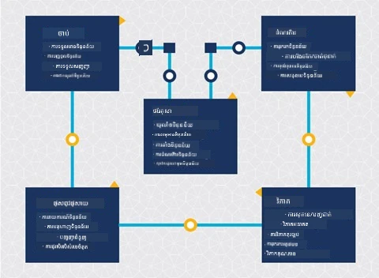
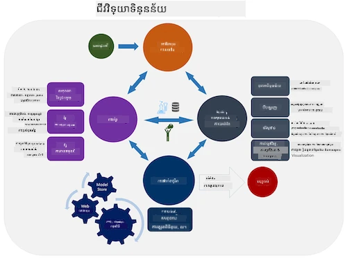
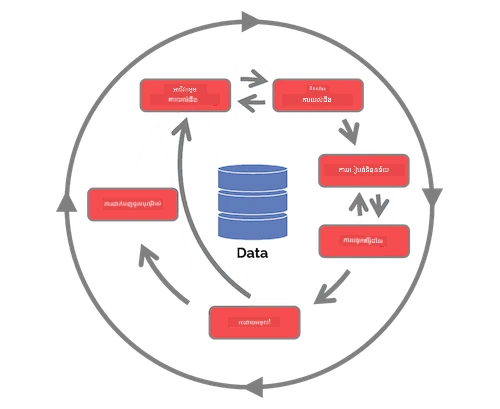

# ការណែនាំអំពីជីវចក្រ Data Science

| ](../../sketchnotes/14-DataScience-Lifecycle.png)|
|:---:|
| ការណែនាំអំពីជីវចក្រ Data Science - _Sketchnote by [@nitya](https://twitter.com/nitya)_ |

## [Pre-Lecture Quiz](https://ff-quizzes.netlify.app/en/ds/quiz/26)

នៅពេលនេះ អ្នកប្រហែលជាធ្លាប់បានដឹងថា វិទ្យាសាស្ត្រទិន្នន័យគឺជាដំណើរការ។ ដំណើរការនេះអាចបំបែកជាពីរពីរក្នុងចំណោម 5 ជំហាន ៖

- ការកាន់កាប់
- ការប្រព្រឹត្តការ
- ការវិភាគ
- ការទំនាក់ទំនង
- ការថែទាំ

មេរៀននេះផ្តោតលើបីផ្នែកនៃជីវចក្រ៖ ការកាន់កាប់ ការប្រព្រឹត្តការ និងការថែទាំ។

> រូបថតដោយ [Berkeley School of Information](https://ischoolonline.berkeley.edu/data-science/what-is-data-science/)

## ការកាន់កាប់

ជំហានដំបូងនៃជីវចក្រ មានសារៈសំខាន់ណាស់ ពីព្រោះជំហានបន្ទាប់ទាំងអស់ស្ថិតក្រោមការគ្រប់គ្រងរបស់វា។ វាជាផ្នែកពីរដែលរួមបញ្ចូលគ្នា៖ ការទទួលទិន្នន័យ និងការកំណត់គោលបំណង និងបញ្ហាដែលត្រូវបានដោះស្រាយ។  
ការកំណត់គោលបំណងនៃគម្រោងត្រូវការព័ត៌មានជ្រៅជាងនៃបញ្ហាឬសំណួរ។ ជាទីបំផុត ត្រូវកំណត់ និងទទួលទិញជាអ្នកដែលត្រូវការដោះស្រាយបញ្ហារបស់ពួកគេ។ ពួកគេអាចជាអ្នកមានចំណាប់អារម្មណ៍ក្នុងអាជីវកម្មឬអ្នកឧបត្ថម្ភគម្រោង ដែលអាចជួយកំណត់តើនរណា ឬអ្វីនឹងទទួលអត្ថប្រយោជន៍ពីគម្រោងនេះ ដូចជាតើអ្វី និងហេតុអ្វីពួកគេចង់បានវា។ គោលបំណងដែលបានកំណត់ល្អគួរត្រូវមានការវាស់វែង និងកំណត់គុណភាពដើម្បីកំណត់លទ្ធផលដែលអាចទទួលបាន។

សំណួរដែលអ្នកវិទ្យាសាស្ត្រទិន្នន័យអាចសួរ៖
-	តើបញ្ហានេះធ្លាប់ត្រូវបានជម្រះមុននេះទេ? តើបានរកឃើញអ្វីខ្លះ?
-	តើគោលបំណងនិងគោលដៅត្រូវបានយល់ដោយអ្នកទាំងអស់ដែលពាក់ព័ន្ធទេ?
-	តើមានភាពមិនច្បាស់ណាមួយទេ ហើយតើធ្វើដូចម្តេចដើម្បីកាត់បន្ថយវា?
-	តើមានកម្រិតជាប់ដានអ្វីខ្លះ?
-	តើលទ្ធផលចុងក្រោយអាចមានរូបរាងដូចម្តេចខ្លះ?
-	តើមានធនធានប៉ុន្មាន (ពេលវេលា មនុស្ស កុំព្យូទ័រ) ដែលអាចប្រើបាន?

បន្ទាប់មក គឺការកំណត់ ប្រារព្ធ និងបញ្ចប់បង្ហាញទិន្នន័យដែលចាំបាច់ដើម្បីទទួលបានគោលបំណងទាំងនេះ។ នៅជំហានទទួលទិន្នន័យនេះ អ្នកវិទ្យាសាស្ត្រទិន្នន័យត្រូវតែវាយតម្លៃពីបរិមាណ និងគុណភាពនៃទិន្នន័យផងដែរ។ នេះត្រូវការប្រើការជ្រែកចេញទិន្នន័យដើម្បីបញ្ជាក់ថា អ្វីដែលបានទទួលនឹងគាំទ្រការសម្រេចបានលទ្ធផលដែលចង់បាន។

សំណួរដែលអ្នកវិទ្យាសាស្ត្រទិន្នន័យអាចសួរអំពីទិន្នន័យ៖
-	តើមានទិន្នន័យអ្វីខ្លះដែលមាននៅចំពោះខ្ញុំ?
-	នរណាជាម្ចាស់ទិន្នន័យនេះ?
-	តើមានបញ្ហាអំពីភាពឯកជនដូចម្ដេចខ្លះ?
-	តើខ្ញុំមានគ្រប់គ្រាន់ដើម្បីដោះស្រាយបញ្ហានេះទេ?
-	តើទិន្នន័យមានគុណភាពដែលអាចទទួលយកសម្រាប់បញ្ហានេះដែរទេ?
-	បើខ្ញុំរកឃើញព័ត៌មានបន្ថែមតាមរយៈទិន្នន័យនេះ តើយើងត្រូវគិតបម្លែង ឬកំណត់គោលបំណងឡើងវិញទេ?

## ការប្រព្រឹត្តការ

ជំហានប្រព្រឹត្តការនៃជីវចក្រ ផ្តោតលើការរកមើលលំនាំក្នុងទិន្នន័យ និងការបង្កើតម៉ូដែល។ បច្ចេកទេសខ្លះដែលប្រើនៅក្នុងជំហាននេះត្រូវការ វិធីសាស្រ្តស្ថិតិ ដើម្បីរកលំនាំ។ បែបបទធម្មតា នេះជាកិច្ចការដ៏ធ្ងន់ធ្ងរ និងពិបាកសម្រាប់មនុស្ស ប៉ុន្តែកុំព្យូទ័រជាឧបករណ៍ជួយលឿនកាន់តែអភិវឌ្ឍ។ ជំហាននេះក៏ជាកន្លែងដែលវិទ្យាសាស្ត្រទិន្នន័យ និងការសិក្សារៀនម៉ាស៊ីន (machine learning) ប្រសីលភាពគ្នា។ ដូចដែលអ្នកបានរៀននៅម៉េរៀនដំបូង ការសិក្សារៀនម៉ាស៊ីនគឺជាដំណើរការបង្កើតម៉ូដែលឲ្យយល់ពីទិន្នន័យ។ ម៉ូដែលជាការតំណាងឲ្យទំនាក់ទំនងរវាងអថេរនានា ក្នុងទិន្នន័យ ដែលជួយទស្សន៍ទាយលទ្ធផល។

បច្ចេកទេសទូទៅដែលប្រើនៅជំហាននេះ បានរៀបរៀងនៅក្នុងកម្មវិធីសិក្សា ML សម្រាប់អ្នកចាប់ផ្តើម។ តាមដានតំណខាងក្រោមដើម្បីស្វែងយល់បន្ថែម៖

- [Classification](https://github.com/microsoft/ML-For-Beginners/tree/main/4-Classification): ការរៀបចំទិន្នន័យតាមប្រភេទ ដើម្បីប្រើប្រាស់បានមានប្រសិទ្ធភាព។
- [Clustering](https://github.com/microsoft/ML-For-Beginners/tree/main/5-Clustering): ការបែងចែកទិន្នន័យជាក្រុមស្រដៀងគ្នា។
- [Regression](https://github.com/microsoft/ML-For-Beginners/tree/main/2-Regression): កំណត់ទំនាក់ទំនងនៃអថេរដើម្បីទស្សន៍ទាយ តម្លៃ ឬព្យាករណ៍។

## ការថែទាំ
នៅក្នុងរូបភាពជីវចក្រ អ្នកអាចឃើញថា ការថែទាំស្ថិតនៅចន្លោះការកាន់កាប់ និងការប្រព្រឹត្តការ។ ការថែទាំគឺជាដំណើរការនៃការគ្រប់គ្រង, រក្សាទុក និងការពារ ទិន្នន័យនៅលើដំណើរការនៃគម្រោង ហើយត្រូវត្រូវបានគិតគូរជារៀងរហូតទាំងមូលក្នុងគម្រោង។

### រក្សាទុកទិន្នន័យ
ការពិចារណារបៀប និងទីតាំងរក្សាទុកទិន្នន័យអាចមានឥទ្ធិពលដល់ថ្លៃដើមនៃការរក្សាទុក និងប្រសិទ្ធភាពនៃការចូលដំណើរការទិន្នន័យ។ ការសម្រេចចិត្តដូចនេះមិនអាចធ្វើដោយអ្នកវិទ្យាសាស្ត្រទិន្នន័យតែម្នាក់ឡើយ ប៉ុន្តែពួកគេអាចធ្វើជម្រើសដែលជាផ្នែកនៃការប្រើប្រាស់ទិន្នន័យ ដោយផ្អែកទៅលើប្រភេទនៃការរក្សាទុក។

នេះជាផ្នែកមួយចំនួនរបស់ប្រព័ន្ធរក្សាទុកទិន្នន័យសម័យទំនើបដែលអាចប៉ះពាល់ដល់ជម្រើសទាំងនេះ៖

**On premise vs off premise vs cloud សាធារណៈ ឬឯកជន**

On premise មានន័យថាការគ្រប់គ្រង និងទទួលទិន្នន័យនៅលើឧបករណ៍ផ្ទាល់ខ្លួនរបស់អ្នក ដូចជាការកាន់កាប់ម៉ាស៊ីនមេដែលផ្ទុកទិន្នន័យ ប្រហែលជាមានប្រភពផ្ទាល់ខ្លួន។ Off premise មានន័យថាភ្ជាប់ទៅឧបករណ៍ដែលមិនមែនមកពីអ្នកផ្ទាល់ ដូចជាការិយាល័យទិន្នន័យ (data center) មួយ។ Cloud សាធារណៈគឺជាជម្រើសពេញនិយមសម្រាប់រក្សាទិន្នន័យ ដែលមិនតម្រូវការយល់ដឹងពីរបៀប ឬទីតាំងទីប្រែអាចរកបាន ខណៈដែលសាធារណៈមានន័យថា មានប្រព័ន្ធផ្នែកខាងក្រោមរួមគ្នាដែលចែករំលែកគ្នា ដោយអ្នកប្រើ cloud ទាំងអស់។ អង្គការមួយចំនួនមានគោលនយោបាយសុវត្ថិភាពតឹងរឹង ដែលតម្រូវឲ្យពួកគេលទូទាត់ការចូលកាន់ឧបករណ៍ដែលទិន្នន័យត្រូវបានផ្ទុក ហើយពឹងផ្អែកទៅលើ cloud ឯកជន ដែលផ្តល់សេវាកម្ម cloud ផ្ទាល់ខ្លួន។ អ្នកនឹងរៀនពីទិន្នន័យក្នុង cloud ផ្សេងទៀតនៅ [មេរៀនបន្ទាប់](https://github.com/microsoft/Data-Science-For-Beginners/tree/main/5-Data-Science-In-Cloud)។

**ទិន្នន័យត្រជាក់ vs ទិន្នន័យក្តៅ**

នៅពេលដែលអ្នកបណ្តុះបណ្តាលម៉ូដែល អ្នកអាចត្រូវការទិន្នន័យបណ្តុះបណ្តាលបន្ថែម។ ប្រសិនបើអ្នកពេញចិត្តនឹងម៉ូដែលរបស់អ្នក តែក៏មានទិន្នន័យបន្ថែមមកសម្រាប់ម៉ូដែលដើម្បីបំពេញគោលបំណងរបស់វា។ នៅគ្រប់ករណីថ្លៃដើមនៃការរក្សា និងចូលដំណើរការទិន្នន័យ នឹងកើនឡើង ពេលអ្នកផ្ទុកទិន្នន័យនៅច្រើន។ ការបំបែកទិន្នន័យដែលមិនត្រូវបានប្រើជាញឹកញាប់ ដែលហៅថា ទិន្នន័យត្រជាក់ ពីទិន្នន័យក្តៅ ដែលប្រើប្រាស់ច្រើន ជាជម្រើសដែលគិតថ្លៃសន្សំសំចៃតាមរយៈថ្នាំផ្តល់សេវាឧបករណ៍ ឬកម្មវិធី។ ប្រសិនបើទិន្នន័យត្រជាក់ត្រូវបានអោយចូលដំណើរការ វាក៏អាចចំណាយពេលខ្លះ ដើម្បីយកវាមក ប្រសិនបើប្រៀបធៀបទិន្នន័យក្តៅ។

### ការគ្រប់គ្រងទិន្នន័យ
នៅពេលអ្នកធ្វើការជាមួយទិន្នន័យ អ្នកអាចរកឃើញថា ទិន្នន័យខ្លះត្រូវបានសម្អាតដោយប្រើកិច្ចវិធីខ្លះៗដែលបានរៀបរាប់នៅមេរៀនដែលផ្ដោតលើ [ការប្រែធ្វើទិន្នន័យ](https://github.com/microsoft/Data-Science-For-Beginners/tree/main/2-Working-With-Data/08-data-preparation) ដើម្បីបង្កើតម៉ូដែលមានភាពត្រឹមត្រូវ។ នៅពេលទិន្នន័យថ្មីមកដល់ វាចាំបាច់ត្រូវបានអនុវត្តកម្មវិធីមួយចំនួនដូចគ្នា ដើម្បីថែរក្សាគុណភាពឲ្យមានសមភាព។ គម្រោងខ្លះនឹងរួមបញ្ចូលការប្រើប្រាស់ឧបករណ៍ស្វ័យប្រវត្តិ សម្រាប់ការសម្អាត ការបញ្ជេញ និងកាត់បន្ថយទិន្នន័យ មុននាំទិន្នន័យទៅទីតាំងចុងក្រោយ។ Azure Data Factory គឺជាគំរូមួយនៃឧបករណ៍ទាំងនេះ។

### ការជៀសវាងទិន្នន័យ
គោលបំណងមួយចម្បងនៃការជៀសវាងទិន្នន័យ គឺធានាថាអ្នកដែលកំពុងប្រើវា មានការគ្រប់គ្រងលើអ្វីដែលបានប្រមូល និងបរិបទដែលវាត្រូវបានប្រើ។ ការកាន់កាប់ទិន្នន័យយ៉ាងសុវត្ថិ គឺរួមមានការកំណត់អោយមានការចូលប្រើតែមានសិទ្ធិប៉ុណ្ណោះ ការ​គោរពច្បាប់ក្នុងស្រុក និងបទបញ្ជា គ្រប់គ្រងសីលធម៌ ដូចដែលបង្ហាញក្នុង [មេរៀនសីលធម៌](https://github.com/microsoft/Data-Science-For-Beginners/tree/main/1-Introduction/02-ethics)។

នេះជារឿងដែលក្រុមហ៊ុនមួយអាចធ្វើបាន ដើម្បីគិតពីសុវត្ថិភាព៖
- ធានាថាទិន្នន័យទាំងអស់ត្រូវបានបិទបាំង
- ផ្ដល់ព័ត៌មានដល់អតិថិជន អំពីរបៀបដែលទិន្នន័យរបស់ពួកគេត្រូវបានប្រើ
- ដកចេញការចូលប្រើទិន្នន័យពីអ្នកដែលបានចាកចេញពីគម្រោង
- អនុញ្ញាតឲ្យសមាជិកគម្រោងខ្លះៗតែប្តូរទិន្នន័យបាន

## 🚀 បទបង្ហើប

មានជំនាន់ជាច្រើននៃជីវចក្រ Data Science ដែលក្នុងនីមួយជំហាន អាចមានឈ្មោះ និងចំនួនជំហានខុសគ្នា ប៉ុន្តែស្រដៀងគ្នាទៅនឹងដំណើរការដូចបានបង្ហាញក្នុងមេរៀននេះ។

ស្វែងយល់អំពី [ជីវចក្រ Team Data Science Process](https://docs.microsoft.com/en-us/azure/architecture/data-science-process/lifecycle) និង [Cross-industry standard process for data mining](https://www.datascience-pm.com/crisp-dm-2/)។ ចុះបញ្ជី 3 ចំណុចស្រដៀង និងខុសគ្នារវាងទាំងពីរ។

|Team Data Science Process (TDSP)|Cross-industry standard process for data mining (CRISP-DM)|
|--|--|
| |  |
| រូបភាពដោយ [Microsoft](https://docs.microsoft.comazure/architecture/data-science-process/lifecycle) | រូបភាពដោយ [Data Science Process Alliance](https://www.datascience-pm.com/crisp-dm-2/) |

## [Post-lecture quiz](https://ff-quizzes.netlify.app/en/ds/quiz/27)

## សង្ខេប និងសិក្សាផ្ទាល់ខ្លួន

ការអនុវត្តជីវចក្រ Data Science ត្រូវការភារកិច្ច និងការងារច្រើន មួយចំនួនអាចផ្តោតលើផ្នែកជាក់លាក់នៃជំហាននីមួយៗ។ Team Data Science Process ផ្តល់ធនធានមួយចំនួន ដែលពិពណ៌នាអំពីប្រភេទតួនាទី និងភារកិច្ចដែលនរណាម្នាក់អាចមាននៅក្នុងគម្រោង។

* [Team Data Science Process roles and tasks](https://docs.microsoft.com/en-us/azure/architecture/data-science-process/roles-tasks)
* [Execute data science tasks: exploration, modeling, and deployment](https://docs.microsoft.com/en-us/azure/architecture/data-science-process/execute-data-science-tasks)

## កិច្ចការផ្ដល់

[ការវាយតម្លៃ Dataset](assignment.md)

---

<!-- CO-OP TRANSLATOR DISCLAIMER START -->
**ការ​ព្រមាន**៖  
ឯកសារនេះត្រូវបានបកប្រែដោយប្រើសេវាកម្មបកប្រែ AI [Co-op Translator](https://github.com/Azure/co-op-translator)។ ខណៈពេលដែលយើងខំប្រឹងប្រែងឱ្យមានភាពត្រឹមត្រូវ សូមជ្រាបថាការបកប្រែដោយស្វ័យប្រវត្តិនោះអាចមានកំហុស ឬ ការមិនត្រឹមត្រូវ។ ឯកសារដើមនៅក្នុងភាសាផ្ទាល់របស់វាគួរត្រូវបានគេរាប់អនុញ្ញាតជាធនធានមានអំណាច។ សម្រាប់ព័ត៌មានសំខាន់ៗ ការបកប្រែដោយអ្នកជំនាញបុគ្គលិកគឺបានផ្តល់អនុសាសន៍។ យើង​មិនទទួលខុសត្រូវចំពោះការយល់ច្រឡំ ឬ ការបកស្រាយខុសពីការប្រើប្រាស់ការបកប្រែនេះឡើយ។
<!-- CO-OP TRANSLATOR DISCLAIMER END -->