# វិទ្យាសាស្ត្រទិន្នន័យនៅលើពពក៖ វិធី "កូដទាប/គ្មានកូដ"

| ](../../sketchnotes/18-DataScience-Cloud.png)|
|:---:|
| វិទ្យាសាស្ត្រទិន្នន័យនៅលើពពក៖ កូដទាប - _Sketchnote ដោយ [@nitya](https://twitter.com/nitya)_ |

តារាងមាតិកាៈ

- [វិទ្យាសាស្ត្រទិន្នន័យនៅលើពពក៖ វិធី "កូដទាប/គ្មានកូដ"](##data-science-in-the-cloud-the-low-codeno-code-way)
  - [សំណួរប្រលងមុនមេរៀន](#សំណួរប្រលងមុនមេរៀន)
  - [១. ដំណើរណើរ](#១-ដំណើរណើរ)
    - [១.១ តើ Azure Machine Learning ជាអ្វី?](#១១-តើ-azure-machine-learning-ជាអ្វី)
    - [១.២ គម្រោងសន្និដ្ឋានបរាជ័យបេះដូង៖](#១២-គម្រោងសន្និដ្ឋានបរាជ័យបេះដូង៖)
    - [១.៣ សំណុំទិន្នន័យបរាជ័យបេះដូង៖](#១៣-សំណុំទិន្នន័យបរាជ័យបេះដូង)
  - [២. ការបណ្ដុះបណ្ដាលម៉ូដែលជាកូដទាប/គ្មានកូដនៅ Azure ML Studio](#២-ការបណ្ដុះបណ្ដាលម៉ូដែលកូដទាបគ្មានកូដនៅ-azure-ml-studio)
    - [២.១ បង្កើតកន្លែងធ្វើការ Azure ML](#២១-បង្កើតកន្លែងធ្វើការ-azure-ml)
    - [២.២ ធនធានគណនា](#២២-ធនធានគណនា)
      - [២.២.១ ជ្រើសរើសជម្រើសត្រូវសម្រាប់ធនធានគណនា​របស់អ្នក](#221-ជ្រើសរើសជម្រើសត្រឹមត្រូវសម្រាប់ធនធានកុំព្យូទ័របស់អ្នក)
      - [២.២.២ បង្កើតក្លាស្ទ័រគណនា](#222-បង្កើត-compute-cluster)
    - [២.៣ ដាក់បញ្ចូលសំណុំទិន្នន័យ](#23-បញ្ចូលគន្និកម្មទិន្នន័យ)
    - [២.៤ ការបណ្ដុះបណ្ដាលកូដទាប/គ្មានកូដជាមួយ AutoML](#24-បង្រៀនម៉ូដែលដោយកូដតិចគ្មានកូដនឹង-automl)
  - [៣. ការប្រតិបត្តិនៃម៉ូដែលកូដទាប/គ្មានកូដ និងការប្រើប្រាស់ចុងផ្លូវ](#3-ចេញផ្សាយម៉ូដែលដោយកូដតិចគ្មានកូដ-និងប្រើប្រាស់-endpoint)
    - [៣.១ ការប្រតិបត្តិម៉ូដែល](#31-ចេញផ្សាយម៉ូដែល)
    - [៣.២ ការប្រើប្រាស់ចុងផ្លូវ](#32-ប្រើប្រាស់-endpoint)
  - [🚀 챌린지](#-challenge)
  - [សំណួរប្រលងក្រោយមេរៀន](#វិញ្ញាសាបន្ទាប់មក)
  - [សេចក្តីពិនិត្យ និងការសិក្សាឯករាជ្យ](#review--self-study)
  - [ភារកិច្ច](#កិច្ចប្រឹងប្រែង)
  
## [សំណួរប្រលងមុនមេរៀន](https://ff-quizzes.netlify.app/en/ds/quiz/34)

## ១. ដំណើរណើរ
### ១.១ តើ Azure Machine Learning ជាអ្វី?

វេទិកាពពក Azure មានផលិតផលនិងសេវាកម្មពពកជាង ២០០ និយមដែលត្រូវបានរចនាឡើងដើម្បីជួយអ្នករៀបចំដំណោះស្រាយថ្មីៗ។

អ្នកវិទ្យាសាស្ត្រទិន្នន័យចំណាយពេលយ៉ាងច្រើនក្នុងការសិក្សានិងដំណើរការទិន្នន័យជាមុន និងព្យាយាមប្រើអាល់កិកម្យូរ ការបណ្ដុះបណ្ដាលម៉ូដែល តាមតំណាក់កាលដែលមានប្រសិទ្ធភាព ដើម្បីផលិតម៉ូដែលមានភាពត្រឹមត្រូវ។ ការងារទាំងនេះចំណាយពេលខ្លាំង និងជាងតម្រូវការប្រើប្រាស់ឧបករណ៍គណនាដែលមានថ្លៃជ្រាប។

[Azure ML](https://docs.microsoft.com/azure/machine-learning/overview-what-is-azure-machine-learning?WT.mc_id=academic-77958-bethanycheum&ocid=AID3041109) គឺជាវេទិកាពពកសម្រាប់ស្ថាបនា និងដំណើរការដំណោះស្រាយ machine learning នៅ Azure។ វាមានលក្ខណៈពិសេសជាច្រើនសម្រាប់ជួយអ្នកវិទ្យាសាស្ត្រទិន្នន័យរៀបចំទិន្នន័យ បណ្ដុះបណ្ដាលម៉ូដែល បោះពុម្ពសេវាកម្មទស្សន៍ទាយ និងត្រួតពិនិត្យការប្រើប្រាស់។ ចំបងជាងនេះ គឺដើម្បីបង្កើនប្រសិទ្ធភាពដោយស្វ័យប្រវត្តិកម្មចំពោះភារកិច្ចចំណាយពេលជាច្រើនពាក់ព័ន្ធនឹងការបណ្ដុះបណ្ដាលម៉ូដែល ហើយអនុញ្ញាតឱ្យប្រើបញ្ជីធនធានគណនាពពកដែលអាចបង្កើនសមត្ថភាព ដើម្បីដោះស្រាយទិន្នន័យបរិមាណធំៗ ខណៈដែលបង់ថ្លៃតែពេលដែលប្រើប្រាស់ពិត។

Azure ML ផ្តល់ឧបករណ៍ទាំងអស់ដែលអ្នកអភិវឌ្ឍន៍ និងអ្នកវិទ្យាសាស្ត្រទិន្នន័យត្រូវការ សម្រាប់ដំណើរការឈុតកូដ machine learning របស់ពួកគេ។ របស់ទាំងនេះរួមមាន៖

- **Azure Machine Learning Studio**: វាជាគេហទំព័រមួយនៅ Azure Machine Learning សម្រាប់ជម្រើសគូដទាប និងគ្មានកូដសម្រាប់បណ្ដុះបណ្ដាលម៉ូដែល ការប្រតិបត្តិ ការស្វ័យប្រវត្តិកម្ម ការតាមដាន និងការគ្រប់គ្រងទ្រព្យសម្បត្តិ។ Studio បានរួមបញ្ចូលជាមួយ Azure Machine Learning SDK ដើម្បីមានបទពិសោធន៍រលូន។
- **Jupyter Notebooks**: តូចវិភាគនិងសាកល្បងម៉ូដែល ML បានយ៉ាងរហ័ស។
- **Azure Machine Learning Designer**: អនុញ្ញាតឱ្យទាញនិងទម្លាក់មេធូដដើម្បីបង្កើតបទបង្ហាញហើយបន្ទាប់មកប្រតិបត្តិនូវផ្គុំបន្ទាត់នៅក្នុងបរិយាកាសកូដទាប។
- **UI ស្វ័យប្រវត្តិកម្មរំពឹងទុកម៉ូដែល (AutoML)**: ស្វ័យប្រវត្តិភារកិច្ចមួយចំនួនក្នុងការអភិវឌ្ឍម៉ូដែល machine learning ដើម្បីអនុញ្ញាតឱ្យបង្កើតម៉ូដែល ML មានមាត្រដ្ឋានខ្ពស់ ប្រសិទ្ធភាព និងផលិតភាព ខណៈការរក្សាគុណភាពម៉ូដែល។
- **ការដាក់ស្លាកទិន្នន័យ (Data Labelling)**: ឧបករណ៍ ML ជួយដើម្បីស្លាកទិន្នន័យដោយស្វ័យប្រវត្តិ។
- **ផ្នែកបន្ថែម machine learning សម្រាប់ Visual Studio Code**: ផ្តល់បរិយាកាសអភិវឌ្ឍន៍ពេញលេញសម្រាប់ស្ថាបនា និងគ្រប់គ្រងគម្រោង ML។
- **Command Line Interface machine learning**: ផ្តល់ពាក្យបញ្ជាដើម្បីគ្រប់គ្រងធនធាន Azure ML តាមបន្ទាត់ពាក្យបញ្ជា។
- **ការរួមបញ្ចូលជាមួយស៊ុមកម្មវិធីបើកប្រភព** ដូចជា PyTorch, TensorFlow, Scikit-learn និងបន្ថែមទៀតសម្រាប់ការបណ្ដុះបណ្ដាល ប្រតិបត្តិ និងគ្រប់គ្រងដំណើរការសរុប machine learning។
- **MLflow**: វាគឺជាបណ្ណាល័យបើកប្រភពសម្រាប់គ្រប់គ្រងជីវិតរបស់ការប្រមិទ្ធបទបង្ហាញ machine learning របស់អ្នក។ **MLFlow Tracking** ជា​ប្រ​ភាគ​មួយ​នៃ MLflow ដែលកត់ត្រា និងតាមដានមាត្រដ្ឋានការបណ្ដុះបណ្ដាលរបស់អ្នក និងអត្ថបទម៉ូដែល បើមិនគិតថាជំពូកបទបង្ហាញនៅក្នុងបរិដ្ឋានណា។

### ១.២ គម្រោងសន្និដ្ឋានបរាជ័យបេះដូង៖

គ្មានការសង្ស័យថាការបង្កើតគម្រោងជួបប្រទៈជាថ្មីគឺជាវិធីល្អបំផុតដើម្បីសាកល្បងជំនាញនិងចំណេះដឹងរបស់អ្នក។ ក្នុងមេរៀននេះ យើងនឹងសាកសួរពីពីរផ្លូវខុសគ្នានៃការបង្កើតគម្រោងវិទ្យាសាស្ត្រទិន្នន័យសម្រាប់សន្និដ្ឋានការបរាជ័យបេះដូងនៅ Azure ML Studio តាមរយៈ កូដទាប/គ្មានកូដ និងតាមរយៈ Azure ML SDK ដូចអត្ថាធិប្បាយក្នុងគំនូរសchematic ខាងក្រោម៖

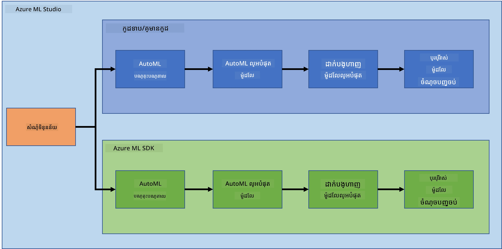

រៀងរាល់វិធីមានអត្ថប្រយោជន៍និងទិដ្ឋភាពខុសៗគ្នា។ វិធីកូដទាប/គ្មានកូដងាយស្រួលចាប់ផ្តើមព្រោះវាចូលរួមជាមួយ GUI (ចំណុចប្រទាក់អភិវឌ្ឍផ្តាច់មុខ) ដែលមិនត្រូវការជំនាញកូដមុនទេ។ វិធីនេះអាចសាកល្បងល្បឿនលឿនសម្រាប់ការផ្សព្វផ្សាយគម្រោង និងបង្កើត POC (ការបង្ហាញការយល់ដឹង)។ ប៉ុន្តែក្នុងពេលគម្រោងកើនឡើង និងត្រូវតែមានត្រៀមសម្រាប់ផលិតកម្ម វិធីនេះមិនផ្គួផ្គងសម្រាប់បង្កើតធនធានតាម GUI ទេ។ យើងត្រូវតែប្រើកម្មវិធីដើម្បីស្វ័យប្រវត្តិកម្មគ្រប់យ៉ាង ចាប់ពីការបង្កើតធនធាន ដល់ការប្រតិបត្តិម៉ូដែល។ នេះជាកន្លែងដែលការគិតដឹងពីរបៀបប្រើ Azure ML SDK មានសារៈសំខាន់។

|                   | កូដទាប/គ្មានកូដ | Azure ML SDK               |
|-------------------|------------------|---------------------------|
| ជំនាញកូដ        | មិនត្រូវការ     | ត្រូវការ                  |
| ពេលវេលាអភិវឌ្ឍ    | លឿន និងងាយស្រួល  | អាស្រ័យលើជំនាញកូដ      |
| ត្រៀមរួចសម្រាប់ផលិតកម្ម | ទេ               | មាន                      |

### ១.៣ សំណុំទិន្នន័យបរាជ័យបេះដូង

ជំងឺបេះដូងនិងសរសៃឈាម (CVDs) ជាអង្គភាពមួយដែលបណ្តាលឲ្យអ្នកស្លាប់ច្រើនលេខ១លើពិភពលោក ដោយគិតជារយៈ ៣១% នៃការស្លាប់ទាំងអស់នៅលើពិភពលោក។ កត្តាជាស្រេចបរិយាកាស និងអាកប្បកិរិយា ដូចជា ការប្រើប្រាស់បារី អាហារមិនសមរម្យ និងទម្ងន់ក្រាស់ មានសក្តានុពលត្រូវបានប្រើនៅក្នុងម៉ូដែលកំណត់តម្លៃ។ ការអាចប៉ាន់ស្មានអាចនៃការអភិវឌ្ឍជំងឺ CVD នឹងមានប្រយោជន៍ដល់ការការពារ​ការវាយប្រហារនៅមនុស្សដែលមានហានិភ័យខ្ពស់។

Kaggle បានចេញផ្សាយ [សំណុំទិន្នន័យបរាជ័យបេះដូង](https://www.kaggle.com/andrewmvd/heart-failure-clinical-data) ដែលយើងនឹងប្រើសម្រាប់គម្រោងនេះ។ អ្នកអាចទាញយកសំណុំទិន្នន័យនេះឥឡូវនេះ។ វាជាសំណុំទិន្នន័យបែបតារាងដែលមាន ១៣ ដេប (១២ លក្ខណៈពិសេស និង ១ អថេរគោលដៅ) និង ២៩៩ ជួរ។

|    | ឈ្មោះអថេរ             | ប្រភេទ          | ការពិពណ៌នា                                            | ឧទាហរណ៍           |
|----|---------------------------|-----------------|---------------------------------------------------------|-------------------|
| ១  | អាយុ                       | ចំនួន           | អាយុរបស់អ្នកជំងឺ                                   | ២៥                |
| ២  | ឈឺស្ដើង                   | តម្លៃមាន/គ្មាន  | ការថយចុះរបស់កោសិការឈាមក្រហម ឬ ហែលម៉ូហ្គ្លូប៊ីន  | ០ ឬ ១             |
| ៣  | creatinine_phosphokinase  | ចំនួន           | សន្ទស្សន៍សន្សើមម៉ាស៊ីន CPK នៅក្នុងឈាម               | ៥៤២               |
| ៤  | ទឹកនោមផ្អែម               | តម្លៃមាន/គ្មាន  | ប្រសិនបើអ្នកជំងឺមានទឹកនោមផ្អែម                   | ០ ឬ ១             |
| ៥  | ejection_fraction         | ចំនួន           | ភាគរយនៃឈាមចេញពីបេះដូងក្នុងលំហូរ                | ៤៥                |
| ៦  | លើសសម្ពាធ             | តម្លៃមាន/គ្មាន  | ប្រសិនបើអ្នកជំងឺមានសម្ពាធឈាមខ្ពស់               | ០ ឬ ១             |
| ៧  | ផ្លាស្លែត                | ចំនួន           | ផ្លាស្លែតនៅក្នុងឈាម                                   | ១៤៩០០០           |
| ៨  | serum_creatinine          | ចំនួន           | សន្ទស្សន៍សេរមក្រីអាទីនីន នៅក្នុងឈាម                     | ០.៥               |
| ៩  | serum_sodium              | ចំនួន           | សន្ទស្សន៍សេរមសូដ្យូមនៅក្នុងឈាម                         | jun               |
| ១០ | ភេទ                       | តម្លៃមាន/គ្មាន  | ស្រី ឬ ប្រុស                                            | ០ ឬ ១             |
| ១១ | បារី                      | តម្លៃមាន/គ្មាន  | ប្រសិនបើអ្នកជំងឺជ្រើសបារី                         | ០ ឬ ១             |
| ១២ | ពេលវេលា                    | ចំនួន           | រយៈពេលតាមដាន (ថ្ងៃ)                                 | ៤                  |
|----|---------------------------|-----------------|---------------------------------------------------------|-------------------|
| ២១ | DEATH_EVENT [គោលដៅ]       | តម្លៃមាន/គ្មាន  | ប្រសិនបើអ្នកជំងឺស្លាប់ក្នុងរយៈពេលតាមដាន              | ០ ឬ ១             |

ពេលដែលអ្នកមានសំណុំទិន្នន័យនេះរួចហើយ យើងអាចចាប់ផ្តើមគម្រោងនៅ Azure។

## ២. ការបណ្ដុះបណ្ដាលម៉ូដែលកូដទាប/គ្មានកូដនៅ Azure ML Studio
### ២.១ បង្កើតកន្លែងធ្វើការ Azure ML
ដើម្បីបណ្ដុះបណ្ដាលម៉ូដែលនៅ Azure ML អ្នកត្រូវបង្កើតកន្លែងធ្វើការ Azure ML ជាមុនសិន។ កន្លែងធ្វើការ គឺធនធានមួយកំពូលសម្រាប់ Azure Machine Learning ដែលផ្តល់កន្លែងកណ្តាលសម្រាប់ធ្វើការជាមួយអត្ថបទទាំងអស់ដែលអ្នកបង្កើតនៅពេលប្រើ Azure Machine Learning។ កន្លែងធ្វើកាសំខាន់ៗដូចជា រក្សាប្រវត្តិការបណ្ដុះបណ្ដាលរួមមានកំណត់ហេតុ សន្ទស្សន៍ លទ្ធផល និងការបាញ់ផ្ទុកស្ក្រីបរបស់អ្នក។ អ្នកប្រើព័ត៌មាននេះដើម្បីកំណត់ថាការបណ្ដុះបណ្ដាលណាផលិតម៉ូដែលល្អបំផុត។ [សូមរៀនបន្ថែម](https://docs.microsoft.com/azure/machine-learning/concept-workspace?WT.mc_id=academic-77958-bethanycheum&ocid=AID3041109)

មានការផ្តល់អនុសាសន៍ឲ្យប្រើកម្មវិធីរុករកបច្ចុប្បន្នដែលសមស្របជាមួយប្រព័ន្ធប្រតិបត្តិការរបស់អ្នក។ កម្មវិធីរុករកដូចខាងក្រោមត្រូវបានគាំទ្រ៖

- Microsoft Edge (Microsoft Edge ថ្មី ជំនាន់ចុងក្រោយ មិនមែន Microsoft Edge ប្រវត្តិសាស្ត្រ)
- Safari (ជំនាន់ចុងក្រោយ សម្រាប់ Mac តែប៉ុណ្ណោះ)
- Chrome (ជំនាន់ចុងក្រោយ)
- Firefox (ជំនាន់ចុងក្រោយ)

ដើម្បីប្រើ Azure Machine Learning សូមបង្កើតកន្លែងធ្វើការ​នៅក្នុងការជាវ Azure របស់អ្នក។ អ្នកអាចប្រើកន្លែងធ្វើការនេះដើម្បីគ្រប់គ្រងទិន្នន័យ ធនធានគណនា កូដ ម៉ូដែល និងអត្ថបទផ្សេងទៀតដែលទាក់ទងនឹងការងារ machine learning របស់អ្នក។

> **_វិចារណៈ:_** ការជាវ Azure របស់អ្នកនឹងត្រូវគិតថ្លៃសម្រាប់ការផ្ទុកទិន្នន័យតិចតួច ប៉ុន្តែត្រូវតែក្រោមល័ក្ខខ័ណ្ឌថាកន្លែងធ្វើការរបស់ Azure Machine Learning នៅក្នុងការជាវរបស់អ្នកនៅតែមាន។ ដូច្នេះយើងផ្តល់អនុសាសន៍ឲ្យលុបកន្លែងធ្វើការនេះពេលដែលអ្នកមិនប្រើហើយ។

១. ចូលទៅកាន់ [Azure portal](https://ms.portal.azure.com/) ដោយប្រើគណនី Microsoft ដែលភ្ជាប់ជាមួយការជាវ Azure របស់អ្នក។
២. ជ្រើស **＋Create a resource**
   
   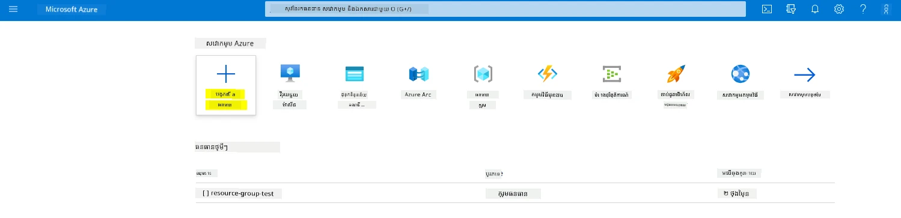

   ស្វែងរកកុំព្យូទ័រ Machine Learning ហើយជ្រើសរើស Machine Learning tile

   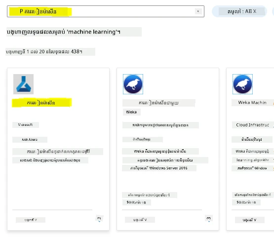

   ចុចប៊ូតុងបង្កើត

   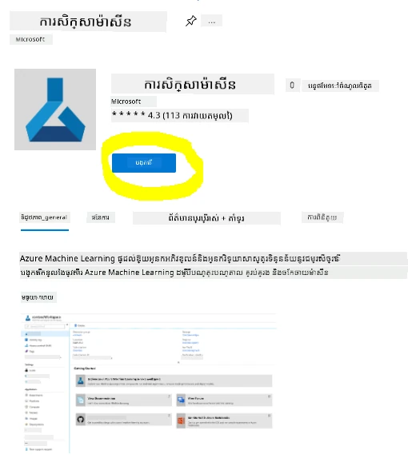

   បំពេញការកំណត់ដូចខាងក្រោម៖
   - Subscription: ការជាវ Azure របស់អ្នក
   - Resource group: បង្កើត ឬ ជ្រើសក្រុមធនធាន
   - Workspace name: បញ្ចូលឈ្មោះតែមួយសម្រាប់កន្លែងធ្វើការរបស់អ្នក
   - Region: ជ្រើសតំបន់ភូមិសាស្ត្រដែលនៅជិតអ្នកបំផុត
   - Storage account: ចំណាំអំពី storage account ថ្មីដែលនឹងត្រូវបង្កើតសម្រាប់កន្លែងធ្វើការរបស់អ្នក
   - Key vault: ចំណាំអំពី key vault ថ្មីដែលនឹងត្រូវបង្កើតសម្រាប់កន្លែងធ្វើការរបស់អ្នក
   - Application insights: ចំណាំអំពី application insights ថ្មីដែលនឹងត្រូវបង្កើតសម្រាប់កន្លែងធ្វើការរបស់អ្នក
   - Container registry: គ្មាន (មួយនឹងត្រូវបង្កើតដោយស្វ័យប្រវត្តិពេលអ្នកប្រតិបត្តិម៉ូដែលដំបូងទៅ container)

    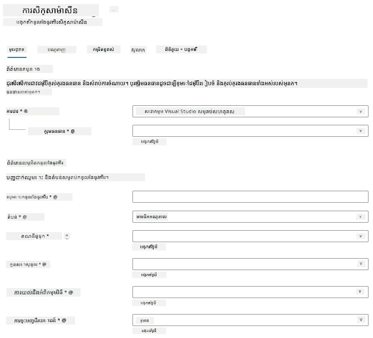

   - ចុចបង្កើត + ពិនិត្យបន្ទាប់មកចុចបង្កើត
៣. រង់ចាំកន្លែងធ្វើការរបស់អ្នកត្រូវបានបង្កើត (អាចប្រហែលប៉ុន្មាននាទី) បន្ទាប់មកចូលទៅកាន់វានៅក្នុងផ្ទាំង portal។ អ្នកអាចរកវាតាមសេវាកម្ម Machine Learning Azure។
៤. នៅលើទំព័រ ទិដ្ឋភាពទូទៅសំរាប់កន្លែងធ្វើការ នាំចូល Azure Machine Learning studio (ឬបើកបន្ទាត់រុករកថ្មីហើយបញ្ចូលទៅ https://ml.azure.com) ហើយចូលទៅ Azure Machine Learning studio ដោយប្រើគណនី Microsoft របស់អ្នក។ ប្រសិនបើមានការស្នើឲ្យជ្រើសរើស ផ្ទាំង Azure និងការជាវ Azure របស់អ្នក។
   
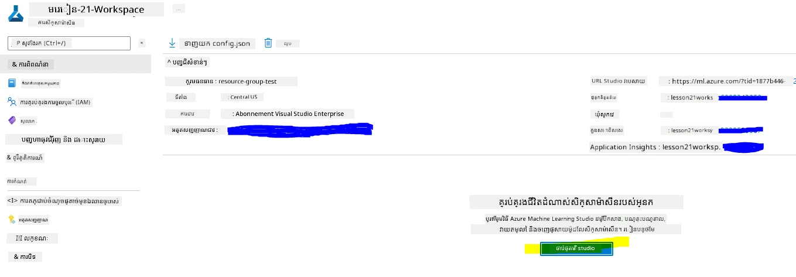

៥. នៅក្នុង Azure Machine Learning studio, ចុចរូបតំណាង ☰ នៅកំពូលខាងឆ្វេង ដើម្បីមើលទំព័រផ្សេងៗនៅក្នុងចំណុចប្រទាក់។ អ្នកអាចប្រើទំព័រទាំងនេះដើម្បីគ្រប់គ្រងធនធាននៅក្នុងកន្លែងធ្វើការរបស់អ្នក។

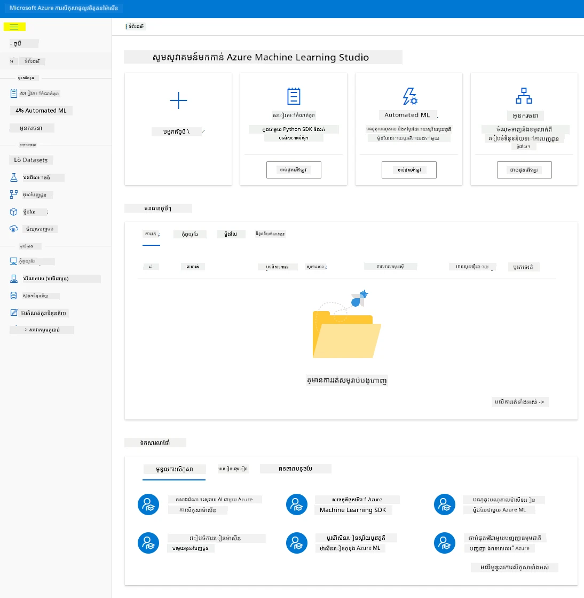

អ្នកអាចគ្រប់គ្រងកន្លែងធ្វើការរបស់អ្នកតាមរយៈ Azure portal តែសម្រាប់អ្នកវិទ្យាសាស្ត្រទិន្នន័យ និងវិស្វករបម្រែបម្រួល Machine Learning, Azure Machine Learning Studio ផ្តល់ចំណុចប្រទាក់សម្រាប់អ្នកប្រើដែលកំណត់បន្តិចបន្តួចសម្រាប់គ្រប់គ្រងធនធានកន្លែងធ្វើការ។

### ២.២ ធនធានគណនា

ធនធានគណนา គឺជាធនធាននៅលើពពកដែលអ្នកអាចប្រតិបត្តិការបណ្ដុះបណ្ដាលម៉ូដែល និងដំណើរការស្រាវជ្រាវទិន្នន័យ។ មានបួនប្រភេទធនធានគណនាដែលអ្នកអាចបង្កើតបាន៖
- **Compute Instances**: ស្ថានីយ៍អភិវឌ្ឍន៍ដែលអ្នកវិទ្យាសាស្ត្រទិន្នន័យអាចប្រើដើម្បីធ្វើការជាមួយទិន្នន័យនិងម៉ូដែល។ វា មានការបង្កើតម៉ាស៊ីនមេវីអិមមួយ (VM) ហើយចាប់ផ្តើមប្រើសៀវភៅកំណត់ត្រា។ បន្ទាប់មកអ្នកអាចបង្រៀនម៉ូដែលដោយហៅក្រុមកុំព្យូទ័រពីសៀវភៅកំណត់ត្រា។
- **Compute Clusters**: ក្រុមអ្នកវិញវំបណ្តាញម៉ាស៊ីនវីអិមដែលអាចធ្វើការក្នុងសំណងតាមតម្រូវការនៃកូដសាកល្បង។ អ្នកនឹងត្រូវការវា​ពេលបង្រៀនម៉ូដែល។ ក្រុមកុំព្យូទ័រនៃម៉ាស៊ីនវីអិមអាចប្រើធនធាន GPU ឬ CPU ជាពិសេស។
- **Inference Clusters**: គោលដៅការចេញផ្សាយសេវាកម្មប៉ុនប៉ងដែលប្រើម៉ូដែលដែលបានបង្រៀនរួច។
- **Attached Compute**: ភ្ជាប់ទៅនឹងធនធានកុំព្យូទ័រអាហ៊ឺរ Azure មានស្រាប់ដូចជា ម៉ាស៊ីនវីអិម ឬក្រុម Azure Databricks ។

#### 2.2.1 ជ្រើសរើសជម្រើសត្រឹមត្រូវសម្រាប់ធនធានកុំព្យូទ័របស់អ្នក

មានកត្តាសំខាន់ៗមួយចំនួនដែលត្រូវពិចារណានេលបង្កើតធនធានកុំព្យូទ័រ ហើយជម្រើសទាំងនោះអាចជាការសម្រេចចិត្តសំខាន់។

**តើអ្នកត្រូវការរបស់ CPU ឬ GPU ?**

CPU (Central Processing Unit) គឺជាសៀគ្វីអេឡិចត្រូនិកដែលអនុវត្តន៍ការណែនាំដែលមានក្នុងកម្មវិធីកុំព្យូទ័រ។ GPU (Graphics Processing Unit) គឺជាសៀគ្វីអេឡិចត្រូនិចជាក់លាក់មួយដែលអាចអនុវត្តកម្មវិធីដែលទាក់ទងនឹងក្រាហ្វិកបានយ៉ាងលឿនណាស់។

ភាពខុសគ្នាចម្បងរវាងស្ថាបត្យកម្ម CPU និង GPU គឺ CPU ត្រូវបានរចនាឡើងសម្រាប់ដោះស្រាយភារកិច្ចជាច្រើនយ៉ាងរហ័ស (វាស់ដោយល្បឿនម៉ោង CPU) ប៉ុន្តែមានកម្រិតកំណត់នៅក្នុងការរត់ភារកិច្ចច្រើននាក់ក្នុងពេលតែមួយ។ GPU ត្រូវបានរចនាសម្រាប់កុំព្យូទ័រជាគូរដោយសារច្រើន ហើយហេតុនេះវាអាចដំណើរការងារស្វ័យប្រវត្តិក្នុងការរៀនជ្រៅបានកាន់តែល្អ។

| CPU                                     | GPU                         |
|-----------------------------------------|-----------------------------|
| ផ្សេងតិចក្នុងតម្លៃ                    | ថ្លៃខ្ពស់ជាង               |
| កម្រិត concurrency តិច                  | កម្រិត concurrency ខ្ពស់     |
| យឺតជាងនៅក្នុងការបង្រៀនម៉ូដែលរៀនជ្រៅ    | យុទ្ធសាស្រ្តសម្រាប់រៀនជ្រៅ    |


**ទំហំក្រុម**

ក្រុមធំធេងមានតម្លៃថ្លៃជាង ប៉ុន្តែមានប្រសិទ្ធភាពបំលែងល្អជាង។ ហេតុដូច្នេះ ប្រសិនបើអ្នកមានពេលវេលាប៉ុន្តែមិនមានលុយគ្រប់គ្រាន់ អ្នកគួរចាប់ផ្តើមជាមួយក្រុមតូច។ ផ្ទុយឡើយ ប្រសិនបើអ្នកមានលុយប៉ុន្តែមិនមានពេលវេលាច្រើន អ្នកគួរចាប់ផ្តើមជាមួយក្រុមធំជាង។

**ទំហំ VM**

យោងទៅលើចំណុចព្រំដែនពេលវេលានិងថវិការបស់អ្នក អ្នកអាចបំលែងទំហំ RAM, ឌីស, ចំនួនក័រនិងល្បឿនម៉ោង។ ការពង្រីកប៉ារ៉ាមែត្រ​ទាំងនោះនឹងមានថ្លៃដូចគ្នា ប៉ុន្តែនឹងបង្កើតប្រសិទ្ធភាពកាន់តែប្រសើរ។

**ស្ថានីយ៍ផ្តោតបំរើ ឬ ស្ថានីយ៍អាទិភាពទាប ?**

ស្ថានីយ៍អាទិភាពទាបមានន័យថាវាអាចត្រូវផ្អាកបាន៖ មូលដ្ឋាន Microsoft Azure អាចយកធនធានទាំងនោះនិងផ្តល់ជូនភារកិច្ចផ្សេងទៀត ដូច្នេះធ្វើឲ្យការងារត្រូវបានផ្អាក។ ស្ថានីយ៍ផ្តោតបំរើ ឬមិនអាចផ្អាកបាន មានន័យថាការងារនឹងមិនត្រូវបញ្ចប់ដោយគ្មានការអនុញ្ញាតពីអ្នក។ នេះជាការពិចារណាផ្សេងទៀតរវាងពេលវេលានិងលុយ ព្រោះស្ថានីយ៍អាទិភាពទាបមានតម្លៃថ្លៃតិចជាងស្ថានីយ៍ផ្តោតបំរើ។

#### 2.2.2 បង្កើត Compute Cluster

នៅក្នុង [Azure ML workspace](https://ml.azure.com/) ដែលយើងបានបង្កើតពីមុន ចូលទៅកាន់ compute ហើយអ្នកនឹងឃើញធនធាន Compute ផ្សេងៗដែលយើងបានពិភាក្សាក្រោមនេះ (ដោយមាន compute instances, compute clusters, inference clusters និង attached compute)។ សម្រាប់គម្រោងនេះ យើងនឹងត្រូវការ compute cluster សម្រាប់បង្រៀនម៉ូដែល ក្នុង Studio ចុចលើមេនុយ "Compute" បន្ទាប់មកស្លាបព្រិល "Compute cluster" ហើយចុចលើប៊ូតុង "+ New" ដើម្បីបង្កើត compute cluster។

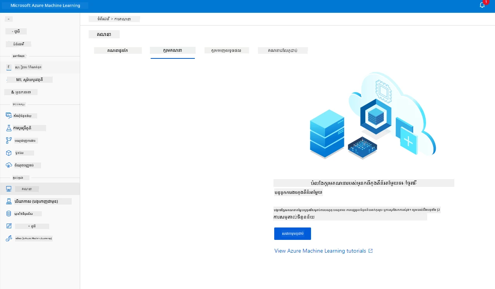

1. ជ្រើសរើសជម្រើសរបស់អ្នក៖ ផ្តោតបំរើ ទល់និងអាទិភាពទាប, CPU ឬ GPU, ទំហំ VM និងចំនួនក័រ (អ្នកអាចរក្សាប៉ារ៉ាមែត្រ លំនាំដើមសម្រាប់គម្រោងនេះ)។
2. ចុចប៊ូតុង Next។

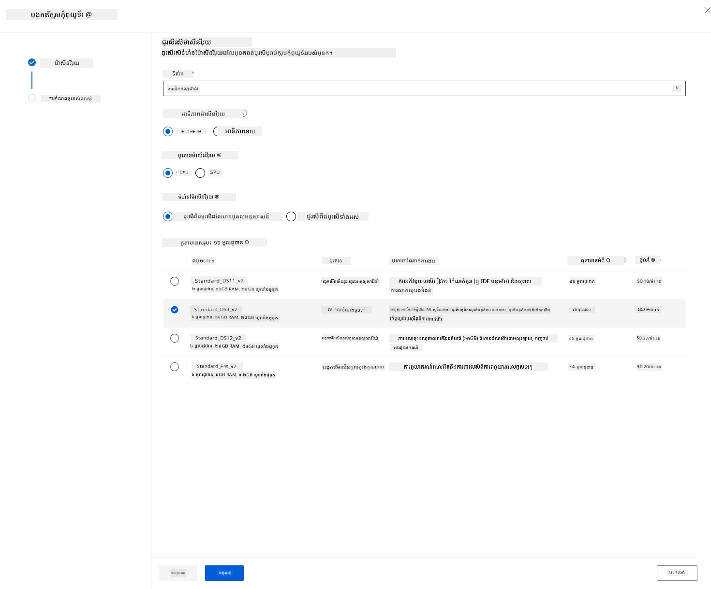

3. ផ្ដល់ឈ្មោះ compute cluster
4. ជ្រើសរើសជម្រើសរបស់អ្នក៖ ចំនួនកណ្តាល/អតិបរមា នៃចំណុច, ជំហានអសកម្មមុនការកាត់បន្ថយទំហំ, ចូល​ប្រើ SSH។ សម្គាល់ថាបើចំនួនចំណុចអប្បបរមា គឺ 0 អ្នកនឹងសន្សំលុយពេល cluster មិនប្រើប្រាស់។ សម្គាល់ថាចំនួនកំណត់អតិបរមា ជាច្រើន អាចធ្វើឲ្យការបង្រៀនកាន់តែខ្លី។ ចំនួនកំណត់អតិបរមាដែលផ្តល់អនុស្សរណៈគឺ 3។
5. ចុចប៊ូតុង "Create"។ ជំហាននេះអាចយកពេលពីរបីនាទី។

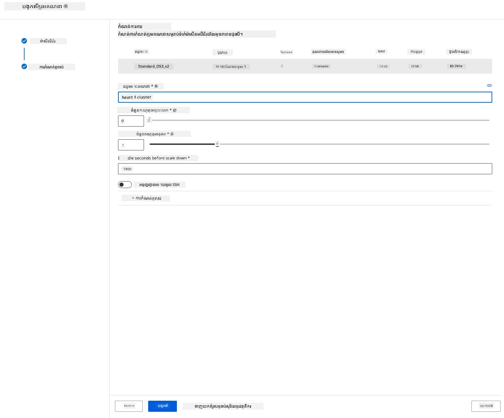

អស្ចារ្យ! ឥឡូវនេះយើងមាន Compute cluster ត្រូវបានបង្កើតហើយ យើងត្រូវបញ្ចូលទិន្នន័យទៅ Azure ML Studio។

### 2.3 បញ្ចូលគន្និកម្មទិន្នន័យ

1. នៅក្នុង [Azure ML workspace](https://ml.azure.com/) ដែលយើងបានបង្កើតពីមុន ចុចលើ "Datasets" នៅមេនុយខាងឆ្វេង ហើយចុចប៊ូតុង "+ Create dataset" ដើម្បីបង្កើតគណនីទិន្នន័យ។ ជ្រើសរើសជម្រើស "From local files" ហើយជ្រើសយក dataset Kaggle ដែលយើងបានទាញយកមុននេះ។

   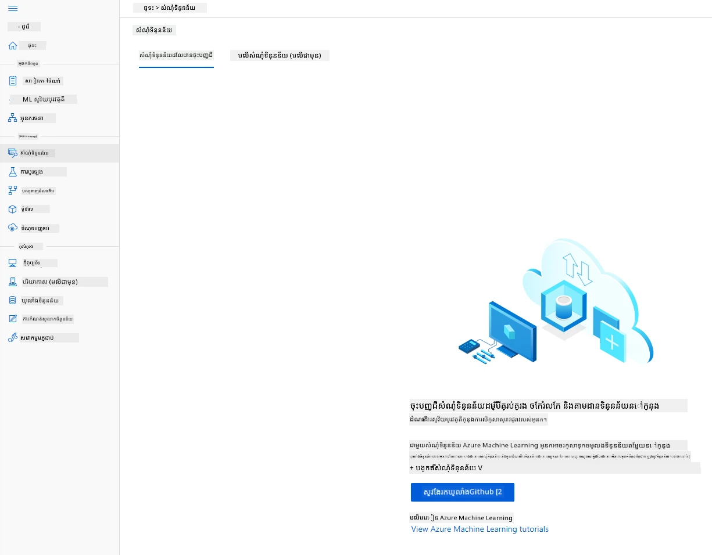

2. ផ្ដល់ឈ្មោះ, ប្រភេទ និងការពិពណ៌នាដាក់ក្នុង dataset របស់អ្នក។ ចុចប៊ូតុង Next។ ផ្ទុកឡើងទិន្នន័យពីឯកសារ។ ចុចប៊ូតុង Next ។

   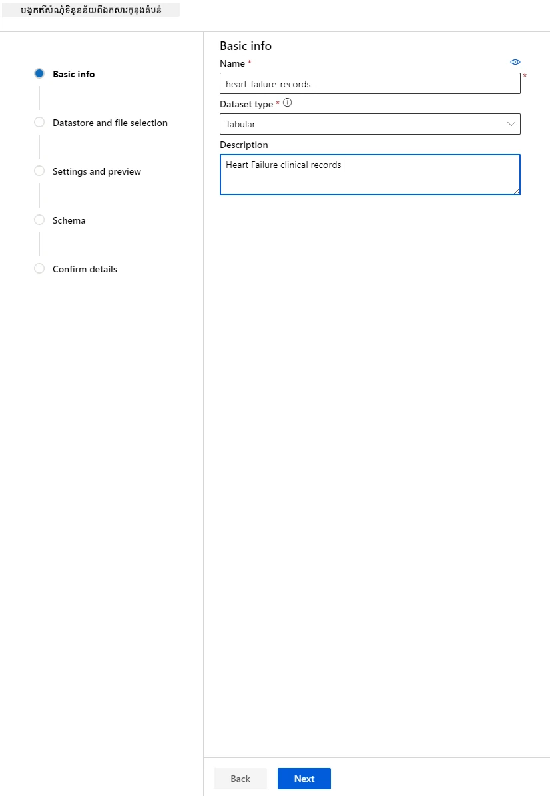

3. នៅក្នុង Schema ផ្លាស់ប្តូរប្រភេទទិន្នន័យទៅ Boolean សម្រាប់លក្ខណៈដូចជា anaemia, diabetes, high blood pressure, sex, smoking, និង DEATH_EVENT។ ចុចប៊ូតុង Next ហើយចុចប៊ូតុង Create ។

   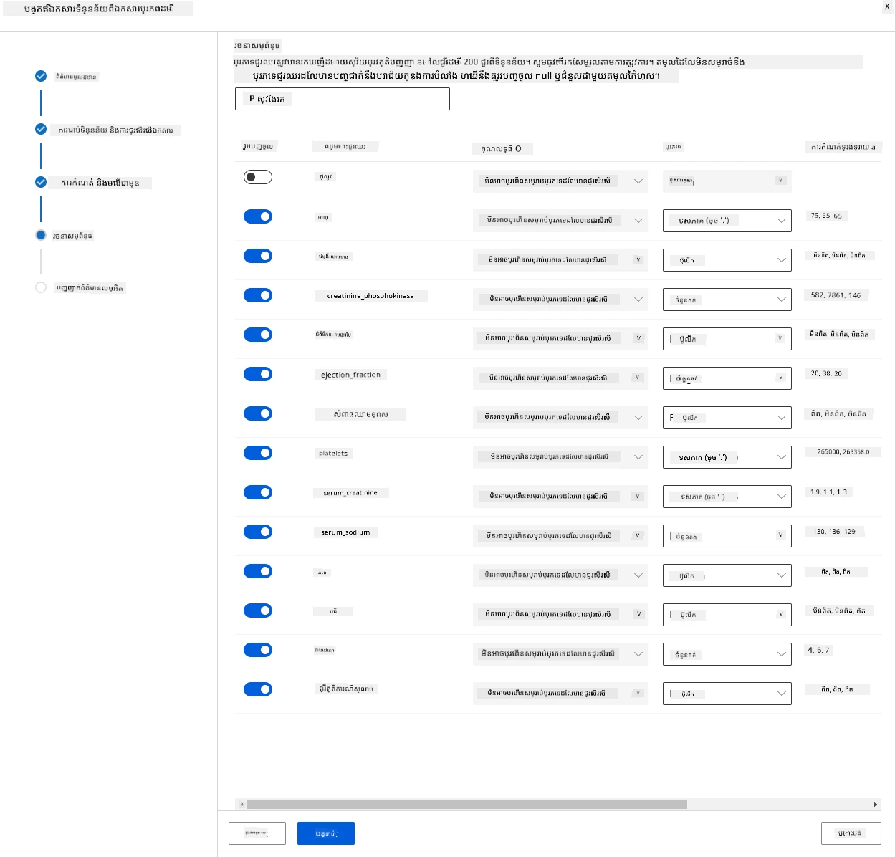

ល្អណាស់! ឥឡូវ dataset បានមានរួចហើយ និង compute cluster បានបង្កើតរួចហើយ យើងអាចចាប់ផ្តើមបង្រៀនម៉ូដែលបាន!

### 2.4 បង្រៀនម៉ូដែលដោយកូដតិច/គ្មានកូដនឹង AutoML

ការអភិវឌ្ឍម៉ូដែលម៉ាស៊ីនរៀនបែបបុរាណ តម្រូវធនធានច្រើន, ត្រូវការជំនាញពិសេស និងពេលវេលាច្រើន ដើម្បីផលិតនិងប្រៀបធៀបម៉ូដែលជាច្រើន។  
Automated machine learning (AutoML) គឺជាដំណើរការស្វ័យប្រវត្តិបំពេញភារកិច្ចដែលចំណាយពេលច្រើន និងមិនចប់ចុងនៃការអភិវឌ្ឍម៉ូដែលម៉ាស៊ីនរៀន។ វាអនុញ្ញាតឲ្យអ្នកវិទ្យាសាស្ត្រទិន្នន័យ អ្នកវិភាគ និងអ្នកអភិវឌ្ឍប្លង់កសាងម៉ូដែល ML ដោយមានទំហំ, ប្រសិទ្ធភាព និងផលិតភាពខ្ពស់ ខណះពេលរក្សាគុណភាពម៉ូដែល។ វាធ្វើឲ្យពេលវេលាដល់ការប្រើប្រាស់ម៉ូដែលក្នុងអាជីវកម្មតិចជាងនិងមានប្រសិទ្ធភាព។ [សូមស្វែងយល់បន្ថែម](https://docs.microsoft.com/azure/machine-learning/concept-automated-ml?WT.mc_id=academic-77958-bethanycheum&ocid=AID3041109)

1. នៅក្នុង [Azure ML workspace](https://ml.azure.com/) ដែលយើងបានបង្កើតពីមុន ចុចលើយ "Automated ML" នៅមេនុយខាងឆ្វេង ហើយជ្រើស dataset ដែលអ្នកទើបបញ្ចូល។ ចុចប៊ូតុង Next ។

   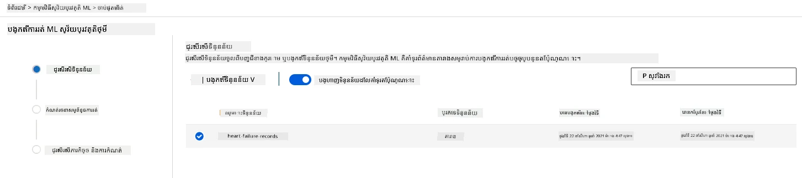

2. បញ្ចូលឈ្មោះការសាកល្បងថ្មី, ជួរដាច់គោល(DEATH_EVENT) និង compute cluster ដែលបានបង្កើត។ ចុច Next ។

   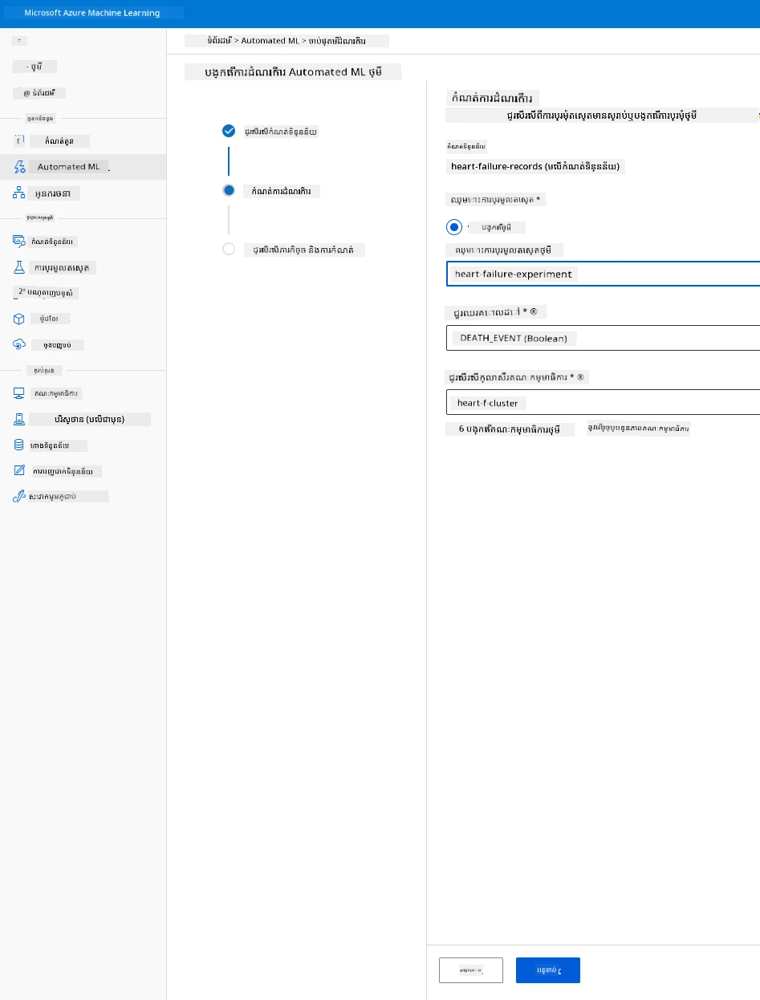

3. ជ្រើសរើស "Classification" ហើយចុច Finish។ ជំហាននេះអាចយកពេលពី 30 នាទី ទៅ 1 ម៉ោង អាស្រ័យលើទំហំ compute cluster របស់អ្នក។

   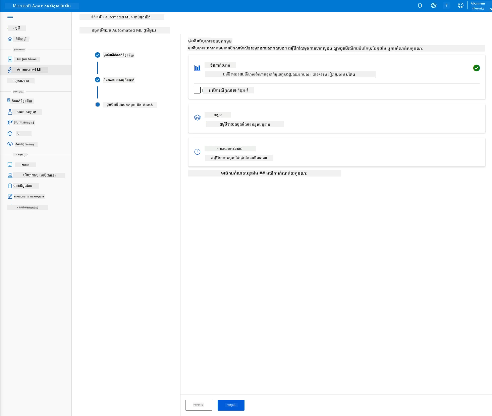

4. បន្ទាប់ពីការរត់បានបញ្ចប់ ចុចស្លាប "Automated ML" ចុចលើការរត់របស់អ្នក ហើយចុចលើ Algorithm ក្នុងកាត "Best model summary"។

   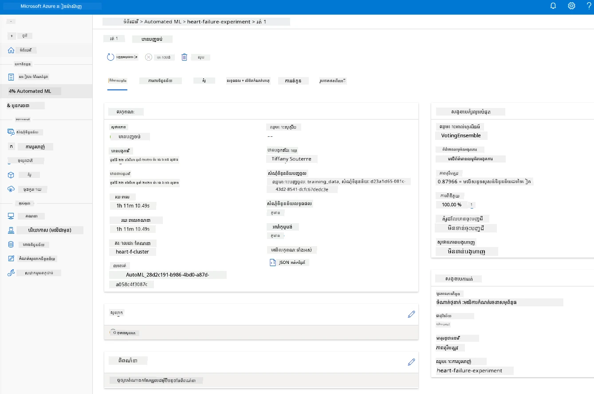

នៅទីនេះ អ្នកអាចមើលការពិពណ៌នាប្រកបដោយភាសារព័ត៌មានលម្អិតស្តីពីម៉ូដែលល្អបំផុតដែល AutoML បង្កើត។ អ្នកអាចស្វែងយល់ម៉ូដែលផ្សេងទៀតក្នុងស្លាប Models។ ចំណាយពេលបន្តិចដើម្បីដឹងពីម៉ូដែលក្នុងប៊ូតុង Explanations (preview)។ បន្ទាប់ពីអ្នកបានជ្រើសម៉ូដែលដែលចង់ប្រើ (នៅទីនេះយើងនឹងជ្រើសម៉ូដែលល្អបំផុតដែល AutoML ជ្រើសរើស) យើងនឹងមើលថាតើធ្វើដូចម្តេចដើម្បីចេញផ្សាយវា។

## 3. ចេញផ្សាយម៉ូដែលដោយកូដតិច/គ្មានកូដ និងប្រើប្រាស់ endpoint
### 3.1 ចេញផ្សាយម៉ូដែល

ចំណុចចេញផ្សាយម៉ូដែលក្នុង Automated machine learning អនុញ្ញាតឲ្យអ្នកចេញផ្សាយម៉ូដែលល្អបំផុតជាសេវាកម្មវែបបានក្នុងប៉ុន្មានជំហាន។ ចេញផ្សាយមានន័យថាអតិថិជនអាចប្រើម៉ូដែលដើម្បីទស្សន៍ទាយពីទិន្នន័យថ្មី និងស្វែងរកឱកាស។ សម្រាប់គម្រោងនេះ ចេញផ្សាយទៅសេវាកម្មវែប មានន័យថាកម្មវិធីវេជ្ជសាស្ត្រ អាចប្រើម៉ូដែល ដើម្បីទស្សន៍ទាយការជួបទង្វើបេះដូងជាបច្ចុប្បន្ន។

នៅក្នុងការពិពណ៌នាម៉ូដែលល្អបំផុត ចុចប៊ូតុង "Deploy"។

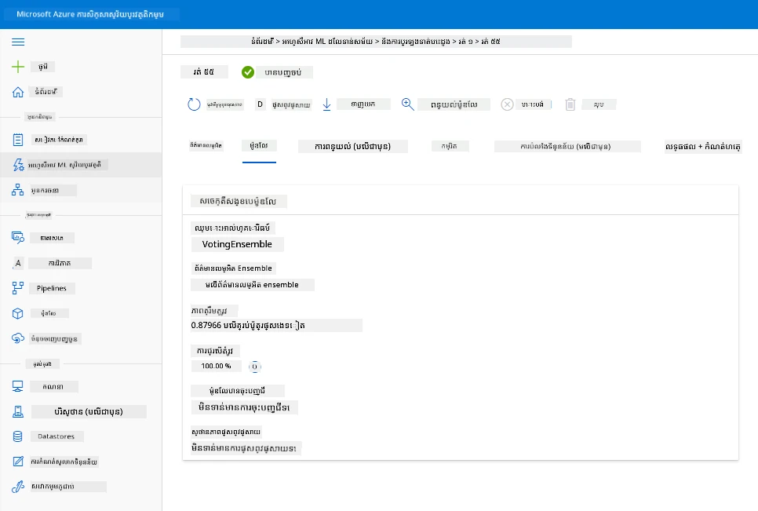

15. ផ្ដល់ឈ្មោះ, ការពិពណ៌នា, ប្រភេទកុំព្យូទ័រ (Azure Container Instance), បើកអត្តសញ្ញាណ និងចុច Deploy។ ជំហាននេះអាចយកពេល 20 នាទីក្នុងការបញ្ចប់។ ដំណើរការចេញផ្សាយរួមមានការចុះបញ្ជីម៉ូដែល, បង្កើតធនធាន និងកំណត់ការងារសម្រាប់សេវាវេប។ សារស្ថានភាពបង្ហាញនៅក្រោមស្ថានភាព Deploy។ ជ្រើស Refresh periodically ដើម្បីពិនិត្យស្ថានភាព។ វាត្រូវបានចេញផ្សាយ និងដំណើរការបានពេលដែលស្ថានភាពគឺ "Healthy"។

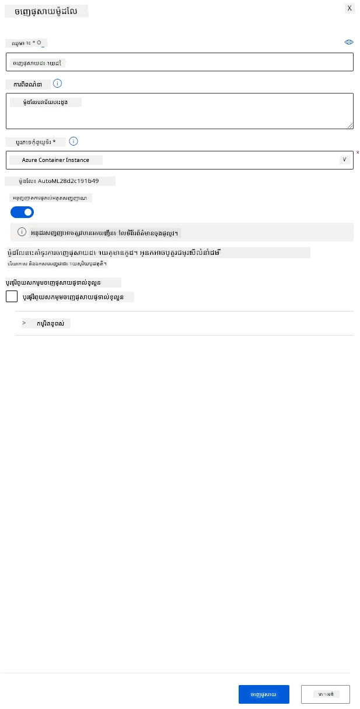

16. បន្ទាប់ពេលចេញផ្សាយរួច ចុចស្លាប Endpoint ហើយចុចលើ endpoint ដែលអ្នកទើបចេញផ្សាយ។ អ្នកអាចរកឃើញព័ត៌មានលម្អិតទាំងអស់ដែលអ្នកត្រូវបានដឹងអំពី endpoint នេះ។

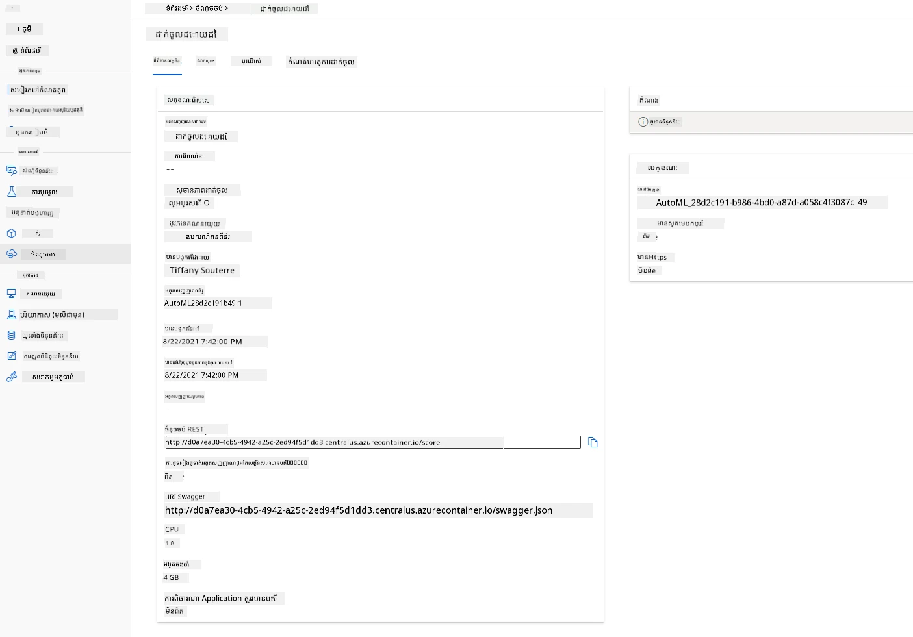

អស្ចារ្យ! ឥឡូវនេះដែលយើងមានម៉ូដែលបានចេញផ្សាយហើយ យើងអាចចាប់ផ្តើមប្រើប្រាស់ endpoint បាន។

### 3.2 ប្រើប្រាស់ Endpoint

ចុចលើស្លាប "Consume"។ នៅទីនេះ អ្នកអាចរក endpoint REST និង script python ជាជម្រើសការប្រើប្រាស់។ ចំណាយពេលអានកូដ python។

 script នេះអាចដំណើរការផ្ទាល់ពីម៉ាស៊ីនកុំព្យូទ័រផ្ទាល់ខ្លួនរបស់អ្នក ហើយនឹងប្រើប្រាស់ endpoint របស់អ្នក។

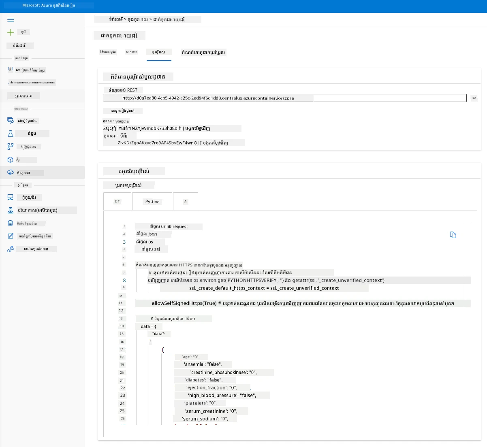

ចំណាយពេលពិនិត្យពីរកូដ៖ 

```python
url = 'http://98e3715f-xxxx-xxxx-xxxx-9ec22d57b796.centralus.azurecontainer.io/score'
api_key = '' # ជំនួសនេះជាមួយកូនសោ API សម្រាប់សេវាកម្មគេហទំព័រ
```
អថេរ `url` គឺ endpoint REST ដែលរកបាននៅស្លាបអតិថិជន និងអថេរ `api_key` គឺគន្លឹះដំបូងដែលបានរកនៅស្លាបអតិថិជន (តែក្នុងករណីអ្នកបានបើកការផ្ទៀងផ្ទាត់អត្តសញ្ញាណ)។ វាជាវិធីដែល script អាចប្រើប្រាស់ endpoint ។

18. បើ script ដំណើរការ អ្នកគួរមើលឃើញលទ្ធផលដូចខាងក្រោម៖

    ```python
    b'"{\\"result\\": [true]}"'
    ```
ន័យថា ការទស្សន៍ទាយអំពីចម្ងាយបេះដូងប្រតិកម្មសម្រាប់ទិន្នន័យត្រូវបានអះអាង។ នេះយ៉ាងហោចណាស់ដោយសារតែប្រសិនបើអ្នកមើលជិតជិតទិន្នន័យដែលបានបង្កើតដោយស្វ័យប្រវត្តិនៅក្នុង script គឺស្វ័យប្រវត្តិដាក់រួចជា 0 និង false រួចហើយ។ អ្នកអាចផ្លាស់ប្តូរទិន្នន័យជាមួយគំរូបញ្ចូលដូចខាងក្រោម៖

```python
data = {
    "data":
    [
        {
            'age': "0",
            'anaemia': "false",
            'creatinine_phosphokinase': "0",
            'diabetes': "false",
            'ejection_fraction': "0",
            'high_blood_pressure': "false",
            'platelets': "0",
            'serum_creatinine': "0",
            'serum_sodium': "0",
            'sex': "false",
            'smoking': "false",
            'time': "0",
        },
        {
            'age': "60",
            'anaemia': "false",
            'creatinine_phosphokinase': "500",
            'diabetes': "false",
            'ejection_fraction': "38",
            'high_blood_pressure': "false",
            'platelets': "260000",
            'serum_creatinine': "1.40",
            'serum_sodium': "137",
            'sex': "false",
            'smoking': "false",
            'time': "130",
        },
    ],
}
```
script គួរត្រឡប់មក៖
    ```python
    b'"{\\"result\\": [true, false]}"'
    ```

សូមអបអរសាទរ! អ្នកបានប្រើម៉ូដែលដែលបានចេញផ្សាយ ហើយបានបង្រៀនវាលើ Azure ML!

> **_ចំណាំ:_** បន្ទាប់ពីបញ្ចប់គម្រោង កុំភ្លេចលុបធនធានទាំងអស់។

## 🚀 thách thức

មើលលម្អិតអំពីការពន្យល់ម៉ូដែលនិងព័ត៌មានលម្អិតដែល AutoML បង្កើតសម្រាប់ម៉ូដែលល្អបំផុត។ ព្យាយាមយល់ថាហេតុអ្វីបានជា ម៉ូដែលល្អបំផុតល្អជាងម៉ូដែលផ្សេង? អ្វីជាអាល់ហ្គារីធម៍ដែលបានប្រៀបធៀប? តើភាពខុសគ្នារវាងពួកវាជាអ្វីខ្លះ? ហេតុអ្វីបានជាម៉ូដែលល្អបំផុតមានការសម្តែងកាន់តែប្រសើរជាងក្នុងករណីនេះ?

## [វិញ្ញាសាបន្ទាប់មក](https://ff-quizzes.netlify.app/en/ds/quiz/35)

## ពិនិត្យនិងសិក្សាផ្ទាល់ខ្លួន

ក្នុងមេរៀននេះ អ្នកបានរៀនរបៀបបង្រៀន, ចេញផ្សាយ និងប្រើម៉ូដែលសម្រាប់ទស្សន៍ទាយការប្រើប្រាស់បេះដូងក្នុងរបៀបកូដតិច/គ្មានកូដក្នុងពពក។ បើអ្នកមិនទាន់ធ្វើ ទៅស្វែងយល់បន្ថែមលើការពន្យល់ម៉ូដែលដែល AutoML បង្កើតសម្រាប់ម៉ូដែលល្អបំផុត ហើយព្យាយាមយល់ថាហេតុអ្វីបានជាម៉ូដែលល្អបំផុតល្អជាងផ្សេងៗ។

អ្នកអាចទៅជ្រាបជាលម្អិតជាងនេះក្នុង Low code/No code AutoML ដោយអាន [ឯកសារ](https://docs.microsoft.com/azure/machine-learning/tutorial-first-experiment-automated-ml?WT.mc_id=academic-77958-bethanycheum&ocid=AID3041109)។

## កិច្ចប្រឹងប្រែង

[គម្រោងវិទ្យាសាស្ត្រ ទិន្នន័យ Low code/No code នៅលើ Azure ML](assignment.md)

---

<!-- CO-OP TRANSLATOR DISCLAIMER START -->
**ការបដិសេធ**៖  
ឯកសារនេះបានបកប្រែក្នុងការប្រើសេវាកម្មបកប្រែ AI [Co-op Translator](https://github.com/Azure/co-op-translator)។ ក្នុងខណៈពេលដែលយើងខិតខំរកត្រឹមត្រូវភាព សូមចំណាំថាការបកប្រែដោយស្វ័យប្រវត្តិនេះអាចមានកំហុស ឬភាពមិនត្រឹមត្រូវ។ ឯកសារដើមនៅក្នុងភាសាគំរូរបស់វាគួរត្រូវបានចាត់ទុកជាប្រភពផ្លូវការទាំងស្រុង។ សម្រាប់ព័ត៌មានសំខាន់ៗ ការបកប្រែដោយមនុស្សជំនាញត្រូវបានផ្ដល់អាទិភាព។ យើងមិនទទួលខុសត្រូវចំពោះភាពយល់ច្រឡំឬការបកប្រែមិនត្រឹមត្រូវណាមួយដែលកើតមានពីការប្រើប្រាស់ការបកប្រែនេះឡើយ។
<!-- CO-OP TRANSLATOR DISCLAIMER END -->