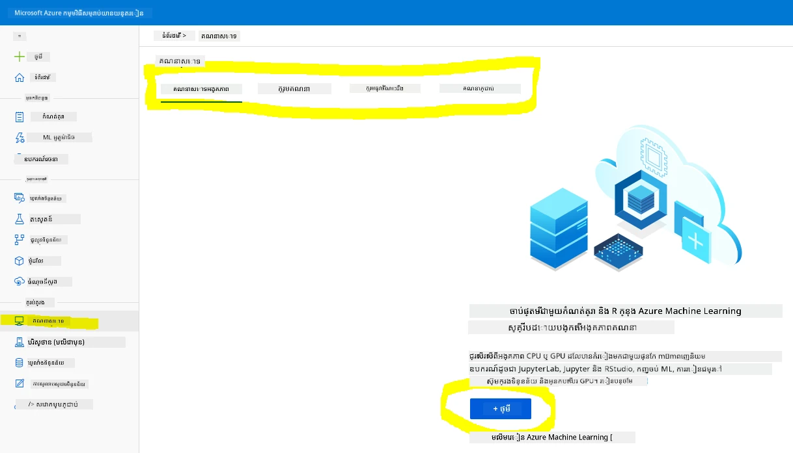
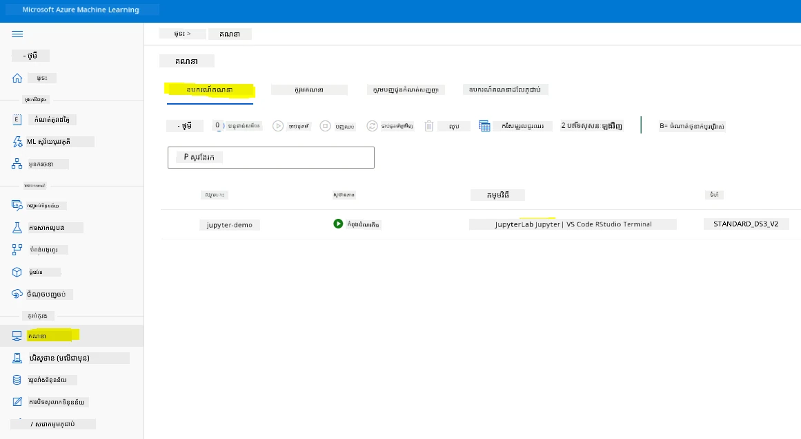
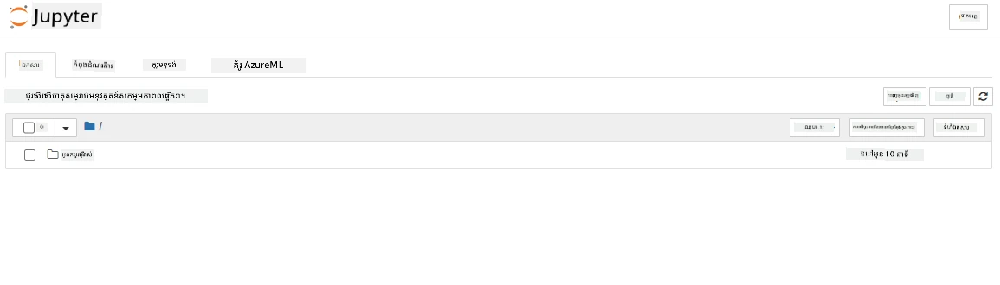

# ទិន្នន័យវិទ្យានៅលើពពក៖ វិធី "Azure ML SDK"

| ](../../sketchnotes/19-DataScience-Cloud.png)|
|:---:|
| ទិន្នន័យវិទ្យានៅលើពពក៖ Azure ML SDK - _Sketchnote ដោយ [@nitya](https://twitter.com/nitya)_ |

វត្ថុតារាងមាតិកាៈ

- [ទិន្នន័យវិទ្យានៅលើពពក៖ វិធី "Azure ML SDK"]( #data-science-in-the-cloud-the-azure-ml-sdk-way)
  - [សំណួរកម្រិតមុនការបង្រៀន](#សំណួរកម្រិតមុនការបង្រៀន)
  - [1. ការណែនាំ](#1-ការណែនាំ)
    - [1.1 Azure ML SDK គឺជាអ្វី?](#11-azure-ml-sdk-គឺជាអ្វី)
    - [1.2 ព្រឹត្តិការណ៍ប៉ាន់ស្កាល់ជំងឺបរាជ័យបេះដូង និងការណែនាំអំពីទិន្នន័យ](#12-ព្រឹត្តិការណ៍ប៉ាន់ស្កាល់ជំងឺបរាជ័យបេះដូង-និងការណែនាំអំពីទិន្នន័យ)
  - [2. ការបណ្តោះអាសន្នម៉ូដែលជាមួយ Azure ML SDK](#2-ការបណ្តោះអាសន្នម៉ូដែលជាមួយ-azure-ml-sdk)
    - [2.1 បង្កើតកន្លែងធ្វើការ Azure ML](#21-បង្កើតកន្លែងធ្វើការ-azure-ml)
    - [2.2 បង្កើតឧបករណ៍គណនា](#22-បង្កើតឧបករណ៍គណនា)
    - [2.3 ការផ្ទុកទិន្នន័យ](#23-ការផ្ទុកទិន្នន័យ)
    - [2.4 ការបង្កើតសៀវភៅកំណត់ត្រា](#24-ការបង្កើតសៀវភៅកំណត់ត្រា)
    - [2.5 ការបណ្តោះអាសន្នម៉ូដែល](#25-ការបណ្តោះអាសន្នម៉ូដែល)
      - [2.5.1 ការតំឡើង Workspace, experiment, compute cluster និងទិន្នន័យ](#251-ការតំឡើង-workspace-experiment-compute-cluster-និងទិន្នន័យ)
      - [2.5.2 កំណត់រចនាសម្ព័ន្ធ AutoML និងការបណ្តោះអាសន្ន](#31-រក្សាទុកម៉ូដែលល្អបំផុត)
  - [3. ការដាក់បញ្ចូលម៉ូដែល និងការប្រើប្រាស់ endpoint ជាមួយ Azure ML SDK](#33-ការប្រើប្រាស់-endpoint)
    - [3.1 រក្សាទុកម៉ូដែលល្អបំផុត](#챌린지)
    - [3.2 ការដាក់បញ្ចូលម៉ូដែល](#វினិច្ឆ័យបន្ទាប់មកមេរៀន)
    - [3.3 ការប្រើប្រាស់ endpoint](#ត្រួតពិនិត្យ-និងរៀនផ្ទាល់ខ្លួន)
  - [🚀 ការប្រកួតប្រជែង](#-challenge)
  - [សំណួរកម្រិតបន្ទាប់ពីការបង្រៀន](#post-lecture-quiz)
  - [ការត្រួតពិនិត្យ និងការសិក្សាដោយខ្លួនឯង](#review--self-study)
  - [ការចាត់ចែងការងារ](#assignment)

## [សំណួរកម្រិតមុនការបង្រៀន](https://ff-quizzes.netlify.app/en/ds/quiz/36)

## 1. ការណែនាំ

### 1.1 Azure ML SDK គឺជាអ្វី?

អ្នកវិទ្យាសាស្ត្រទិន្នន័យ និងអ្នកអភិវឌ្ឍន៍ AI ប្រើ Azure Machine Learning SDK ដើម្បីបង្កើតនិងអនុវត្តវដ្ដការបណ្តោះអាសន្នម៉ាស៊ីនដែលមានក្នុងសេវា Azure Machine Learning។ អ្នកអាចធ្វើការទំនាក់ទំនងជាមួយសេវានេះនៅក្នុងបរិស្ថាន Python មួយណាៗ រួមមាន Jupyter Notebooks, Visual Studio Code ឬ Python IDE ពេញចិត្តរបស់អ្នក។

តំបន់សំខាន់ៗនៃ SDK រួមមាន៖

- ស្វែងរក រៀបចំ និងគ្រប់គ្រងជីវិតទាំងមូលនៃទិន្នន័យដែលអ្នកប្រើប្រាស់ក្នុងការបណ្តោះអាសន្នម៉ូដែល។
- គ្រប់គ្រងធនធានពពកសម្រាប់ត្រួតពិនិត្យ កំណត់ត្រា និងរៀបចំបទពិសោធន៍បណ្តោះអាសន្នម៉ូដែលរបស់អ្នក។
- បណ្តោះអាសន្នម៉ូដែលដោយផ្ទាល់ នៅក្នុងកុំព្យូទ័រផ្ទាល់ខ្លួនឬប្រើធនធានពពក រួមមានការបណ្តោះអាសន្នម៉ូដែលដែលល្បឿនលឿនជាមួយ GPU។
- ប្រើវដ្ដការបណ្តោះអាសន្នម៉ាស៊ីនដោយស្វ័យប្រវត្តិ ដែលទទួលបានប៉ារ៉ាម៉ែត្រកំណត់រចនាសម្ព័ន្ធ និងទិន្នន័យបណ្តោះអាសន្ន។ វាធ្វើការត្រឡប់មេធ្យោបាយ និងកំណត់តម្លៃ hyperparameters ដើម្បីស្វែងរកម៉ូដែលល្អបំផុតសម្រាប់ការប្រាស្រ័យទាក់ទងនូវការព្យាករណ៍។
- ដាក់បញ្ចូលសេវេប្វេបសម្រាប់បម្លែងម៉ូដែលដែលបានបណ្តោះអាសន្នទៅជាសេវា RESTful ដែលអាចប្រើប្រាស់បាននៅក្នុងកម្មវិធីណាមួយ។

[សូមស្វែងយល់បន្ថែមអំពី Azure Machine Learning SDK](https://docs.microsoft.com/python/api/overview/azure/ml?WT.mc_id=academic-77958-bethanycheum&ocid=AID3041109)

នៅក្នុង [មេរៀនមុន](../18-Low-Code/README.md) យើងបានឃើញរបៀបបណ្តោះអាសន្ន ដាក់បញ្ចូល និងប្រើម៉ូដែលក្នុងរបៀប Low code/No code។ យើងបានប្រើទិន្នន័យ Heart Failure ដើម្បីបង្កើត និងម៉ូដែលព្យាករណ៍បរាជ័យបេះដូង។ នៅក្នុងមេរៀននេះ យើងនឹងធ្វើដូចគ្នាទាំងស្រុង ប៉ុន្តប្រើ Azure Machine Learning SDK ។


### 1.2 ព្រឹត្តិការណ៍ប៉ាន់ស្កាល់ជំងឺបរាជ័យបេះដូង និងការណែនាំអំពីទិន្នន័យ

ពិនិត្យមើល [ទីនេះ](../18-Low-Code/README.md) សម្រាប់ព្រឹត្តិការណ៍ប៉ាន់ស្កាល់ជំងឺបរាជ័យបេះដូង និងការណែនាំពីទិន្នន័យជាមុន។

## 2. ការបណ្តោះអាសន្នម៉ូដែលជាមួយ Azure ML SDK
### 2.1 បង្កើតកន្លែងធ្វើការ Azure ML

ដើម្បីផ្ដល់ភាពសាមញ្ញ យើងនឹងធ្វើការនៅលើ jupyter notebook។ វាមានន័យថាអ្នកមាន Workspace និង compute instance រួចហើយ។ ប្រសិនបើអ្នកមាន Workspace រួច អ្នកអាចរំកិលទៅផ្នែក 2.3 ការបង្កើតសៀវភៅកំណត់ត្រាក្នុងភ្លាម។

បើមិនមាន សូមអនុវត្តតាមការណែនាំនៅផ្នែក **2.1 បង្កើតកន្លែងធ្វើការ Azure ML** នៅក្នុង [មេរៀនមុន](../18-Low-Code/README.md) ដើម្បីបង្កើត workspace។

### 2.2 បង្កើតឧបករណ៍គណនា

នៅក្នុង [កន្លែងធ្វើការ Azure ML](https://ml.azure.com/) ដែលយើងបានបង្កើតមុននេះ ចូលទៅម៉ឺនុយ compute ហើយអ្នកនឹងឃើញធនធានគណនាផ្សេងៗដែលមានស្រាប់



ចង់បង្កើតឧបករណ៍គណនាដើម្បីផ្ដល់សេវាទៅរៀបចំមួយសៀវភៅកំណត់ត្រា jupyter ។
1. ចុចប៊ូតុង + New។
2. បំពេញឈ្មោះឧបករណ៍គណនារបស់អ្នក។
3. ជ្រើសអង្គភាពភាគច្រើន៖ CPU ឬ GPU, ទំហំ VM និង ចំនួន core។
4. ចុចប៊ូតុង Create ។

អបអរសាទរ! អ្នកទើបបង្កើតឧបករណ៍គណនា។ យើងនឹងប្រើឧបករណ៍គណនានេះដើម្បីបង្កើតសៀវភៅកំណត់ត្រាក្នុងផ្នែក [ការបង្កើតសៀវភៅកំណត់ត្រា](#23-ការផ្ទុកទិន្នន័យ)។

### 2.3 ការផ្ទុកទិន្នន័យ
សូមយោងទៅ [មេរៀនមុន](../18-Low-Code/README.md) ក្នុងផ្នែក **2.3 ការផ្ទុកទិន្នន័យ** ប្រសិនបើអ្នកមិនទាន់ផ្ទុកទិន្នន័យឡើយ។

### 2.4 ការបង្កើតសៀវភៅកំណត់ត្រា

> **_កំណត់សម្គាល់:_** សម្រាប់ជំហានបន្ទាប់ អ្នកអាចបង្កើតសៀវភៅកំណត់ត្រាថ្មីពីដើម ឬអាចផ្ទុកឡើង [សៀវភៅកំណត់ត្រាដែលយើងបានបង្កើត](notebook.ipynb) ជាមួយ Azure ML Studio របស់អ្នក។ ដើម្បីផ្ទុកឡើង គ្រាន់តែចុចម៉ឺនុយ "Notebook" ហើយផ្ទុកសៀវភៅកំណត់ត្រាចូល។

សៀវភៅកំណត់ត្រាមានសារៈសំខាន់ខ្លាំងចំពោះដំណើរការទិន្នន័យវិទ្យា។ វាអាចប្រើសម្រាប់អនុវត្តការវិភាគទិន្នន័យស្វែងរក (EDA), ហៅគណនាកម្មសម្រាប់បណ្តោះអាសន្នម៉ូដែល, ហៅគណនាកម្មសម្រាប់ប្រើប្រាស់ endpoint ។

ដើម្បីបង្កើតសៀវភៅកំណត់ត្រា យើងត្រូវការ compute node ដែលបម្រើឧបករណ៍ jupyter notebook។ ត្រឡប់ទៅ [កន្លែងធ្វើការ Azure ML](https://ml.azure.com/) ហើយចុចលើ Compute instances។ ក្នុងបញ្ជី compute instances អ្នកគួរតែឃើញ [ឧបករណ៍គណនាដែលបានបង្កើតពីមុន](#22-បង្កើតឧបករណ៍គណនា)។

1. នៅក្នុងផ្នែក Applications ចុចលើជម្រើស Jupyter។
2. ត្រួតពិនិត្យប្រអប់ "Yes, I understand" ហើយចុចប៊ូតុង Continue។

3. វានឹងបើកផ្ទាំងរុករកថ្មីជាមួយឧបករណ៍ jupyter notebook របស់អ្នក។ ចុចប៊ូតុង "New" ដើម្បីបង្កើតសៀវភៅកំណត់ត្រាថ្មី។



ពេលនេះដែលយើងមានសៀវភៅកំណត់ត្រា អាចចាប់ផ្ដើមបណ្តោះអាសន្នម៉ូដែលជាមួយ Azure ML SDK បាន។

### 2.5 ការបណ្តោះអាសន្នម៉ូដែល

ដើមគេ ប្រសិនបើអ្នកមានការសង្ស័យ។ សូមយោងទៅ [ឯកសារ Azure ML SDK](https://docs.microsoft.com/python/api/overview/azure/ml?WT.mc_id=academic-77958-bethanycheum&ocid=AID3041109)។ វាមានព័ត៌មានចាំបាច់ទាំងមូលសម្រាប់យល់អំពីម៉ូឌុលនៅក្នុងមេរៀននេះ។

#### 2.5.1 ការតំឡើង Workspace, experiment, compute cluster និងទិន្នន័យ

អ្នកត្រូវផ្ទុក `workspace` ពីឯកសារកំណត់រចនាសម្ព័ន្ធដោយប្រើកូដដូចខាងក្រោម៖

```python
from azureml.core import Workspace
ws = Workspace.from_config()
```

វាគណនាថាអតិថិជនធាតុប្រភេទ `Workspace` ដែលបង្ហាញសកម្មភាព workspace។ បន្ទាប់មក អ្នកត្រូវបង្កើត `experiment` ដោយប្រើកូដខាងក្រោម៖

```python
from azureml.core import Experiment
experiment_name = 'aml-experiment'
experiment = Experiment(ws, experiment_name)
```
ដើម្បីទទួលបាន ឬបង្កើត experiment ពី workspace អ្នកចាំបាច់ត្រូវស្នើសុំពិនិត្យ experiment ដោយប្រើឈ្មោះ experiment ។ ឈ្មោះ experiment ត្រូវមានចំនួនតួអក្សរ 3 ទៅ 36 តួ ចាប់ផ្តើមជាមួយអក្សរឬលេខ ហើយអាចមានតែអក្សរ លេខ ក្បៀសក្រោម និងខ្ទង់ (-) តែប៉ុណ្ណោះ។ ប្រសិនបើ experiment មិនត្រូវបានរកឃើញនៅក្នុង workspace នោះធ្វើការបង្កើត experiment ថ្មីមួយ។

ឥឡូវនេះ អ្នកត្រូវបង្កើតក្រុមគណនាសម្រាប់ការបណ្តោះអាសន្ន ដោយប្រើកូដខាងក្រោម។ ចំណាំថាជំហាននេះប្រហែលប្រាំនាទី។

```python
from azureml.core.compute import AmlCompute

aml_name = "heart-f-cluster"
try:
    aml_compute = AmlCompute(ws, aml_name)
    print('Found existing AML compute context.')
except:
    print('Creating new AML compute context.')
    aml_config = AmlCompute.provisioning_configuration(vm_size = "Standard_D2_v2", min_nodes=1, max_nodes=3)
    aml_compute = AmlCompute.create(ws, name = aml_name, provisioning_configuration = aml_config)
    aml_compute.wait_for_completion(show_output = True)

cts = ws.compute_targets
compute_target = cts[aml_name]
```

អ្នកអាចទទួលយកទិន្នន័យពី workspace ដោយប្រើឈ្មោះ dataset ដូចខាងក្រោម៖

```python
dataset = ws.datasets['heart-failure-records']
df = dataset.to_pandas_dataframe()
df.describe()
```
#### 2.5.2 កំណត់រចនាសម្ព័ន្ធ AutoML និងការបណ្តោះអាសន្ន

ដើម្បីកំណត់រចនាសម្ព័ន្ធ AutoML ប្រើថ្នាក់ [AutoMLConfig class](https://docs.microsoft.com/python/api/azureml-train-automl-client/azureml.train.automl.automlconfig(class)?WT.mc_id=academic-77958-bethanycheum&ocid=AID3041109)។

ដូចបានពណ៌នាក្នុងឯកសារ មានព៉ារ៉ាម៉ែត្រច្រើនដែលអ្នកអាចលេងបាន។ សម្រាប់គម្រោងនេះ យើងនឹងប្រើព៉ារ៉ាម៉ែត្រខាងក្រោម៖

- `experiment_timeout_minutes`: ពេលវេលាអតិបរមា (ជា នាទី) ដែលការប្រណាំងអនុញ្ញាតឲ្យដំណើរការមុនវាត្រូវផ្អាកដោយស្វ័យប្រវត្តិ និងលទ្ធផលត្រូវបានបង្ហាញ។
- `max_concurrent_iterations`: ចំនួនបន្ទាប់បន្សំបណ្តោះអាសន្នលើកដំបូងអាចមានបាន។
- `primary_metric`: មេត្រិកសំខាន់ដែលប្រើសម្រាប់កំណត់ស្ថានភាព experiment។
- `compute_target`: គោលដៅកុំព្យូទ័រដែលប្រើដើម្បីរត់ Automated Machine Learning experiment។
- `task`: ប្រភេទភារកិច្ចដែលត្រូវបើកដំណើរការ។ តម្លៃអាចជា 'classification', 'regression', ឬ 'forecasting' អាស្រ័យលើប្រភេទបញ្ហា Automated ML។
- `training_data`: ទិន្នន័យបណ្តោះអាសន្នដែលត្រូវប្រើនៅក្នុង experiment។ ត្រូវមានទាំងលក្ខណៈបណ្តាល និងជួរឈរបង្ហាញស្លាក (អាចមានជួរឈរសម្ងាត់ទំងន់)
- `label_column_name`: ឈ្មោះជួរឈរបង្ហាញស្លាក។
- `path`: ផ្លូវពេញទៅថតគម្រោង Azure Machine Learning។
- `enable_early_stopping`: ថាតើអនុញ្ញាតឲ្យបញ្ឈប់មុនពេលដោយស្វ័យប្រវត្តិកាលណាមួយ បើពិន្ទុនៅតែមិនកំពុងកើនឡើងក្នុងរយៈពេលខ្លី។
- `featurization`: សញ្ញាសំគាល់ថាតើជំហាន featurization គួរត្រូវធ្វើដោយស្វ័យប្រវត្តិ ឬមិនធ្វើ ឬប្រើ featurization បទពិសោធន៍ផ្ទាល់ខ្លួន។
- `debug_log`: ឯកសារបង្ហាញកំណត់ហេតុសម្រាប់ព័ត៌មានប្រើប្រាស់ក្នុងការត្រួតពិនិត្យកំហុស។

```python
from azureml.train.automl import AutoMLConfig

project_folder = './aml-project'

automl_settings = {
    "experiment_timeout_minutes": 20,
    "max_concurrent_iterations": 3,
    "primary_metric" : 'AUC_weighted'
}

automl_config = AutoMLConfig(compute_target=compute_target,
                             task = "classification",
                             training_data=dataset,
                             label_column_name="DEATH_EVENT",
                             path = project_folder,  
                             enable_early_stopping= True,
                             featurization= 'auto',
                             debug_log = "automl_errors.log",
                             **automl_settings
                            )
```
ឥឡូវអ្នកបានកំណត់រចនាសម្ព័ន្ធរួច អ្នកអាចបណ្តោះអាសន្នម៉ូដែលដោយប្រើកូដខាងក្រោម។ ជំហាននេះអាចចំណាយពេលដល់មួយម៉ោង អាស្រ័យលើទំហំ cluster របស់អ្នក។

```python
remote_run = experiment.submit(automl_config)
```
អ្នកអាចអនុវត្តដំណើរការជាមួយ widget RunDetails ដើម្បីបង្ហាញនូវបទពិសោធន៍នានា។
```python
from azureml.widgets import RunDetails
RunDetails(remote_run).show()
```
## 3. ការដាក់បញ្ចូលម៉ូដែល និងការប្រើប្រាស់ endpoint ជាមួយ Azure ML SDK

### 3.1 រក្សាទុកម៉ូដែលល្អបំផុត

`remote_run` ជាអតិថិជនប្រភេទ [AutoMLRun](https://docs.microsoft.com/python/api/azureml-train-automl-client/azureml.train.automl.run.automlrun?WT.mc_id=academic-77958-bethanycheum&ocid=AID3041109)។ អតិថិជននេះរួមមានវិធីសាស្រ្ត `get_output()` ដែលត្រឡប់មកនូវដោយរត់ល្អបំផុត និងម៉ូដែលបានរៀបចំស្រាប់។

```python
best_run, fitted_model = remote_run.get_output()
```
អ្នកអាចមើលប៉ារ៉ាម៉ែត្រដែលប្រើសម្រាប់ម៉ូដែលល្អបំផុតដោយការបោះពុម្ព `fitted_model` និងមើលលក្ខណ:ភាពរបស់ម៉ូដែលល្អបំផុតដោយប្រើវិធីសាស្រ្ត [get_properties()](https://docs.microsoft.com/python/api/azureml-core/azureml.core.run(class)?view=azure-ml-py#azureml_core_Run_get_properties?WT.mc_id=academic-77958-bethanycheum&ocid=AID3041109)។

```python
best_run.get_properties()
```

ឥឡូវនេះចុះបញ្ជីម៉ូដែលជាមួយវិធីសាស្រ្ត [register_model](https://docs.microsoft.com/python/api/azureml-train-automl-client/azureml.train.automl.run.automlrun?view=azure-ml-py#register-model-model-name-none--description-none--tags-none--iteration-none--metric-none-?WT.mc_id=academic-77958-bethanycheum&ocid=AID3041109)។
```python
model_name = best_run.properties['model_name']
script_file_name = 'inference/score.py'
best_run.download_file('outputs/scoring_file_v_1_0_0.py', 'inference/score.py')
description = "aml heart failure project sdk"
model = best_run.register_model(model_name = model_name,
                                model_path = './outputs/',
                                description = description,
                                tags = None)
```
### 3.2 ការដាក់បញ្ចូលម៉ូដែល

ក្រោយពេលម៉ូដែលល្អបំផុតត្រូវបានរក្សាទុក យើងអាចដាក់បញ្ចូលវាដោយប្រើថ្នាក់ [InferenceConfig](https://docs.microsoft.com/python/api/azureml-core/azureml.core.model.inferenceconfig?view=azure-ml-py?ocid=AID3041109)។ InferenceConfig ជារចនាសម្ព័ន្ធសម្រាប់បរិស្ថានផ្ទាល់ខ្លួន ដែលប្រើសម្រាប់ការដាក់បញ្ចូលម៉ូដែល។ ថ្នាក់ [AciWebservice](https://docs.microsoft.com/python/api/azureml-core/azureml.core.webservice.aciwebservice?view=azure-ml-py) ជាគំរូម៉ូដែលបណ្តោះអាសន្នដែលបានដាក់ជាសេវា endpoint នៅលើ Azure Container Instances។ សេវាដែលបានដាក់ជាមុខងារត្រូវបានបង្កើតពីម៉ូដែល script និងឯកសារភ្ជាប់ផ្សេងៗ។ សេវាវេបនោះគឺជាអ៊ីមភ័រ HTTP មានតុល្យភាពបន្ទុក និងមាន REST API។ អ្នកអាចផ្ញើទិន្នន័យទៅ API នេះ និងទទួលយកការព្យាករណ៍តាមម៉ូដែល។

ម៉ូដែលត្រូវបានដាក់បញ្ចូលដោយប្រើវិធីសាស្រ្ត [deploy](https://docs.microsoft.com/python/api/azureml-core/azureml.core.model(class)?view=azure-ml-py#deploy-workspace--name--models--inference-config-none--deployment-config-none--deployment-target-none--overwrite-false--show-output-false-?WT.mc_id=academic-77958-bethanycheum&ocid=AID3041109)។

```python
from azureml.core.model import InferenceConfig, Model
from azureml.core.webservice import AciWebservice

inference_config = InferenceConfig(entry_script=script_file_name, environment=best_run.get_environment())

aciconfig = AciWebservice.deploy_configuration(cpu_cores = 1,
                                               memory_gb = 1,
                                               tags = {'type': "automl-heart-failure-prediction"},
                                               description = 'Sample service for AutoML Heart Failure Prediction')

aci_service_name = 'automl-hf-sdk'
aci_service = Model.deploy(ws, aci_service_name, [model], inference_config, aciconfig)
aci_service.wait_for_deployment(True)
print(aci_service.state)
```
ជំហាននេះគួរតែចំណាយពេលប៉ុន្មាននាទី។

### 3.3 ការប្រើប្រាស់ endpoint

អ្នកប្រើ endpoint ដោយបង្កើតការបញ្ចូលគំរូ៖
```python
data = {
    "data":
    [
        {
            'age': "60",
            'anaemia': "false",
            'creatinine_phosphokinase': "500",
            'diabetes': "false",
            'ejection_fraction': "38",
            'high_blood_pressure': "false",
            'platelets': "260000",
            'serum_creatinine': "1.40",
            'serum_sodium': "137",
            'sex': "false",
            'smoking': "false",
            'time': "130",
        },
    ],
}

test_sample = str.encode(json.dumps(data))
```
បន្ទាប់មកអ្នកអាចផ្ញើការបញ្ចូលនេះទៅម៉ូដែលរបស់អ្នកសម្រាប់ការព្យាករណ៍៖

```python
response = aci_service.run(input_data=test_sample)
response
```
នេះគួរត្រូវបញ្ចូន `'{"result": [false]}'`។ នេះមានន័យថាការបញ្ចូលអ្នកជំងឺដែលយើងបានផ្ញើទៅកាន់ចំនុចបញ្ចប់បានបង្កើតការព្យាករណ៍ `false` ដែលមានន័យថាបុគ្គលនេះមិនមានសមាជិកម្មជំងឺបេះដូងបានទេ។

សូមអបអរសាទរ! អ្នកទើបតែប្រើប្រាស់ម៉ូដែលដែលបានបង្ហោះនិងហ្វឹកហ្វឺនលើ Azure ML ជាមួយ Azure ML SDK បានជោគជ័យ!

> **_សម្គាល់:_** បន្ទាប់ពីអ្នកបញ្ចប់គម្រោង សូមកុំភ្លេចលុបធនធានទាំងអស់។

## 🚀 챌린지

 មានរឿងផ្សេងទៀតជាច្រើនដែលអ្នកអាចធ្វើបានតាមរយៈ SDK តែសង្ឃឹមថាយើងមិនអាចមើលទាំងអស់នៅក្នុងមេរៀននេះទេ។ ប៉ុន្តែដំណឹងល្អគឺការរៀនរបៀបទៅផ្តួចផ្តើមមើលឯកសារ SDK អាចនាំអ្នកទៅឆ្ងាយទៀត។ សូមមើលឯកសារ Azure ML SDK ហើយស្វែងរកថ្នាក់ `Pipeline` ដែលអនុញ្ញាតឱ្យអ្នកបង្កើត pipeline បាន។ Pipeline គឺជាការប្រមូលផ្តុំជំហានដែលអាចដំណើរការជាការងារបាន។

**ដឹកនាំ៖** ចូលទៅទី [SDK documentation](https://docs.microsoft.com/python/api/overview/azure/ml/?view=azure-ml-py?WT.mc_id=academic-77958-bethanycheum&ocid=AID3041109) ហើយវាយពាក្យគន្លឹះក្នុងប្រអប់ស្វែងរកដូចជា "Pipeline"។ អ្នកគួរតែឃើញថ្នាក់ `azureml.pipeline.core.Pipeline` នៅក្នុងលទ្ធផលស្វែងរក។

## [វினិច្ឆ័យបន្ទាប់មកមេរៀន](https://ff-quizzes.netlify.app/en/ds/quiz/37)

## ត្រួតពិនិត្យ និងរៀនផ្ទាល់ខ្លួន

 នៅមេរៀននេះ អ្នកបានរៀនពីរបៀបហ្វឹកហ្វឺន បង្ហោះ និងប្រើម៉ូដែលក្នុងការព្យាករណ៍ហានិភ័យឈឺបេះដូងជាមួយ Azure ML SDK នៅលើពពក។ សូមពិនិត្យមើលឯកសារ [ឯកសារ](https://docs.microsoft.com/python/api/overview/azure/ml/?view=azure-ml-py?WT.mc_id=academic-77958-bethanycheum&ocid=AID3041109) សម្រាប់ព័ត៌មានបន្ថែមអំពី Azure ML SDK។ សាកល្បងបង្កើតម៉ូដែលផ្ទាល់ខ្លួនជាមួយ Azure ML SDK។

## ទទួលខុសត្រូវ

[គម្រោងវិទ្យាសាស្រ្តទិន្នន័យដោយប្រើ Azure ML SDK](assignment.md)

---

<!-- CO-OP TRANSLATOR DISCLAIMER START -->
**ការបោះពុម្ភផ្សាយ**៖  
ឯកសារនេះត្រូវបានបកប្រែដោយប្រើសេវាកម្មបកប្រែ AI [Co-op Translator](https://github.com/Azure/co-op-translator)។ ខណៈពេលយើងខិតខំសំរេចបានភាពត្រឹមត្រូវ សូមដឹងថាការបកប្រែដោយស្វ័យប្រវត្តិអាចមានកំហុសឬមិនត្រឹមត្រូវ។ ឯកសារដើមនៅភាសាពុម្ពដើម គួរត្រូវបានគេចាត់ទុកថាជាដើមតំណាងសម្រាប់ព័ត៌មានច្បាស់លាស់។ សម្រាប់ព័ត៌មានសំខាន់ៗ សូមណែនាំឲ្យប្រើការបកប្រែដោយអ្នកជំនាញមនុស្សវិជ្ជាជីវៈ។ យើងមិនទទួលខុសត្រូវចំពោះការយល់ច្រឡំ ឬការបម្លែងអត្ថន័យណាមួយដែលចេញពីការប្រើប្រាស់ការបកប្រែនេះឡើយ។
<!-- CO-OP TRANSLATOR DISCLAIMER END -->