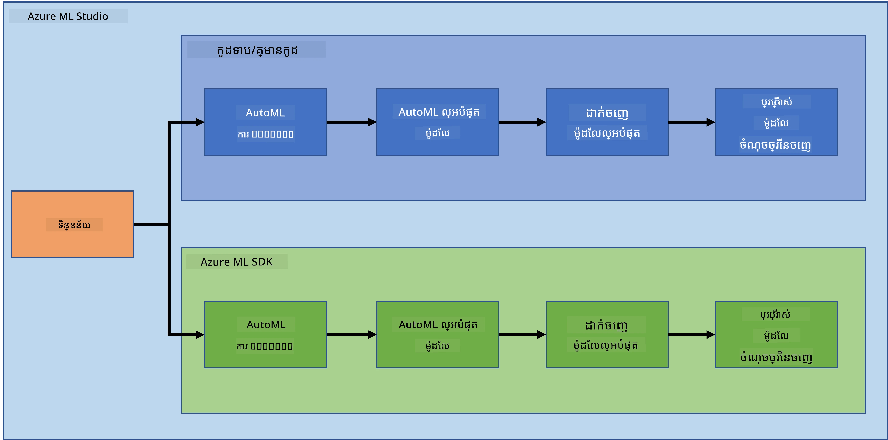

# វិទ្យាសាស្ត្រទិន្នន័យនៅលើពពក

> រូបថតដោយ [Jelleke Vanooteghem](https://unsplash.com/@ilumire) មកពី [Unsplash](https://unsplash.com/s/photos/cloud?orientation=landscape)

នៅពេលនិយាយពីការធ្វើវិទ្យាសាស្ត្រទិន្នន័យជាមួយទិន្នន័យធំ ពពកអាចជាឧបករណ៍ផ្លាស់ប្តូរហ្គេមមួយ។ ក្នុងមេរៀនបីខាងមុខនេះ យើងនឹងមើលថាពពកគឺជាអ្វីហើយហេតុអ្វីបានជាវាអាចមានប្រយោជន៍ខ្លាំង។ យើងក៏នឹងស្វែងយល់អំពីសំណុំទិន្នន័យជួររលាយបេះដូង និងបង្កើតម៉ូដែលមួយដើម្បីជួយឱ្យវាយតម្លៃឱ្យដឹងពីសក្តានុពលនៃមនុស្សម្នាក់មានជួររលាយបេះដូង។ យើងនឹងប្រើថាមពលពពកដើម្បីបណ្តុះបណ្តាល បញ្ចេញ និងប្រើម៉ូដែលនៅក្នុងវិធីពីរផ្សេងគ្នា។ វិធីមួយប្រើតែចំណុចប្រទាក់អ្នកប្រើប្រាស់ក្នុងរបៀប Low code/No code, វិធីមួយផ្សេងទៀតប្រើ Azure Machine Learning Software Developer Kit (Azure ML SDK)។

### ប្រធានបទ

1. [ហេតុអ្វីបានជាប្រើពពកសម្រាប់វិទ្យាសាស្ត្រទិន្នន័យ?](17-Introduction/README.md)
2. [វិទ្យាសាស្ត្រទិន្នន័យនៅលើពពក៖ របៀប "Low code/No code"](18-Low-Code/README.md)
3. [វិទ្យាសាស្ត្រទិន្នន័យនៅលើពពក៖ របៀប "Azure ML SDK"](19-Azure/README.md)

### ការសរសើរ
មេរៀនទាំងនេះត្រូវបានសរសេរជាមួយ ☁️ និង 💕 ដោយ [Maud Levy](https://twitter.com/maudstweets) និង [Tiffany Souterre](https://twitter.com/TiffanySouterre)

ទិន្នន័យសម្រាប់គម្រោងការព្យាករណ៍ជួររលាយបេះដូងបានយកមកពី [
Larxel](https://www.kaggle.com/andrewmvd) នៅលើ [Kaggle](https://www.kaggle.com/andrewmvd/heart-failure-clinical-data)។ វាត្រូវ​បាន​លក្ខខណ្ឌ​តាម [Attribution 4.0 International (CC BY 4.0)](https://creativecommons.org/licenses/by/4.0/)។

---

<!-- CO-OP TRANSLATOR DISCLAIMER START -->
**ការរក្សាសិទ្ធិបដិសេធ**៖  
ឯកសារនេះបានបកប្រែដោយប្រើសេវាកម្មបកប្រែ AI [Co-op Translator](https://github.com/Azure/co-op-translator)។ ខណៈពេលយើងខិតខំរកភាពត្រឹមត្រូវ សូមជ្រាបថាការបកប្រែប្រាកដដោយស្វ័យប្រវត្តិអាចមានកំហុស ឬភាពមិនត្រឹមត្រូវ។ ឯកសារដើមក្នុងភាសាដើមគួរត្រូវបានគិតថាជាភាពសុពលភាពចម្បង។ សម្រាប់ព័ត៌មានសំខាន់ៗ សូមផ្តល់អនុសាសន៍ឱ្យប្រើការបកប្រែដោយមនុស្សជំនាញវិជ្ជាជីវៈ។ យើងមិនទទួលខុសត្រូវចំពោះការយល់ច្រឡំ ឬការបកស្រាយខុសចេញពីការប្រើប្រាស់ការបកប្រែនេះឡើយ។
<!-- CO-OP TRANSLATOR DISCLAIMER END -->