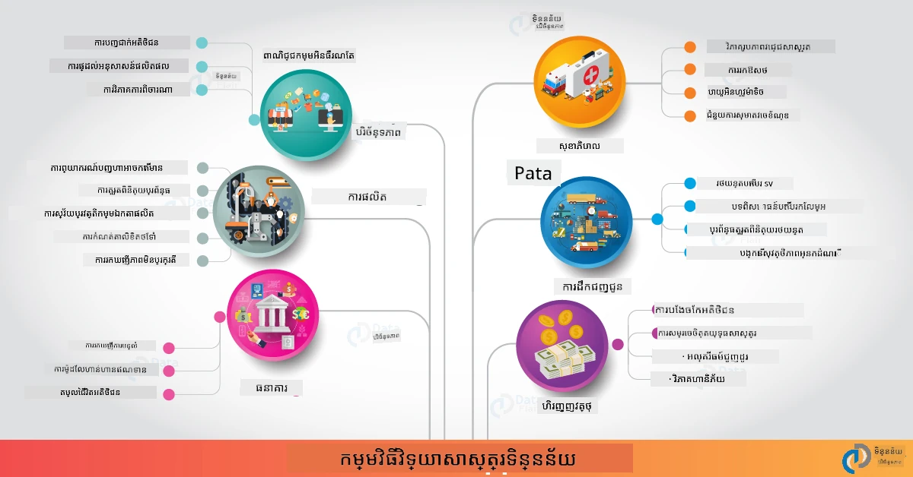

# វិទ្យាសាស្ត្រទិន្នន័យនៅក្នុងពិភពពិត

|  ](../../sketchnotes/20-DataScience-RealWorld.png) |
| :--------------------------------------------------------------------------------------------------------------: |
|               វិទ្យាសាស្ត្រទិន្នន័យនៅក្នុងពិភពពិត - _Sketchnote by [@nitya](https://twitter.com/nitya)_               |

យើងស្ទើរតែមកដល់ចុងផ្លូវរៀននេះហើយ!

យើងបានចាប់ផ្តើមជាមួយនិយមន័យនៃវិទ្យាសាស្ត្រទិន្នន័យ និងសីលធម៌ ស្វែងយល់អំពីឧបករណ៍ និងបច្ចេកវិទ្យារបស់ការវិភាគទិន្នន័យ និងការបង្ហាញទិន្នន័យ ត្រួតពិនិត្យជីវចលនៃវិទ្យាសាស្ត្រទិន្នន័យ និងមើលពីការកំណត់ទំហំ និងធ្វើឱ្យដំណើរការវិទ្យាសាស្ត្រទិន្នន័យដោយស្វ័យប្រវត្តិជាមួយសេវាកម្មកម្តៅពពក។ ដូច្នេះ អ្នកប្រហែលជាកំពុងមានសំណួរ៖ _"តើតាមរយៈរបៀបណាខ្ញុំអាចផែនទីការសិក្សាទាំងនេះទៅឱ្យបរិបទក្នុងពិភពពិត?"_

នៅក្នុងមេរៀននេះ យើងនឹងស្វែងយល់អំពីកម្មវិធីក្នុងពិភពពិតនៃវិទ្យាសាស្ត្រទិន្នន័យនៅឧស្សាហកម្មផ្សេងៗ ហើយចូលទៅកាន់ឧទាហរណ៍ជាក់លាក់នៅក្នុងការស្រាវជ្រាវ មនុស្សវិទ្យាឌីជីថល និងបរិស្ថាននិយម។ យើងនឹងមើលឱកាសគំរោងសិស្ស និងបញ្ចប់ជាមួយធនធានមានប្រយោជន៍ដើម្បីជួយអ្នកបន្តដំណើររៀនរបស់អ្នក!
## ការប្រលងមុនមេរៀន

## [ការប្រលងមុនមេរៀន](https://ff-quizzes.netlify.app/en/ds/quiz/38)

## វិទ្យាសាស្ត្រទិន្នន័យ + ឧស្សាហកម្ម

អរគុណសម្រាប់ការចូលរួមទាំងមូលនៃ AI ឥឡូវនេះអ្នកអភិវឌ្ឍអាចរកឃើញរបៀបងាយស្រួលក្នុងការរចនា និងបញ្ចូលការសម្រេចចិត្តដោយ AI និងការបង្ហាញចំណេះដឹងផ្អែកលើទិន្នន័យទៅក្នុងបទពិសោធន៍អ្នកប្រើ និងដំណើរការអភិវឌ្ឍ។ មានឧទាហរណ៍មួយចំនួននៃរបៀបដែលវិទ្យាសាស្ត្រទិន្នន័យត្រូវបាន "អនុវត្ត" ចូលទៅក្នុងកម្មវិធីពិភពពិតនៅឧស្សាហកម្ម៖

 * [Google Flu Trends](https://www.wired.com/2015/10/can-learn-epic-failure-google-flu-trends/) បានប្រើវិទ្យាសាស្ត្រទិន្នន័យដើម្បីភ្ជាប់ពាក្យស្វែងរកជាមួយនឹងបំណែករាគាខ្លាំង។ ទោះបីជាវិធីសាស្ត្រនេះមានកំហុស ក៏វាបានបង្កើនការយល់ដឹងអំពីអ្វីដែលអាចធ្វើបាន (និងការប្រឈមមុខ) នៃការទាយទំនងសុខាភិបាលផ្អែកលើទិន្នន័យ។

 * [ការទាយសំរាប់ផ្លូវ UPS](https://www.technologyreview.com/2018/11/21/139000/how-ups-uses-ai-to-outsmart-bad-weather/) - ពន្យល់ពីរបៀបដែល UPS ប្រើវិទ្យាសាស្ត្រទិន្នន័យ និងម៉ាស៊ីនរៀនដើម្បីទាយផ្លូវដែលល្អបំផុតសម្រាប់ការដឹកជញ្ជូន ដោយគិតគូរពីអាកាសធាតុ ស្ថានភាពចរាចរណ៍ កាលបរិច្ឆេទដឹកជញ្ជូន និងច្រើនទៀត។

 * [ការបង្ហាញផ្លូវ Taxicab ទីក្រុង NYC](http://chriswhong.github.io/nyctaxi/) - ទិន្នន័យបានប្រមូលដោយប្រើ [ច្បាប់សិទ្ធិនៃព័ត៌មាន](https://chriswhong.com/open-data/foil_nyc_taxi/) បានជួយបង្ហាញថ្ងៃមួយរបស់រថយន្តសេរី NYC ជួយឲ្យយើងយល់ពីរបៀបដែលពួកគេបើកបររដ្ឋធានាថាជិតនឹងទីក្រុងរំខាន ការរកស៊ី និងរយៈពេលធ្វើដំណើរពីរោហារពន្លឺមួយទៅមួយក្នុងរយៈពេល 24 ម៉ោង។

 * [Uber Data Science Workbench](https://eng.uber.com/dsw/) - ប្រើទិន្នន័យ (ស្ថានទីយក និងទម្លាក់ កំឡុងដំណើរ ផ្លូវដែលស្រឡាញ់ជាដើម) ដែលបានប្រមូលពីការដើររាប់លានជាស្រើបរាយរបស់ uber *ប្រចាំថ្ងៃ* ដើម្បីបង្កើតឧបករណ៍វិភាគទិន្នន័យ ជួយក្នុងការកំណត់តម្លៃ សុវត្ថិភាព ការស្វែងរកការពក់ និងសម្រេចចិត្តផ្លូវ។

 * [វិភាគកីឡា](https://towardsdatascience.com/scope-of-analytics-in-sports-world-37ed09c39860) - ផ្ដោតលើ _វិភាគទាយទំនង_ (វិភាគក្រុម និងអ្នកលេង - គិតអំពី [Moneyball](https://datasciencedegree.wisconsin.edu/blog/moneyball-proves-importance-big-data-big-ideas/) - និងការគ្រប់គ្រងអ្នកគាំទ្រ) និង _ការបង្ហាញទិន្នន័យ_ (ផ្ទាំងបង្ហាញក្រុម និងអ្នកគាំទ្រ ការប្រកួតជាដើម) ជាមួយកម្មវិធីដូចជាការស្ទង់មតិទេពកោសល្យ ការភ្នាល់កីឡា និងការគ្រប់គ្រងសារពើភ័ណ្ឌ/កន្លែង។

 * [វិទ្យាសាស្ត្រទិន្នន័យនៅធនាគារ](https://data-flair.training/blogs/data-science-in-banking/) - បង្ហាញពីតម្លៃនៃវិទ្យាសាស្ត្រទិន្នន័យនៅឧស្សាហកម្មហិរញ្ញវត្ថុ ជាមួយកម្មវិធីចាប់ពីគំរូហានិភ័យ និងការស្វែងរកការពក់ ដល់ការចែកចាយអតិថិជន ការទាយទំនងពេលវេលាចាំបាច់ និងប្រព័ន្ធផ្តល់អនុសាសន៍។ វិភាគទាយទំនងក៏ជំរុញការវាស់វែងសំខាន់ៗដូចជា [ពិន្ទុលេខឥណទាន](https://dzone.com/articles/using-big-data-and-predictive-analytics-for-credit)។

 * [វិទ្យាសាស្ត្រទិន្នន័យនៅក្នុងសុខាភិបាល](https://data-flair.training/blogs/data-science-in-healthcare/) - បង្ហាញកម្មវិធីដូចជា រូបភាពវេជ្ជសាស្ត្រ (ឧ. MRI, X-Ray, CT-Scan), ជីវវិទ្យាសាស្ត្រ DNA ស៊េរី, ការអភិវឌ្ឍថ្នាំ (ការវាយតម្លៃហានិភ័យ, ការទាយសម្គាល់ភាពជោគជ័យ), វិភាគទាយទំនង (ការថែរក្សាអ្នកជំងឺ និងរបៀបផ្គត់ផ្គង់), ការតាមដាន និងការការពារ ជម្ងឺ។

 ការិយាល័យរូបភាព៖ [Data Flair៖ 6 កម្មវិធីវីទ្យាសាស្ត្រទិន្នន័យអស្ចារ្យ](https://data-flair.training/blogs/data-science-applications/)

រូបនេះបង្ហាញពីដែនកន្លែង និងឧទាហរណ៍ផ្សេងទៀតសម្រាប់អនុវត្តបច្ចេកទេសវិទ្យាសាស្ត្រទិន្នន័យ។ ចង់ស្វែងយល់ពីកម្មវិធីផ្សេងទៀតទេ? ពិនិត្យមើលផ្នែក [ការត្រួតពិនិត្យ និងសិក្សាឯកជន](../../../../6-Data-Science-In-Wild/20-Real-World-Examples) ខាងក្រោម។

## វិទ្យាសាស្ត្រទិន្នន័យ + ការស្រាវជ្រាវ

|  ](../../sketchnotes/20-DataScience-Research.png) |
| :---------------------------------------------------------------------------------------------------------------: |
|              វិទ្យាសាស្ត្រទិន្នន័យ & ការស្រាវជ្រាវ - _Sketchnote by [@nitya](https://twitter.com/nitya)_              |

ក្នុងពេលដែលកម្មវិធីក្នុងពិភពពិតពេញចិត្តលើករណីប្រើប្រាស់ឧស្សាហកម្មទំហំធំៗ ពាក្យសម្ងាត់នៃកម្មវិធី _ការស្រាវជ្រាវ_ និងគំរោងអាចមានប្រយោជន៍ពីចំណុចពីរបែបនេះ៖

* _ឱកាសច្នៃប្រឌិត_ - ស្វែងយល់ការ​បង្កើត​ខ្លីៗនៃគំនិតកម្រិតខ្ពស់ និងការប្រឡងប្រួលនៃបទពិសោធន៍អ្នកប្រើប្រាស់សម្រាប់កម្មវិធីជំនាន់ក្រោយ។
* _បញ្ហាការប្រើប្រាស់_ - សាកសួរពីហានិភ័យ ឬផលប៉ះពាល់មិនចង់បាននៃបច្ចេកវិទ្យាវិទ្យាសាស្ត្រទិន្នន័យនៅក្នុងបរិបទពិភពពិត។

សម្រាប់សិស្ស កម្មវិធីស្រាវជ្រាវទាំងនេះអាចផ្តល់ឱកាសរៀន និងសហការដែលអាចធ្វើឲ្យអ្នកយល់ដឹងពីប្រធានបទបានកាន់តែល្អ និងពង្រីកការយល់ដឹង និងការចូលរួមរបស់អ្នកជាមួយមនុស្ស ឬក្រុមដែលមានសក្ដានុពល ដែលកំពុងធ្វើការងារនៅក្នុងដែនកំណត់ដែលមានចំណាប់អារម្មណ៍។ តើគំរោងស្រាវជ្រាវមានរូបរាងយ៉ាងដូចម្តេច ហើយអាចមានឥទ្ធិពលយ៉ាងដូចម្តេច?

មកមើលឧទាហរណ៍មួយ - [ការសិក្សា MIT Gender Shades](http://gendershades.org/overview.html) ពី Joy Buolamwini (MIT Media Labs) ជាមួយ [អត្ថបទស្រាវជ្រាវ](http://proceedings.mlr.press/v81/buolamwini18a/buolamwini18a.pdf) ដែលបានសរសេរជាម្ចាស់សិលាចម និង Timnit Gebru (នៅ Microsoft Research ពេលនោះ) ដែលផ្ដោតលើ

 * **អ្វី:** គោលបំណងនៃគំរោងស្រាវជ្រាវគឺ _វាយតម្លៃពីការជៀសវាងដែលមាននៅក្នុងអាល្គូរីតម facial analysis ដែលធ្វើការ​ហៅបែបស្វ័យប្រវត្តិ និងឯកសារទិន្នន័យ_ ដោយផ្អែកលើភេទ និងប្រភេទស្បែក។
 * **ហេតុអ្វី:** វិភាគផ្ទៃមុខត្រូវបានប្រើនៅក្នុងដែនដូចជា អាជ្ញាធរវិស័យច្បាប់, សន្តិសុខព្រលានយន្តហោះ, ប្រព័ន្ធជួលបុគ្គលិក និងផ្សេងៗទៀត - បរិបទដែលការបែងចែកខុស (ដូចជាការជួនប្រយោលដោយសារជៀសវាង) អាចបង្កឲ្យមានហានិភ័យសេដ្ឋកិច្ច និងសង្គមសម្រាប់បុគ្គល ឬក្រុមដែលទាក់ទង។ ការយល់ដឹង (ហើយក៏ការលុបចោល ឬកាត់បន្ថយ) ជៀសវាងគឺជាចំណុចសំខាន់សម្រាប់ភាពស្មើរភាពនៃការប្រើប្រាស់។
 * **របៀប:** អ្នកស្រាវជ្រាវបានឃើញថាសេចក្តីរាយការណ៍ដែលមានស្រាប់ប្រើជាមនុស្សដែលមានស្បែកសស្រស់ជាប់ផ្សេងៗជាច្រើន ហើយបានរើសស្រង់ឯកសារទិន្នន័យថ្មី (រូបភាពជាង 1000) ដែល _មានតុល្យភាព_ តាមភេទ និងប្រភេទស្បែក។ ឯកសារទិន្នន័យនេះបានប្រើសម្រាប់វាយតម្លៃភាពត្រឹមត្រូវនៃផលិតផលចំណាត់ថ្នាក់ភេទបី (ពី Microsoft, IBM និង Face++)។

លទ្ធផលបង្ហាញថា ទោះបីជាការបែងចែកទាំងមូលមានភាពត្រឹមត្រូវល្អ ក៏មានភាពខុសប្លែកក្នុងអត្រាកំហុសរវាងគណៈមនុស្សយ៉ាងតិចមួយ - ជាមួយ **ការជំពាក់ភេទខុស** មានកម្ពស់សម្រាប់ស្ត្រី ឬមនុស្សដែលមានស្បែកងងឹតកាន់តែលែងបង្ហាញពីភាពជៀសវាង។

**លទ្ធផលសំខាន់៖** បានបង្កើនការយល់ដឹងថាវិទ្យាសាស្ត្រទិន្នន័យត្រូវការឯកសារទិន្នន័យដែល _តំណាងសមរម្យ_ (ក្រុមតូចមានតុល្យភាព) និងក្រុមការងារ _រួមបញ្ចូល_ (ប្រវត្តិមុខទាំងអស់) ដើម្បីទទួលស្គាល់ និងលុបចោល ឬកាត់បន្ថយជៀសវាងនេះនៅដើម។ កិច្ចប្រឹងប្រែងស្រាវជ្រាវដូចនេះក៏មានសារៈសំខាន់ក្នុងស្ថាប័នជាច្រើនក្នុងការកំណត់គោលការណ៍ និងអនុប្រតិបត្តិការសម្រាប់ _AI មានទំនួលខុសត្រូវ_ ដើម្បីធ្វើឲ្យមានភាពស្មើរភាពលើផលិតផល និងដំណើរការវិទ្យាសាស្ត្រ AI របស់ពួកគេ។

**ចង់រៀនអំពីកិច្ចខិតខំស្រាវជ្រាវពាក់ព័ន្ធនៅ Microsoft ទេ?**

* ពិនិត្យមើល [គំរោងស្រាវជ្រាវ Microsoft](https://www.microsoft.com/research/research-area/artificial-intelligence/?facet%5Btax%5D%5Bmsr-research-area%5D%5B%5D=13556&facet%5Btax%5D%5Bmsr-content-type%5D%5B%5D=msr-project) នៅលើបញ្ហា បញ្ញាសិប្បនិម្មិត។
* ស្វែងយល់គំរោងសិស្សពី [Microsoft Research Data Science Summer School](https://www.microsoft.com/en-us/research/academic-program/data-science-summer-school/)។
* ពិនិត្យមើលគំរោង [Fairlearn](https://fairlearn.org/) និងការចាប់ផ្តើម _Responsible AI_ ([AI មានទំនួលខុសត្រូវ](https://www.microsoft.com/en-us/ai/responsible-ai?activetab=pivot1%3aprimaryr6))។

## វិទ្យាសាស្ត្រទិន្នន័យ + មនុស្សវិទ្យាឌីជីថល

|  ](../../sketchnotes/20-DataScience-Humanities.png) |
| :---------------------------------------------------------------------------------------------------------------: |
|              វិទ្យាសាស្ត្រទិន្នន័យ & មនុស្សវិទ្យាឌីជីថល - _Sketchnote by [@nitya](https://twitter.com/nitya)_              |

មនុស្សវិទ្យាឌីជីថល [ត្រូវបានកំណត់](https://digitalhumanities.stanford.edu/about-dh-stanford) ជា "ការប្រមូលផ្តុំរបស់អំពើនិងវិធីសាស្ត្រដែលផ្សំឡើងពីវិធីសាស្ត្រជាមួយសំណួរជាក់លាក់នៃមនុស្សវិទ្យា"។ គំរោង [Stanford](https://digitalhumanities.stanford.edu/projects) ដូចជា _"បើកប្រវត្តិសាស្ត្រ"_ និង _"ចិត្តវិជ្ជាពាណិជ្ជ"_ បង្ហាញពីការតភ្ជាប់រវាង [មនុស្សវិទ្យាឌីជីថល និងវិទ្យាសាស្ត្រទិន្នន័យ](https://digitalhumanities.stanford.edu/digital-humanities-and-data-science) - ផ្តោតលើបច្ចេកវិទ្យាដូចជា វិភាគបណ្តាញ, ការបង្ហាញព័ត៌មាន, វិភាគតំបន់ និងអត្ថបទ ដែលអាចជួយយើងវិលត្រឡប់ទៅឯកសារបុរាណ និងសរុបដោយវិភាគដើម្បីទទួលបានការយល់ដឹងថ្មី និងទស្សនៈថ្មី។

*ចង់ស្វែងយល់ និងពង្រីកគំរោងនៅលើកន្លែងនេះទេ?*

ពិនិត្យមើល ["Emily Dickinson and the Meter of Mood"](https://gist.github.com/jlooper/ce4d102efd057137bc000db796bfd671) - ជាឧទាហរណ៍ដ៏ល្អពី [Jen Looper](https://twitter.com/jenlooper) ដែលសួរថាតើយើងអាចប្រើវិទ្យាសាស្ត្រទិន្នន័យដើម្បីវិលត្រឡប់កវីភាសាដែលស្គាល់ហើយវាយតម្លៃម្តេចដោយជម្រុងន័យ និងអ្នកនិពន្ធនៅតំបន់ថ្មីៗ។ ឧទាហរណ៍ _តើយើងអាចទាយទំនងរដូវកាលដែលកវីត្រូវបាននិពន្ធដោយវិភាគអារម្មណ៍កំណត់សំឡេង ឬអារម្មណ៍_ - ហើយវា​និយាយអំពីអារម្មណ៍អ្នកនិពន្ធ​នៅក្នុងរយៈពេលខ្លះដូចម្តេច?

ដើម្បីឆ្លើយសំណួរនេះ យើងអនុវត្តជំហាននៃជីវចលវិទ្យាសាស្ត្រទិន្នន័យរបស់យើង៖
 * [`ទទួលទិន្នន័យ`](https://gist.github.com/jlooper/ce4d102efd057137bc000db796bfd671#acquiring-the-dataset) - ដើម្បីប្រមូលឯកសារទិន្នន័យដែលពាក់ព័ន្ធសម្រាប់វិភាគ។ ជម្រើសរួមមានការប្រើ API (ឧ. [Poetry DB API](https://poetrydb.org/index.html)) ឬការច្របាច់គេហទំព័រ (ឧ. [Project Gutenberg](https://www.gutenberg.org/files/12242/12242-h/12242-h.htm)) ដោយប្រើឧបករណ៍ដូចជា [Scrapy](https://scrapy.org/)។
 * [`សម្អាតទិន្នន័យ`](https://gist.github.com/jlooper/ce4d102efd057137bc000db796bfd671#clean-the-data) - ពន្យល់ពីរបៀបដែលអត្ថបទអាចត្រូវបានទម្លាប់ សម្អាត និងសម្រួលដោយប្រើឧបករណ៍មូលដ្ឋានដូចជា Visual Studio Code និង Microsoft Excel។
 * [`វិភាគទិន្នន័យ`](https://gist.github.com/jlooper/ce4d102efd057137bc000db796bfd671#working-with-the-data-in-a-notebook) - ពន្យល់ពីរបៀបដែលយើងអាចនាំចូលឯកសារទិន្នន័យទៅក្នុង "កំណត់ត្រា" ដើម្បីវិភាគដោយប្រើកញ្ចប់ Python (ដូចជា pandas, numpy និង matplotlib) សម្រាប់រៀបចំ និងបង្ហាញទិន្នន័យ។
 * [`វិភាគអារម្មណ៍`](https://gist.github.com/jlooper/ce4d102efd057137bc000db796bfd671#sentiment-analysis-using-cognitive-services) - ពន្យល់ពីរបៀបដែលយើងអាចបញ្ចូលសេវាកម្មពពកដូចជា Text Analytics ដោយប្រើឧបករណ៍កម្រិតទាបដូចជា [Power Automate](https://flow.microsoft.com/en-us/) សម្រាប់ដំណើរការទិន្នន័យស្វ័យប្រវត្តិ។

ដោយប្រើដំណើរការនេះ យើងអាចស្វែងយល់ពីឥទ្ធិពលរដូវលើអារម្មណ៍នៃកវី និងជួយយើងបង្កើតទស្សនៈផ្ទាល់ខ្លួនលើអ្នកនិពន្ធ។ សាកល្បងផ្ទាល់របស់អ្នក - បន្ទាប់មកបន្តបង្កើតកំណត់ត្រា ដើម្បីសួរសំណួរផ្សេងៗ ឬបង្ហាញទិន្នន័យដោយរបៀបថ្មីៗ!

> អ្នកអាចប្រើឧបករណ៍ខ្លះៗនៅក្នុង [ឧបករណ៍មនុស្សវិទ្យាឌីជីថល](https://github.com/Digital-Humanities-Toolkit) ដើម្បីធ្វើការស្រាវជ្រាវតាមផ្លូវទាំងនេះ

## វិទ្យាសាស្ត្រទិន្នន័យ + បរិស្ថាននិយម

|  ](../../sketchnotes/20-DataScience-Sustainability.png) |
| :---------------------------------------------------------------------------------------------------------------: |
|              វិទ្យាសាស្ត្រទិន្នន័យ & បរិស្ថាននិយម - _Sketchnote by [@nitya](https://twitter.com/nitya)_              |

[យុទ្ធសាស្ត្រ 2030 សម្រាប់ការអភិវឌ្ឍន៍ដั่งគ្រា](https://sdgs.un.org/2030agenda) - ដែលត្រូវបានសមាជិកសមាគមជាតិសហគមន៍អង្គការសហប្រជាជាតិទាំងអស់ទទួលយកក្នុងឆ្នាំ 2015 - កំណត់គោលដៅ 17 រួមមានគោលដៅដែលផ្ដោតលើ **ការការពារផែនដី** ពីការបំផ្លាញ និងផលប៉ះពាល់នៃការប្រែប្រួលអាកាសធាតុ។ យូនីត Microsoft Sustainability [បានគាំទ្រគោលដៅទាំងនេះ](https://www.microsoft.com/en-us/sustainability) ដោយស្វែងរកវិធីដែលដំណោះស្រាយបច្ចេកវិទ្យាអាចជួយគាំទ្រនិងបង្កើតអនាគតដែលមានការរីកចម្រើនជាងមុនអោយកាន់តែធន់ដុម ជាមួយ [ផ្ដោតលើគោលដៅ 4](https://dev.to/azure/a-visual-guide-to-sustainable-software-engineering-53hh) - ធ្វើអោយមានកាបូនអវិជ្ជមាន ជាតិទឹកវិជ្ជមាន គ្មានសំរាម និងសកម្មភាពជីវចម្រុះ ដល់ឆ្នាំ 2030។

ការដោះស្រាយបញ្ហាទាំងនេះយ៉ាងទូលំទូលាយ និងទាន់ពេលវេលា តម្រូវឲ្យមានគំនិតវិសាលនិងទិន្នន័យទំហំធំនៅពពក។ យុទ្ធនាការ [Planetary Computer](https://planetarycomputer.microsoft.com/) ផ្តល់ជូនវត្ថុបត្រ 4 ដើម្បីជួយអ្នកវិទ្យាសាស្ត្រទិន្នន័យ និងអ្នកអភិវឌ្ឍន៍ក្នុងការប្រយុទ្ធនេះ៖

 * [កាតាឡុកទិន្នន័យ](https://planetarycomputer.microsoft.com/catalog) - មានទិន្នន័យប្រព័ន្ធផែនដីជាពិតច្រើនតែប៉ុណ្ណោះ (ឥតគិតថ្លៃ និងបង្ហោះនៅលើ Azure)។
 * [Planetary API](https://planetarycomputer.microsoft.com/docs/reference/stac/) - ជួយអ្នកប្រើស្វែងរកទិន្នន័យដែលពាក់ព័ន្ធជាប់លាប់ក្នុងលំហ និងពេលវេលា។
 * [Hub](https://planetarycomputer.microsoft.com/docs/overview/environment/) - បរិវេណគ្រប់គ្រងសម្រាប់អ្នកវិទ្យាសាស្ត្រដើម្បីដំណើរការទិន្នន័យភូមិសាស្ត្រទំហំធំ។
 * [កម្មវិធី](https://planetarycomputer.microsoft.com/applications) - សម្ដែងករណីប្រើប្រាស់ និងឧបករណ៍សម្រាប់ការយល់ដឹងយោងទៅកាន់បរិស្ថាននិយម។
**គម្រោងកុំព្យូទ័រផែនដីកំពុងនៅក្នុងដំណាក់កាលមើលជាមុន (ចាប់តាំងពីខែសីហា ២០២១)** - នេះគឺជាវិធីដែលអ្នកអាចចាប់ផ្តើមរួមចំណែកក្នុងដំណោះស្រាយចំណុចប្រទាក់នឹងនិរន្តរភាពដោយប្រើវិទ្យាសាស្ត្រទិន្នន័យ។

* [ស្នើរសុំការចូលប្រើ](https://planetarycomputer.microsoft.com/account/request) ដើម្បីចាប់ផ្តើមស្វែងយល់និងភ្ជាប់ជាមួយមិត្តរួមការងារ។
* [ស្វែងយល់ឯកសារ](https://planetarycomputer.microsoft.com/docs/overview/about) ដើម្បីយល់ពីឈុតទិន្នន័យ និង API ដែលគាំទ្រ។
* ស្វែងយល់ពាក់ព័ន្ធកម្មវិធីដូចជា [Ecosystem Monitoring](https://analytics-lab.org/ecosystemmonitoring/) សម្រាប់ចំណាប់អារម្មណ៍លើគំនិតកម្មវិធី។

គិតអំពីវិធីដែលអ្នកអាចប្រើការបង្ហាញទិន្នន័យ ដើម្បីបង្ហាញឬបង្កើតការយល់ដឹងពាក់ព័ន្ធក្នុងដែនដូចជាការប្រែប្រួលអាកាសធាតុនិងការកាត់បន្ថយព្រៃឈើ។ ឬគិតពីវិធីដែលការយល់ដឹងអាចត្រូវបានប្រើដើម្បីបង្កើតបទពិសោធន៍អ្នកប្រើថ្មីៗ ដែលជំរុញការផ្លាស់ប្ដូរប្រព្រឹត្តិការណ៍សម្រាប់ការរស់នៅយ៉ាងមានស្ថិរភាព។

## វិទ្យាសាស្ត្រទិន្នន័យ + សិស្ស

យើងបាននិយាយអំពីកម្មវិធីពិតប្រាកដនៅក្នុងឧស្សាហកម្ម និងការស្រាវជ្រាវ ហើយបានស្វែងយល់ពីឧទាហរណ៍កម្មវិធីវិទ្យាសាស្ត្រទិន្នន័យក្នុងមនុស្សវិទ្យឌីជីថល និងនិរន្តរភាព។ តើយ៉ាងដូចម្តេចដែលអ្នកអាចកសាងជំនាញ និងចែករំលែកជំនាញជាអ្នកចាប់ផ្តើមវិទ្យាសាស្ត្រទិន្នន័យ?

នេះគឺជាឧទាហរណ៍គម្រោងសិស្សវិទ្យាសាស្ត្រទិន្នន័យសម្រាប់ជំរុញអ្នក។

 * [កម្មវិធីប្រឡងរដូវក្តៅវិទ្យាសាស្ត្រទិន្នន័យ MSR](https://www.microsoft.com/en-us/research/academic-program/data-science-summer-school/#!projects) ជាមួយ GitHub [គម្រោង](https://github.com/msr-ds3) ស្វែងយល់ប្រធានបទដូចជា:
    - [ការវាយឆេះពូជសាសន៍ក្នុងការប្រើអំណាចប៉ូលីស](https://www.microsoft.com/en-us/research/video/data-science-summer-school-2019-replicating-an-empirical-analysis-of-racial-differences-in-police-use-of-force/) | [Github](https://github.com/msr-ds3/stop-question-frisk)
    - [ភាពទុកចិត្តនៃប្រព័ន្ធរថភ្លើងក្រោមដី NYC](https://www.microsoft.com/en-us/research/video/data-science-summer-school-2018-exploring-the-reliability-of-the-nyc-subway-system/) | [Github](https://github.com/msr-ds3/nyctransit)
 * [ការឌីជីថលវប្បធម៌សម្ភារៈ៖ ស្វែងយល់ពីការចែកចាយសង្គម-សេដ្ឋកិច្ចនៅ Sirkap](https://claremont.maps.arcgis.com/apps/Cascade/index.html?appid=bdf2aef0f45a4674ba41cd373fa23afc) - ពី [Ornella Altunyan](https://twitter.com/ornelladotcom) និងក្រុមនៅ Claremont, ប្រើ [ArcGIS StoryMaps](https://storymaps.arcgis.com/)។

## 🚀 도전

ស្វែងរកអត្ថបទដែលផ្តល់អនុសាសន៍គម្រោងវិទ្យាសាស្ត្រទិន្នន័យដែលសមស្របសម្រាប់អ្នកថ្មី - ដូចជា [៥០ ប្រធានបទទាំងនេះ](https://www.upgrad.com/blog/data-science-project-ideas-topics-beginners/) ឬ [២១ គំនិតគម្រោងទាំងនេះ](https://www.intellspot.com/data-science-project-ideas) ឬ [១៦ គម្រោងនេះជាមួយកូដប្រភព](https://data-flair.training/blogs/data-science-project-ideas/) ដែលអ្នកអាចបំបែក និងសរសេរឡើងវិញបាន។ ហើយកុំភ្លេចប្លុកអំពីដំណើររៀនរបស់អ្នក និងចែករំលែកការយល់ដឹងជាមួយយើងទាំងអស់គ្នា។
## សំណួរបន្ទាប់ពីមេរៀន

## [សំណួរបន្ទាប់ពីមេរៀន](https://ff-quizzes.netlify.app/en/ds/quiz/39)

## ការត្រួតពិនិត្យ & សិក្សាផ្ទាល់ខ្លួន

ចង់ស្វែងយល់បន្ថែមពីករណីប្រើប្រាស់ទេ? នេះគឺជាអត្ថបទពាក់ព័ន្ធមួយចំនួន៖
 * [១៧ កម្មវិធី និងឧទាហរណ៍វិទ្យាសាស្ត្រទិន្នន័យ](https://builtin.com/data-science/data-science-applications-examples) - កក្កដា ២០២១
 * [១១ កម្មវិធីវិទ្យាសាស្ត្រទិន្នន័យដ៏អស្ចារ្យក្នុងពិភពពិត](https://myblindbird.com/data-science-applications-real-world/) - ឧសភា ២០២១
 * [វិទ្យាសាស្ត្រទិន្នន័យនៅក្នុងពិភពពិត](https://towardsdatascience.com/data-science-in-the-real-world/home) - ការប្រមួលអត្ថបទ
 * [១២ កម្មវិធីវិទ្យាសាស្ត្រទិន្នន័យពិភពពិតជាមួយឧទាហរណ៍](https://www.scaler.com/blog/data-science-applications/) - ឧទាហរណ៍ ២០២៤
 * វិទ្យាសាស្ត្រទិន្នន័យ ក្នុង៖ [ការអប់រំ](https://data-flair.training/blogs/data-science-in-education/), [កសិកម្ម](https://data-flair.training/blogs/data-science-in-agriculture/), [ហិរញ្ញវត្ថុ](https://data-flair.training/blogs/data-science-in-finance/), [ភាពយន្ត](https://data-flair.training/blogs/data-science-at-movies/), [សុខាភិបាល](https://onlinedegrees.sandiego.edu/data-science-health-care/) & ផ្សេងៗទៀត។
## បេសកកម្ម

[ស្វែងយល់ឈុតទិន្នន័យកុំព្យូទ័រផែនដី](assignment.md)

---

<!-- CO-OP TRANSLATOR DISCLAIMER START -->
**ការបដិសេធ**៖  
ឯកសារនេះត្រូវបានបកប្រែដោយប្រើសេវាកម្មបកប្រែ AI [Co-op Translator](https://github.com/Azure/co-op-translator)។ ខណៈពេលដែលយើងខំប្រឹងរកភាពត្រឹមត្រូវ សូមយល់ឲ្យដឹងថាការបកប្រែដោយស្វ័យប្រវត្តិអាចមានកំហុសឬភាពមិនត្រឹមត្រូវបាន។ ឯកសារដើមនៅភាសាទ្រព្យសម្បត្តិគួរត្រូវបានចាត់ទុកជាតំបន់តែមួយដែលគួរជឿជាក់។ សម្រាប់ព័ត៌មានសំខាន់ៗ សូមណែនាំឲ្យប្រើការបកប្រែដោយមនុស្សដែលមានជំនាញវិជ្ជាជីវៈ។ យើងមិនទទួលខុសត្រូវចំពោះការយល់ច្រឡំ ឬការបកស្រាយខុសផ្សេងៗណាមួយដែលកើតមានពីការប្រើប្រាស់ការបកប្រែនេះទេ។
<!-- CO-OP TRANSLATOR DISCLAIMER END -->