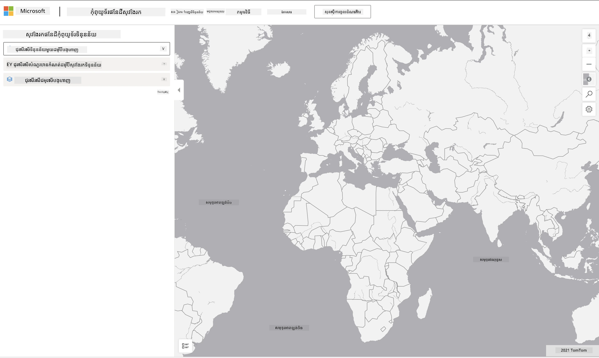

# ស្វែងយល់អំពីធនធានទិន្នន័យកុំព្យូទ័រផែនដី

## សេចក្តីណែនាំ

ក្នុងមេរៀននេះ យើងបានពិភាក្សាអំពីដែនកម្មវិធីវិទ្យាសាស្ត្រទិន្នន័យជាច្រើន - ជាមួយការចូលចិត្ដជ្រាលជ្រៅទៅលើគំរូៗដែលទាក់ទងនឹងការស្រាវជ្រាវ ការរស់នៅប្រកបដោយចីរភាព និងមនុស្សវិទ្យាឌីជីថល។ នៅក្នុងភារកិច្ចនេះ អ្នកនឹងធ្វើការស្វែងយល់អំពីមួយក្នុងចំណោមគំរូទាំងនេះយ៉ាងលម្អិត និងអនុវត្តន៍ការសិក្សាជុំវិញការបង្ហាញទិន្នន័យ និងវិភាគ ដើម្បីទាញយកចំណេះដឹងអំពីទិន្នន័យចីរភាព។

គម្រោង [Planetary Computer](https://planetarycomputer.microsoft.com/) មានទិន្នន័យ និង API ដែលអាចចូលដំណើរការបានជាមួយគណនី - សូមស្នើសុំគណនីសម្រាប់ចូលប្រើប្រសិនបើអ្នកចង់សាកល្បងជំហានបុណ្យបន្ថែមក្នុងភារកិច្ចនេះ។ គេហទំព័រនេះក៏ផ្តល់ជូននូវមុខងារ [Explorer](https://planetarycomputer.microsoft.com/explore) ដែលអ្នកអាចប្រើបានដោយគ្មានការបង្កើតគណនី៕

`ជំហានៈ`
ចំណុចចុះបញ្ជី Explorer (បង្ហាញក្នុងរូបថតអេក្រង់ខាងក្រោម) អនុញ្ញាតឲ្យអ្នកជ្រើសរើសធនធានទិន្នន័យមួយ (ពីជម្រើសដែលបានផ្តល់) ជម្រើសសំណួរត្រៀមទុក (ដើម្បីតម្រៀបទិន្នន័យ) និងជម្រើសបង្ហាញ (សម្រាប់បង្កើតការបង្ហាញទិន្នន័យដែលពាក់ព័ន្ធ)។ ក្នុងភារកិច្ចនេះ ដំណើរការរបស់អ្នកគឺដូចតទៅ៖

 1. អានឯកសារពី [Explorer documentation](https://planetarycomputer.microsoft.com/docs/overview/explorer/) - យល់ដឹងអំពីជម្រើស។
 2. ស្វែងយល់អំពី [Catalog](https://planetarycomputer.microsoft.com/catalog) នៃធនធានទិន្នន័យ - រៀនពីគោលបំណងនៃនីមួយៗ។
 3. ប្រើ Explorer - ជ្រើសរើសធនធានទិន្នន័យដែលអ្នកចាប់អារម្មណ៍ ជ្រើសរើសសំណួរត្រូវតាម និងជម្រើសបង្ហាញដែលពាក់ព័ន្ធ។

`ភារកិច្ចរបស់អ្នក៖`
ឥឡូវនេះសិក្សាការបង្ហាញដែលបានបង្ហាញនៅក្នុងកម្មវិធីរកមើល និងឆ្លើយសំណួរបង្ហាញដូចខាងក្រោម៖
 * តើធនធានទិន្នន័យមាន _លក្ខណៈពិសេស_ អ្វីខ្លះ?
 * តើការបង្ហាញព័ត៌មានផ្តល់ _មតិយោបល់_ ឬលទ្ធផលអ្វីខ្លះ?
 * តើ _ផលប៉ះពាល់_ នៃមតិយោបល់ទាំងនោះដល់គោលបំណងចីរភាពនៃគម្រោងមានអ្វីខ្លះ?
 * តើកំណត់ខូច _នៃការបង្ហាញ_ មានអ្វីខ្លះ (ឧ. តើអ្នកមិនទទួលបានមតិយោបល់អ្វី)?
 * ប្រសិនបើអ្នកមានទិន្នន័យដើម តើអ្នកនឹងបង្កើតការបង្ហាញបរិច្ឆេទ _ជំនួស_ អ្វីខ្លះ ហើយហេតុអ្វី?

`ពិន្ទុបុណ្យ:`
ដាក់ពាក្យសុំគណនី - ហើយចុះបញ្ជីចូលពេលបានទទួល។
 * ប្រើជម្រើស _Launch Hub_ ដើម្បីបើកទិន្នន័យដើមក្នុងកំណត់ត្រា Notebook។
 * ស្វែងយល់ទិន្នន័យដោយធ្វើការបន្តអនឡាញ និងអនុវត្តការបង្ហាញបរិច្ឆេទជំនួសដែលអ្នកបានគិត។
 * ឥឡូវវិភាគការបង្ហាញទិន្នន័យផ្ទាល់ខ្លួនរបស់អ្នក - តើអ្នកអាចទាញយកចំណេះដឹងដែលមិនបានទទួលមុននេះទេ?

## Rubric

Exemplary | Adequate | Needs Improvement
--- | --- | -- |
បានឆ្លើយសំណួរជាចំនួនប្រាំនៃគោលសំនួរគ្រប់។ សិស្សបានកំណត់យ៉ាងច្បាស់ថាតើការបង្ហាញបច្ចុប្បន្ន និងការបង្ហាញជំនួសអាចផ្តល់ចំណេះដឹងអំពីគោលបំណងឬលទ្ធផលចីរភាព។ | សិស្សបានឆ្លើយយ៉ាងយ៉ាងហោចណាស់ ៣ សំណួរលើប្រាកដរហើត ដោយបង្ហាញពីបទពិសោធន៍ជាក់លាក់ជាមួយ Explorer។ | សិស្សមិនបានឆ្លើយសំណួរច្រើនទេ ឬផ្តល់ព័ត៌មានមិនគ្រប់គ្រាន់ - បង្ហាញថាមិនមានការព្យាយាមយ៉ាងមហិមា សម្រាប់គម្រោង។ |

---

<!-- CO-OP TRANSLATOR DISCLAIMER START -->
**ការបដិសេធបន្ថែម**៖  
ឯកសារនេះត្រូវបានបម្លែងភាសា​ដោយប្រើសេវាកម្មបកប្រែ AI [Co-op Translator](https://github.com/Azure/co-op-translator)។ ខណៈពេលយើងខិតខំរកភាពត្រឹមត្រូវ សូមយល់ព្រមថាការបកប្រែដោយស្វ័យប្រវត្តិអាចមានកំហុសឬការមិនត្រឹមត្រូវ។ ឯកសារដើមក្នុងភាសារបស់ខ្លួន គួរត្រូវបានគេចាត់ទុកថាជា ប្រភពដ្ឋានដែលមានសុពលភាព។ សម្រាប់ព័ត៌មានសំខាន់ៗ ការបកប្រែដោយអ្នកជំនាញមនុស្សគឺត្រូវបានណែនាំ។ យើងមិនទទួលខុសត្រូវចំពោះការយល់ច្រឡំ ឬការបកស្រាយខុសៗដែលកើតមានពីការប្រើប្រាស់ការបកប្រែនេះឡើយ។
<!-- CO-OP TRANSLATOR DISCLAIMER END -->