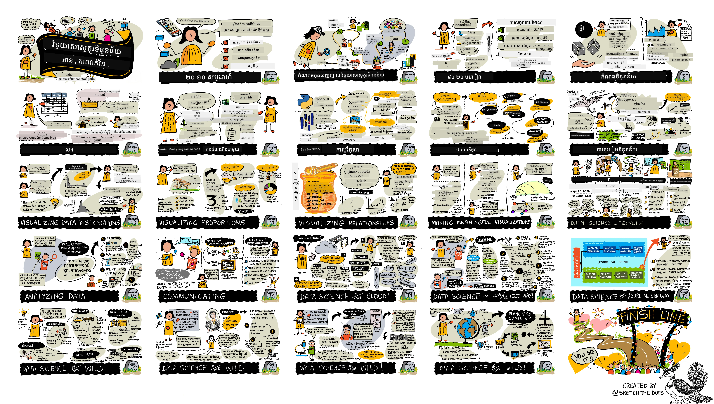

# វិទ្យាសាស្ត្រទិន្នន័យ​សម្រាប់អ្នកចាប់ផ្ដើម - មាតិកាកម្មវិធី​សិក្សា

[](https://github.com/codespaces/new?hide_repo_select=true&ref=main&repo=344191198)

[](https://github.com/microsoft/Data-Science-For-Beginners/blob/master/LICENSE)
[](https://GitHub.com/microsoft/Data-Science-For-Beginners/graphs/contributors/)
[](https://GitHub.com/microsoft/Data-Science-For-Beginners/issues/)
[](https://GitHub.com/microsoft/Data-Science-For-Beginners/pulls/)
[](http://makeapullrequest.com)

[](https://GitHub.com/microsoft/Data-Science-For-Beginners/watchers/)
[](https://GitHub.com/microsoft/Data-Science-For-Beginners/network/)
[](https://GitHub.com/microsoft/Data-Science-For-Beginners/stargazers/)


[](https://discord.gg/nTYy5BXMWG)

[](https://aka.ms/foundry/forum)

ក្រុម Azure Cloud Advocates នៅ Microsoft មានសេចក្តីរីករាយផ្តល់ជូនមាតិកាកម្មវិធីសិក្សា ១០ សប្តាហ៍ ២០ មេរៀន ដែលទាក់ទងទៅនឹងវិទ្យាសាស្ត្រទិន្នន័យ។ មេរៀននីមួយៗមានការប្រលងមុននិងក្រោយមេរៀន, សេចក្តីណែនាំសរសេរដើម្បីបញ្ចប់មេរៀន, ដំណោះស្រាយ និងការប្រលងភារកិច្ច។ វិធីសាស្ត្របង្ហាត់បង្ហាញដោយផ្អែកលើគម្រោងរបស់យើងអាចអនុញ្ញាតឱ្យអ្នករៀនក្នុងពេលកំពុងស្ថាបនារឿងមួយ ដែលជាវិធីដែលបានបញ្ជាក់ថាជួយអោយជំនាញថ្មីធន់ទ្រាំបានល្អ។

**សូមអរគុណយ៉ាងជ្រាលជ្រៅចំពោះអ្នកនិពន្ធរបស់យើង:** [Jasmine Greenaway](https://www.twitter.com/paladique), [Dmitry Soshnikov](http://soshnikov.com), [Nitya Narasimhan](https://twitter.com/nitya), [Jalen McGee](https://twitter.com/JalenMcG), [Jen Looper](https://twitter.com/jenlooper), [Maud Levy](https://twitter.com/maudstweets), [Tiffany Souterre](https://twitter.com/TiffanySouterre), [Christopher Harrison](https://www.twitter.com/geektrainer)។

**🙏 អរគុណពិសេស 🙏 ចំពោះអ្នកនិពន្ធ, អ្នកពិនិត្យ និងអ្នកចូលរួមក្នុងមាតិកា ជាសមាជិក [Microsoft Student Ambassador](https://studentambassadors.microsoft.com/),** ជាលក្ខណៈពិសេសរួមមាន Aaryan Arora, [Aditya Garg](https://github.com/AdityaGarg00), [Alondra Sanchez](https://www.linkedin.com/in/alondra-sanchez-molina/), [Ankita Singh](https://www.linkedin.com/in/ankitasingh007), [Anupam Mishra](https://www.linkedin.com/in/anupam--mishra/), [Arpita Das](https://www.linkedin.com/in/arpitadas01/), ChhailBihari Dubey, [Dibri Nsofor](https://www.linkedin.com/in/dibrinsofor), [Dishita Bhasin](https://www.linkedin.com/in/dishita-bhasin-7065281bb), [Majd Safi](https://www.linkedin.com/in/majd-s/), [Max Blum](https://www.linkedin.com/in/max-blum-6036a1186/), [Miguel Correa](https://www.linkedin.com/in/miguelmque/), [Mohamma Iftekher (Iftu) Ebne Jalal](https://twitter.com/iftu119), [Nawrin Tabassum](https://www.linkedin.com/in/nawrin-tabassum), [Raymond Wangsa Putra](https://www.linkedin.com/in/raymond-wp/), [Rohit Yadav](https://www.linkedin.com/in/rty2423), Samridhi Sharma, [Sanya Sinha](https://www.linkedin.com/mwlite/in/sanya-sinha-13aab1200),
[Sheena Narula](https://www.linkedin.com/in/sheena-narua-n/), [Tauqeer Ahmad](https://www.linkedin.com/in/tauqeerahmad5201/), Yogendrasingh Pawar , [Vidushi Gupta](https://www.linkedin.com/in/vidushi-gupta07/), [Jasleen Sondhi](https://www.linkedin.com/in/jasleen-sondhi/)

||
|:---:|
| វិទ្យាសាស្ត្រទិន្នន័យសម្រាប់អ្នកចាប់ផ្ដើម - _Sketchnote ដោយ [@nitya](https://twitter.com/nitya)_ |

### 🌐 គាំទ្រភាសាច្រើន

#### គាំទ្រ​តាមរយៈ GitHub Action (ស្វ័យប្រវត្តិ និងតែងតែទាន់សម័យ)

<!-- CO-OP TRANSLATOR LANGUAGES TABLE START -->
[Arabic](../ar/README.md) | [Bengali](../bn/README.md) | [Bulgarian](../bg/README.md) | [Burmese (Myanmar)](../my/README.md) | [Chinese (Simplified)](../zh-CN/README.md) | [Chinese (Traditional, Hong Kong)](../zh-HK/README.md) | [Chinese (Traditional, Macau)](../zh-MO/README.md) | [Chinese (Traditional, Taiwan)](../zh-TW/README.md) | [Croatian](../hr/README.md) | [Czech](../cs/README.md) | [Danish](../da/README.md) | [Dutch](../nl/README.md) | [Estonian](../et/README.md) | [Finnish](../fi/README.md) | [French](../fr/README.md) | [German](../de/README.md) | [Greek](../el/README.md) | [Hebrew](../he/README.md) | [Hindi](../hi/README.md) | [Hungarian](../hu/README.md) | [Indonesian](../id/README.md) | [Italian](../it/README.md) | [Japanese](../ja/README.md) | [Kannada](../kn/README.md) | [Khmer](./README.md) | [Korean](../ko/README.md) | [Lithuanian](../lt/README.md) | [Malay](../ms/README.md) | [Malayalam](../ml/README.md) | [Marathi](../mr/README.md) | [Nepali](../ne/README.md) | [Nigerian Pidgin](../pcm/README.md) | [Norwegian](../no/README.md) | [Persian (Farsi)](../fa/README.md) | [Polish](../pl/README.md) | [Portuguese (Brazil)](../pt-BR/README.md) | [Portuguese (Portugal)](../pt-PT/README.md) | [Punjabi (Gurmukhi)](../pa/README.md) | [Romanian](../ro/README.md) | [Russian](../ru/README.md) | [Serbian (Cyrillic)](../sr/README.md) | [Slovak](../sk/README.md) | [Slovenian](../sl/README.md) | [Spanish](../es/README.md) | [Swahili](../sw/README.md) | [Swedish](../sv/README.md) | [Tagalog (Filipino)](../tl/README.md) | [Tamil](../ta/README.md) | [Telugu](../te/README.md) | [Thai](../th/README.md) | [Turkish](../tr/README.md) | [Ukrainian](../uk/README.md) | [Urdu](../ur/README.md) | [Vietnamese](../vi/README.md)

> **ចូលចិត្ត Clone លើកុំព្យូទ័រៈ**
>
> របៀបចម្លងនេះរួមបញ្ចូលការបកប្រែជាង ៥០ ភាសា ដែលបង្កើនទំហំទាញយកយ៉ាងខ្លាំង។ ដើម្បីចម្លងដោយគ្មានការបកប្រែ អ្នកអាចប្រើសកម្មភាព sparse checkout៖
>
> **Bash / macOS / Linux:**
> ```bash
> git clone --filter=blob:none --sparse https://github.com/microsoft/Data-Science-For-Beginners.git
> cd Data-Science-For-Beginners
> git sparse-checkout set --no-cone '/*' '!translations' '!translated_images'
> ```
>
> **CMD (Windows):**
> ```cmd
> git clone --filter=blob:none --sparse https://github.com/microsoft/Data-Science-For-Beginners.git
> cd Data-Science-For-Beginners
> git sparse-checkout set --no-cone "/*" "!translations" "!translated_images"
> ```
>
> វានឹងផ្តល់អោយអ្នកមានគ្រប់យ៉ាងដែលត្រូវការដើម្បីបញ្ចប់វគ្គនេះជាមួយទាញយករហ័សជាងមុន។
<!-- CO-OP TRANSLATOR LANGUAGES TABLE END -->

**ប្រសិនបើអ្នកចង់បានការគាំទ្រភាសាបន្ថែម សូមមើល [ទីនេះ](https://github.com/Azure/co-op-translator/blob/main/getting_started/supported-languages.md)**

#### ចូលរួមសហគមន៍របស់យើង
[](https://discord.gg/nTYy5BXMWG)

យើងមានសកម្មភាព Discord ស្វែងយល់ជាមួយ AI នៅតែបន្ត ប្រសិនបើចង់ស្វែងយល់បន្ថែម និងចូលរួម សូមចូលមកនៅ [Learn with AI Series](https://aka.ms/learnwithai/discord) ចាប់ពី 18 - 30 ខែកញ្ញា ២០២៥។ អ្នកនឹងទទួលបានយុទ្ធនាការនិងបច្ចេកទេសក្នុងការប្រើប្រាស់ GitHub Copilot សម្រាប់វិទ្យាសាស្ត្រទិន្នន័យ។


# តើអ្នកជាសិស្សរឺ?

ចាប់ផ្ដើមជាមួយធនធានខាងក្រោម៖

- [Student Hub page](https://docs.microsoft.com/en-gb/learn/student-hub?WT.mc_id=academic-77958-bethanycheum) នៅទំព័រនេះ អ្នកនឹងរកឃើញធនធានសម្រាប់អ្នកផ្ដើម សំបុត្រសិស្ស និងវិធីសាស្ត្រដើម្បីទទួលបានសម័យវិញ្ញាបនប័ត្រមនុស្សឥតគិតថ្លៃ។ នេះជាទំព័រដែលអ្នកចង់រក្សាទុកហើយត្រួតពិនិត្យជាប្រចាំព្រោះយើងចម្លងមាតិកាថ្មីយ៉ាងហោចណាស់មួយខែម្តង។
- [Microsoft Learn Student Ambassadors](https://studentambassadors.microsoft.com?WT.mc_id=academic-77958-bethanycheum) ចូលរួមជាសហគមន៍សិស្សជាសកល នេះអាចជាជំហានរបស់អ្នកក្នុងការចូលទៅកាន់ Microsoft។

# ការចាប់ផ្ដើម

## 📚 ឯកសារ

- **[Installation Guide](INSTALLATION.md)** - សេចក្តីណែនាំដំឡើងជាលំដាប់ជំហានសំរាប់អ្នកចាប់ផ្ដើម
- **[Usage Guide](USAGE.md)** - ឧទាហរណ៍ និងបច្ចេកវិទ្យាទូទៅ
- **[Troubleshooting](TROUBLESHOOTING.md)** - ដំណោះស្រាយចំពោះបញ្ហាទូទៅ
- **[Contributing Guide](CONTRIBUTING.md)** - របៀបធ្វើការរួមចំណែកក្នុងគម្រោងនេះ
- **[For Teachers](for-teachers.md)** - មេរៀនសម្រាប់គ្រូបង្រៀន និងធនធានក្នុងថ្នាក់

## 👨‍🎓 សម្រាប់សិស្ស
> **អ្នកចាប់ផ្ដើមពេញលេញ**៖ ថ្មីក្នុងវិទ្យាសាស្ត្រទិន្នន័យទេ? ចាប់ផ្ដើមជាមួយ [ឧទាហរណ៍សម្រួលសម្រាប់អ្នកដំណើរចាប់ផ្ដើម](examples/README.md)! ឧទាហរណ៍តូចៗ និងមានការពន្យល់លម្អិតទាំងនេះ នឹងជួយឱ្យអ្នកយល់ពីមូលដ្ឋានមុនចូលទៅវគ្គសិក្សាគ្រប់មុខ។
> **[សិស្ស](https://aka.ms/student-page)**៖ ដើម្បីប្រើកម្មវិធីនេះដោយខ្លួនឯង សូមបំលែងឃ្លាំងទាំងមូលហើយបញ្ចប់លំហាត់ដោយខ្លួនឯង ចាប់ផ្ដើមជាមួយតេស្តមុនមេរៀន។ បន្ទាប់មកអានមេរៀនហើយបំពេញសកម្មភាពក្នុងវគ្គ។ ព្យាយាមបង្កើតគម្រោងដោយយល់ពីមេរៀនជាជាងចំលងកូដដោះស្រាយ ប៉ុន្តែកូដនោះមានផ្តល់នៅក្នុងថត /solutions ក្នុងមេរៀនមួយៗដែលផ្តោតលើគម្រោង។ គំនិតមួយទៀតគឺបង្កើតក្រុមសិក្សាជាមួយមិត្តភក្តិ ហើយរៀនមាតិកាដោយរួមគ្នា។ សម្រាប់ការសិក្សាបន្ថែម យើងណែនាំ [Microsoft Learn](https://docs.microsoft.com/en-us/users/jenlooper-2911/collections/qprpajyoy3x0g7?WT.mc_id=academic-77958-bethanycheum)។

**ចាប់ផ្ដើមយ៉ាងរហ័ស៖**
1. ពិនិត្យ [Installation Guide](INSTALLATION.md) ដើម្បីដំឡើងបរិយាកាសរបស់អ្នក
2. ពិនិត្យ [Usage Guide](USAGE.md) ដើម្បីរៀនពីរបៀបប្រើកម្មវិធីសិក្សា
3. ចាប់ផ្ដើមជាមួយមេរៀនទី ១ ហើយ រៀនតាមលំដាប់
4. ចូលរួមក្នុង [សហគមន៍ Discord](https://aka.ms/ds4beginners/discord) របស់យើងសម្រាប់ការជួយគាំទ្រ

## 👩‍🏫 សម្រាប់គ្រូបង្រៀន
> **គ្រូបង្រៀន**៖ យើងបាន [បញ្ចូលយោបល់ខ្លះៗ](for-teachers.md) អំពីរបៀបប្រើវគ្គបណ្ដុះបណ្ដាលនេះ។ យើងសប្បាយចិត្តទទួលយកមតិយោបល់របស់អ្នក [នៅក្នុងវេទិកាការពិភាក្សារបស់យើង](https://github.com/microsoft/Data-Science-For-Beginners/discussions)។

## សូមស្គាល់ក្រុម

[](https://youtu.be/8mzavjQSMM4 "វីដេអូផ្សព្វផ្សាយ")

**Gif ដោយ** [Mohit Jaisal](https://www.linkedin.com/in/mohitjaisal)

> 🎥 ចុចលើរូបភាពខាងលើសម្រាប់វីដេអូអំពីគម្រោងនិងមនុស្សដែលបង្កើតវា!

## វិធីសាស្ត្របង្រៀន

យើងបានជ្រើសរើសគោលការណ៍បង្រៀនពីរនាក់នៅពេលបង្កើតវគ្គសិក្សានេះ៖ ប្រាកដថាវាគឺមានមូលដ្ឋានលើគម្រោង និងថាបង្ហាញការប្រលងធម្មតាបង្ហាញជាញឹកញាប់។ នៅចុងបញ្ចប់នៃស៊េរីនេះ សិស្សានុសិស្សនឹងបានរៀនគោលការណ៍មូលដ្ឋាននៃវិទ្យាសាស្ត្រទិន្នន័យ រួមមានគំនិតផ្នែកទ្រឹស្តីសីលធម៌ ការរៀបចំទិន្នន័យ វិធីជាច្រើនក្នុងការដំណើរការទិន្នន័យ ការបង្ហាញទិន្នន័យ ការវិភាគទិន្នន័យ ករណីការប្រើប្រាស់ទិន្នន័យជាក់ស្តែង និងផ្សេងៗទៀត។

បន្ថែមទៀត ការប្រលងតិចមួយមុនថ្នាក់សិក្សារក្សាគោលបំណងរបស់សិស្សបន្តទៅកាន់ការរៀនប្រធានបទមួយ ខណៈដែលការប្រលងទីពីរបន្ទាប់ពីថ្នាក់សិក្សាប្រាកដថា សម្រាប់ការចងចាំបន្ថែម។ វគ្គសិក្សានេះត្រូវបានរចនាឡើងឲ្យមានភាពទន់ខ្សោយ និងរីករាយ ហើយអាចយកទៅរៀនទាំងមូល ឬជាផ្នែកបាន។ គម្រោងចាប់ផ្ដើមតូច ហើយកើនឡើងស្មុគស្មាញច្រើននៅចុងរយៈពេល១០សប្ដាហ៍។

> រកមើល [កូដអនុលោម](CODE_OF_CONDUCT.md), [ការចូលរួម](CONTRIBUTING.md), [ការប្រែសម្រួល](TRANSLATIONS.md) របស់យើង។ យើងសូមទទួលយកមតិយោបល់កែលម្អរបស់អ្នក!

## មេរៀននិមួយៗមាន៖

- សេចក្តីសង្ខេបជាសម្លេងអាចជ្រើសរើសបាន
- វីដេអូបន្ថែមជាជម្រើស
- ការប្រលងកម្រិតកំរឹងមុនមេរៀន
- មេរៀនដោយសរសេរ
- សម្រាប់មេរៀនគម្រោង មានមគ្គុទេសក៍ជំហានតាមជំហានពីរបៀបបង្កើតគម្រោង
- ការត្រួតពិនិត្យចំណេះដឹង
- បញ្ហ 챌ែល្លែន
- អានបន្ថែម
- ការងារ
- [ការប្រលងបន្ទាប់ពីមេរៀន](https://ff-quizzes.netlify.app/en/)

> **កំណត់ចំណាំអំពីការប្រលង**៖ ការប្រលងទាំងអស់ត្រូវបានរក្សាទុកក្នុងថត Quiz-App សម្រាប់ការប្រលង ៤០ ក្នុងកម្រិតសំណួរបីនៅក្នុងមួយប្រលង។ ពួកវាត្រូវបានភ្ជាប់ពីក្នុងមេរៀន ប៉ុន្តែកម្មវិធីប្រលងអាចរត់បានក្នុងម៉ាស៊ីនក្នុងស្រុក ឬដាក់ឲ្យដំណើរការលើ Azure; អនុវត្តតាមការណែនាំនៅក្នុងថត `quiz-app`។ ពួកវាត្រូវបានបំលែងភាសាដោយដំណាក់កាល។

## 🎓 ឧទាហរណ៍សម្រាប់អ្នកចាប់ផ្ដើម

**ថ្មីចំពោះវិទ្យាសាស្ត្រទិន្នន័យ?** យើងបានបង្កើត [ថតឧទាហរណ៍](examples/README.md) ជាពិសេសដែលមានកូដសាមញ្ញស្រួលយល់ ដើម្បីជួយអ្នកចាប់ផ្ដើម៖

- 🌟 **Hello World** - កម្មវិធីវិទ្យាសាស្ត្រទិន្នន័យដំបូងរបស់អ្នក
- 📂 **ការផ្ទុកទិន្នន័យ** - រៀនអាន និងស្វែងយល់អំពីឯកសារទិន្នន័យ
- 📊 **វិភាគសាមញ្ញ** - គណនាស្ថិតិ និងស្វែងរកលំនាំ
- 📈 **ការបង្ហាញទិន្នន័យមូលដ្ឋាន** - បង្កើតតារាង និងក្រាហ្វ
- 🔬 **គម្រោងជាក់ស្តែង** - ដំណើរការពេញលេញពីដំណើរការចាប់ផ្ដើមដល់បញ្ចប់

ឧទាហរណ៍និមួយៗមានកំណត់ចំណាំលម្អិតណែនាំពីជំហានទាំងអស់ ដូច្នេះវាសាកសមសម្រាប់អ្នកចាប់ផ្ដើមតែម្តង!

👉 **[ចាប់ផ្ដើមជាមួយឧទាហរណ៍](examples/README.md)** 👈

## មេរៀន


||
|:---:|
| Data Science For Beginners: ផែនទីផ្លូវ - _សេចក្តីសង្ខេបដោយ [@nitya](https://twitter.com/nitya)_ |


| លេខមេរៀន | ប្រធានបទ | ក្រុមមេរៀន | គោលបំណងការសិក្សា | មេរៀនដែលភ្ជាប់ | អ្នកនិពន្ធ |
| :-----------: | :----------------------------------------: | :--------------------------------------------------: | :-----------------------------------------------------------------------------------------------------------------------------------------------------------------------: | :---------------------------------------------------------------------: | :----: |
| 01 | ការបកស្រាយវិទ្យាសាស្ត្រទិន្នន័យ | [ការណែនាំ](1-Introduction/README.md) | រៀនពីគំនិតមូលដ្ឋាននៅពីក្រោយវិទ្យាសាស្ត្រទិន្នន័យ និងរបៀបដែលវាដាក់ទំនាក់ទំនងទៅជាមួយបញ្ញាសិប្បនិម្មិត ឧបករណ៍រៀនម៉ាស៊ីន និងទិន្នន័យធំ។ | [មេរៀន](1-Introduction/01-defining-data-science/README.md) [វីដេអូ](https://youtu.be/beZ7Mb_oz9I) | [Dmitry](http://soshnikov.com) |
| 02 | សីលធម៌វិទ្យាសាស្ត្រទិន្នន័យ | [ការណែនាំ](1-Introduction/README.md) | គំនិត សេចក្តីបន្ទោស និងស៊ុមសុទ្ធភាពសីលធម៌ទិន្នន័យ។ | [មេរៀន](1-Introduction/02-ethics/README.md) | [Nitya](https://twitter.com/nitya) |
| 03 | ការបកស្រាយទិន្នន័យ | [ការណែនាំ](1-Introduction/README.md) | របៀបចាត់ថ្នាក់ទិន្នន័យ និងប្រភពទិន្នន័យទូទៅរបស់វា។ | [មេរៀន](1-Introduction/03-defining-data/README.md) | [Jasmine](https://www.twitter.com/paladique) |
| 04 | ការណែនាំអំពីស្ថិតិ និងសមាភាគ | [ការណែនាំ](1-Introduction/README.md) | បច្ចេកទេសគណិតវិទ្យាដូចជាសមាភាគ និងស្ថិតិក្នុងការយល់ពីទិន្នន័យ។ | [មេរៀន](1-Introduction/04-stats-and-probability/README.md) [វីដេអូ](https://youtu.be/Z5Zy85g4Yjw) | [Dmitry](http://soshnikov.com) |
| 05 | ការធ្វើការជាមួយទិន្នន័យទំនាក់ទំនង | [ការងារជាមួយទិន្នន័យ](2-Working-With-Data/README.md) | ការណែនាំអំពីទិន្នន័យទំនាក់ទំនង និងមូលដ្ឋាននៃការស្វែងយល់ និងវិភាគទិន្នន័យទំនាក់ទំនងដោយប្រើភាសាសំណួររចនាសម្ព័ន្ធ ដែលត្រូវគេហៅថា SQL (អានថា “ស៊ី-ខែល”)។ | [មេរៀន](2-Working-With-Data/05-relational-databases/README.md) | [Christopher](https://www.twitter.com/geektrainer) | | |
| 06 | ការធ្វើការជាមួយទិន្នន័យ NoSQL | [ការងារជាមួយទិន្នន័យ](2-Working-With-Data/README.md) | ការណែនាំអំពីទិន្នន័យមិនទំនាក់ទំនង ប្រភេទផ្សេងៗរបស់វា និងមូលដ្ឋាននៃការស្វែងយល់ និងវិភាគឃ្លាំងឯកសារ។ | [មេរៀន](2-Working-With-Data/06-non-relational/README.md) | [Jasmine](https://twitter.com/paladique)|
| 07 | ការធ្វើការជាមួយ Python | [ការងារជាមួយទិន្នន័យ](2-Working-With-Data/README.md) | មូលដ្ឋាននៃការប្រើ Python សម្រាប់ការស្វែងយល់ទិន្នន័យជាមួយបណ្ណាល័យដូចជា Pandas។ ការយល់ដឹងមូលដ្ឋានលើកម្មវិធី Python ត្រូវបានណែនាំ។ | [មេរៀន](2-Working-With-Data/07-python/README.md) [វីដេអូ](https://youtu.be/dZjWOGbsN4Y) | [Dmitry](http://soshnikov.com) |
| 08 | ការរៀបចំទិន្នន័យ | [ការងារជាមួយទិន្នន័យ](2-Working-With-Data/README.md) | ប្រធានបទអំពីបច្ចេកទេសទិន្នន័យសម្រាប់សម្អាត និងផ្លាស់ប្តូរទិន្នន័យដើម្បីដោះស្រាយបញ្ហារបស់ទិន្នន័យខ្វះ ខុស ឬមិនគ្រប់លក្ខណៈ។ | [មេរៀន](2-Working-With-Data/08-data-preparation/README.md) | [Jasmine](https://www.twitter.com/paladique) |
| 09 | ការបង្ហាញបរិមាណ | [ការបង្ហាញទិន្នន័យ](3-Data-Visualization/README.md) | រៀនពីរបៀបប្រើ Matplotlib ដើម្បីបង្ហាញទិន្នន័យសត្វឥន្ទនៈ 🦆 | [មេរៀន](3-Data-Visualization/09-visualization-quantities/README.md) | [Jen](https://twitter.com/jenlooper) |
| 10 | ការបង្ហាញចែកចាយទិន្នន័យ | [ការបង្ហាញទិន្នន័យ](3-Data-Visualization/README.md) | បង្ហាញការសង្កេត និងនិន្នាការនៅក្នុងចន្លោះពេល។ | [មេរៀន](3-Data-Visualization/10-visualization-distributions/README.md) | [Jen](https://twitter.com/jenlooper) |
| 11 | ការបង្ហាញភាគរយ | [ការបង្ហាញទិន្នន័យ](3-Data-Visualization/README.md) | បង្ហាញភាគរយដាច់ដោយឡែក និងជាក្រុម។ | [មេរៀន](3-Data-Visualization/11-visualization-proportions/README.md) | [Jen](https://twitter.com/jenlooper) |
| 12 | ការបង្ហាញទំនាក់ទំនង | [ការបង្ហាញទិន្នន័យ](3-Data-Visualization/README.md) | បង្ហាញការតភ្ជាប់ និងសមិទ្ធផលរវាងកំណត់ទិន្នន័យ និងអថេរបស់វា។ | [មេរៀន](3-Data-Visualization/12-visualization-relationships/README.md) | [Jen](https://twitter.com/jenlooper) |
| 13 | ការបង្ហាញមានន័យ | [ការបង្ហាញទិន្នន័យ](3-Data-Visualization/README.md) | បច្ចេកទេស និងការណែនាំសម្រាប់បង្កើតការបង្ហាញមានតម្លៃសម្រាប់ដោះស្រាយបញ្ហាយ៉ាងមានប្រសិទ្ធភាព និងការយល់ដឹង។ | [មេរៀន](3-Data-Visualization/13-meaningful-visualizations/README.md) | [Jen](https://twitter.com/jenlooper) |
| 14 | ការណែនាំអំពីជីវិតវដ្តវិទ្យាសាស្ត្រទិន្នន័យ | [ជីវិតវដ្ត](4-Data-Science-Lifecycle/README.md) | ការណែនាំអំពីជីវិតវដ្តវិទ្យាសាស្ត្រទិន្នន័យ និងជំហានដំបូងសម្រាប់ទទួលមក និងដកយកទិន្នន័យ។ | [មេរៀន](4-Data-Science-Lifecycle/14-Introduction/README.md) | [Jasmine](https://twitter.com/paladique) |
| 15 | ការវិភាគ | [ជីវិតវដ្ត](4-Data-Science-Lifecycle/README.md) | ជំហាននេះរបស់ជីវិតវដ្តវិទ្យាសាស្ត្រទិន្នន័យផ្តោតលើបច្ចេកទេសក្នុងការវិភាគទិន្នន័យ។ | [មេរៀន](4-Data-Science-Lifecycle/15-analyzing/README.md) | [Jasmine](https://twitter.com/paladique) | | |
| 16 | ការទំនាក់ទំនង | [ជីវិតវដ្ត](4-Data-Science-Lifecycle/README.md) | ជំហាននេះរបស់ជីវិតវដ្តវិទ្យាសាស្ត្រទិន្នន័យផ្តោតលើការនាំเสนอគំនិតពីទិន្នន័យជារបៀបដែលឲ្យងាយស្រួលសម្រាប់អ្នកបង្កើតសេចក្តីសម្រេចចិត្តយល់។ | [មេរៀន](4-Data-Science-Lifecycle/16-communication/README.md) | [Jalen](https://twitter.com/JalenMcG) | | |
| 17 | វិទ្យាសាស្ត្រទិន្នន័យនៅលើពពក | [ទិន្នន័យពពក](5-Data-Science-In-Cloud/README.md) | ស៊េរីមេរៀននេះណែនាំអំពីវិទ្យាសាស្ត្រទិន្នន័យនៅលើពពក និងអត្ថប្រយោជន៍របស់វា។ | [មេរៀន](5-Data-Science-In-Cloud/17-Introduction/README.md) | [Tiffany](https://twitter.com/TiffanySouterre) និង [Maud](https://twitter.com/maudstweets) |
| 18 | វិទ្យាសាស្ត្រទិន្នន័យនៅលើពពក | [ទិន្នន័យពពក](5-Data-Science-In-Cloud/README.md) | បណ្តុះបណ្តាលម៉ូឌែលដោយប្រើឧបករណ៍Low Code។ |[មេរៀន](5-Data-Science-In-Cloud/18-Low-Code/README.md) | [Tiffany](https://twitter.com/TiffanySouterre) និង [Maud](https://twitter.com/maudstweets) |
| 19 | វិទ្យាសាស្ត្រទិន្នន័យនៅលើពពក | [ទិន្នន័យពពក](5-Data-Science-In-Cloud/README.md) | ដាក់បញ្ចូលម៉ូឌែលជាមួយ Azure Machine Learning Studio។ | [មេរៀន](5-Data-Science-In-Cloud/19-Azure/README.md)| [Tiffany](https://twitter.com/TiffanySouterre) និង [Maud](https://twitter.com/maudstweets) |
| 20 | វិទ្យាសាស្ត្រទិន្នន័យនៅក្នុងព្រៃ | [នៅក្នុងព្រៃ](6-Data-Science-In-Wild/README.md) | គម្រោងប្រើវិទ្យាសាស្ត្រទិន្នន័យនៅក្នុងពិភពជាក់ស្តែង។ | [មេរៀន](6-Data-Science-In-Wild/20-Real-World-Examples/README.md) | [Nitya](https://twitter.com/nitya) |

## GitHub Codespaces

អនុវត្តតាមជំហានទាំងនេះដើម្បីបើកឧទាហរណ៍នេះក្នុង Codespace ៖  
1. ចុចម៉ឺនុយធ្លាយរបស់ Code ហើយជ្រើសរើសជម្រើស Open with Codespaces។  
2. ជ្រើសរើស + New codespace នៅខាងក្រោមផ្នែកខាងក្រោមកញ្ចក់។  
សម្រាប់ព័ត៌មានបន្ថែម សូមពិនិត្យឯកសាររបស់ [GitHub](https://docs.github.com/en/codespaces/developing-in-codespaces/creating-a-codespace-for-a-repository#creating-a-codespace)។  

## VSCode Remote - Containers  
អនុវត្តតាមជំហានទាំងនេះដើម្បីបើករ៉េប៉ូនេះក្នុងកុងតឺន័រពីម៉ាស៊ីនក្នុងស្រុករបស់អ្នកជាមួយ VSCode ដោយប្រើផ្នែកបន្ថែម VS Code Remote - Containers៖

1. ប្រសិនបើនេះជាលើកដំបូងដែលអ្នកប្រើកុងតឺន័រអភិវឌ្ឍ សូមប្រាកដថាប្រព័ន្ធរបស់អ្នកបានបំពេញលក្ខណៈបូកបន្ថែម (ឧ. មានការដំឡើង Docker) នៅក្នុង [ឯកសារចាប់ផ្ដើម](https://code.visualstudio.com/docs/devcontainers/containers#_getting-started)។

ដើម្បីប្រើរ៉េប៉ូនេះ អ្នកអាចបើករ៉េប៉ូក្នុងការរក្សាទុក Docker ដែលបានដំណើរការផ្ទាល់ខ្លួន៖

**សេចក្តីសម្គាល់**៖ នៅខាងក្រោម វានឹងប្រើពាក្យបញ្ជា Remote-Containers: **Clone Repository in Container Volume...** ដើម្បីចម្លងកូដបញ្ចូលក្នុង Docker volume ផ្ទេរស្ដាប់នៅក្នុងឧបករណ៍ផ្ទាល់ខ្លួន។ [Volumes](https://docs.docker.com/storage/volumes/) គឺជាមធ្យោបាយដែលត្រូវការសម្រាប់រក្សាទុកទិន្នន័យក្នុងកុងតឺន័រ។

ឬបើកកូដដែលបានចម្លងរឺទាញយកក្នុងស្រុក៖

- ចម្លងរ៉េប៉ូនេះទៅក្នុងផ្ទាំងភាសាបទក្នុងស្រុករបស់អ្នក។  
- បិទ F1 ហើយជ្រើសរើសពាក្យបញ្ជា **Remote-Containers: Open Folder in Container...**  
- ជ្រើសយកចម្លងថតនេះ រង់ចាំកុងតឺន័រចាប់ផ្ដើម ហើយសាកល្បង។  

## ការចូលប្រើក្រៅបណ្តាញ

អ្នកអាចរត់ឯកសារនេះក្រៅបណ្តាញដោយប្រើ [Docsify](https://docsify.js.org/#/)។ ចម្លងរ៉េប៉ូនេះ [ដំឡើង Docsify](https://docsify.js.org/#/quickstart) នៅលើម៉ាស៊ីនក្នុងស្រុករបស់អ្នក រួចនៅក្នុងថតដើមនៃរ៉េប៉ូនេះ វាយ `docsify serve`។ គេហទំព័រនឹងត្រូវបម្លែងនៅលើពត៌មានផត 3000 នៅ localhost របស់អ្នក៖ `localhost:3000`។

> ចំណាំ សៀវភៅកំណត់ត្រានឹងមិនត្រូវបានបង្ហាញតាមរយៈ Docsify ទេ ដូចនេះពេលដែលអ្នកត្រូវការប្រតិបត្តិការសៀវភៅកំណត់ត្រា សូមធ្វើវាផ្ទាល់ក្នុង VS Code ប្រតិបត្តិការជាមួយ Python kernel ។

## វគ្គសិក្សា​ផ្សេងទៀត

ក្រុមរបស់យើងផលិតវគ្គសិក្សាផ្សេងទៀត! សូមពិនិត្យ៖

<!-- CO-OP TRANSLATOR OTHER COURSES START -->
### LangChain
[](https://aka.ms/langchain4j-for-beginners)
[](https://aka.ms/langchainjs-for-beginners?WT.mc_id=m365-94501-dwahlin)
[](https://github.com/microsoft/langchain-for-beginners?WT.mc_id=m365-94501-dwahlin)
---

### Azure / Edge / MCP / Agents
[](https://github.com/microsoft/AZD-for-beginners?WT.mc_id=academic-105485-koreyst)
[](https://github.com/microsoft/edgeai-for-beginners?WT.mc_id=academic-105485-koreyst)
[](https://github.com/microsoft/mcp-for-beginners?WT.mc_id=academic-105485-koreyst)
[](https://github.com/microsoft/ai-agents-for-beginners?WT.mc_id=academic-105485-koreyst)

---
 
### ស៊េរី AI ការបង្កើត
[](https://github.com/microsoft/generative-ai-for-beginners?WT.mc_id=academic-105485-koreyst)
[-9333EA?style=for-the-badge&labelColor=E5E7EB&color=9333EA)](https://github.com/microsoft/Generative-AI-for-beginners-dotnet?WT.mc_id=academic-105485-koreyst)
[-C084FC?style=for-the-badge&labelColor=E5E7EB&color=C084FC)](https://github.com/microsoft/generative-ai-for-beginners-java?WT.mc_id=academic-105485-koreyst)
[-E879F9?style=for-the-badge&labelColor=E5E7EB&color=E879F9)](https://github.com/microsoft/generative-ai-with-javascript?WT.mc_id=academic-105485-koreyst)

---
 
### ការរសាត់រៀនស្នូល
[](https://aka.ms/ml-beginners?WT.mc_id=academic-105485-koreyst)
[](https://aka.ms/datascience-beginners?WT.mc_id=academic-105485-koreyst)
[](https://aka.ms/ai-beginners?WT.mc_id=academic-105485-koreyst)
[](https://github.com/microsoft/Security-101?WT.mc_id=academic-96948-sayoung)
[](https://aka.ms/webdev-beginners?WT.mc_id=academic-105485-koreyst)
[](https://aka.ms/iot-beginners?WT.mc_id=academic-105485-koreyst)
[](https://github.com/microsoft/xr-development-for-beginners?WT.mc_id=academic-105485-koreyst)

---
 
### ស៊េរី Copilot
[](https://aka.ms/GitHubCopilotAI?WT.mc_id=academic-105485-koreyst)
[](https://github.com/microsoft/mastering-github-copilot-for-dotnet-csharp-developers?WT.mc_id=academic-105485-koreyst)
[](https://github.com/microsoft/CopilotAdventures?WT.mc_id=academic-105485-koreyst)
<!-- CO-OP TRANSLATOR OTHER COURSES END -->

## ការទទួលបានជំនួយ

**ប្រឈមមុខនឹងបញ្ហាដែរឬទេ?** ពិនិត្យមើល [មគ្គុទេសក៍ដោះស្រាយបញ្ហា](TROUBLESHOOTING.md) របស់យើងសម្រាប់ដំណោះស្រាយទៅបញ្ហារួមៗ។

បើអ្នកឆ្ងល់ឬមានសំណួរអំពីការបង្កើតកម្មវិធី AI។ ចូលរួមជាមួយអ្នករៀន និងអ្នកអភិវឌ្ឍមានបទពិសោធន៍ ក្នុងការពិភាក្សាអំពី MCP។ វាជាសហគមន៍គាំទ្រដែលសំណួរត្រូវបានស្វាគម និងចែករំលែកចំណេះដឹងដោយសេរី។

[](https://discord.gg/nTYy5BXMWG)

បើអ្នកមានមតិយោបល់អំពីផលិតផលឬកើតមានកំហុសខណៈស្ថាបនារើយមើល:

[](https://aka.ms/foundry/forum)

---

<!-- CO-OP TRANSLATOR DISCLAIMER START -->
**ការព្រមាន**៖  
ឯកសារនេះត្រូវបានបកប្រែដោយប្រើសេវាកម្មបកប្រែ AI [Co-op Translator](https://github.com/Azure/co-op-translator)។ ខណៈពេលយើងខំប្រឹងសំរាប់ភាពច្បាស់លាស់ សូមមានការយល់ដឹងថាការបកប្រែដោយស្វ័យប្រវត្តិអាចមានកំហុសឬភាពមិនត្រឹមត្រូវ។ ឯកសារដើមជាភាសាមាតុភូមិគឺត្រូវបានពិចារណា​ជា​ប្រភព​អាទិភាព។ សម្រាប់ព័ត៌មានសំខាន់ៗ សូមណែនាំឱ្យប្រើការបកប្រែដោយមនុស្សវិជ្ជាជីវៈ។ យើងមិនខ្ចោះខាតចំពោះការយល់ខុស ឬការបកប្រែខុសណាមួយដែលកើតមានពីការប្រើប្រាស់ការបកប្រែនេះឡើយ។
<!-- CO-OP TRANSLATOR DISCLAIMER END -->