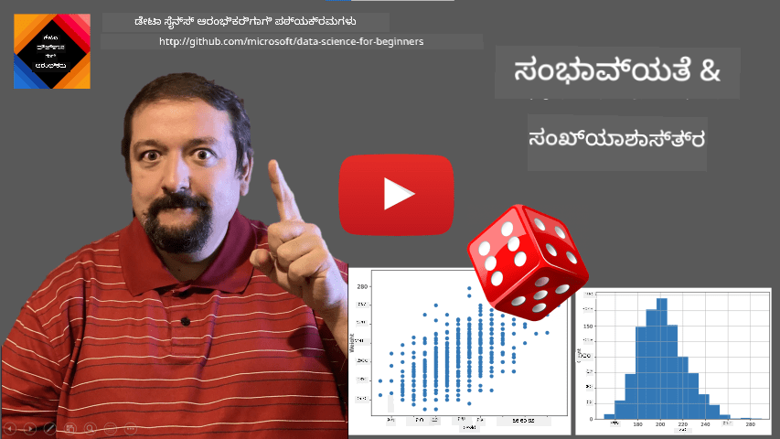
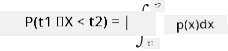
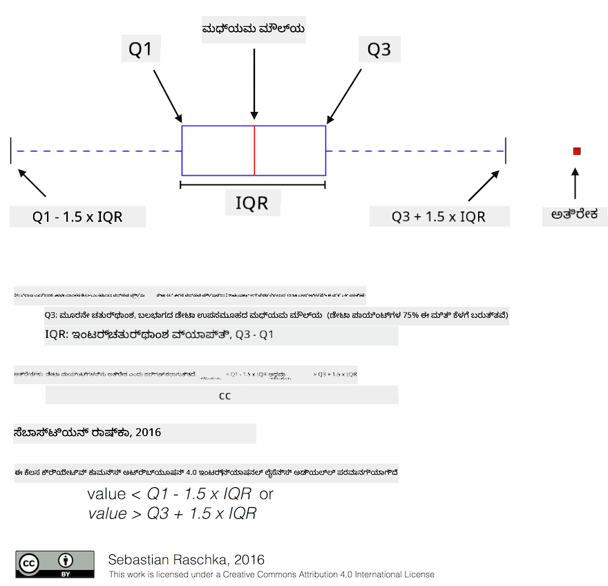
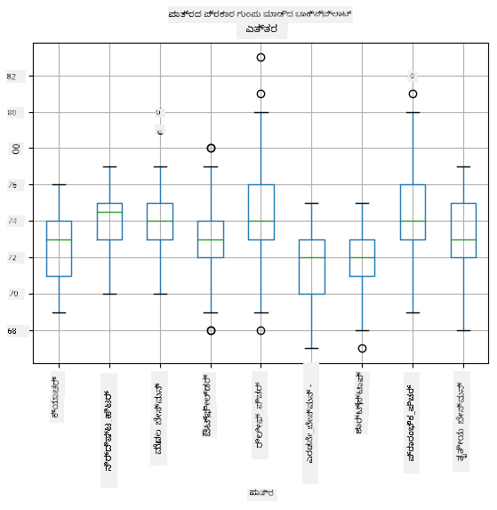
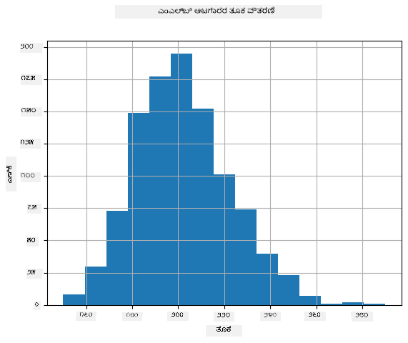
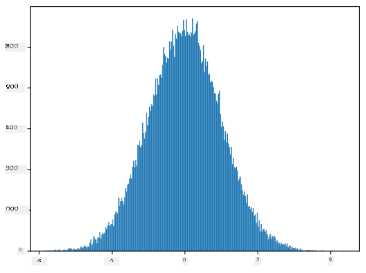
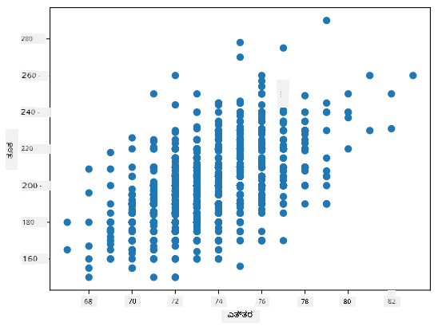

<!--
CO_OP_TRANSLATOR_METADATA:
{
  "original_hash": "ce95884566a74db72572cd51f0cb25ad",
  "translation_date": "2025-12-19T13:54:48+00:00",
  "source_file": "1-Introduction/04-stats-and-probability/README.md",
  "language_code": "kn"
}
-->
# ಅಂಕಿಅಂಶಗಳು ಮತ್ತು ಸಂಭವನೀಯತೆಯ ಸಂಕ್ಷಿಪ್ತ ಪರಿಚಯ

| ಅವರಿಂದ ಸ್ಕೆಚ್ ನೋಟ್ ](../../sketchnotes/04-Statistics-Probability.png)|
|:---:|
| ಅಂಕಿಅಂಶಗಳು ಮತ್ತು ಸಂಭವನೀಯತೆ - _[@nitya](https://twitter.com/nitya) ಅವರಿಂದ ಸ್ಕೆಚ್ ನೋಟ್_ |

ಅಂಕಿಅಂಶಗಳು ಮತ್ತು ಸಂಭವನೀಯತೆ ಸಿದ್ಧಾಂತಗಳು ಗಣಿತದ ಎರಡು ಅತ್ಯಂತ ಸಂಬಂಧಿತ ಕ್ಷೇತ್ರಗಳು, ಮತ್ತು ಡೇಟಾ ಸೈನ್ಸ್‌ಗೆ ಬಹಳ ಪ್ರಾಸಂಗಿಕವಾಗಿವೆ. ಗಣಿತದ ಆಳವಾದ ಜ್ಞಾನವಿಲ್ಲದೆ ಡೇಟಾ ಜೊತೆ ಕಾರ್ಯನಿರ್ವಹಿಸುವುದು ಸಾಧ್ಯವಿದ್ದರೂ, ಕನಿಷ್ಠ ಕೆಲವು ಮೂಲಭೂತ ತತ್ವಗಳನ್ನು ತಿಳಿದುಕೊಳ್ಳುವುದು ಉತ್ತಮ. ಇಲ್ಲಿ ನಾವು ಪ್ರಾರಂಭಿಸಲು ಸಹಾಯ ಮಾಡುವ ಸಂಕ್ಷಿಪ್ತ ಪರಿಚಯವನ್ನು ನೀಡುತ್ತೇವೆ.

[](https://youtu.be/Z5Zy85g4Yjw)


## [ಪೂರ್ವ-ವ್ಯಾಖ್ಯಾನ ಕ್ವಿಜ್](https://ff-quizzes.netlify.app/en/ds/quiz/6)

## ಸಂಭವನೀಯತೆ ಮತ್ತು ಯಾದೃಚ್ಛಿಕ ಚರಗಳು

**ಸಂಭವನೀಯತೆ** ಎಂದರೆ 0 ಮತ್ತು 1 ನಡುವಿನ ಸಂಖ್ಯೆ, ಅದು ಒಂದು **ಘಟನೆ** ಸಂಭವಿಸುವ ಸಾಧ್ಯತೆಯನ್ನು ಸೂಚಿಸುತ್ತದೆ. ಇದು ಧನಾತ್ಮಕ ಫಲಿತಾಂಶಗಳ ಸಂಖ್ಯೆ (ಆ ಘಟನೆಯನ್ನು ಉಂಟುಮಾಡುವವು), ಒಟ್ಟು ಫಲಿತಾಂಶಗಳ ಸಂಖ್ಯೆಯಿಂದ ಭಾಗಿಸಿದಾಗ, ಎಲ್ಲಾ ಫಲಿತಾಂಶಗಳು ಸಮಾನ ಸಾಧ್ಯತೆ ಹೊಂದಿರುವಾಗ ವ್ಯಾಖ್ಯಾನಿಸಲಾಗುತ್ತದೆ. ಉದಾಹರಣೆಗೆ, ಡೈಸ್ ಎಸೆದಾಗ, ಸಮ ಸಂಖ್ಯೆಯು ಬರುವ ಸಾಧ್ಯತೆ 3/6 = 0.5.

ಘಟನೆಗಳ ಬಗ್ಗೆ ಮಾತನಾಡುವಾಗ, ನಾವು **ಯಾದೃಚ್ಛಿಕ ಚರಗಳನ್ನು** ಬಳಸುತ್ತೇವೆ. ಉದಾಹರಣೆಗೆ, ಡೈಸ್ ಎಸೆದಾಗ ದೊರಕುವ ಸಂಖ್ಯೆಯನ್ನು ಪ್ರತಿನಿಧಿಸುವ ಯಾದೃಚ್ಛಿಕ ಚರವು 1 ರಿಂದ 6 ರವರೆಗೆ ಮೌಲ್ಯಗಳನ್ನು ತೆಗೆದುಕೊಳ್ಳುತ್ತದೆ. 1 ರಿಂದ 6 ರವರೆಗೆ ಸಂಖ್ಯೆಗಳ ಸಮೂಹವನ್ನು **ನಮೂನಾ ಸ್ಥಳ** ಎಂದು ಕರೆಯುತ್ತಾರೆ. ನಾವು ಯಾದೃಚ್ಛಿಕ ಚರವು ನಿರ್ದಿಷ್ಟ ಮೌಲ್ಯವನ್ನು ತೆಗೆದುಕೊಳ್ಳುವ ಸಾಧ್ಯತೆಯ ಬಗ್ಗೆ ಮಾತನಾಡಬಹುದು, ಉದಾಹರಣೆಗೆ P(X=3)=1/6.

ಹಿಂದಿನ ಉದಾಹರಣೆಯ ಯಾದೃಚ್ಛಿಕ ಚರವನ್ನು **ವಿಚ್ಛಿನ್ನ** ಎಂದು ಕರೆಯುತ್ತಾರೆ, ಏಕೆಂದರೆ ಇದರ ನಮೂನಾ ಸ್ಥಳ ಎಣಿಸಬಹುದಾದದು, ಅಂದರೆ ಪ್ರತ್ಯೇಕ ಮೌಲ್ಯಗಳನ್ನು ಎಣಿಸಬಹುದು. ಕೆಲವು ಸಂದರ್ಭಗಳಲ್ಲಿ ನಮೂನಾ ಸ್ಥಳವು ನಿಜ ಸಂಖ್ಯೆಗಳ ಶ್ರೇಣಿಯಾಗಿರಬಹುದು ಅಥವಾ ಸಂಪೂರ್ಣ ನಿಜ ಸಂಖ್ಯೆಗಳ ಸಮೂಹವಾಗಿರಬಹುದು. ಇಂತಹ ಚರಗಳನ್ನು **ನಿರಂತರ** ಎಂದು ಕರೆಯುತ್ತಾರೆ. ಬಸ್ ಬರುವ ಸಮಯವು ಉತ್ತಮ ಉದಾಹರಣೆ.

## ಸಂಭವನೀಯತೆ ವಿತರಣಾ

ವಿಚ್ಛಿನ್ನ ಯಾದೃಚ್ಛಿಕ ಚರಗಳ ಸಂದರ್ಭದಲ್ಲಿ, ಪ್ರತಿ ಘಟನೆಯ ಸಂಭವನೀಯತೆಯನ್ನು P(X) ಎಂಬ ಕಾರ್ಯದಿಂದ ವಿವರಿಸುವುದು ಸುಲಭ. ನಮೂನಾ ಸ್ಥಳ *S* ನಿಂದ ಪ್ರತಿ ಮೌಲ್ಯ *s* ಗೆ 0 ರಿಂದ 1 ರವರೆಗೆ ಸಂಖ್ಯೆ ನೀಡುತ್ತದೆ, ಮತ್ತು ಎಲ್ಲಾ ಘಟನಗಳ P(X=s) ಮೌಲ್ಯಗಳ ಮೊತ್ತ 1 ಆಗಿರುತ್ತದೆ.

ಅತ್ಯಂತ ಪ್ರಸಿದ್ಧ ವಿಚ್ಛಿನ್ನ ವಿತರಣೆಯು **ಸಮಾನ ವಿತರಣೆ** ಆಗಿದ್ದು, ಇದರಲ್ಲಿ N ಅಂಶಗಳ ನಮೂನಾ ಸ್ಥಳವಿದ್ದು, ಪ್ರತಿ ಅಂಶಕ್ಕೆ 1/N ಸಮಾನ ಸಾಧ್ಯತೆ ಇರುತ್ತದೆ.

ನಿರಂತರ ಚರಗಳ ಸಂಭವನೀಯತೆ ವಿತರಣೆಯನ್ನು ವಿವರಿಸುವುದು ಕಷ್ಟ, ಏಕೆಂದರೆ ಮೌಲ್ಯಗಳು [a,b] ಶ್ರೇಣಿಯಿಂದ ಅಥವಾ ಸಂಪೂರ್ಣ ನಿಜ ಸಂಖ್ಯೆಗಳ ಸಮೂಹದಿಂದ ತೆಗೆದುಕೊಳ್ಳಬಹುದು. ಬಸ್ ಬರುವ ಸಮಯದ ಉದಾಹರಣೆಯನ್ನು ಪರಿಗಣಿಸಿ. ನಿಜವಾಗಿ, ಪ್ರತಿಯೊಂದು ನಿಖರ ಬಸ್ ಬರುವ ಸಮಯ *t* ಗೆ, ಬಸ್ ಆ ಸಮಯದಲ್ಲಿ ಬರುವ ಸಾಧ್ಯತೆ 0!

> ಈಗ ನೀವು ತಿಳಿದುಕೊಂಡಿದ್ದೀರಿ, 0 ಸಂಭವನೀಯತೆ ಇರುವ ಘಟನೆಗಳು ಸಂಭವಿಸುತ್ತವೆ, ಮತ್ತು ಬಹಳ ಬಾರಿ! ಕನಿಷ್ಠ ಪ್ರತಿಯೊಂದು ಬಸ್ ಬರುವ ಸಮಯದಲ್ಲಿ!

ನಾವು ಮಾತ್ರ ಒಂದು ಮೌಲ್ಯ ಶ್ರೇಣಿಯಲ್ಲಿ ಬರುವ ಸಾಧ್ಯತೆಯ ಬಗ್ಗೆ ಮಾತನಾಡಬಹುದು, ಉದಾ. P(t<sub>1</sub>&le;X&lt;t<sub>2</sub>). ಈ ಸಂದರ್ಭದಲ್ಲಿ, ಸಂಭವನೀಯತೆ ವಿತರಣೆಯನ್ನು **ಸಂಭವನೀಯತೆ ಸಾಂದ್ರತೆ ಕಾರ್ಯ** p(x) ಮೂಲಕ ವಿವರಿಸಲಾಗುತ್ತದೆ, ಹಾಗಾಗಿ


  
ಸಮಾನ ವಿತರಣೆಯ ನಿರಂತರ ಸಮಾನಾರ್ಥಕವನ್ನು **ನಿರಂತರ ಸಮಾನ ವಿತರಣೆ** ಎಂದು ಕರೆಯುತ್ತಾರೆ, ಇದು ಸೀಮಿತ ಶ್ರೇಣಿಯಲ್ಲಿ ವ್ಯಾಖ್ಯಾನಿಸಲಾಗುತ್ತದೆ. ಮೌಲ್ಯ X ಒಂದು l ಉದ್ದದ ಶ್ರೇಣಿಯಲ್ಲಿ ಬರುವ ಸಾಧ್ಯತೆ l ಗೆ ಅನುಪಾತಿಕವಾಗಿದ್ದು, 1 ರವರೆಗೆ ಏರುತ್ತದೆ.

ಮತ್ತೊಂದು ಪ್ರಮುಖ ವಿತರಣೆಯು **ಸಾಮಾನ್ಯ ವಿತರಣೆ** ಆಗಿದ್ದು, ಅದನ್ನು ಕೆಳಗೆ ವಿವರವಾಗಿ ಚರ್ಚಿಸುವೆವು.

## ಸರಾಸರಿ, ವ್ಯತ್ಯಾಸ ಮತ್ತು ಮಾನಕ ವಿಚಲನ

ನಾವು ಯಾದೃಚ್ಛಿಕ ಚರ X ನ n ಮಾದರಿಗಳ ಸರಣಿಯನ್ನು ಎಳೆದಿದ್ದೇವೆ ಎಂದು ಊಹಿಸೋಣ: x<sub>1</sub>, x<sub>2</sub>, ..., x<sub>n</sub>. ಸರಣಿಯ **ಸರಾಸರಿ** (ಅಥವಾ **ಅಂಕಗಣಿತ ಸರಾಸರಿ**) ಮೌಲ್ಯವನ್ನು ಸಾಂಪ್ರದಾಯಿಕವಾಗಿ (x<sub>1</sub>+x<sub>2</sub>+...+x<sub>n</sub>)/n ಎಂದು ವ್ಯಾಖ್ಯಾನಿಸಬಹುದು. ಮಾದರಿ ಗಾತ್ರವನ್ನು ಹೆಚ್ಚಿಸಿದಂತೆ (ಅಂದರೆ n&rarr;&infin;), ನಾವು ವಿತರಣೆಯ ಸರಾಸರಿ (ಅಥವಾ **ನಿರೀಕ್ಷೆ**) ಪಡೆಯುತ್ತೇವೆ. ನಿರೀಕ್ಷೆಯನ್ನು **E**(x) ಎಂದು ಸೂಚಿಸುತ್ತೇವೆ.

> ಯಾವುದೇ ವಿಚ್ಛಿನ್ನ ವಿತರಣೆಗೆ ಮೌಲ್ಯಗಳು {x<sub>1</sub>, x<sub>2</sub>, ..., x<sub>N</sub>} ಮತ್ತು ಸಂಬಂಧಿತ ಸಾಧ್ಯತೆಗಳು p<sub>1</sub>, p<sub>2</sub>, ..., p<sub>N</sub> ಇದ್ದಾಗ, ನಿರೀಕ್ಷೆ E(X)=x<sub>1</sub>p<sub>1</sub>+x<sub>2</sub>p<sub>2</sub>+...+x<sub>N</sub>p<sub>N</sub> ಆಗಿರುತ್ತದೆ ಎಂದು ತೋರಿಸಬಹುದು.

ಮೌಲ್ಯಗಳು ಎಷ್ಟು ದೂರವಿರುವುದನ್ನು ಗುರುತಿಸಲು, ನಾವು ವ್ಯತ್ಯಾಸ &sigma;<sup>2</sup> = &sum;(x<sub>i</sub> - &mu;)<sup>2</sup>/n ಅನ್ನು ಲೆಕ್ಕಿಸಬಹುದು, ಇಲ್ಲಿ &mu; ಸರಾಸರಿ. &sigma; ಅನ್ನು **ಮಾನಕ ವಿಚಲನ** ಎಂದು ಕರೆಯುತ್ತಾರೆ, ಮತ್ತು &sigma;<sup>2</sup> ಅನ್ನು **ವ್ಯತ್ಯಾಸ** ಎಂದು ಕರೆಯುತ್ತಾರೆ.

## ಮೋಡ್, ಮಧ್ಯಮ ಮತ್ತು ಚತುರ್ಥಾಂಶಗಳು

ಕೆಲವೊಮ್ಮೆ, ಸರಾಸರಿ ಡೇಟಾದ "ಸಾಮಾನ್ಯ" ಮೌಲ್ಯವನ್ನು ಸಮರ್ಪಕವಾಗಿ ಪ್ರತಿನಿಧಿಸುವುದಿಲ್ಲ. ಉದಾಹರಣೆಗೆ, ಕೆಲವು ಅತಿದೊಡ್ಡ ಮೌಲ್ಯಗಳು ಸರಾಸರಿಯನ್ನು ಪ್ರಭಾವಿತ ಮಾಡಬಹುದು. ಇನ್ನೊಂದು ಉತ್ತಮ ಸೂಚನೆ **ಮಧ್ಯಮ** ಆಗಿದ್ದು, ಅದು ಒಂದು ಮೌಲ್ಯ, ಅದಕ್ಕಿಂತ ಅರ್ಧ ಡೇಟಾ ಅಂಕಿಗಳು ಕಡಿಮೆ ಮತ್ತು ಇನ್ನೂ ಅರ್ಧವು ಹೆಚ್ಚು.

ಡೇಟಾ ವಿತರಣೆಯನ್ನು ಅರ್ಥಮಾಡಿಕೊಳ್ಳಲು, **ಚತುರ್ಥಾಂಶಗಳು** ಬಗ್ಗೆ ಮಾತನಾಡುವುದು ಸಹಾಯಕ:

* ಮೊದಲ ಚತುರ್ಥಾಂಶ, ಅಥವಾ Q1, ಅಂದರೆ 25% ಡೇಟಾ ಅದರ ಕೆಳಗೆ ಇರುತ್ತದೆ
* ಮೂರನೇ ಚತುರ್ಥಾಂಶ, ಅಥವಾ Q3, ಅಂದರೆ 75% ಡೇಟಾ ಅದರ ಕೆಳಗೆ ಇರುತ್ತದೆ

ಗ್ರಾಫಿಕಲ್ ಆಗಿ, ಮಧ್ಯಮ ಮತ್ತು ಚತುರ್ಥಾಂಶಗಳ ಸಂಬಂಧವನ್ನು **ಬಾಕ್ಸ್ ಪ್ಲಾಟ್** ಎಂಬ ಚಿತ್ರದಲ್ಲಿ ಪ್ರತಿನಿಧಿಸಬಹುದು:



ಇಲ್ಲಿ ನಾವು **ಅಂತರ-ಚತುರ್ಥಾಂಶ ವ್ಯಾಪ್ತಿ** IQR=Q3-Q1 ಅನ್ನು ಲೆಕ್ಕಿಸುತ್ತೇವೆ, ಮತ್ತು **ಔಟ್‌ಲೈಯರ್‌ಗಳು** - [Q1-1.5*IQR, Q3+1.5*IQR] ಗಡಿಗಳ ಹೊರಗಿನ ಮೌಲ್ಯಗಳು.

ಸೀಮಿತ ವಿತರಣೆಯು ಕೆಲವು ಸಾಧ್ಯ ಮೌಲ್ಯಗಳನ್ನು ಹೊಂದಿದ್ದರೆ, ಅತ್ಯಂತ ಸಾಮಾನ್ಯವಾಗಿ ಕಾಣುವ ಮೌಲ್ಯವನ್ನು **ಮೋಡ್** ಎಂದು ಕರೆಯುತ್ತಾರೆ. ಇದು ವರ್ಗೀಕೃತ ಡೇಟಾಗೆ ಅನ್ವಯಿಸುತ್ತದೆ, ಉದಾಹರಣೆಗೆ ಬಣ್ಣಗಳು. ಎರಡು ಜನರ ಗುಂಪುಗಳಿದ್ದಾಗ - ಕೆಲವರು ಕೆಂಪನ್ನು ಹೆಚ್ಚು ಇಷ್ಟಪಡುತ್ತಾರೆ, ಮತ್ತೊಬ್ಬರು ನೀಲಿಯನ್ನು ಇಷ್ಟಪಡುತ್ತಾರೆ ಎಂದು ಪರಿಗಣಿಸಿ. ಬಣ್ಣಗಳನ್ನು ಸಂಖ್ಯೆಗಳ ಮೂಲಕ ಕೋಡ್ ಮಾಡಿದರೆ, ಪ್ರಿಯ ಬಣ್ಣದ ಸರಾಸರಿ ಮೌಲ್ಯ ಕಿತ್ತಳೆ-ಹಸಿರು ಶ್ರೇಣಿಯಲ್ಲಿ ಬರುವುದರಿಂದ ಯಾವುದೇ ಗುಂಪಿನ ನಿಜವಾದ ಇಷ್ಟವನ್ನು ಸೂಚಿಸುವುದಿಲ್ಲ. ಆದರೆ ಮೋಡ್ ಒಂದು ಬಣ್ಣ ಅಥವಾ ಎರಡೂ ಬಣ್ಣಗಳಾಗಿರಬಹುದು, ಜನರ ಮತದಾನ ಸಮಾನವಾದರೆ (ಈ ಸಂದರ್ಭದಲ್ಲಿ ನಮೂನೆಯನ್ನು **ಬಹುಮೋಡಲ್** ಎಂದು ಕರೆಯುತ್ತಾರೆ).

## ನಿಜಜೀವನದ ಡೇಟಾ

ನಾವು ನಿಜಜೀವನದ ಡೇಟಾವನ್ನು ವಿಶ್ಲೇಷಿಸುವಾಗ, ಅವು ಯಾದೃಚ್ಛಿಕ ಚರಗಳಂತೆ ಇರಲಾರವು, ಅಂದರೆ ನಾವು ಅಜ್ಞಾತ ಫಲಿತಾಂಶದೊಂದಿಗೆ ಪ್ರಯೋಗಗಳನ್ನು ನಡೆಸುವುದಿಲ್ಲ. ಉದಾಹರಣೆಗೆ, ಬೇಸ್‌ಬಾಲ್ ಆಟಗಾರರ ತಂಡ ಮತ್ತು ಅವರ ದೇಹದ ಡೇಟಾ, ಉದಾ. ಎತ್ತರ, ತೂಕ ಮತ್ತು ವಯಸ್ಸು. ಆ ಸಂಖ್ಯೆಗಳು ನಿಖರವಾಗಿ ಯಾದೃಚ್ಛಿಕವಲ್ಲ, ಆದರೆ ನಾವು ಅದೇ ಗಣಿತ ತತ್ವಗಳನ್ನು ಅನ್ವಯಿಸಬಹುದು. ಉದಾಹರಣೆಗೆ, ಜನರ ತೂಕಗಳ ಸರಣಿಯನ್ನು ಕೆಲವು ಯಾದೃಚ್ಛಿಕ ಚರದಿಂದ ತೆಗೆದುಕೊಂಡ ಮೌಲ್ಯಗಳ ಸರಣಿಯಾಗಿ ಪರಿಗಣಿಸಬಹುದು. ಕೆಳಗಿನವು [ಮೇಜರ್ ಲೀಗ್ ಬೇಸ್‌ಬಾಲ್](http://mlb.mlb.com/index.jsp) ನ ನಿಜವಾದ ಆಟಗಾರರ ತೂಕಗಳ ಸರಣಿಯಾಗಿದೆ, [ಈ ಡೇಟಾಸೆಟ್](http://wiki.stat.ucla.edu/socr/index.php/SOCR_Data_MLB_HeightsWeights) ನಿಂದ ತೆಗೆದುಕೊಂಡದ್ದು (ನಿಮ್ಮ ಅನುಕೂಲಕ್ಕಾಗಿ ಮೊದಲ 20 ಮೌಲ್ಯಗಳನ್ನು ಮಾತ್ರ ತೋರಿಸಲಾಗಿದೆ):

```
[180.0, 215.0, 210.0, 210.0, 188.0, 176.0, 209.0, 200.0, 231.0, 180.0, 188.0, 180.0, 185.0, 160.0, 180.0, 185.0, 197.0, 189.0, 185.0, 219.0]
```

> **ಗಮನಿಸಿ**: ಈ ಡೇಟಾಸೆಟ್‌ನೊಂದಿಗೆ ಕೆಲಸ ಮಾಡುವ ಉದಾಹರಣೆಯನ್ನು ನೋಡಲು, [ಸಹಾಯಕ ನೋಟ್ಬುಕ್](notebook.ipynb) ಅನ್ನು ನೋಡಿ. ಈ ಪಾಠದಲ್ಲಿ ಹಲವಾರು ಸವಾಲುಗಳಿವೆ, ಮತ್ತು ನೀವು ಆ ನೋಟ್ಬುಕ್‌ಗೆ ಕೆಲವು ಕೋಡ್ ಸೇರಿಸುವ ಮೂಲಕ ಅವುಗಳನ್ನು ಪೂರ್ಣಗೊಳಿಸಬಹುದು. ನೀವು ಡೇಟಾ ಮೇಲೆ ಹೇಗೆ ಕಾರ್ಯನಿರ್ವಹಿಸಬೇಕೆಂದು ಖಚಿತವಾಗದಿದ್ದರೆ, ಚಿಂತಿಸಬೇಡಿ - ನಾವು ನಂತರ ಪೈಥಾನ್ ಬಳಸಿ ಡೇಟಾ ಮೇಲೆ ಕೆಲಸ ಮಾಡುವುದನ್ನು ಮತ್ತೆ ನೋಡುತ್ತೇವೆ. ನೀವು ಜುಪಿಟರ್ ನೋಟ್ಬುಕ್‌ನಲ್ಲಿ ಕೋಡ್ ಹೇಗೆ ರನ್ ಮಾಡುವುದು ತಿಳಿಯದಿದ್ದರೆ, [ಈ ಲೇಖನ](https://soshnikov.com/education/how-to-execute-notebooks-from-github/) ನೋಡಿ.

ಇದು ನಮ್ಮ ಡೇಟಾದ ಸರಾಸರಿ, ಮಧ್ಯಮ ಮತ್ತು ಚತುರ್ಥಾಂಶಗಳನ್ನು ತೋರಿಸುವ ಬಾಕ್ಸ್ ಪ್ಲಾಟ್:


ನಮ್ಮ ಡೇಟಾ ವಿಭಿನ್ನ ಆಟಗಾರರ **ಪಾತ್ರಗಳು** ಬಗ್ಗೆ ಮಾಹಿತಿಯನ್ನು ಹೊಂದಿರುವುದರಿಂದ, ನಾವು ಪಾತ್ರದ ಪ್ರಕಾರ ಬಾಕ್ಸ್ ಪ್ಲಾಟ್ ಮಾಡಬಹುದು - ಇದು ಪಾತ್ರಗಳ ನಡುವೆ ಪರಿಮಾಣ ಮೌಲ್ಯಗಳು ಹೇಗೆ ಭಿನ್ನವಾಗಿವೆ ಎಂಬುದರ ಕಲ್ಪನೆ ನೀಡುತ್ತದೆ. ಈ ಬಾರಿ ನಾವು ಎತ್ತರವನ್ನು ಪರಿಗಣಿಸುವೆವು:



ಈ ಚಿತ್ರಣವು ಸೂಚಿಸುತ್ತದೆ, ಸರಾಸರಿಯಾಗಿ, ಮೊದಲ ಬ್ಯಾಟ್ಸ್‌ಮನ್‌ಗಳ ಎತ್ತರ ಎರಡನೇ ಬ್ಯಾಟ್ಸ್‌ಮನ್‌ಗಳ ಎತ್ತರಕ್ಕಿಂತ ಹೆಚ್ಚು. ಈ ಪಾಠದ ನಂತರ ನಾವು ಈ ಊಹೆಯನ್ನು ಅಧಿಕೃತವಾಗಿ ಪರೀಕ್ಷಿಸುವುದು ಹೇಗೆ ಮತ್ತು ನಮ್ಮ ಡೇಟಾ ಅಂಕಿಅಂಶವಾಗಿ ಮಹತ್ವಪೂರ್ಣವಾಗಿದೆ ಎಂದು ತೋರಿಸುವುದು ಹೇಗೆ ಎಂಬುದನ್ನು ಕಲಿಯುತ್ತೇವೆ.

> ನಿಜಜೀವನದ ಡೇಟಾ ಮೇಲೆ ಕೆಲಸ ಮಾಡುವಾಗ, ನಾವು ಎಲ್ಲಾ ಡೇಟಾ ಅಂಕಿಗಳನ್ನು ಕೆಲವು ಸಂಭವನೀಯತೆ ವಿತರಣೆಯಿಂದ ತೆಗೆದುಕೊಂಡ ಮಾದರಿಗಳಾಗಿವೆ ಎಂದು ಊಹಿಸುತ್ತೇವೆ. ಈ ಊಹೆ ಯಂತ್ರ ಅಧ್ಯಯನ ತಂತ್ರಗಳನ್ನು ಅನ್ವಯಿಸಲು ಮತ್ತು ಕಾರ್ಯನಿರ್ವಹಿಸುವ ಭವಿಷ್ಯವಾಣಿ ಮಾದರಿಗಳನ್ನು ನಿರ್ಮಿಸಲು ಸಹಾಯ ಮಾಡುತ್ತದೆ.

ನಮ್ಮ ಡೇಟಾದ ವಿತರಣೆಯನ್ನು ನೋಡಲು, ನಾವು **ಹಿಸ್ಟೋಗ್ರಾಮ್** ಎಂಬ ಗ್ರಾಫ್ ಅನ್ನು ರಚಿಸಬಹುದು. X-ಅಕ್ಷದಲ್ಲಿ ವಿವಿಧ ತೂಕ ಶ್ರೇಣಿಗಳು (ಅಥವಾ **ಬಿನ್‌ಗಳು**) ಇರುತ್ತವೆ, ಮತ್ತು ಲಂಬ ಅಕ್ಷವು ನಮ್ಮ ಯಾದೃಚ್ಛಿಕ ಚರ ಮಾದರಿ ನೀಡಲಾದ ಶ್ರೇಣಿಯಲ್ಲಿ ಎಷ್ಟು ಬಾರಿ ಬಿದ್ದಿದೆ ಎಂಬುದನ್ನು ತೋರಿಸುತ್ತದೆ.



ಈ ಹಿಸ್ಟೋಗ್ರಾಮ್‌ನಿಂದ ನೀವು ನೋಡಬಹುದು ಎಲ್ಲಾ ಮೌಲ್ಯಗಳು ನಿರ್ದಿಷ್ಟ ಸರಾಸರಿ ತೂಕದ ಸುತ್ತಲೂ ಕೇಂದ್ರೀಕೃತವಾಗಿವೆ, ಮತ್ತು ಆ ತೂಕದಿಂದ ದೂರ ಹೋಗುವಂತೆ, ಆ ಮೌಲ್ಯದ ತೂಕಗಳ ಸಂಖ್ಯೆ ಕಡಿಮೆಯಾಗುತ್ತದೆ. ಅಂದರೆ, ಬೇಸ್‌ಬಾಲ್ ಆಟಗಾರರ ತೂಕವು ಸರಾಸರಿ ತೂಕದಿಂದ ಬಹಳ ವಿಭಿನ್ನವಾಗಿರುವುದು ಬಹಳ ಅಸಾಧ್ಯ. ತೂಕಗಳ ವ್ಯತ್ಯಾಸವು ತೂಕಗಳು ಸರಾಸರಿ ತೂಕದಿಂದ ಎಷ್ಟು ಭಿನ್ನವಾಗಬಹುದು ಎಂಬುದನ್ನು ತೋರಿಸುತ್ತದೆ.

> ನಾವು ಬೇಸ್‌ಬಾಲ್ ಲೀಗ್‌ನಲ್ಲದ ಇತರ ಜನರ ತೂಕಗಳನ್ನು ತೆಗೆದುಕೊಂಡರೆ, ವಿತರಣೆಯು ಭಿನ್ನವಾಗಿರಬಹುದು. ಆದಾಗ್ಯೂ, ವಿತರಣೆಯ ಆಕಾರವು ಅದೇ ಆಗಿರುತ್ತದೆ, ಆದರೆ ಸರಾಸರಿ ಮತ್ತು ವ್ಯತ್ಯಾಸ ಬದಲಾಗುತ್ತದೆ. ಆದ್ದರಿಂದ, ನಾವು ನಮ್ಮ ಮಾದರಿಯನ್ನು ಬೇಸ್‌ಬಾಲ್ ಆಟಗಾರರ ಮೇಲೆ ತರಬೇತುಗೊಳಿಸಿದರೆ, ಅದನ್ನು ವಿಶ್ವವಿದ್ಯಾಲಯದ ವಿದ್ಯಾರ್ಥಿಗಳ ಮೇಲೆ ಅನ್ವಯಿಸಿದಾಗ ತಪ್ಪು ಫಲಿತಾಂಶಗಳನ್ನು ನೀಡಬಹುದು, ಏಕೆಂದರೆ ಮೂಲ ವಿತರಣೆಯು ವಿಭಿನ್ನವಾಗಿದೆ.

## ಸಾಮಾನ್ಯ ವಿತರಣೆ

ನಾವು ಮೇಲ್ಕಂಡ ತೂಕಗಳ ವಿತರಣೆಯು ಬಹಳ ಸಾಮಾನ್ಯವಾಗಿದೆ, ಮತ್ತು ನಿಜಜೀವನದ ಅನೇಕ ಅಳತೆಗಳು ಅದೇ ರೀತಿಯ ವಿತರಣೆಯನ್ನು ಅನುಸರಿಸುತ್ತವೆ, ಆದರೆ ವಿಭಿನ್ನ ಸರಾಸರಿ ಮತ್ತು ವ್ಯತ್ಯಾಸಗಳೊಂದಿಗೆ. ಈ ವಿತರಣೆಯನ್ನು **ಸಾಮಾನ್ಯ ವಿತರಣೆ** ಎಂದು ಕರೆಯುತ್ತಾರೆ, ಮತ್ತು ಇದು ಅಂಕಿಅಂಶಗಳಲ್ಲಿ ಬಹಳ ಪ್ರಮುಖ ಪಾತ್ರ ವಹಿಸುತ್ತದೆ.

ಸಾಮಾನ್ಯ ವಿತರಣೆಯನ್ನು ಬಳಸುವುದು ಸಾಧ್ಯವಿರುವ ಬೇಸ್‌ಬಾಲ್ ಆಟಗಾರರ ಯಾದೃಚ್ಛಿಕ ತೂಕಗಳನ್ನು ರಚಿಸುವ ಸರಿಯಾದ ವಿಧಾನವಾಗಿದೆ. ನಾವು ಸರಾಸರಿ ತೂಕ `mean` ಮತ್ತು ಮಾನಕ ವಿಚಲನ `std` ತಿಳಿದಿದ್ದರೆ, ಕೆಳಗಿನ ರೀತಿಯಲ್ಲಿ 1000 ತೂಕ ಮಾದರಿಗಳನ್ನು ರಚಿಸಬಹುದು:
```python
samples = np.random.normal(mean,std,1000)
``` 

ನಾವು ರಚಿಸಿದ ಮಾದರಿಗಳ ಹಿಸ್ಟೋಗ್ರಾಮ್ ಅನ್ನು ರಚಿಸಿದರೆ, ಮೇಲಿನ ಚಿತ್ರಣಕ್ಕೆ ಬಹಳ ಸಮೀಪವಾದ ಚಿತ್ರಣವನ್ನು ನೋಡಬಹುದು. ಮತ್ತು ಮಾದರಿಗಳ ಸಂಖ್ಯೆ ಮತ್ತು ಬಿನ್‌ಗಳ ಸಂಖ್ಯೆಯನ್ನು ಹೆಚ್ಚಿಸಿದರೆ, ನಾವು ಆದರ್ಶದ ಹತ್ತಿರದ ಸಾಮಾನ್ಯ ವಿತರಣೆಯ ಚಿತ್ರಣವನ್ನು ರಚಿಸಬಹುದು:



*ಸರಾಸರಿ=0 ಮತ್ತು ಮಾನಕ ವಿಚಲನ=1 ಇರುವ ಸಾಮಾನ್ಯ ವಿತರಣೆ*

## ವಿಶ್ವಾಸ ಅಂತರಗಳು

ನಾವು ಬೇಸ್‌ಬಾಲ್ ಆಟಗಾರರ ತೂಕಗಳ ಬಗ್ಗೆ ಮಾತನಾಡುವಾಗ, ನಾವು ಒಂದು ನಿರ್ದಿಷ್ಟ **ಯಾದೃಚ್ಛಿಕ ಚರ W** ಇದೆ ಎಂದು ಊಹಿಸುತ್ತೇವೆ, ಅದು ಎಲ್ಲಾ ಬೇಸ್‌ಬಾಲ್ ಆಟಗಾರರ ತೂಕಗಳ ಆದರ್ಶ ಸಂಭವನೀಯತೆ ವಿತರಣೆಗೆ ಹೊಂದಿಕೆಯಾಗುತ್ತದೆ (ಅಥವಾ **ಜನಸಂಖ್ಯೆ**). ನಮ್ಮ ತೂಕಗಳ ಸರಣಿ ಜನಸಂಖ್ಯೆಯ ಒಂದು ಉಪಸಮೂಹವಾಗಿದ್ದು, ಅದನ್ನು **ನಮೂನೆ** ಎಂದು ಕರೆಯುತ್ತೇವೆ. ಒಂದು ಆಸಕ್ತಿದಾಯಕ ಪ್ರಶ್ನೆ ಏನೆಂದರೆ, ನಾವು W ವಿತರಣೆಯ ಪರಿಮಾಣಗಳನ್ನು, ಅಂದರೆ ಜನಸಂಖ್ಯೆಯ ಸರಾಸರಿ ಮತ್ತು ವ್ಯತ್ಯಾಸವನ್ನು ತಿಳಿದುಕೊಳ್ಳಬಹುದೇ?

ಸರಳ ಉತ್ತರವೆಂದರೆ ನಮ್ಮ ನಮೂನೆಯ ಸರಾಸರಿ ಮತ್ತು ವ್ಯತ್ಯಾಸವನ್ನು ಲೆಕ್ಕಿಸುವುದು. ಆದರೆ, ನಮ್ಮ ಯಾದೃಚ್ಛಿಕ ನಮೂನೆ ಸಂಪೂರ್ಣ ಜನಸಂಖ್ಯೆಯನ್ನು ನಿಖರವಾಗಿ ಪ್ರತಿನಿಧಿಸದಿರಬಹುದು. ಆದ್ದರಿಂದ **ವಿಶ್ವಾಸ ಅಂತರ** ಬಗ್ಗೆ ಮಾತನಾಡುವುದು ಅರ್ಥಪೂರ್ಣ.

> **ವಿಶ್ವಾಸ ಅಂತರ** ಎಂದರೆ ನಮ್ಮ ನಮೂನೆ ನೀಡುವ ಜನಸಂಖ್ಯೆಯ ನಿಜವಾದ ಸರಾಸರಿಯ ಅಂದಾಜು, ಅದು ನಿರ್ದಿಷ್ಟ ಸಾಧ್ಯತೆಯ (ಅಥವಾ **ವಿಶ್ವಾಸ ಮಟ್ಟ**) ಒಳಗೆ ಸರಿಯಾಗಿರುತ್ತದೆ.

ನಾವು ನಮ್ಮ ವಿತರಣೆಯಿಂದ X<sub>1</sub>, ..., X<sub>n</sub> ಎಂಬ ಮಾದರಿಗಳನ್ನು ಪಡೆದಿದ್ದೇವೆ ಎಂದು ಊಹಿಸೋಣ. ಪ್ರತಿಯೊಂದು ಬಾರಿ ನಾವು ವಿತರಣೆಯಿಂದ ಮಾದರಿ ತೆಗೆದುಕೊಂಡಾಗ, ನಾವು ವಿಭಿನ್ನ ಸರಾಸರಿ ಮೌಲ್ಯ &mu; ಪಡೆಯುತ್ತೇವೆ. ಆದ್ದರಿಂದ &mu; ಯಾದೃಚ್ಛಿಕ ಚರವೆಂದು ಪರಿಗಣಿಸಬಹುದು. ವಿಶ್ವಾಸ p ಇರುವ ವಿಶ್ವಾಸ ಅಂತರವು (L<sub>p</sub>,R<sub>p</sub>) ಎಂಬ ಮೌಲ್ಯಗಳ ಜೋಡಿ ಆಗಿದ್ದು, **P**(L<sub>p</sub>&leq;&mu;&leq;R<sub>p</sub>) = p, ಅಂದರೆ ಅಂದಾಜು ಸರಾಸರಿ ಮೌಲ್ಯ ಆ ಅಂತರದೊಳಗೆ ಬರುವ ಸಾಧ್ಯತೆ p ಆಗಿರುತ್ತದೆ.

ಈ ವಿಶ್ವಾಸ ಅಂತರಗಳನ್ನು ಹೇಗೆ ಲೆಕ್ಕಿಸುವುದು ಎಂಬುದನ್ನು ವಿವರಿಸುವುದು ನಮ್ಮ ಸಂಕ್ಷಿಪ್ತ ಪರಿಚಯದ ವ್ಯಾಪ್ತಿಗೆ ಒಳಗಾಗುವುದಿಲ್ಲ. ಹೆಚ್ಚಿನ ವಿವರಗಳನ್ನು [ವಿಕಿಪೀಡಿಯದಲ್ಲಿ](https://en.wikipedia.org/wiki/Confidence_interval) ಕಾಣಬಹುದು. ಸಂಕ್ಷಿಪ್ತವಾಗಿ, ನಾವು ಲೆಕ್ಕಿಸಿದ ಮಾದರಿ ಸರಾಸರಿಯ ವಿತರಣೆಯನ್ನು ಜನಸಂಖ್ಯೆಯ ನಿಜವಾದ ಸರಾಸರಿಯ ಸಂಬಂಧದಲ್ಲಿ ವ್ಯಾಖ್ಯಾನಿಸುತ್ತೇವೆ, ಇದನ್ನು **ಸ್ಟುಡೆಂಟ್ ವಿತರಣೆ** ಎಂದು ಕರೆಯುತ್ತಾರೆ.
> **ಆಕರ್ಷಕ ವಾಸ್ತವ**: ಸ್ಟುಡೆಂಟ್ ವಿತರಣೆಯನ್ನು ಗಣಿತಜ್ಞ ವಿಲಿಯಂ ಸೀಲೀ ಗಾಸೆಟ್ ಅವರ ಹೆಸರಿನಿಂದ ಕರೆಯಲಾಗಿದೆ, ಅವರು "ಸ್ಟುಡೆಂಟ್" ಎಂಬ ಬದಲಾವಣೆ ಹೆಸರಿನಡಿ ತಮ್ಮ ಪೇಪರ್ ಪ್ರಕಟಿಸಿದರು. ಅವರು ಗಿನ್ನೆಸ್ ಬ್ರೂವರಿಯಲ್ಲಿ ಕೆಲಸ ಮಾಡುತ್ತಿದ್ದರು, ಮತ್ತು ಒಂದು ಆವೃತ್ತಿಯ ಪ್ರಕಾರ, ಅವರ ಉದ್ಯೋಗದಾತರು ಸಾಮಾನ್ಯ ಜನತೆಗೆ ಕಚ್ಚಾ ವಸ್ತುಗಳ ಗುಣಮಟ್ಟವನ್ನು ನಿರ್ಧರಿಸಲು ಸಾಂಖ್ಯಿಕ ಪರೀಕ್ಷೆಗಳನ್ನು ಬಳಸುತ್ತಿರುವುದನ್ನು ತಿಳಿಸಲು ಇಚ್ಛಿಸುವುದಿಲ್ಲ.

ನಾವು ನಮ್ಮ ಜನಸಂಖ್ಯೆಯ ಸರಾಸರಿ &mu; ಅನ್ನು ವಿಶ್ವಾಸ p ನೊಂದಿಗೆ ಅಂದಾಜಿಸಲು ಬಯಸಿದರೆ, ನಾವು ಸ್ಟುಡೆಂಟ್ ವಿತರಣೆಯ *(1-p)/2-ನೇ ಶತಮಾನಿಕೆ* A ಅನ್ನು ತೆಗೆದುಕೊಳ್ಳಬೇಕು, ಇದು ಟೇಬಲ್ಗಳಿಂದ ತೆಗೆದುಕೊಳ್ಳಬಹುದು ಅಥವಾ ಸಾಂಖ್ಯಿಕ ಸಾಫ್ಟ್‌ವೇರ್ (ಉದಾ. ಪೈಥಾನ್, R, ಇತ್ಯಾದಿ) ನ ಕೆಲವು ಒಳಗೊಂಡ ಕಾರ್ಯಗಳನ್ನು ಬಳಸಿ ಗಣನೆ ಮಾಡಬಹುದು. ನಂತರ &mu; ಗಾಗಿ ಅಂತರವನ್ನು X&pm;A*D/&radic;n ಎಂದು ನೀಡಲಾಗುತ್ತದೆ, ಇಲ್ಲಿ X ಮಾದರಿಯ ಸರಾಸರಿ, D ಮಾನಕ ವ್ಯತ್ಯಾಸ.

> **ಗಮನಿಸಿ**: ನಾವು ಸ್ಟುಡೆಂಟ್ ವಿತರಣೆಗೆ ಸಂಬಂಧಿಸಿದ ಮಹತ್ವದ ಸಂಜ್ಞೆ [ಸ್ವಾತಂತ್ರ್ಯದ ಡಿಗ್ರಿಗಳು](https://en.wikipedia.org/wiki/Degrees_of_freedom_(statistics)) ಕುರಿತು ಚರ್ಚೆಯನ್ನು ಕೂಡ ಬಿಟ್ಟುಬಿಡುತ್ತೇವೆ. ಈ ಸಂಜ್ಞೆಯನ್ನು ಆಳವಾಗಿ ಅರ್ಥಮಾಡಿಕೊಳ್ಳಲು ನೀವು ಸಾಂಖ್ಯಿಕಗಳ ಕುರಿತು ಸಂಪೂರ್ಣ ಪುಸ್ತಕಗಳನ್ನು ನೋಡಿ.

ತೂಕ ಮತ್ತು ಎತ್ತರಗಳ ವಿಶ್ವಾಸ ಅಂತರದ ಲೆಕ್ಕಾಚಾರದ ಉದಾಹರಣೆ [ಸಹಾಯಕ ನೋಟ್ಬುಕ್](notebook.ipynb) ನಲ್ಲಿ ನೀಡಲಾಗಿದೆ.

| p | ತೂಕ ಸರಾಸರಿ |
|-----|-----------|
| 0.85 | 201.73±0.94 |
| 0.90 | 201.73±1.08 |
| 0.95 | 201.73±1.28 |

ವಿಶ್ವಾಸದ ಸಾಧ್ಯತೆ ಹೆಚ್ಚಾದಂತೆ, ವಿಶ್ವಾಸ ಅಂತರವೂ ಅಗಲವಾಗುತ್ತದೆ.

## ಊಹಾಪೋಹ ಪರೀಕ್ಷೆ

ನಮ್ಮ ಬೇಸ್‌ಬಾಲ್ ಆಟಗಾರರ ಡೇಟಾಸೆಟ್‌ನಲ್ಲಿ, ವಿವಿಧ ಆಟಗಾರರ ಪಾತ್ರಗಳಿವೆ, ಅವುಗಳನ್ನು ಕೆಳಗಿನಂತೆ ಸಾರಬಹುದು ([ಸಹಾಯಕ ನೋಟ್ಬುಕ್](notebook.ipynb) ನೋಡಿ ಈ ಟೇಬಲ್ ಹೇಗೆ ಲೆಕ್ಕಾಚಾರ ಮಾಡಬಹುದು):

| ಪಾತ್ರ | ಎತ್ತರ | ತೂಕ | ಎಣಿಕೆ |
|------|--------|--------|-------|
| ಕ್ಯಾಚರ್ | 72.723684 | 204.328947 | 76 |
| ಡಿಸಿಗ್ನೇಟೆಡ್_ಹಿಟರ್ | 74.222222 | 220.888889 | 18 |
| ಫಸ್ಟ್_ಬೇಸ್ಮನ್ | 74.000000 | 213.109091 | 55 |
| ಔಟ್‌ಫೀಲ್ಡರ್ | 73.010309 | 199.113402 | 194 |
| ರಿಲೀಫ್_ಪಿಚರ್ | 74.374603 | 203.517460 | 315 |
| ಸೆಕೆಂಡ್_ಬೇಸ್ಮನ್ | 71.362069 | 184.344828 | 58 |
| ಶಾರ್ಟ್‌ಸ್ಟಾಪ್ | 71.903846 | 182.923077 | 52 |
| ಸ್ಟಾರ್ಟಿಂಗ್_ಪಿಚರ್ | 74.719457 | 205.163636 | 221 |
| ಥರ್ಡ್_ಬೇಸ್ಮನ್ | 73.044444 | 200.955556 | 45 |

ನಾವು ಗಮನಿಸಬಹುದು ಫಸ್ಟ್ ಬೇಸ್ಮನ್‌ಗಳ ಸರಾಸರಿ ಎತ್ತರ ಸೆಕೆಂಡ್ ಬೇಸ್ಮನ್‌ಗಳಿಗಿಂತ ಹೆಚ್ಚು ಇದೆ. ಆದ್ದರಿಂದ, ನಾವು **ಫಸ್ಟ್ ಬೇಸ್ಮನ್‌ಗಳು ಸೆಕೆಂಡ್ ಬೇಸ್ಮನ್‌ಗಳಿಗಿಂತ ಎತ್ತರವಾಗಿದ್ದಾರೆ** ಎಂದು ನಿರ್ಣಯಿಸಲು ಇಚ್ಛಿಸಬಹುದು.

> ಈ ಹೇಳಿಕೆಯನ್ನು **ಊಹಾಪೋಹ** ಎಂದು ಕರೆಯುತ್ತಾರೆ, ಏಕೆಂದರೆ ನಾವು ಈ ವಾಸ್ತವವು ನಿಜವಾಗಿದೆಯೇ ಇಲ್ಲವೇ ಎಂದು ತಿಳಿದಿಲ್ಲ.

ಆದರೆ, ಈ ನಿರ್ಣಯವನ್ನು ಮಾಡಬಹುದೇ ಎಂಬುದು ಸದಾ ಸ್ಪಷ್ಟವಲ್ಲ. ಮೇಲಿನ ಚರ್ಚೆಯಿಂದ ನಾವು ತಿಳಿದುಕೊಳ್ಳಬಹುದು ಪ್ರತಿ ಸರಾಸರಿಗೂ ಸಂಬಂಧಿಸಿದ ವಿಶ್ವಾಸ ಅಂತರವಿದೆ, ಮತ್ತು ಈ ವ್ಯತ್ಯಾಸವು ಕೇವಲ ಸಾಂಖ್ಯಿಕ ದೋಷವಾಗಿರಬಹುದು. ನಾವು ನಮ್ಮ ಊಹಾಪೋಹವನ್ನು ಪರೀಕ್ಷಿಸಲು ಇನ್ನಷ್ಟು ಅಧಿಕೃತ ವಿಧಾನ ಬೇಕು.

ನಾವು ಫಸ್ಟ್ ಮತ್ತು ಸೆಕೆಂಡ್ ಬೇಸ್ಮನ್‌ಗಳ ಎತ್ತರಗಳಿಗಾಗಿ ಪ್ರತ್ಯೇಕವಾಗಿ ವಿಶ್ವಾಸ ಅಂತರಗಳನ್ನು ಲೆಕ್ಕಿಸೋಣ:

| ವಿಶ್ವಾಸ | ಫಸ್ಟ್ ಬೇಸ್ಮನ್ | ಸೆಕೆಂಡ್ ಬೇಸ್ಮನ್ |
|------------|---------------|----------------|
| 0.85 | 73.62..74.38 | 71.04..71.69 |
| 0.90 | 73.56..74.44 | 70.99..71.73 |
| 0.95 | 73.47..74.53 | 70.92..71.81 |

ನಾವು ನೋಡಬಹುದು ಯಾವುದೇ ವಿಶ್ವಾಸ ಮಟ್ಟದಲ್ಲಿಯೂ ಅಂತರಗಳು ಒಟ್ಟಿಗೆ ಮಿಶ್ರಣವಾಗುತ್ತಿಲ್ಲ. ಇದು ಫಸ್ಟ್ ಬೇಸ್ಮನ್‌ಗಳು ಸೆಕೆಂಡ್ ಬೇಸ್ಮನ್‌ಗಳಿಗಿಂತ ಎತ್ತರವಾಗಿದ್ದಾರೆ ಎಂಬ ನಮ್ಮ ಊಹಾಪೋಹವನ್ನು ಸಾಬೀತುಪಡಿಸುತ್ತದೆ.

ವೈಜ್ಞಾನಿಕವಾಗಿ, ನಾವು ಪರಿಹರಿಸುತ್ತಿರುವ ಸಮಸ್ಯೆ ಎಂದರೆ **ಎರಡು ಸಾಧ್ಯತೆ ವಿತರಣೆಗಳು ಒಂದೇ ಆಗಿದೆಯೇ ಅಥವಾ ಕನಿಷ್ಠ ಒಂದೇ ಪರಿಮಾಣಗಳನ್ನು ಹೊಂದಿದೆಯೇ ಎಂದು ನೋಡುವುದು**. ವಿತರಣೆಯ ಪ್ರಕಾರ, ನಾವು ಅದಕ್ಕಾಗಿ ವಿಭಿನ್ನ ಪರೀಕ್ಷೆಗಳನ್ನು ಬಳಸಬೇಕು. ನಮ್ಮ ವಿತರಣೆಗಳು ಸಾಮಾನ್ಯವಾಗಿವೆ ಎಂದು ತಿಳಿದಿದ್ದರೆ, ನಾವು **[ಸ್ಟುಡೆಂಟ್ ಟಿ-ಪರೀಕ್ಷೆ](https://en.wikipedia.org/wiki/Student%27s_t-test)** ಅನ್ನು ಅನ್ವಯಿಸಬಹುದು.

ಸ್ಟುಡೆಂಟ್ ಟಿ-ಪರೀಕ್ಷೆಯಲ್ಲಿ, ನಾವು **ಟಿ-ಮೌಲ್ಯ** ಅನ್ನು ಲೆಕ್ಕಿಸುತ್ತೇವೆ, ಇದು ಸರಾಸರಿಗಳ ನಡುವಿನ ವ್ಯತ್ಯಾಸವನ್ನು ಸೂಚಿಸುತ್ತದೆ, ವ್ಯತ್ಯಾಸವನ್ನು ಗಮನದಲ್ಲಿಟ್ಟುಕೊಂಡು. ಇದು ತೋರಿಸುತ್ತದೆ ಟಿ-ಮೌಲ್ಯವು **ಸ್ಟುಡೆಂಟ್ ವಿತರಣೆಯನ್ನು** ಅನುಸರಿಸುತ್ತದೆ, ಇದು ನಮಗೆ ನೀಡುತ್ತದೆ ನಿರ್ದಿಷ್ಟ ವಿಶ್ವಾಸ ಮಟ್ಟ **p** ಗಾಗಿ ಗಡಿಬಿಡಿ ಮೌಲ್ಯ (ಇದನ್ನು ಲೆಕ್ಕಿಸಬಹುದು ಅಥವಾ ಸಂಖ್ಯಾತ್ಮಕ ಟೇಬಲ್ಗಳಲ್ಲಿ ನೋಡಬಹುದು). ನಂತರ ನಾವು ಟಿ-ಮೌಲ್ಯವನ್ನು ಈ ಗಡಿಬಿಡಿ ಮೌಲ್ಯಕ್ಕೆ ಹೋಲಿಸಿ ಊಹಾಪೋಹವನ್ನು ಅಂಗೀಕರಿಸುವುದೇ ಅಥವಾ ತಿರಸ್ಕರಿಸುವುದೇ ಎಂದು ನಿರ್ಧರಿಸುತ್ತೇವೆ.

ಪೈಥಾನ್‌ನಲ್ಲಿ, ನಾವು **SciPy** ಪ್ಯಾಕೇಜ್ ಅನ್ನು ಬಳಸಬಹುದು, ಇದರಲ್ಲಿ `ttest_ind` ಕಾರ್ಯವಿದೆ (ಇತರ ಅನೇಕ ಉಪಯುಕ್ತ ಸಾಂಖ್ಯಿಕ ಕಾರ್ಯಗಳ ಜೊತೆಗೆ!). ಇದು ನಮಗೆ ಟಿ-ಮೌಲ್ಯವನ್ನು ಲೆಕ್ಕಿಸುತ್ತದೆ ಮತ್ತು ವಿಶ್ವಾಸ p-ಮೌಲ್ಯದ ರಿವರ್ಸ್ ಲುಕ್‌ಅಪ್ ಕೂಡ ಮಾಡುತ್ತದೆ, ಆದ್ದರಿಂದ ನಾವು ಕೇವಲ ವಿಶ್ವಾಸವನ್ನು ನೋಡಿ ನಿರ್ಣಯಿಸಬಹುದು.

ಉದಾಹರಣೆಗೆ, ಫಸ್ಟ್ ಮತ್ತು ಸೆಕೆಂಡ್ ಬೇಸ್ಮನ್‌ಗಳ ಎತ್ತರಗಳ ನಡುವಿನ ಹೋಲಿಕೆ ನಮಗೆ ಕೆಳಗಿನ ಫಲಿತಾಂಶಗಳನ್ನು ನೀಡುತ್ತದೆ: 
```python
from scipy.stats import ttest_ind

tval, pval = ttest_ind(df.loc[df['Role']=='First_Baseman',['Height']], df.loc[df['Role']=='Designated_Hitter',['Height']],equal_var=False)
print(f"T-value = {tval[0]:.2f}\nP-value: {pval[0]}")
```
```
T-value = 7.65
P-value: 9.137321189738925e-12
```
ನಮ್ಮ ಪ್ರಕರಣದಲ್ಲಿ, p-ಮೌಲ್ಯವು ತುಂಬಾ ಕಡಿಮೆ ಇದೆ, ಅಂದರೆ ಫಸ್ಟ್ ಬೇಸ್ಮನ್‌ಗಳು ಎತ್ತರವಾಗಿದ್ದಾರೆ ಎಂಬುದಕ್ಕೆ ಬಲವಾದ ಸಾಕ್ಷ್ಯವಿದೆ.

ಇನ್ನೂ ವಿಭಿನ್ನ ರೀತಿಯ ಊಹಾಪೋಹಗಳನ್ನು ನಾವು ಪರೀಕ್ಷಿಸಲು ಬಯಸಬಹುದು, ಉದಾಹರಣೆಗೆ:
* ನೀಡಲಾದ ಮಾದರಿ ಕೆಲವು ವಿತರಣೆಯನ್ನು ಅನುಸರಿಸುತ್ತದೆ ಎಂದು ಸಾಬೀತುಪಡಿಸಲು. ನಮ್ಮ ಪ್ರಕರಣದಲ್ಲಿ ನಾವು ಎತ್ತರಗಳು ಸಾಮಾನ್ಯ ವಿತರಣೆಯಲ್ಲಿವೆ ಎಂದು ಊಹಿಸಿದ್ದೇವೆ, ಆದರೆ ಅದಕ್ಕೆ ಅಧಿಕೃತ ಸಾಂಖ್ಯಿಕ ಪರಿಶೀಲನೆ ಬೇಕು.
* ಮಾದರಿಯ ಸರಾಸರಿ ಮೌಲ್ಯವು ಕೆಲವು ಪೂರ್ವನಿರ್ಧರಿತ ಮೌಲ್ಯಕ್ಕೆ ಹೊಂದಿಕೆಯಾಗುತ್ತದೆ ಎಂದು ಸಾಬೀತುಪಡಿಸಲು
* ಹಲವಾರು ಮಾದರಿಗಳ ಸರಾಸರಿಗಳನ್ನು ಹೋಲಿಸಲು (ಉದಾ. ವಿಭಿನ್ನ ವಯೋ ಗುಂಪುಗಳ ಸಂತೋಷ ಮಟ್ಟಗಳ ವ್ಯತ್ಯಾಸವೇನು)

## ದೊಡ್ಡ ಸಂಖ್ಯೆಗಳ ನಿಯಮ ಮತ್ತು ಕೇಂದ್ರ ಸೀಮಿತ ಸಿದ್ಧಾಂತ

ಸಾಮಾನ್ಯ ವಿತರಣೆಯು ಬಹಳ ಮುಖ್ಯವಾಗಿರುವ ಕಾರಣಗಳಲ್ಲಿ ಒಂದು ಎಂದರೆ **ಕೇಂದ್ರ ಸೀಮಿತ ಸಿದ್ಧಾಂತ**. ನಾವು ಹೊಂದಿದ್ದೇವೆ ದೊಡ್ಡ ಮಾದರಿ ಸ್ವತಂತ್ರ N ಮೌಲ್ಯಗಳ X<sub>1</sub>, ..., X<sub>N</sub>, ಯಾವುದೇ ವಿತರಣೆಯಿಂದ ಮಾದರಿಯಾಗಿದ್ದು ಸರಾಸರಿ &mu; ಮತ್ತು ವ್ಯತ್ಯಾಸ &sigma;<sup>2</sup> ಹೊಂದಿದೆ. ನಂತರ, ಸಾಕಷ್ಟು ದೊಡ್ಡ N (ಅಂದರೆ, N&rarr;&infin;) ಗಾಗಿ, ಸರಾಸರಿ &Sigma;<sub>i</sub>X<sub>i</sub> ಸಾಮಾನ್ಯ ವಿತರಣೆಯಾಗಿ ವಿತರಿಸಲಾಗುತ್ತದೆ, ಸರಾಸರಿ &mu; ಮತ್ತು ವ್ಯತ್ಯಾಸ &sigma;<sup>2</sup>/N.

> ಕೇಂದ್ರ ಸೀಮಿತ ಸಿದ್ಧಾಂತವನ್ನು ಮತ್ತೊಂದು ರೀತಿಯಲ್ಲಿ ಅರ್ಥಮಾಡಿಕೊಳ್ಳುವುದು ಎಂದರೆ, ಯಾವುದೇ ವಿತರಣೆಯಾದರೂ, ಯಾವುದೇ ಯಾದೃಚ್ಛಿಕ ಚರ ಮೌಲ್ಯಗಳ ಮೊತ್ತದ ಸರಾಸರಿಯನ್ನು ಲೆಕ್ಕಿಸಿದಾಗ ನೀವು ಸಾಮಾನ್ಯ ವಿತರಣೆಯನ್ನು ಪಡೆಯುತ್ತೀರಿ.

ಕೇಂದ್ರ ಸೀಮಿತ ಸಿದ್ಧಾಂತದಿಂದ ಇದು ಕೂಡ ತಿಳಿದುಬರುತ್ತದೆ, N&rarr;&infin; ಆಗ, ಮಾದರಿ ಸರಾಸರಿ &mu; ಗೆ ಸಮಾನವಾಗುವ ಸಾಧ್ಯತೆ 1 ಆಗುತ್ತದೆ. ಇದನ್ನು **ದೊಡ್ಡ ಸಂಖ್ಯೆಗಳ ನಿಯಮ** ಎಂದು ಕರೆಯುತ್ತಾರೆ.

## ಸಹವ್ಯತ್ಯಾಸ ಮತ್ತು ಸಹಸಂಬಂಧ

ಡೇಟಾ ಸೈನ್ಸ್ ಮಾಡುವ ಒಂದು ಕೆಲಸವೆಂದರೆ ಡೇಟಾಗಳ ನಡುವಿನ ಸಂಬಂಧಗಳನ್ನು ಕಂಡುಹಿಡಿಯುವುದು. ನಾವು ಹೇಳುತ್ತೇವೆ ಎರಡು ಸರಣಿಗಳು **ಸಹಸಂಬಂಧ ಹೊಂದಿವೆ** ಎಂದರೆ ಅವು ಒಂದೇ ಸಮಯದಲ್ಲಿ ಸಮಾನ ವರ್ತನೆ ತೋರಿಸುತ್ತವೆ, ಅಂದರೆ ಅವು ಒಂದೇ ಸಮಯದಲ್ಲಿ ಏರಿಕೆ/ಕಡಿತವಾಗುತ್ತವೆ, ಅಥವಾ ಒಂದು ಸರಣಿ ಏರಿದಾಗ ಇನ್ನೊಂದು ಕಡಿಮೆಯಾಗುತ್ತದೆ ಮತ್ತು ಹೀಗೆಯೇ. ಇತರ ಪದಗಳಲ್ಲಿ, ಎರಡು ಸರಣಿಗಳ ನಡುವೆ ಕೆಲವು ಸಂಬಂಧವಿದೆ ಎಂದು ತೋರುತ್ತದೆ.

> ಸಹಸಂಬಂಧವು ಎರಡು ಸರಣಿಗಳ ನಡುವೆ ಕಾರಣ ಸಂಬಂಧವನ್ನು ಸೂಚಿಸುವುದಿಲ್ಲ; ಕೆಲವೊಮ್ಮೆ ಎರಡೂ ಚರಗಳು ಕೆಲವು ಬಾಹ್ಯ ಕಾರಣಕ್ಕೆ ಅವಲಂಬಿತವಾಗಿರಬಹುದು, ಅಥವಾ ಇದು ಕೇವಲ ಸಂಧರ್ಭದಿಂದ ಎರಡು ಸರಣಿಗಳು ಸಹಸಂಬಂಧ ಹೊಂದಿರಬಹುದು. ಆದಾಗ್ಯೂ, ಬಲವಾದ ಗಣಿತೀಯ ಸಹಸಂಬಂಧವು ಎರಡು ಚರಗಳು ಹೇಗೋ ಸಂಪರ್ಕ ಹೊಂದಿವೆ ಎಂಬ ಉತ್ತಮ ಸೂಚನೆ.

ಗಣಿತೀಯವಾಗಿ, ಎರಡು ಯಾದೃಚ್ಛಿಕ ಚರಗಳ ನಡುವಿನ ಸಂಬಂಧವನ್ನು ತೋರಿಸುವ ಮುಖ್ಯ ಸಂಜ್ಞೆ **ಸಹವ್ಯತ್ಯಾಸ** ಆಗಿದ್ದು, ಇದನ್ನು ಹೀಗೆ ಲೆಕ್ಕಿಸುತ್ತೇವೆ: Cov(X,Y) = **E**\[(X-**E**(X))(Y-**E**(Y))\]. ನಾವು ಎರಡೂ ಚರಗಳ ಸರಾಸರಿಗಳಿಂದ ವ್ಯತ್ಯಾಸವನ್ನು ಲೆಕ್ಕಿಸಿ, ಆ ವ್ಯತ್ಯಾಸಗಳ ಗುಣಾಕಾರವನ್ನು ಲೆಕ್ಕಿಸುತ್ತೇವೆ. ಎರಡೂ ಚರಗಳು ಒಟ್ಟಿಗೆ ವ್ಯತ್ಯಾಸ ಹೊಂದಿದರೆ, ಗುಣಾಕಾರವು ಸದಾ ಧನಾತ್ಮಕ ಮೌಲ್ಯವಾಗಿರುತ್ತದೆ, ಇದು ಧನಾತ್ಮಕ ಸಹವ್ಯತ್ಯಾಸವನ್ನು ಸೇರಿಸುತ್ತದೆ. ಎರಡೂ ಚರಗಳು ಸಿಂಕ್ರೋನಸ್ ಆಗಿ ವ್ಯತ್ಯಾಸ ಹೊಂದದಿದ್ದರೆ (ಅಂದರೆ ಒಂದು ಸರಾಸರಿ ಕೆಳಗೆ ಇಳಿದಾಗ ಇನ್ನೊಂದು ಸರಾಸರಿ ಮೇಲೆ ಏರುತ್ತದೆ), ನಾವು ಸದಾ ನಕಾರಾತ್ಮಕ ಸಂಖ್ಯೆಗಳನ್ನೇ ಪಡೆಯುತ್ತೇವೆ, ಇದು ನಕಾರಾತ್ಮಕ ಸಹವ್ಯತ್ಯಾಸವನ್ನು ಸೇರಿಸುತ್ತದೆ. ವ್ಯತ್ಯಾಸಗಳು ಅವಲಂಬಿತವಲ್ಲದಿದ್ದರೆ, ಅವು ಶೂನ್ಯಕ್ಕೆ ಸಮೀಪವಾಗುತ್ತವೆ.

ಸಹವ್ಯತ್ಯಾಸದ ಪರಮಾಣು ಮೌಲ್ಯವು ಸಹಸಂಬಂಧ ಎಷ್ಟು ದೊಡ್ಡದು ಎಂಬುದನ್ನು ಬಹಳಷ್ಟು ಹೇಳುವುದಿಲ್ಲ, ಏಕೆಂದರೆ ಅದು ನಿಜವಾದ ಮೌಲ್ಯಗಳ ಪ್ರಮಾಣದ ಮೇಲೆ ಅವಲಂಬಿತವಾಗಿದೆ. ಅದನ್ನು ಸಾಮಾನ್ಯೀಕರಿಸಲು, ನಾವು ಸಹವ್ಯತ್ಯಾಸವನ್ನು ಎರಡೂ ಚರಗಳ ಮಾನಕ ವ್ಯತ್ಯಾಸದಿಂದ ಭಾಗಿಸಬಹುದು, ಇದರಿಂದ **ಸಹಸಂಬಂಧ** ಸಿಗುತ್ತದೆ. ಉತ್ತಮ ಸಂಗತಿ ಎಂದರೆ ಸಹಸಂಬಂಧವು ಯಾವಾಗಲೂ [-1,1] ವ್ಯಾಪ್ತಿಯಲ್ಲಿ ಇರುತ್ತದೆ, ಇಲ್ಲಿ 1 ಎಂದರೆ ಮೌಲ್ಯಗಳ ನಡುವೆ ಬಲವಾದ ಧನಾತ್ಮಕ ಸಹಸಂಬಂಧ, -1 ಎಂದರೆ ಬಲವಾದ ನಕಾರಾತ್ಮಕ ಸಹಸಂಬಂಧ, ಮತ್ತು 0 ಎಂದರೆ ಯಾವುದೇ ಸಹಸಂಬಂಧವಿಲ್ಲ (ಚರಗಳು ಸ್ವತಂತ್ರ).

**ಉದಾಹರಣೆ**: ನಾವು ಮೇಲ್ಕಂಡ ಬೇಸ್‌ಬಾಲ್ ಆಟಗಾರರ ಡೇಟಾಸೆಟ್‌ನ ತೂಕ ಮತ್ತು ಎತ್ತರಗಳ ನಡುವೆ ಸಹಸಂಬಂಧವನ್ನು ಲೆಕ್ಕಿಸಬಹುದು:
```python
print(np.corrcoef(weights,heights))
```
ಫಲವಾಗಿ, ನಾವು ಈ ರೀತಿಯ **ಸಹಸಂಬಂಧ ಮ್ಯಾಟ್ರಿಕ್ಸ್** ಪಡೆಯುತ್ತೇವೆ:
```
array([[1.        , 0.52959196],
       [0.52959196, 1.        ]])
```

> ಸಹಸಂಬಂಧ ಮ್ಯಾಟ್ರಿಕ್ಸ್ C ಅನ್ನು ಯಾವುದೇ ಸಂಖ್ಯೆಯ ಇನ್‌ಪುಟ್ ಸರಣಿಗಳ S<sub>1</sub>, ..., S<sub>n</sub> ಗಾಗಿ ಲೆಕ್ಕಿಸಬಹುದು. C<sub>ij</sub> ಮೌಲ್ಯವು S<sub>i</sub> ಮತ್ತು S<sub>j</sub> ನಡುವಿನ ಸಹಸಂಬಂಧ, ಮತ್ತು ತಿರಸ್ಕಾರ ಅಂಶಗಳು ಯಾವಾಗಲೂ 1 (ಇದು S<sub>i</sub> ಯ ಸ್ವಯಂ-ಸಹಸಂಬಂಧವೂ ಆಗಿದೆ).

ನಮ್ಮ ಪ್ರಕರಣದಲ್ಲಿ, 0.53 ಮೌಲ್ಯವು ತೋರಿಸುತ್ತದೆ ತೂಕ ಮತ್ತು ಎತ್ತರದ ನಡುವೆ ಕೆಲವು ಸಹಸಂಬಂಧವಿದೆ. ನಾವು ಒಂದು ಮೌಲ್ಯವನ್ನು ಇನ್ನೊಂದರ ವಿರುದ್ಧ ಸ್ಕ್ಯಾಟರ್ ಪ್ಲಾಟ್ ಮಾಡಬಹುದು ಸಂಬಂಧವನ್ನು ದೃಶ್ಯವಾಗಿ ನೋಡಲು:



> ಸಹಸಂಬಂಧ ಮತ್ತು ಸಹವ್ಯತ್ಯಾಸದ ಇನ್ನಷ್ಟು ಉದಾಹರಣೆಗಳನ್ನು [ಸಹಾಯಕ ನೋಟ್ಬುಕ್](notebook.ipynb) ನಲ್ಲಿ ಕಾಣಬಹುದು.

## ಸಾರಾಂಶ

ಈ ವಿಭಾಗದಲ್ಲಿ ನಾವು ಕಲಿತದ್ದು:

* ಡೇಟಾದ ಮೂಲಭೂತ ಸಾಂಖ್ಯಿಕ ಗುಣಲಕ್ಷಣಗಳು, ಉದಾ. ಸರಾಸರಿ, ವ್ಯತ್ಯಾಸ, ಮೋಡ್ ಮತ್ತು ಕ್ವಾರ್ಟೈಲ್ಸ್
* ಯಾದೃಚ್ಛಿಕ ಚರಗಳ ವಿಭಿನ್ನ ವಿತರಣೆಗಳು, ಸಾಮಾನ್ಯ ವಿತರಣೆಯನ್ನು ಒಳಗೊಂಡಂತೆ
* ವಿಭಿನ್ನ ಗುಣಲಕ್ಷಣಗಳ ನಡುವೆ ಸಹಸಂಬಂಧವನ್ನು ಹೇಗೆ ಕಂಡುಹಿಡಿಯುವುದು
* ಕೆಲವು ಊಹಾಪೋಹಗಳನ್ನು ಸಾಬೀತುಪಡಿಸಲು ಗಣಿತ ಮತ್ತು ಸಾಂಖ್ಯಿಕ ಉಪಕರಣಗಳನ್ನು ಹೇಗೆ ಬಳಸುವುದು
* ಡೇಟಾ ಮಾದರಿಯನ್ನು ನೀಡಿದಾಗ ಯಾದೃಚ್ಛಿಕ ಚರಗಳ ವಿಶ್ವಾಸ ಅಂತರಗಳನ್ನು ಹೇಗೆ ಲೆಕ್ಕಿಸುವುದು

ಇವು ಸಾಧ್ಯತೆ ಮತ್ತು ಸಾಂಖ್ಯಿಕಗಳ ಒಳಗಿನ ವಿಷಯಗಳ ಸಂಪೂರ್ಣ ಪಟ್ಟಿ ಅಲ್ಲದಿದ್ದರೂ, ಈ ಕೋರ್ಸ್‌ಗೆ ಉತ್ತಮ ಪ್ರಾರಂಭ ನೀಡಲು ಸಾಕಾಗುತ್ತದೆ.

## 🚀 ಸವಾಲು

ನೋಟ್ಬುಕ್‌ನ ಮಾದರಿ ಕೋಡ್ ಬಳಸಿ ಇತರ ಊಹಾಪೋಹಗಳನ್ನು ಪರೀಕ್ಷಿಸಿ: 
1. ಫಸ್ಟ್ ಬೇಸ್ಮನ್‌ಗಳು ಸೆಕೆಂಡ್ ಬೇಸ್ಮನ್‌ಗಳಿಗಿಂತ ವಯಸ್ಸು ಹೆಚ್ಚಾಗಿದೆ
2. ಫಸ್ಟ್ ಬೇಸ್ಮನ್‌ಗಳು ಥರ್ಡ್ ಬೇಸ್ಮನ್‌ಗಳಿಗಿಂತ ಎತ್ತರವಾಗಿದ್ದಾರೆ
3. ಶಾರ್ಟ್‌ಸ್ಟಾಪ್‌ಗಳು ಸೆಕೆಂಡ್ ಬೇಸ್ಮನ್‌ಗಳಿಗಿಂತ ಎತ್ತರವಾಗಿದ್ದಾರೆ

## [ಪಾಠದ ನಂತರದ ಪ್ರಶ್ನೋತ್ತರ](https://ff-quizzes.netlify.app/en/ds/quiz/7)

## ವಿಮರ್ಶೆ ಮತ್ತು ಸ್ವಯಂ ಅಧ್ಯಯನ

ಸಾಧ್ಯತೆ ಮತ್ತು ಸಾಂಖ್ಯಿಕಗಳು ತುಂಬಾ ವ್ಯಾಪಕ ವಿಷಯವಾಗಿದ್ದು, ಅದಕ್ಕೆ ತನ್ನದೇ ಕೋರ್ಸ್ ಬೇಕಾಗುತ್ತದೆ. ನೀವು ಸಿದ್ಧಾಂತದಲ್ಲಿ ಆಳವಾಗಿ ಹೋಗಲು ಇಚ್ಛಿಸಿದರೆ, ಕೆಳಗಿನ ಕೆಲವು ಪುಸ್ತಕಗಳನ್ನು ಓದಲು ಮುಂದುವರಿಯಬಹುದು:

1. [ಕಾರ್ಲೋಸ್ ಫೆರ್ನಾಂಡೆಜ್-ಗ್ರಾಂಡಾ](https://cims.nyu.edu/~cfgranda/) ನ್ಯೂಯಾರ್ಕ್ ವಿಶ್ವವಿದ್ಯಾಲಯದಿಂದ ಉತ್ತಮ ಉಪನ್ಯಾಸ ಟಿಪ್ಪಣಿಗಳು [Probability and Statistics for Data Science](https://cims.nyu.edu/~cfgranda/pages/stuff/probability_stats_for_DS.pdf) (ಆನ್ಲೈನ್ ಲಭ್ಯವಿದೆ)
1. [ಪೀಟರ್ ಮತ್ತು ಆಂಡ್ರೂ ಬ್ರೂಸ್. Practical Statistics for Data Scientists.](https://www.oreilly.com/library/view/practical-statistics-for/9781491952955/) [[R ನಲ್ಲಿ ಮಾದರಿ ಕೋಡ್](https://github.com/andrewgbruce/statistics-for-data-scientists)].
1. [ಜೆಮ್ಸ್ ಡಿ. ಮಿಲ್ಲರ್. Statistics for Data Science](https://www.packtpub.com/product/statistics-for-data-science/9781788290678) [[R ನಲ್ಲಿ ಮಾದರಿ ಕೋಡ್](https://github.com/PacktPublishing/Statistics-for-Data-Science)]

## ಹೋಮ್ವರ್ಕ್

[ಸಣ್ಣ ಡಯಾಬಿಟಿಸ್ ಅಧ್ಯಯನ](assignment.md)

## ಕ್ರೆಡಿಟ್ಸ್

ಈ ಪಾಠವನ್ನು ♥️ ಸಹಿತ [ಡ್ಮಿತ್ರಿ ಸೋಶ್ನಿಕೋವ್](http://soshnikov.com) ರವರು ರಚಿಸಿದ್ದಾರೆ.

---

<!-- CO-OP TRANSLATOR DISCLAIMER START -->
**ಅಸ್ವೀಕರಣ**:  
ಈ ದಸ್ತಾವೇಜು AI ಅನುವಾದ ಸೇವೆ [Co-op Translator](https://github.com/Azure/co-op-translator) ಬಳಸಿ ಅನುವಾದಿಸಲಾಗಿದೆ. ನಾವು ನಿಖರತೆಯಿಗಾಗಿ ಪ್ರಯತ್ನಿಸುತ್ತಿದ್ದರೂ, ಸ್ವಯಂಚಾಲಿತ ಅನುವಾದಗಳಲ್ಲಿ ದೋಷಗಳು ಅಥವಾ ಅಸತ್ಯತೆಗಳು ಇರಬಹುದು ಎಂದು ದಯವಿಟ್ಟು ಗಮನಿಸಿ. ಮೂಲ ಭಾಷೆಯಲ್ಲಿರುವ ಮೂಲ ದಸ್ತಾವೇಜನ್ನು ಅಧಿಕೃತ ಮೂಲವೆಂದು ಪರಿಗಣಿಸಬೇಕು. ಮಹತ್ವದ ಮಾಹಿತಿಗಾಗಿ, ವೃತ್ತಿಪರ ಮಾನವ ಅನುವಾದವನ್ನು ಶಿಫಾರಸು ಮಾಡಲಾಗುತ್ತದೆ. ಈ ಅನುವಾದ ಬಳಕೆಯಿಂದ ಉಂಟಾಗುವ ಯಾವುದೇ ತಪ್ಪು ಅರ್ಥಮಾಡಿಕೊಳ್ಳುವಿಕೆ ಅಥವಾ ತಪ್ಪು ವಿವರಣೆಗಳಿಗೆ ನಾವು ಹೊಣೆಗಾರರಾಗುವುದಿಲ್ಲ.
<!-- CO-OP TRANSLATOR DISCLAIMER END -->