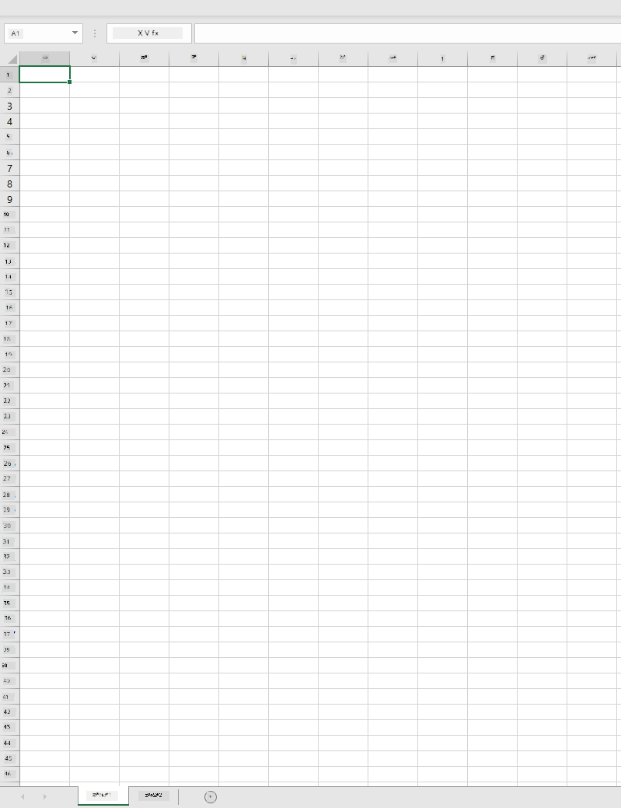
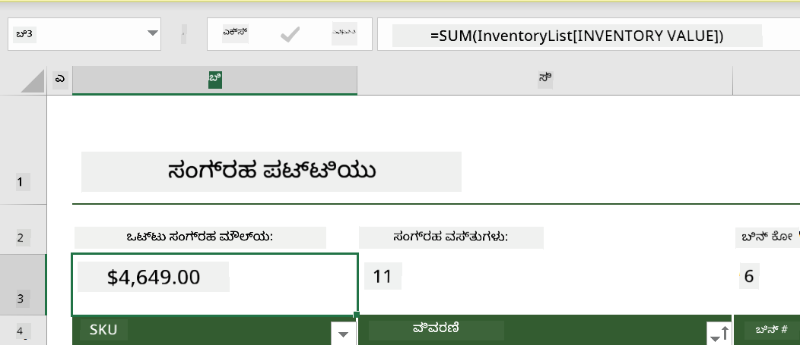
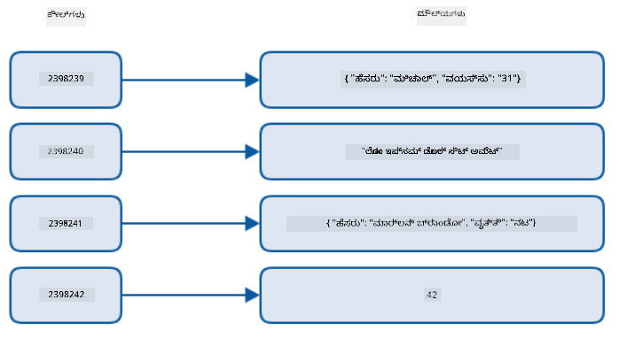
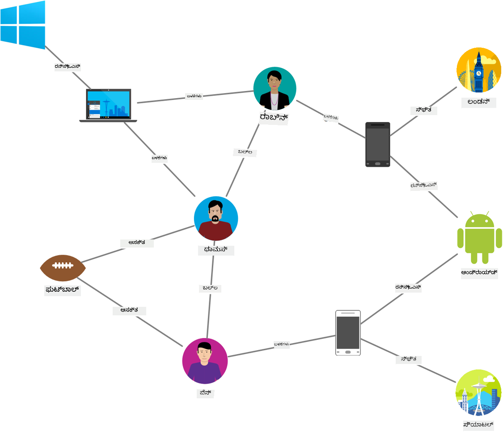
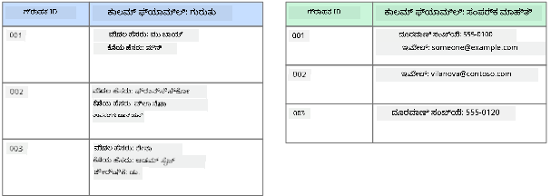
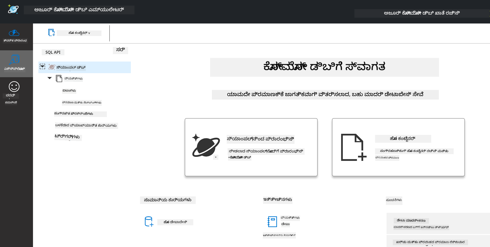
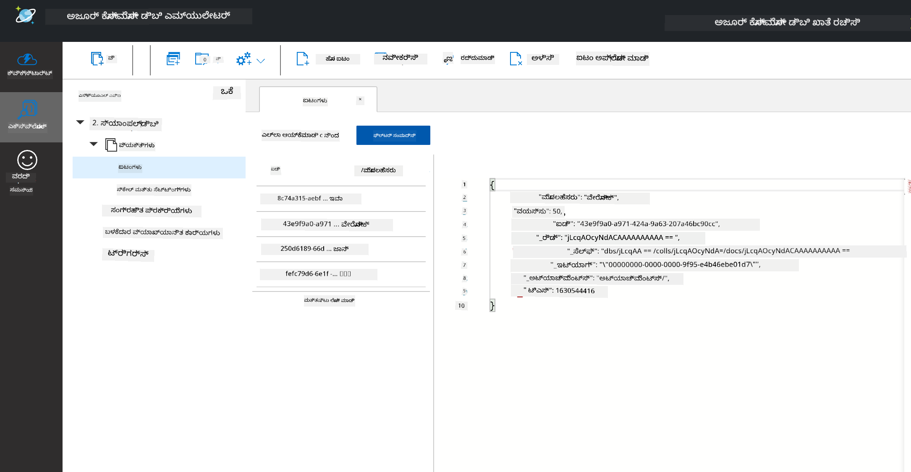
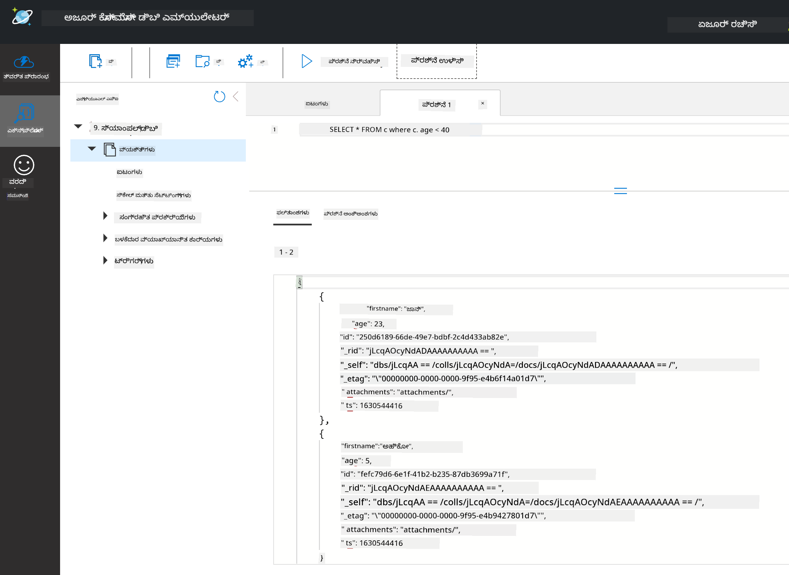

<!--
CO_OP_TRANSLATOR_METADATA:
{
  "original_hash": "c182e87f9f80be7e7cdffc7b40bbfccf",
  "translation_date": "2025-12-19T15:39:41+00:00",
  "source_file": "2-Working-With-Data/06-non-relational/README.md",
  "language_code": "kn"
}
-->
# ಡೇಟಾ ಜೊತೆಗೆ ಕೆಲಸ ಮಾಡುವುದು: ಅಸಂಬಂಧಿತ ಡೇಟಾ

| ಅವರಿಂದ ](../../sketchnotes/06-NoSQL.png)|
|:---:|
|ನೋಎಸ್‌ಕ್ಯೂಎಲ್ ಡೇಟಾ ಜೊತೆಗೆ ಕೆಲಸ - _ಸ್ಕೆಚ್‌ನೋಟ್ [@nitya](https://twitter.com/nitya) ಅವರಿಂದ_ |

## [ಪೂರ್ವ-ಲೇಕ್ಚರ್ ಕ್ವಿಜ್](https://ff-quizzes.netlify.app/en/ds/quiz/10)

ಡೇಟಾ ಸಂಬಂಧಿತ ಡೇಟಾಬೇಸ್‌ಗಳಿಗೆ ಮಾತ್ರ ಸೀಮಿತವಲ್ಲ. ಈ ಪಾಠ ಅಸಂಬಂಧಿತ ಡೇಟಾ ಮೇಲೆ ಕೇಂದ್ರೀಕರಿಸುತ್ತದೆ ಮತ್ತು ಸ್ಪ್ರೆಡ್ಶೀಟ್‌ಗಳು ಮತ್ತು ನೋಎಸ್‌ಕ್ಯೂಎಲ್ ಮೂಲಭೂತಗಳನ್ನು ಒಳಗೊಂಡಿದೆ.

## ಸ್ಪ್ರೆಡ್ಶೀಟ್‌ಗಳು

ಸ್ಪ್ರೆಡ್ಶೀಟ್‌ಗಳು ಡೇಟಾವನ್ನು ಸಂಗ್ರಹಿಸಲು ಮತ್ತು ಅನ್ವೇಷಿಸಲು ಜನಪ್ರಿಯ ವಿಧಾನವಾಗಿವೆ ಏಕೆಂದರೆ ಅದನ್ನು ಸೆಟ್‌ಅಪ್ ಮಾಡುವುದು ಮತ್ತು ಪ್ರಾರಂಭಿಸುವುದು ಕಡಿಮೆ ಕೆಲಸವನ್ನು ಅಗತ್ಯವಿರುತ್ತದೆ. ಈ ಪಾಠದಲ್ಲಿ ನೀವು ಸ್ಪ್ರೆಡ್ಶೀಟ್‌ನ ಮೂಲಭೂತ ಘಟಕಗಳನ್ನು, ಜೊತೆಗೆ ಸೂತ್ರಗಳು ಮತ್ತು ಕಾರ್ಯಗಳನ್ನು ಕಲಿಯುತ್ತೀರಿ. ಉದಾಹರಣೆಗಳು ಮೈಕ್ರೋಸಾಫ್ಟ್ ಎಕ್ಸೆಲ್‌ನೊಂದಿಗೆ ಚಿತ್ರಿತವಾಗಿವೆ, ಆದರೆ ಬಹುತೇಕ ಭಾಗಗಳು ಮತ್ತು ವಿಷಯಗಳು ಇತರ ಸ್ಪ್ರೆಡ್ಶೀಟ್ ಸಾಫ್ಟ್‌ವೇರ್‌ಗಳೊಂದಿಗೆ ಹೋಲಿಕೆಯ ಹೆಸರಿನೊಂದಿಗೆ ಮತ್ತು ಹಂತಗಳೊಂದಿಗೆ ಇರುತ್ತವೆ.



ಸ್ಪ್ರೆಡ್ಶೀಟ್ ಒಂದು ಫೈಲ್ ಆಗಿದ್ದು, ಕಂಪ್ಯೂಟರ್, ಸಾಧನ ಅಥವಾ ಕ್ಲೌಡ್ ಆಧಾರಿತ ಫೈಲ್ ಸಿಸ್ಟಮ್‌ನಲ್ಲಿ ಲಭ್ಯವಿರುತ್ತದೆ. ಸಾಫ್ಟ್‌ವೇರ್ ಸ್ವತಃ ಬ್ರೌಸರ್ ಆಧಾರಿತವಾಗಿರಬಹುದು ಅಥವಾ ಕಂಪ್ಯೂಟರ್‌ನಲ್ಲಿ ಸ್ಥಾಪಿಸಬೇಕಾದ ಅಪ್ಲಿಕೇಶನ್ ಆಗಿರಬಹುದು ಅಥವಾ ಆ್ಯಪ್ ಆಗಿ ಡೌನ್‌ಲೋಡ್ ಮಾಡಬಹುದು. ಎಕ್ಸೆಲ್‌ನಲ್ಲಿ ಈ ಫೈಲ್‌ಗಳನ್ನು **ವರ್ಕ್‌ಬುಕ್‌ಗಳು** ಎಂದು ವ್ಯಾಖ್ಯಾನಿಸಲಾಗುತ್ತದೆ ಮತ್ತು ಈ ಪದವನ್ನು ಈ ಪಾಠದ ಉಳಿದ ಭಾಗದಲ್ಲಿ ಬಳಸಲಾಗುತ್ತದೆ.

ಒಂದು ವರ್ಕ್‌ಬುಕ್ ಒಂದು ಅಥವಾ ಹೆಚ್ಚು **ವರ್ಕ್‌ಶೀಟ್‌ಗಳನ್ನು** ಹೊಂದಿರುತ್ತದೆ, ಪ್ರತಿಯೊಂದು ವರ್ಕ್‌ಶೀಟ್ ಟ್ಯಾಬ್‌ಗಳಿಂದ ಲೇಬಲ್ ಮಾಡಲ್ಪಟ್ಟಿರುತ್ತದೆ. ವರ್ಕ್‌ಶೀಟ್ ಒಳಗೆ **ಸೆಲ್‌ಗಳು** ಎಂಬ ಆಯತಾಕಾರಗಳು ಇರುತ್ತವೆ, ಅವುಗಳಲ್ಲಿ ನಿಜವಾದ ಡೇಟಾ ಇರುತ್ತದೆ. ಸೆಲ್ ಒಂದು ಸಾಲು ಮತ್ತು ಕಾಲಮ್‌ನ ಸಂಧಿ, ಕಾಲಮ್‌ಗಳು ಅಕ್ಷರಗಳಿಂದ ಲೇಬಲ್ ಮಾಡಲ್ಪಟ್ಟಿದ್ದು, ಸಾಲುಗಳು ಸಂಖ್ಯೆಯಿಂದ ಲೇಬಲ್ ಮಾಡಲ್ಪಟ್ಟಿವೆ. ಕೆಲವು ಸ್ಪ್ರೆಡ್ಶೀಟ್‌ಗಳಲ್ಲಿ ಮೊದಲ ಕೆಲವು ಸಾಲುಗಳಲ್ಲಿ ಹೆಡರ್‌ಗಳು ಇರುತ್ತವೆ, ಅವು ಸೆಲ್‌ನಲ್ಲಿನ ಡೇಟಾವನ್ನು ವಿವರಿಸುತ್ತವೆ.

ಈ ಎಕ್ಸೆಲ್ ವರ್ಕ್‌ಬುಕ್‌ನ ಮೂಲಭೂತ ಅಂಶಗಳೊಂದಿಗೆ, ನಾವು [Microsoft Templates](https://templates.office.com/) ನಿಂದ ಇನ್ವೆಂಟರಿ ಮೇಲೆ ಕೇಂದ್ರೀಕರಿಸಿದ ಉದಾಹರಣೆಯನ್ನು ಬಳಸಿಕೊಂಡು ಸ್ಪ್ರೆಡ್ಶೀಟ್‌ನ ಕೆಲವು ಹೆಚ್ಚುವರಿ ಭಾಗಗಳನ್ನು ನೋಡೋಣ.

### ಇನ್ವೆಂಟರಿ ನಿರ್ವಹಣೆ

"InventoryExample" ಎಂಬ ಸ್ಪ್ರೆಡ್ಶೀಟ್ ಫೈಲ್ ಒಂದು ಫಾರ್ಮ್ಯಾಟ್ ಮಾಡಲಾದ ಇನ್ವೆಂಟರಿಯಲ್ಲಿನ ಐಟಂಗಳ ಸ್ಪ್ರೆಡ್ಶೀಟ್ ಆಗಿದ್ದು, ಮೂರು ವರ್ಕ್‌ಶೀಟ್‌ಗಳನ್ನು ಹೊಂದಿದೆ, ಟ್ಯಾಬ್‌ಗಳು "Inventory List", "Inventory Pick List" ಮತ್ತು "Bin Lookup" ಎಂದು ಲೇಬಲ್ ಮಾಡಲ್ಪಟ್ಟಿವೆ. Inventory List ವರ್ಕ್‌ಶೀಟ್‌ನ ಸಾಲು 4 ಹೆಡರ್ ಆಗಿದ್ದು, ಹೆಡರ್ ಕಾಲಮ್‌ನ ಪ್ರತಿಯೊಂದು ಸೆಲ್‌ನ ಮೌಲ್ಯವನ್ನು ವಿವರಿಸುತ್ತದೆ.


ಕೆಲವು ಸಂದರ್ಭಗಳಲ್ಲಿ ಒಂದು ಸೆಲ್ ಇತರ ಸೆಲ್‌ಗಳ ಮೌಲ್ಯಗಳ ಮೇಲೆ ಅವಲಂಬಿತವಾಗಿರುತ್ತದೆ ತನ್ನ ಮೌಲ್ಯವನ್ನು ಉತ್ಪಾದಿಸಲು. Inventory List ಸ್ಪ್ರೆಡ್ಶೀಟ್ ತನ್ನ ಇನ್ವೆಂಟರಿಯಲ್ಲಿನ ಪ್ರತಿಯೊಂದು ಐಟಂನ ವೆಚ್ಚವನ್ನು ಟ್ರ್ಯಾಕ್ ಮಾಡುತ್ತದೆ, ಆದರೆ ನಾವು ಇನ್ವೆಂಟರಿಯಲ್ಲಿನ ಎಲ್ಲವನ್ನೂ ಮೌಲ್ಯವನ್ನು ತಿಳಿಯಬೇಕಾದರೆ? [**ಸೂತ್ರಗಳು**](https://support.microsoft.com/en-us/office/overview-of-formulas-34519a4e-1e8d-4f4b-84d4-d642c4f63263) ಸೆಲ್ ಡೇಟಾದ ಮೇಲೆ ಕ್ರಿಯೆಗಳನ್ನು ನಿರ್ವಹಿಸುತ್ತವೆ ಮತ್ತು ಈ ಉದಾಹರಣೆಯಲ್ಲಿ ಇನ್ವೆಂಟರಿಯ ವೆಚ್ಚವನ್ನು ಲೆಕ್ಕಿಸಲು ಬಳಸಲಾಗುತ್ತದೆ. ಈ ಸ್ಪ್ರೆಡ್ಶೀಟ್ Inventory Value ಕಾಲಮ್‌ನಲ್ಲಿ ಸೂತ್ರವನ್ನು ಬಳಸಿಕೊಂಡು ಪ್ರತಿಯೊಂದು ಐಟಂನ ಮೌಲ್ಯವನ್ನು ಲೆಕ್ಕಿಸುತ್ತದೆ, ಅದು QTY ಹೆಡರ್ ಅಡಿಯಲ್ಲಿ ಇರುವ ಪ್ರಮಾಣ ಮತ್ತು COST ಹೆಡರ್ ಅಡಿಯಲ್ಲಿ ಇರುವ ವೆಚ್ಚಗಳನ್ನು ಗುಣಿಸುವ ಮೂಲಕ ಲೆಕ್ಕಿಸಲಾಗುತ್ತದೆ. ಸೆಲ್ ಮೇಲೆ ಡಬಲ್ ಕ್ಲಿಕ್ ಮಾಡುವುದು ಅಥವಾ ಹೈಲೈಟ್ ಮಾಡುವುದು ಸೂತ್ರವನ್ನು ತೋರಿಸುತ್ತದೆ. ನೀವು ಗಮನಿಸುವಿರಿ ಸೂತ್ರಗಳು ಸಮಾನ ಚಿಹ್ನೆಯಿಂದ ಪ್ರಾರಂಭವಾಗುತ್ತವೆ, ನಂತರ ಲೆಕ್ಕಾಚಾರ ಅಥವಾ ಕಾರ್ಯಾಚರಣೆ ಬರುತ್ತದೆ.



ನಾವು ಇನ್ನೊಂದು ಸೂತ್ರವನ್ನು ಬಳಸಿಕೊಂಡು Inventory Value ನ ಎಲ್ಲಾ ಮೌಲ್ಯಗಳನ್ನು ಸೇರಿಸಿ ಒಟ್ಟು ಮೌಲ್ಯವನ್ನು ಪಡೆಯಬಹುದು. ಇದನ್ನು ಪ್ರತಿ ಸೆಲ್ ಸೇರಿಸುವ ಮೂಲಕ ಲೆಕ್ಕಿಸಬಹುದು, ಆದರೆ ಅದು ಕಷ್ಟಕರ ಕೆಲಸವಾಗಬಹುದು. ಎಕ್ಸೆಲ್ [**ಕಾರ್ಯಗಳು**](https://support.microsoft.com/en-us/office/sum-function-043e1c7d-7726-4e80-8f32-07b23e057f89) ಹೊಂದಿದೆ, ಅಥವಾ ಪೂರ್ವನಿರ್ಧರಿತ ಸೂತ್ರಗಳು, ಸೆಲ್ ಮೌಲ್ಯಗಳ ಮೇಲೆ ಲೆಕ್ಕಾಚಾರಗಳನ್ನು ನಿರ್ವಹಿಸಲು. ಕಾರ್ಯಗಳಿಗೆ ಆರ್ಗ್ಯುಮೆಂಟ್‌ಗಳು ಅಗತ್ಯವಿರುತ್ತವೆ, ಅವು ಲೆಕ್ಕಾಚಾರಗಳನ್ನು ನಿರ್ವಹಿಸಲು ಅಗತ್ಯವಿರುವ ಮೌಲ್ಯಗಳು. ಕಾರ್ಯಗಳಿಗೆ ಒಂದುಕ್ಕಿಂತ ಹೆಚ್ಚು ಆರ್ಗ್ಯುಮೆಂಟ್‌ಗಳು ಬೇಕಾದಾಗ, ಅವುಗಳನ್ನು ನಿರ್ದಿಷ್ಟ ಕ್ರಮದಲ್ಲಿ ಪಟ್ಟಿ ಮಾಡಬೇಕು ಇಲ್ಲದಿದ್ದರೆ ಕಾರ್ಯ ಸರಿಯಾದ ಮೌಲ್ಯವನ್ನು ಲೆಕ್ಕಿಸದು. ಈ ಉದಾಹರಣೆಯಲ್ಲಿ SUM ಕಾರ್ಯವನ್ನು ಬಳಸಲಾಗಿದೆ, ಮತ್ತು Inventory Value ನ ಮೌಲ್ಯಗಳನ್ನು ಆರ್ಗ್ಯುಮೆಂಟ್ ಆಗಿ ಬಳಸಿಕೊಂಡು ಸಾಲು 3, ಕಾಲಮ್ B (B3 ಎಂದು ಕೂಡ ಕರೆಯಲಾಗುತ್ತದೆ) ಅಡಿಯಲ್ಲಿ ಒಟ್ಟು ಮೌಲ್ಯವನ್ನು ಲೆಕ್ಕಿಸುತ್ತದೆ.

## ನೋಎಸ್‌ಕ್ಯೂಎಲ್

ನೋಎಸ್‌ಕ್ಯೂಎಲ್ ಅಸಂಬಂಧಿತ ಡೇಟಾವನ್ನು ಸಂಗ್ರಹಿಸುವ ವಿವಿಧ ವಿಧಾನಗಳಿಗೆ ಒಂದು ಛತ್ರಪಟ ಪದವಾಗಿದೆ ಮತ್ತು ಇದನ್ನು "ನಾನ್-ಎಸ್‌ಕ್ಯೂಎಲ್", "ನಾನ್-ರಿಲೇಶನಲ್" ಅಥವಾ "ನಾಟ್ ಓನ್ಲಿ ಎಸ್‌ಕ್ಯೂಎಲ್" ಎಂದು ಅರ್ಥಮಾಡಿಕೊಳ್ಳಬಹುದು. ಈ ರೀತಿಯ ಡೇಟಾಬೇಸ್ ವ್ಯವಸ್ಥೆಗಳನ್ನು 4 ವಿಧಗಳಲ್ಲಿ ವರ್ಗೀಕರಿಸಬಹುದು.


> ಮೂಲ [ಮಿಚಾಲ್ ಬಿಯಾಲೆಕಿ ಬ್ಲಾಗ್](https://www.michalbialecki.com/2018/03/18/azure-cosmos-db-key-value-database-cloud/)

[ಕೀ-ಮೌಲ್ಯ](https://docs.microsoft.com/en-us/azure/architecture/data-guide/big-data/non-relational-data#keyvalue-data-stores) ಡೇಟಾಬೇಸ್‌ಗಳು ವಿಶಿಷ್ಟ ಕೀಲಿಗಳನ್ನು ಜೋಡಿಸುತ್ತವೆ, ಅವು ಮೌಲ್ಯಕ್ಕೆ ಸಂಬಂಧಿಸಿದ ವಿಶಿಷ್ಟ ಗುರುತಿಸುವಿಕೆ. ಈ ಜೋಡಿಗಳು [ಹ್ಯಾಶ್ ಟೇಬಲ್](https://www.hackerearth.com/practice/data-structures/hash-tables/basics-of-hash-tables/tutorial/) ಬಳಸಿ ಸೂಕ್ತ ಹ್ಯಾಶಿಂಗ್ ಕಾರ್ಯಾಚರಣೆಯೊಂದಿಗೆ ಸಂಗ್ರಹಿಸಲಾಗುತ್ತವೆ.


> ಮೂಲ [ಮೈಕ್ರೋಸಾಫ್ಟ್](https://docs.microsoft.com/en-us/azure/cosmos-db/graph/graph-introduction#graph-database-by-example)

[ಗ್ರಾಫ್](https://docs.microsoft.com/en-us/azure/architecture/data-guide/big-data/non-relational-data#graph-data-stores) ಡೇಟಾಬೇಸ್‌ಗಳು ಡೇಟಾದಲ್ಲಿನ ಸಂಬಂಧಗಳನ್ನು ವರ್ಣಿಸುತ್ತವೆ ಮತ್ತು ನೋಡ್‌ಗಳು ಮತ್ತು ಎಡ್ಜ್‌ಗಳ ಸಂಗ್ರಹವಾಗಿ ಪ್ರತಿನಿಧಿಸಲಾಗುತ್ತವೆ. ನೋಡ್ ಒಂದು ಘಟಕವನ್ನು ಪ್ರತಿನಿಧಿಸುತ್ತದೆ, ಅದು ನಿಜಜೀವನದಲ್ಲಿ ಇರುವ ಏನಾದರೂ, ಉದಾಹರಣೆಗೆ ವಿದ್ಯಾರ್ಥಿ ಅಥವಾ ಬ್ಯಾಂಕ್ ಸ್ಟೇಟ್ಮೆಂಟ್. ಎಡ್ಜ್‌ಗಳು ಎರಡು ಘಟಕಗಳ ನಡುವಿನ ಸಂಬಂಧವನ್ನು ಪ್ರತಿನಿಧಿಸುತ್ತವೆ. ಪ್ರತಿಯೊಂದು ನೋಡ್ ಮತ್ತು ಎಡ್ಜ್‌ಗಳಿಗೆ ಗುಣಲಕ್ಷಣಗಳಿವೆ, ಅವು ಪ್ರತಿ ನೋಡ್ ಮತ್ತು ಎಡ್ಜ್ ಬಗ್ಗೆ ಹೆಚ್ಚುವರಿ ಮಾಹಿತಿಯನ್ನು ಒದಗಿಸುತ್ತವೆ.



[ಕಾಲಮ್ನರ್](https://docs.microsoft.com/en-us/azure/architecture/data-guide/big-data/non-relational-data#columnar-data-stores) ಡೇಟಾ ಸ್ಟೋರ್‌ಗಳು ಡೇಟಾವನ್ನು ಕಾಲಮ್‌ಗಳು ಮತ್ತು ಸಾಲುಗಳಾಗಿ ಸಂಘಟಿಸುತ್ತವೆ relational data structure ಹಾಗೆ, ಆದರೆ ಪ್ರತಿಯೊಂದು ಕಾಲಮ್ ಅನ್ನು ಕಾಲಮ್ ಕುಟುಂಬ ಎಂದು ಕರೆಯುವ ಗುಂಪುಗಳಾಗಿ ವಿಭಜಿಸಲಾಗುತ್ತದೆ, ಅಲ್ಲಿ ಒಂದು ಕಾಲಮ್ ಅಡಿಯಲ್ಲಿ ಇರುವ ಎಲ್ಲಾ ಡೇಟಾ ಸಂಬಂಧಿತವಾಗಿದ್ದು, ಒಂದು ಘಟಕದಲ್ಲಿ ಪಡೆಯಬಹುದು ಮತ್ತು ಬದಲಾಯಿಸಬಹುದು.

### ಅಜೂರ್ ಕೋಸ್ಮೋಸ್ ಡಿಬಿ ಜೊತೆಗೆ ಡಾಕ್ಯುಮೆಂಟ್ ಡೇಟಾ ಸ್ಟೋರ್‌ಗಳು

[ಡಾಕ್ಯುಮೆಂಟ್](https://docs.microsoft.com/en-us/azure/architecture/data-guide/big-data/non-relational-data#document-data-stores) ಡೇಟಾ ಸ್ಟೋರ್‌ಗಳು ಕೀ-ಮೌಲ್ಯ ಡೇಟಾ ಸ್ಟೋರ್‌ನ ಕಲ್ಪನೆ ಮೇಲೆ ನಿರ್ಮಿತವಾಗಿದ್ದು, ಫೀಲ್ಡ್‌ಗಳು ಮತ್ತು ವಸ್ತುಗಳ ಸರಣಿಯಿಂದ ಕೂಡಿವೆ. ಈ ವಿಭಾಗದಲ್ಲಿ ಕೋಸ್ಮೋಸ್ ಡಿಬಿ ಎಮ್ಯುಲೇಟರ್‌ನೊಂದಿಗೆ ಡಾಕ್ಯುಮೆಂಟ್ ಡೇಟಾಬೇಸ್‌ಗಳನ್ನು ಅನ್ವೇಷಿಸಲಾಗುತ್ತದೆ.

ಕೋಸ್ಮೋಸ್ ಡಿಬಿ ಡೇಟಾಬೇಸ್ "ನಾಟ್ ಓನ್ಲಿ SQL" ವ್ಯಾಖ್ಯಾನಕ್ಕೆ ಹೊಂದಿಕೆಯಾಗುತ್ತದೆ, ಅಲ್ಲಿ ಕೋಸ್ಮೋಸ್ ಡಿಬಿ ಡಾಕ್ಯುಮೆಂಟ್ ಡೇಟಾಬೇಸ್ ಡೇಟಾವನ್ನು ಪ್ರಶ್ನಿಸಲು SQL ಮೇಲೆ ಅವಲಂಬಿತವಾಗಿದೆ. [ಹಿಂದಿನ ಪಾಠ](../05-relational-databases/README.md) SQL ಭಾಷೆಯ ಮೂಲಭೂತಗಳನ್ನು ಒಳಗೊಂಡಿದೆ, ಮತ್ತು ನಾವು ಕೆಲವು ಅದೇ ಪ್ರಶ್ನೆಗಳನ್ನು ಇಲ್ಲಿ ಡಾಕ್ಯುಮೆಂಟ್ ಡೇಟಾಬೇಸ್‌ಗೆ ಅನ್ವಯಿಸಬಹುದು. ನಾವು ಕೋಸ್ಮೋಸ್ ಡಿಬಿ ಎಮ್ಯುಲೇಟರ್ ಅನ್ನು ಬಳಸಲಿದ್ದೇವೆ, ಇದು ಕಂಪ್ಯೂಟರ್‌ನಲ್ಲಿ ಸ್ಥಳೀಯವಾಗಿ ಡಾಕ್ಯುಮೆಂಟ್ ಡೇಟಾಬೇಸ್ ರಚಿಸಲು ಮತ್ತು ಅನ್ವೇಷಿಸಲು ಅನುಮತಿಸುತ್ತದೆ. ಎಮ್ಯುಲೇಟರ್ ಬಗ್ಗೆ ಹೆಚ್ಚಿನ ಮಾಹಿತಿಗಾಗಿ [ಇಲ್ಲಿ](https://docs.microsoft.com/en-us/azure/cosmos-db/local-emulator?tabs=ssl-netstd21) ಓದಿ.

ಡಾಕ್ಯುಮೆಂಟ್ ಫೀಲ್ಡ್‌ಗಳು ಮತ್ತು ವಸ್ತು ಮೌಲ್ಯಗಳ ಸಂಗ್ರಹವಾಗಿದ್ದು, ಫೀಲ್ಡ್‌ಗಳು ವಸ್ತು ಮೌಲ್ಯವು ಏನು ಪ್ರತಿನಿಧಿಸುತ್ತದೆ ಎಂದು ವಿವರಿಸುತ್ತವೆ. ಕೆಳಗಿನ ಉದಾಹರಣೆ ಒಂದು ಡಾಕ್ಯುಮೆಂಟ್.

```json
{
    "firstname": "Eva",
    "age": 44,
    "id": "8c74a315-aebf-4a16-bb38-2430a9896ce5",
    "_rid": "bHwDAPQz8s0BAAAAAAAAAA==",
    "_self": "dbs/bHwDAA==/colls/bHwDAPQz8s0=/docs/bHwDAPQz8s0BAAAAAAAAAA==/",
    "_etag": "\"00000000-0000-0000-9f95-010a691e01d7\"",
    "_attachments": "attachments/",
    "_ts": 1630544034
}
```

ಈ ಡಾಕ್ಯುಮೆಂಟ್‌ನ ಆಸಕ್ತಿಯ ಫೀಲ್ಡ್‌ಗಳು: `firstname`, `id`, ಮತ್ತು `age`. ಉಳಿದ ಫೀಲ್ಡ್‌ಗಳು ಅಂಡರ್ಸ್ಕೋರ್‌ಗಳೊಂದಿಗೆ ಕೋಸ್ಮೋಸ್ ಡಿಬಿ ಮೂಲಕ ರಚಿಸಲ್ಪಟ್ಟಿವೆ.

#### ಕೋಸ್ಮೋಸ್ ಡಿಬಿ ಎಮ್ಯುಲೇಟರ್‌ನೊಂದಿಗೆ ಡೇಟಾ ಅನ್ವೇಷಣೆ

ನೀವು ಎಮ್ಯುಲೇಟರ್ ಅನ್ನು [ವಿಂಡೋಸ್‌ಗಾಗಿ ಇಲ್ಲಿ ಡೌನ್‌ಲೋಡ್ ಮತ್ತು ಸ್ಥಾಪಿಸಬಹುದು](https://aka.ms/cosmosdb-emulator). macOS ಮತ್ತು ಲಿನಕ್ಸ್ಗಾಗಿ ಎಮ್ಯುಲೇಟರ್ ಅನ್ನು ಹೇಗೆ ಚಾಲನೆ ಮಾಡುವುದು ಎಂಬ ಆಯ್ಕೆಗಳಿಗೆ ಈ [ದಾಖಲೆ](https://docs.microsoft.com/en-us/azure/cosmos-db/local-emulator?tabs=ssl-netstd21#run-on-linux-macos) ನೋಡಿ.

ಎಮ್ಯುಲೇಟರ್ ಬ್ರೌಸರ್ ವಿಂಡೋವನ್ನು ಪ್ರಾರಂಭಿಸುತ್ತದೆ, ಅಲ್ಲಿ ಎಕ್ಸ್‌ಪ್ಲೋರರ್ ವೀಕ್ಷಣೆ ನಿಮಗೆ ಡಾಕ್ಯುಮೆಂಟ್‌ಗಳನ್ನು ಅನ್ವೇಷಿಸಲು ಅನುಮತಿಸುತ್ತದೆ.



ನೀವು ಅನುಸರಿಸುತ್ತಿದ್ದರೆ, "Start with Sample" ಕ್ಲಿಕ್ ಮಾಡಿ SampleDB ಎಂಬ ಮಾದರಿ ಡೇಟಾಬೇಸ್ ರಚಿಸಿ. Sample DB ಅನ್ನು ವಿಸ್ತರಿಸಿದರೆ, `Persons` ಎಂಬ ಕಂಟೈನರ್ ಕಂಡುಬರುತ್ತದೆ, ಕಂಟೈನರ್ ಐಟಂಗಳ ಸಂಗ್ರಹವನ್ನು ಹೊಂದಿದೆ, ಅವು ಡಾಕ್ಯುಮೆಂಟ್‌ಗಳು. ನೀವು `Items` ಅಡಿಯಲ್ಲಿ ನಾಲ್ಕು ವೈಯಕ್ತಿಕ ಡಾಕ್ಯುಮೆಂಟ್‌ಗಳನ್ನು ಅನ್ವೇಷಿಸಬಹುದು.



#### ಕೋಸ್ಮೋಸ್ ಡಿಬಿ ಎಮ್ಯುಲೇಟರ್‌ನೊಂದಿಗೆ ಡಾಕ್ಯುಮೆಂಟ್ ಡೇಟಾ ಪ್ರಶ್ನಿಸುವುದು

ನಾವು ಹೊಸ SQL Query ಬಟನ್ (ಎಡದಿಂದ ಎರಡನೇ ಬಟನ್) ಕ್ಲಿಕ್ ಮಾಡಿ ಮಾದರಿ ಡೇಟಾವನ್ನು ಪ್ರಶ್ನಿಸಬಹುದು.

`SELECT * FROM c` ಕಂಟೈನರ್‌ನಲ್ಲಿನ ಎಲ್ಲಾ ಡಾಕ್ಯುಮೆಂಟ್‌ಗಳನ್ನು ಹಿಂತಿರುಗಿಸುತ್ತದೆ. ನಾವು ಒಂದು where ಕ್ಲಾಜ್ ಸೇರಿಸಿ 40 ಕ್ಕಿಂತ ಕಡಿಮೆ ವಯಸ್ಸಿನವರನ್ನು ಹುಡುಕೋಣ.

`SELECT * FROM c where c.age < 40`

 

ಪ್ರಶ್ನೆ ಎರಡು ಡಾಕ್ಯುಮೆಂಟ್‌ಗಳನ್ನು ಹಿಂತಿರುಗಿಸುತ್ತದೆ, ಪ್ರತಿ ಡಾಕ್ಯುಮೆಂಟ್‌ನ ವಯಸ್ಸು ಮೌಲ್ಯ 40 ಕ್ಕಿಂತ ಕಡಿಮೆ ಇದೆ.

#### JSON ಮತ್ತು ಡಾಕ್ಯುಮೆಂಟ್‌ಗಳು

ನೀವು ಜಾವಾಸ್ಕ್ರಿಪ್ಟ್ ಆಬ್ಜೆಕ್ಟ್ ನೋಟೇಶನ್ (JSON) ಗೆ ಪರಿಚಿತರಾಗಿದ್ದರೆ, ಡಾಕ್ಯುಮೆಂಟ್‌ಗಳು JSON ಗೆ ಹೋಲುತ್ತವೆ ಎಂದು ಗಮನಿಸುವಿರಿ. ಈ ಡೈರೆಕ್ಟರಿಯಲ್ಲಿ `PersonsData.json` ಫೈಲ್ ಇದೆ, ಅದನ್ನು ನೀವು ಎಮ್ಯುಲೇಟರ್‌ನ Persons ಕಂಟೈನರ್‌ಗೆ `Upload Item` ಬಟನ್ ಮೂಲಕ ಅಪ್‌ಲೋಡ್ ಮಾಡಬಹುದು.

ಬಹುತೇಕ ಸಂದರ್ಭಗಳಲ್ಲಿ, JSON ಡೇಟಾವನ್ನು ಹಿಂತಿರುಗಿಸುವ API ಗಳು ನೇರವಾಗಿ ಡಾಕ್ಯುಮೆಂಟ್ ಡೇಟಾಬೇಸ್‌ಗಳಲ್ಲಿ ವರ್ಗಾಯಿಸಬಹುದು ಮತ್ತು ಸಂಗ್ರಹಿಸಬಹುದು. ಕೆಳಗಿನ ಮತ್ತೊಂದು ಡಾಕ್ಯುಮೆಂಟ್, ಇದು ಮೈಕ್ರೋಸಾಫ್ಟ್ ಟ್ವಿಟ್ಟರ್ ಖಾತೆಯಿಂದ ಪಡೆದ ಟ್ವೀಟ್‌ಗಳನ್ನು ಪ್ರತಿನಿಧಿಸುತ್ತದೆ, ಅದು ಟ್ವಿಟ್ಟರ್ API ಬಳಸಿ ಪಡೆದ ನಂತರ ಕೋಸ್ಮೋಸ್ ಡಿಬಿ ಗೆ ಸೇರಿಸಲಾಗಿದೆ.

```json
{
    "created_at": "2021-08-31T19:03:01.000Z",
    "id": "1432780985872142341",
    "text": "Blank slate. Like this tweet if you’ve ever painted in Microsoft Paint before. https://t.co/cFeEs8eOPK",
    "_rid": "dhAmAIUsA4oHAAAAAAAAAA==",
    "_self": "dbs/dhAmAA==/colls/dhAmAIUsA4o=/docs/dhAmAIUsA4oHAAAAAAAAAA==/",
    "_etag": "\"00000000-0000-0000-9f84-a0958ad901d7\"",
    "_attachments": "attachments/",
    "_ts": 1630537000
```

ಈ ಡಾಕ್ಯುಮೆಂಟ್‌ನ ಆಸಕ್ತಿಯ ಫೀಲ್ಡ್‌ಗಳು: `created_at`, `id`, ಮತ್ತು `text`.

## 🚀 ಸವಾಲು

`TwitterData.json` ಫೈಲ್ ಇದೆ, ಅದನ್ನು ನೀವು SampleDB ಡೇಟಾಬೇಸ್‌ಗೆ ಅಪ್‌ಲೋಡ್ ಮಾಡಬಹುದು. ಅದನ್ನು ಬೇರೆ ಕಂಟೈನರ್‌ಗೆ ಸೇರಿಸುವುದು ಶಿಫಾರಸು ಮಾಡಲಾಗಿದೆ. ಇದನ್ನು ಈ ರೀತಿಯಲ್ಲಿ ಮಾಡಬಹುದು:

1. ಮೇಲ್ಭಾಗದ ಬಲಭಾಗದಲ್ಲಿ ಹೊಸ ಕಂಟೈನರ್ ಬಟನ್ ಕ್ಲಿಕ್ ಮಾಡಿ
1. ಇExisting ಡೇಟಾಬೇಸ್ (SampleDB) ಆಯ್ಕೆ ಮಾಡಿ, ಕಂಟೈನರ್ ಐಡಿ ರಚಿಸಿ
1. ಪಾರ್ಟಿಷನ್ ಕೀ ಅನ್ನು `/id` ಗೆ ಸೆಟ್ ಮಾಡಿ
1. OK ಕ್ಲಿಕ್ ಮಾಡಿ (ಈ ವೀಕ್ಷಣೆಯಲ್ಲಿ ಉಳಿದ ಮಾಹಿತಿಯನ್ನು ನಿರ್ಲಕ್ಷಿಸಬಹುದು ಏಕೆಂದರೆ ಇದು ನಿಮ್ಮ ಯಂತ್ರದಲ್ಲಿ ಸ್ಥಳೀಯವಾಗಿ ಚಲಿಸುವ ಸಣ್ಣ ಡೇಟಾಸೆಟ್)
1. ನಿಮ್ಮ ಹೊಸ ಕಂಟೈನರ್ ತೆರೆಯಿರಿ ಮತ್ತು `Upload Item` ಬಟನ್ ಬಳಸಿ Twitter Data ಫೈಲ್ ಅಪ್‌ಲೋಡ್ ಮಾಡಿ

ಮೈಕ್ರೋಸಾಫ್ಟ್ ಎಂಬ ಪದವು `text` ಫೀಲ್ಡ್‌ನಲ್ಲಿ ಇರುವ ಡಾಕ್ಯುಮೆಂಟ್‌ಗಳನ್ನು ಹುಡುಕಲು ಕೆಲವು SELECT ಪ್ರಶ್ನೆಗಳನ್ನು ನಡೆಸಿ. ಸೂಚನೆ: [LIKE ಕೀವರ್ಡ್](https://docs.microsoft.com/en-us/azure/cosmos-db/sql/sql-query-keywords#using-like-with-the--wildcard-character) ಬಳಸಿ ಪ್ರಯತ್ನಿಸಿ.

## [ಪೋಸ್ಟ್-ಲೇಕ್ಚರ್ ಕ್ವಿಜ್](https://ff-quizzes.netlify.app/en/ds/quiz/11)

## ವಿಮರ್ಶೆ ಮತ್ತು ಸ್ವಯಂ ಅಧ್ಯಯನ

- ಈ ಸ್ಪ್ರೆಡ್ಶೀಟ್‌ಗೆ ಕೆಲವು ಹೆಚ್ಚುವರಿ ಫಾರ್ಮ್ಯಾಟಿಂಗ್ ಮತ್ತು ವೈಶಿಷ್ಟ್ಯಗಳು ಸೇರಿಸಲಾಗಿದೆ, ಈ ಪಾಠದಲ್ಲಿ ಅವುಗಳನ್ನು ಒಳಗೊಂಡಿಲ್ಲ. ನೀವು ಹೆಚ್ಚಿನದನ್ನು ಕಲಿಯಲು ಆಸಕ್ತರಾಗಿದ್ದರೆ ಮೈಕ್ರೋಸಾಫ್ಟ್ [ವಿಸ್ತೃತ ಡಾಕ್ಯುಮೆಂಟೇಶನ್ ಮತ್ತು ವೀಡಿಯೋಗಳ ಗ್ರಂಥಾಲಯ](https://support.microsoft.com/excel) ಹೊಂದಿದೆ.

- ಈ ವಾಸ್ತುಶಿಲ್ಪ ಡಾಕ್ಯುಮೆಂಟೇಶನ್ ಅಸಂಬಂಧಿತ ಡೇಟಾದ ವಿವಿಧ ವಿಧಗಳ ಲಕ್ಷಣಗಳನ್ನು ವಿವರಿಸುತ್ತದೆ: [ಅಸಂಬಂಧಿತ ಡೇಟಾ ಮತ್ತು ನೋಎಸ್‌ಕ್ಯೂಎಲ್](https://docs.microsoft.com/en-us/azure/architecture/data-guide/big-data/non-relational-data)

- ಕೋಸ್ಮೋಸ್ ಡಿಬಿ ಒಂದು ಕ್ಲೌಡ್ ಆಧಾರಿತ ಅಸಂಬಂಧಿತ ಡೇಟಾಬೇಸ್ ಆಗಿದ್ದು, ಈ ಪಾಠದಲ್ಲಿ ಉಲ್ಲೇಖಿಸಲಾದ ವಿವಿಧ ನೋಎಸ್‌ಕ್ಯೂಎಲ್ ವಿಧಗಳನ್ನು ಸಂಗ್ರಹಿಸಬಹುದು. ಈ ವಿಧಗಳ ಬಗ್ಗೆ ಹೆಚ್ಚಿನದನ್ನು ಈ [ಕೋಸ್ಮೋಸ್ ಡಿಬಿ ಮೈಕ್ರೋಸಾಫ್ಟ್ ಲರ್ನ್ ಮೋಡ್ಯೂಲ್](https://docs.microsoft.com/en-us/learn/paths/work-with-nosql-data-in-azure-cosmos-db/) ನಲ್ಲಿ ತಿಳಿಯಿರಿ.

## ನಿಯೋಜನೆ

[Soda Profits](assignment.md)

---

<!-- CO-OP TRANSLATOR DISCLAIMER START -->
**ಅಸ್ವೀಕರಣ**:  
ಈ ದಸ್ತಾವೇಜು [Co-op Translator](https://github.com/Azure/co-op-translator) ಎಂಬ AI ಅನುವಾದ ಸೇವೆಯನ್ನು ಬಳಸಿ ಅನುವಾದಿಸಲಾಗಿದೆ. ನಾವು ಶುದ್ಧತೆಯತ್ತ ಪ್ರಯತ್ನಿಸುತ್ತಿದ್ದರೂ, ಸ್ವಯಂಚಾಲಿತ ಅನುವಾದಗಳಲ್ಲಿ ತಪ್ಪುಗಳು ಅಥವಾ ಅಸತ್ಯತೆಗಳು ಇರಬಹುದು ಎಂದು ದಯವಿಟ್ಟು ಗಮನಿಸಿ. ಮೂಲ ಭಾಷೆಯಲ್ಲಿರುವ ಮೂಲ ದಸ್ತಾವೇಜನ್ನು ಅಧಿಕೃತ ಮೂಲವೆಂದು ಪರಿಗಣಿಸಬೇಕು. ಮಹತ್ವದ ಮಾಹಿತಿಗಾಗಿ, ವೃತ್ತಿಪರ ಮಾನವ ಅನುವಾದವನ್ನು ಶಿಫಾರಸು ಮಾಡಲಾಗುತ್ತದೆ. ಈ ಅನುವಾದ ಬಳಕೆಯಿಂದ ಉಂಟಾಗುವ ಯಾವುದೇ ತಪ್ಪು ಅರ್ಥಮಾಡಿಕೊಳ್ಳುವಿಕೆ ಅಥವಾ ತಪ್ಪು ವಿವರಣೆಗಳಿಗೆ ನಾವು ಹೊಣೆಗಾರರಾಗುವುದಿಲ್ಲ.
<!-- CO-OP TRANSLATOR DISCLAIMER END -->