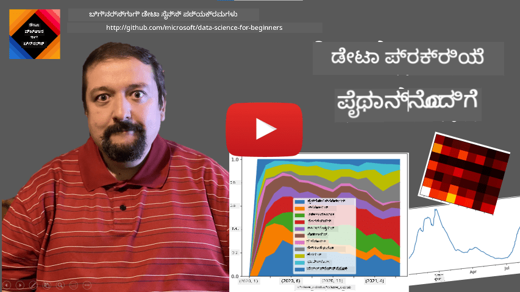
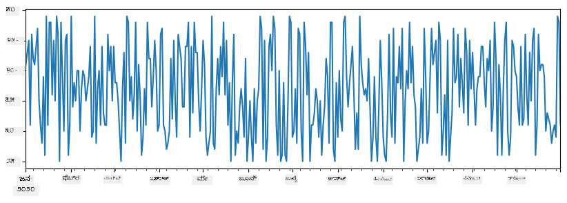
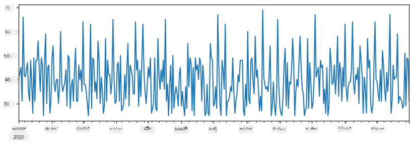
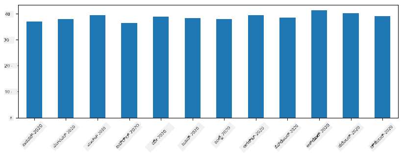
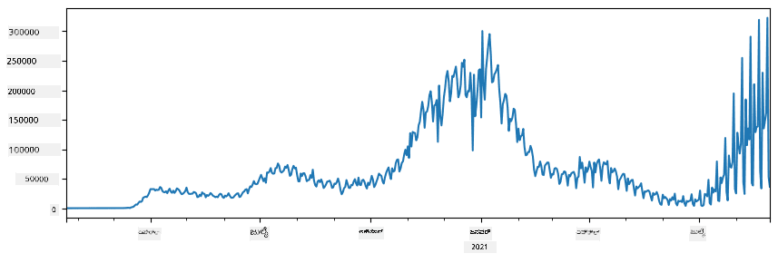
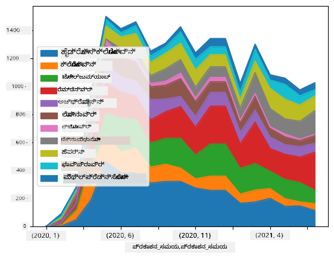

<!--
CO_OP_TRANSLATOR_METADATA:
{
  "original_hash": "7bfec050f4717dcc2dfd028aca9d21f3",
  "translation_date": "2025-12-19T15:34:55+00:00",
  "source_file": "2-Working-With-Data/07-python/README.md",
  "language_code": "kn"
}
-->
# ಡೇಟಾ ಜೊತೆ ಕೆಲಸ ಮಾಡುವುದು: ಪೈಥಾನ್ ಮತ್ತು ಪಾಂಡಾಸ್ ಲೈಬ್ರರಿ

|  ಅವರ ಸ್ಕೆಚ್ ನೋಟ್ ](../../sketchnotes/07-WorkWithPython.png) |
| :-------------------------------------------------------------------------------------------------------: |
|                 ಪೈಥಾನ್ ಜೊತೆ ಕೆಲಸ ಮಾಡುವುದು - _[@nitya](https://twitter.com/nitya) ಅವರ ಸ್ಕೆಚ್ ನೋಟ್_                 |

[](https://youtu.be/dZjWOGbsN4Y)

ಡೇಟಾಬೇಸ್‌ಗಳು ಡೇಟಾವನ್ನು ಸಂಗ್ರಹಿಸಲು ಮತ್ತು ಕ್ವೇರಿ ಭಾಷೆಗಳನ್ನು ಬಳಸಿ ಅವುಗಳನ್ನು ಪ್ರಶ್ನಿಸಲು ಅತ್ಯಂತ ಪರಿಣಾಮಕಾರಿಯಾದ ಮಾರ್ಗಗಳನ್ನು ನೀಡುತ್ತವೆ, ಆದರೆ ಡೇಟಾ ಪ್ರಕ್ರಿಯೆಗೊಳಿಸುವ ಅತ್ಯಂತ ಲವಚಿಕ ಮಾರ್ಗವೆಂದರೆ ನಿಮ್ಮದೇ ಪ್ರೋಗ್ರಾಂ ಬರೆಯುವುದು. ಬಹುಶಃ ಬಹಳ ಸಂದರ್ಭಗಳಲ್ಲಿ ಡೇಟಾಬೇಸ್ ಕ್ವೇರಿ ಮಾಡುವುದು ಹೆಚ್ಚು ಪರಿಣಾಮಕಾರಿಯಾಗಿರುತ್ತದೆ. ಆದರೆ ಕೆಲವು ಸಂದರ್ಭಗಳಲ್ಲಿ ಹೆಚ್ಚು ಸಂಕೀರ್ಣ ಡೇಟಾ ಪ್ರಕ್ರಿಯೆಗೊಳಿಸುವಿಕೆ ಅಗತ್ಯವಿದ್ದಾಗ, ಅದನ್ನು SQL ಬಳಸಿ ಸುಲಭವಾಗಿ ಮಾಡಲಾಗುವುದಿಲ್ಲ.  
ಡೇಟಾ ಪ್ರಕ್ರಿಯೆಗೊಳಿಸುವಿಕೆ ಯಾವುದೇ ಪ್ರೋಗ್ರಾಮಿಂಗ್ ಭಾಷೆಯಲ್ಲಿ ಮಾಡಬಹುದು, ಆದರೆ ಡೇಟಾ ಜೊತೆ ಕೆಲಸ ಮಾಡಲು ಕೆಲವು ಭಾಷೆಗಳು ಹೆಚ್ಚಿನ ಮಟ್ಟದಲ್ಲಿವೆ. ಡೇಟಾ ವಿಜ್ಞಾನಿಗಳು ಸಾಮಾನ್ಯವಾಗಿ ಕೆಳಗಿನ ಭಾಷೆಗಳಲ್ಲೊಂದು ಆಯ್ಕೆಮಾಡುತ್ತಾರೆ:

* **[Python](https://www.python.org/)**, ಸಾಮಾನ್ಯ ಉದ್ದೇಶದ ಪ್ರೋಗ್ರಾಮಿಂಗ್ ಭಾಷೆ, ಸರಳತೆಯಿಂದಾಗಿ ಆರಂಭಿಕರಿಗೆ ಅತ್ಯುತ್ತಮ ಆಯ್ಕೆಯಾಗಿ ಪರಿಗಣಿಸಲಾಗುತ್ತದೆ. ಪೈಥಾನ್‌ನಲ್ಲಿ ಅನೇಕ ಹೆಚ್ಚುವರಿ ಲೈಬ್ರರಿಗಳು ಇವೆ, ಉದಾಹರಣೆಗೆ ZIP ಆರ್ಕೈವ್‌ನಿಂದ ಡೇಟಾ ಹೊರತೆಗೆಯುವುದು ಅಥವಾ ಚಿತ್ರವನ್ನು ಗ್ರೇಸ್ಕೇಲ್‌ಗೆ ಪರಿವರ್ತಿಸುವುದು. ಡೇಟಾ ವಿಜ್ಞಾನಕ್ಕಿಂತ ಹೊರತು, ಪೈಥಾನ್ ವೆಬ್ ಅಭಿವೃದ್ಧಿಗೆ ಸಹ ಬಳಸಲಾಗುತ್ತದೆ.
* **[R](https://www.r-project.org/)** ಸಾಂಖ್ಯಿಕ ಡೇಟಾ ಪ್ರಕ್ರಿಯೆಗೊಳಿಸುವಿಕೆಗೆ ವಿನ್ಯಾಸಗೊಳಿಸಿದ ಪರಂಪರাগত ಉಪಕರಣ. ಇದರಲ್ಲಿ ದೊಡ್ಡ ಲೈಬ್ರರಿ ಸಂಗ್ರಹ (CRAN) ಇದೆ, ಇದು ಡೇಟಾ ಪ್ರಕ್ರಿಯೆಗೊಳಿಸುವಿಕೆಗೆ ಉತ್ತಮ ಆಯ್ಕೆ. ಆದರೆ R ಸಾಮಾನ್ಯ ಉದ್ದೇಶದ ಪ್ರೋಗ್ರಾಮಿಂಗ್ ಭಾಷೆ ಅಲ್ಲ ಮತ್ತು ಡೇಟಾ ವಿಜ್ಞಾನ ಕ್ಷೇತ್ರದ ಹೊರಗೆ ಕಡಿಮೆ ಬಳಕೆಯಾಗುತ್ತದೆ.
* **[Julia](https://julialang.org/)** ಡೇಟಾ ವಿಜ್ಞಾನಕ್ಕಾಗಿ ವಿಶೇಷವಾಗಿ ಅಭಿವೃದ್ಧಿಪಡಿಸಲಾದ ಮತ್ತೊಂದು ಭಾಷೆ. ಇದು ಪೈಥಾನ್‌ಗಿಂತ ಉತ್ತಮ ಕಾರ್ಯಕ್ಷಮತೆಯನ್ನು ನೀಡಲು ಉದ್ದೇಶಿಸಲಾಗಿದೆ, ವಿಜ್ಞಾನಾತ್ಮಕ ಪ್ರಯೋಗಗಳಿಗೆ ಅದ್ಭುತ ಸಾಧನ.

ಈ ಪಾಠದಲ್ಲಿ, ನಾವು ಸರಳ ಡೇಟಾ ಪ್ರಕ್ರಿಯೆಗೊಳಿಸುವಿಕೆಗೆ ಪೈಥಾನ್ ಬಳಕೆಯ ಮೇಲೆ ಗಮನಹರಿಸುವೆವು. ಭಾಷೆಯ ಮೂಲಭೂತ ಪರಿಚಯವನ್ನು ನಾವು ಊಹಿಸುವೆವು. ಪೈಥಾನ್‌ನ ಗಾಢವಾದ ಪ್ರವಾಸಕ್ಕಾಗಿ, ನೀವು ಕೆಳಗಿನ ಸಂಪನ್ಮೂಲಗಳನ್ನು ನೋಡಿ:

* [ಟರ್ಟಲ್ ಗ್ರಾಫಿಕ್ಸ್ ಮತ್ತು ಫ್ರ್ಯಾಕ್ಟಲ್ಸ್ ಜೊತೆಗೆ ಪೈಥಾನ್ ಕಲಿಯಿರಿ](https://github.com/shwars/pycourse) - GitHub ಆಧಾರಿತ ಪೈಥಾನ್ ಪ್ರೋಗ್ರಾಮಿಂಗ್ ತ್ವರಿತ ಪರಿಚಯ ಕೋರ್ಸ್
* [ಪೈಥಾನ್‌ನೊಂದಿಗೆ ನಿಮ್ಮ ಮೊದಲ ಹೆಜ್ಜೆಗಳು](https://docs.microsoft.com/en-us/learn/paths/python-first-steps/?WT.mc_id=academic-77958-bethanycheum) - [Microsoft Learn](http://learn.microsoft.com/?WT.mc_id=academic-77958-bethanycheum) ನಲ್ಲಿ ಕಲಿಕೆ ಮಾರ್ಗ

ಡೇಟಾ ಅನೇಕ ರೂಪಗಳಲ್ಲಿ ಬರುತ್ತದೆ. ಈ ಪಾಠದಲ್ಲಿ, ನಾವು ಮೂರು ರೂಪಗಳ ಡೇಟಾವನ್ನು ಪರಿಗಣಿಸುವೆವು - **ಪಟ್ಟಿ ಡೇಟಾ**, **ಪಠ್ಯ** ಮತ್ತು **ಚಿತ್ರಗಳು**.

ನಾವು ಡೇಟಾ ಪ್ರಕ್ರಿಯೆಗೊಳಿಸುವ ಕೆಲವು ಉದಾಹರಣೆಗಳ ಮೇಲೆ ಗಮನಹರಿಸುವೆವು, ಎಲ್ಲಾ ಸಂಬಂಧಿತ ಲೈಬ್ರರಿಗಳ ಸಂಪೂರ್ಣ ಅವಲೋಕನ ನೀಡದೆ. ಇದರಿಂದ ನೀವು ಸಾಧ್ಯವಿರುವ ಮುಖ್ಯ ಕಲ್ಪನೆಯನ್ನು ಪಡೆಯಬಹುದು ಮತ್ತು ಸಮಸ್ಯೆಗಳಿಗೆ ಪರಿಹಾರಗಳನ್ನು ಹುಡುಕಲು ಎಲ್ಲಿ ನೋಡಬೇಕೆಂದು ತಿಳಿದುಕೊಳ್ಳಬಹುದು.

> **ಅತ್ಯಂತ ಉಪಯುಕ್ತ ಸಲಹೆ**. ನೀವು ಡೇಟಾ ಮೇಲೆ ನಿರ್ದಿಷ್ಟ ಕಾರ್ಯವನ್ನು ಮಾಡಲು ಬಯಸಿದಾಗ ಮತ್ತು ಅದನ್ನು ಹೇಗೆ ಮಾಡಬೇಕೆಂದು ತಿಳಿಯದಿದ್ದರೆ, ಅದನ್ನು ಇಂಟರ್ನೆಟ್‌ನಲ್ಲಿ ಹುಡುಕಿ. [Stackoverflow](https://stackoverflow.com/) ನಲ್ಲಿ ಬಹಳಷ್ಟು ಉಪಯುಕ್ತ ಪೈಥಾನ್ ಕೋಡ್ ಮಾದರಿಗಳು ಸಾಮಾನ್ಯ ಕಾರ್ಯಗಳಿಗೆ ಲಭ್ಯವಿವೆ. 


## [ಪೂರ್ವ-ಪಾಠ ಪ್ರಶ್ನೋತ್ತರ](https://ff-quizzes.netlify.app/en/ds/quiz/12)

## ಪಟ್ಟಿಯ ಡೇಟಾ ಮತ್ತು ಡೇಟಾಫ್ರೇಮ್‌ಗಳು

ನೀವು ಈಗಾಗಲೇ ಸಂಬಂಧಿತ ಡೇಟಾಬೇಸ್‌ಗಳ ಬಗ್ಗೆ ಮಾತನಾಡಿದಾಗ ಪಟ್ಟಿಯ ಡೇಟಾವನ್ನು ಭೇಟಿಯಾದಿದ್ದೀರಿ. ನೀವು ಬಹಳಷ್ಟು ಡೇಟಾ ಹೊಂದಿದ್ದಾಗ ಮತ್ತು ಅದು ಹಲವಾರು ವಿಭಿನ್ನ ಲಿಂಕ್ ಮಾಡಿದ ಪಟ್ಟಿಗಳಲ್ಲಿ ಇದ್ದಾಗ, ಅದನ್ನು ಕೆಲಸ ಮಾಡಲು SQL ಬಳಸುವುದು ಖಂಡಿತವಾಗಿಯೂ ಅರ್ಥಪೂರ್ಣ. ಆದರೆ, ನಾವು ಡೇಟಾ ಪಟ್ಟಿಯನ್ನು ಹೊಂದಿದ್ದಾಗ ಮತ್ತು ಆ ಡೇಟಾ ಬಗ್ಗೆ ಕೆಲವು **ಅರ್ಥಮಾಡಿಕೊಳ್ಳುವಿಕೆ** ಅಥವಾ **ಅಂತರ್ದೃಷ್ಟಿ**ಗಳನ್ನು ಪಡೆಯಬೇಕಾದಾಗ, ಉದಾಹರಣೆಗೆ ವಿತರಣೆ, ಮೌಲ್ಯಗಳ ನಡುವಿನ ಸಂಬಂಧ ಇತ್ಯಾದಿ, ಡೇಟಾ ವಿಜ್ಞಾನದಲ್ಲಿ ಮೂಲ ಡೇಟಾದ ಕೆಲವು ಪರಿವರ್ತನೆಗಳನ್ನು ಮಾಡಿ ನಂತರ ದೃಶ್ಯೀಕರಣ ಮಾಡಬೇಕಾಗುತ್ತದೆ. ಈ ಎರಡೂ ಹಂತಗಳನ್ನು ಪೈಥಾನ್ ಬಳಸಿ ಸುಲಭವಾಗಿ ಮಾಡಬಹುದು.

ಪೈಥಾನ್‌ನಲ್ಲಿ ಪಟ್ಟಿಯ ಡೇಟಾ ಜೊತೆ ಕೆಲಸ ಮಾಡಲು ಎರಡು ಅತ್ಯಂತ ಉಪಯುಕ್ತ ಲೈಬ್ರರಿಗಳು ಇವೆ:
* **[Pandas](https://pandas.pydata.org/)** ನಿಮಗೆ **ಡೇಟಾಫ್ರೇಮ್‌ಗಳು** ಎಂದು ಕರೆಯಲ್ಪಡುವವುಗಳನ್ನು ನಿರ್ವಹಿಸಲು ಅನುಮತಿಸುತ್ತದೆ, ಅವು ಸಂಬಂಧಿತ ಪಟ್ಟಿಗಳ ಸಮಾನಾರ್ಥಕ. ನೀವು ಹೆಸರಿನ ಕಾಲಮ್‌ಗಳನ್ನು ಹೊಂದಬಹುದು ಮತ್ತು ಸಾಲು, ಕಾಲಮ್ ಮತ್ತು ಡೇಟಾಫ್ರೇಮ್‌ಗಳ ಮೇಲೆ ವಿವಿಧ ಕಾರ್ಯಗಳನ್ನು ಮಾಡಬಹುದು.
* **[Numpy](https://numpy.org/)** ಬಹು-ಮಾನದ **ಅರೆಗಳು** (ಟೆನ್ಸರ್‌ಗಳು) ಜೊತೆ ಕೆಲಸ ಮಾಡಲು ಲೈಬ್ರರಿ. ಅರೆಗಳು ಒಂದೇ ಮೂಲ ಪ್ರಕಾರದ ಮೌಲ್ಯಗಳನ್ನು ಹೊಂದಿರುತ್ತವೆ ಮತ್ತು ಡೇಟಾಫ್ರೇಮ್‌ಗಿಂತ ಸರಳವಾಗಿವೆ, ಆದರೆ ಹೆಚ್ಚು ಗಣಿತೀಯ ಕಾರ್ಯಗಳನ್ನು ನೀಡುತ್ತವೆ ಮತ್ತು ಕಡಿಮೆ ಓವರ್‌ಹೆಡ್ ಉಂಟುಮಾಡುತ್ತವೆ.

ಇನ್ನೂ ಕೆಲವು ಲೈಬ್ರರಿಗಳನ್ನು ನೀವು ತಿಳಿದುಕೊಳ್ಳಬೇಕು:
* **[Matplotlib](https://matplotlib.org/)** ಡೇಟಾ ದೃಶ್ಯೀಕರಣ ಮತ್ತು ಗ್ರಾಫ್ ರಚನೆಗೆ ಬಳಸುವ ಲೈಬ್ರರಿ
* **[SciPy](https://www.scipy.org/)** ಕೆಲವು ಹೆಚ್ಚುವರಿ ವೈಜ್ಞಾನಿಕ ಕಾರ್ಯಗಳ ಲೈಬ್ರರಿ. ನಾವು ಈಗಾಗಲೇ ಪ್ರಾಬಬಿಲಿಟಿ ಮತ್ತು ಸಾಂಖ್ಯಿಕತೆ ಬಗ್ಗೆ ಮಾತನಾಡಿದಾಗ ಈ ಲೈಬ್ರರಿಯನ್ನು ನೋಡಿದ್ದೇವೆ

ನೀವು ಸಾಮಾನ್ಯವಾಗಿ ನಿಮ್ಮ ಪೈಥಾನ್ ಪ್ರೋಗ್ರಾಂ ಆರಂಭದಲ್ಲಿ ಈ ಲೈಬ್ರರಿಗಳನ್ನು ಆಮದು ಮಾಡಲು ಬಳಸುವ ಕೋಡ್ ಇಲ್ಲಿದೆ:
```python
import numpy as np
import pandas as pd
import matplotlib.pyplot as plt
from scipy import ... # ನೀವು ಬೇಕಾದ ನಿಖರ ಉಪ-ಪ್ಯಾಕೇಜ್‌ಗಳನ್ನು ಸೂಚಿಸಬೇಕಾಗುತ್ತದೆ
``` 

ಪಾಂಡಾಸ್ ಕೆಲವು ಮೂಲಭೂತ ಕಲ್ಪನೆಗಳ ಸುತ್ತಲೂ ಕೇಂದ್ರೀಕೃತವಾಗಿದೆ.

### ಸರಣಿ (Series)

**ಸರಣಿ** ಮೌಲ್ಯಗಳ ಕ್ರಮವಾಗಿದೆ, ಪಟ್ಟಿ ಅಥವಾ ನಂಪೈ ಅರೆಗೆ ಸಮಾನ. ಮುಖ್ಯ ವ್ಯತ್ಯಾಸವೆಂದರೆ ಸರಣಿಗೆ **ಸೂಚ್ಯಂಕ** (index) ಇರುತ್ತದೆ, ಮತ್ತು ನಾವು ಸರಣಿಗಳ ಮೇಲೆ ಕಾರ್ಯಾಚರಣೆ ಮಾಡಿದಾಗ (ಉದಾ., ಸೇರಿಸುವಾಗ), ಸೂಚ್ಯಂಕವನ್ನು ಪರಿಗಣಿಸಲಾಗುತ್ತದೆ. ಸೂಚ್ಯಂಕ ಸರಳವಾಗಿ ಪೂರ್ಣಾಂಕ ಸಾಲು ಸಂಖ್ಯೆ ಆಗಿರಬಹುದು (ಪಟ್ಟಿ ಅಥವಾ ಅರೆದಿಂದ ಸರಣಿ ರಚಿಸುವಾಗ ಡೀಫಾಲ್ಟ್ ಸೂಚ್ಯಂಕ), ಅಥವಾ ಅದು ದಿನಾಂಕ ಅವಧಿಯಂತಹ ಸಂಕೀರ್ಣ ರಚನೆಯಾಗಿರಬಹುದು.

> **ಗಮನಿಸಿ**: ಜೊತೆಗೆ ನೀಡಲಾದ ನೋಟ್ಬುಕ್ [`notebook.ipynb`](notebook.ipynb) ನಲ್ಲಿ ಕೆಲವು ಪರಿಚಯಾತ್ಮಕ ಪಾಂಡಾಸ್ ಕೋಡ್ ಇದೆ. ನಾವು ಇಲ್ಲಿ ಕೆಲವು ಉದಾಹರಣೆಗಳನ್ನು ಮಾತ್ರ ವಿವರಿಸುತ್ತೇವೆ, ಮತ್ತು ನೀವು ಸಂಪೂರ್ಣ ನೋಟ್ಬುಕ್ ಅನ್ನು ಪರಿಶೀಲಿಸಲು ಸ್ವಾಗತ.

ಉದಾಹರಣೆಯಾಗಿ ಪರಿಗಣಿಸಿ: ನಾವು ನಮ್ಮ ಐಸ್-ಕ್ರೀಮ್ ಅಂಗಡಿಯ ಮಾರಾಟವನ್ನು ವಿಶ್ಲೇಷಿಸಲು ಬಯಸುತ್ತೇವೆ. ಕೆಲವು ಕಾಲಾವಧಿಗೆ ದಿನನಿತ್ಯ ಮಾರಾಟ ಸಂಖ್ಯೆಗಳ ಸರಣಿಯನ್ನು ರಚಿಸೋಣ:

```python
start_date = "Jan 1, 2020"
end_date = "Mar 31, 2020"
idx = pd.date_range(start_date,end_date)
print(f"Length of index is {len(idx)}")
items_sold = pd.Series(np.random.randint(25,50,size=len(idx)),index=idx)
items_sold.plot()
```


ಈಗ ಪ್ರತೀ ವಾರ ನಾವು ಸ್ನೇಹಿತರಿಗಾಗಿ ಪಾರ್ಟಿ ಆಯೋಜಿಸುತ್ತೇವೆ ಮತ್ತು ಪಾರ್ಟಿಗಾಗಿ ಹೆಚ್ಚುವರಿ 10 ಪ್ಯಾಕೆಟ್ ಐಸ್-ಕ್ರೀಮ್ ತೆಗೆದುಕೊಳ್ಳುತ್ತೇವೆ ಎಂದು ಊಹಿಸೋಣ. ಅದನ್ನು ತೋರಿಸಲು ವಾರದ ಸೂಚ್ಯಂಕದೊಂದಿಗೆ ಮತ್ತೊಂದು ಸರಣಿಯನ್ನು ರಚಿಸಬಹುದು:
```python
additional_items = pd.Series(10,index=pd.date_range(start_date,end_date,freq="W"))
```
ಎರಡು ಸರಣಿಗಳನ್ನು ಸೇರಿಸಿದಾಗ, ಒಟ್ಟು ಸಂಖ್ಯೆಯನ್ನು ಪಡೆಯುತ್ತೇವೆ:
```python
total_items = items_sold.add(additional_items,fill_value=0)
total_items.plot()
```


> **ಗಮನಿಸಿ** ನಾವು ಸರಳ `total_items+additional_items` ಸಿಂಟ್ಯಾಕ್ಸ್ ಬಳಸುತ್ತಿಲ್ಲ. ಅದನ್ನು ಮಾಡಿದರೆ, ಫಲಿತಾಂಶ ಸರಣಿಯಲ್ಲಿ ಬಹಳಷ್ಟು `NaN` (*ಸಂಖ್ಯೆ ಅಲ್ಲ*) ಮೌಲ್ಯಗಳು ಬರುತ್ತಿದ್ದವು. ಇದಕ್ಕೆ ಕಾರಣವೆಂದರೆ `additional_items` ಸರಣಿಯಲ್ಲಿ ಕೆಲವು ಸೂಚ್ಯಂಕ ಬಿಂದುಗಳಿಗೆ ಮೌಲ್ಯಗಳು ಇಲ್ಲದಿರುವುದು, ಮತ್ತು `NaN` ಅನ್ನು ಯಾವುದಕ್ಕೂ ಸೇರಿಸಿದರೆ `NaN` ಆಗುತ್ತದೆ. ಆದ್ದರಿಂದ ಸೇರಿಸುವಾಗ `fill_value` ಪರಿಮಾಣವನ್ನು ಸೂಚಿಸಬೇಕಾಗುತ್ತದೆ.

ಸಮಯ ಸರಣಿಗಳೊಂದಿಗೆ, ನಾವು ವಿಭಿನ್ನ ಕಾಲಾವಧಿಗಳೊಂದಿಗೆ ಸರಣಿಯನ್ನು **ಮರುನಮೂದನೆ** ಮಾಡಬಹುದು. ಉದಾಹರಣೆಗೆ, ಮಾಸಿಕ ಸರಾಸರಿ ಮಾರಾಟ ಪ್ರಮಾಣವನ್ನು ಲೆಕ್ಕಹಾಕಲು ಕೆಳಗಿನ ಕೋಡ್ ಬಳಸಬಹುದು:
```python
monthly = total_items.resample("1M").mean()
ax = monthly.plot(kind='bar')
```


### ಡೇಟಾಫ್ರೇಮ್

ಡೇಟಾಫ್ರೇಮ್ ಅಂದರೆ ಒಂದೇ ಸೂಚ್ಯಂಕ ಹೊಂದಿರುವ ಸರಣಿಗಳ ಸಂಗ್ರಹ. ನಾವು ಹಲವಾರು ಸರಣಿಗಳನ್ನು ಡೇಟಾಫ್ರೇಮ್ ಆಗಿ ಸಂಯೋಜಿಸಬಹುದು:
```python
a = pd.Series(range(1,10))
b = pd.Series(["I","like","to","play","games","and","will","not","change"],index=range(0,9))
df = pd.DataFrame([a,b])
```
ಇದು ಹೀಗೆ ಒಂದು ಅಡ್ಡಪಟ್ಟಿ ರಚಿಸುತ್ತದೆ:
|     | 0   | 1    | 2   | 3   | 4      | 5   | 6      | 7    | 8    |
| --- | --- | ---- | --- | --- | ------ | --- | ------ | ---- | ---- |
| 0   | 1   | 2    | 3   | 4   | 5      | 6   | 7      | 8    | 9    |
| 1   | I   | like | to  | use | Python | and | Pandas | very | much |

ನಾವು ಸರಣಿಗಳನ್ನು ಕಾಲಮ್‌ಗಳಾಗಿ ಬಳಸಬಹುದು ಮತ್ತು ಡಿಕ್ಷನರಿ ಬಳಸಿ ಕಾಲಮ್ ಹೆಸರುಗಳನ್ನು ಸೂಚಿಸಬಹುದು:
```python
df = pd.DataFrame({ 'A' : a, 'B' : b })
```
ಇದು ಹೀಗೆ ಒಂದು ಪಟ್ಟಿಯನ್ನು ನೀಡುತ್ತದೆ:

|     | A   | B      |
| --- | --- | ------ |
| 0   | 1   | I      |
| 1   | 2   | like   |
| 2   | 3   | to     |
| 3   | 4   | use    |
| 4   | 5   | Python |
| 5   | 6   | and    |
| 6   | 7   | Pandas |
| 7   | 8   | very   |
| 8   | 9   | much   |

**ಗಮನಿಸಿ** ನಾವು ಹಿಂದಿನ ಪಟ್ಟಿಯನ್ನು ಟ್ರಾನ್ಸ್‌ಪೋಸ್ ಮಾಡಿ ಕೂಡ ಈ ಪಟ್ಟಿಯ ವಿನ್ಯಾಸವನ್ನು ಪಡೆಯಬಹುದು, ಉದಾ. ಬರೆಯುವ ಮೂಲಕ 
```python
df = pd.DataFrame([a,b]).T..rename(columns={ 0 : 'A', 1 : 'B' })
```
ಇಲ್ಲಿ `.T` ಅಂದರೆ ಡೇಟಾಫ್ರೇಮ್ ಅನ್ನು ಟ್ರಾನ್ಸ್‌ಪೋಸ್ ಮಾಡುವ ಕಾರ್ಯ, ಅಂದರೆ ಸಾಲು ಮತ್ತು ಕಾಲಮ್‌ಗಳನ್ನು ಬದಲಿಸುವುದು, ಮತ್ತು `rename` ಕಾರ್ಯ ಕಾಲಮ್‌ಗಳನ್ನು ಹಿಂದಿನ ಉದಾಹರಣೆಗೆ ಹೊಂದಿಸಲು ಮರುನಾಮಕರಣ ಮಾಡಲು ಅನುಮತಿಸುತ್ತದೆ.

ಡೇಟಾಫ್ರೇಮ್‌ಗಳ ಮೇಲೆ ನಾವು ಮಾಡಬಹುದಾದ ಕೆಲವು ಪ್ರಮುಖ ಕಾರ್ಯಗಳು:

**ಕಾಲಮ್ ಆಯ್ಕೆ**. ನಾವು `df['A']` ಎಂದು ಬರೆಯುವ ಮೂಲಕ ವೈಯಕ್ತಿಕ ಕಾಲಮ್‌ಗಳನ್ನು ಆಯ್ಕೆಮಾಡಬಹುದು - ಈ ಕಾರ್ಯ ಸರಣಿಯನ್ನು ನೀಡುತ್ತದೆ. ನಾವು `df[['B','A']]` ಎಂದು ಬರೆಯುವ ಮೂಲಕ ಕಾಲಮ್‌ಗಳ ಉಪಸಮೂಹವನ್ನು ಮತ್ತೊಂದು ಡೇಟಾಫ್ರೇಮ್ ಆಗಿ ಆಯ್ಕೆಮಾಡಬಹುದು - ಇದು ಮತ್ತೊಂದು ಡೇಟಾಫ್ರೇಮ್ ನೀಡುತ್ತದೆ.

**ನಿರ್ದಿಷ್ಟ ಸಾಲುಗಳನ್ನು ಶೋಧನೆ**. ಉದಾಹರಣೆಗೆ, ಕಾಲಮ್ `A` 5 ಕ್ಕಿಂತ ಹೆಚ್ಚು ಇರುವ ಸಾಲುಗಳನ್ನು ಮಾತ್ರ ಉಳಿಸಲು, ನಾವು `df[df['A']>5]` ಎಂದು ಬರೆಯಬಹುದು.

> **ಗಮನಿಸಿ**: ಶೋಧನೆ ಹೇಗೆ ಕಾರ್ಯನಿರ್ವಹಿಸುತ್ತದೆ ಎಂದರೆ, `df['A']<5` ಎಂಬ ಅಭಿವ್ಯಕ್ತಿ ಬೂಲಿಯನ್ ಸರಣಿಯನ್ನು ನೀಡುತ್ತದೆ, ಇದು ಮೂಲ ಸರಣಿ `df['A']` ಯ ಪ್ರತಿ ಅಂಶಕ್ಕೆ `True` ಅಥವಾ `False` ಸೂಚಿಸುತ್ತದೆ. ಬೂಲಿಯನ್ ಸರಣಿಯನ್ನು ಸೂಚ್ಯಂಕವಾಗಿ ಬಳಸಿದಾಗ, ಅದು ಡೇಟಾಫ್ರೇಮ್‌ನ ಸಾಲುಗಳ ಉಪಸಮೂಹವನ್ನು ನೀಡುತ್ತದೆ. ಆದ್ದರಿಂದ, ಸಾಮಾನ್ಯ ಪೈಥಾನ್ ಬೂಲಿಯನ್ ಅಭಿವ್ಯಕ್ತಿಯನ್ನು ಬಳಸಲು ಸಾಧ್ಯವಿಲ್ಲ, ಉದಾ. `df[df['A']>5 and df['A']<7]` ತಪ್ಪು. ಬದಲಿಗೆ, ನೀವು ಬೂಲಿಯನ್ ಸರಣಿಗಳ ಮೇಲೆ ವಿಶೇಷ `&` ಕಾರ್ಯವನ್ನು ಬಳಸಬೇಕು, ಉದಾ. `df[(df['A']>5) & (df['A']<7)]` (*ಬ್ರಾಕೆಟ್‌ಗಳು ಮುಖ್ಯ*).

**ಹೊಸ ಗಣನೆ ಮಾಡಬಹುದಾದ ಕಾಲಮ್‌ಗಳನ್ನು ರಚಿಸುವುದು**. ನಾವು ಸುಲಭವಾಗಿ ಹೊಸ ಕಾಲಮ್‌ಗಳನ್ನು ರಚಿಸಬಹುದು, ಉದಾ.:
```python
df['DivA'] = df['A']-df['A'].mean() 
``` 
ಈ ಉದಾಹರಣೆ `A` ಯ ಸರಾಸರಿ ಮೌಲ್ಯದಿಂದ ವ್ಯತ್ಯಾಸವನ್ನು ಲೆಕ್ಕಹಾಕುತ್ತದೆ. ಇಲ್ಲಿ ನಾವು ಸರಣಿಯನ್ನು ಲೆಕ್ಕಹಾಕಿ, ಅದನ್ನು ಎಡಭಾಗಕ್ಕೆ ನಿಯೋಜಿಸುತ್ತಿದ್ದೇವೆ, ಹೊಸ ಕಾಲಮ್ ರಚಿಸುತ್ತಿದ್ದೇವೆ. ಆದ್ದರಿಂದ ಸರಣಿಗೆ ಹೊಂದಿಕೆಯಾಗದ ಕಾರ್ಯಗಳನ್ನು ಬಳಸಲು ಸಾಧ್ಯವಿಲ್ಲ, ಉದಾ. ಕೆಳಗಿನ ಕೋಡ್ ತಪ್ಪು:
```python
# ತಪ್ಪು ಕೋಡ್ -> df['ADescr'] = "Low" if df['A'] < 5 else "Hi"
df['LenB'] = len(df['B']) # <- ತಪ್ಪು ಫಲಿತಾಂಶ
``` 
ಈ ಕೊನೆಯ ಉದಾಹರಣೆ, ವ್ಯಾಕರಣಾತ್ಮಕವಾಗಿ ಸರಿಯಿದ್ದರೂ, ತಪ್ಪು ಫಲಿತಾಂಶ ನೀಡುತ್ತದೆ, ಏಕೆಂದರೆ ಇದು ಸರಣಿ `B` ಯ ಉದ್ದವನ್ನು ಎಲ್ಲಾ ಮೌಲ್ಯಗಳಿಗೆ ನಿಯೋಜಿಸುತ್ತದೆ, ಮತ್ತು ನಾವು ಬಯಸಿದಂತೆ ಪ್ರತಿ ಅಂಶದ ಉದ್ದವಲ್ಲ.

ಸಂಕೀರ್ಣ ಅಭಿವ್ಯಕ್ತಿಗಳನ್ನು ಲೆಕ್ಕಹಾಕಬೇಕಾದರೆ, ನಾವು `apply` ಫಂಕ್ಷನ್ ಬಳಸಬಹುದು. ಕೊನೆಯ ಉದಾಹರಣೆಯನ್ನು ಹೀಗೆ ಬರೆಯಬಹುದು:
```python
df['LenB'] = df['B'].apply(lambda x : len(x))
# ಅಥವಾ
df['LenB'] = df['B'].apply(len)
```

ಮೇಲಿನ ಕಾರ್ಯಾಚರಣೆಗಳ ನಂತರ, ನಾವು ಕೆಳಗಿನ ಡೇಟಾಫ್ರೇಮ್ ಪಡೆಯುತ್ತೇವೆ:

|     | A   | B      | DivA | LenB |
| --- | --- | ------ | ---- | ---- |
| 0   | 1   | I      | -4.0 | 1    |
| 1   | 2   | like   | -3.0 | 4    |
| 2   | 3   | to     | -2.0 | 2    |
| 3   | 4   | use    | -1.0 | 3    |
| 4   | 5   | Python | 0.0  | 6    |
| 5   | 6   | and    | 1.0  | 3    |
| 6   | 7   | Pandas | 2.0  | 6    |
| 7   | 8   | very   | 3.0  | 4    |
| 8   | 9   | much   | 4.0  | 4    |

**ಸಂಖ್ಯೆಗಳ ಆಧಾರದ ಮೇಲೆ ಸಾಲುಗಳನ್ನು ಆಯ್ಕೆಮಾಡುವುದು** `iloc` ರಚನೆಯನ್ನು ಬಳಸಿ ಮಾಡಬಹುದು. ಉದಾಹರಣೆಗೆ, ಡೇಟಾಫ್ರೇಮ್‌ನ ಮೊದಲ 5 ಸಾಲುಗಳನ್ನು ಆಯ್ಕೆಮಾಡಲು:
```python
df.iloc[:5]
```

**ಗುಂಪುಮಾಡುವುದು** ಸಾಮಾನ್ಯವಾಗಿ ಎಕ್ಸೆಲ್‌ನ *ಪಿವಾಟ್ ಟೇಬಲ್* ಗಳಂತೆ ಫಲಿತಾಂಶ ಪಡೆಯಲು ಬಳಸಲಾಗುತ್ತದೆ. ಉದಾಹರಣೆಗೆ, ನಾವು `LenB` ಪ್ರತಿ ಮೌಲ್ಯಕ್ಕೆ ಕಾಲಮ್ `A` ಯ ಸರಾಸರಿ ಲೆಕ್ಕಹಾಕಬೇಕಾದರೆ, ನಾವು ಡೇಟಾಫ್ರೇಮ್ ಅನ್ನು `LenB` ಮೂಲಕ ಗುಂಪುಮಾಡಿ `mean` ಅನ್ನು ಕರೆಸಬಹುದು:
```python
df.groupby(by='LenB')[['A','DivA']].mean()
```
ಗುಂಪಿನ ಅಂಶಗಳ ಸಂಖ್ಯೆ ಮತ್ತು ಸರಾಸರಿಯನ್ನು ಲೆಕ್ಕಹಾಕಬೇಕಾದರೆ, ನಾವು ಹೆಚ್ಚು ಸಂಕೀರ್ಣ `aggregate` ಫಂಕ್ಷನ್ ಬಳಸಬಹುದು:
```python
df.groupby(by='LenB') \
 .aggregate({ 'DivA' : len, 'A' : lambda x: x.mean() }) \
 .rename(columns={ 'DivA' : 'Count', 'A' : 'Mean'})
```
ಇದು ಕೆಳಗಿನ ಪಟ್ಟಿಯನ್ನು ನೀಡುತ್ತದೆ:

| LenB | Count | Mean     |
| ---- | ----- | -------- |
| 1    | 1     | 1.000000 |
| 2    | 1     | 3.000000 |
| 3    | 2     | 5.000000 |
| 4    | 3     | 6.333333 |
| 6    | 2     | 6.000000 |

### ಡೇಟಾ ಪಡೆಯುವುದು
ನಾವು Python ವಸ್ತುಗಳಿಂದ Series ಮತ್ತು DataFrames ರಚಿಸುವುದು ಎಷ್ಟು ಸುಲಭವಾಗಿದೆ ಎಂದು ನೋಡಿದ್ದೇವೆ. ಆದಾಗ್ಯೂ, ಡೇಟಾ ಸಾಮಾನ್ಯವಾಗಿ ಪಠ್ಯ ಕಡತ ಅಥವಾ Excel ಟೇಬಲ್ ರೂಪದಲ್ಲಿ ಬರುತ್ತದೆ. ಭಾಗ್ಯವಶಾತ್, Pandas ನಮಗೆ ಡಿಸ್ಕ್‌ನಿಂದ ಡೇಟಾವನ್ನು ಲೋಡ್ ಮಾಡಲು ಸರಳ ವಿಧಾನವನ್ನು ಒದಗಿಸುತ್ತದೆ. ಉದಾಹರಣೆಗೆ, CSV ಫೈಲ್ ಓದುವುದು ಈ ಕೆಳಗಿನಂತೆ ಸುಲಭವಾಗಿದೆ:
```python
df = pd.read_csv('file.csv')
```
ನಾವು "ಚಾಲೆಂಜ್" ವಿಭಾಗದಲ್ಲಿ ಹೊರಗಿನ ವೆಬ್‌ಸೈಟ್‌ಗಳಿಂದ ಡೇಟಾವನ್ನು ಪಡೆಯುವುದೂ ಸೇರಿದಂತೆ ಡೇಟಾ ಲೋಡ್ ಮಾಡುವ ಇನ್ನಷ್ಟು ಉದಾಹರಣೆಗಳನ್ನು ನೋಡುತ್ತೇವೆ


### ಮುದ್ರಣ ಮತ್ತು ಚಿತ್ರಣ

ಡೇಟಾ ವಿಜ್ಞಾನಿ ಸಾಮಾನ್ಯವಾಗಿ ಡೇಟಾವನ್ನು ಅನ್ವೇಷಿಸಬೇಕಾಗುತ್ತದೆ, ಆದ್ದರಿಂದ ಅದನ್ನು ದೃಶ್ಯೀಕರಿಸಲು ಸಾಧ್ಯವಾಗುವುದು ಮುಖ್ಯ. DataFrame ದೊಡ್ಡದಾಗಿದ್ದಾಗ, ನಾವು ಬಹುಶಃ ಮೊದಲ ಕೆಲವು ಸಾಲುಗಳನ್ನು ಮುದ್ರಣ ಮಾಡುವ ಮೂಲಕ ನಾವು ಎಲ್ಲವನ್ನೂ ಸರಿಯಾಗಿ ಮಾಡುತ್ತಿದ್ದೇವೆ ಎಂದು ಖಚಿತಪಡಿಸಿಕೊಳ್ಳಲು ಬಯಸುತ್ತೇವೆ. ಇದನ್ನು `df.head()` ಅನ್ನು ಕರೆಸುವುದರಿಂದ ಮಾಡಬಹುದು. ನೀವು Jupyter Notebook ನಿಂದ ಇದನ್ನು ಚಾಲನೆ ಮಾಡುತ್ತಿದ್ದರೆ, ಅದು DataFrame ಅನ್ನು ಸುಂದರವಾದ ಟೇಬುಲರ್ ರೂಪದಲ್ಲಿ ಮುದ್ರಣ ಮಾಡುತ್ತದೆ.

ನಾವು ಕೆಲವು ಕಾಲಮ್‌ಗಳನ್ನು ದೃಶ್ಯೀಕರಿಸಲು `plot` ಫಂಕ್ಷನ್ ಬಳಕೆಯನ್ನೂ ನೋಡಿದ್ದೇವೆ. `plot` ಬಹು ಕಾರ್ಯಗಳಿಗೆ ಬಹಳ ಉಪಯುಕ್ತವಾಗಿದ್ದು, `kind=` ಪರಿಮಾಣದ ಮೂಲಕ ವಿವಿಧ ಗ್ರಾಫ್ ಪ್ರಕಾರಗಳನ್ನು ಬೆಂಬಲಿಸುತ್ತದೆ, ನೀವು ಯಾವಾಗಲೂ ಹೆಚ್ಚು ಸಂಕೀರ್ಣವಾದುದನ್ನು ಚಿತ್ರಿಸಲು ಕಚ್ಚಾ `matplotlib` ಗ್ರಂಥಾಲಯವನ್ನು ಬಳಸಬಹುದು. ನಾವು ಡೇಟಾ ದೃಶ್ಯೀಕರಣವನ್ನು ವಿಭಿನ್ನ ಪಾಠಗಳಲ್ಲಿ ವಿವರವಾಗಿ ಚರ್ಚಿಸುವೆವು.

ಈ ಅವಲೋಕನವು Pandas ನ ಪ್ರಮುಖ ತತ್ವಗಳನ್ನು ಒಳಗೊಂಡಿದೆ, ಆದರೂ ಗ್ರಂಥಾಲಯವು ಬಹಳ ಶ್ರೀಮಂತವಾಗಿದೆ ಮತ್ತು ನೀವು ಅದರಿಂದ ಏನು ಮಾಡಬಹುದು ಎಂಬುದಕ್ಕೆ ಯಾವುದೇ ಮಿತಿ ಇಲ್ಲ! ಈಗ ಈ ಜ್ಞಾನವನ್ನು ನಿರ್ದಿಷ್ಟ ಸಮಸ್ಯೆಗಳನ್ನು ಪರಿಹರಿಸಲು ಅನ್ವಯಿಸೋಣ.

## 🚀 ಚಾಲೆಂಜ್ 1: COVID ಹರಡುವಿಕೆಯನ್ನು ವಿಶ್ಲೇಷಣೆ

ನಾವು ಗಮನಹರಿಸುವ ಮೊದಲ ಸಮಸ್ಯೆ COVID-19 ಮಹಾಮಾರಿಯ ಹರಡುವಿಕೆಯ ಮಾದರಿಯನ್ನು ಮಾಡುವುದು. ಅದಕ್ಕಾಗಿ, ನಾವು ವಿವಿಧ ದೇಶಗಳಲ್ಲಿ ಸೋಂಕಿತರ ಸಂಖ್ಯೆಯ ಡೇಟಾವನ್ನು ಬಳಸುತ್ತೇವೆ, ಇದು [Center for Systems Science and Engineering](https://systems.jhu.edu/) (CSSE) ನಲ್ಲಿ [Johns Hopkins University](https://jhu.edu/) ಒದಗಿಸಿದೆ. ಡೇಟಾಸೆಟ್ [ಈ GitHub ರೆಪೊಸಿಟರಿಯಲ್ಲಿ](https://github.com/CSSEGISandData/COVID-19) ಲಭ್ಯವಿದೆ.

ನಾವು ಡೇಟಾ ಹೇಗೆ ನಿರ್ವಹಿಸಬೇಕೆಂದು ತೋರಿಸಲು ಬಯಸುವ ಕಾರಣದಿಂದ, ನೀವು [`notebook-covidspread.ipynb`](notebook-covidspread.ipynb) ಅನ್ನು ತೆರೆಯಿರಿ ಮತ್ತು ಮೇಲಿನಿಂದ ಕೆಳಗೆ ಓದಿ. ನೀವು ಸೆಲ್‌ಗಳನ್ನು ಕಾರ್ಯಗತಗೊಳಿಸಬಹುದು ಮತ್ತು ನಾವು ಕೊನೆಯಲ್ಲಿ ನಿಮಗಾಗಿ ಬಿಟ್ಟಿರುವ ಕೆಲವು ಚಾಲೆಂಜ್‌ಗಳನ್ನು ಮಾಡಬಹುದು.



> ನೀವು Jupyter Notebook ನಲ್ಲಿ ಕೋಡ್ ಅನ್ನು ಹೇಗೆ ಚಾಲನೆ ಮಾಡುವುದು ಎಂದು ತಿಳಿಯದಿದ್ದರೆ, [ಈ ಲೇಖನವನ್ನು](https://soshnikov.com/education/how-to-execute-notebooks-from-github/) ನೋಡಿ.

## ಅಸಂರಚಿತ ಡೇಟಾ ಜೊತೆಗೆ ಕೆಲಸ

ಡೇಟಾ ಬಹುಶಃ ಟೇಬುಲರ್ ರೂಪದಲ್ಲಿ ಬರುತ್ತದೆ, ಆದರೆ ಕೆಲವು ಸಂದರ್ಭಗಳಲ್ಲಿ ನಾವು ಕಡಿಮೆ ಸಂರಚಿತ ಡೇಟಾ, ಉದಾಹರಣೆಗೆ ಪಠ್ಯ ಅಥವಾ ಚಿತ್ರಗಳೊಂದಿಗೆ ಕೆಲಸ ಮಾಡಬೇಕಾಗುತ್ತದೆ. ಈ ಸಂದರ್ಭದಲ್ಲಿ, ಮೇಲಿನ ಡೇಟಾ ಪ್ರಕ್ರಿಯೆ ತಂತ್ರಗಳನ್ನು ಅನ್ವಯಿಸಲು, ನಾವು somehow **ಸಂರಚಿತ** ಡೇಟಾವನ್ನು **ಎಕ್ಸ್ಟ್ರ್ಯಾಕ್ಟ್** ಮಾಡಬೇಕಾಗುತ್ತದೆ. ಕೆಲವು ಉದಾಹರಣೆಗಳು:

* ಪಠ್ಯದಿಂದ ಕೀವರ್ಡ್‌ಗಳನ್ನು ಎಕ್ಸ್ಟ್ರ್ಯಾಕ್ಟ್ ಮಾಡಿ, ಆ ಕೀವರ್ಡ್‌ಗಳು ಎಷ್ಟು ಬಾರಿ ಕಾಣಿಸುತ್ತವೆ ಎಂದು ನೋಡುವುದು
* ಚಿತ್ರದಲ್ಲಿ ವಸ್ತುಗಳ ಬಗ್ಗೆ ಮಾಹಿತಿ ಪಡೆಯಲು ನ್ಯೂರಲ್ ನೆಟ್‌ವರ್ಕ್‌ಗಳನ್ನು ಬಳಸುವುದು
* ವೀಡಿಯೋ ಕ್ಯಾಮೆರಾ ಫೀಡ್‌ನಲ್ಲಿ ಜನರ ಭಾವನೆಗಳ ಬಗ್ಗೆ ಮಾಹಿತಿ ಪಡೆಯುವುದು

## 🚀 ಚಾಲೆಂಜ್ 2: COVID ಪೇಪರ್‌ಗಳನ್ನು ವಿಶ್ಲೇಷಣೆ

ಈ ಚಾಲೆಂಜ್‌ನಲ್ಲಿ, ನಾವು COVID ಮಹಾಮಾರಿಯ ವಿಷಯವನ್ನು ಮುಂದುವರೆಸುತ್ತೇವೆ ಮತ್ತು ವೈಜ್ಞಾನಿಕ ಪೇಪರ್‌ಗಳ ಪ್ರಕ್ರಿಯೆಗೆ ಗಮನಹರಿಸುತ್ತೇವೆ. COVID ಕುರಿತು 7000 ಕ್ಕೂ ಹೆಚ್ಚು (ಲೇಖನ ಸಮಯದಲ್ಲಿ) ಪೇಪರ್‌ಗಳೊಂದಿಗೆ [CORD-19 ಡೇಟಾಸೆಟ್](https://www.kaggle.com/allen-institute-for-ai/CORD-19-research-challenge) ಲಭ್ಯವಿದೆ, ಇದು ಮೆಟಾಡೇಟಾ ಮತ್ತು ಸಾರಾಂಶಗಳೊಂದಿಗೆ ಲಭ್ಯವಿದೆ (ಅರ್ಧಕ್ಕೂ ಹೆಚ್ಚು ಪೇಪರ್‌ಗಳಿಗೆ ಸಂಪೂರ್ಣ ಪಠ್ಯವೂ ಒದಗಿಸಲಾಗಿದೆ).

[Text Analytics for Health](https://docs.microsoft.com/azure/cognitive-services/text-analytics/how-tos/text-analytics-for-health/?WT.mc_id=academic-77958-bethanycheum) ಕಾಗ್ನಿಟಿವ್ ಸೇವೆಯನ್ನು ಬಳಸಿಕೊಂಡು ಈ ಡೇಟಾಸೆಟ್ ಅನ್ನು ವಿಶ್ಲೇಷಿಸುವ ಪೂರ್ಣ ಉದಾಹರಣೆ [ಈ ಬ್ಲಾಗ್ ಪೋಸ್ಟ್‌ನಲ್ಲಿ](https://soshnikov.com/science/analyzing-medical-papers-with-azure-and-text-analytics-for-health/) ವಿವರಿಸಲಾಗಿದೆ. ನಾವು ಈ ವಿಶ್ಲೇಷಣೆಯ ಸರಳೀಕೃತ ಆವೃತ್ತಿಯನ್ನು ಚರ್ಚಿಸುವೆವು.

> **NOTE**: ನಾವು ಈ ರೆಪೊಸಿಟರಿಯ ಭಾಗವಾಗಿ ಡೇಟಾಸೆಟ್ ನ ನಕಲನ್ನು ಒದಗಿಸುವುದಿಲ್ಲ. ನೀವು ಮೊದಲು [`metadata.csv`](https://www.kaggle.com/allen-institute-for-ai/CORD-19-research-challenge?select=metadata.csv) ಫೈಲ್ ಅನ್ನು [ಈ Kaggle ಡೇಟಾಸೆಟ್‌ನಿಂದ](https://www.kaggle.com/allen-institute-for-ai/CORD-19-research-challenge) ಡೌನ್‌ಲೋಡ್ ಮಾಡಬೇಕಾಗಬಹುದು. Kaggle ನಲ್ಲಿ ನೋಂದಣಿ ಅಗತ್ಯವಿರಬಹುದು. ನೀವು ನೋಂದಣಿ ಇಲ್ಲದೆ [ಇಲ್ಲಿ](https://ai2-semanticscholar-cord-19.s3-us-west-2.amazonaws.com/historical_releases.html) ಡೇಟಾಸೆಟ್ ಅನ್ನು ಡೌನ್‌ಲೋಡ್ ಮಾಡಬಹುದು, ಆದರೆ ಅದು ಮೆಟಾಡೇಟಾ ಫೈಲ್ ಜೊತೆಗೆ ಎಲ್ಲಾ ಸಂಪೂರ್ಣ ಪಠ್ಯಗಳನ್ನು ಒಳಗೊಂಡಿರುತ್ತದೆ.

[`notebook-papers.ipynb`](notebook-papers.ipynb) ಅನ್ನು ತೆರೆಯಿರಿ ಮತ್ತು ಮೇಲಿನಿಂದ ಕೆಳಗೆ ಓದಿ. ನೀವು ಸೆಲ್‌ಗಳನ್ನು ಕಾರ್ಯಗತಗೊಳಿಸಬಹುದು ಮತ್ತು ಕೊನೆಯಲ್ಲಿ ನಾವು ಬಿಟ್ಟಿರುವ ಕೆಲವು ಚಾಲೆಂಜ್‌ಗಳನ್ನು ಮಾಡಬಹುದು.



## ಚಿತ್ರ ಡೇಟಾ ಪ್ರಕ್ರಿಯೆ

ಇತ್ತೀಚೆಗೆ, ಚಿತ್ರಗಳನ್ನು ಅರ್ಥಮಾಡಿಕೊಳ್ಳಲು ಬಹಳ ಶಕ್ತಿಶಾಲಿ AI ಮಾದರಿಗಳನ್ನು ಅಭಿವೃದ್ಧಿಪಡಿಸಲಾಗಿದೆ. ಪೂರ್ವ-ತರಬೇತಿ ಪಡೆದ ನ್ಯೂರಲ್ ನೆಟ್‌ವರ್ಕ್‌ಗಳು ಅಥವಾ ಕ್ಲೌಡ್ ಸೇವೆಗಳ ಮೂಲಕ ಅನೇಕ ಕಾರ್ಯಗಳನ್ನು ಪರಿಹರಿಸಬಹುದು. ಕೆಲವು ಉದಾಹರಣೆಗಳು:

* **ಚಿತ್ರ ವರ್ಗೀಕರಣ**, ಇದು ಚಿತ್ರವನ್ನು ಪೂರ್ವನಿರ್ಧರಿತ ವರ್ಗಗಳಲ್ಲಿ ಒಂದಕ್ಕೆ ವರ್ಗೀಕರಿಸಲು ಸಹಾಯ ಮಾಡುತ್ತದೆ. ನೀವು [Custom Vision](https://azure.microsoft.com/services/cognitive-services/custom-vision-service/?WT.mc_id=academic-77958-bethanycheum) ಮುಂತಾದ ಸೇವೆಗಳನ್ನು ಬಳಸಿ ನಿಮ್ಮದೇ ಚಿತ್ರ ವರ್ಗೀಕರಣಗಳನ್ನು ಸುಲಭವಾಗಿ ತರಬೇತಿಮಾಡಬಹುದು
* **ವಸ್ತು ಪತ್ತೆ**, ಚಿತ್ರದಲ್ಲಿ ವಿವಿಧ ವಸ್ತುಗಳನ್ನು ಪತ್ತೆಹಚ್ಚಲು. [computer vision](https://azure.microsoft.com/services/cognitive-services/computer-vision/?WT.mc_id=academic-77958-bethanycheum) ಮುಂತಾದ ಸೇವೆಗಳು ಸಾಮಾನ್ಯ ವಸ್ತುಗಳನ್ನು ಪತ್ತೆಹಚ್ಚಬಹುದು, ಮತ್ತು ನೀವು ಕೆಲವು ವಿಶೇಷ ವಸ್ತುಗಳನ್ನು ಪತ್ತೆಹಚ್ಚಲು [Custom Vision](https://azure.microsoft.com/services/cognitive-services/custom-vision-service/?WT.mc_id=academic-77958-bethanycheum) ಮಾದರಿಯನ್ನು ತರಬೇತಿಮಾಡಬಹುದು.
* **ಮುಖ ಪತ್ತೆ**, ವಯಸ್ಸು, ಲಿಂಗ ಮತ್ತು ಭಾವನೆ ಪತ್ತೆ ಸೇರಿದಂತೆ. ಇದನ್ನು [Face API](https://azure.microsoft.com/services/cognitive-services/face/?WT.mc_id=academic-77958-bethanycheum) ಮೂಲಕ ಮಾಡಬಹುದು.

ಈ ಎಲ್ಲಾ ಕ್ಲೌಡ್ ಸೇವೆಗಳನ್ನು [Python SDKs](https://docs.microsoft.com/samples/azure-samples/cognitive-services-python-sdk-samples/cognitive-services-python-sdk-samples/?WT.mc_id=academic-77958-bethanycheum) ಬಳಸಿ ಕರೆಸಬಹುದು, ಆದ್ದರಿಂದ ನಿಮ್ಮ ಡೇಟಾ ಅನ್ವೇಷಣಾ ಕಾರ್ಯಪ್ರವಾಹದಲ್ಲಿ ಸುಲಭವಾಗಿ ಸೇರಿಸಬಹುದು.

ಚಿತ್ರ ಡೇಟಾ ಮೂಲಗಳಿಂದ ಡೇಟಾವನ್ನು ಅನ್ವೇಷಿಸುವ ಕೆಲವು ಉದಾಹರಣೆಗಳು:
* [How to Learn Data Science without Coding](https://soshnikov.com/azure/how-to-learn-data-science-without-coding/) ಬ್ಲಾಗ್ ಪೋಸ್ಟ್‌ನಲ್ಲಿ ನಾವು Instagram ಫೋಟೋಗಳನ್ನು ಅನ್ವೇಷಿಸುತ್ತೇವೆ, ಜನರು ಫೋಟೋಗೆ ಹೆಚ್ಚು ಲೈಕ್ ನೀಡಲು ಏನು ಕಾರಣವಾಗುತ್ತದೆ ಎಂದು ಅರ್ಥಮಾಡಿಕೊಳ್ಳಲು ಪ್ರಯತ್ನಿಸುತ್ತೇವೆ. ಮೊದಲು [computer vision](https://azure.microsoft.com/services/cognitive-services/computer-vision/?WT.mc_id=academic-77958-bethanycheum) ಬಳಸಿ ಚಿತ್ರಗಳಿಂದ ಸಾಧ್ಯವಾದಷ್ಟು ಮಾಹಿತಿ ಎಕ್ಸ್ಟ್ರ್ಯಾಕ್ಟ್ ಮಾಡುತ್ತೇವೆ, ನಂತರ [Azure Machine Learning AutoML](https://docs.microsoft.com/azure/machine-learning/concept-automated-ml/?WT.mc_id=academic-77958-bethanycheum) ಬಳಸಿ ವಿವರಣಾತ್ಮಕ ಮಾದರಿಯನ್ನು ನಿರ್ಮಿಸುತ್ತೇವೆ.
* [Facial Studies Workshop](https://github.com/CloudAdvocacy/FaceStudies) ನಲ್ಲಿ ನಾವು [Face API](https://azure.microsoft.com/services/cognitive-services/face/?WT.mc_id=academic-77958-bethanycheum) ಬಳಸಿ ಘಟನೆಗಳಿಂದ ಜನರ ಭಾವನೆಗಳನ್ನು ಫೋಟೋಗಳಿಂದ ಎಕ್ಸ್ಟ್ರ್ಯಾಕ್ಟ್ ಮಾಡುತ್ತೇವೆ, ಜನರನ್ನು ಸಂತೋಷಪಡಿಸುವುದೇನು ಎಂದು ಅರ್ಥಮಾಡಿಕೊಳ್ಳಲು.

## ಸಮಾರೋಪ

ನೀವು ಈಗಾಗಲೇ ಸಂರಚಿತ ಅಥವಾ ಅಸಂರಚಿತ ಡೇಟಾವನ್ನು ಹೊಂದಿದ್ದರೂ, Python ಬಳಸಿ ನೀವು ಡೇಟಾ ಪ್ರಕ್ರಿಯೆ ಮತ್ತು ಅರ್ಥಮಾಡಿಕೊಳ್ಳುವ ಎಲ್ಲಾ ಹಂತಗಳನ್ನು ನಿರ್ವಹಿಸಬಹುದು. ಇದು ಬಹುಶಃ ಡೇಟಾ ಪ್ರಕ್ರಿಯೆಯ ಅತ್ಯಂತ ಲವಚಿಕ ವಿಧಾನವಾಗಿದೆ, ಮತ್ತು ಅದಕ್ಕಾಗಿ ಬಹುತೇಕ ಡೇಟಾ ವಿಜ್ಞಾನಿಗಳು Python ಅನ್ನು ತಮ್ಮ ಪ್ರಾಥಮಿಕ ಸಾಧನವಾಗಿ ಬಳಸುತ್ತಾರೆ. ನಿಮ್ಮ ಡೇಟಾ ವಿಜ್ಞಾನ ಪ್ರಯಾಣದಲ್ಲಿ ಗಂಭೀರರಾಗಿದ್ದರೆ Python ಅನ್ನು ಆಳವಾಗಿ ಕಲಿಯುವುದು ಉತ್ತಮ ಆಯ್ಕೆಯಾಗಬಹುದು!

## [ಪೋಸ್ಟ್-ಲೆಕ್ಚರ್ ಕ್ವಿಜ್](https://ff-quizzes.netlify.app/en/ds/quiz/13)

## ವಿಮರ್ಶೆ ಮತ್ತು ಸ್ವಯಂ ಅಧ್ಯಯನ

**ಪುಸ್ತಕಗಳು**
* [Wes McKinney. Python for Data Analysis: Data Wrangling with Pandas, NumPy, and IPython](https://www.amazon.com/gp/product/1491957662)

**ಆನ್ಲೈನ್ ಸಂಪನ್ಮೂಲಗಳು**
* ಅಧಿಕೃತ [10 minutes to Pandas](https://pandas.pydata.org/pandas-docs/stable/user_guide/10min.html) ಟ್ಯುಟೋರಿಯಲ್
* [Pandas Visualization ಕುರಿತು ಡಾಕ್ಯುಮೆಂಟೇಶನ್](https://pandas.pydata.org/pandas-docs/stable/user_guide/visualization.html)

**Python ಕಲಿಕೆ**
* [Turtle Graphics ಮತ್ತು Fractals ಬಳಸಿ Python ಅನ್ನು ಮನರಂಜನೆಯ ರೀತಿಯಲ್ಲಿ ಕಲಿಯಿರಿ](https://github.com/shwars/pycourse)
* [Python ನಲ್ಲಿ ನಿಮ್ಮ ಮೊದಲ ಹೆಜ್ಜೆಗಳು](https://docs.microsoft.com/learn/paths/python-first-steps/?WT.mc_id=academic-77958-bethanycheum) Microsoft Learn ನಲ್ಲಿ ಲರ್ನಿಂಗ್ ಪಾತ್ (http://learn.microsoft.com/?WT.mc_id=academic-77958-bethanycheum)

## ಅಸೈನ್‌ಮೆಂಟ್

[ಮೇಲಿನ ಚಾಲೆಂಜ್‌ಗಳಿಗೆ ಹೆಚ್ಚಿನ ವಿವರವಾದ ಡೇಟಾ ಅಧ್ಯಯನವನ್ನು ಮಾಡಿ](assignment.md)

## ಕ್ರೆಡಿಟ್ಸ್

ಈ ಪಾಠವನ್ನು ♥️ ಸಹಿತ [Dmitry Soshnikov](http://soshnikov.com) ರವರು ರಚಿಸಿದ್ದಾರೆ.

---

<!-- CO-OP TRANSLATOR DISCLAIMER START -->
**ಅಸ್ವೀಕರಣ**:  
ಈ ದಸ್ತಾವೇಜು [Co-op Translator](https://github.com/Azure/co-op-translator) ಎಂಬ AI ಅನುವಾದ ಸೇವೆಯನ್ನು ಬಳಸಿ ಅನುವಾದಿಸಲಾಗಿದೆ. ನಾವು ಶುದ್ಧತೆಯತ್ತ ಪ್ರಯತ್ನಿಸುತ್ತಿದ್ದರೂ, ಸ್ವಯಂಚಾಲಿತ ಅನುವಾದಗಳಲ್ಲಿ ತಪ್ಪುಗಳು ಅಥವಾ ಅಸತ್ಯತೆಗಳು ಇರಬಹುದು ಎಂಬುದನ್ನು ದಯವಿಟ್ಟು ಗಮನಿಸಿ. ಮೂಲ ಭಾಷೆಯಲ್ಲಿರುವ ಮೂಲ ದಸ್ತಾವೇಜನ್ನು ಅಧಿಕೃತ ಮೂಲವೆಂದು ಪರಿಗಣಿಸಬೇಕು. ಮಹತ್ವದ ಮಾಹಿತಿಗಾಗಿ, ವೃತ್ತಿಪರ ಮಾನವ ಅನುವಾದವನ್ನು ಶಿಫಾರಸು ಮಾಡಲಾಗುತ್ತದೆ. ಈ ಅನುವಾದ ಬಳಕೆಯಿಂದ ಉಂಟಾಗುವ ಯಾವುದೇ ತಪ್ಪು ಅರ್ಥಮಾಡಿಕೊಳ್ಳುವಿಕೆ ಅಥವಾ ತಪ್ಪು ವಿವರಣೆಗಳಿಗೆ ನಾವು ಹೊಣೆಗಾರರಾಗುವುದಿಲ್ಲ.
<!-- CO-OP TRANSLATOR DISCLAIMER END -->