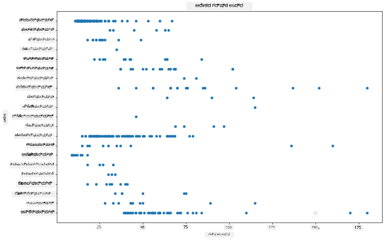
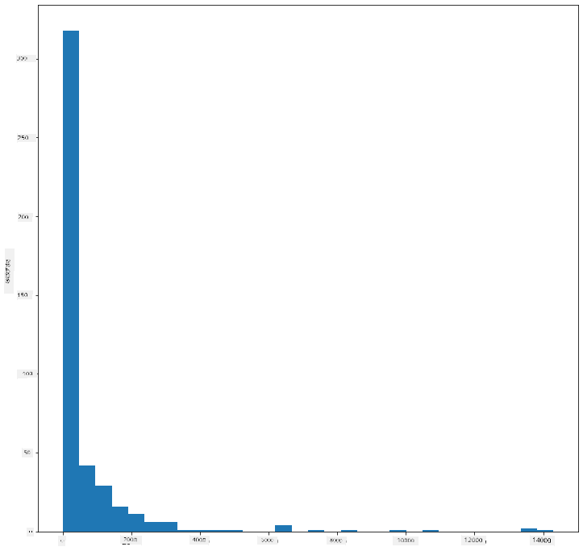
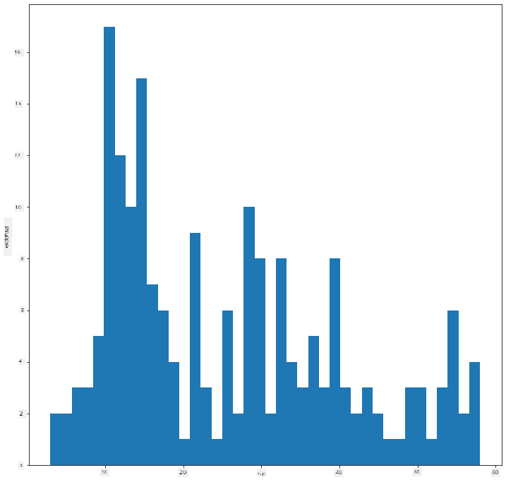
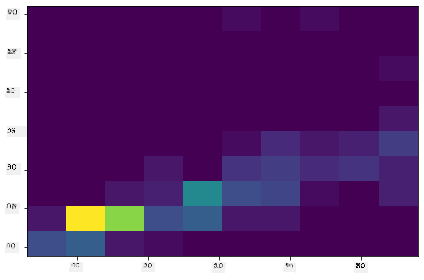
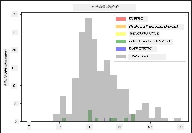
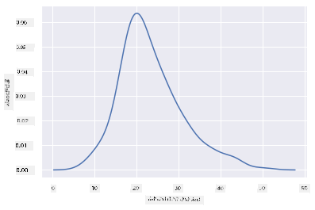
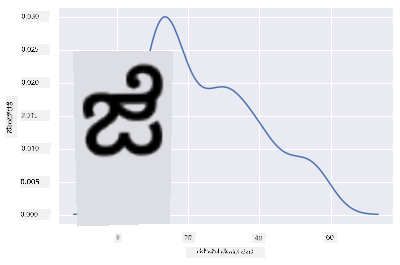
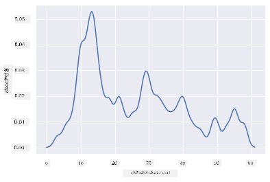
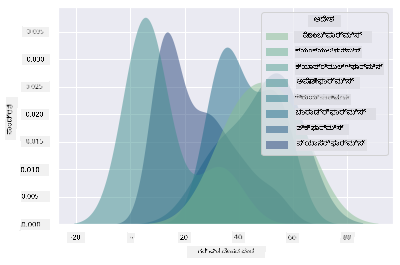
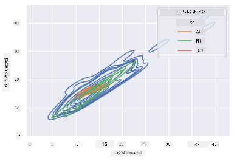

<!--
CO_OP_TRANSLATOR_METADATA:
{
  "original_hash": "80a20467e046d312809d008395051fc7",
  "translation_date": "2025-12-19T15:55:45+00:00",
  "source_file": "3-Data-Visualization/10-visualization-distributions/README.md",
  "language_code": "kn"
}
-->
# ವಿತರಣೆಯನ್ನು ದೃಶ್ಯೀಕರಿಸುವುದು

| ಅವರಿಂದ ಸ್ಕೆಚ್ ನೋಟ್ ](../../sketchnotes/10-Visualizing-Distributions.png)|
|:---:|
| ವಿತರಣೆಯನ್ನು ದೃಶ್ಯೀಕರಿಸುವುದು - _[@nitya](https://twitter.com/nitya) ಅವರಿಂದ ಸ್ಕೆಚ್ ನೋಟ್_ |

ಹಿಂದಿನ ಪಾಠದಲ್ಲಿ, ನೀವು ಮಿನೆಸೋಟಾದ ಪಕ್ಷಿಗಳ ಬಗ್ಗೆ ಡೇಟಾಸೆಟ್ ಬಗ್ಗೆ ಕೆಲವು ಆಸಕ್ತಿದಾಯಕ ವಾಸ್ತವಗಳನ್ನು ಕಲಿತಿರಿ. ನೀವು ಔಟ್‌ಲೈಯರ್‌ಗಳನ್ನು ದೃಶ್ಯೀಕರಿಸುವ ಮೂಲಕ ಕೆಲವು ದೋಷಪೂರಿತ ಡೇಟಾವನ್ನು ಕಂಡುಹಿಡಿದಿರಿ ಮತ್ತು ಪಕ್ಷಿ ವರ್ಗಗಳ ಗರಿಷ್ಠ ಉದ್ದದ ನಡುವಿನ ವ್ಯತ್ಯಾಸಗಳನ್ನು ನೋಡಿದಿರಿ.

## [ಪೂರ್ವ-ಪಾಠ ಕ್ವಿಜ್](https://ff-quizzes.netlify.app/en/ds/quiz/18)
## ಪಕ್ಷಿಗಳ ಡೇಟಾಸೆಟ್ ಅನ್ನು ಅನ್ವೇಷಿಸಿ

ಡೇಟಾವನ್ನು ತವಕದಿಂದ ಪರಿಶೀಲಿಸುವ ಮತ್ತೊಂದು ವಿಧಾನವೆಂದರೆ ಅದರ ವಿತರಣೆಯನ್ನು ನೋಡುವುದು, ಅಥವಾ ಡೇಟಾ ಒಂದು ಅಕ್ಷದ ಮೇಲೆ ಹೇಗೆ ಸಂಘಟಿತವಾಗಿದೆ ಎಂಬುದನ್ನು ನೋಡುವುದು. ಉದಾಹರಣೆಗೆ, ನೀವು ಈ ಡೇಟಾಸೆಟ್‌ನ ಮಿನೆಸೋಟಾದ ಪಕ್ಷಿಗಳ ಗರಿಷ್ಠ ರೆಕ್ಕೆ ವಿಸ್ತಾರ ಅಥವಾ ಗರಿಷ್ಠ ದೇಹ ಭಾರದ ಸಾಮಾನ್ಯ ವಿತರಣೆಯನ್ನು ತಿಳಿದುಕೊಳ್ಳಲು ಇಚ್ಛಿಸಬಹುದು.

ಈ ಡೇಟಾಸೆಟ್‌ನ ಡೇಟಾ ವಿತರಣೆಯ ಬಗ್ಗೆ ಕೆಲವು ವಾಸ್ತವಗಳನ್ನು ಕಂಡುಹಿಡಿಯೋಣ. ಈ ಪಾಠದ ರೂಟ್ ಫೋಲ್ಡರ್‌ನ _notebook.ipynb_ ಫೈಲ್‌ನಲ್ಲಿ, Pandas, Matplotlib ಮತ್ತು ನಿಮ್ಮ ಡೇಟಾವನ್ನು ಆಮದುಮಾಡಿ:

```python
import pandas as pd
import matplotlib.pyplot as plt
birds = pd.read_csv('../../data/birds.csv')
birds.head()
```

|      | ಹೆಸರು                         | ವೈಜ್ಞಾನಿಕ ಹೆಸರು         | ವರ್ಗ                  | ಕ್ರಮ          | ಕುಟುಂಬ    | ಜನಸ್       | ಸಂರಕ್ಷಣಾ ಸ್ಥಿತಿ    | ಕನಿಷ್ಠ ಉದ್ದ | ಗರಿಷ್ಠ ಉದ್ದ | ಕನಿಷ್ಠ ದೇಹ ಭಾರ | ಗರಿಷ್ಠ ದೇಹ ಭಾರ | ಕನಿಷ್ಠ ರೆಕ್ಕೆ ವಿಸ್ತಾರ | ಗರಿಷ್ಠ ರೆಕ್ಕೆ ವಿಸ್ತಾರ |
| ---: | :--------------------------- | :--------------------- | :-------------------- | :----------- | :------- | :---------- | :----------------- | --------: | --------: | ----------: | ----------: | ----------: | ----------: |
|    0 | ಕಪ್ಪು ಹೊಟ್ಟೆ ಹೊಳಪಿನ ಬಾತುಕೋಳಿ | Dendrocygna autumnalis | ಬಾತುಕೋಳಿ/ಹಂಸ/ನೀರಾಜೀವಿ | Anseriformes | Anatidae | Dendrocygna | LC                 |        47 |        56 |         652 |        1020 |          76 |          94 |
|    1 | ಫುಲ್ವಸ್ ಹೊಳಪಿನ ಬಾತುಕೋಳಿ       | Dendrocygna bicolor    | ಬಾತುಕೋಳಿ/ಹಂಸ/ನೀರಾಜೀವಿ | Anseriformes | Anatidae | Dendrocygna | LC                 |        45 |        53 |         712 |        1050 |          85 |          93 |
|    2 | ಹಿಮ ಹಂಸ                     | Anser caerulescens     | ಬಾತುಕೋಳಿ/ಹಂಸ/ನೀರಾಜೀವಿ | Anseriformes | Anatidae | Anser       | LC                 |        64 |        79 |        2050 |        4050 |         135 |         165 |
|    3 | ರಾಸ್ ಹಂಸ                   | Anser rossii           | ಬಾತುಕೋಳಿ/ಹಂಸ/ನೀರಾಜೀವಿ | Anseriformes | Anatidae | Anser       | LC                 |      57.3 |        64 |        1066 |        1567 |         113 |         116 |
|    4 | ದೊಡ್ಡ ಬಿಳಿ ಮುಂಭಾಗದ ಹಂಸ      | Anser albifrons        | ಬಾತುಕೋಳಿ/ಹಂಸ/ನೀರಾಜೀವಿ | Anseriformes | Anatidae | Anser       | LC                 |        64 |        81 |        1930 |        3310 |         130 |         165 |


ಸಾಮಾನ್ಯವಾಗಿ, ನೀವು ಹಿಂದಿನ ಪಾಠದಲ್ಲಿ ಮಾಡಿದಂತೆ ಸ್ಕ್ಯಾಟರ್ ಪ್ಲಾಟ್ ಬಳಸಿ ಡೇಟಾ ಹೇಗೆ ವಿತರಿಸಲಾಗಿದೆ ಎಂಬುದನ್ನು ತ್ವರಿತವಾಗಿ ನೋಡಬಹುದು:

```python
birds.plot(kind='scatter',x='MaxLength',y='Order',figsize=(12,8))

plt.title('Max Length per Order')
plt.ylabel('Order')
plt.xlabel('Max Length')

plt.show()
```


ಇದು ಪಕ್ಷಿ ಕ್ರಮದ ಪ್ರತಿ ದೇಹ ಉದ್ದದ ಸಾಮಾನ್ಯ ವಿತರಣೆಯ ಅವಲೋಕನವನ್ನು ನೀಡುತ್ತದೆ, ಆದರೆ ಇದು ನಿಜವಾದ ವಿತರಣೆಯನ್ನು ಪ್ರದರ್ಶಿಸಲು ಅತ್ಯುತ್ತಮ ವಿಧಾನವಲ್ಲ. ಆ ಕಾರ್ಯವನ್ನು ಸಾಮಾನ್ಯವಾಗಿ ಹಿಸ್ಟೋಗ್ರಾಮ್ ರಚಿಸುವ ಮೂಲಕ ನಿರ್ವಹಿಸಲಾಗುತ್ತದೆ.
## ಹಿಸ್ಟೋಗ್ರಾಮ್‌ಗಳೊಂದಿಗೆ ಕೆಲಸ

Matplotlib ಡೇಟಾ ವಿತರಣೆಯನ್ನು ದೃಶ್ಯೀಕರಿಸಲು ಅತ್ಯುತ್ತಮ ವಿಧಾನಗಳನ್ನು ಒದಗಿಸುತ್ತದೆ. ಈ ರೀತಿಯ ಚಾರ್ಟ್ ಒಂದು ಬಾರ್ ಚಾರ್ಟ್ ಹೋಲುತ್ತದೆ, ಇಲ್ಲಿ ಬಾರ್‌ಗಳ ಏರಿಕೆ ಮತ್ತು ಇಳಿಕೆಯಿಂದ ವಿತರಣೆಯನ್ನು ನೋಡಬಹುದು. ಹಿಸ್ಟೋಗ್ರಾಮ್ ರಚಿಸಲು, ನಿಮಗೆ ಸಂಖ್ಯಾತ್ಮಕ ಡೇಟಾ ಬೇಕಾಗುತ್ತದೆ. ಹಿಸ್ಟೋಗ್ರಾಮ್ ರಚಿಸಲು, 'hist' ಎಂಬ ಕಿಂಡ್ ಅನ್ನು ನಿರ್ಧರಿಸಿ ಚಾರ್ಟ್ ಅನ್ನು ಪ್ಲಾಟ್ ಮಾಡಬಹುದು. ಈ ಚಾರ್ಟ್ ಸಂಪೂರ್ಣ ಡೇಟಾಸೆಟ್‌ನ ಸಂಖ್ಯಾತ್ಮಕ ಡೇಟಾದ ಶ್ರೇಣಿಗೆ ಸಂಬಂಧಿಸಿದ MaxBodyMass ವಿತರಣೆಯನ್ನು ತೋರಿಸುತ್ತದೆ. ಡೇಟಾ ಸರಣಿಯನ್ನು ಸಣ್ಣ ಬಿನ್‌ಗಳಾಗಿ ವಿಭಜಿಸುವ ಮೂಲಕ, ಅದು ಡೇಟಾ ಮೌಲ್ಯಗಳ ವಿತರಣೆಯನ್ನು ಪ್ರದರ್ಶಿಸಬಹುದು:

```python
birds['MaxBodyMass'].plot(kind = 'hist', bins = 10, figsize = (12,12))
plt.show()
```


ನೀವು ನೋಡಬಹುದು, ಈ ಡೇಟಾಸೆಟ್‌ನ 400+ ಪಕ್ಷಿಗಳಲ್ಲಿ ಬಹುತೇಕವು Max Body Mass ಗಾಗಿ 2000 ಕ್ಕಿಂತ ಕಡಿಮೆ ಶ್ರೇಣಿಯಲ್ಲಿ ಬರುತ್ತವೆ. `bins` ಪರಿಮಾಣವನ್ನು 30 ರಂತಹ ಹೆಚ್ಚಿನ ಸಂಖ್ಯೆಗೆ ಬದಲಾಯಿಸುವ ಮೂಲಕ ಡೇಟಾದ ಬಗ್ಗೆ ಹೆಚ್ಚಿನ ಒಳನೋಟವನ್ನು ಪಡೆಯಿರಿ:

```python
birds['MaxBodyMass'].plot(kind = 'hist', bins = 30, figsize = (12,12))
plt.show()
```


ಈ ಚಾರ್ಟ್ ಸ್ವಲ್ಪ ಹೆಚ್ಚು ಸೂಕ್ಷ್ಮ ರೀತಿಯಲ್ಲಿ ವಿತರಣೆಯನ್ನು ತೋರಿಸುತ್ತದೆ. ಎಡಕ್ಕೆ ಕಡಿಮೆ ತಿರುವು ಹೊಂದಿರುವ ಚಾರ್ಟ್ ಅನ್ನು ನೀವು ನೀಡಲಾದ ಶ್ರೇಣಿಯೊಳಗಿನ ಡೇಟಾವನ್ನು ಮಾತ್ರ ಆಯ್ಕೆಮಾಡುವ ಮೂಲಕ ರಚಿಸಬಹುದು:

ನಿಮ್ಮ ಡೇಟಾವನ್ನು ಫಿಲ್ಟರ್ ಮಾಡಿ, ದೇಹ ಭಾರವು 60 ಕ್ಕಿಂತ ಕಡಿಮೆ ಇರುವ ಪಕ್ಷಿಗಳನ್ನು ಮಾತ್ರ ತೆಗೆದುಕೊಳ್ಳಿ ಮತ್ತು 40 `bins` ತೋರಿಸಿ:

```python
filteredBirds = birds[(birds['MaxBodyMass'] > 1) & (birds['MaxBodyMass'] < 60)]      
filteredBirds['MaxBodyMass'].plot(kind = 'hist',bins = 40,figsize = (12,12))
plt.show()     
```


✅ ಇನ್ನಷ್ಟು ಫಿಲ್ಟರ್‌ಗಳು ಮತ್ತು ಡೇಟಾ ಪಾಯಿಂಟ್‌ಗಳನ್ನು ಪ್ರಯತ್ನಿಸಿ. ಡೇಟಾದ ಸಂಪೂರ್ಣ ವಿತರಣೆಯನ್ನು ನೋಡಲು, `['MaxBodyMass']` ಫಿಲ್ಟರ್ ಅನ್ನು ತೆಗೆದುಹಾಕಿ ಲೇಬಲ್ ಮಾಡಲಾದ ವಿತರಣೆಯನ್ನು ತೋರಿಸಿ.

ಹಿಸ್ಟೋಗ್ರಾಮ್ ಕೆಲವು ಸುಂದರ ಬಣ್ಣ ಮತ್ತು ಲೇಬಲಿಂಗ್ ಸುಧಾರಣೆಗಳನ್ನು ಸಹ ಒದಗಿಸುತ್ತದೆ:

ಎರಡು ವಿತರಣೆಗಳ ನಡುವಿನ ಸಂಬಂಧವನ್ನು ಹೋಲಿಸಲು 2D ಹಿಸ್ಟೋಗ್ರಾಮ್ ರಚಿಸಿ. `MaxBodyMass` ಮತ್ತು `MaxLength` ಅನ್ನು ಹೋಲಿಸಿ. Matplotlib ಪ್ರಕಾಶಮಾನ ಬಣ್ಣಗಳನ್ನು ಬಳಸಿ ಸಂಯೋಜನೆಯನ್ನು ತೋರಿಸುವ ನಿರ್ಮಿತ ವಿಧಾನವನ್ನು ಒದಗಿಸುತ್ತದೆ:

```python
x = filteredBirds['MaxBodyMass']
y = filteredBirds['MaxLength']

fig, ax = plt.subplots(tight_layout=True)
hist = ax.hist2d(x, y)
```
ಈ ಎರಡು ಅಂಶಗಳ ನಡುವೆ ನಿರೀಕ್ಷಿತ ಅಕ್ಷದ ಮೇಲೆ ನಿರೀಕ್ಷಿತ ಸಂಬಂಧವಿದೆ, ಒಂದು ವಿಶೇಷವಾಗಿ ಬಲವಾದ ಸಂಯೋಜನೆಯ ಬಿಂದುವಿನೊಂದಿಗೆ:



ಹಿಸ್ಟೋಗ್ರಾಮ್‌ಗಳು ಸಂಖ್ಯಾತ್ಮಕ ಡೇಟಾಗಾಗಿ ಡೀಫಾಲ್ಟ್‌ನಲ್ಲಿ ಚೆನ್ನಾಗಿ ಕೆಲಸ ಮಾಡುತ್ತವೆ. ಪಠ್ಯ ಡೇಟಾ ಪ್ರಕಾರ ವಿತರಣೆಯನ್ನು ನೋಡಬೇಕಾದರೆ ಏನು ಮಾಡಬೇಕು?
## ಪಠ್ಯ ಡೇಟಾ ಬಳಸಿ ವಿತರಣೆಯನ್ನು ಅನ್ವೇಷಿಸಿ

ಈ ಡೇಟಾಸೆಟ್ ಪಕ್ಷಿ ವರ್ಗ ಮತ್ತು ಅದರ ಜನಸ್, ಪ್ರಭೇದ ಮತ್ತು ಕುಟುಂಬದ ಜೊತೆಗೆ ಅದರ ಸಂರಕ್ಷಣಾ ಸ್ಥಿತಿಯ ಬಗ್ಗೆ ಉತ್ತಮ ಮಾಹಿತಿಯನ್ನು ಒಳಗೊಂಡಿದೆ. ಈ ಸಂರಕ್ಷಣಾ ಮಾಹಿತಿಯನ್ನು ಪರಿಶೀಲಿಸೋಣ. ಪಕ್ಷಿಗಳ ಸಂರಕ್ಷಣಾ ಸ್ಥಿತಿಯ ಪ್ರಕಾರ ವಿತರಣೆಯೇನು?

> ✅ ಡೇಟಾಸೆಟ್‌ನಲ್ಲಿ, ಸಂರಕ್ಷಣಾ ಸ್ಥಿತಿಯನ್ನು ವಿವರಿಸಲು ಹಲವಾರು ಸಂಕ್ಷಿಪ್ತ ರೂಪಗಳನ್ನು ಬಳಸಲಾಗಿದೆ. ಈ ಸಂಕ್ಷಿಪ್ತ ರೂಪಗಳು [IUCN Red List Categories](https://www.iucnredlist.org/) ನಿಂದ ಬಂದಿವೆ, ಇದು ಪ್ರಭೇದಗಳ ಸ್ಥಿತಿಯನ್ನು ದಾಖಲಿಸುವ ಸಂಸ್ಥೆ.
> 
> - CR: ಗಂಭೀರವಾಗಿ ಅಪಾಯದಲ್ಲಿದೆ
> - EN: ಅಪಾಯದಲ್ಲಿದೆ
> - EX: ನಾಶವಾಗಿದೆ
> - LC: ಕನಿಷ್ಠ ಚಿಂತನೆ
> - NT: ಸಮೀಪದ ಅಪಾಯದಲ್ಲಿದೆ
> - VU: ಅಸುರಕ್ಷಿತ

ಇವು ಪಠ್ಯ ಆಧಾರಿತ ಮೌಲ್ಯಗಳು ಆದ್ದರಿಂದ ನೀವು ಹಿಸ್ಟೋಗ್ರಾಮ್ ರಚಿಸಲು ಪರಿವರ್ತನೆ ಮಾಡಬೇಕಾಗುತ್ತದೆ. filteredBirds ಡೇಟಾಫ್ರೇಮ್ ಬಳಸಿ, ಅದರ ಸಂರಕ್ಷಣಾ ಸ್ಥಿತಿಯನ್ನು ಕನಿಷ್ಠ ರೆಕ್ಕೆ ವಿಸ್ತಾರದೊಂದಿಗೆ ಪ್ರದರ್ಶಿಸಿ. ನೀವು ಏನು ನೋಡುತ್ತೀರಿ?

```python
x1 = filteredBirds.loc[filteredBirds.ConservationStatus=='EX', 'MinWingspan']
x2 = filteredBirds.loc[filteredBirds.ConservationStatus=='CR', 'MinWingspan']
x3 = filteredBirds.loc[filteredBirds.ConservationStatus=='EN', 'MinWingspan']
x4 = filteredBirds.loc[filteredBirds.ConservationStatus=='NT', 'MinWingspan']
x5 = filteredBirds.loc[filteredBirds.ConservationStatus=='VU', 'MinWingspan']
x6 = filteredBirds.loc[filteredBirds.ConservationStatus=='LC', 'MinWingspan']

kwargs = dict(alpha=0.5, bins=20)

plt.hist(x1, **kwargs, color='red', label='Extinct')
plt.hist(x2, **kwargs, color='orange', label='Critically Endangered')
plt.hist(x3, **kwargs, color='yellow', label='Endangered')
plt.hist(x4, **kwargs, color='green', label='Near Threatened')
plt.hist(x5, **kwargs, color='blue', label='Vulnerable')
plt.hist(x6, **kwargs, color='gray', label='Least Concern')

plt.gca().set(title='Conservation Status', ylabel='Min Wingspan')
plt.legend();
```



ಕನಿಷ್ಠ ರೆಕ್ಕೆ ವಿಸ್ತಾರ ಮತ್ತು ಸಂರಕ್ಷಣಾ ಸ್ಥಿತಿಯ ನಡುವೆ ಉತ್ತಮ ಸಂಬಂಧವಿಲ್ಲದಂತೆ ತೋರುತ್ತದೆ. ಈ ವಿಧಾನವನ್ನು ಬಳಸಿ ಡೇಟಾಸೆಟ್‌ನ ಇತರ ಅಂಶಗಳನ್ನು ಪರೀಕ್ಷಿಸಿ. ನೀವು ಯಾವುದೇ ಸಂಬಂಧವನ್ನು ಕಂಡುಕೊಳ್ಳುತ್ತೀರಾ?

## ಸಾಂದ್ರತೆ ಪ್ಲಾಟ್‌ಗಳು

ನೀವು ಗಮನಿಸಿದ್ದೀರಾ, ನಾವು ಈಗಾಗಲೇ ನೋಡಿದ ಹಿಸ್ಟೋಗ್ರಾಮ್‌ಗಳು 'ಹಂತದ' ಆಗಿದ್ದು, ಸೌಮ್ಯವಾಗಿ ವಕ್ರವಾಗಿ ಹರಿಯುವುದಿಲ್ಲ. ಸೌಮ್ಯವಾದ ಸಾಂದ್ರತೆ ಚಾರ್ಟ್ ತೋರಿಸಲು, ನೀವು ಸಾಂದ್ರತೆ ಪ್ಲಾಟ್ ಪ್ರಯತ್ನಿಸಬಹುದು.

ಸಾಂದ್ರತೆ ಪ್ಲಾಟ್‌ಗಳೊಂದಿಗೆ ಕೆಲಸ ಮಾಡಲು, ಹೊಸ ಪ್ಲಾಟಿಂಗ್ ಲೈಬ್ರರಿ [Seaborn](https://seaborn.pydata.org/generated/seaborn.kdeplot.html) ಅನ್ನು ಪರಿಚಯಿಸಿಕೊಳ್ಳಿ.

Seaborn ಅನ್ನು ಲೋಡ್ ಮಾಡಿ, ಮೂಲಭೂತ ಸಾಂದ್ರತೆ ಪ್ಲಾಟ್ ಪ್ರಯತ್ನಿಸಿ:

```python
import seaborn as sns
import matplotlib.pyplot as plt
sns.kdeplot(filteredBirds['MinWingspan'])
plt.show()
```


ನೀವು ನೋಡಬಹುದು, ಈ ಪ್ಲಾಟ್ ಕನಿಷ್ಠ ರೆಕ್ಕೆ ವಿಸ್ತಾರದ ಡೇಟಾಗಾಗಿ ಹಿಂದಿನದನ್ನು ಪ್ರತಿಧ್ವನಿಸುತ್ತದೆ; ಅದು ಸ್ವಲ್ಪ ಸೌಮ್ಯವಾಗಿದೆ. Seaborn ನ ಡಾಕ್ಯುಮೆಂಟೇಶನ್ ಪ್ರಕಾರ, "ಹಿಸ್ಟೋಗ್ರಾಮ್‌ಗೆ ಹೋಲಿಸಿದರೆ, KDE ಒಂದು ಚಾರ್ಟ್ ಅನ್ನು ಉತ್ಪಾದಿಸಬಹುದು ಅದು ಕಡಿಮೆ ಗೊಂದಲಕಾರಿಯಾಗಿದ್ದು ಮತ್ತು ಹೆಚ್ಚು ಅರ್ಥಮಾಡಿಕೊಳ್ಳಬಹುದಾಗಿದೆ, ವಿಶೇಷವಾಗಿ ಬಹು ವಿತರಣೆಗಳನ್ನು ಚಿತ್ರಿಸುವಾಗ. ಆದರೆ ಮೂಲ ವಿತರಣೆಯು ಸೀಮಿತ ಅಥವಾ ಸೌಮ್ಯವಲ್ಲದಿದ್ದರೆ ವಕ್ರತೆಯು ಬದಲಾವಣೆಗಳನ್ನು ಪರಿಚಯಿಸುವ ಸಾಧ್ಯತೆ ಇದೆ. ಹಿಸ್ಟೋಗ್ರಾಮ್ ಹೋಲಾಗಿ, ಪ್ರತಿನಿಧಾನದ ಗುಣಮಟ್ಟವು ಉತ್ತಮ ಸ್ಮೂಥಿಂಗ್ ಪರಿಮಾಣಗಳ ಆಯ್ಕೆಯ ಮೇಲೂ ಅವಲಂಬಿತವಾಗಿದೆ." [ಮೂಲ](https://seaborn.pydata.org/generated/seaborn.kdeplot.html) ಎಂದರೆ, ಔಟ್‌ಲೈಯರ್‌ಗಳು ಯಾವಾಗಲೂ ನಿಮ್ಮ ಚಾರ್ಟ್‌ಗಳನ್ನು ಕೆಟ್ಟ ರೀತಿಯಲ್ಲಿ ವರ್ತಿಸುವಂತೆ ಮಾಡುತ್ತವೆ.

ನೀವು ಎರಡನೇ ಚಾರ್ಟ್‌ನಲ್ಲಿ ರಚಿಸಿದ ಆ ಜಾಗದ MaxBodyMass ರೇಖೆಯನ್ನು ಮರುಪರಿಶೀಲಿಸಲು ಬಯಸಿದರೆ, ಈ ವಿಧಾನವನ್ನು ಬಳಸಿ ಅದನ್ನು ಚೆನ್ನಾಗಿ ಸ್ಮೂಥ್ ಮಾಡಬಹುದು:

```python
sns.kdeplot(filteredBirds['MaxBodyMass'])
plt.show()
```


ನೀವು ಸ್ಮೂಥ್ ಆಗಿದ್ದರೂ ಹೆಚ್ಚು ಸ್ಮೂಥ್ ಆಗದ ರೇಖೆಯನ್ನು ಬಯಸಿದರೆ, `bw_adjust` ಪರಿಮಾಣವನ್ನು ಸಂಪಾದಿಸಿ:

```python
sns.kdeplot(filteredBirds['MaxBodyMass'], bw_adjust=.2)
plt.show()
```


✅ ಈ ರೀತಿಯ ಪ್ಲಾಟ್‌ಗೆ ಲಭ್ಯವಿರುವ ಪರಿಮಾಣಗಳ ಬಗ್ಗೆ ಓದಿ ಮತ್ತು ಪ್ರಯೋಗ ಮಾಡಿ!

ಈ ರೀತಿಯ ಚಾರ್ಟ್ ಸುಂದರವಾಗಿ ವಿವರಣಾತ್ಮಕ ದೃಶ್ಯೀಕರಣಗಳನ್ನು ಒದಗಿಸುತ್ತದೆ. ಕೆಲವು ಸಾಲುಗಳ ಕೋಡ್‌ನೊಂದಿಗೆ, ಉದಾಹರಣೆಗೆ, ನೀವು ಪಕ್ಷಿ ಕ್ರಮ ಪ್ರತಿ ಗರಿಷ್ಠ ದೇಹ ಭಾರ ಸಾಂದ್ರತೆಯನ್ನು ತೋರಿಸಬಹುದು:

```python
sns.kdeplot(
   data=filteredBirds, x="MaxBodyMass", hue="Order",
   fill=True, common_norm=False, palette="crest",
   alpha=.5, linewidth=0,
)
```



ನೀವು ಒಂದೇ ಚಾರ್ಟ್‌ನಲ್ಲಿ ಹಲವಾರು ಚರಗಳ ಸಾಂದ್ರತೆಯನ್ನು ನಕ್ಷೆ ಮಾಡಬಹುದು. ಪಕ್ಷಿಯ MaxLength ಮತ್ತು MinLength ಅನ್ನು ಅದರ ಸಂರಕ್ಷಣಾ ಸ್ಥಿತಿಯೊಂದಿಗೆ ಹೋಲಿಸಿ:

```python
sns.kdeplot(data=filteredBirds, x="MinLength", y="MaxLength", hue="ConservationStatus")
```



ಬಹುಶಃ 'ಅಸುರಕ್ಷಿತ' ಪಕ್ಷಿಗಳ ಗುಂಪಿನ ಉದ್ದಗಳ ಪ್ರಕಾರ ಅರ್ಥಪೂರ್ಣತೆ ಇದೆ ಅಥವಾ ಇಲ್ಲವೆ ಎಂಬುದನ್ನು ಸಂಶೋಧಿಸುವುದು ಲಾಭದಾಯಕವಾಗಬಹುದು.

## 🚀 ಸವಾಲು

ಹಿಸ್ಟೋಗ್ರಾಮ್‌ಗಳು ಮೂಲ ಸ್ಕ್ಯಾಟರ್ ಪ್ಲಾಟ್‌ಗಳು, ಬಾರ್ ಚಾರ್ಟ್‌ಗಳು ಅಥವಾ ರೇಖಾ ಚಾರ್ಟ್‌ಗಳಿಗಿಂತ ಹೆಚ್ಚು ಸುಧಾರಿತ ಚಾರ್ಟ್‌ಗಳಾಗಿವೆ. ಇಂಟರ್ನೆಟ್‌ನಲ್ಲಿ ಹಿಸ್ಟೋಗ್ರಾಮ್‌ಗಳ ಬಳಕೆಯ ಉತ್ತಮ ಉದಾಹರಣೆಗಳನ್ನು ಹುಡುಕಿ. ಅವು ಹೇಗೆ ಬಳಸಲಾಗುತ್ತವೆ, ಏನು ಪ್ರದರ್ಶಿಸುತ್ತವೆ ಮತ್ತು ಯಾವ ಕ್ಷೇತ್ರಗಳು ಅಥವಾ ವಿಚಾರಣಾ ಪ್ರದೇಶಗಳಲ್ಲಿ ಅವು ಸಾಮಾನ್ಯವಾಗಿ ಬಳಸಲಾಗುತ್ತವೆ?

## [ಪೋಸ್ಟ್-ಪಾಠ ಕ್ವಿಜ್](https://ff-quizzes.netlify.app/en/ds/quiz/19)

## ವಿಮರ್ಶೆ ಮತ್ತು ಸ್ವಯಂ ಅಧ್ಯಯನ

ಈ ಪಾಠದಲ್ಲಿ, ನೀವು Matplotlib ಅನ್ನು ಬಳಸಿದಿರಿ ಮತ್ತು ಹೆಚ್ಚು ಸುಧಾರಿತ ಚಾರ್ಟ್‌ಗಳನ್ನು ತೋರಿಸಲು Seaborn ನಲ್ಲಿ ಕೆಲಸ ಪ್ರಾರಂಭಿಸಿದಿರಿ. Seaborn ನಲ್ಲಿ `kdeplot` ಬಗ್ಗೆ ಸಂಶೋಧನೆ ಮಾಡಿ, ಇದು "ಒಂದು ಅಥವಾ ಹೆಚ್ಚು ಆಯಾಮಗಳಲ್ಲಿ ನಿರಂತರ ಸಾಧ್ಯತೆ ಸಾಂದ್ರತೆ ವಕ್ರ" ಆಗಿದೆ. ಅದು ಹೇಗೆ ಕೆಲಸ ಮಾಡುತ್ತದೆ ಎಂಬುದನ್ನು ಅರ್ಥಮಾಡಿಕೊಳ್ಳಲು [ಡಾಕ್ಯುಮೆಂಟೇಶನ್](https://seaborn.pydata.org/generated/seaborn.kdeplot.html) ಓದಿ.

## ನಿಯೋಜನೆ

[ನಿಮ್ಮ ಕೌಶಲ್ಯಗಳನ್ನು ಅನ್ವಯಿಸಿ](assignment.md)

---

<!-- CO-OP TRANSLATOR DISCLAIMER START -->
**ಅಸ್ವೀಕಾರ**:  
ಈ ದಸ್ತಾವೇಜು [Co-op Translator](https://github.com/Azure/co-op-translator) ಎಂಬ AI ಅನುವಾದ ಸೇವೆಯನ್ನು ಬಳಸಿ ಅನುವಾದಿಸಲಾಗಿದೆ. ನಾವು ಶುದ್ಧತೆಯತ್ತ ಪ್ರಯತ್ನಿಸುತ್ತಿದ್ದರೂ, ಸ್ವಯಂಚಾಲಿತ ಅನುವಾದಗಳಲ್ಲಿ ತಪ್ಪುಗಳು ಅಥವಾ ಅಸತ್ಯತೆಗಳು ಇರಬಹುದು ಎಂದು ದಯವಿಟ್ಟು ಗಮನಿಸಿ. ಮೂಲ ಭಾಷೆಯಲ್ಲಿರುವ ಮೂಲ ದಸ್ತಾವೇಜನ್ನು ಅಧಿಕೃತ ಮೂಲವೆಂದು ಪರಿಗಣಿಸಬೇಕು. ಮಹತ್ವದ ಮಾಹಿತಿಗಾಗಿ, ವೃತ್ತಿಪರ ಮಾನವ ಅನುವಾದವನ್ನು ಶಿಫಾರಸು ಮಾಡಲಾಗುತ್ತದೆ. ಈ ಅನುವಾದ ಬಳಕೆಯಿಂದ ಉಂಟಾಗುವ ಯಾವುದೇ ತಪ್ಪು ಅರ್ಥಮಾಡಿಕೊಳ್ಳುವಿಕೆ ಅಥವಾ ತಪ್ಪು ವಿವರಣೆಗಳಿಗೆ ನಾವು ಹೊಣೆಗಾರರಾಗುವುದಿಲ್ಲ.
<!-- CO-OP TRANSLATOR DISCLAIMER END -->