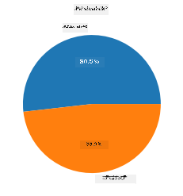
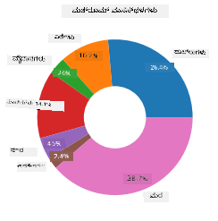
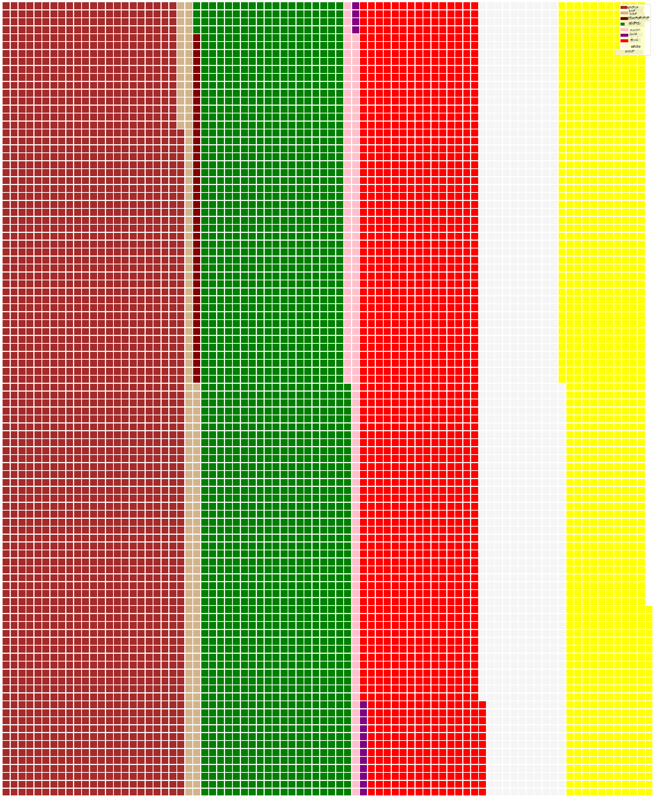

<!--
CO_OP_TRANSLATOR_METADATA:
{
  "original_hash": "42119bcc97bee88254e381156d770f3c",
  "translation_date": "2025-12-19T16:03:58+00:00",
  "source_file": "3-Data-Visualization/11-visualization-proportions/README.md",
  "language_code": "kn"
}
-->
# ಪ್ರಮಾಣಗಳನ್ನು ದೃಶ್ಯೀಕರಿಸುವುದು

| ಅವರ ಸ್ಕೆಚ್ ನೋಟ್ ](../../sketchnotes/11-Visualizing-Proportions.png)|
|:---:|
|ಪ್ರಮಾಣಗಳನ್ನು ದೃಶ್ಯೀಕರಿಸುವುದು - _[@nitya](https://twitter.com/nitya) ಅವರ ಸ್ಕೆಚ್ ನೋಟ್_ |

ಈ ಪಾಠದಲ್ಲಿ, ನೀವು ಪ್ರಾಕೃತಿಕ-ಕೇಂದ್ರೀಕೃತ ಡೇಟಾಸೆಟ್ ಅನ್ನು ಬಳಸಿಕೊಂಡು ಪ್ರಮಾಣಗಳನ್ನು ದೃಶ್ಯೀಕರಿಸುವಿರಿ, ಉದಾಹರಣೆಗೆ, ಮುಷ್ರೂಮ್ಗಳ ಬಗ್ಗೆ ನೀಡಲಾದ ಡೇಟಾಸೆಟ್‌ನಲ್ಲಿ ಎಷ್ಟು ವಿಭಿನ್ನ ಪ್ರಕಾರದ ಫಂಗಿ ಇದ್ದಾರೆ ಎಂಬುದನ್ನು. ನಾವು ಈ ಆಕರ್ಷಕ ಫಂಗಿಗಳನ್ನು Audubon ನಿಂದ ಪಡೆದ 23 ಪ್ರಭೇದಗಳ ಗಿಲ್ಲ್ಡ್ ಮುಷ್ರೂಮ್ಗಳ ವಿವರಗಳನ್ನು ಹೊಂದಿರುವ ಡೇಟಾಸೆಟ್ ಬಳಸಿ ಅನ್ವೇಷಿಸೋಣ. ನೀವು ರುಚಿಕರವಾದ ದೃಶ್ಯೀಕರಣಗಳನ್ನು ಪ್ರಯೋಗಿಸಬಹುದು, ಉದಾಹರಣೆಗೆ:

- ಪೈ ಚಾರ್ಟ್‌ಗಳು 🥧
- ಡೋನಟ್ ಚಾರ್ಟ್‌ಗಳು 🍩
- ವಾಫಲ್ ಚಾರ್ಟ್‌ಗಳು 🧇

> 💡 ಮೈಕ್ರೋಸಾಫ್ಟ್ ರಿಸರ್ಚ್‌ನಿಂದ [Charticulator](https://charticulator.com) ಎಂಬ ಬಹಳ ಆಸಕ್ತಿದಾಯಕ ಯೋಜನೆ ಉಚಿತ ಡ್ರ್ಯಾಗ್ ಮತ್ತು ಡ್ರಾಪ್ ಇಂಟರ್ಫೇಸ್ ಅನ್ನು ಡೇಟಾ ದೃಶ್ಯೀಕರಣಗಳಿಗೆ ನೀಡುತ್ತದೆ. ಅವರ ಟ್ಯುಟೋರಿಯಲ್‌ಗಳಲ್ಲಿ ಒಂದರಲ್ಲಿ ಅವರು ಈ ಮುಷ್ರೂಮ್ ಡೇಟಾಸೆಟ್ ಅನ್ನು ಕೂಡ ಬಳಸುತ್ತಾರೆ! ಆದ್ದರಿಂದ ನೀವು ಡೇಟಾವನ್ನು ಅನ್ವೇಷಿಸಿ ಲೈಬ್ರರಿಯನ್ನು ಒಂದೇ ಸಮಯದಲ್ಲಿ ಕಲಿಯಬಹುದು: [Charticulator ಟ್ಯುಟೋರಿಯಲ್](https://charticulator.com/tutorials/tutorial4.html).

## [ಪೂರ್ವ-ಪಾಠ ಪ್ರಶ್ನೋತ್ತರ](https://ff-quizzes.netlify.app/en/ds/quiz/20)

## ನಿಮ್ಮ ಮುಷ್ರೂಮ್ಗಳನ್ನು ಪರಿಚಯಿಸಿಕೊಳ್ಳಿ 🍄

ಮುಷ್ರೂಮ್ಗಳು ಬಹಳ ಆಸಕ್ತಿದಾಯಕವಾಗಿವೆ. ಅವುಗಳನ್ನು ಅಧ್ಯಯನ ಮಾಡಲು ಡೇಟಾಸೆಟ್ ಅನ್ನು ಆಮದು ಮಾಡೋಣ:

```python
import pandas as pd
import matplotlib.pyplot as plt
mushrooms = pd.read_csv('../../data/mushrooms.csv')
mushrooms.head()
```
ಒಂದು ಟೇಬಲ್ ವಿಶ್ಲೇಷಣೆಗೆ ಉತ್ತಮ ಡೇಟಾ ಸಹಿತ ಮುದ್ರಿತವಾಗಿದೆ:


| ವರ್ಗ       | ಕ್ಯಾಪ್-ಆಕಾರ | ಕ್ಯಾಪ್-ಮೇಲ್ಮೈ | ಕ್ಯಾಪ್-ಬಣ್ಣ | ಗಾಯಗಳು | ವಾಸನೆ  | ಗಿಲ್-ಸಂಯೋಜನೆ | ಗಿಲ್-ಅಂತರ | ಗಿಲ್-ಗಾತ್ರ | ಗಿಲ್-ಬಣ್ಣ | ಸ್ಟಾಕ್-ಆಕಾರ | ಸ್ಟಾಕ್-ಮೂಲ | ರಿಂಗ್ ಮೇಲಿನ ಸ್ಟಾಕ್-ಮೇಲ್ಮೈ | ರಿಂಗ್ ಕೆಳಗಿನ ಸ್ಟಾಕ್-ಮೇಲ್ಮೈ | ರಿಂಗ್ ಮೇಲಿನ ಸ್ಟಾಕ್-ಬಣ್ಣ | ರಿಂಗ್ ಕೆಳಗಿನ ಸ್ಟಾಕ್-ಬಣ್ಣ | ವೀಲ್-ಪ್ರಕಾರ | ವೀಲ್-ಬಣ್ಣ | ರಿಂಗ್-ಸಂಖ್ಯೆ | ರಿಂಗ್-ಪ್ರಕಾರ | ಸ್ಪೋರ್-ಪ್ರಿಂಟ್-ಬಣ್ಣ | ಜನಸಂಖ್ಯೆ | ವಾಸಸ್ಥಳ |
| --------- | --------- | ----------- | --------- | ------- | ------- | --------------- | ------------ | --------- | ---------- | ----------- | ---------- | ------------------------ | ------------------------ | ---------------------- | ---------------------- | --------- | ---------- | ----------- | --------- | ----------------- | ---------- | ------- |
| ವಿಷಕಾರಿ    | ಉಬ್ಬು       | ಸ್ಮೂತ್       | ಬೂದು       | ಗಾಯಗಳು | ತೀವ್ರ    | ಮುಕ್ತ            | ಹತ್ತಿರ        | ಸಣ್ಣ       | ಕಪ್ಪು       | ವಿಸ್ತಾರಗೊಳ್ಳುವ | ಸಮಾನ      | ಸ್ಮೂತ್                   | ಸ್ಮೂತ್                   | ಬಿಳಿ                    | ಬಿಳಿ                    | ಭಾಗಶಃ     | ಬಿಳಿ       | ಒಂದು         | ಪೆಂಡೆಂಟ್   | ಕಪ್ಪು               | ಹರಡಿದ     | ನಗರ    |
| ತಿನ್ನಬಹುದಾದ | ಉಬ್ಬು       | ಸ್ಮೂತ್       | ಹಳದಿ      | ಗಾಯಗಳು | ಬಾದಾಮಿ  | ಮುಕ್ತ            | ಹತ್ತಿರ        | ಅಗಲ       | ಕಪ್ಪು       | ವಿಸ್ತಾರಗೊಳ್ಳುವ | ಕ್ಲಬ್      | ಸ್ಮೂತ್                   | ಸ್ಮೂತ್                   | ಬಿಳಿ                    | ಬಿಳಿ                    | ಭಾಗಶಃ     | ಬಿಳಿ       | ಒಂದು         | ಪೆಂಡೆಂಟ್   | ಬೂದು               | ಬಹಳಷ್ಟು    | ಹುಲ್ಲುಗಳು |
| ತಿನ್ನಬಹುದಾದ | ಘಂಟೆ       | ಸ್ಮೂತ್       | ಬಿಳಿ       | ಗಾಯಗಳು | ಅನೀಸ್  | ಮುಕ್ತ            | ಹತ್ತಿರ        | ಅಗಲ       | ಬೂದು       | ವಿಸ್ತಾರಗೊಳ್ಳುವ | ಕ್ಲಬ್      | ಸ್ಮೂತ್                   | ಸ್ಮೂತ್                   | ಬಿಳಿ                    | ಬಿಳಿ                    | ಭಾಗಶಃ     | ಬಿಳಿ       | ಒಂದು         | ಪೆಂಡೆಂಟ್   | ಬೂದು               | ಬಹಳಷ್ಟು    | ಮೇದೋಸ್  |
| ವಿಷಕಾರಿ    | ಉಬ್ಬು       | ತಿರುವು       | ಬಿಳಿ       | ಗಾಯಗಳು | ತೀವ್ರ    | ಮುಕ್ತ            | ಹತ್ತಿರ        | ಸಣ್ಣ       | ಬೂದು       | ವಿಸ್ತಾರಗೊಳ್ಳುವ | ಸಮಾನ      | ಸ್ಮೂತ್                   | ಸ್ಮೂತ್                   | ಬಿಳಿ                    | ಬಿಳಿ                    | ಭಾಗಶಃ     | ಬಿಳಿ       | ಒಂದು         | ಪೆಂಡೆಂಟ್   | ಕಪ್ಪು               | ಹರಡಿದ     | ನಗರ    |

ತಕ್ಷಣವೇ, ನೀವು ಗಮನಿಸುತ್ತೀರಿ ಎಲ್ಲಾ ಡೇಟಾ ಪಠ್ಯರೂಪದಲ್ಲಿದೆ. ಈ ಡೇಟಾವನ್ನು ಚಾರ್ಟ್‌ನಲ್ಲಿ ಬಳಸಲು ನೀವು ಪರಿವರ್ತನೆ ಮಾಡಬೇಕಾಗುತ್ತದೆ. ಬಹುತೇಕ ಡೇಟಾ ವಾಸ್ತವದಲ್ಲಿ ಒಂದು ವಸ್ತುವಾಗಿ ಪ್ರತಿನಿಧಿಸಲಾಗಿದೆ:

```python
print(mushrooms.select_dtypes(["object"]).columns)
```

ಫಲಿತಾಂಶ:

```output
Index(['class', 'cap-shape', 'cap-surface', 'cap-color', 'bruises', 'odor',
       'gill-attachment', 'gill-spacing', 'gill-size', 'gill-color',
       'stalk-shape', 'stalk-root', 'stalk-surface-above-ring',
       'stalk-surface-below-ring', 'stalk-color-above-ring',
       'stalk-color-below-ring', 'veil-type', 'veil-color', 'ring-number',
       'ring-type', 'spore-print-color', 'population', 'habitat'],
      dtype='object')
```
ಈ ಡೇಟಾವನ್ನು ತೆಗೆದುಕೊಂಡು 'class' ಕಾಲಮ್ ಅನ್ನು ವರ್ಗವಾಗಿ ಪರಿವರ್ತಿಸಿ:

```python
cols = mushrooms.select_dtypes(["object"]).columns
mushrooms[cols] = mushrooms[cols].astype('category')
```

```python
edibleclass=mushrooms.groupby(['class']).count()
edibleclass
```

ಈಗ, ನೀವು ಮುಷ್ರೂಮ್ ಡೇಟಾವನ್ನು ಮುದ್ರಿಸಿದರೆ, ಅದು ವಿಷಕಾರಿ/ತಿನ್ನಬಹುದಾದ ವರ್ಗಗಳ ಪ್ರಕಾರ ವರ್ಗೀಕೃತವಾಗಿದೆ ಎಂದು ಕಾಣಬಹುದು:


|           | ಕ್ಯಾಪ್-ಆಕಾರ | ಕ್ಯಾಪ್-ಮೇಲ್ಮೈ | ಕ್ಯಾಪ್-ಬಣ್ಣ | ಗಾಯಗಳು | ವಾಸನೆ | ಗಿಲ್-ಸಂಯೋಜನೆ | ಗಿಲ್-ಅಂತರ | ಗಿಲ್-ಗಾತ್ರ | ಗಿಲ್-ಬಣ್ಣ | ಸ್ಟಾಕ್-ಆಕಾರ | ... | ರಿಂಗ್ ಕೆಳಗಿನ ಸ್ಟಾಕ್-ಮೇಲ್ಮೈ | ರಿಂಗ್ ಮೇಲಿನ ಸ್ಟಾಕ್-ಬಣ್ಣ | ರಿಂಗ್ ಕೆಳಗಿನ ಸ್ಟಾಕ್-ಬಣ್ಣ | ವೀಲ್-ಪ್ರಕಾರ | ವೀಲ್-ಬಣ್ಣ | ರಿಂಗ್-ಸಂಖ್ಯೆ | ರಿಂಗ್-ಪ್ರಕಾರ | ಸ್ಪೋರ್-ಪ್ರಿಂಟ್-ಬಣ್ಣ | ಜನಸಂಖ್ಯೆ | ವಾಸಸ್ಥಳ |
| --------- | --------- | ----------- | --------- | ------- | ---- | --------------- | ------------ | --------- | ---------- | ----------- | --- | ------------------------ | ---------------------- | ---------------------- | --------- | ---------- | ----------- | --------- | ----------------- | ---------- | ------- |
| ವರ್ಗ       |           |             |           |         |      |                 |              |           |            |             |     |                          |                        |                        |           |            |             |           |                   |            |         |
| ತಿನ್ನಬಹುದಾದ | 4208      | 4208        | 4208      | 4208    | 4208 | 4208            | 4208         | 4208      | 4208       | 4208        | ... | 4208                     | 4208                   | 4208                   | 4208      | 4208       | 4208        | 4208      | 4208              | 4208       | 4208    |
| ವಿಷಕಾರಿ    | 3916      | 3916        | 3916      | 3916    | 3916 | 3916            | 3916         | 3916      | 3916       | 3916        | ... | 3916                     | 3916                   | 3916                   | 3916      | 3916       | 3916        | 3916      | 3916              | 3916       | 3916    |

ನೀವು ಈ ಟೇಬಲ್‌ನಲ್ಲಿ ನೀಡಲಾದ ಕ್ರಮವನ್ನು ಅನುಸರಿಸಿ ನಿಮ್ಮ ವರ್ಗದ ಲೇಬಲ್‌ಗಳನ್ನು ರಚಿಸಿದರೆ, ನೀವು ಪೈ ಚಾರ್ಟ್ ರಚಿಸಬಹುದು:

## ಪೈ!

```python
labels=['Edible','Poisonous']
plt.pie(edibleclass['population'],labels=labels,autopct='%.1f %%')
plt.title('Edible?')
plt.show()
```
ಇದು, ಈ ಎರಡು ಮುಷ್ರೂಮ್ ವರ್ಗಗಳ ಪ್ರಕಾರ ಈ ಡೇಟಾದ ಪ್ರಮಾಣಗಳನ್ನು ತೋರಿಸುವ ಪೈ ಚಾರ್ಟ್. ಲೇಬಲ್‌ಗಳ ಕ್ರಮವನ್ನು ಸರಿಯಾಗಿ ಪಡೆಯುವುದು ಬಹಳ ಮುಖ್ಯ, ವಿಶೇಷವಾಗಿ ಇಲ್ಲಿ, ಆದ್ದರಿಂದ ಲೇಬಲ್ ಅರೆ ಅನ್ನು ರಚಿಸುವ ಕ್ರಮವನ್ನು ಖಚಿತಪಡಿಸಿಕೊಳ್ಳಿ!



## ಡೋನಟ್ಸ್!

ಒಂದು ಸ್ವಲ್ಪ ಹೆಚ್ಚು ದೃಶ್ಯಾತ್ಮಕವಾಗಿ ಆಸಕ್ತಿದಾಯಕ ಪೈ ಚಾರ್ಟ್ ಡೋನಟ್ ಚಾರ್ಟ್ ಆಗಿದೆ, ಇದು ಮಧ್ಯದಲ್ಲಿ ರಂಧ್ರವಿರುವ ಪೈ ಚಾರ್ಟ್. ಈ ವಿಧಾನವನ್ನು ಬಳಸಿ ನಮ್ಮ ಡೇಟಾವನ್ನು ನೋಡೋಣ.

ಮುಷ್ರೂಮ್ಗಳು ಬೆಳೆಯುವ ವಿವಿಧ ವಾಸಸ್ಥಳಗಳನ್ನು ನೋಡಿ:

```python
habitat=mushrooms.groupby(['habitat']).count()
habitat
```
ಇಲ್ಲಿ, ನೀವು ನಿಮ್ಮ ಡೇಟಾವನ್ನು ವಾಸಸ್ಥಳದ ಪ್ರಕಾರ ಗುಂಪು ಮಾಡುತ್ತಿದ್ದೀರಿ. 7 ವಾಸಸ್ಥಳಗಳಿವೆ, ಅವುಗಳನ್ನು ನಿಮ್ಮ ಡೋನಟ್ ಚಾರ್ಟ್ ಲೇಬಲ್‌ಗಳಾಗಿ ಬಳಸಿ:

```python
labels=['Grasses','Leaves','Meadows','Paths','Urban','Waste','Wood']

plt.pie(habitat['class'], labels=labels,
        autopct='%1.1f%%', pctdistance=0.85)
  
center_circle = plt.Circle((0, 0), 0.40, fc='white')
fig = plt.gcf()

fig.gca().add_artist(center_circle)
  
plt.title('Mushroom Habitats')
  
plt.show()
```



ಈ ಕೋಡ್ ಒಂದು ಚಾರ್ಟ್ ಮತ್ತು ಮಧ್ಯದ ವೃತ್ತವನ್ನು ರಚಿಸುತ್ತದೆ, ನಂತರ ಆ ಮಧ್ಯದ ವೃತ್ತವನ್ನು ಚಾರ್ಟ್‌ನಲ್ಲಿ ಸೇರಿಸುತ್ತದೆ. ಮಧ್ಯದ ವೃತ್ತದ ಅಗಲವನ್ನು `0.40` ಅನ್ನು ಬೇರೆ ಮೌಲ್ಯಕ್ಕೆ ಬದಲಾಯಿಸುವ ಮೂಲಕ ಸಂಪಾದಿಸಬಹುದು.

ಡೋನಟ್ ಚಾರ್ಟ್‌ಗಳನ್ನು ಲೇಬಲ್‌ಗಳನ್ನು ಬದಲಾಯಿಸಲು ಹಲವು ರೀತಿಯಲ್ಲಿ ತಿದ್ದುಪಡಿ ಮಾಡಬಹುದು. ವಿಶೇಷವಾಗಿ ಲೇಬಲ್‌ಗಳನ್ನು ಓದಲು ಸುಲಭವಾಗುವಂತೆ ಹೈಲೈಟ್ ಮಾಡಬಹುದು. ಹೆಚ್ಚಿನ ಮಾಹಿತಿಗಾಗಿ [ಡಾಕ್ಸ್](https://matplotlib.org/stable/gallery/pie_and_polar_charts/pie_and_donut_labels.html?highlight=donut) ನೋಡಿ.

ನೀವು ಈಗ ನಿಮ್ಮ ಡೇಟಾವನ್ನು ಗುಂಪುಮಾಡಿ ಅದನ್ನು ಪೈ ಅಥವಾ ಡೋನಟ್ ಆಗಿ ಪ್ರದರ್ಶಿಸುವುದನ್ನು ತಿಳಿದಿದ್ದೀರಿ, ನೀವು ಇತರ ಚಾರ್ಟ್‌ಗಳನ್ನೂ ಅನ್ವೇಷಿಸಬಹುದು. ವಾಫಲ್ ಚಾರ್ಟ್ ಅನ್ನು ಪ್ರಯತ್ನಿಸಿ, ಇದು ಪ್ರಮಾಣವನ್ನು ಅನ್ವೇಷಿಸುವ ಬೇರೆ ರೀತಿಯ ವಿಧಾನ.

## ವಾಫಲ್ಸ್!

'ವಾಫಲ್' ಪ್ರಕಾರದ ಚಾರ್ಟ್ ಪ್ರಮಾಣಗಳನ್ನು 2D ಚೌಕಗಳ ಸರಣಿಯಾಗಿ ದೃಶ್ಯೀಕರಿಸುವ ಬೇರೆ ವಿಧಾನ. ಈ ಡೇಟಾಸೆಟ್‌ನ ಮುಷ್ರೂಮ್ ಕ್ಯಾಪ್ ಬಣ್ಣಗಳ ವಿಭಿನ್ನ ಪ್ರಮಾಣಗಳನ್ನು ದೃಶ್ಯೀಕರಿಸಲು ಪ್ರಯತ್ನಿಸಿ. ಇದಕ್ಕಾಗಿ, ನೀವು [PyWaffle](https://pypi.org/project/pywaffle/) ಎಂಬ ಸಹಾಯಕ ಲೈಬ್ರರಿಯನ್ನು ಸ್ಥಾಪಿಸಿ Matplotlib ಬಳಸಿ:

```python
pip install pywaffle
```

ನಿಮ್ಮ ಡೇಟಾದ ಒಂದು ಭಾಗವನ್ನು ಗುಂಪುಮಾಡಿ:

```python
capcolor=mushrooms.groupby(['cap-color']).count()
capcolor
```

ಲೇಬಲ್‌ಗಳನ್ನು ರಚಿಸಿ ನಂತರ ನಿಮ್ಮ ಡೇಟಾವನ್ನು ಗುಂಪುಮಾಡಿ ವಾಫಲ್ ಚಾರ್ಟ್ ರಚಿಸಿ:

```python
import pandas as pd
import matplotlib.pyplot as plt
from pywaffle import Waffle
  
data ={'color': ['brown', 'buff', 'cinnamon', 'green', 'pink', 'purple', 'red', 'white', 'yellow'],
    'amount': capcolor['class']
     }
  
df = pd.DataFrame(data)
  
fig = plt.figure(
    FigureClass = Waffle,
    rows = 100,
    values = df.amount,
    labels = list(df.color),
    figsize = (30,30),
    colors=["brown", "tan", "maroon", "green", "pink", "purple", "red", "whitesmoke", "yellow"],
)
```

ವಾಫಲ್ ಚಾರ್ಟ್ ಬಳಸಿ, ನೀವು ಈ ಮುಷ್ರೂಮ್ ಡೇಟಾಸೆಟ್‌ನ ಕ್ಯಾಪ್ ಬಣ್ಣಗಳ ಪ್ರಮಾಣಗಳನ್ನು ಸ್ಪಷ್ಟವಾಗಿ ನೋಡಬಹುದು. ಆಸಕ್ತಿದಾಯಕವಾಗಿ, ಇಲ್ಲಿ ಹಲವಾರು ಹಸಿರು ಕ್ಯಾಪ್ ಮುಷ್ರೂಮ್ಗಳು ಇವೆ!



✅ Pywaffle ಚಾರ್ಟ್‌ಗಳಲ್ಲಿ [Font Awesome](https://fontawesome.com/) ನಲ್ಲಿ ಲಭ್ಯವಿರುವ ಯಾವುದೇ ಐಕಾನ್‌ಗಳನ್ನು ಬಳಸುವ ಐಕಾನ್‌ಗಳನ್ನು ಬೆಂಬಲಿಸುತ್ತದೆ. ಚೌಕಗಳ ಬದಲು ಐಕಾನ್‌ಗಳನ್ನು ಬಳಸಿ ಇನ್ನಷ್ಟು ಆಸಕ್ತಿದಾಯಕ ವಾಫಲ್ ಚಾರ್ಟ್ ರಚಿಸಲು ಪ್ರಯೋಗ ಮಾಡಿ.

ಈ ಪಾಠದಲ್ಲಿ, ನೀವು ಪ್ರಮಾಣಗಳನ್ನು ದೃಶ್ಯೀಕರಿಸುವ ಮೂರು ವಿಧಾನಗಳನ್ನು ಕಲಿತಿರಿ. ಮೊದಲು, ನಿಮ್ಮ ಡೇಟಾವನ್ನು ವರ್ಗಗಳಾಗಿ ಗುಂಪುಮಾಡಿ ನಂತರ ಡೇಟಾವನ್ನು ಪ್ರದರ್ಶಿಸುವ ಅತ್ಯುತ್ತಮ ವಿಧಾನವನ್ನು ನಿರ್ಧರಿಸಿ - ಪೈ, ಡೋನಟ್ ಅಥವಾ ವಾಫಲ್. ಎಲ್ಲವೂ ರುಚಿಕರವಾಗಿವೆ ಮತ್ತು ಬಳಕೆದಾರರಿಗೆ ಡೇಟಾಸೆಟ್‌ನ ತಕ್ಷಣದ ದೃಶ್ಯವನ್ನು ನೀಡುತ್ತವೆ.

## 🚀 ಸವಾಲು

ಈ ರುಚಿಕರ ಚಾರ್ಟ್‌ಗಳನ್ನು [Charticulator](https://charticulator.com) ನಲ್ಲಿ ಮರುಸೃಷ್ಟಿಸುವ ಪ್ರಯತ್ನ ಮಾಡಿ.

## [ಪೋಸ್ಟ್-ಪಾಠ ಪ್ರಶ್ನೋತ್ತರ](https://ff-quizzes.netlify.app/en/ds/quiz/21)

## ವಿಮರ್ಶೆ ಮತ್ತು ಸ್ವಯಂ ಅಧ್ಯಯನ

ಯಾವಾಗ ಪೈ, ಡೋನಟ್ ಅಥವಾ ವಾಫಲ್ ಚಾರ್ಟ್ ಬಳಸಬೇಕೆಂದು ಸ್ಪಷ್ಟವಾಗದಿದ್ದಾಗ ಕೆಲವೊಂದು ಲೇಖನಗಳನ್ನು ಓದಿ:

https://www.beautiful.ai/blog/battle-of-the-charts-pie-chart-vs-donut-chart

https://medium.com/@hypsypops/pie-chart-vs-donut-chart-showdown-in-the-ring-5d24fd86a9ce

https://www.mit.edu/~mbarker/formula1/f1help/11-ch-c6.htm

https://medium.datadriveninvestor.com/data-visualization-done-the-right-way-with-tableau-waffle-chart-fdf2a19be402

ಈ ಸಂಕೀರ್ಣ ನಿರ್ಧಾರ ಕುರಿತು ಹೆಚ್ಚಿನ ಮಾಹಿತಿಗಾಗಿ ಸಂಶೋಧನೆ ಮಾಡಿ.

## ಹುದ್ದೆ

[Excel ನಲ್ಲಿ ಪ್ರಯತ್ನಿಸಿ](assignment.md)

---

<!-- CO-OP TRANSLATOR DISCLAIMER START -->
**ಅಸ್ವೀಕರಣ**:  
ಈ ದಸ್ತಾವೇಜು AI ಅನುವಾದ ಸೇವೆ [Co-op Translator](https://github.com/Azure/co-op-translator) ಬಳಸಿ ಅನುವಾದಿಸಲಾಗಿದೆ. ನಾವು ನಿಖರತೆಯಿಗಾಗಿ ಪ್ರಯತ್ನಿಸುತ್ತಿದ್ದರೂ, ಸ್ವಯಂಚಾಲಿತ ಅನುವಾದಗಳಲ್ಲಿ ದೋಷಗಳು ಅಥವಾ ತಪ್ಪುಗಳು ಇರಬಹುದು ಎಂದು ದಯವಿಟ್ಟು ಗಮನಿಸಿ. ಮೂಲ ಭಾಷೆಯಲ್ಲಿರುವ ಮೂಲ ದಸ್ತಾವೇಜನ್ನು ಅಧಿಕೃತ ಮೂಲವಾಗಿ ಪರಿಗಣಿಸಬೇಕು. ಮಹತ್ವದ ಮಾಹಿತಿಗಾಗಿ, ವೃತ್ತಿಪರ ಮಾನವ ಅನುವಾದವನ್ನು ಶಿಫಾರಸು ಮಾಡಲಾಗುತ್ತದೆ. ಈ ಅನುವಾದ ಬಳಕೆಯಿಂದ ಉಂಟಾಗುವ ಯಾವುದೇ ತಪ್ಪು ಅರ್ಥಮಾಡಿಕೊಳ್ಳುವಿಕೆ ಅಥವಾ ತಪ್ಪು ವಿವರಣೆಗಳಿಗೆ ನಾವು ಹೊಣೆಗಾರರಾಗುವುದಿಲ್ಲ.
<!-- CO-OP TRANSLATOR DISCLAIMER END -->